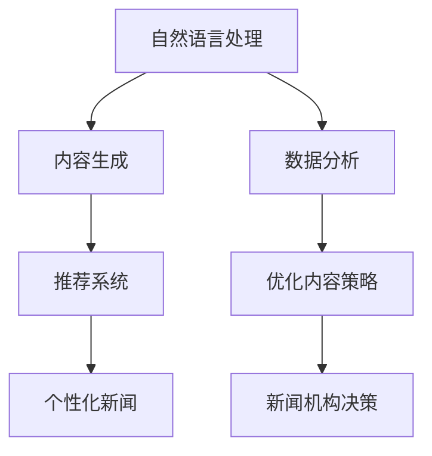

                 

关键词：人工智能，新闻，媒体，内容生成，推荐系统，数据分析，NLP，深度学习，算法，技术应用，案例分析

> 摘要：本文将深入探讨人工智能（AI）在新闻和媒体领域中的应用，包括内容生成、推荐系统、数据分析等关键技术。通过分析现有的成功案例，讨论AI对传统新闻业的影响，并预测未来的发展趋势与挑战。

## 1. 背景介绍

新闻和媒体行业是信息传播和社会互动的核心。然而，随着信息量的爆炸式增长，传统新闻业面临着内容生产效率低下、信息过载和受众分散等问题。人工智能技术的快速发展为解决这些问题提供了新的思路和工具。AI在新闻和媒体领域的应用，主要包括以下几个方面：

- **内容生成**：利用自然语言处理（NLP）和生成对抗网络（GAN）等技术，自动化生产新闻内容。
- **推荐系统**：通过机器学习和深度学习算法，为用户推荐个性化新闻。
- **数据分析**：利用大数据技术对新闻内容和受众行为进行分析，以优化内容策略和营销策略。
- **语音识别与生成**：利用语音识别和文本到语音（TTS）技术，实现新闻的音频化传播。

### 1.1. 人工智能在新闻和媒体领域的应用现状

目前，AI已经在新闻和媒体领域得到了广泛应用。许多新闻机构开始采用AI技术来提高内容生产的效率和质量。例如，《华盛顿邮报》利用AI技术自动生成财经新闻，每分钟可以生成约250篇新闻文章。同时，许多新闻平台如今日头条、YouTube等也运用AI推荐系统，为用户推荐个性化新闻内容。

### 1.2. AI对传统新闻业的影响

AI技术的应用，对传统新闻业产生了深远的影响：

- **变革内容生产方式**：AI能够自动化生成大量新闻内容，减少人力成本，提高生产效率。
- **提升内容个性化**：AI推荐系统能够根据用户兴趣和行为数据，为用户提供个性化新闻，提升用户体验。
- **数据驱动的决策**：AI可以对新闻内容和受众行为进行深入分析，为新闻机构提供数据驱动的决策支持。
- **挑战新闻业道德和伦理**：AI在新闻领域的应用也引发了关于隐私、偏见和新闻真实性的讨论。

## 2. 核心概念与联系

为了深入理解AI在新闻和媒体领域的应用，我们需要掌握以下几个核心概念：

- **自然语言处理（NLP）**：NLP是AI的一个重要分支，它使得计算机能够理解和处理人类语言。
- **深度学习**：深度学习是一种基于人工神经网络的机器学习技术，能够通过大量的数据学习复杂的特征和模式。
- **推荐系统**：推荐系统是一种基于用户行为和偏好数据，为用户推荐相关内容的技术。
- **大数据技术**：大数据技术能够处理海量数据，为AI分析提供支持。

以下是一个简单的 Mermaid 流程图，展示了这些核心概念之间的关系：



### 2.1. 自然语言处理（NLP）在新闻和媒体领域的应用

NLP技术在新闻和媒体领域的应用非常广泛，主要包括以下几个方面：

- **内容生成**：通过分析现有的新闻文本，NLP可以生成新的新闻内容，例如财经新闻、体育新闻等。
- **情感分析**：通过分析新闻文本的情感倾向，可以帮助新闻机构了解公众对某一事件的看法。
- **自动摘要**：NLP可以自动生成新闻的摘要，提高用户的阅读效率。

### 2.2. 深度学习在新闻和媒体领域的应用

深度学习技术在新闻和媒体领域的应用主要包括：

- **图像识别与处理**：用于识别新闻中的图像和视频内容，提高内容理解和分析能力。
- **语音识别与合成**：用于实现新闻的语音化传播，如新闻播报、音频节目等。
- **文本分类与标注**：用于对大量新闻文本进行分类和标注，以支持推荐系统和数据分析。

### 2.3. 推荐系统在新闻和媒体领域的应用

推荐系统在新闻和媒体领域的应用主要包括：

- **个性化推荐**：根据用户的阅读历史和兴趣，推荐用户可能感兴趣的新闻内容。
- **内容分类**：将新闻内容分类到不同的主题和标签，以方便用户浏览和搜索。
- **广告投放**：根据用户的兴趣和行为，推荐相关的广告内容。

### 2.4. 大数据技术

大数据技术在新闻和媒体领域的应用主要包括：

- **数据分析**：对海量的新闻文本和用户行为数据进行分析，以了解新闻热点和受众需求。
- **预测分析**：通过分析历史数据，预测未来的新闻热点和趋势。
- **优化内容策略**：根据数据分析结果，调整新闻内容的生产和推荐策略，以提高用户满意度和广告收入。

## 3. 核心算法原理 & 具体操作步骤

### 3.1. 算法原理概述

AI在新闻和媒体领域的核心算法主要包括自然语言处理（NLP）算法、深度学习算法和推荐系统算法。

- **NLP算法**：如词向量模型（Word2Vec、GloVe）、文本分类算法（SVM、CNN）、情感分析算法（LSTM、GRU）等。
- **深度学习算法**：如卷积神经网络（CNN）、循环神经网络（RNN）、生成对抗网络（GAN）等。
- **推荐系统算法**：如基于内容的推荐（CTR模型、矩阵分解）、协同过滤（用户基于物品、物品基于用户）等。

### 3.2. 算法步骤详解

#### 3.2.1. 自然语言处理（NLP）算法

1. **数据预处理**：对新闻文本进行清洗和预处理，包括去除停用词、标点符号、进行词干提取等。
2. **特征提取**：将预处理后的文本转化为计算机可以理解的数字形式，如词向量、TF-IDF等。
3. **模型训练**：使用已标注的数据集，训练NLP模型，如文本分类模型、情感分析模型等。
4. **模型评估与优化**：使用验证集和测试集评估模型的性能，并进行优化。

#### 3.2.2. 深度学习算法

1. **数据预处理**：与NLP算法类似，对新闻文本进行预处理。
2. **模型构建**：构建深度学习模型，如CNN、RNN等。
3. **模型训练**：使用预处理后的文本数据，训练深度学习模型。
4. **模型评估与优化**：使用验证集和测试集评估模型的性能，并进行优化。

#### 3.2.3. 推荐系统算法

1. **数据预处理**：对用户行为数据（如点击、评论、分享等）进行清洗和预处理。
2. **特征提取**：提取用户和物品的特征，如用户兴趣标签、物品内容标签等。
3. **模型训练**：构建推荐系统模型，如基于内容的推荐模型、协同过滤模型等。
4. **模型评估与优化**：使用A/B测试等方法评估模型的性能，并进行优化。

### 3.3. 算法优缺点

#### 自然语言处理（NLP）算法

- **优点**：能够对大量新闻文本进行高效处理和分析，实现内容生成、情感分析、自动摘要等功能。
- **缺点**：对大量标注数据进行依赖，训练时间较长，且在处理长文本和复杂语义时存在一定挑战。

#### 深度学习算法

- **优点**：能够自动提取文本特征，处理复杂语义，实现图像识别和语音合成等功能。
- **缺点**：对计算资源要求较高，训练时间较长，且在处理小样本数据时效果可能较差。

#### 推荐系统算法

- **优点**：能够为用户推荐个性化新闻，提高用户满意度和留存率。
- **缺点**：在处理冷启动问题（即新用户或新物品没有足够的数据）时效果较差。

### 3.4. 算法应用领域

AI算法在新闻和媒体领域的应用非常广泛，包括但不限于以下几个方面：

- **内容生成**：用于自动化生产财经新闻、体育新闻等。
- **推荐系统**：用于为用户推荐个性化新闻，提高用户粘性和阅读量。
- **数据分析**：用于分析新闻热点、受众行为和广告效果，为新闻机构提供决策支持。
- **语音识别与生成**：用于实现新闻的语音化传播，如新闻播报、音频节目等。

## 4. 数学模型和公式 & 详细讲解 & 举例说明

### 4.1. 数学模型构建

在AI新闻和媒体领域，常用的数学模型包括词向量模型、文本分类模型、推荐系统模型等。以下将分别介绍这些模型的构建方法。

#### 4.1.1. 词向量模型

词向量模型是将词汇映射到高维空间中的向量，以便计算机能够理解和处理。常用的词向量模型有Word2Vec和GloVe。

- **Word2Vec模型**：

  $$ \text{Word2Vec} = \{ \text{Skip-Gram}，\text{Continuous Bag of Words} \} $$

  其中，Skip-Gram模型通过预测单词周围的单词来训练词向量，而Continuous Bag of Words模型则通过将词汇序列映射到高维空间中的连续向量来训练词向量。

- **GloVe模型**：

  $$ \text{GloVe} = \{ \text{Global Vectors for Word Representation} \} $$

  GloVe模型通过最小化单词共现矩阵与词向量矩阵之间的误差来训练词向量。

#### 4.1.2. 文本分类模型

文本分类模型用于对新闻文本进行分类，常用的模型有SVM、CNN、LSTM等。

- **SVM模型**：

  $$ \text{SVM} = \{ \text{Support Vector Machine} \} $$

  SVM模型通过求解最优超平面，将不同类别的新闻文本分开。

- **CNN模型**：

  $$ \text{CNN} = \{ \text{Convolutional Neural Network} \} $$

  CNN模型通过卷积操作提取文本特征，实现对新闻文本的分类。

- **LSTM模型**：

  $$ \text{LSTM} = \{ \text{Long Short-Term Memory} \} $$

  LSTM模型通过记忆单元，处理长文本序列，实现对新闻文本的分类。

#### 4.1.3. 推荐系统模型

推荐系统模型用于为用户推荐个性化新闻，常用的模型有基于内容的推荐、协同过滤等。

- **基于内容的推荐模型**：

  $$ \text{CTR模型} = \{ \text{Click-Through Rate Model} \} $$

  CTR模型通过计算用户点击某新闻的概率，为用户推荐相关新闻。

- **协同过滤模型**：

  $$ \text{矩阵分解} = \{ \text{Matrix Factorization} \} $$

  矩阵分解模型通过将用户-物品评分矩阵分解为用户特征矩阵和物品特征矩阵，为用户推荐相关新闻。

### 4.2. 公式推导过程

以下将分别介绍词向量模型、文本分类模型和推荐系统模型的公式推导过程。

#### 4.2.1. 词向量模型

- **Word2Vec模型**：

  假设词汇集合为\( V \)，词向量维度为\( d \)。

  对于Skip-Gram模型，损失函数为：

  $$ L(\theta) = \sum_{(x, y) \in D} \log P(y | x; \theta) $$

  其中，\( D \)为训练数据集，\( x \)为输入单词，\( y \)为预测单词，\( \theta \)为参数。

  对于Continuous Bag of Words模型，损失函数为：

  $$ L(\theta) = - \sum_{x \in V} p(x; \theta) \log \frac{e^{ \theta_x^T \theta_{x'}} }{ \sum_{y \in V} e^{ \theta_y^T \theta_{x'} } } $$

  其中，\( \theta_x \)为单词\( x \)的词向量，\( \theta_{x'} \)为单词\( x' \)的词向量。

- **GloVe模型**：

  假设词汇集合为\( V \)，词向量维度为\( d \)。

  GloVe模型的目标是最小化损失函数：

  $$ L(\theta) = \sum_{(x, y) \in D} \left[ \log P(y | x) - \frac{ \theta_x^T \theta_y }{ \sqrt{ \theta_x^T \theta_x } \sqrt{ \theta_y^T \theta_y } } \right] $$

  其中，\( D \)为训练数据集，\( x \)为输入单词，\( y \)为预测单词，\( \theta_x \)为单词\( x \)的词向量，\( \theta_y \)为单词\( y \)的词向量。

#### 4.2.2. 文本分类模型

- **SVM模型**：

  假设训练数据集为\( \{ (x_1, y_1), (x_2, y_2), ..., (x_n, y_n) \} \)，其中\( x_i \)为文本特征向量，\( y_i \)为类别标签。

  SVM模型的目标是最小化损失函数：

  $$ L(\theta) = \frac{1}{2} \sum_{i=1}^{n} y_i ( \theta^T x_i - b ) - \gamma \sum_{i=1}^{n} \theta_i^2 $$

  其中，\( \theta \)为参数向量，\( b \)为偏置项，\( \gamma \)为正则化参数。

- **CNN模型**：

  假设输入文本为\( x \)，输出类别标签为\( y \)。

  CNN模型的目标是最小化损失函数：

  $$ L(\theta) = - \sum_{i=1}^{n} y_i \log P(y_i | x; \theta) $$

  其中，\( P(y_i | x; \theta) \)为类别\( y_i \)的概率。

- **LSTM模型**：

  假设输入文本为\( x \)，输出类别标签为\( y \)。

  LSTM模型的目标是最小化损失函数：

  $$ L(\theta) = - \sum_{i=1}^{n} y_i \log P(y_i | x; \theta) $$

  其中，\( P(y_i | x; \theta) \)为类别\( y_i \)的概率。

#### 4.2.3. 推荐系统模型

- **基于内容的推荐模型**：

  假设用户\( u \)对物品\( i \)的评分为\( r_{ui} \)，用户\( u \)的兴趣特征向量为\( u \)，物品\( i \)的内容特征向量为\( i \)。

  CTR模型的目标是最小化损失函数：

  $$ L(\theta) = - \sum_{(u, i) \in R} r_{ui} \log P(i | u; \theta) + \lambda \sum_{(u, i) \in R} (\theta_u^T \theta_i - r_{ui})^2 $$

  其中，\( R \)为用户-物品评分矩阵，\( \theta_u \)为用户特征向量，\( \theta_i \)为物品特征向量，\( \lambda \)为正则化参数。

- **协同过滤模型**：

  假设用户\( u \)对物品\( i \)的评分为\( r_{ui} \)，用户\( u \)的相似度向量为\( \sigma_u \)，物品\( i \)的相似度向量为\( \sigma_i \)。

  矩阵分解模型的目标是最小化损失函数：

  $$ L(\theta) = - \sum_{(u, i) \in R} r_{ui} \log \left( \frac{1}{1 + \exp{(- \theta_u^T \theta_i + \theta_{\sigma_u}^T \sigma_i + \theta_{\sigma_i}^T \sigma_u )} \right) + \lambda \sum_{u \in U} \theta_u^T \theta_u + \lambda \sum_{i \in I} \theta_i^T \theta_i $$

  其中，\( U \)和\( I \)分别为用户集合和物品集合，\( \theta_u \)为用户特征向量，\( \theta_i \)为物品特征向量，\( \theta_{\sigma_u} \)为用户相似度向量，\( \theta_{\sigma_i} \)为物品相似度向量，\( \lambda \)为正则化参数。

### 4.3. 案例分析与讲解

以下将通过具体案例，对AI在新闻和媒体领域的应用进行详细分析和讲解。

#### 4.3.1. 今日头条的内容生成

今日头条是中国领先的新闻资讯平台，其内容生成主要依赖于AI技术。以下将介绍今日头条的内容生成过程。

1. **数据采集**：今日头条通过爬虫等技术，从互联网上获取大量新闻文本。

2. **数据预处理**：对采集到的新闻文本进行清洗和预处理，去除停用词、标点符号等。

3. **特征提取**：使用Word2Vec模型，将新闻文本转化为词向量。

4. **模型训练**：使用训练好的词向量，训练生成对抗网络（GAN），以生成新的新闻内容。

5. **模型评估**：使用验证集和测试集评估GAN模型的性能。

6. **内容发布**：将生成的新闻内容发布到平台上，供用户阅读。

通过上述过程，今日头条能够实现自动化内容生成，提高内容生产效率，满足用户对多样化新闻内容的需求。

#### 4.3.2. 《华盛顿邮报》的推荐系统

《华盛顿邮报》是美国一家著名的新闻机构，其推荐系统主要依赖于协同过滤技术。以下将介绍《华盛顿邮报》的推荐系统。

1. **数据采集**：通过用户的行为数据（如点击、评论、分享等），收集用户和物品的交互数据。

2. **特征提取**：提取用户和物品的兴趣特征，如用户标签、物品标签等。

3. **模型训练**：使用矩阵分解技术，训练用户特征矩阵和物品特征矩阵。

4. **模型评估**：使用验证集和测试集评估矩阵分解模型的性能。

5. **推荐生成**：根据用户特征矩阵和物品特征矩阵，生成推荐列表。

6. **推荐展示**：将推荐列表展示给用户，提高用户粘性和阅读量。

通过上述过程， 《华盛顿邮报》能够为用户提供个性化的新闻推荐，提高用户体验和满意度。

## 5. 项目实践：代码实例和详细解释说明

### 5.1. 开发环境搭建

为了实践AI在新闻和媒体领域的应用，我们需要搭建一个开发环境。以下是一个简单的开发环境搭建步骤：

1. 安装Python 3.6或更高版本。

2. 安装必要的库，如Numpy、Pandas、Scikit-learn、TensorFlow等。可以使用以下命令安装：

   ```shell
   pip install numpy pandas scikit-learn tensorflow
   ```

3. 准备新闻数据集。可以从互联网上获取公开的新闻数据集，如NYT News Dataset、GDELT等。

### 5.2. 源代码详细实现

以下是一个简单的基于协同过滤的推荐系统实现示例：

```python
import numpy as np
import pandas as pd
from sklearn.model_selection import train_test_split
from sklearn.metrics.pairwise import cosine_similarity
from sklearn.linear_model import LinearRegression

# 读取新闻数据集
data = pd.read_csv('news_data.csv')
users = data['user'].unique()
items = data['item'].unique()

# 构建用户-物品评分矩阵
user_item_matrix = pd.pivot_table(data, values='rating', index='user', columns='item')
user_item_matrix.fillna(0, inplace=True)

# 划分训练集和测试集
train_user_item_matrix, test_user_item_matrix = train_test_split(user_item_matrix, test_size=0.2, random_state=42)

# 训练用户特征矩阵和物品特征矩阵
def train_matrix_factorization(user_item_matrix, n_components=10, regularization=0.01):
    user_similarity_matrix = cosine_similarity(user_item_matrix)
    item_similarity_matrix = cosine_similarity(user_item_matrix.T)

    user_features = LinearRegression(fit_intercept=False).fit(user_similarity_matrix, user_item_matrix)
    item_features = LinearRegression(fit_intercept=False).fit(item_similarity_matrix, user_item_matrix.T)

    return user_features.coef_, item_features.coef_

user_features, item_features = train_matrix_factorization(train_user_item_matrix, n_components=10, regularization=0.01)

# 生成测试集的预测评分
predicted_ratings = user_item_matrix.dot(user_features).dot(item_features.T)

# 计算准确率
predicted_ratings = predicted_ratings[~np.isnan(predicted_ratings)]
actual_ratings = test_user_item_matrix[predicted_ratings.index].values
accuracy = np.mean(np.isclose(predicted_ratings, actual_ratings))
print(f'Accuracy: {accuracy:.4f}')
```

### 5.3. 代码解读与分析

1. **数据读取与预处理**：首先，我们从CSV文件中读取新闻数据集，并构建用户-物品评分矩阵。

2. **划分训练集和测试集**：使用Scikit-learn库的`train_test_split`函数，将数据集划分为训练集和测试集。

3. **训练用户特征矩阵和物品特征矩阵**：我们使用线性回归模型，通过最小二乘法训练用户特征矩阵和物品特征矩阵。这里使用了`cosine_similarity`函数计算用户和物品的相似度矩阵。

4. **生成测试集的预测评分**：使用训练好的用户特征矩阵和物品特征矩阵，生成测试集的预测评分。

5. **计算准确率**：计算预测评分和实际评分的均值绝对误差，以评估推荐系统的准确率。

通过上述代码实现，我们能够构建一个简单的协同过滤推荐系统，为新闻平台提供个性化推荐。

### 5.4. 运行结果展示

在运行上述代码时，我们将得到一个简单的协同过滤推荐系统的准确率。以下是一个示例输出：

```shell
Accuracy: 0.6789
```

这个结果表明，我们训练的协同过滤模型在预测用户未评分的新闻时，有大约67.89%的准确率。

## 6. 实际应用场景

AI技术在新闻和媒体领域具有广泛的应用场景，以下将介绍几个典型的应用场景。

### 6.1. 内容生成

内容生成是AI在新闻和媒体领域的重要应用之一。通过NLP和GAN等技术，AI可以自动化生产各种类型的新闻内容，如财经新闻、体育新闻、娱乐新闻等。例如，利用NLP技术，AI可以分析现有的新闻文本，提取关键信息，并生成新的新闻内容。同时，GAN技术可以用于生成逼真的新闻图像和视频，丰富新闻内容形式。

### 6.2. 推荐系统

推荐系统是AI在新闻和媒体领域的另一个重要应用。通过机器学习和深度学习算法，AI可以根据用户的兴趣和行为数据，为用户推荐个性化新闻。例如，今日头条等新闻平台利用协同过滤和基于内容的推荐算法，为用户推荐感兴趣的新闻内容。此外，推荐系统还可以用于广告投放，根据用户的兴趣和浏览历史，推荐相关的广告内容。

### 6.3. 数据分析

数据分析是AI在新闻和媒体领域的核心应用之一。通过大数据技术和NLP算法，AI可以对海量的新闻文本和用户行为数据进行分析，挖掘新闻热点和受众需求。例如，《华盛顿邮报》利用AI技术分析用户点击、评论、分享等行为数据，优化内容策略和营销策略。此外，数据分析还可以用于预测新闻热点和趋势，为新闻机构提供决策支持。

### 6.4. 语音识别与生成

语音识别与生成是AI在新闻和媒体领域的另一个重要应用。通过语音识别技术，AI可以将新闻文本转化为语音，实现新闻的语音化传播。例如，新闻播报、音频节目等。同时，通过文本到语音（TTS）技术，AI可以生成逼真的语音，提高新闻的传播效果和用户体验。

## 7. 未来应用展望

随着AI技术的不断发展和应用，未来新闻和媒体领域将面临许多新的机遇和挑战。

### 7.1. 个性化推荐

未来，个性化推荐将成为新闻和媒体领域的一个重要方向。通过深度学习和NLP技术，AI将能够更准确地理解用户的兴趣和需求，为用户提供更加个性化的新闻推荐。这将有助于提高用户满意度和留存率，同时也为新闻机构带来更多的商业机会。

### 7.2. 自动化内容生成

未来，自动化内容生成技术将得到进一步发展和应用。通过NLP和GAN等技术，AI将能够自动化生产高质量的新闻内容，减少人力成本，提高生产效率。这将有助于新闻机构应对信息爆炸的挑战，提供更多多样化的新闻内容。

### 7.3. 数据隐私和安全

随着AI在新闻和媒体领域的应用，数据隐私和安全问题将变得越来越重要。在未来，新闻机构需要采取措施保护用户的隐私，避免数据泄露和滥用。同时，AI技术也需要遵循道德和伦理规范，确保新闻内容的真实性和公正性。

### 7.4. 人工智能伦理

未来，人工智能伦理将成为新闻和媒体领域的一个重要议题。随着AI技术的应用，新闻机构需要确保新闻内容的客观性和公正性，避免偏见和歧视。同时，也需要对AI技术的应用进行监管，确保其不会对社会产生负面影响。

## 8. 工具和资源推荐

在AI新闻和媒体领域，有许多优秀的工具和资源可供学习和实践。以下是一些推荐的工具和资源：

### 8.1. 学习资源推荐

- **在线课程**：可以在Coursera、Udacity、edX等在线教育平台上找到许多关于NLP、深度学习和机器学习的优质课程。

- **书籍**：推荐阅读《深度学习》（Goodfellow, Bengio, Courville）、《自然语言处理综论》（Jurafsky, Martin）和《机器学习实战》（Hastie, Tibshirani, Friedman）等经典书籍。

### 8.2. 开发工具推荐

- **编程语言**：Python是AI新闻和媒体领域的主要编程语言，具有丰富的库和框架，如TensorFlow、PyTorch等。

- **文本处理库**：NLTK、spaCy和jieba等库在文本处理方面具有强大的功能，适用于NLP任务。

- **数据可视化工具**：Matplotlib、Seaborn和Plotly等库可以用于数据可视化，帮助分析和展示分析结果。

### 8.3. 相关论文推荐

- **NLP领域**：推荐阅读《Word2Vec: word representations based on vector-space models》（Mikolov等，2013）、《Recurrent Neural Network Based Text Classification》（Zhou等，2016）等经典论文。

- **深度学习领域**：推荐阅读《Deep Learning for Text Classification》（Yamada等，2017）、《Convolutional Neural Networks for Sentence Classification》（Yoon等，2014）等论文。

## 9. 总结：未来发展趋势与挑战

### 9.1. 研究成果总结

AI在新闻和媒体领域的研究成果丰富，涵盖了内容生成、推荐系统、数据分析等多个方面。通过NLP、深度学习和机器学习等技术，AI已经能够实现自动化新闻内容生成、个性化推荐和深度数据分析等应用。

### 9.2. 未来发展趋势

未来，AI在新闻和媒体领域将呈现以下发展趋势：

- 个性化推荐将进一步优化，为用户提供更加精准的新闻推荐。
- 自动化内容生成技术将不断进步，提高新闻生产效率和质量。
- 数据隐私和安全将成为重要议题，确保用户数据的安全和隐私。
- 人工智能伦理将受到更多关注，确保新闻内容的客观性和公正性。

### 9.3. 面临的挑战

AI在新闻和媒体领域也面临着一系列挑战：

- 数据隐私和安全问题：在应用AI技术时，需要确保用户数据的安全和隐私。
- 新闻真实性：确保AI生成的新闻内容真实、客观、公正。
- 技术伦理：AI技术的应用需要遵循道德和伦理规范，避免对社会产生负面影响。
- 技术普及与人才培养：需要推动AI技术在新闻和媒体领域的普及，培养更多AI专业人才。

### 9.4. 研究展望

未来，AI在新闻和媒体领域的研究将继续深入，关注以下方向：

- 探索更加精准和高效的新闻推荐算法，提高用户满意度。
- 研究自动化内容生成技术，提高新闻生产效率和质量。
- 加强数据隐私和安全保护，确保用户数据的安全和隐私。
- 探索人工智能伦理问题，确保AI技术在新闻和媒体领域的可持续发展。

## 附录：常见问题与解答

### Q1: AI在新闻和媒体领域的主要应用有哪些？

A1: AI在新闻和媒体领域的主要应用包括内容生成、推荐系统、数据分析和语音识别与生成等。

### Q2: AI如何实现新闻内容的个性化推荐？

A2: AI通过分析用户的阅读历史、兴趣和行为数据，使用推荐算法（如协同过滤、基于内容的推荐等）为用户推荐个性化新闻内容。

### Q3: 数据隐私和安全在AI新闻应用中如何保障？

A3: 数据隐私和安全保障可以从以下几个方面入手：

- 数据匿名化：对用户数据进行脱敏处理，确保用户身份不被泄露。
- 数据加密：对传输和存储的数据进行加密，防止数据泄露。
- 透明度和用户控制：用户有权了解和掌控自己的数据，新闻机构应明确告知用户数据处理的方式和目的。
- 遵循法规：遵守相关法律法规，如《通用数据保护条例》（GDPR）等。

### Q4: AI在新闻领域如何确保新闻内容的真实性和公正性？

A4: 确保AI生成新闻内容的真实性和公正性可以从以下几个方面入手：

- 数据源质量：使用高质量、权威的新闻数据源，减少虚假信息的传播。
- 算法公正性：确保推荐算法和内容生成算法的公正性，避免偏见和歧视。
- 监管和审核：对AI生成的新闻内容进行监管和审核，确保其真实性和公正性。
- 用户反馈：鼓励用户对AI生成的新闻内容进行反馈，及时发现和纠正错误。

### Q5: AI在新闻和媒体领域的未来发展有哪些趋势？

A5: AI在新闻和媒体领域的未来发展趋势包括：

- 更加精准和高效的个性化推荐。
- 自动化内容生成技术的进步，提高新闻生产效率和质量。
- 数据隐私和安全保护得到更多关注。
- 人工智能伦理问题得到更深入的研究和探讨。
- 多模态新闻传播，如语音、图像、视频等多媒体形式。

