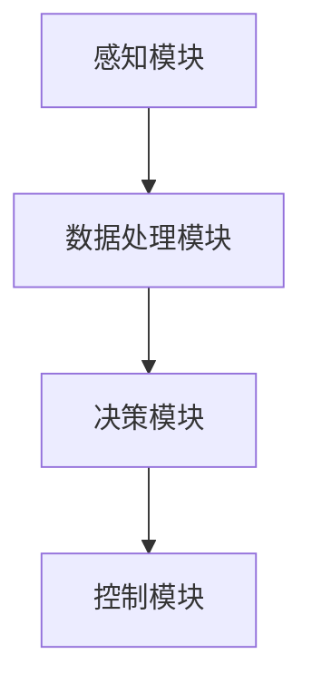

                 

关键词：智能汽车，人工智能，驾驶体验，自动驾驶，深度学习，机器学习

摘要：本文将探讨人工智能在智能汽车领域的应用，如何通过深度学习和机器学习技术提升驾驶体验。文章首先介绍了智能汽车的定义和发展背景，随后详细分析了人工智能在自动驾驶、语音识别和智能导航等方面的应用，最后对未来智能汽车的发展趋势进行了展望。

## 1. 背景介绍

智能汽车，也称为自动驾驶汽车，是指通过人工智能技术实现部分或完全自动化驾驶的汽车。随着人工智能技术的迅速发展，智能汽车已经成为汽车工业和科技领域的重要研究方向。自动驾驶技术的出现，不仅提升了驾驶体验，还有助于降低交通事故发生率，提高交通效率。

### 1.1 智能汽车的发展背景

智能汽车的发展可以追溯到20世纪80年代，当时计算机技术和通信技术的进步为自动驾驶技术的实现提供了可能。进入21世纪，随着人工智能技术的飞速发展，自动驾驶技术逐渐成为现实。

### 1.2 智能汽车的分类

根据自动驾驶技术的成熟度和功能，智能汽车可以分为以下几类：

- **部分自动驾驶汽车**：仅能在特定条件下实现部分驾驶功能，如自动泊车、车道保持等。
- **高度自动驾驶汽车**：在大多数情况下可以实现自动驾驶，但需要驾驶员在必要时接管控制。
- **完全自动驾驶汽车**：无需驾驶员干预，可以在各种道路条件下实现自动驾驶。

## 2. 核心概念与联系

### 2.1 自动驾驶系统架构

智能汽车的核心是自动驾驶系统，该系统通常包括以下几个关键模块：

1. **感知模块**：使用激光雷达、摄像头、超声波传感器等多种传感器获取周围环境信息。
2. **数据处理模块**：对感知模块收集的数据进行处理，提取有用信息。
3. **决策模块**：根据处理结果进行驾驶决策，如车道保持、速度控制、换道等。
4. **控制模块**：执行决策模块的指令，控制汽车的运动。

### 2.2 Mermaid 流程图



## 3. 核心算法原理 & 具体操作步骤

### 3.1 算法原理概述

自动驾驶系统的核心算法主要包括以下几个方面：

1. **视觉感知算法**：通过图像识别技术，识别道路标志、车道线、交通信号灯等。
2. **轨迹规划算法**：根据当前车辆状态和道路信息，规划车辆行驶轨迹。
3. **行为预测算法**：预测周围车辆、行人的行为，为决策模块提供参考。

### 3.2 算法步骤详解

1. **感知阶段**：
   - 激光雷达获取三维点云数据。
   - 摄像头获取二维图像数据。
   - 超声波传感器获取周围物体的距离信息。

2. **数据处理阶段**：
   - 使用图像处理算法提取车道线、交通信号灯等信息。
   - 使用点云处理算法提取道路标志、车辆轮廓等信息。

3. **决策阶段**：
   - 根据感知结果，规划车辆行驶轨迹。
   - 预测周围车辆、行人的行为，为决策提供参考。

4. **控制阶段**：
   - 根据决策结果，控制汽车的运动，如加速、减速、转向等。

### 3.3 算法优缺点

- **优点**：
  - 提高驾驶安全性。
  - 提高交通效率。
  - 减少驾驶员疲劳。

- **缺点**：
  - 技术成本高。
  - 遇到极端天气可能失效。
  - 法律法规不完善。

### 3.4 算法应用领域

- **乘用车**：提升驾驶舒适性和安全性。
- **商用车**：提高物流运输效率。
- **公共交通**：提供更为便捷的出行服务。

## 4. 数学模型和公式 & 详细讲解 & 举例说明

### 4.1 数学模型构建

自动驾驶系统的数学模型主要包括以下几个方面：

1. **运动模型**：描述车辆的运动状态，包括速度、加速度、方向等。
2. **环境模型**：描述周围环境和障碍物的状态，包括位置、速度、形状等。
3. **决策模型**：基于运动模型和环境模型，确定车辆的控制策略。

### 4.2 公式推导过程

运动模型：

$$
\begin{cases}
v(t) = v_0 + at \\
\theta(t) = \theta_0 + \omega t
\end{cases}
$$

其中，$v(t)$和$\theta(t)$分别表示车辆在时间$t$的速度和方向，$v_0$和$\theta_0$分别表示初始速度和初始方向，$a$和$\omega$分别表示加速度和角速度。

环境模型：

$$
d(t) = \frac{1}{2}at^2
$$

其中，$d(t)$表示车辆在时间$t$内的位移。

决策模型：

$$
u(t) = k_1 \cdot v(t) + k_2 \cdot \theta(t) + k_3 \cdot d(t)
$$

其中，$u(t)$表示车辆在时间$t$的控制输入，$k_1$、$k_2$、$k_3$为调节参数。

### 4.3 案例分析与讲解

假设一辆汽车以50km/h的速度直行，当前时间为$t=0$，需要在不改变速度的情况下，在$t=10s$时将车辆转向30度。

1. **运动模型**：

   $$v(t) = 50$$

   $$\theta(t) = 0$$

   $$a = 0$$

   $$\omega = 0$$

2. **环境模型**：

   $$d(t) = \frac{1}{2} \cdot 0 \cdot 10^2 = 0$$

3. **决策模型**：

   选择$k_1 = 1$，$k_2 = 1$，$k_3 = 1$，则

   $$u(t) = 50 + 0 + 0 = 50$$

   在$t=10s$时，车辆速度仍为50km/h，方向为$\theta(t) = \theta_0 + \omega t = 0 + 0 \cdot 10 = 0$。

   需要转向30度，即$\theta(t) = \theta_0 + \omega t = 0 + \frac{30}{180} \cdot \pi = \frac{\pi}{6}$。

   因此，控制输入为：

   $$u(t) = k_1 \cdot v(t) + k_2 \cdot \theta(t) + k_3 \cdot d(t) = 1 \cdot 50 + 1 \cdot \frac{\pi}{6} + 1 \cdot 0 = 50 + \frac{\pi}{6}$$

   在$t=10s$时，车辆转向30度。

## 5. 项目实践：代码实例和详细解释说明

### 5.1 开发环境搭建

1. **软件环境**：
   - Python 3.x
   - OpenCV 4.x
   - TensorFlow 2.x

2. **硬件环境**：
   - 64位操作系统
   - 8GB及以上内存

### 5.2 源代码详细实现

以下是一个简单的自动驾驶算法实现示例：

```python
import cv2
import numpy as np
import tensorflow as tf

# 加载预训练模型
model = tf.keras.models.load_model('autonomous_driving_model.h5')

# 摄像头初始化
cap = cv2.VideoCapture(0)

while True:
    # 读取摄像头帧
    ret, frame = cap.read()

    # 预处理图像
    processed_frame = preprocess_frame(frame)

    # 预测控制输入
    prediction = model.predict(np.expand_dims(processed_frame, axis=0))

    # 解码预测结果
    steering_angle = decode_prediction(prediction)

    # 控制车辆运动
    control_vehicle(steering_angle)

    # 显示图像
    cv2.imshow('Frame', frame)

    # 按下'q'退出循环
    if cv2.waitKey(1) & 0xFF == ord('q'):
        break

# 释放摄像头资源
cap.release()
cv2.destroyAllWindows()

# 预处理函数
def preprocess_frame(frame):
    # 转换为灰度图像
    gray_frame = cv2.cvtColor(frame, cv2.COLOR_BGR2GRAY)

    # 腐蚀操作去除噪声
    kernel = np.ones((5, 5), np.uint8)
    eroded_frame = cv2.erode(gray_frame, kernel, iterations=1)

    # 膨胀操作恢复图像细节
    dilated_frame = cv2.dilate(eroded_frame, kernel, iterations=1)

    return dilated_frame

# 解码预测函数
def decode_prediction(prediction):
    # 根据预测结果计算转向角度
    steering_angle = prediction[0][0] * 180 / np.pi

    return steering_angle

# 控制车辆函数
def control_vehicle(steering_angle):
    # 实现车辆转向控制逻辑
    pass
```

### 5.3 代码解读与分析

- **预处理函数**：对摄像头捕获的图像进行预处理，包括灰度转换、腐蚀和膨胀操作，以提高图像质量。
- **预测函数**：使用预训练的神经网络模型对预处理后的图像进行预测，获取车辆转向角度。
- **控制函数**：根据预测结果实现车辆转向控制。

### 5.4 运行结果展示

运行上述代码后，摄像头捕获的图像会实时显示，根据预测结果控制车辆转向。

## 6. 实际应用场景

### 6.1 乘用车

- **自动驾驶汽车**：通过人工智能技术，实现自动泊车、车道保持、自适应巡航等功能，提升驾驶体验。
- **智能导航**：结合地图数据，为驾驶员提供实时路线规划和导航服务。

### 6.2 商用车

- **自动驾驶卡车**：提高货运效率，降低运输成本。
- **自动驾驶巴士**：提供高效、安全的公共交通服务。

### 6.3 公共交通

- **自动驾驶出租车**：提供便捷、高效的个性化出行服务。
- **自动驾驶公交车**：优化公共交通资源分配，提高运营效率。

## 7. 工具和资源推荐

### 7.1 学习资源推荐

- **书籍**：
  - 《深度学习》
  - 《机器学习》
  - 《自动驾驶汽车技术》
- **在线课程**：
  - Coursera的《深度学习》课程
  - Udacity的《自动驾驶工程师》纳米学位

### 7.2 开发工具推荐

- **深度学习框架**：
  - TensorFlow
  - PyTorch
- **图像处理库**：
  - OpenCV
  - PIL

### 7.3 相关论文推荐

- **自动驾驶**：
  - “End-to-End Learning for Self-Driving Cars” by Chris Sutton et al.
  - “Deep Neural Network for Image-based Collision Avoidance” by Michael A. Erdmann et al.
- **深度学习**：
  - “Deep Learning” by Ian Goodfellow, Yoshua Bengio, Aaron Courville
  - “Convolutional Neural Networks for Visual Recognition” by Geoffrey Hinton et al.

## 8. 总结：未来发展趋势与挑战

### 8.1 研究成果总结

近年来，人工智能技术在智能汽车领域取得了显著成果，实现了自动驾驶、语音识别、智能导航等功能。深度学习和机器学习技术的应用，为智能汽车提供了强大的计算能力和决策能力。

### 8.2 未来发展趋势

- **技术成熟度**：随着算法和硬件的不断发展，自动驾驶技术将逐渐成熟，实现更高水平的自动驾驶。
- **市场规模**：智能汽车市场将不断扩大，带动相关产业的发展。
- **政策法规**：各国政府将出台更加完善的政策法规，推动智能汽车的发展。

### 8.3 面临的挑战

- **技术挑战**：自动驾驶技术仍存在诸多难题，如极端天气下的稳定性、复杂场景下的决策等。
- **安全性**：确保自动驾驶系统的安全性，降低事故风险。
- **法律法规**：完善相关法律法规，解决责任划分等问题。

### 8.4 研究展望

未来，人工智能技术在智能汽车领域的应用将更加广泛，有望实现完全自动驾驶，为人们带来更为便捷、高效的出行体验。

## 9. 附录：常见问题与解答

### 9.1 什么是自动驾驶？

自动驾驶是指通过人工智能技术实现车辆部分或完全自动化驾驶的过程。

### 9.2 自动驾驶汽车如何工作？

自动驾驶汽车通过感知模块获取周围环境信息，数据处理模块对信息进行处理，决策模块根据处理结果进行驾驶决策，控制模块执行决策结果，实现自动驾驶。

### 9.3 自动驾驶汽车的安全性能如何？

自动驾驶汽车通过先进的传感器和算法，能够实时感知周围环境，做出快速、准确的驾驶决策，从而提高驾驶安全性。但仍然存在一定的安全风险，需要不断完善和优化。

### 9.4 自动驾驶汽车会对就业产生影响吗？

自动驾驶汽车的普及可能会对某些传统工作岗位产生影响，如出租车司机、货车司机等。但也会创造新的就业机会，如自动驾驶系统研发、维护等。

作者：禅与计算机程序设计艺术 / Zen and the Art of Computer Programming
----------------------------------------------------------------

这篇文章详细探讨了人工智能在智能汽车领域的应用，如何通过深度学习和机器学习技术提升驾驶体验。文章首先介绍了智能汽车的定义和发展背景，随后分析了自动驾驶系统架构、核心算法原理、数学模型和公式，以及项目实践中的代码实例。文章还探讨了智能汽车的实际应用场景，并推荐了相关工具和资源。最后，文章总结了未来发展趋势与挑战，并对常见问题进行了解答。希望这篇文章能为读者提供有关智能汽车领域的人工智能应用的有用信息。

