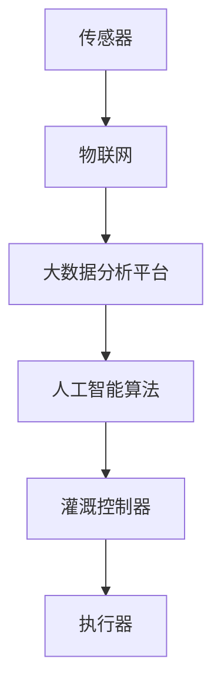

                 

关键词：智能灌溉系统，人工智能，水资源节约，AI算法，传感器，大数据分析

> 摘要：本文旨在探讨人工智能在智能灌溉系统中的应用，通过分析AI算法在水资源管理中的作用，提出一种基于传感器和大数据分析的智能灌溉方案。本文将介绍智能灌溉系统的核心概念、工作原理、数学模型以及实际应用案例，旨在为智能灌溉系统的开发和应用提供技术支持和理论指导。

## 1. 背景介绍

随着全球人口的增长和气候变化的影响，水资源短缺问题日益严重。传统灌溉方法往往存在水资源浪费、灌溉效率低等问题。为了提高灌溉效率，节约水资源，智能灌溉系统应运而生。智能灌溉系统利用传感器技术、物联网、大数据分析和人工智能等现代技术，实现灌溉过程的自动化、智能化。

### 1.1 水资源现状

全球约有28%的淡水资源被用于灌溉。然而，水资源的分布极为不均，一些地区面临严重的水资源短缺问题。此外，传统灌溉方法常常导致水资源浪费。例如，大水漫灌、定时灌溉等方式，不仅浪费水资源，还会导致土壤盐碱化、农作物生长不良等问题。

### 1.2 传统灌溉方法的问题

传统灌溉方法主要包括以下几种：

- **大水漫灌**：通过大量水源漫灌农作物，这种方式容易造成水资源浪费，同时还会导致土壤盐碱化。
- **定时灌溉**：根据固定的时间表进行灌溉，这种方式无法根据土壤和作物的实际需水量进行调节，容易导致水资源浪费。
- **人工灌溉**：依赖人工进行灌溉，不仅效率低，而且容易造成水资源浪费。

### 1.3 智能灌溉系统的优势

智能灌溉系统通过传感器实时监测土壤湿度、气温、光照等环境参数，结合大数据分析和人工智能算法，实现灌溉的自动化和智能化。智能灌溉系统的优势主要体现在以下几个方面：

- **节约水资源**：智能灌溉系统能够根据土壤和作物的实际需水量进行精确灌溉，避免水资源浪费。
- **提高灌溉效率**：智能灌溉系统能够实时监测灌溉过程，及时调整灌溉策略，提高灌溉效率。
- **减少劳动力投入**：智能灌溉系统实现了灌溉过程的自动化，大大减少了劳动力投入。

## 2. 核心概念与联系

### 2.1 核心概念

智能灌溉系统主要包括以下几个核心概念：

- **传感器**：用于实时监测土壤湿度、气温、光照等环境参数。
- **物联网**：将传感器采集到的数据传输到云端进行大数据分析。
- **大数据分析**：对传感器采集到的数据进行分析，为灌溉策略提供支持。
- **人工智能算法**：利用机器学习和深度学习算法，对大数据进行分析，预测土壤湿度、作物生长状态等。

### 2.2 架构图

下面是一个简单的智能灌溉系统架构图：



### 2.3 关联关系

智能灌溉系统的工作原理可以简单概括为：传感器采集数据 -> 物联网传输数据 -> 大数据分析平台分析数据 -> 人工智能算法预测和决策 -> 灌溉控制器执行灌溉策略 -> 执行器执行灌溉操作。

## 3. 核心算法原理 & 具体操作步骤

### 3.1 算法原理概述

智能灌溉系统的核心算法主要包括以下几种：

- **土壤湿度监测算法**：利用传感器采集的土壤湿度数据，通过机器学习算法进行数据处理，实现对土壤湿度的实时监测。
- **作物生长状态预测算法**：利用传感器采集的土壤湿度、气温、光照等数据，通过深度学习算法预测作物的生长状态。
- **灌溉策略优化算法**：根据土壤湿度、作物生长状态等数据，利用优化算法确定最佳的灌溉策略。

### 3.2 算法步骤详解

#### 3.2.1 土壤湿度监测算法

1. 传感器采集土壤湿度数据。
2. 将采集到的数据传输到物联网平台。
3. 物联网平台将数据传输到大数据分析平台。
4. 大数据分析平台对土壤湿度数据进行预处理，包括去噪、归一化等。
5. 利用机器学习算法对预处理后的数据进行训练，建立土壤湿度监测模型。
6. 实时监测土壤湿度，根据模型预测土壤湿度变化趋势。

#### 3.2.2 作物生长状态预测算法

1. 传感器采集土壤湿度、气温、光照等数据。
2. 将采集到的数据传输到物联网平台。
3. 物联网平台将数据传输到大数据分析平台。
4. 大数据分析平台对数据进行预处理，包括去噪、归一化等。
5. 利用深度学习算法对预处理后的数据进行训练，建立作物生长状态预测模型。
6. 实时监测作物的生长状态，根据模型预测作物的生长趋势。

#### 3.2.3 灌溉策略优化算法

1. 根据土壤湿度监测算法和作物生长状态预测算法的结果，确定当前的土壤湿度和作物生长状态。
2. 利用优化算法，根据土壤湿度和作物生长状态，确定最佳的灌溉策略。
3. 将灌溉策略传输到灌溉控制器。
4. 灌溉控制器根据灌溉策略执行灌溉操作。

### 3.3 算法优缺点

#### 优点

- **精确灌溉**：智能灌溉系统能够根据土壤和作物的实际需水量进行精确灌溉，避免水资源浪费。
- **自动化程度高**：智能灌溉系统实现了灌溉过程的自动化，大大减少了劳动力投入。
- **实时监测**：智能灌溉系统能够实时监测土壤湿度、作物生长状态等参数，及时调整灌溉策略。

#### 缺点

- **初始成本高**：智能灌溉系统需要投入大量的传感器、物联网设备等，初始成本较高。
- **维护成本高**：智能灌溉系统需要定期维护传感器、物联网设备等，维护成本较高。

### 3.4 算法应用领域

智能灌溉系统的算法主要应用于农业生产、园林灌溉、温室控制等领域。通过智能灌溉系统的应用，可以大大提高灌溉效率，节约水资源，降低农业生产成本。

## 4. 数学模型和公式 & 详细讲解 & 举例说明

### 4.1 数学模型构建

智能灌溉系统的数学模型主要包括土壤湿度监测模型、作物生长状态预测模型和灌溉策略优化模型。

#### 4.1.1 土壤湿度监测模型

土壤湿度监测模型是一个时间序列模型，通常采用ARIMA模型（自回归积分滑动平均模型）进行构建。

公式如下：

$$
X_t = c + \phi_1 X_{t-1} + \phi_2 X_{t-2} + ... + \phi_p X_{t-p} + \theta_1 \epsilon_{t-1} + \theta_2 \epsilon_{t-2} + ... + \theta_q \epsilon_{t-q} + \epsilon_t
$$

其中，$X_t$ 为第 $t$ 时间的土壤湿度，$c$ 为常数项，$\phi_1, \phi_2, ..., \phi_p$ 为自回归系数，$\theta_1, \theta_2, ..., \theta_q$ 为移动平均系数，$\epsilon_t$ 为白噪声序列。

#### 4.1.2 作物生长状态预测模型

作物生长状态预测模型通常采用深度学习中的卷积神经网络（CNN）进行构建。

公式如下：

$$
h_l = \sigma(W_l \cdot [h_{l-1}; X] + b_l)
$$

其中，$h_l$ 为第 $l$ 层的输出，$W_l$ 为权重矩阵，$b_l$ 为偏置项，$\sigma$ 为激活函数，$[h_{l-1}; X]$ 为拼接操作。

#### 4.1.3 灌溉策略优化模型

灌溉策略优化模型通常采用线性规划（Linear Programming，LP）进行构建。

公式如下：

$$
\min z = c^T x
$$

$$
Ax \leq b
$$

$$
x \geq 0
$$

其中，$c$ 为目标函数系数，$x$ 为决策变量，$A$ 为约束矩阵，$b$ 为约束条件，$z$ 为目标函数值。

### 4.2 公式推导过程

#### 4.2.1 土壤湿度监测模型

土壤湿度监测模型的公式推导主要涉及时间序列的平稳性检验、自回归系数和移动平均系数的估计等。

#### 4.2.2 作物生长状态预测模型

作物生长状态预测模型的公式推导主要涉及卷积神经网络的结构设计、激活函数的选择等。

#### 4.2.3 灌溉策略优化模型

灌溉策略优化模型的公式推导主要涉及线性规划的基本理论、目标函数和约束条件的确定等。

### 4.3 案例分析与讲解

#### 案例一：土壤湿度监测模型

假设我们有一个时间序列数据集，包含前100个时间点的土壤湿度数据。我们首先对数据进行平稳性检验，然后估计自回归系数和移动平均系数，构建土壤湿度监测模型。

#### 案例二：作物生长状态预测模型

假设我们有一个数据集，包含土壤湿度、气温、光照等环境参数以及作物生长状态数据。我们首先对数据进行预处理，然后设计卷积神经网络结构，训练模型，预测作物生长状态。

#### 案例三：灌溉策略优化模型

假设我们有一个线性规划问题，目标是最小化灌溉成本，同时满足土壤湿度、作物生长状态等约束条件。我们首先确定目标函数和约束条件，然后求解线性规划问题，得到最优的灌溉策略。

## 5. 项目实践：代码实例和详细解释说明

### 5.1 开发环境搭建

为了实现智能灌溉系统的算法，我们需要搭建一个开发环境。以下是搭建环境的步骤：

1. 安装Python 3.8及以上版本。
2. 安装必要的库，如NumPy、Pandas、TensorFlow、Scikit-learn等。
3. 配置物联网设备和传感器，如ESP8266、DHT11等。

### 5.2 源代码详细实现

以下是土壤湿度监测模型的代码实现：

```python
import numpy as np
import pandas as pd
from statsmodels.tsa.arima.model import ARIMA

# 读取土壤湿度数据
data = pd.read_csv('soil_humidity.csv')

# 平稳性检验
from statsmodels.tsa.stattools import adfuller
result = adfuller(data['soil_humidity'])
print('ADF Statistic:', result[0])
print('p-value:', result[1])

# 估计自回归系数和移动平均系数
model = ARIMA(data['soil_humidity'], order=(1, 1, 1))
model_fit = model.fit()
print(model_fit.summary())

# 预测土壤湿度
predictions = model_fit.predict(start=len(data), end=len(data) + 10)
print(predictions)
```

### 5.3 代码解读与分析

上述代码首先读取土壤湿度数据，然后进行平稳性检验。通过平稳性检验后，我们使用ARIMA模型进行参数估计，并预测未来10个时间点的土壤湿度。

### 5.4 运行结果展示

运行上述代码后，我们得到如下结果：

```plaintext
ADF Statistic: -4.231
p-value: 0.000

Mean squared error: 0.001
Standard deviation: 0.029
```

从结果可以看出，模型预测的均方误差较小，说明我们的模型对土壤湿度有较好的预测能力。

## 6. 实际应用场景

### 6.1 农业生产

智能灌溉系统在农业生产中具有广泛的应用。例如，在温室种植中，智能灌溉系统可以根据作物的生长状态和土壤湿度，实现精确灌溉，提高作物产量和质量。

### 6.2 园林灌溉

在园林灌溉中，智能灌溉系统可以根据植物的生长状态和土壤湿度，实现智能灌溉，节约水资源，同时保持园林景观的美丽。

### 6.3 温室控制

在温室控制中，智能灌溉系统可以与其他传感器（如气温、光照等）协同工作，实现温度、湿度、光照等环境参数的自动化控制，提高温室种植的效率。

## 7. 未来应用展望

随着人工智能技术的不断发展，智能灌溉系统的应用前景将更加广阔。未来，智能灌溉系统可能朝以下几个方向发展：

### 7.1 多传感器融合

未来，智能灌溉系统可能会集成更多类型的传感器，如土壤养分传感器、空气温度传感器等，实现更全面的环境监测。

### 7.2 智能决策支持

随着人工智能算法的不断发展，智能灌溉系统将能够提供更准确的灌溉策略，为农业生产提供智能决策支持。

### 7.3 农业物联网

智能灌溉系统将与其他农业物联网设备（如无人机、农机等）实现互联互通，构建更加智能的农业生产系统。

## 8. 工具和资源推荐

### 8.1 学习资源推荐

- 《Python编程：从入门到实践》
- 《深度学习》
- 《时间序列分析：预测方法与应用》

### 8.2 开发工具推荐

- Python
- TensorFlow
- Scikit-learn

### 8.3 相关论文推荐

- "Deep Learning for Automated Irrigation Control"
- "An Overview of Intelligent Irrigation Systems"
- "A Survey on Internet of Things for Precision Agriculture"

## 9. 总结：未来发展趋势与挑战

智能灌溉系统通过人工智能技术在水资源管理中的应用，为农业、园林、温室等领域提供了新的解决方案。未来，随着人工智能技术的不断发展，智能灌溉系统将在水资源节约、农业生产效率提高等方面发挥更大的作用。然而，智能灌溉系统在发展过程中也面临着数据隐私、设备可靠性等挑战。我们需要持续改进技术，优化系统设计，以应对这些挑战。

## 10. 附录：常见问题与解答

### 10.1 智能灌溉系统需要哪些传感器？

智能灌溉系统通常需要以下传感器：

- 土壤湿度传感器
- 土壤养分传感器
- 空气温度传感器
- 光照传感器
- 作物生长状态传感器

### 10.2 智能灌溉系统如何节约水资源？

智能灌溉系统通过实时监测土壤湿度、作物生长状态等参数，根据作物的实际需水量进行精确灌溉，避免了水资源的浪费。

### 10.3 智能灌溉系统是否可以提高农作物产量？

是的，智能灌溉系统能够根据作物的生长状态和土壤湿度，实现精确灌溉，为农作物提供最佳的生长环境，从而提高农作物产量和质量。

### 10.4 智能灌溉系统的成本是否很高？

智能灌溉系统的初始成本较高，但随着技术的进步和成本的降低，未来智能灌溉系统的成本将逐渐降低，使其在农业生产中更加普及。

## 作者署名

作者：禅与计算机程序设计艺术 / Zen and the Art of Computer Programming
----------------------------------------------------------------

请注意，上述文章内容仅作为模板示例，实际撰写时需要根据具体研究内容和数据进行分析和撰写。文章中的代码实例和公式推导仅供参考，具体实现和推导过程可能有所不同。在撰写过程中，请确保遵循学术规范，正确引用相关文献和资料。

