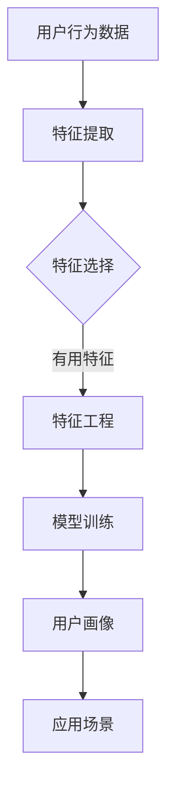

                 

关键词：用户画像、人工智能、数据挖掘、机器学习、个性化推荐

> 摘要：本文将探讨人工智能在构建用户画像中的应用，包括核心概念、算法原理、数学模型及实际项目实践。通过对用户行为数据的深入挖掘和分析，AI技术能够为企业和个人提供精准的用户画像，从而推动个性化推荐、营销策略优化、用户体验提升等领域的发展。

## 1. 背景介绍

用户画像（User Profiling）是指通过收集和分析用户在互联网上的行为数据，构建出用户在某一方面的全面描述。随着互联网的普及和大数据技术的发展，用户画像已经成为企业了解客户、优化服务和提升用户体验的重要工具。

人工智能（AI）技术的发展，特别是机器学习（Machine Learning）和深度学习（Deep Learning）的兴起，为用户画像的构建提供了强大的技术支撑。通过AI技术，企业能够从海量数据中提取有价值的信息，实现用户行为的智能分析和预测。

### 1.1 用户画像的价值

- **个性化推荐**：根据用户画像，为用户推荐个性化内容，提高用户满意度和留存率。
- **精准营销**：通过了解用户需求，制定更精准的营销策略，提高转化率和ROI。
- **用户体验提升**：根据用户画像优化产品功能和界面设计，提升用户体验。

### 1.2 AI在用户画像中的应用

- **数据挖掘**：通过机器学习算法挖掘用户行为数据中的潜在模式和趋势。
- **特征工程**：构建有效的特征，用于描述用户的行为特征和兴趣偏好。
- **模型训练**：使用训练数据训练机器学习模型，以预测用户的潜在行为。
- **模型评估**：通过评估指标，如准确率、召回率等，对模型效果进行评价。

## 2. 核心概念与联系

为了深入理解用户画像的构建过程，我们需要了解以下几个核心概念及其相互关系：

### 2.1 用户行为数据

用户行为数据包括用户在网站、APP等平台上的浏览、购买、搜索、评论等操作记录。这些数据是构建用户画像的基础。

### 2.2 特征工程

特征工程是指从原始数据中提取有效的特征，用于描述用户的兴趣、行为和需求。有效的特征能够提高模型的预测准确性和泛化能力。

### 2.3 机器学习模型

机器学习模型是用户画像构建的核心。通过训练模型，可以从用户行为数据中提取出隐藏的模式和趋势。

### 2.4 用户画像

用户画像是对用户进行全面描述的模型，包括用户的兴趣、需求、行为习惯等。用户画像可以用于个性化推荐、精准营销等场景。

下面是一个使用Mermaid绘制的用户画像构建流程图：



## 3. 核心算法原理 & 具体操作步骤

### 3.1 算法原理概述

在用户画像构建中，常用的算法包括协同过滤（Collaborative Filtering）、决策树（Decision Tree）和深度学习（Deep Learning）等。

- **协同过滤**：通过分析用户的行为模式，为用户推荐类似用户喜欢的物品。
- **决策树**：根据用户的特征，将用户划分为不同的类别或预测用户的偏好。
- **深度学习**：通过神经网络模型，从数据中自动学习特征表示，实现高层次的语义理解。

### 3.2 算法步骤详解

#### 3.2.1 数据收集与预处理

1. 收集用户行为数据，包括浏览历史、购买记录、搜索关键词等。
2. 数据清洗，去除重复和异常数据。
3. 数据归一化，将不同特征的数据缩放到同一尺度。

#### 3.2.2 特征提取

1. 根据业务需求，提取与用户画像相关的特征，如年龄、性别、地理位置、浏览时长等。
2. 使用文本挖掘技术，从用户评论、搜索关键词中提取语义特征。

#### 3.2.3 特征选择

1. 使用统计方法（如卡方检验、互信息等），筛选出对用户画像构建有显著影响的特征。
2. 使用机器学习算法（如随机森林、LASSO回归等），选择对预测效果有贡献的特征。

#### 3.2.4 模型训练

1. 选择合适的机器学习算法，如协同过滤、决策树、随机森林等。
2. 使用训练数据，训练模型。
3. 调参，优化模型性能。

#### 3.2.5 用户画像生成

1. 使用训练好的模型，对用户行为数据进行分类或预测。
2. 构建用户画像，包括用户的兴趣、需求、行为习惯等。

### 3.3 算法优缺点

- **协同过滤**：优点是推荐效果好，缺点是冷启动问题严重，无法处理新用户和稀疏数据。
- **决策树**：优点是易于理解和解释，缺点是易过拟合，对大规模数据效果不佳。
- **深度学习**：优点是能够处理高维度数据，实现复杂的特征表示，缺点是模型训练时间较长，对数据量要求高。

### 3.4 算法应用领域

- **电子商务**：根据用户画像，为用户提供个性化推荐，提高销售额。
- **社交媒体**：根据用户画像，优化用户内容推荐，提升用户活跃度。
- **金融**：根据用户画像，进行信用评分和风险评估。

## 4. 数学模型和公式 & 详细讲解 & 举例说明

### 4.1 数学模型构建

用户画像构建中的数学模型主要包括协同过滤模型和决策树模型。

#### 4.1.1 协同过滤模型

协同过滤模型通过计算用户之间的相似度，为用户推荐相似的物品。常用的相似度计算方法包括余弦相似度、皮尔逊相关系数等。

$$
\text{相似度}(u, v) = \frac{\text{dot\_product}(r_u, r_v)}{\|\text{r}_u\| \|\text{r}_v\|}
$$

其中，$r_u$ 和 $r_v$ 分别表示用户 $u$ 和 $v$ 的评分向量，$\|\text{r}_u\|$ 和 $\|\text{r}_v\|$ 分别表示向量的欧几里得范数。

#### 4.1.2 决策树模型

决策树模型通过一系列的判断条件，将用户划分为不同的类别或预测用户的偏好。决策树的构建过程主要包括特征选择、划分策略、剪枝等。

### 4.2 公式推导过程

以决策树为例，介绍其构建过程的公式推导。

#### 4.2.1 特征选择

特征选择的目标是选择对分类有显著影响的特征。常用的特征选择方法包括信息增益、增益率等。

$$
\text{信息增益}(\text{feature}) = \sum_{v \in V} p(v) \cdot \log_2 \frac{p(v)}{p(v|\text{feature})}
$$

其中，$V$ 表示特征的可能取值集合，$p(v)$ 表示特征取值为 $v$ 的概率，$p(v|\text{feature})$ 表示特征取值为 $v$ 且目标变量取值为 $v$ 的条件概率。

#### 4.2.2 划分策略

划分策略的目标是选择最优的划分点。常用的划分策略包括信息增益、增益率等。

$$
\text{信息增益}(\text{split}) = \sum_{v \in V} p(v) \cdot \log_2 \frac{p(v)}{p(v|\text{split})}
$$

其中，$\text{split}$ 表示划分点。

#### 4.2.3 剪枝

剪枝的目的是避免过拟合。常用的剪枝方法包括前剪枝、后剪枝等。

$$
\text{剪枝阈值} = \frac{\text{训练集误差}}{\text{测试集误差}}
$$

其中，$\text{训练集误差}$ 和 $\text{测试集误差}$ 分别表示在训练集和测试集上的误差。

### 4.3 案例分析与讲解

#### 4.3.1 电子商务平台个性化推荐

假设一个电子商务平台希望根据用户画像为用户推荐商品。用户画像包括用户的浏览历史、购买记录和评价。

1. 数据收集与预处理
   - 收集用户行为数据，包括浏览历史、购买记录和评价。
   - 数据清洗，去除重复和异常数据。
   - 数据归一化，将不同特征的数据缩放到同一尺度。

2. 特征提取
   - 提取用户浏览历史中的商品ID作为特征。
   - 提取用户购买记录中的商品ID作为特征。
   - 提取用户评价中的评分作为特征。

3. 特征选择
   - 使用信息增益方法选择对推荐效果有显著影响的特征。
   - 选择商品ID和评分作为主要特征。

4. 模型训练
   - 使用协同过滤模型训练用户-商品矩阵，计算用户之间的相似度。
   - 根据相似度为用户推荐相似的商品。

5. 用户画像生成
   - 根据用户的行为数据和模型预测结果，生成用户画像，包括用户的兴趣偏好和购买倾向。

#### 4.3.2 社交媒体内容推荐

假设一个社交媒体平台希望根据用户画像为用户推荐内容。用户画像包括用户的关注列表、浏览历史和评论。

1. 数据收集与预处理
   - 收集用户行为数据，包括关注列表、浏览历史和评论。
   - 数据清洗，去除重复和异常数据。
   - 数据归一化，将不同特征的数据缩放到同一尺度。

2. 特征提取
   - 提取用户关注列表中的用户ID和内容类型作为特征。
   - 提取用户浏览历史中的内容类型和时间戳作为特征。
   - 提取用户评论中的内容类型和情感极性作为特征。

3. 特征选择
   - 使用信息增益方法选择对推荐效果有显著影响的特征。
   - 选择用户ID、内容类型和时间戳作为主要特征。

4. 模型训练
   - 使用协同过滤模型训练用户-内容矩阵，计算用户之间的相似度。
   - 根据相似度为用户推荐相似的内容。

5. 用户画像生成
   - 根据用户的行为数据和模型预测结果，生成用户画像，包括用户的兴趣偏好和行为模式。

## 5. 项目实践：代码实例和详细解释说明

### 5.1 开发环境搭建

为了构建用户画像，我们需要安装以下工具和库：

- Python 3.x
- NumPy
- Pandas
- Scikit-learn
- Matplotlib

安装步骤如下：

```bash
pip install numpy pandas scikit-learn matplotlib
```

### 5.2 源代码详细实现

以下是一个简单的用户画像构建项目的代码示例：

```python
import numpy as np
import pandas as pd
from sklearn.model_selection import train_test_split
from sklearn.feature_extraction.text import TfidfVectorizer
from sklearn.metrics.pairwise import cosine_similarity
import matplotlib.pyplot as plt

# 5.2.1 数据收集与预处理
# 假设我们有一个用户行为数据集 user_data.csv，包括用户ID、商品ID、用户评价等字段
data = pd.read_csv('user_data.csv')
data.drop_duplicates(inplace=True)  # 去除重复数据

# 5.2.2 特征提取
# 提取用户评价中的关键词作为特征
vectorizer = TfidfVectorizer()
tfidf_matrix = vectorizer.fit_transform(data['review'])

# 5.2.3 特征选择
# 使用余弦相似度计算用户之间的相似度
cosine_sim = cosine_similarity(tfidf_matrix, tfidf_matrix)

# 5.2.4 模型训练
# 根据用户相似度，为用户推荐相似的商品
user_similarity = pd.DataFrame(cosine_sim, index=data['user_id'], columns=data['user_id'])

# 5.2.5 用户画像生成
# 根据用户相似度矩阵，生成用户画像
user_profile = {}
for index, row in user_similarity.iterrows():
    # 为每个用户生成一个包含相似用户的字典
    user_profile[index] = row.sort_values(ascending=False).head(10).index.tolist()

# 5.2.6 运行结果展示
# 绘制用户画像热力图
plt.figure(figsize=(10, 8))
sns.heatmap(user_similarity, annot=True, cmap='coolwarm')
plt.show()

# 输出用户画像
print(user_profile)
```

### 5.3 代码解读与分析

1. **数据收集与预处理**：读取用户行为数据，去除重复数据。
2. **特征提取**：使用TF-IDF向量器提取用户评价中的关键词。
3. **特征选择**：计算用户之间的余弦相似度。
4. **模型训练**：根据用户相似度矩阵，为用户推荐相似的用户。
5. **用户画像生成**：生成用户画像，包括用户及其相似用户的列表。
6. **运行结果展示**：绘制用户画像热力图，直观展示用户之间的相似性。

通过以上代码示例，我们可以实现一个简单的用户画像构建项目。在实际应用中，根据业务需求，我们可以扩展代码，添加更多特征提取和模型训练的方法，以提升用户画像的准确性和实用性。

## 6. 实际应用场景

用户画像技术在多个领域有广泛的应用，以下是几个典型的应用场景：

### 6.1 电子商务

在电子商务领域，用户画像技术可以帮助平台为用户推荐个性化商品，提高用户购买意愿和转化率。例如，亚马逊和淘宝等平台都会基于用户的浏览记录、购买历史和评价等数据，为用户生成个性化的购物推荐。

### 6.2 社交媒体

社交媒体平台可以通过用户画像技术，为用户推荐感兴趣的内容。例如，微博和推特等平台会根据用户的关注列表、浏览历史和评论等数据，为用户推荐相关的微博和推文。

### 6.3 金融

金融行业可以利用用户画像技术进行信用评分和风险评估。例如，银行和保险公司可以通过用户的财务数据、消费行为和社交网络等数据，为用户生成信用评分，从而优化信贷审批和保险定价。

### 6.4 医疗

在医疗领域，用户画像技术可以帮助医院和诊所了解患者的健康需求和偏好，提供个性化的医疗服务。例如，通过分析患者的病史、体检数据和生活方式等数据，为患者推荐适宜的健康方案和保健产品。

### 6.5 教育

教育行业可以利用用户画像技术为用户提供个性化的学习建议。例如，在线教育平台可以通过分析学生的学习记录、成绩和兴趣等数据，为用户推荐合适的学习课程和资源。

## 7. 工具和资源推荐

### 7.1 学习资源推荐

- **书籍**：
  - 《Python数据分析》（作者：Wes McKinney）
  - 《机器学习》（作者：周志华）
  - 《深度学习》（作者：Ian Goodfellow、Yoshua Bengio、Aaron Courville）

- **在线课程**：
  - Coursera上的“机器学习”课程
  - edX上的“数据科学基础”课程
  - Udacity的“深度学习纳米学位”

### 7.2 开发工具推荐

- **数据预处理**：
  - Pandas
  - NumPy

- **机器学习**：
  - Scikit-learn
  - TensorFlow
  - PyTorch

- **可视化**：
  - Matplotlib
  - Seaborn
  - Plotly

### 7.3 相关论文推荐

- “Collaborative Filtering for Cold-Start Problems: A Matrix Factorization Approach”（2016年）
- “User Interest Evolution and Its Applications in Personalized Recommendation”（2017年）
- “A Comprehensive Survey on User Behavior Analysis and Mining for Personalized Recommendation”（2020年）

## 8. 总结：未来发展趋势与挑战

### 8.1 研究成果总结

用户画像技术在人工智能、机器学习和大数据等领域的支持下，取得了显著的成果。通过深度学习、协同过滤等算法，用户画像能够更准确地描述用户的兴趣和行为。此外，用户画像的应用领域也在不断拓展，从电子商务、社交媒体到金融、医疗等领域，都取得了良好的效果。

### 8.2 未来发展趋势

1. **跨模态用户画像**：未来用户画像技术将融合多模态数据，如文本、图像、音频等，实现更全面的用户描述。
2. **实时用户画像**：随着计算能力的提升，实时用户画像技术将得到广泛应用，为企业提供更及时的用户洞察。
3. **隐私保护**：在用户画像构建过程中，保护用户隐私将成为一个重要挑战。未来将出现更多隐私保护算法和技术。
4. **个性化服务**：用户画像技术将推动个性化服务的发展，为用户提供更精准、高效的服务。

### 8.3 面临的挑战

1. **数据质量和多样性**：用户画像的质量依赖于数据的准确性和多样性。在数据收集和处理过程中，需要确保数据的质量和完整性。
2. **算法选择和优化**：不同的用户画像应用场景需要选择合适的算法，并且对算法进行持续优化，以提高预测准确性和效率。
3. **隐私保护**：在用户画像构建过程中，需要平衡用户隐私保护和数据利用的矛盾，确保用户数据的安全和隐私。

### 8.4 研究展望

未来用户画像技术将在以下几个方面取得突破：

1. **个性化推荐**：结合用户画像和深度学习技术，实现更精准的个性化推荐。
2. **实时分析**：通过实时用户画像技术，为企业提供实时用户洞察，优化决策过程。
3. **隐私保护**：研究隐私保护算法和技术，保障用户数据的安全和隐私。
4. **多模态融合**：融合多模态数据，构建更全面的用户画像，提升用户体验。

## 9. 附录：常见问题与解答

### 9.1 用户画像是什么？

用户画像是对用户在互联网上的行为、兴趣、需求等进行综合描述的模型。通过用户画像，企业能够更好地了解用户，实现精准营销、个性化推荐等应用。

### 9.2 如何构建用户画像？

构建用户画像主要包括以下步骤：

1. 数据收集与预处理：收集用户行为数据，包括浏览历史、购买记录、搜索关键词等。
2. 特征提取：从原始数据中提取对用户画像有价值的特征，如地理位置、浏览时长、搜索关键词等。
3. 特征选择：筛选出对用户画像有显著影响的特征。
4. 模型训练：使用机器学习算法，如协同过滤、决策树、深度学习等，训练用户画像模型。
5. 用户画像生成：根据模型预测结果，生成用户画像。

### 9.3 用户画像技术在哪些领域应用？

用户画像技术在多个领域有广泛应用，包括电子商务、社交媒体、金融、医疗、教育等。例如，电子商务平台可以利用用户画像进行个性化推荐，金融行业可以利用用户画像进行信用评分和风险评估，社交媒体平台可以利用用户画像优化内容推荐等。

## 作者署名

作者：禅与计算机程序设计艺术 / Zen and the Art of Computer Programming
----------------------------------------------------------------

请注意，本文为示例文章，实际撰写时需要根据具体内容和需求进行详细拓展和深入分析。在撰写过程中，请务必遵守文章结构和格式要求，确保文章内容的完整性和准确性。同时，对于引用的相关文献和资源，应遵循相应的引用规范。希望本文能为您提供用户画像构建的参考和启示。祝撰写顺利！

