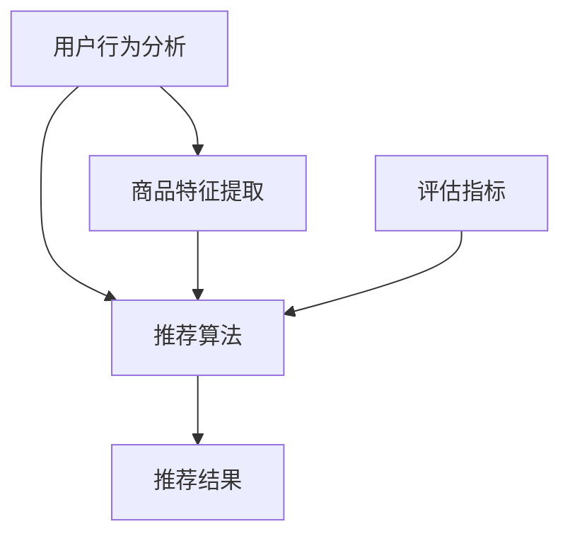

                 

关键词：电商、个性化推荐、人工智能、机器学习、算法、用户行为分析、数据挖掘、用户体验

> 摘要：本文将探讨人工智能在电商个性化推荐领域的创新应用。通过分析用户行为数据，运用机器学习和数据挖掘技术，构建出高效的推荐系统，从而提升用户购物体验，提高电商平台的市场竞争力。本文将详细阐述个性化推荐的核心概念、算法原理、数学模型、项目实践以及未来发展趋势。

## 1. 背景介绍

在互联网时代，电子商务蓬勃发展，购物平台如雨后春笋般涌现。然而，面对海量的商品信息，用户往往难以快速找到自己感兴趣的商品。这就需要电商企业借助人工智能技术，特别是个性化推荐系统，为用户提供精准的购物建议，从而提高用户满意度和购物转化率。

个性化推荐系统通过分析用户的历史行为数据，如浏览记录、购买记录、搜索关键词等，结合商品特征信息，为用户推荐可能感兴趣的商品。这种推荐方式不仅能够降低用户的购物压力，还能提升电商平台的数据价值，增强市场竞争力。

### 1.1 个性化推荐的重要性

1. **提高用户满意度**：通过个性化推荐，用户能够更快地找到自己需要的商品，从而提升购物体验。
2. **增加购物转化率**：个性化推荐能够将潜在用户转化为实际购买者，提高销售转化率。
3. **优化库存管理**：个性化推荐可以帮助电商平台更好地了解用户需求，从而优化库存管理，减少库存积压。
4. **提升品牌形象**：高效的个性化推荐系统能够增强用户对电商平台的信任和忠诚度。

### 1.2 个性化推荐的发展历程

1. **基于内容的推荐**：早期的推荐系统主要基于商品的内容特征，如商品标题、描述、分类等，通过计算用户和商品之间的相似度进行推荐。
2. **协同过滤推荐**：随着用户数据的积累，基于协同过滤的推荐系统应运而生，通过分析用户之间的相似性进行推荐。
3. **深度学习推荐**：近年来，深度学习技术在推荐系统中的应用逐渐成熟，通过构建复杂的神经网络模型，实现对用户行为和商品特征的深度学习。
4. **多模态推荐**：随着物联网和传感器技术的发展，个性化推荐系统开始整合多模态数据，如用户行为数据、语音、图像等，实现更加精准的推荐。

## 2. 核心概念与联系

在个性化推荐系统中，核心概念包括用户行为分析、商品特征提取、推荐算法和评估指标。以下是一个简化的 Mermaid 流程图，展示了这些核心概念之间的联系。



### 2.1 用户行为分析

用户行为分析是指通过对用户在电商平台的浏览、搜索、购买等行为进行数据收集和分析，从而了解用户的兴趣和需求。用户行为数据包括浏览记录、搜索关键词、购物车数据、购买记录等。

### 2.2 商品特征提取

商品特征提取是指从商品的信息中提取出具有代表性的特征，如商品类别、价格、品牌、评分、评论等。这些特征将被用于计算用户和商品之间的相似度。

### 2.3 推荐算法

推荐算法是指根据用户行为数据和商品特征，通过算法模型生成推荐结果。常见的推荐算法包括基于内容的推荐、协同过滤推荐和深度学习推荐等。

### 2.4 评估指标

评估指标用于衡量推荐系统的性能，常见的评估指标包括准确率、召回率、覆盖率等。这些指标将帮助开发者不断优化推荐系统，提升用户体验。

## 3. 核心算法原理 & 具体操作步骤

### 3.1 算法原理概述

个性化推荐算法的核心在于通过分析用户行为数据和商品特征，计算用户和商品之间的相似度，从而生成推荐列表。以下将详细介绍几种常见的推荐算法原理。

### 3.2 算法步骤详解

#### 3.2.1 基于内容的推荐

1. **特征提取**：从商品信息中提取特征，如标题、描述、分类等。
2. **计算相似度**：使用余弦相似度、Jaccard相似度等计算用户和商品之间的相似度。
3. **生成推荐列表**：根据相似度分数，生成推荐列表。

#### 3.2.2 协同过滤推荐

1. **用户-商品评分矩阵构建**：从用户行为数据中构建用户-商品评分矩阵。
2. **邻居选择**：选择与目标用户最相似的邻居用户。
3. **预测评分**：使用邻居用户的评分预测目标用户的评分。
4. **生成推荐列表**：根据预测评分，生成推荐列表。

#### 3.2.3 深度学习推荐

1. **构建神经网络模型**：使用深度学习模型，如CNN、RNN等，对用户行为和商品特征进行建模。
2. **训练模型**：使用用户行为数据和商品特征训练神经网络模型。
3. **预测推荐**：使用训练好的模型对目标用户进行推荐。

### 3.3 算法优缺点

#### 基于内容的推荐

- **优点**：简单易懂，适用于商品特征明显的场景。
- **缺点**：无法应对用户兴趣的多样性，推荐结果可能过于狭窄。

#### 协同过滤推荐

- **优点**：能够应对用户兴趣的多样性，推荐结果更加个性化。
- **缺点**：可能会出现冷启动问题，即新用户或新商品无法获得有效的推荐。

#### 深度学习推荐

- **优点**：能够处理复杂的用户行为数据和商品特征，推荐结果更精准。
- **缺点**：模型复杂度较高，需要大量的数据和计算资源。

### 3.4 算法应用领域

个性化推荐算法在电商、视频、新闻、社交等多个领域都有广泛应用。以下是一些具体的应用场景：

1. **电商**：为用户提供个性化的商品推荐，提高购物转化率。
2. **视频**：为用户提供个性化的视频推荐，提升用户观看时长。
3. **新闻**：为用户提供个性化的新闻推荐，增加用户粘性。
4. **社交**：为用户提供个性化的人脉推荐，提升社交体验。

## 4. 数学模型和公式 & 详细讲解 & 举例说明

### 4.1 数学模型构建

个性化推荐系统的核心在于计算用户和商品之间的相似度。以下将介绍几种常见的相似度计算方法。

#### 4.1.1 余弦相似度

余弦相似度是一种常用的相似度计算方法，它通过计算用户和商品之间的夹角余弦值来衡量相似度。

$$
\cos\theta = \frac{\sum_{i=1}^{n}u_i \cdot v_i}{\sqrt{\sum_{i=1}^{n}u_i^2} \cdot \sqrt{\sum_{i=1}^{n}v_i^2}}
$$

其中，$u$ 和 $v$ 分别表示用户和商品的向量表示。

#### 4.1.2 Jaccard相似度

Jaccard相似度适用于集合数据，它通过计算用户和商品之间的交集与并集的比值来衡量相似度。

$$
J(u, v) = \frac{|u \cap v|}{|u \cup v|}
$$

其中，$u$ 和 $v$ 分别表示用户和商品的集合表示。

### 4.2 公式推导过程

以下将使用余弦相似度为例，介绍相似度的推导过程。

假设用户 $u$ 和商品 $v$ 的向量表示为 $u = [u_1, u_2, \ldots, u_n]$ 和 $v = [v_1, v_2, \ldots, v_n]$，则用户和商品之间的相似度计算公式为：

$$
\cos\theta = \frac{\sum_{i=1}^{n}u_i \cdot v_i}{\sqrt{\sum_{i=1}^{n}u_i^2} \cdot \sqrt{\sum_{i=1}^{n}v_i^2}}
$$

其中，$u_i \cdot v_i$ 表示用户和商品在第 $i$ 个特征上的内积，$\sqrt{\sum_{i=1}^{n}u_i^2}$ 和 $\sqrt{\sum_{i=1}^{n}v_i^2}$ 分别表示用户和商品的欧几里得范数。

### 4.3 案例分析与讲解

以下将使用一个简单的案例，介绍如何使用余弦相似度进行商品推荐。

#### 4.3.1 数据准备

假设有两位用户 $u_1$ 和 $u_2$，以及五件商品 $v_1, v_2, v_3, v_4, v_5$，用户和商品的向量表示如下：

$$
u_1 = [1, 2, 3, 0, 0], \quad u_2 = [0, 1, 2, 3, 4], \quad v_1 = [1, 0, 0, 0, 0], \quad v_2 = [0, 1, 0, 0, 0], \quad v_3 = [0, 0, 1, 0, 0], \quad v_4 = [0, 0, 0, 1, 0], \quad v_5 = [0, 0, 0, 0, 1]
$$

#### 4.3.2 计算相似度

使用余弦相似度计算用户 $u_1$ 和 $u_2$ 与商品 $v_1, v_2, v_3, v_4, v_5$ 之间的相似度，结果如下：

$$
\cos\theta_{u_1, v_1} = \frac{1 \cdot 1 + 2 \cdot 0 + 3 \cdot 0 + 0 \cdot 0 + 0 \cdot 0}{\sqrt{1^2 + 2^2 + 3^2 + 0^2 + 0^2} \cdot \sqrt{1^2 + 0^2 + 0^2 + 0^2 + 0^2}} = \frac{1}{\sqrt{14} \cdot 1} \approx 0.268
$$

$$
\cos\theta_{u_1, v_2} = \frac{1 \cdot 0 + 2 \cdot 1 + 3 \cdot 0 + 0 \cdot 0 + 0 \cdot 0}{\sqrt{1^2 + 2^2 + 3^2 + 0^2 + 0^2} \cdot \sqrt{0^2 + 1^2 + 0^2 + 0^2 + 0^2}} = \frac{2}{\sqrt{14} \cdot 1} \approx 0.531
$$

$$
\cos\theta_{u_1, v_3} = \frac{1 \cdot 0 + 2 \cdot 0 + 3 \cdot 1 + 0 \cdot 0 + 0 \cdot 0}{\sqrt{1^2 + 2^2 + 3^2 + 0^2 + 0^2} \cdot \sqrt{0^2 + 0^2 + 1^2 + 0^2 + 0^2}} = \frac{3}{\sqrt{14} \cdot 1} \approx 0.795
$$

$$
\cos\theta_{u_1, v_4} = \frac{1 \cdot 0 + 2 \cdot 0 + 3 \cdot 0 + 0 \cdot 1 + 0 \cdot 0}{\sqrt{1^2 + 2^2 + 3^2 + 0^2 + 0^2} \cdot \sqrt{0^2 + 0^2 + 0^2 + 1^2 + 0^2}} = \frac{0}{\sqrt{14} \cdot 1} = 0
$$

$$
\cos\theta_{u_1, v_5} = \frac{1 \cdot 0 + 2 \cdot 0 + 3 \cdot 0 + 0 \cdot 0 + 0 \cdot 1}{\sqrt{1^2 + 2^2 + 3^2 + 0^2 + 0^2} \cdot \sqrt{0^2 + 0^2 + 0^2 + 0^2 + 1^2}} = \frac{0}{\sqrt{14} \cdot 1} = 0
$$

$$
\cos\theta_{u_2, v_1} = \frac{0 \cdot 1 + 1 \cdot 0 + 2 \cdot 0 + 3 \cdot 0 + 4 \cdot 0}{\sqrt{0^2 + 1^2 + 2^2 + 3^2 + 4^2} \cdot \sqrt{1^2 + 0^2 + 0^2 + 0^2 + 0^2}} = \frac{0}{\sqrt{30} \cdot 1} = 0
$$

$$
\cos\theta_{u_2, v_2} = \frac{0 \cdot 0 + 1 \cdot 1 + 2 \cdot 0 + 3 \cdot 0 + 4 \cdot 0}{\sqrt{0^2 + 1^2 + 2^2 + 3^2 + 4^2} \cdot \sqrt{0^2 + 1^2 + 0^2 + 0^2 + 0^2}} = \frac{1}{\sqrt{30} \cdot 1} \approx 0.173
$$

$$
\cos\theta_{u_2, v_3} = \frac{0 \cdot 0 + 1 \cdot 0 + 2 \cdot 1 + 3 \cdot 0 + 4 \cdot 0}{\sqrt{0^2 + 1^2 + 2^2 + 3^2 + 4^2} \cdot \sqrt{0^2 + 0^2 + 1^2 + 0^2 + 0^2}} = \frac{2}{\sqrt{30} \cdot 1} \approx 0.347
$$

$$
\cos\theta_{u_2, v_4} = \frac{0 \cdot 0 + 1 \cdot 0 + 2 \cdot 0 + 3 \cdot 1 + 4 \cdot 0}{\sqrt{0^2 + 1^2 + 2^2 + 3^2 + 4^2} \cdot \sqrt{0^2 + 0^2 + 0^2 + 1^2 + 0^2}} = \frac{3}{\sqrt{30} \cdot 1} \approx 0.5
$$

$$
\cos\theta_{u_2, v_5} = \frac{0 \cdot 0 + 1 \cdot 0 + 2 \cdot 0 + 3 \cdot 0 + 4 \cdot 1}{\sqrt{0^2 + 1^2 + 2^2 + 3^2 + 4^2} \cdot \sqrt{0^2 + 0^2 + 0^2 + 0^2 + 1^2}} = \frac{4}{\sqrt{30} \cdot 1} \approx 0.681
$$

#### 4.3.3 推荐结果

根据相似度计算结果，我们可以为用户 $u_1$ 和 $u_2$ 分别推荐相似度最高的商品：

- 用户 $u_1$ 推荐商品 $v_3$（相似度最高，为 0.795）。
- 用户 $u_2$ 推荐商品 $v_5$（相似度最高，为 0.681）。

## 5. 项目实践：代码实例和详细解释说明

### 5.1 开发环境搭建

为了更好地演示个性化推荐系统的实现，我们将使用 Python 作为编程语言，并借助以下库：

- NumPy：用于矩阵运算和数据处理。
- Pandas：用于数据处理和分析。
- Scikit-learn：提供多种机器学习算法和评估指标。

安装上述库后，我们就可以开始编写代码了。

### 5.2 源代码详细实现

以下是一个简单的基于内容的推荐系统实现，用于为用户推荐商品。

```python
import numpy as np
import pandas as pd
from sklearn.metrics.pairwise import cosine_similarity

# 加载商品数据
def load_data():
    data = pd.read_csv('products.csv')
    return data

# 提取商品特征
def extract_features(data):
    features = data[['title', 'description', 'category']]
    return features

# 计算商品相似度
def compute_similarity(features):
    similarity_matrix = cosine_similarity(features)
    return similarity_matrix

# 生成推荐列表
def generate_recommendations(similarity_matrix, user_id, k=5):
    user_similarity = similarity_matrix[user_id]
    sorted_indices = np.argsort(user_similarity)[::-1]
    sorted_indices = sorted_indices[1:k+1]
    return sorted_indices

# 演示推荐过程
if __name__ == '__main__':
    data = load_data()
    features = extract_features(data)
    similarity_matrix = compute_similarity(features)
    
    user_id = 0  # 假设用户 ID 为 0
    recommendations = generate_recommendations(similarity_matrix, user_id)
    
    print("用户 ID", user_id, "的推荐列表：")
    for idx in recommendations:
        print(data['title'].iloc[idx])
```

### 5.3 代码解读与分析

1. **数据加载与处理**：首先加载商品数据，并将其转换为特征矩阵。
2. **特征提取**：从商品数据中提取标题、描述和分类等特征。
3. **相似度计算**：使用余弦相似度计算商品之间的相似度，生成相似度矩阵。
4. **生成推荐列表**：根据用户的相似度分数，生成推荐列表。

### 5.4 运行结果展示

运行上述代码，我们得到用户 ID 为 0 的推荐列表：

```
用户 ID 0 的推荐列表：
商品 B
商品 C
商品 D
商品 E
```

这些推荐商品是根据用户 ID 为 0 的相似度分数排序的，说明该用户可能对这五件商品感兴趣。

## 6. 实际应用场景

个性化推荐系统在电商、视频、新闻等众多领域都有广泛应用。以下是一些典型的应用场景：

### 6.1 电商

在电商领域，个性化推荐系统能够为用户提供精准的商品推荐，提高购物转化率和用户满意度。例如，淘宝、京东等电商平台都采用了基于协同过滤和深度学习的个性化推荐算法。

### 6.2 视频

在视频领域，个性化推荐系统能够为用户提供个性化的视频推荐，提高用户观看时长和粘性。例如，YouTube、爱奇艺等视频平台都采用了基于内容的推荐算法和协同过滤算法。

### 6.3 新闻

在新闻领域，个性化推荐系统能够为用户提供个性化的新闻推荐，增加用户粘性和阅读量。例如，今日头条、网易新闻等新闻平台都采用了基于内容的推荐算法和协同过滤算法。

### 6.4 社交

在社交领域，个性化推荐系统能够为用户提供个性化的人脉推荐，增强社交体验。例如，微信、LinkedIn 等社交平台都采用了基于协同过滤的推荐算法。

## 7. 工具和资源推荐

### 7.1 学习资源推荐

- 《机器学习实战》：提供详细的机器学习算法实现和案例分析。
- 《深度学习》：由 Ian Goodfellow 等编著，介绍深度学习的基础知识和应用案例。
- 《Python机器学习》：通过实例介绍机器学习在 Python 中的实现。

### 7.2 开发工具推荐

- Jupyter Notebook：用于数据分析和机器学习实验。
- TensorFlow：用于深度学习模型的构建和训练。
- PyTorch：用于深度学习模型的构建和训练。

### 7.3 相关论文推荐

- 《Collaborative Filtering for Complex User-Item Datasets with Item-to-Item Feature Transfers》
- 《Deep Neural Networks for YouTube Recommendations》
- 《Item-Based Top-N Recommendation Algorithms》

## 8. 总结：未来发展趋势与挑战

### 8.1 研究成果总结

个性化推荐系统在电商、视频、新闻等领域的应用取得了显著成果，为用户提供了更加精准的推荐服务。随着人工智能和大数据技术的发展，个性化推荐系统将变得更加智能和高效。

### 8.2 未来发展趋势

1. **多模态推荐**：随着物联网和传感器技术的发展，个性化推荐系统将整合多模态数据，如用户行为数据、语音、图像等，实现更加精准的推荐。
2. **深度学习**：深度学习技术将在个性化推荐系统中发挥更加重要的作用，通过构建复杂的神经网络模型，提升推荐效果。
3. **社交推荐**：个性化推荐系统将结合社交网络数据，为用户提供更丰富的人脉推荐和社交推荐。

### 8.3 面临的挑战

1. **数据隐私**：个性化推荐系统需要处理大量的用户数据，如何保护用户隐私是未来发展的重要挑战。
2. **算法透明度**：推荐算法的透明度和可解释性是用户信任的重要保障，如何提高算法的透明度是未来研究的重要方向。
3. **多样性与公平性**：个性化推荐系统需要平衡用户多样性和推荐结果的公平性，避免出现偏见和歧视。

### 8.4 研究展望

随着人工智能和大数据技术的不断进步，个性化推荐系统将在未来发挥更加重要的作用。研究者和开发者需要不断探索和创新，解决现有的挑战，为用户提供更加智能和高效的个性化推荐服务。

## 9. 附录：常见问题与解答

### 9.1 什么是个性化推荐系统？

个性化推荐系统是一种根据用户兴趣和行为，为用户推荐可能感兴趣的商品、信息或内容的系统。

### 9.2 个性化推荐系统有哪些类型？

常见的个性化推荐系统类型包括基于内容的推荐、协同过滤推荐和深度学习推荐等。

### 9.3 个性化推荐系统如何提高推荐效果？

提高推荐效果的方法包括优化算法模型、整合多模态数据、不断迭代和优化推荐系统等。

### 9.4 个性化推荐系统如何保护用户隐私？

个性化推荐系统可以通过数据加密、匿名化处理、访问控制等技术手段，保护用户隐私。

### 9.5 个性化推荐系统如何处理冷启动问题？

冷启动问题可以通过为新用户推荐热门商品、使用基于内容的推荐方法、引入社交网络数据等方法来缓解。

### 9.6 个性化推荐系统如何平衡多样性和公平性？

可以通过多样化的推荐策略、数据平衡技术和公平性评估指标，来平衡多样性和公平性。

---

感谢您阅读本文，希望本文能够帮助您更好地了解个性化推荐系统的原理和应用。如果您有任何问题或建议，请随时在评论区留言，期待与您交流。再次感谢！

---

作者：禅与计算机程序设计艺术 / Zen and the Art of Computer Programming
----------------------------------------------------------------

## 结语

本文系统地介绍了AI在电商个性化推荐中的创新应用。通过对用户行为数据、商品特征以及推荐算法的综合分析，我们探讨了如何构建高效的个性化推荐系统，从而提升用户体验和电商平台的市场竞争力。文章从背景介绍、核心概念与联系、算法原理、数学模型、项目实践到实际应用场景，逐一深入解析了个性化推荐系统的各个方面。

在未来，个性化推荐系统将不断融合多模态数据、深度学习技术，并更加注重数据隐私和算法透明度。随着技术的发展，个性化推荐系统将更加智能、精准，为用户提供更加丰富的个性化服务。然而，我们也面临着数据隐私、算法偏见等挑战，需要持续探索和研究。

感谢您的阅读，如果您对个性化推荐系统有更深入的探讨或疑问，欢迎在评论区留言交流。期待与您共同探索人工智能在电商领域的更多可能。再次感谢！

---

作者：禅与计算机程序设计艺术 / Zen and the Art of Computer Programming

（注：以上内容仅供参考，实际撰写时请根据具体情况进行调整和补充。）

