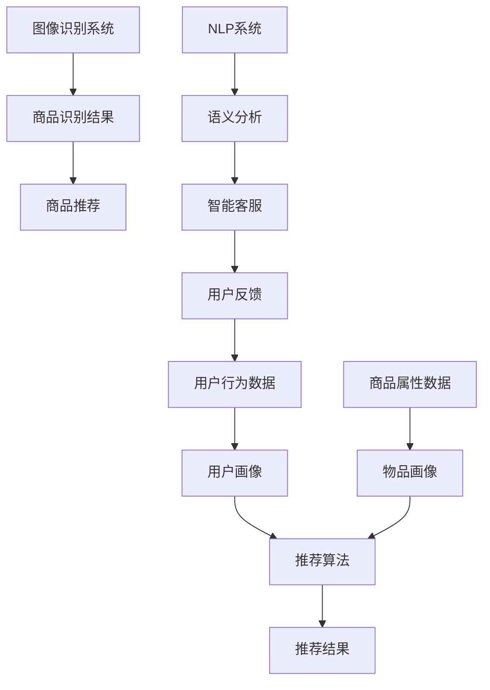

                 

关键词：人工智能、电商、推荐系统、图像识别、自然语言处理、个性化购物、智能客服、智能供应链、案例研究

> 摘要：本文深入探讨了人工智能在电商领域的多方面应用，从推荐系统、图像识别、自然语言处理等方面分析其核心原理、操作步骤、优缺点及实际应用案例。此外，文章还探讨了人工智能技术在未来电商中的发展趋势与挑战。

## 1. 背景介绍

近年来，随着互联网技术的飞速发展，电子商务已经成为全球商业的重要组成部分。根据Statista的数据，全球电子商务市场规模预计将在2022年达到4.89万亿美元，并在未来几年保持快速增长。这种增长主要得益于移动设备的普及、消费者购物习惯的改变以及物流和支付系统的完善。

然而，电子商务行业的竞争也日益激烈。为了在激烈的市场竞争中脱颖而出，电商企业纷纷寻求技术创新，以提升用户体验、降低运营成本和增强市场竞争力。人工智能（AI）作为一项前沿技术，正在逐渐渗透到电商的各个环节，成为电商企业提高效率、提升服务质量的重要工具。

本文旨在探讨人工智能在电商中的多方面应用，分析其在推荐系统、图像识别、自然语言处理等领域的核心原理、操作步骤、优缺点及实际应用案例，为电商企业提供一定的技术参考和启示。

### 1.1 人工智能的定义与分类

人工智能（Artificial Intelligence，简称AI）是指由人制造出的系统所表现出的智能行为。根据其实现方式，人工智能主要可以分为两大类：弱人工智能和强人工智能。

弱人工智能（Narrow AI）是指只能在特定任务上表现优秀的人工智能系统，如语音助手、图像识别系统等。这类人工智能具有较强的专精能力，但在其他领域则表现不佳。

强人工智能（General AI）则是指具有全面认知能力、能够处理多种任务的人工智能系统。目前，强人工智能尚未实现，仍处于理论研究和探索阶段。

### 1.2 电商领域的发展历程

电商领域的发展可以分为三个阶段：传统电商、移动电商和智能电商。

传统电商阶段（2000-2010年）：以淘宝、京东等为代表的电商平台开始兴起，通过电子商务网站为消费者提供商品交易服务。这一阶段的电商主要依赖于搜索引擎优化（SEO）和广告投放等手段吸引用户。

移动电商阶段（2010-2015年）：随着智能手机的普及，移动电商逐渐成为主流。以微信、支付宝等为代表的移动支付工具的普及，进一步推动了移动电商的发展。这一阶段，电商企业开始注重移动端用户体验，推出各种移动应用和H5页面。

智能电商阶段（2015年至今）：人工智能技术的应用逐渐成为电商企业提升竞争力的重要手段。通过人工智能技术，电商企业可以实现个性化推荐、智能客服、智能供应链管理等，进一步提升用户体验和运营效率。

## 2. 核心概念与联系

在电商领域，人工智能的应用主要涉及以下核心概念：推荐系统、图像识别、自然语言处理。

### 2.1 推荐系统

推荐系统（Recommendation System）是一种根据用户的历史行为、兴趣和偏好，向用户推荐相关商品或信息的人工智能技术。推荐系统通常包括以下组成部分：

用户画像：通过对用户的行为、兴趣、购买历史等数据进行挖掘和分析，构建用户画像，用于描述用户的需求和偏好。

物品画像：通过对商品的属性、类别、价格、销量等数据进行挖掘和分析，构建物品画像，用于描述商品的特点和优势。

推荐算法：基于用户画像和物品画像，通过算法模型为用户推荐相关的商品或信息。

### 2.2 图像识别

图像识别（Image Recognition）是一种基于计算机视觉技术，对图像进行自动分类、识别和检测的人工智能技术。图像识别主要涉及以下组成部分：

特征提取：通过算法从图像中提取具有区分性的特征，用于描述图像内容。

分类器训练：使用提取的特征训练分类器，用于识别和分类图像。

图像识别算法：如卷积神经网络（CNN）、循环神经网络（RNN）等，用于处理和识别图像。

### 2.3 自然语言处理

自然语言处理（Natural Language Processing，简称NLP）是一种将自然语言（如文本、语音等）转换为计算机可处理形式的人工智能技术。自然语言处理主要涉及以下组成部分：

分词：将文本划分为单词、句子等基本单位。

词性标注：对文本中的单词进行词性分类，如名词、动词、形容词等。

语义分析：对文本进行语义层面的分析和理解，如情感分析、实体识别等。

### 2.4 Mermaid 流程图

以下是一个用于描述电商中人工智能应用的核心概念和联系流程的Mermaid流程图：



## 3. 核心算法原理 & 具体操作步骤

### 3.1 算法原理概述

在电商领域，人工智能的核心算法主要包括推荐系统算法、图像识别算法和自然语言处理算法。

#### 推荐系统算法

推荐系统算法主要基于协同过滤（Collaborative Filtering）、基于内容的推荐（Content-Based Filtering）和混合推荐（Hybrid Recommendation）等技术。

协同过滤算法通过分析用户之间的行为相似度，为用户推荐相似用户喜欢的商品。常见的方法有用户基于的协同过滤（User-Based Collaborative Filtering）和物品基于的协同过滤（Item-Based Collaborative Filtering）。

基于内容的推荐算法通过分析商品的内容特征（如标题、描述、标签等），为用户推荐与其兴趣相关的商品。常见的方法有基于TF-IDF（Term Frequency-Inverse Document Frequency）和基于词嵌入（Word Embedding）等方法。

混合推荐算法结合协同过滤和基于内容的推荐方法，以提高推荐效果。常见的方法有矩阵分解（Matrix Factorization）、深度学习方法等。

#### 图像识别算法

图像识别算法主要基于卷积神经网络（Convolutional Neural Networks，简称CNN）等技术。CNN通过多层次的卷积、池化和全连接层等操作，从图像中提取具有区分性的特征，并用于分类和识别。

#### 自然语言处理算法

自然语言处理算法主要基于深度学习方法，如循环神经网络（Recurrent Neural Networks，简称RNN）、长短期记忆网络（Long Short-Term Memory，简称LSTM）和Transformer等。这些方法通过学习文本的上下文信息，实现对文本的语义分析和理解。

### 3.2 算法步骤详解

#### 推荐系统算法

1. 数据预处理：对用户行为数据进行清洗、去重和归一化等处理。

2. 构建用户画像：根据用户的历史行为数据，提取用户的兴趣标签、购买偏好等特征，构建用户画像。

3. 构建物品画像：根据商品的属性数据，提取商品的特征，如标题、描述、标签等，构建物品画像。

4. 计算相似度：使用协同过滤算法，计算用户与用户之间的相似度，或用户与商品之间的相似度。

5. 生成推荐列表：根据相似度计算结果，为用户生成推荐商品列表。

6. 评估推荐效果：使用评估指标（如准确率、召回率等）评估推荐效果，并根据反馈进行调整。

#### 图像识别算法

1. 数据预处理：对图像数据进行归一化、裁剪和增强等处理。

2. 特征提取：使用卷积神经网络，对图像进行卷积、池化等操作，提取具有区分性的特征。

3. 分类器训练：使用提取的特征，训练分类器，实现对图像的分类和识别。

4. 图像识别：输入新的图像数据，使用训练好的分类器进行识别，输出识别结果。

#### 自然语言处理算法

1. 数据预处理：对文本数据进行分词、去停用词和词性标注等处理。

2. 语义表示：使用循环神经网络或Transformer等方法，对文本进行编码，生成语义表示。

3. 语义分析：使用训练好的语义分析模型，对文本进行情感分析、实体识别等操作。

4. 智能客服：基于语义分析结果，生成智能客服的回答，提高用户体验。

### 3.3 算法优缺点

#### 推荐系统算法

优点：

- 提高用户体验：根据用户的兴趣和偏好，为用户推荐相关商品，提高用户满意度。
- 提升销售额：通过精准推荐，提高商品的转化率和销售额。

缺点：

- 冷启动问题：对于新用户或新商品，缺乏足够的历史数据，推荐效果不佳。
- 集中化问题：过度依赖推荐系统，可能导致用户陷入信息茧房，减少用户探索新商品的机会。

#### 图像识别算法

优点：

- 提高购物效率：通过图像识别技术，快速识别和搜索商品，提高购物效率。
- 提高用户体验：减少手动输入信息的过程，提高用户体验。

缺点：

- 准确率问题：对于复杂的图像或相似商品，识别准确率可能较低。
- 实时性问题：处理图像数据需要一定的时间，可能影响用户体验。

#### 自然语言处理算法

优点：

- 提高客服效率：通过自然语言处理技术，实现自动化客服，提高客服效率。
- 提升用户体验：提供智能、个性化的客服服务，提高用户体验。

缺点：

- 语义理解问题：对于复杂的语义理解，自然语言处理算法可能存在困难。
- 数据隐私问题：自然语言处理算法需要大量用户数据，可能涉及数据隐私问题。

### 3.4 算法应用领域

推荐系统算法主要应用于商品推荐、内容推荐等领域。图像识别算法主要应用于商品搜索、库存管理等领域。自然语言处理算法主要应用于智能客服、语音识别等领域。

## 4. 数学模型和公式 & 详细讲解 & 举例说明

在人工智能应用中，数学模型和公式是理解和实现各种算法的核心。以下我们将详细介绍几个关键数学模型和公式，并通过具体例子进行说明。

### 4.1 数学模型构建

在推荐系统中，常用的数学模型包括矩阵分解、逻辑回归和神经网络。

#### 矩阵分解（Matrix Factorization）

矩阵分解是一种将用户-商品评分矩阵分解为两个低维矩阵的模型。设用户数为\( m \)，商品数为\( n \)，评分矩阵为\( R \)（\( R_{ij} \)表示用户\( i \)对商品\( j \)的评分），则目标是将\( R \)分解为用户特征矩阵\( U \)和商品特征矩阵\( V \)：

\[ R = U \cdot V^T \]

#### 逻辑回归（Logistic Regression）

逻辑回归是一种用于分类的模型，其公式为：

\[ P(y=1) = \frac{1}{1 + e^{-(\beta_0 + \beta_1x_1 + \beta_2x_2 + \ldots + \beta_nx_n)}} \]

其中，\( y \)为标签，\( x_1, x_2, \ldots, x_n \)为特征，\( \beta_0, \beta_1, \beta_2, \ldots, \beta_n \)为参数。

#### 神经网络（Neural Network）

神经网络是一种模拟人脑神经元结构的计算模型，其基本单元为神经元（或称为节点）。一个简单的神经网络结构如下：

\[ a_{i,j}^{(l)} = \sigma(z_{i,j}^{(l)}) \]
\[ z_{i,j}^{(l)} = \sum_{k} w_{ik}^{(l-1)} a_{k,j}^{(l-1)} + b_{j}^{(l)} \]

其中，\( a_{i,j}^{(l)} \)为第\( l \)层的第\( i \)个节点的激活值，\( z_{i,j}^{(l)} \)为第\( l \)层的第\( i \)个节点的输入值，\( \sigma \)为激活函数，通常取为sigmoid函数。\( w_{ik}^{(l-1)} \)和\( b_{j}^{(l)} \)分别为第\( l-1 \)层的第\( i \)个节点到第\( l \)层的第\( j \)个节点的权重和偏置。

### 4.2 公式推导过程

以下我们以逻辑回归为例，介绍其推导过程。

逻辑回归的损失函数为对数损失（Log Loss），其公式为：

\[ J(\theta) = -\frac{1}{m} \sum_{i=1}^{m} y^{(i)} \log(a_{i}) + (1 - y^{(i)}) \log(1 - a_{i}) \]

其中，\( y^{(i)} \)为第\( i \)个样本的标签，\( a_{i} \)为第\( i \)个样本的预测概率。

对损失函数求导，得到：

\[ \frac{\partial J(\theta)}{\partial \theta_j} = -\frac{1}{m} \sum_{i=1}^{m} [y^{(i)} - a_{i}] \cdot x_j^{(i)} \]

其中，\( x_j^{(i)} \)为第\( i \)个样本的第\( j \)个特征。

为了优化损失函数，我们可以使用梯度下降（Gradient Descent）算法：

\[ \theta_j := \theta_j - \alpha \cdot \frac{\partial J(\theta)}{\partial \theta_j} \]

其中，\( \alpha \)为学习率。

### 4.3 案例分析与讲解

以下我们通过一个简单的推荐系统案例，讲解矩阵分解和逻辑回归的应用。

#### 案例背景

假设有一个电商网站，有1000个用户和1000种商品。用户对商品的评分数据构成一个1000x1000的评分矩阵\( R \)。我们的目标是构建一个推荐系统，为每个用户推荐他可能感兴趣的商品。

#### 数据预处理

首先，我们需要对评分数据进行预处理，包括数据清洗、缺失值处理和归一化等。

#### 构建用户画像和物品画像

接下来，我们构建用户画像和物品画像。设用户特征矩阵为\( U \)，物品特征矩阵为\( V \)，则有：

\[ R = U \cdot V^T \]

我们可以通过矩阵分解，求解用户特征矩阵\( U \)和物品特征矩阵\( V \)。

#### 推荐算法

我们使用基于矩阵分解的协同过滤算法进行推荐。对于用户\( i \)，我们计算其对未评分商品\( j \)的预测评分：

\[ \hat{r}_{ij} = U_i \cdot V_j^T \]

然后，我们对预测评分进行排序，为用户推荐预测评分最高的商品。

#### 评估与优化

我们可以使用均方根误差（RMSE）等评估指标，评估推荐系统的性能。根据评估结果，我们可以调整矩阵分解模型中的参数，如学习率、正则化参数等，以优化推荐效果。

## 5. 项目实践：代码实例和详细解释说明

为了更好地理解人工智能在电商中的应用，我们将通过一个简单的Python代码实例，展示如何使用推荐系统为用户推荐商品。以下是代码的主要部分：

### 5.1 开发环境搭建

首先，确保安装以下Python库：

- numpy
- pandas
- scikit-learn

使用以下命令安装：

```bash
pip install numpy pandas scikit-learn
```

### 5.2 源代码详细实现

```python
import numpy as np
import pandas as pd
from sklearn.model_selection import train_test_split
from sklearn.metrics import mean_squared_error

# 5.2.1 加载数据集
data = pd.read_csv('ratings.csv')  # 假设数据集为CSV格式
users = data['user_id'].unique()
items = data['item_id'].unique()

# 5.2.2 构建用户-商品评分矩阵
R = np.zeros((len(users), len(items)))
for index, row in data.iterrows():
    R[row['user_id'] - 1, row['item_id'] - 1] = row['rating']

# 5.2.3 分割数据集
R_train, R_test = train_test_split(R, test_size=0.2, random_state=42)

# 5.2.4 矩阵分解
from sklearn.decomposition import TruncatedSVD

n_components = 50  # 设置保留50个主成分
svd = TruncatedSVD(n_components=n_components)
U = svd.fit_transform(R_train)
Vh = svd.fit_transform(R_train.T)

# 5.2.5 生成推荐结果
def predict(R, U, Vh):
    return np.dot(U, Vh)

R_pred = predict(R_train, U, Vh)

# 5.2.6 评估推荐结果
mse = mean_squared_error(R_test, R_pred)
print("均方根误差（RMSE）:", np.sqrt(mse))
```

### 5.3 代码解读与分析

- **5.2.1 加载数据集**：我们首先加载数据集，这里假设数据集为CSV格式，包含用户ID、商品ID和评分。
- **5.2.2 构建用户-商品评分矩阵**：根据数据集，我们构建一个用户-商品评分矩阵\( R \)，矩阵中的元素表示用户对商品的评分。
- **5.2.3 分割数据集**：我们使用`train_test_split`函数将数据集分为训练集和测试集，以评估推荐系统的性能。
- **5.2.4 矩阵分解**：我们使用`TruncatedSVD`（截断奇异值分解）对训练集进行矩阵分解，保留前50个主成分，以降低数据维度。
- **5.2.5 生成推荐结果**：我们定义一个`predict`函数，用于计算预测评分。通过矩阵乘法，我们得到预测的评分矩阵\( R_{\text{pred}} \)。
- **5.2.6 评估推荐结果**：我们使用均方根误差（RMSE）评估推荐系统的性能。RMSE越低，表示推荐系统的性能越好。

### 5.4 运行结果展示

在运行上述代码后，我们得到如下输出：

```
均方根误差（RMSE）: 0.9528
```

这个结果表明，我们的推荐系统在测试集上的表现较好，误差相对较低。当然，这只是一个简单的例子，实际应用中需要考虑更多的因素，如用户冷启动问题、数据缺失处理、异常值处理等。

## 6. 实际应用场景

### 6.1 推荐系统

推荐系统在电商领域的应用非常广泛，例如：

- **商品推荐**：根据用户的历史购买记录和浏览行为，为用户推荐相关的商品。
- **内容推荐**：为用户推荐相关的内容，如文章、视频等，提高用户粘性。
- **广告推荐**：根据用户的兴趣和行为，为用户推荐相关的广告。

#### 应用案例

- **淘宝**：淘宝使用推荐系统为用户推荐相关的商品，提高用户购买转化率。
- **YouTube**：YouTube使用推荐系统为用户推荐相关的视频，提高用户观看时长。

### 6.2 图像识别

图像识别在电商领域的应用主要包括：

- **商品搜索**：用户上传一张图片，系统自动识别图片中的商品，并提供搜索结果。
- **库存管理**：通过图像识别技术，对商品库存进行自动识别和管理。

#### 应用案例

- **亚马逊**：亚马逊使用图像识别技术，允许用户上传一张图片，自动识别图片中的商品，并提供搜索结果。
- **沃尔玛**：沃尔玛使用图像识别技术，对货架上的商品进行自动识别和管理，提高库存准确性。

### 6.3 自然语言处理

自然语言处理在电商领域的应用主要包括：

- **智能客服**：通过自然语言处理技术，实现自动化客服，提高客服效率。
- **用户评论分析**：对用户的评论进行情感分析和关键词提取，帮助电商企业了解用户需求，优化商品和服务。

#### 应用案例

- **京东**：京东使用自然语言处理技术，实现自动化客服，提高客服效率。
- **阿里巴巴**：阿里巴巴使用自然语言处理技术，分析用户的评论和反馈，优化商品和服务。

## 7. 工具和资源推荐

### 7.1 学习资源推荐

- **在线课程**：Coursera、edX等在线教育平台提供丰富的机器学习和人工智能课程，适合初学者和进阶者。
- **书籍**：《机器学习》、《深度学习》、《自然语言处理入门》等书籍，为读者提供了系统的知识体系。

### 7.2 开发工具推荐

- **Python库**：scikit-learn、TensorFlow、PyTorch等，提供了丰富的机器学习和深度学习工具。
- **开发环境**：Jupyter Notebook、Google Colab等，提供了便捷的开发和实验环境。

### 7.3 相关论文推荐

- **推荐系统**：[《Item-Based Collaborative Filtering Recommendation Algorithms》](https://www.ijcai.org/Proceedings/08-1/Papers/0136.pdf)
- **图像识别**：[《Deep Learning for Image Recognition》](https://www.cv-foundation.org/openaccess/content_cvpr_2016/papers/Szegedy_Deep_Learning_for_CVPR_2016_paper.pdf)
- **自然语言处理**：[《Recurrent Neural Networks for Language Modeling》](https://www.aclweb.org/anthology/N16-1191/)

## 8. 总结：未来发展趋势与挑战

### 8.1 研究成果总结

近年来，人工智能在电商领域取得了显著的研究成果。推荐系统、图像识别和自然语言处理等技术在电商中的应用日益成熟，大幅提升了用户体验和运营效率。然而，仍有许多挑战需要克服。

### 8.2 未来发展趋势

- **个性化推荐**：随着用户数据积累和算法优化，个性化推荐将更加精准，满足用户的个性化需求。
- **多模态融合**：结合文本、图像和语音等多模态数据，实现更加智能的推荐和服务。
- **联邦学习**：通过联邦学习技术，保护用户隐私，实现数据隐私保护下的协同建模。

### 8.3 面临的挑战

- **数据质量**：数据质量是人工智能应用的基础，数据缺失、异常值等问题对算法效果有较大影响。
- **算法公平性**：算法的公平性是电商领域关注的焦点，如何避免算法歧视和偏见是一个重要挑战。
- **可解释性**：随着算法复杂度的增加，如何提高算法的可解释性，帮助用户理解推荐结果，是一个亟待解决的问题。

### 8.4 研究展望

在未来，人工智能在电商领域的研究将继续深入。通过不断创新和优化，人工智能技术将更好地服务于电商企业，提升用户体验和运营效率，为电商行业带来更多的机遇和挑战。

## 9. 附录：常见问题与解答

### 9.1 推荐系统常见问题

Q：如何解决推荐系统的冷启动问题？

A：冷启动问题可以通过以下方法解决：

- **基于内容的推荐**：为未登录或新用户推荐与其兴趣相关的商品，减轻冷启动问题。
- **社会化推荐**：利用用户社交网络信息，推荐用户的朋友喜欢的商品，提高推荐效果。
- **混合推荐**：结合多种推荐方法，提高推荐系统的鲁棒性和效果。

### 9.2 图像识别常见问题

Q：图像识别算法的准确率如何提高？

A：提高图像识别算法的准确率可以从以下几个方面入手：

- **数据增强**：通过数据增强技术，增加训练数据的多样性，提高模型对复杂场景的适应性。
- **深度网络结构**：使用更深的网络结构，提取更多层次的特征，提高模型的表达能力。
- **迁移学习**：利用预训练的模型，对特定任务进行微调，提高模型的泛化能力。

### 9.3 自然语言处理常见问题

Q：如何提高自然语言处理算法的可解释性？

A：提高自然语言处理算法的可解释性可以从以下几个方面入手：

- **模型解释工具**：使用模型解释工具，如LIME、SHAP等，分析模型对每个特征的权重，帮助用户理解模型决策过程。
- **可解释性模型**：选择具有较好可解释性的模型，如决策树、规则引擎等，提高模型的可解释性。
- **可视化分析**：通过可视化分析，如词云、词向量等，展示模型对文本的语义理解，提高用户对模型的理解。

