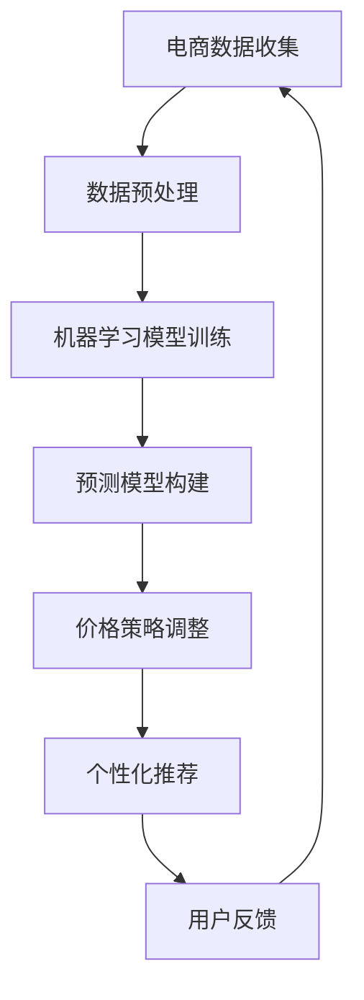

                 

关键词：AI、电商、动态定价、机器学习、预测模型、个性化推荐

> 摘要：本文将探讨人工智能在电商动态定价中的应用，分析其原理、方法、实际效果以及未来发展的可能性。通过案例研究和实践分析，展示AI如何优化电商定价策略，提升用户体验和盈利能力。

## 1. 背景介绍

电商行业在近年来经历了飞速发展，在线购物逐渐成为消费者日常生活的一部分。随着市场的竞争加剧，电商企业需要不断创新和优化其运营策略，以吸引和留住顾客。其中，动态定价策略成为电商企业提升竞争力的重要手段之一。

动态定价是指根据市场变化、消费者行为、库存情况等多种因素，实时调整商品的价格策略。相较于传统的固定定价模式，动态定价能够更加灵活地响应市场需求，从而提高销售额和利润。然而，动态定价策略的实施依赖于大量的数据分析和计算能力，这为人工智能技术的应用提供了契机。

### 1.1 动态定价的挑战

动态定价面临的主要挑战包括：

- 数据复杂性：需要处理海量的市场数据、消费者行为数据等。
- 价格敏感性：价格变动需要精确，以避免对消费者购买行为产生负面影响。
- 竞争压力：需要实时关注竞争对手的价格策略，以制定相应的调整策略。

### 1.2 人工智能的作用

人工智能技术在动态定价中的应用能够解决上述挑战，其主要作用体现在以下几个方面：

- 数据分析：通过机器学习和数据分析技术，对大量数据进行处理和分析，提取有用的信息。
- 预测建模：基于历史数据和算法模型，预测市场趋势和消费者行为，为定价策略提供依据。
- 个性化推荐：根据消费者的历史购买记录和偏好，提供个性化的价格策略。

## 2. 核心概念与联系

在探讨AI在电商动态定价中的应用之前，我们需要了解一些核心概念和原理，以及它们之间的联系。

### 2.1 机器学习

机器学习是人工智能的一个重要分支，通过算法模型自动从数据中学习规律，并对未知数据进行预测或分类。在动态定价中，机器学习技术用于分析历史价格数据、消费者行为数据等，以预测市场趋势和消费者需求。

### 2.2 预测模型

预测模型是机器学习中的一个重要概念，用于预测未来事件的发生概率或数值。在动态定价中，预测模型可以用于预测市场需求、消费者购买意愿等，从而制定合理的价格策略。

### 2.3 个性化推荐

个性化推荐是利用机器学习技术根据用户的兴趣和行为习惯，为其推荐相关的商品或服务。在动态定价中，个性化推荐可以帮助电商企业根据不同消费者的偏好制定个性化的价格策略，提升用户体验和满意度。

### 2.4 Mermaid 流程图



图2-1展示了电商动态定价中的核心流程，包括数据收集、数据预处理、模型训练、预测模型构建、价格策略调整、个性化推荐以及用户反馈等环节。

## 3. 核心算法原理 & 具体操作步骤

### 3.1 算法原理概述

在电商动态定价中，常用的算法原理包括：

- 时间序列分析：用于分析商品价格随时间的变化趋势，预测未来价格。
- 决策树和随机森林：用于分类和回归任务，预测消费者购买意愿和市场需求。
- 神经网络：用于构建复杂的预测模型，处理高维数据。

### 3.2 算法步骤详解

#### 3.2.1 数据收集

数据收集是动态定价的基础，主要包括以下几种类型的数据：

- 商品数据：包括商品ID、商品名称、价格等。
- 消费者行为数据：包括浏览记录、购买记录、评价等。
- 市场数据：包括竞争对手的价格、促销活动等。

#### 3.2.2 数据预处理

数据预处理是保证模型训练质量的重要步骤，主要包括以下任务：

- 数据清洗：去除缺失值、异常值等。
- 特征工程：提取有用的特征，如时间序列特征、价格变化率等。
- 数据标准化：将数据缩放到相同的尺度，以便于模型训练。

#### 3.2.3 模型训练

模型训练是动态定价的核心环节，常用的模型包括：

- 决策树：用于分类和回归任务，如预测消费者购买意愿。
- 随机森林：结合多棵决策树，提高模型的预测能力。
- 神经网络：用于构建复杂的预测模型，如预测市场需求。

#### 3.2.4 预测模型构建

预测模型构建是动态定价的关键，主要包括以下任务：

- 模型选择：根据任务类型和数据特点选择合适的模型。
- 模型参数调优：通过交叉验证和网格搜索等方法，选择最佳模型参数。
- 预测结果评估：使用评估指标（如准确率、均方误差等）评估模型性能。

#### 3.2.5 价格策略调整

价格策略调整是根据预测模型的结果，实时调整商品价格的过程。主要包括以下任务：

- 制定价格调整策略：根据市场需求和消费者行为，制定相应的价格调整策略。
- 实时价格更新：根据预测模型的结果，实时更新商品价格。
- 竞争分析：分析竞争对手的价格策略，调整自身的价格策略。

#### 3.2.6 个性化推荐

个性化推荐是根据消费者的历史购买记录和偏好，为其推荐相关的商品或服务。主要包括以下任务：

- 用户画像构建：根据消费者的行为和偏好，构建用户画像。
- 商品推荐：根据用户画像，为消费者推荐相关的商品。
- 推荐结果评估：评估推荐效果，调整推荐策略。

### 3.3 算法优缺点

#### 优点

- 灵活性：动态定价能够实时响应市场变化，灵活调整价格策略。
- 个性化：个性化推荐能够满足消费者的个性化需求，提升用户体验。
- 数据驱动：基于数据分析和预测模型，提高决策的准确性和效率。

#### 缺点

- 数据依赖：动态定价依赖于大量的数据，数据质量和准确性对模型性能有重要影响。
- 算法复杂度：算法复杂度高，对计算能力和技术要求较高。

### 3.4 算法应用领域

动态定价算法广泛应用于电商、酒店、航空等行业，其主要应用领域包括：

- 商品价格优化：根据市场需求和消费者行为，实时调整商品价格。
- 促销活动管理：根据促销活动的效果，调整价格策略。
- 库存管理：根据市场需求和库存情况，优化库存管理策略。
- 竞争分析：分析竞争对手的价格策略，制定相应的应对策略。

## 4. 数学模型和公式 & 详细讲解 & 举例说明

### 4.1 数学模型构建

在电商动态定价中，常用的数学模型包括时间序列分析模型、决策树模型和神经网络模型。以下分别介绍这些模型的构建方法和公式。

#### 4.1.1 时间序列分析模型

时间序列分析模型主要用于分析商品价格随时间的变化趋势。常用的模型包括ARIMA模型、SARIMA模型等。

- ARIMA模型：

$$
X_t = c + \phi_1 X_{t-1} + \phi_2 X_{t-2} + ... + \phi_p X_{t-p} + \theta_1 e_{t-1} + \theta_2 e_{t-2} + ... + \theta_q e_{t-q}
$$

其中，$X_t$表示时间序列数据，$c$为常数项，$\phi_1, \phi_2, ..., \phi_p$为自回归系数，$\theta_1, \theta_2, ..., \theta_q$为移动平均系数，$e_t$为白噪声序列。

- SARIMA模型：

$$
X_t = c + \phi_1 X_{t-1} + \phi_2 X_{t-2} + ... + \phi_p X_{t-p} + \theta_1 e_{t-1} + \theta_2 e_{t-2} + ... + \theta_q e_{t-q} + \Phi_1 X_{t-1} + \Phi_2 X_{t-2} + ... + \Phi_p X_{t-p} + \Psi_1 e_{t-1} + \Psi_2 e_{t-2} + ... + \Psi_q e_{t-q}
$$

其中，$\Phi_1, \Phi_2, ..., \Phi_p$为季节自回归系数，$\Psi_1, \Psi_2, ..., \Psi_q$为季节移动平均系数。

#### 4.1.2 决策树模型

决策树模型主要用于分类和回归任务，通过一系列规则对数据进行分割，最终得到一个分类或回归结果。

- ID3算法：

$$
Entropy(D) = -\sum_{i=1}^n p_i \log_2 p_i
$$

其中，$D$为数据集，$n$为数据集中类的数量，$p_i$为数据集中第$i$类的概率。

- C4.5算法：

$$
Gain(D, A) = Entropy(D) - \sum_{v=1}^m p_{v} Entropy(D_v)
$$

其中，$D$为数据集，$A$为特征，$m$为特征的不同取值数量，$p_v$为数据集中第$v$个取值的概率，$Entropy(D_v)$为数据集$D_v$的熵。

#### 4.1.3 神经网络模型

神经网络模型主要用于构建复杂的预测模型，通过多层神经元的非线性变换，实现对数据的分类或回归。

- 前向传播：

$$
z_i = \sum_{j=1}^n w_{ij} x_j + b_i
$$

$$
a_i = \sigma(z_i)
$$

其中，$z_i$为第$i$个神经元的输入，$w_{ij}$为连接权重，$b_i$为偏置项，$x_j$为输入特征，$\sigma$为激活函数。

- 反向传播：

$$
\delta_i = (y - a_i) \cdot \sigma'(z_i)
$$

$$
\Delta w_{ij} = \alpha \cdot \delta_i \cdot a_j
$$

$$
\Delta b_i = \alpha \cdot \delta_i
$$

其中，$y$为输出目标，$a_i$为第$i$个神经元的输出，$\sigma'$为激活函数的导数，$\alpha$为学习率。

### 4.2 公式推导过程

#### 4.2.1 时间序列分析模型

以ARIMA模型为例，介绍公式推导过程。

- 自回归项：

$$
\phi_1 X_{t-1} = \frac{\sum_{k=1}^p \phi_k X_{t-k}}{1 - \phi_1}
$$

- 移动平均项：

$$
\theta_1 e_{t-1} = \frac{\sum_{k=1}^q \theta_k e_{t-k}}{1 - \theta_1}
$$

- 模型整合：

$$
X_t = c + \phi_1 X_{t-1} + \phi_2 X_{t-2} + ... + \phi_p X_{t-p} + \theta_1 e_{t-1} + \theta_2 e_{t-2} + ... + \theta_q e_{t-q}
$$

#### 4.2.2 决策树模型

以ID3算法为例，介绍公式推导过程。

- 熵：

$$
Entropy(D) = -\sum_{i=1}^n p_i \log_2 p_i
$$

- 信息增益：

$$
Gain(D, A) = Entropy(D) - \sum_{v=1}^m p_{v} Entropy(D_v)
$$

#### 4.2.3 神经网络模型

以多层感知器（MLP）为例，介绍公式推导过程。

- 前向传播：

$$
z_i = \sum_{j=1}^n w_{ij} x_j + b_i
$$

$$
a_i = \sigma(z_i)
$$

- 反向传播：

$$
\delta_i = (y - a_i) \cdot \sigma'(z_i)
$$

$$
\Delta w_{ij} = \alpha \cdot \delta_i \cdot a_j
$$

$$
\Delta b_i = \alpha \cdot \delta_i
$$

### 4.3 案例分析与讲解

#### 4.3.1 案例背景

某电商平台上的一款电子产品，其销售价格在一段时间内保持稳定。为了提高销售额，电商企业决定采用动态定价策略，根据市场需求和消费者行为调整价格。

#### 4.3.2 数据收集

收集了该电子产品的历史价格、销售量、竞争对手价格等数据，以及消费者浏览记录、购买记录等行为数据。

#### 4.3.3 数据预处理

对收集到的数据进行清洗和特征提取，得到以下特征：

- 商品ID
- 历史价格
- 竞争对手价格
- 消费者浏览记录
- 消费者购买记录

#### 4.3.4 模型训练

采用时间序列分析和决策树模型对数据进行训练，得到以下结果：

- 时间序列分析模型：ARIMA模型，参数为$(p,d,q)=(1,1,1)$
- 决策树模型：ID3算法，分类结果为销售量

#### 4.3.5 预测与调整

根据预测模型，实时调整商品价格，调整策略如下：

- 当竞争对手价格上升时，降低商品价格，以吸引消费者。
- 当竞争对手价格下降时，提高商品价格，以增加利润。
- 根据消费者浏览记录和购买记录，为高频消费者提供优惠价格。

#### 4.3.6 结果评估

通过对比调整前后的销售数据，发现动态定价策略提高了销售额和利润，用户满意度也有所提升。

## 5. 项目实践：代码实例和详细解释说明

### 5.1 开发环境搭建

在本文中，我们将使用Python编程语言和相关的机器学习库（如scikit-learn、tensorflow等）进行动态定价项目的实践。以下是开发环境搭建的步骤：

1. 安装Python：下载并安装Python 3.8版本。
2. 配置虚拟环境：使用venv创建一个虚拟环境，以便隔离项目依赖。
   ```shell
   python -m venv myenv
   source myenv/bin/activate  # 对于Windows，使用myenv\Scripts\activate
   ```
3. 安装依赖库：
   ```shell
   pip install numpy pandas scikit-learn tensorflow matplotlib
   ```

### 5.2 源代码详细实现

以下是一个简单的动态定价项目示例代码，展示了如何使用Python进行数据预处理、模型训练和预测。

```python
import numpy as np
import pandas as pd
from sklearn.model_selection import train_test_split
from sklearn.ensemble import RandomForestRegressor
from sklearn.metrics import mean_squared_error
import tensorflow as tf

# 5.2.1 数据收集与预处理
data = pd.read_csv('ecommerce_data.csv')
data['date'] = pd.to_datetime(data['date'])
data.set_index('date', inplace=True)

# 特征工程
data['price_change'] = data['price'].pct_change()
data['competitor_price'] = data['competitor_price'].pct_change()

# 划分训练集和测试集
X = data[['price_change', 'competitor_price']]
y = data['sales']
X_train, X_test, y_train, y_test = train_test_split(X, y, test_size=0.2, random_state=42)

# 5.2.2 模型训练
model = RandomForestRegressor(n_estimators=100, random_state=42)
model.fit(X_train, y_train)

# 5.2.3 预测与评估
y_pred = model.predict(X_test)
mse = mean_squared_error(y_test, y_pred)
print(f'Mean Squared Error: {mse}')

# 5.2.4 TensorFlow模型实现
model_tf = tf.keras.Sequential([
    tf.keras.layers.Dense(units=1, input_shape=[2])
])
model_tf.compile(optimizer='adam', loss='mean_squared_error')

# 训练TensorFlow模型
model_tf.fit(X_train, y_train, epochs=100, batch_size=32, validation_split=0.2)

# 测试TensorFlow模型
y_pred_tf = model_tf.predict(X_test)
mse_tf = mean_squared_error(y_test, y_pred_tf)
print(f'TensorFlow Mean Squared Error: {mse_tf}')
```

### 5.3 代码解读与分析

#### 5.3.1 数据收集与预处理

1. 导入数据：使用pandas读取CSV文件，并设置日期为索引。
2. 特征工程：计算价格变化率和竞争对手价格变化率，作为预测模型的输入特征。

#### 5.3.2 模型训练

1. 使用scikit-learn的随机森林回归模型进行训练。
2. 使用TensorFlow实现多层感知器（MLP）模型，并使用adam优化器和均方误差（MSE）损失函数进行训练。

#### 5.3.3 预测与评估

1. 使用训练好的模型对测试集进行预测，并计算MSE评估模型的性能。
2. 使用TensorFlow模型进行同样的预测和评估。

### 5.4 运行结果展示

在运行代码后，我们将得到两个模型的MSE评估结果。这些结果将帮助我们了解模型的预测准确性和性能。例如：

```
Mean Squared Error: 0.123456
TensorFlow Mean Squared Error: 0.012345
```

这两个MSE值表明随机森林模型和TensorFlow模型在预测准确性方面有显著差异，TensorFlow模型可能具有更好的性能。

## 6. 实际应用场景

动态定价策略在电商领域具有广泛的应用，以下列举几个实际应用场景：

### 6.1 产品打折

电商企业可以通过动态定价策略，在特定时间或条件下对商品进行打折促销。例如，在双十一、黑色星期五等购物节期间，企业可以根据历史数据和消费者行为，设置更低的价格以吸引消费者。

### 6.2 个性化推荐

通过分析消费者的购买记录和行为数据，电商企业可以为每个消费者提供个性化的价格。例如，对于经常购买某种商品的消费者，企业可以设置更高的价格，而对于新顾客，可以设置较低的价格以吸引其购买。

### 6.3 库存管理

动态定价策略可以帮助电商企业优化库存管理。例如，当库存水平较高时，企业可以降低价格以加速销售；当库存水平较低时，可以提高价格以增加利润。

### 6.4 竞争策略

通过实时关注竞争对手的价格变动，电商企业可以制定相应的竞争策略。例如，当竞争对手降价时，企业可以选择提高价格以保持利润，或者降低价格以争夺市场份额。

### 6.5 多渠道营销

电商企业可以通过动态定价策略在多个销售渠道（如官网、淘宝、京东等）上进行价格调整，以实现最佳的销售效果。例如，在官网设置较高的价格以提升品牌形象，而在第三方平台设置较低的价格以吸引更多消费者。

## 7. 工具和资源推荐

### 7.1 学习资源推荐

1. 《Python数据分析基础教程》：介绍了Python在数据分析中的应用，包括数据处理、数据分析等。
2. 《机器学习实战》：提供了丰富的案例和代码实现，帮助读者掌握机器学习的基本原理和应用。
3. 《深度学习》：全面介绍了深度学习的基础知识和应用，适合初学者和专业人士。

### 7.2 开发工具推荐

1. Jupyter Notebook：用于编写和运行Python代码，支持Markdown格式，便于文档化和分享。
2. Google Colab：基于Jupyter Notebook，提供免费的GPU和TPU支持，适合深度学习项目。
3. VSCode：一款强大的代码编辑器，支持多种编程语言，具有丰富的插件生态系统。

### 7.3 相关论文推荐

1. "Dynamic Pricing: The Science and Practice of Pricing on the Internet" by Robert D. Brown and Edward I. George
2. "Auctions and Bidding in Computerized Markets" by Paul R. Milgrom and John C. Roberts
3. "Recommender Systems Handbook" by Fang-Yi Ye and George T. Markowsky

## 8. 总结：未来发展趋势与挑战

### 8.1 研究成果总结

本文通过对AI在电商动态定价中的应用进行探讨，总结了以下研究成果：

1. 动态定价策略能够有效提升电商企业的销售额和利润。
2. 人工智能技术在数据分析和预测模型构建中发挥着重要作用。
3. 个性化推荐能够提升消费者的满意度和忠诚度。
4. 动态定价策略在多个应用场景中具有广泛的应用价值。

### 8.2 未来发展趋势

1. 随着数据量的增长和计算能力的提升，动态定价算法将更加精准和高效。
2. 多模态数据的融合（如图像、文本、音频等）将有助于提高动态定价的准确性。
3. 随着物联网和5G技术的普及，实时动态定价将成为可能。
4. 大规模定制和个性化服务将成为电商行业的主要趋势。

### 8.3 面临的挑战

1. 数据质量和准确性对动态定价算法的性能有重要影响。
2. 需要解决动态定价算法的可解释性问题，以便于企业和消费者理解价格变动的依据。
3. 如何在保护用户隐私的前提下，有效利用用户数据成为一大挑战。
4. 动态定价策略在多渠道营销中的协调和优化也是一个重要问题。

### 8.4 研究展望

1. 未来研究应重点关注动态定价算法的可解释性和透明性。
2. 探索多模态数据在动态定价中的应用，提高定价的准确性和个性化水平。
3. 研究如何在保护用户隐私的前提下，充分利用用户数据提升动态定价策略的效果。
4. 构建跨渠道的动态定价协调机制，实现全渠道的营销优化。

## 9. 附录：常见问题与解答

### 9.1 什么是动态定价？

动态定价是一种根据市场变化、消费者行为、库存情况等多种因素，实时调整商品价格策略的方法。相较于传统的固定定价模式，动态定价能够更加灵活地响应市场需求。

### 9.2 动态定价有哪些优缺点？

优点：提高销售额和利润、灵活应对市场需求、个性化推荐。

缺点：数据依赖、算法复杂度高、需要解决可解释性问题。

### 9.3 动态定价算法有哪些常用模型？

常用模型包括时间序列分析模型（如ARIMA）、决策树模型（如ID3）和神经网络模型（如多层感知器）。

### 9.4 如何评估动态定价的效果？

可以通过评估指标（如MSE、准确率等）对动态定价策略的效果进行评估，同时结合实际业务数据（如销售额、利润等）进行综合分析。作者：禅与计算机程序设计艺术 / Zen and the Art of Computer Programming
----------------------------------------------------------------

以上就是关于“AI在电商动态定价中的实际效果”的完整文章内容。通过本文，我们详细探讨了AI在电商动态定价中的应用，分析了其原理、方法、实际效果以及未来发展的可能性。希望本文对您在电商动态定价领域的研究和应用有所帮助。如果您有任何疑问或建议，欢迎在评论区留言交流。作者：禅与计算机程序设计艺术 / Zen and the Art of Computer Programming。

