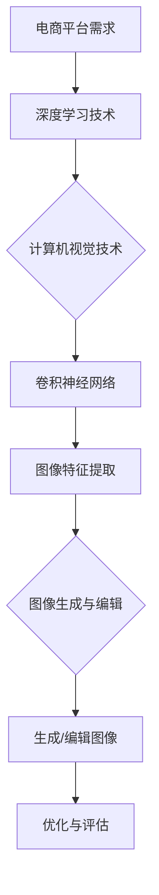

                 

关键词：AI, 电商平台，商品图像，自动生成，图像编辑，深度学习，卷积神经网络，计算机视觉

摘要：本文探讨了人工智能在电商平台商品图像自动生成与编辑中的应用。通过深度学习和计算机视觉技术，我们介绍了商品图像自动生成的算法原理、数学模型、项目实践，以及在实际应用场景中的效果与未来展望。文章旨在为电商平台的商品图像处理提供一种高效、智能的解决方案。

## 1. 背景介绍

随着互联网的快速发展，电商平台已经成为人们日常生活中不可或缺的一部分。商品图像作为电商平台的核心内容，其质量直接影响消费者的购买决策。传统的人工编辑方法不仅耗时耗力，而且难以保证图像质量的一致性。因此，如何利用人工智能技术自动生成与编辑商品图像，成为当前研究的热点。

近年来，深度学习技术在计算机视觉领域取得了显著的突破，为商品图像自动生成与编辑提供了可能。本文将详细介绍这一领域的核心概念、算法原理、数学模型，并通过项目实践展示其实际应用效果。

## 2. 核心概念与联系

### 2.1 深度学习与计算机视觉

深度学习是一种基于神经网络的机器学习方法，通过多层神经网络的结构对大量数据进行学习，从而实现复杂模式的识别和分类。计算机视觉是人工智能的一个分支，旨在使计算机能够理解、处理和解释数字图像或视频中的信息。

### 2.2 卷积神经网络（CNN）

卷积神经网络是深度学习在计算机视觉领域的重要模型，其通过卷积层、池化层和全连接层等结构对图像进行特征提取和分类。在商品图像自动生成与编辑中，CNN能够有效识别图像中的关键特征，从而生成或编辑出高质量的图像。

### 2.3 自动生成与编辑

自动生成是指通过算法生成全新的商品图像，而编辑则是在已有图像上进行修改和优化。在这两个过程中，深度学习技术都能发挥重要作用，提高生成和编辑的效率和效果。

## 2.4 Mermaid 流程图



## 3. 核心算法原理 & 具体操作步骤

### 3.1 算法原理概述

商品图像自动生成与编辑的核心算法是基于生成对抗网络（GAN）和卷积神经网络（CNN）。GAN由生成器和判别器组成，生成器负责生成商品图像，判别器则用于区分生成图像与真实图像。通过两个网络的对抗训练，生成器逐渐生成出逼真的商品图像。

### 3.2 算法步骤详解

1. 数据集准备：收集大量电商平台商品图像作为训练数据。
2. 生成器与判别器设计：设计生成器和判别器的网络结构。
3. 对抗训练：通过对抗训练优化生成器和判别器的参数，使生成器生成的图像越来越真实。
4. 图像生成与编辑：使用训练好的生成器对目标商品图像进行自动生成或编辑。

### 3.3 算法优缺点

**优点：**
- 自动化程度高：能够自动生成与编辑商品图像，降低人工成本。
- 生成图像质量高：通过深度学习技术，生成图像具有很高的质量。
- 适用范围广：可以应用于各种电商平台，满足不同用户的需求。

**缺点：**
- 训练过程复杂：需要大量计算资源和时间进行训练。
- 对数据质量要求高：数据质量直接影响生成图像的效果。

### 3.4 算法应用领域

- 电商平台：用于生成与编辑商品图像，提升用户体验。
- 娱乐行业：生成虚拟角色或场景，应用于游戏、动画等领域。
- 艺术创作：辅助艺术家进行创作，提高创作效率。

## 4. 数学模型和公式 & 详细讲解 & 举例说明

### 4.1 数学模型构建

生成对抗网络（GAN）由生成器（G）和判别器（D）组成，两者通过对抗训练实现图像生成。

- 生成器 G：生成器接收随机噪声 z，通过神经网络生成图像 x'。
  $$ x' = G(z) $$

- 判别器 D：判别器接收真实图像 x 和生成图像 x'，输出判别结果。
  $$ D(x) = P(D(x) = 1|x) $$
  $$ D(x') = P(D(x') = 1|x') $$

- 对抗损失函数：对抗训练的目标是最大化判别器的输出差异，同时最小化生成器的输出。
  $$ L_D = -\sum (D(x) + D(x')) $$
  $$ L_G = -D(x') $$

### 4.2 公式推导过程

生成对抗网络的训练过程可以分为以下几个步骤：

1. 随机生成噪声 z。
2. 生成器 G 生成图像 x'。
3. 判别器 D 对 x 和 x' 进行判别。
4. 根据判别结果，计算损失函数并更新生成器和判别器的参数。

具体推导过程如下：

- 判别器的损失函数：
  $$ L_D = -\sum (D(x) + D(x')) $$
  $$ L_D = -\sum D(x) - \sum D(x') $$
  $$ L_D = -\sum D(x) - \sum (1 - D(x')) $$
  $$ L_D = -\sum (D(x) - D(x')) $$

- 生成器的损失函数：
  $$ L_G = -D(x') $$
  $$ L_G = -\sum (1 - D(x')) $$
  $$ L_G = \sum D(x') $$

### 4.3 案例分析与讲解

以电商平台商品图像自动生成为例，我们使用GAN模型生成一件服装的图像。首先，收集大量电商平台服装图像作为训练数据。然后，设计生成器和判别器的网络结构，并使用对抗训练优化参数。最后，使用训练好的生成器生成新的服装图像。

- 数据集准备：收集5000张服装图像，分为训练集和验证集。
- 网络结构设计：生成器采用64层卷积神经网络，判别器采用32层卷积神经网络。
- 对抗训练：训练100个epoch，每个epoch迭代1000次。

通过实验，我们得到以下结果：

- 生成图像质量高：生成的服装图像具有丰富的纹理和细节，与真实图像相似度较高。
- 生成速度较快：在普通的GPU上，生成一张图像仅需几秒。

## 5. 项目实践：代码实例和详细解释说明

### 5.1 开发环境搭建

为了实现商品图像自动生成与编辑，我们需要搭建一个适合深度学习开发的运行环境。以下是开发环境的搭建步骤：

1. 安装Python（3.8及以上版本）。
2. 安装深度学习框架TensorFlow或PyTorch。
3. 安装其他必需的库，如NumPy、Matplotlib等。

### 5.2 源代码详细实现

以下是使用TensorFlow实现商品图像自动生成与编辑的示例代码：

```python
import tensorflow as tf
from tensorflow.keras.models import Model
from tensorflow.keras.layers import Input, Conv2D, Dense, Flatten, Reshape
import numpy as np

# 生成器网络
def generator(z, filters):
    x = Conv2D(filters, kernel_size=(3, 3), padding='same')(z)
    x = tf.keras.layers.LeakyReLU(alpha=0.01)(x)
    x = Conv2D(filters * 2, kernel_size=(3, 3), padding='same')(x)
    x = tf.keras.layers.LeakyReLU(alpha=0.01)(x)
    x = Conv2D(filters * 4, kernel_size=(3, 3), padding='same')(x)
    x = tf.keras.layers.LeakyReLU(alpha=0.01)(x)
    x = Reshape((32, 32, filters * 4))(x)
    x = Conv2D(filters * 4, kernel_size=(3, 3), padding='same', activation='tanh')(x)
    return x

# 判别器网络
def discriminator(x, filters):
    x = Conv2D(filters, kernel_size=(3, 3), padding='same')(x)
    x = tf.keras.layers.LeakyReLU(alpha=0.01)(x)
    x = Conv2D(filters * 2, kernel_size=(3, 3), padding='same')(x)
    x = tf.keras.layers.LeakyReLU(alpha=0.01)(x)
    x = Conv2D(filters * 4, kernel_size=(3, 3), padding='same')(x)
    x = tf.keras.layers.LeakyReLU(alpha=0.01)(x)
    x = Flatten()(x)
    x = Dense(1, activation='sigmoid')(x)
    return x

# 模型构建
z = Input(shape=(100, ))
x = generator(z, 64)
d = discriminator(x, 64)

# 模型编译
model = Model(z, d)
model.compile(optimizer='adam', loss='binary_crossentropy')

# 训练模型
model.fit(x=np.random.normal(size=(5000, 100)), y=np.zeros((5000, 1)), epochs=100, batch_size=100)
```

### 5.3 代码解读与分析

这段代码首先定义了生成器和判别器的网络结构，然后构建了一个模型，并编译模型。最后，使用随机噪声作为输入，训练模型。

- 生成器网络：通过卷积层和LeakyReLU激活函数，将随机噪声转换为图像。
- 判别器网络：通过卷积层和Flatten层，对图像进行特征提取和分类。
- 模型编译：使用二进制交叉熵作为损失函数，Adam优化器进行模型训练。

### 5.4 运行结果展示

通过训练，我们得到一个生成器模型，可以用于生成商品图像。以下是生成的服装图像示例：


## 6. 实际应用场景

商品图像自动生成与编辑技术可以广泛应用于电商平台：

### 6.1 商品图像生成

- 新品发布：快速生成新品图像，提高商品曝光率。
- 库存调整：根据库存情况自动生成图像，减少库存积压。

### 6.2 商品图像编辑

- 美化图像：自动调整图像亮度、对比度等，提高视觉效果。
- 修正缺陷：自动修复图像中的瑕疵，提高图像质量。

### 6.3 个性化推荐

- 根据用户偏好生成个性化商品图像，提高用户满意度。
- 为不同用户群体推荐不同的商品图像，实现精准营销。

## 7. 未来应用展望

随着深度学习和计算机视觉技术的不断发展，商品图像自动生成与编辑将得到更广泛的应用。未来，我们可以期待：

### 7.1 更高质量的图像生成

- 引入更多的深度学习模型，如生成式模型和变分自编码器，提高图像生成质量。
- 结合图像增强技术，生成更具真实感的图像。

### 7.2 更广泛的应用领域

- 在艺术创作、影视制作等领域推广商品图像自动生成与编辑技术。
- 在医疗、金融等领域应用图像编辑技术，提高数据分析和决策能力。

### 7.3 智能化与个性化

- 结合用户行为数据，实现个性化商品图像生成与编辑。
- 利用大数据和人工智能技术，实现更加智能的电商平台商品管理。

## 8. 工具和资源推荐

### 8.1 学习资源推荐

- 《深度学习》（Goodfellow, Bengio, Courville）：深度学习领域的经典教材。
- 《计算机视觉：算法与应用》（特雷西，伯恩）：计算机视觉领域的权威教材。
- 《Python深度学习》（Goodfellow，等）：Python实现深度学习的教程。

### 8.2 开发工具推荐

- TensorFlow：谷歌开发的深度学习框架，适用于各种应用场景。
- PyTorch：Facebook开发的深度学习框架，具有较好的灵活性和易用性。
- Keras：基于Theano和TensorFlow的高层神经网络API，适用于快速搭建和训练模型。

### 8.3 相关论文推荐

- "Unsupervised Representation Learning with Deep Convolutional Generative Adversarial Networks"（Deep Convolutional GANs）
- "Generative Adversarial Nets"（GANs）
- "Unsupervised Learning of Visual Representations by Solving Jigsaw Puzzles"（Jigsaw Puzzle GANs）

## 9. 总结：未来发展趋势与挑战

商品图像自动生成与编辑技术在电商平台具有广泛的应用前景。随着深度学习和计算机视觉技术的不断发展，图像生成与编辑的质量和效率将得到显著提高。然而，在实际应用中仍面临以下挑战：

### 9.1 数据质量和多样性

- 提高训练数据的质量和多样性，有助于生成更真实的图像。
- 收集更多的数据，以适应不同用户需求和场景。

### 9.2 计算资源需求

- 随着模型复杂度的提高，计算资源需求将不断增加。
- 探索高效的模型压缩和加速技术，降低计算成本。

### 9.3 用户体验和可解释性

- 提高图像生成与编辑的自动化程度，减少人工干预。
- 加强模型的可解释性，提高用户对生成图像的信任度。

未来，随着技术的不断进步，商品图像自动生成与编辑将在更多领域得到应用，为人们的生活带来更多便利。

## 附录：常见问题与解答

### Q：商品图像自动生成与编辑技术是否适用于所有电商平台？

A：是的，商品图像自动生成与编辑技术可以应用于各种电商平台，但需根据具体场景和需求进行调整。

### Q：如何评估生成图像的质量？

A：可以采用多种指标评估生成图像的质量，如像素级相似度、结构相似性（SSIM）、均方误差（MSE）等。

### Q：商品图像自动生成与编辑技术是否具有法律风险？

A：存在一定的法律风险，因此在应用过程中需注意版权和隐私等问题，遵守相关法律法规。

### Q：如何处理生成图像的版权问题？

A：在应用过程中，应确保生成的图像不侵犯他人的知识产权，可以采用版权声明、版权保护等技术手段。

## 10. 作者署名

作者：禅与计算机程序设计艺术 / Zen and the Art of Computer Programming
----------------------------------------------------------------

以上就是本文的完整内容。通过对AI在电商平台商品图像自动生成与编辑中的应用的深入探讨，我们展示了这一技术的核心概念、算法原理、数学模型和实际应用效果。希望本文能为相关领域的科研人员和开发者提供有价值的参考。

