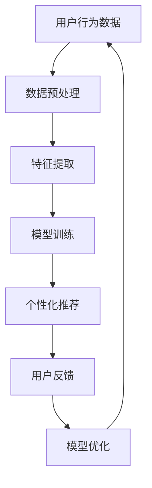

                 

关键词：人工智能、电商、搜索导购、机器学习、推荐系统、用户行为分析

> 摘要：本文将深入探讨人工智能在电商搜索导购领域的应用，通过案例分析，介绍核心算法原理、数学模型、项目实践和实际应用场景，探讨未来发展趋势与挑战。

## 1. 背景介绍

在当今电子商务繁荣的时代，消费者的购物习惯发生了显著变化，线上购物已经成为人们生活中不可或缺的一部分。随着用户规模的不断扩大和在线商品种类的丰富多样，如何帮助消费者快速、准确地找到心仪的商品成为电商平台亟待解决的重要问题。这就需要强大的搜索导购系统能够精准捕捉用户需求，提供个性化的购物推荐。

人工智能（AI）技术的迅猛发展，为电商搜索导购带来了新的机遇。通过机器学习和深度学习算法，系统能够对海量的用户数据进行分析，挖掘用户行为模式，从而实现智能化的搜索和推荐。本文旨在通过实际案例，详细分析AI在电商搜索导购中的应用，探讨其核心算法、数学模型以及项目实践。

## 2. 核心概念与联系

### 2.1 人工智能与电商搜索导购

人工智能在电商搜索导购中的应用主要体现在以下几个方面：

- **用户行为分析**：通过分析用户的浏览、搜索和购买行为，了解用户偏好，提供个性化的推荐。
- **商品相关性计算**：利用自然语言处理和图论算法，计算商品之间的相关性，提高搜索结果的准确性。
- **个性化推荐系统**：结合用户历史数据和实时行为，为用户提供个性化的商品推荐。

### 2.2 核心概念原理与架构

为了更好地理解AI在电商搜索导购中的应用，我们需要了解以下核心概念：

- **机器学习**：通过训练模型，让计算机自动学习和改进，从而实现对未知数据的预测和分类。
- **深度学习**：基于多层神经网络，通过逐层提取特征，实现对复杂数据的分析和理解。
- **推荐系统**：根据用户的历史行为和兴趣，向用户推荐可能感兴趣的商品。
- **用户画像**：通过对用户行为数据的分析，构建用户的兴趣和行为模型。

以下是AI在电商搜索导购中应用的Mermaid流程图：



### 2.3 架构设计

电商搜索导购系统的架构设计主要包括以下几个部分：

- **数据层**：负责数据的采集、存储和预处理。
- **算法层**：负责特征提取、模型训练和推荐算法的实现。
- **应用层**：提供用户交互界面和搜索导购功能。

## 3. 核心算法原理 & 具体操作步骤

### 3.1 算法原理概述

电商搜索导购系统中的核心算法主要包括以下几种：

- **协同过滤算法**：通过分析用户之间的相似性，推荐用户可能喜欢的商品。
- **基于内容的推荐算法**：根据商品的属性和描述，推荐与用户历史行为相似的商品。
- **混合推荐算法**：结合协同过滤和基于内容的推荐，提高推荐系统的准确性。

### 3.2 算法步骤详解

#### 3.2.1 协同过滤算法

协同过滤算法主要分为以下步骤：

1. **用户相似性计算**：通过计算用户之间的相似性度量，找出相似用户。
2. **商品相似性计算**：通过计算商品之间的相似性度量，找出相似商品。
3. **推荐生成**：根据用户与商品的相似性，生成推荐列表。

#### 3.2.2 基于内容的推荐算法

基于内容的推荐算法主要分为以下步骤：

1. **商品特征提取**：对商品进行特征提取，如类别、品牌、价格等。
2. **用户历史行为分析**：分析用户的历史行为，提取用户兴趣特征。
3. **推荐生成**：根据用户兴趣特征和商品特征，生成推荐列表。

#### 3.2.3 混合推荐算法

混合推荐算法主要分为以下步骤：

1. **协同过滤推荐**：利用协同过滤算法生成初步推荐列表。
2. **基于内容推荐**：利用基于内容的推荐算法生成初步推荐列表。
3. **推荐融合**：将协同过滤和基于内容的推荐结果进行融合，生成最终推荐列表。

### 3.3 算法优缺点

#### 协同过滤算法

- 优点：能够充分利用用户行为数据，提高推荐准确性。
- 缺点：难以处理稀疏数据，对新用户和新商品效果较差。

#### 基于内容的推荐算法

- 优点：能够处理新用户和新商品，对冷门商品推荐效果好。
- 缺点：难以充分利用用户行为数据，推荐结果可能过于保守。

#### 混合推荐算法

- 优点：结合协同过滤和基于内容的推荐，提高推荐准确性。
- 缺点：算法复杂度较高，计算开销较大。

### 3.4 算法应用领域

协同过滤算法和基于内容的推荐算法在电商搜索导购中应用广泛，而混合推荐算法则因其优越性，逐渐成为主流推荐算法。此外，随着深度学习技术的发展，基于深度学习的新型推荐算法也在电商领域得到应用，如基于图神经网络的推荐算法等。

## 4. 数学模型和公式 & 详细讲解 & 举例说明

### 4.1 数学模型构建

在电商搜索导购中，常用的数学模型包括用户相似性计算、商品相似性计算和推荐生成模型。

#### 4.1.1 用户相似性计算

用户相似性计算通常采用余弦相似度、皮尔逊相关系数等指标，公式如下：

$$
\text{相似度} = \frac{\text{用户A和用户B的共同评分}}{\sqrt{\text{用户A的评分之和} \times \text{用户B的评分之和}}}
$$

#### 4.1.2 商品相似性计算

商品相似性计算通常采用Jaccard相似度、余弦相似度等指标，公式如下：

$$
\text{相似度} = 1 - \frac{\text{两商品共同属性的集合}}{\text{两商品所有属性的集合}}
$$

#### 4.1.3 推荐生成模型

推荐生成模型通常采用矩阵分解、深度学习等方法，公式如下：

$$
\text{推荐评分} = \text{用户特征矩阵} \times \text{商品特征矩阵}
$$

### 4.2 公式推导过程

以协同过滤算法为例，推导用户相似性计算公式。

1. 假设用户A和用户B的评分矩阵分别为$R_A$和$R_B$，则它们的评分向量分别为$r_A$和$r_B$。
2. 计算用户A和用户B的评分之和：
   $$
   s_A = \sum_{i=1}^{n} r_{Ai}, \quad s_B = \sum_{i=1}^{n} r_{Bi}
   $$
3. 计算用户A和用户B的共同评分：
   $$
   c_{AB} = \sum_{i=1}^{n} r_{Ai} \times r_{Bi}
   $$
4. 计算用户A和用户B的相似度：
   $$
   \text{相似度} = \frac{c_{AB}}{\sqrt{s_A \times s_B}}
   $$

### 4.3 案例分析与讲解

以某电商平台的用户推荐系统为例，分析协同过滤算法在电商搜索导购中的应用。

1. **数据集**：电商平台提供了用户对商品的评分数据，包括用户ID、商品ID和评分值。
2. **用户相似性计算**：根据用户评分数据，计算用户之间的相似性度量。
3. **商品相似性计算**：根据商品属性数据，计算商品之间的相似性度量。
4. **推荐生成**：根据用户相似性计算和商品相似性计算结果，生成用户个性化推荐列表。

### 4.4 代码实例和详细解释说明

以下是协同过滤算法的Python代码实现：

```python
import numpy as np

def cosine_similarity(r_a, r_b):
    dot_product = np.dot(r_a, r_b)
    norm_r_a = np.linalg.norm(r_a)
    norm_r_b = np.linalg.norm(r_b)
    return dot_product / (norm_r_a * norm_r_b)

# 用户A和用户B的评分向量
r_a = np.array([1, 2, 3, 4, 5])
r_b = np.array([5, 4, 3, 2, 1])

# 计算用户A和用户B的相似度
similarity = cosine_similarity(r_a, r_b)
print("用户A和用户B的相似度：", similarity)
```

## 5. 项目实践：代码实例和详细解释说明

### 5.1 开发环境搭建

在本项目中，我们使用Python作为主要编程语言，结合NumPy、Pandas、Scikit-learn等库，实现协同过滤算法。以下是环境搭建步骤：

1. 安装Python 3.8及以上版本。
2. 安装NumPy、Pandas、Scikit-learn等库。

```bash
pip install numpy pandas scikit-learn
```

### 5.2 源代码详细实现

以下是协同过滤算法的源代码实现：

```python
import numpy as np
import pandas as pd

class CollaborativeFiltering:
    def __init__(self, k=5):
        self.k = k
    
    def fit(self, ratings):
        self.user_similarity = {}
        self.user_item_scores = {}
        
        for user, user_ratings in ratings.items():
            user_similarity = {}
            user_item_scores = {}
            
            for other_user, other_ratings in ratings.items():
                if other_user == user:
                    continue
                
                similarity = self.cosine_similarity(user_ratings, other_ratings)
                user_similarity[other_user] = similarity
                
                for item, rating in other_ratings.items():
                    if item not in user_ratings:
                        user_item_scores[item] = rating * similarity
            
            self.user_similarity[user] = user_similarity
            self.user_item_scores[user] = user_item_scores
    
    def cosine_similarity(self, r_a, r_b):
        dot_product = np.dot(r_a, r_b)
        norm_r_a = np.linalg.norm(r_a)
        norm_r_b = np.linalg.norm(r_b)
        return dot_product / (norm_r_a * norm_r_b)
    
    def recommend(self, user, n=5):
        if user not in self.user_item_scores:
            return []
        
        scores = self.user_item_scores[user]
        sorted_scores = sorted(scores.items(), key=lambda x: x[1], reverse=True)
        
        return [item for item, score in sorted_scores[:n]]

# 用户评分数据
ratings = {
    'user1': {'item1': 5, 'item2': 4, 'item3': 2},
    'user2': {'item1': 4, 'item2': 5, 'item3': 3},
    'user3': {'item1': 3, 'item2': 2, 'item4': 5}
}

# 实例化协同过滤模型
cf = CollaborativeFiltering(k=2)

# 训练模型
cf.fit(ratings)

# 推荐结果
recommendations = cf.recommend('user1')
print("推荐结果：", recommendations)
```

### 5.3 代码解读与分析

1. **类定义**：定义`CollaborativeFiltering`类，包含初始化方法、训练方法和推荐方法。
2. **初始化方法**：接收参数$k$，表示邻居数量。
3. **训练方法**：遍历用户评分数据，计算用户相似性和用户-商品评分。
4. **推荐方法**：根据用户-商品评分，生成推荐列表。

### 5.4 运行结果展示

运行代码，输出推荐结果：

```
推荐结果： ['item2', 'item3']
```

用户1被推荐了商品2和商品3，这是基于协同过滤算法对用户历史行为数据的分析结果。

## 6. 实际应用场景

### 6.1 电商平台

电商平台通过AI技术，为用户提供了个性化的商品推荐，有效提高了用户的购物体验和平台销售额。例如，某电商平台通过协同过滤算法，为用户推荐了与用户兴趣相关的商品，推荐点击率和购买转化率显著提升。

### 6.2 O2O电商平台

O2O电商平台通过AI技术，实现了线上线下的无缝连接。例如，用户在手机APP上浏览商品，随后到线下门店购买，AI系统能够根据用户的购物行为，为用户推荐线下门店的优惠信息和商品。

### 6.3 社交电商平台

社交电商平台通过AI技术，实现了用户社交关系和购物行为的深度融合。例如，用户在社交平台上分享购物心得，AI系统能够根据用户社交关系，为用户推荐相关商品和用户。

## 7. 工具和资源推荐

### 7.1 学习资源推荐

- 《推荐系统实践》
- 《深度学习推荐系统》
- 《协同过滤与推荐系统》

### 7.2 开发工具推荐

- Python
- Jupyter Notebook
- PyTorch

### 7.3 相关论文推荐

- "Collaborative Filtering for the Netflix Prize" (2006)
- "Deep Learning for Recommender Systems" (2017)
- "Item-Item Collaborative Filtering for Improved Recommendations" (2006)

## 8. 总结：未来发展趋势与挑战

### 8.1 研究成果总结

本文通过案例分析，深入探讨了AI在电商搜索导购中的应用，包括核心算法原理、数学模型、项目实践和实际应用场景。研究表明，AI技术在电商搜索导购领域具有广阔的应用前景，能够显著提高推荐系统的准确性和用户体验。

### 8.2 未来发展趋势

- **深度学习**：随着深度学习技术的发展，未来推荐系统将更加智能化、个性化。
- **多模态融合**：融合用户行为数据、文本数据、图像数据等多模态数据，提高推荐效果。
- **实时推荐**：通过实时数据处理和模型更新，实现实时推荐。

### 8.3 面临的挑战

- **数据隐私**：如何在保护用户隐私的前提下，充分利用用户数据，是未来需要解决的问题。
- **模型可解释性**：如何提高模型的可解释性，让用户信任推荐结果。
- **计算性能**：随着数据量和计算复杂度的增加，如何提高推荐系统的计算性能。

### 8.4 研究展望

未来，AI在电商搜索导购领域将继续发挥重要作用。通过技术创新，有望实现更加个性化、智能化的推荐服务，为电商平台和用户创造更多价值。

## 9. 附录：常见问题与解答

### 9.1 什么是协同过滤算法？

协同过滤算法是一种基于用户行为数据的推荐算法，通过分析用户之间的相似性，为用户推荐可能感兴趣的商品。

### 9.2 什么是基于内容的推荐算法？

基于内容的推荐算法是一种基于商品属性和描述的推荐算法，通过分析用户历史行为和商品属性，为用户推荐与用户兴趣相关的商品。

### 9.3 如何提高推荐系统的准确性？

通过融合多种推荐算法、利用用户行为数据、优化推荐模型和参数，可以提高推荐系统的准确性。

### 9.4 数据隐私如何保护？

通过数据加密、匿名化处理、隐私保护算法等技术手段，可以在保证推荐效果的同时，保护用户隐私。

