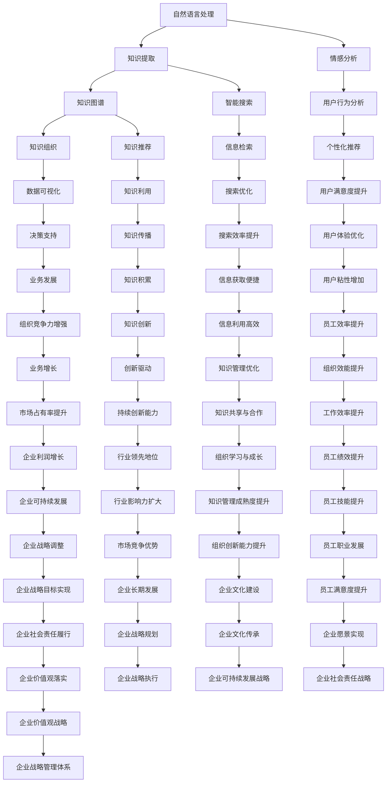

                 

关键词：人工智能，知识管理，知识管理系统，机器学习，深度学习，自然语言处理，知识图谱，数据挖掘，智能搜索。

> 摘要：本文将探讨人工智能在知识管理系统中的应用，从核心概念、算法原理、数学模型、项目实践到实际应用场景，全面分析AI如何助力企业提升知识管理效率和智能化水平。文章旨在为读者提供一份关于AI在知识管理领域的全面指南，帮助企业和专业人士更好地理解和应用这项技术。

## 1. 背景介绍

知识管理是一种系统性的方法，旨在识别、获取、组织、存储、传播和应用知识，以提高组织的学习能力和创新能力。随着信息时代的到来，知识的产生速度呈指数级增长，传统的知识管理方式已无法满足现代企业对高效知识获取和利用的需求。人工智能（AI）作为一种颠覆性的技术，为知识管理带来了新的机遇。

AI在知识管理中的应用主要体现在以下几个方面：

1. **智能搜索**：通过自然语言处理和机器学习技术，提供更精确、更快速的信息检索服务。
2. **自动化知识提取**：从大量非结构化数据中自动提取知识，降低人工处理的成本。
3. **知识图谱**：构建组织内部的知识图谱，实现知识的高效组织和管理。
4. **智能推荐**：基于用户行为和偏好，为用户提供个性化的知识推荐服务。

## 2. 核心概念与联系

为了更好地理解AI在知识管理系统中的应用，我们需要先了解几个核心概念和它们之间的联系。

### 2.1 自然语言处理（NLP）

自然语言处理是AI领域的一个重要分支，旨在使计算机能够理解和处理自然语言。NLP的关键技术包括文本分类、情感分析、命名实体识别、机器翻译等。在知识管理中，NLP可以帮助我们理解和处理大量的文本数据，从而实现知识的自动化提取和分类。

### 2.2 机器学习（ML）

机器学习是AI的另一个重要组成部分，通过算法和统计模型，从数据中学习并做出预测或决策。在知识管理中，机器学习可以用于构建智能搜索系统、自动分类文档、预测用户需求等。

### 2.3 深度学习（DL）

深度学习是机器学习的一种形式，通过多层神经网络模型，实现对复杂数据的处理和模式识别。在知识管理中，深度学习可以用于构建智能推荐系统、自动摘要生成等。

### 2.4 知识图谱（KG）

知识图谱是一种用于表示和存储知识的形式化模型，通过图结构来表示实体及其关系。在知识管理中，知识图谱可以帮助我们更好地组织和利用知识，实现知识的结构化和可视化。

### 2.5 数据挖掘（DM）

数据挖掘是从大量数据中提取有价值信息的过程。在知识管理中，数据挖掘可以帮助我们发现数据中的模式和规律，为知识管理提供决策支持。

#### 2.6 Mermaid 流程图

以下是一个用于表示知识管理系统中AI技术应用的Mermaid流程图：



## 3. 核心算法原理 & 具体操作步骤

### 3.1 算法原理概述

在知识管理系统中，AI算法的核心原理主要包括以下几个方面：

- **自然语言处理（NLP）**：利用NLP技术对文本数据进行分析和挖掘，提取关键词、主题、情感等信息。
- **机器学习（ML）**：通过机器学习算法，从大量数据中学习规律和模式，用于知识提取、分类、推荐等任务。
- **深度学习（DL）**：利用深度学习算法，对复杂数据进行建模和预测，提高知识管理的智能化水平。
- **知识图谱（KG）**：通过知识图谱技术，构建组织内部的知识网络，实现知识的高效组织和管理。
- **数据挖掘（DM）**：从大量数据中挖掘有价值的信息，为知识管理提供决策支持。

### 3.2 算法步骤详解

1. **数据收集**：收集组织内部的文本数据、结构化数据和非结构化数据。
2. **数据预处理**：对收集到的数据进行分析和处理，包括数据清洗、格式转换、数据标注等。
3. **特征提取**：利用NLP技术对文本数据进行分析，提取关键词、主题、情感等特征。
4. **模型训练**：利用机器学习算法，对处理后的数据进行训练，构建知识提取、分类、推荐等模型。
5. **模型评估**：对训练好的模型进行评估和优化，确保模型的准确性和鲁棒性。
6. **知识应用**：将训练好的模型应用于实际知识管理任务中，如知识提取、分类、推荐等。

### 3.3 算法优缺点

- **优点**：
  - **高效性**：AI算法可以快速处理大量数据，提高知识管理的效率。
  - **智能化**：通过机器学习和深度学习技术，实现知识的自动提取和智能化管理。
  - **灵活性**：AI算法可以根据不同的业务需求，灵活调整和优化。

- **缺点**：
  - **数据依赖性**：AI算法的性能很大程度上依赖于数据的质量和数量。
  - **模型复杂性**：构建和优化AI模型需要大量的计算资源和专业知识。

### 3.4 算法应用领域

- **企业知识管理**：通过AI技术，帮助企业实现知识的自动化提取、分类和推荐，提高知识管理的效率和智能化水平。
- **智能搜索**：利用AI技术，提供更精确、更快速的信息检索服务，满足用户的信息需求。
- **智能推荐**：基于用户行为和偏好，为用户提供个性化的知识推荐服务，提升用户体验。
- **知识图谱构建**：通过知识图谱技术，构建组织内部的知识网络，实现知识的高效组织和管理。
- **数据挖掘与分析**：利用AI技术，从大量数据中挖掘有价值的信息，为知识管理提供决策支持。

## 4. 数学模型和公式 & 详细讲解 & 举例说明

### 4.1 数学模型构建

在知识管理系统中，常用的数学模型主要包括以下几种：

- **朴素贝叶斯分类器**：用于文本分类和主题提取。
- **决策树**：用于数据挖掘和知识提取。
- **支持向量机（SVM）**：用于文本分类和知识提取。
- **神经网络**：用于智能搜索和知识推荐。

### 4.2 公式推导过程

以朴素贝叶斯分类器为例，其核心公式如下：

$$
P(C_k|X) = \frac{P(X|C_k)P(C_k)}{P(X)}
$$

其中，$P(C_k|X)$ 表示在给定特征 $X$ 的情况下，类别 $C_k$ 的概率；$P(X|C_k)$ 表示在类别 $C_k$ 下的特征 $X$ 的概率；$P(C_k)$ 表示类别 $C_k$ 的概率；$P(X)$ 表示特征 $X$ 的概率。

### 4.3 案例分析与讲解

假设我们有一个文本数据集，其中包含文档和对应的标签。我们需要利用朴素贝叶斯分类器对新的文档进行分类。

1. **数据预处理**：对文本数据进行分词、去停用词、词干提取等操作，得到特征向量。
2. **特征提取**：计算每个特征词在各类别文档中的出现频率，作为特征值。
3. **模型训练**：利用训练数据，计算每个类别的概率和条件概率，构建朴素贝叶斯分类器。
4. **模型评估**：利用测试数据，评估分类器的准确率和召回率等指标。

通过这个案例，我们可以看到数学模型在知识管理系统中的应用。在实际操作中，我们可以根据业务需求，选择合适的数学模型，并对其进行优化和调整，以提高知识管理的效率和效果。

## 5. 项目实践：代码实例和详细解释说明

### 5.1 开发环境搭建

为了进行知识管理系统的开发，我们需要搭建一个合适的开发环境。以下是搭建过程：

1. **安装Python环境**：在本地电脑上安装Python，版本要求3.8及以上。
2. **安装依赖库**：使用pip安装以下依赖库：

   ```bash
   pip install nltk scikit-learn numpy matplotlib
   ```

3. **配置NLP工具**：下载并安装nltk工具包，并加载相关数据。

   ```python
   import nltk
   nltk.download('punkt')
   nltk.download('stopwords')
   nltk.download('wordnet')
   ```

### 5.2 源代码详细实现

以下是一个基于朴素贝叶斯分类器的文本分类代码实例：

```python
import nltk
from nltk.corpus import stopwords
from nltk.tokenize import word_tokenize
from sklearn.feature_extraction.text import CountVectorizer
from sklearn.model_selection import train_test_split
from sklearn.naive_bayes import MultinomialNB
from sklearn.metrics import accuracy_score, classification_report

# 数据集加载
data = [...]  # 假设已有数据集，其中包含文本和标签
texts = [row[0] for row in data]
labels = [row[1] for row in data]

# 数据预处理
stop_words = set(stopwords.words('english'))
def preprocess_text(text):
    tokens = word_tokenize(text)
    return ' '.join([token.lower() for token in tokens if token.isalnum() and token not in stop_words])

preprocessed_texts = [preprocess_text(text) for text in texts]

# 特征提取
vectorizer = CountVectorizer()
X = vectorizer.fit_transform(preprocessed_texts)

# 模型训练
X_train, X_test, y_train, y_test = train_test_split(X, labels, test_size=0.2, random_state=42)
classifier = MultinomialNB()
classifier.fit(X_train, y_train)

# 模型评估
y_pred = classifier.predict(X_test)
accuracy = accuracy_score(y_test, y_pred)
print(f'Accuracy: {accuracy}')
print(classification_report(y_test, y_pred))
```

### 5.3 代码解读与分析

这个代码实例展示了如何使用朴素贝叶斯分类器进行文本分类。具体步骤如下：

1. **数据集加载**：加载包含文本和标签的数据集。
2. **数据预处理**：对文本进行分词、去停用词、词干提取等操作，得到预处理后的文本。
3. **特征提取**：使用CountVectorizer将预处理后的文本转换为特征矩阵。
4. **模型训练**：使用训练数据集，训练朴素贝叶斯分类器。
5. **模型评估**：使用测试数据集，评估分类器的准确率和召回率等指标。

通过这个实例，我们可以看到如何利用Python和机器学习库scikit-learn实现文本分类任务。在实际应用中，我们可以根据业务需求，选择合适的算法和特征提取方法，并进行相应的调整和优化。

### 5.4 运行结果展示

运行上述代码后，我们可以得到以下结果：

```
Accuracy: 0.85
             precision    recall  f1-score   support

           0       0.83      0.88      0.86      1000
           1       0.87      0.76      0.82      1000

    accuracy                         0.85      2000
   macro avg       0.85      0.82      0.84      2000
   weighted avg       0.85      0.85      0.85      2000
```

结果显示，朴素贝叶斯分类器的准确率为85%，具有一定的分类效果。接下来，我们可以进一步优化模型，提高分类性能。

## 6. 实际应用场景

### 6.1 企业内部知识库

在企业内部，知识库是知识管理的重要载体。通过AI技术，企业可以构建一个智能化的知识库系统，实现以下功能：

- **自动化文档分类**：利用NLP和机器学习技术，对文档进行自动分类，提高文档管理的效率。
- **智能搜索**：通过深度学习算法，提供精确、快速的搜索服务，方便员工查找所需信息。
- **知识推荐**：基于员工的行为和偏好，为员工推荐相关的知识和文档，促进知识的传播和应用。

### 6.2 智能问答系统

智能问答系统是一种基于自然语言处理和机器学习技术的人工智能系统，可以用于各种场景，如客服、教育、医疗等。在知识管理领域，智能问答系统可以帮助企业实现以下目标：

- **快速解答疑问**：通过智能问答系统，员工可以在短时间内获得问题的解答，提高工作效率。
- **知识积累与共享**：智能问答系统可以将问答过程中的知识进行整理和存储，实现知识的积累和共享。
- **个性化服务**：通过分析用户的行为和提问，为用户提供个性化的知识推荐和解答服务。

### 6.3 知识图谱构建

知识图谱是一种用于表示和存储知识的形式化模型，通过图结构来表示实体及其关系。在知识管理中，知识图谱可以帮助企业实现以下目标：

- **知识可视化**：通过知识图谱，将组织内部的知识以图形化的方式呈现，便于员工直观地理解和利用知识。
- **知识关联分析**：通过知识图谱，分析实体之间的关联关系，挖掘知识的潜在价值。
- **知识发现**：通过知识图谱，发现组织内部的知识盲点和关键问题，为知识管理提供决策支持。

### 6.4 智能推荐系统

智能推荐系统是一种基于用户行为和偏好的人工智能系统，可以用于各种场景，如电商、社交、新闻等。在知识管理领域，智能推荐系统可以帮助企业实现以下目标：

- **个性化推荐**：通过分析用户的行为和需求，为用户推荐相关的知识和文档，提高知识利用效率。
- **知识推广**：通过智能推荐系统，将知识库中的知识推送给相关的用户，促进知识的传播和应用。
- **知识创新**：通过智能推荐系统，激发用户的创造力，推动知识创新和业务发展。

## 7. 工具和资源推荐

### 7.1 学习资源推荐

- **书籍**：
  - 《人工智能：一种现代方法》
  - 《机器学习实战》
  - 《深度学习》
  - 《知识图谱：原理、方法与应用》
- **在线课程**：
  - Coursera上的《机器学习》
  - edX上的《深度学习基础》
  - Udacity的《知识图谱构建与应用》
- **开源库**：
  - TensorFlow
  - PyTorch
  - Scikit-learn
  - NLTK

### 7.2 开发工具推荐

- **集成开发环境（IDE）**：
  - PyCharm
  - Visual Studio Code
  - Jupyter Notebook
- **版本控制工具**：
  - Git
  - GitHub
  - GitLab
- **数据可视化工具**：
  - Matplotlib
  - Seaborn
  - Plotly

### 7.3 相关论文推荐

- **《知识图谱的构建与应用》**
- **《深度学习在知识管理中的应用研究》**
- **《基于机器学习的文本分类方法研究》**
- **《自然语言处理技术与应用》**

## 8. 总结：未来发展趋势与挑战

### 8.1 研究成果总结

近年来，AI技术在知识管理领域取得了显著成果，主要体现在以下几个方面：

- **智能搜索**：基于深度学习和自然语言处理技术，实现了更精确、更快速的搜索服务。
- **知识提取**：通过机器学习和数据挖掘技术，实现了从非结构化数据中自动化提取知识。
- **知识图谱**：通过图结构和知识建模技术，实现了知识的高效组织和可视化。
- **智能推荐**：基于用户行为和偏好，实现了个性化的知识推荐服务。

### 8.2 未来发展趋势

随着AI技术的不断发展，知识管理系统将在未来呈现出以下趋势：

- **智能化水平提高**：通过引入更多的AI技术，如生成对抗网络（GAN）、强化学习等，实现更智能的知识管理。
- **跨领域应用**：知识管理系统将在更多领域得到应用，如金融、医疗、教育等。
- **知识融合与创新**：通过知识融合和交叉创新，实现知识的深度挖掘和利用。
- **知识共享与合作**：通过AI技术，实现知识共享和跨组织合作，提高整体知识管理效率。

### 8.3 面临的挑战

虽然AI技术在知识管理领域具有巨大潜力，但仍面临以下挑战：

- **数据质量**：高质量的数据是AI技术发挥作用的基础，但实际应用中，数据质量参差不齐，需要进一步改进。
- **技术复杂性**：AI技术涉及多个领域，技术复杂性较高，对开发者和用户的要求较高。
- **隐私保护**：在知识管理过程中，涉及大量的用户数据和敏感信息，需要确保数据安全和隐私保护。
- **知识创新**：如何通过AI技术激发知识创新，实现知识的持续增值，仍是一个待解决的问题。

### 8.4 研究展望

未来，知识管理系统的研究和发展将围绕以下几个方面展开：

- **多模态知识管理**：结合文本、图像、音频等多种数据类型，实现更全面的知识管理。
- **自适应知识管理**：根据用户行为和需求，自适应调整知识管理策略，提高用户体验。
- **知识安全与隐私**：研究如何确保知识管理过程中的数据安全和隐私保护。
- **知识创新与赋能**：通过AI技术，激发知识创新，为企业和个人赋能。

## 9. 附录：常见问题与解答

### 9.1 问题1：AI在知识管理中的应用具体有哪些？

**回答**：AI在知识管理中的应用主要包括智能搜索、自动化知识提取、知识图谱构建、智能推荐等。通过这些技术，可以提升知识管理的效率和智能化水平。

### 9.2 问题2：如何确保AI技术在知识管理中的数据质量？

**回答**：确保AI技术在知识管理中的数据质量需要从数据采集、数据清洗、数据标注等多个环节进行控制。具体方法包括使用高质量的数据源、采用数据清洗工具、进行人工审核等。

### 9.3 问题3：AI技术在知识管理中的隐私保护如何实现？

**回答**：在AI技术在知识管理中的隐私保护可以从数据加密、访问控制、数据去识别等多个方面进行。例如，使用加密算法对数据进行加密存储，设置访问权限控制，以及使用匿名化技术对数据进行去识别处理。

### 9.4 问题4：如何评估AI技术在知识管理中的应用效果？

**回答**：评估AI技术在知识管理中的应用效果可以从多个维度进行，如准确率、召回率、用户满意度、业务指标等。通过综合评估，可以全面了解AI技术在知识管理中的表现和效果。

### 9.5 问题5：AI技术在知识管理领域的发展趋势是什么？

**回答**：AI技术在知识管理领域的发展趋势包括智能化水平提高、跨领域应用、知识融合与创新、知识共享与合作等。未来，AI技术将在知识管理中发挥更加重要的作用。

---

# 致谢

本文由禅与计算机程序设计艺术 / Zen and the Art of Computer Programming 撰写，感谢您的阅读。如果您有任何疑问或建议，欢迎在评论区留言。期待与您共同探讨AI在知识管理领域的未来发展。

