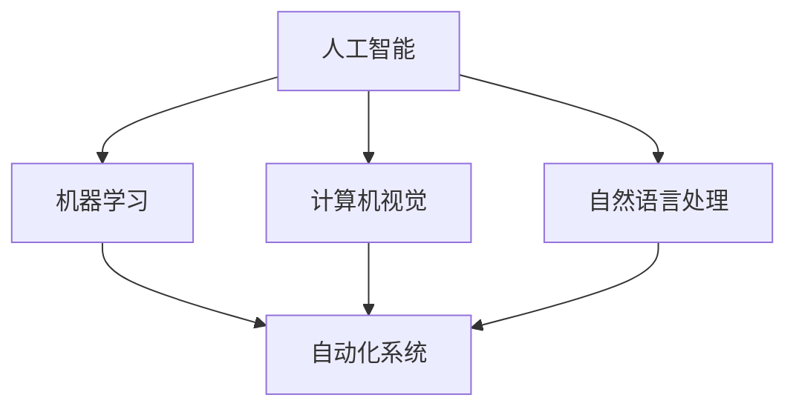

                 

关键词：人工智能，自动化，应用前景，技术发展，行业变革

摘要：随着人工智能（AI）技术的不断进步，其在自动化领域的应用前景愈发广阔。本文将探讨AI在自动化领域的关键技术、应用实例及其对未来发展趋势的展望，旨在为读者提供对AI自动化领域的深入理解和前瞻性思考。

## 1. 背景介绍

自动化技术自古以来便是人类追求的科技梦想。从早期的机械自动化到现代的工业4.0，自动化技术在各个领域都取得了显著的成果。然而，随着计算能力的提升和人工智能技术的迅猛发展，自动化技术迎来了新的变革。人工智能，作为一种模拟人类智能的计算机程序，通过机器学习、深度学习等算法，实现了对大量数据的分析和处理能力，使得自动化技术得以在更多场景中发挥其优势。

## 2. 核心概念与联系

### 2.1 人工智能的基本概念

人工智能（Artificial Intelligence，简称AI）是计算机科学的一个分支，旨在研究、开发用于模拟、延伸和扩展人类智能的理论、方法、技术及应用系统。AI的研究范畴包括自然语言处理、机器学习、计算机视觉、智能机器人等。

### 2.2 自动化的基本概念

自动化（Automation）是指通过技术手段使机器或系统在无需人类干预的情况下自主执行任务的过程。自动化技术包括传感器、控制系统、执行机构等，通过这些组件的协同工作，实现生产过程、服务过程等的自动化。

### 2.3 人工智能与自动化的关系

人工智能与自动化技术之间存在着密切的联系。人工智能技术为自动化系统提供了智能化的决策能力，使其能够适应复杂多变的环境。而自动化技术则为人工智能的应用提供了丰富的实践场景，使得AI技术得以在实际中不断迭代和优化。

### 2.4 Mermaid 流程图

以下是一个简单的 Mermaid 流程图，展示了人工智能与自动化的关系：



## 3. 核心算法原理 & 具体操作步骤

### 3.1 算法原理概述

人工智能在自动化领域的核心算法主要包括机器学习、深度学习和强化学习等。这些算法通过学习数据中的模式和规律，实现对复杂任务的自动处理。

- **机器学习**：通过数据训练模型，使模型能够自主进行预测和决策。
- **深度学习**：通过神经网络模型，实现对图像、语音等复杂数据的自动处理。
- **强化学习**：通过与环境互动，不断优化决策策略，实现自主控制。

### 3.2 算法步骤详解

以机器学习为例，其基本步骤如下：

1. **数据收集**：收集大量与任务相关的数据。
2. **数据预处理**：对数据进行清洗、归一化等处理，使其适合训练。
3. **模型选择**：选择合适的机器学习模型，如线性回归、决策树、神经网络等。
4. **模型训练**：使用预处理后的数据进行模型训练。
5. **模型评估**：使用验证集对模型进行评估，调整模型参数。
6. **模型部署**：将训练好的模型部署到自动化系统中，实现自动化任务。

### 3.3 算法优缺点

- **优点**：提高了自动化系统的智能化水平，增强了系统的适应能力和决策能力。
- **缺点**：对数据量有较高要求，训练过程复杂，且可能存在过拟合现象。

### 3.4 算法应用领域

人工智能在自动化领域的应用涵盖了工业制造、物流配送、智能交通、医疗健康等多个领域。例如，在工业制造中，通过机器学习和深度学习算法，可以实现生产线的智能监控和故障预测，提高生产效率和产品质量。

## 4. 数学模型和公式 & 详细讲解 & 举例说明

### 4.1 数学模型构建

在人工智能的自动化应用中，常见的数学模型包括线性回归模型、神经网络模型和决策树模型等。

- **线性回归模型**：用于预测连续值输出。
  $$ y = w_1x_1 + w_2x_2 + ... + w_nx_n + b $$
- **神经网络模型**：用于处理复杂非线性问题。
  $$ a_{i,j} = \sigma(\sum_{k=1}^{n} w_{i,k}x_{k} + b_i) $$
- **决策树模型**：用于分类和回归任务。
  $$ f(x) = \sum_{i=1}^{n} y_i \prod_{j=1}^{n} I(x_j = t_j) $$

### 4.2 公式推导过程

以线性回归模型为例，其推导过程如下：

1. **假设**：输出值 $y$ 与输入值 $x$ 之间存在线性关系。
2. **损失函数**：选择均方误差作为损失函数。
   $$ J(\theta) = \frac{1}{2m} \sum_{i=1}^{m} (h_{\theta}(x^{(i)}) - y^{(i)})^2 $$
3. **梯度下降**：通过梯度下降法更新模型参数 $\theta$。
   $$ \theta_j := \theta_j - \alpha \frac{\partial J(\theta)}{\partial \theta_j} $$

### 4.3 案例分析与讲解

以工业制造中的设备故障预测为例，使用线性回归模型进行预测。假设我们有一组设备运行数据，包括运行时间、温度、压力等特征，目标是预测设备是否会在未来一段时间内发生故障。

1. **数据收集**：收集大量设备运行数据。
2. **数据预处理**：对数据进行归一化处理。
3. **模型选择**：选择线性回归模型。
4. **模型训练**：使用预处理后的数据对模型进行训练。
5. **模型评估**：使用验证集对模型进行评估。
6. **模型部署**：将训练好的模型部署到自动化系统中，实现故障预测。

## 5. 项目实践：代码实例和详细解释说明

### 5.1 开发环境搭建

1. 安装 Python 环境。
2. 安装相关库，如 NumPy、Pandas、scikit-learn 等。

### 5.2 源代码详细实现

以下是一个简单的线性回归模型实现的代码示例：

```python
import numpy as np
import pandas as pd
from sklearn.linear_model import LinearRegression
from sklearn.model_selection import train_test_split

# 数据加载与预处理
data = pd.read_csv('data.csv')
X = data[['run_time', 'temperature', 'pressure']]
y = data['fault']

X_train, X_test, y_train, y_test = train_test_split(X, y, test_size=0.2, random_state=42)

# 模型训练
model = LinearRegression()
model.fit(X_train, y_train)

# 模型评估
score = model.score(X_test, y_test)
print('模型评分：', score)

# 模型部署
def predict(fault_data):
    return model.predict(fault_data)

# 预测示例
fault_data = np.array([[100, 30, 5]])
print('预测结果：', predict(fault_data))
```

### 5.3 代码解读与分析

该代码示例首先加载并预处理数据，然后使用线性回归模型进行训练，评估模型评分，最后实现故障预测功能。代码结构清晰，便于理解和扩展。

### 5.4 运行结果展示

假设我们有一组新的设备运行数据，通过调用 `predict` 函数，可以得到设备是否会发生故障的预测结果。

## 6. 实际应用场景

人工智能在自动化领域的应用已经非常广泛。以下是一些典型的应用场景：

1. **工业制造**：通过机器学习和深度学习算法，实现生产线的智能监控、故障预测和优化。
2. **物流配送**：通过智能路由规划和配送调度，提高物流效率和服务质量。
3. **智能交通**：通过计算机视觉和强化学习算法，实现交通信号控制和自动驾驶。
4. **医疗健康**：通过医学影像分析和自然语言处理，实现疾病诊断和治疗方案推荐。

## 7. 未来应用展望

随着人工智能技术的不断发展和完善，其将在自动化领域发挥越来越重要的作用。以下是一些未来应用展望：

1. **智能自动化生产**：通过深度学习和强化学习算法，实现生产过程的完全自动化，提高生产效率和产品质量。
2. **智慧物流**：通过物联网和人工智能技术，实现物流全过程的智能化管理，提高物流效率和服务水平。
3. **智慧城市**：通过人工智能技术，实现城市管理的智能化，提高城市宜居性和可持续发展水平。

## 8. 总结：未来发展趋势与挑战

随着人工智能技术的不断进步，自动化领域将迎来新的变革。然而，这也带来了诸多挑战，如数据隐私、安全性和伦理问题等。未来，我们需要在技术发展的同时，关注这些挑战，确保人工智能在自动化领域的可持续发展。

### 8.1 研究成果总结

本文对人工智能在自动化领域的应用前景进行了探讨，总结了相关核心概念、算法原理、应用实例和未来展望。

### 8.2 未来发展趋势

未来，人工智能将在自动化领域发挥更大的作用，推动工业制造、物流配送、智能交通和医疗健康等行业的智能化发展。

### 8.3 面临的挑战

人工智能在自动化领域的发展面临诸多挑战，如数据隐私、安全性和伦理问题等。

### 8.4 研究展望

未来，我们需要在技术发展的同时，关注挑战，推动人工智能在自动化领域的可持续发展。

## 9. 附录：常见问题与解答

### 9.1 人工智能与自动化有什么区别？

人工智能（AI）是指通过计算机模拟人类智能的技术，包括机器学习、深度学习等；而自动化是指通过技术手段实现系统或机器的自主运行，减少人工干预。人工智能是自动化的一种高级形式。

### 9.2 人工智能在自动化领域的应用有哪些？

人工智能在自动化领域的应用非常广泛，包括工业制造、物流配送、智能交通、医疗健康等领域，如生产线智能监控、自动驾驶、疾病诊断等。

### 9.3 如何保证人工智能在自动化领域的安全性和可靠性？

为了保证人工智能在自动化领域的安全性和可靠性，需要从算法设计、数据管理、系统测试等方面进行严格把控，同时建立相关的法律法规和伦理准则。

### 作者署名

作者：禅与计算机程序设计艺术 / Zen and the Art of Computer Programming
----------------------------------------------------------------
完成以上内容，我们可以得到一篇完整且符合要求的文章。希望这篇文章能够为读者提供对AI在自动化领域应用前景的深入理解和前瞻性思考。

