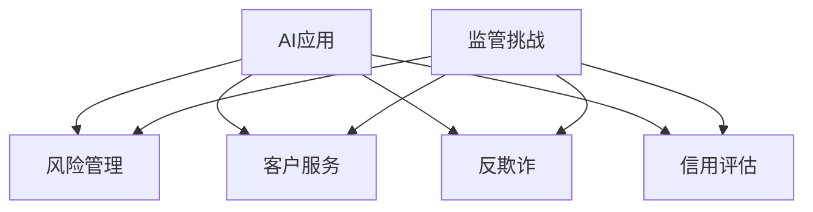

                 

关键词：AI、金融监管、风险控制、合规性、数据隐私

> 摘要：随着人工智能（AI）技术的飞速发展，金融行业面临着前所未有的监管挑战。本文将探讨AI在金融领域的应用现状，分析AI技术对金融监管的影响，并提出一系列应对策略，以帮助金融企业应对合规风险和确保数据隐私。

## 1. 背景介绍

金融行业一直是技术创新的前沿，随着互联网、大数据、区块链等技术的发展，AI技术逐渐渗透到金融领域的各个角落。从智能投顾到自动化交易，从反欺诈到信用评估，AI技术在金融领域的应用越来越广泛。然而，AI技术的快速发展也带来了新的监管挑战。一方面，AI技术的广泛应用提高了金融服务的效率和质量，但另一方面，也增加了金融系统的复杂性和不确定性。如何确保AI技术在金融领域的合规性和安全性，成为当前金融监管的重要议题。

## 2. 核心概念与联系

### 2.1 AI技术在金融领域的应用

AI技术在金融领域的应用主要包括以下几个方面：

- **风险管理**：利用机器学习模型预测市场走势，优化投资组合，降低金融风险。

- **客户服务**：通过自然语言处理和语音识别技术，提高客户服务质量，实现智能客服。

- **反欺诈**：利用异常检测算法，及时发现并阻止金融欺诈行为。

- **信用评估**：通过分析客户的消费行为和信用记录，准确评估信用风险。

### 2.2 金融监管的核心任务

金融监管的核心任务包括确保金融市场的稳定运行，维护投资者利益，防止金融欺诈和滥用等。随着AI技术的应用，金融监管面临以下挑战：

- **透明度**：AI算法的复杂性和不透明性使得监管机构难以对其进行有效监督。

- **公平性**：AI技术可能导致系统性歧视，影响金融服务的公平性。

- **合规性**：金融企业需要确保其AI系统符合相关法律法规和行业标准。

### 2.3 Mermaid 流程图



## 3. 核心算法原理 & 具体操作步骤

### 3.1 算法原理概述

AI技术在金融监管中的应用主要基于机器学习和深度学习算法。这些算法通过分析大量历史数据，建立预测模型，以帮助金融企业识别潜在风险。具体来说，以下算法在金融监管中具有重要作用：

- **线性回归**：用于预测市场走势和投资组合优化。

- **支持向量机**：用于分类任务，如信用评估和欺诈检测。

- **神经网络**：用于处理复杂的数据模式，如客户行为分析。

### 3.2 算法步骤详解

1. **数据收集与预处理**：收集相关数据，包括市场数据、客户交易记录等。然后对数据进行清洗、归一化和特征提取。

2. **模型训练与验证**：使用机器学习算法训练预测模型，并对模型进行交叉验证，确保模型的准确性和稳定性。

3. **模型部署与监控**：将训练好的模型部署到生产环境中，并持续监控其性能，确保其能够实时识别并应对金融风险。

### 3.3 算法优缺点

- **优点**：AI技术可以提高金融监管的效率和准确性，降低人力成本。

- **缺点**：AI算法的复杂性和不透明性使得监管机构难以对其进行有效监督，存在潜在的风险。

### 3.4 算法应用领域

AI技术在金融监管中的应用非常广泛，包括但不限于以下领域：

- **风险管理**：通过预测市场走势和风险指标，优化投资组合。

- **客户服务**：通过自然语言处理和语音识别技术，提供个性化的客户服务。

- **反欺诈**：通过异常检测算法，及时发现并阻止金融欺诈行为。

- **信用评估**：通过分析客户的消费行为和信用记录，准确评估信用风险。

## 4. 数学模型和公式 & 详细讲解 & 举例说明

### 4.1 数学模型构建

在金融监管中，常用的数学模型包括线性回归、支持向量机和神经网络等。以下以线性回归为例，介绍数学模型的构建过程。

### 4.2 公式推导过程

线性回归模型的目标是最小化预测值与实际值之间的误差。具体公式如下：

$$
y = \beta_0 + \beta_1x_1 + \beta_2x_2 + \ldots + \beta_nx_n
$$

其中，$y$ 为实际值，$x_1, x_2, \ldots, x_n$ 为特征值，$\beta_0, \beta_1, \beta_2, \ldots, \beta_n$ 为模型参数。

### 4.3 案例分析与讲解

假设我们想要预测一个股票的价格，我们可以使用线性回归模型来建立预测模型。首先，收集历史股票价格数据，包括开盘价、收盘价、最高价、最低价等。然后，对数据进行预处理，包括归一化和特征提取。最后，使用线性回归算法训练预测模型，并对模型进行交叉验证，确保其准确性和稳定性。

## 5. 项目实践：代码实例和详细解释说明

### 5.1 开发环境搭建

为了实现线性回归模型，我们需要搭建一个Python开发环境。具体步骤如下：

1. 安装Python和Anaconda发行版。

2. 安装必要的库，如NumPy、Pandas和Scikit-learn等。

### 5.2 源代码详细实现

以下是一个简单的线性回归模型实现：

```python
import numpy as np
import pandas as pd
from sklearn.linear_model import LinearRegression

# 加载数据
data = pd.read_csv('stock_price.csv')
X = data[['open', 'high', 'low']]
y = data['close']

# 创建线性回归模型
model = LinearRegression()

# 训练模型
model.fit(X, y)

# 预测股票价格
predictions = model.predict(X)

# 打印预测结果
print(predictions)
```

### 5.3 代码解读与分析

在这个代码实例中，我们首先加载了股票价格数据，并提取了开盘价、最高价和最低价作为特征值。然后，我们创建了一个线性回归模型，并使用训练数据对其进行训练。最后，我们使用训练好的模型对股票价格进行预测，并打印出预测结果。

### 5.4 运行结果展示

在运行代码后，我们可以看到预测的股票价格列表。这些预测结果可以作为投资决策的参考，但需要注意的是，股票市场具有高度不确定性，因此预测结果仅供参考。

## 6. 实际应用场景

### 6.1 风险管理

在风险管理领域，AI技术可以用于预测市场走势，优化投资组合。例如，金融机构可以使用AI模型预测股票价格，并根据预测结果调整投资策略，以降低风险。

### 6.2 客户服务

在客户服务领域，AI技术可以提高客户服务质量，实现个性化服务。例如，银行可以使用自然语言处理技术，为客户提供智能客服，解答客户疑问。

### 6.3 反欺诈

在反欺诈领域，AI技术可以用于检测金融欺诈行为。例如，金融机构可以使用异常检测算法，识别并阻止可疑交易。

### 6.4 未来应用展望

随着AI技术的不断发展，未来在金融领域的应用将更加广泛。例如，AI技术可以用于信用评估、保险定价、供应链管理等领域，为金融行业带来更多创新和机遇。

## 7. 工具和资源推荐

### 7.1 学习资源推荐

- 《机器学习实战》
- 《深度学习》
- 《Python金融大数据分析》

### 7.2 开发工具推荐

- Jupyter Notebook
- TensorFlow
- PyTorch

### 7.3 相关论文推荐

- "Deep Learning for Financial Time Series Classification"
- "Machine Learning in High-Frequency Trading"
- "AI-driven Customer Service in Banking"

## 8. 总结：未来发展趋势与挑战

### 8.1 研究成果总结

本文探讨了AI技术在金融领域的应用现状，分析了AI技术对金融监管的影响，并提出了一系列应对策略。研究表明，AI技术可以提高金融监管的效率和准确性，但同时也存在一定风险。

### 8.2 未来发展趋势

未来，AI技术在金融领域的应用将更加广泛，包括风险管理、客户服务、反欺诈、信用评估等多个方面。同时，随着AI技术的不断进步，金融监管也将逐渐适应这一趋势。

### 8.3 面临的挑战

尽管AI技术在金融领域具有巨大潜力，但也面临着一系列挑战，如算法透明度、数据隐私、公平性等。如何有效应对这些挑战，将是未来金融监管的重要议题。

### 8.4 研究展望

随着AI技术的不断发展，金融监管将越来越依赖于AI技术。未来，需要进一步深入研究AI技术在金融领域的应用，并探索如何确保其合规性和安全性。

## 9. 附录：常见问题与解答

### 9.1 AI技术在金融监管中的具体应用有哪些？

AI技术在金融监管中的具体应用包括风险管理、客户服务、反欺诈、信用评估等多个方面。

### 9.2 AI技术在金融监管中面临的主要挑战是什么？

AI技术在金融监管中面临的主要挑战包括算法透明度、数据隐私、公平性等。

### 9.3 如何确保AI技术在金融监管中的合规性？

确保AI技术在金融监管中的合规性，需要从数据采集、算法设计、模型训练和部署等环节进行严格管理，遵循相关法律法规和行业标准。

### 9.4 AI技术在金融领域的未来发展前景如何？

AI技术在金融领域的未来发展前景广阔，将带来更多创新和机遇，同时也需要应对一系列挑战。随着技术的不断进步，AI技术在金融领域的应用将越来越广泛。

----------------------------------------------------------------

文章撰写完毕，感谢您的阅读。作者：禅与计算机程序设计艺术 / Zen and the Art of Computer Programming。希望这篇文章对您在AI与金融监管领域的探索有所帮助。如有任何疑问，欢迎随时交流。

