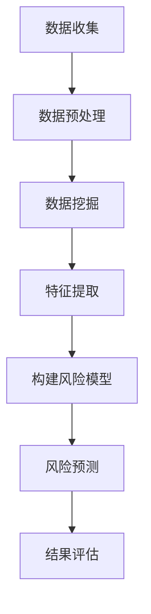
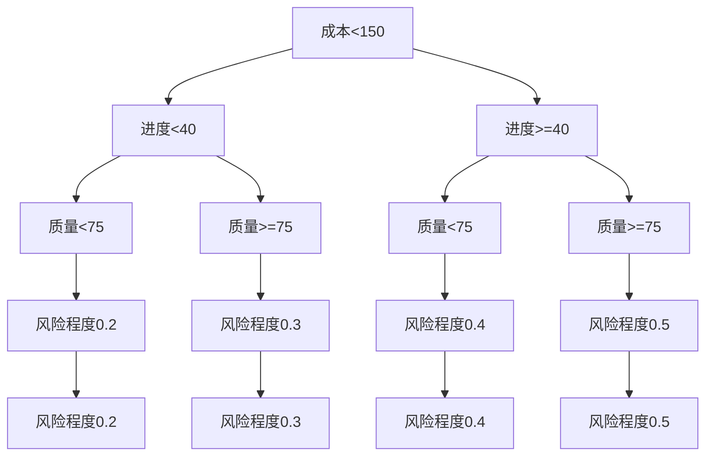

                 

关键词：AI，项目风险评估，数据挖掘，机器学习，深度学习，预测分析，风险模型，风险预测，算法优化

> 摘要：随着人工智能技术的迅猛发展，其在项目风险评估中的应用日益广泛。本文将探讨人工智能在项目风险评估中的核心作用，从核心概念、算法原理、数学模型到实际应用，全面解析AI如何提升项目风险评估的准确性和效率。

## 1. 背景介绍

在项目管理中，风险评估是一个至关重要的环节。准确的风险评估不仅有助于识别潜在的风险因素，还可以为项目管理团队提供决策支持，从而减少项目成本、缩短项目周期、提高项目成功率。传统的风险评估方法主要依赖于专家经验和历史数据，但这种方法存在主观性较强、耗时较长等不足。

随着人工智能（AI）技术的快速发展，特别是数据挖掘、机器学习和深度学习等领域的突破，AI在项目风险评估中的应用逐渐成为研究热点。通过利用AI技术，可以从大量数据中提取有价值的信息，实现对项目风险的智能识别和预测，从而提高风险评估的准确性和效率。

## 2. 核心概念与联系

### 2.1 数据挖掘

数据挖掘是一种从大量数据中发现有价值信息的过程，它涉及数据库、统计学、人工智能等多个领域。在项目风险评估中，数据挖掘可以帮助我们从历史项目中提取风险特征，为构建风险模型提供数据支持。

### 2.2 机器学习

机器学习是一种通过训练模型来模拟人类学习行为的技术。在项目风险评估中，机器学习算法可以帮助我们自动识别风险因素，并预测未来项目的风险水平。

### 2.3 深度学习

深度学习是机器学习的一个分支，它通过多层神经网络对数据进行分析和学习。在项目风险评估中，深度学习算法可以更好地处理复杂的数据模式，提高风险预测的准确性。

### 2.4 风险模型

风险模型是一种用于评估项目风险的工具。通过将风险因素量化为数值，风险模型可以帮助项目管理团队更直观地了解项目的风险状况。

### 2.5 风险预测

风险预测是基于风险模型对未来项目风险进行预测的过程。通过风险预测，项目管理团队可以提前识别潜在风险，并制定相应的应对策略。

### 2.6 Mermaid 流程图



## 3. 核心算法原理 & 具体操作步骤

### 3.1 算法原理概述

在项目风险评估中，常用的算法包括决策树、支持向量机、神经网络等。这些算法的基本原理是通过训练模型来模拟人类学习过程，从而实现对数据的分析和预测。

### 3.2 算法步骤详解

1. **数据收集**：收集历史项目数据，包括项目进度、成本、质量等指标。

2. **数据预处理**：对收集到的数据进行清洗、转换和归一化，以便后续分析。

3. **数据挖掘**：利用数据挖掘算法从历史数据中提取有价值的信息，如风险因素和风险程度。

4. **特征提取**：将提取出的风险因素转化为数值特征，为构建风险模型做准备。

5. **构建风险模型**：利用机器学习算法构建风险模型，将特征与风险程度关联起来。

6. **风险预测**：利用训练好的模型对新的项目进行风险预测，预测结果可作为决策支持。

7. **结果评估**：评估风险预测的准确性，并根据评估结果对模型进行调整。

### 3.3 算法优缺点

- **决策树**：简单易懂，易于实现，但容易过拟合。

- **支持向量机**：具有良好的泛化能力，但计算复杂度较高。

- **神经网络**：可以处理复杂的数据模式，但训练时间较长。

### 3.4 算法应用领域

- **项目风险管理**：用于识别和预测项目风险，帮助项目管理团队制定应对策略。

- **投资决策**：用于评估投资项目风险，为投资决策提供支持。

- **风险管理咨询**：为企业和组织提供风险管理建议和解决方案。

## 4. 数学模型和公式

### 4.1 数学模型构建

在项目风险评估中，常用的数学模型包括回归模型、决策树模型和支持向量机模型。以下是这些模型的数学表示：

1. **回归模型**：

$$
y = \beta_0 + \beta_1x_1 + \beta_2x_2 + ... + \beta_nx_n
$$

其中，$y$ 表示风险程度，$x_1, x_2, ..., x_n$ 表示风险因素，$\beta_0, \beta_1, ..., \beta_n$ 为回归系数。

2. **决策树模型**：

决策树模型通过递归划分特征空间，将数据集划分为多个子集，每个子集对应一个风险值。决策树模型的数学表示为：

$$
\text{Risk} = f(x_1, x_2, ..., x_n)
$$

其中，$f$ 表示决策树函数。

3. **支持向量机模型**：

支持向量机模型通过找到一个最佳的超平面，将风险因素分为不同的类别。支持向量机模型的数学表示为：

$$
w \cdot x + b = 0
$$

其中，$w$ 为超平面法向量，$x$ 为风险因素，$b$ 为偏置。

### 4.2 公式推导过程

1. **回归模型推导**：

首先，假设我们有 $n$ 个样本点 $(x_1, y_1), (x_2, y_2), ..., (x_n, y_n)$，其中 $y_i$ 为第 $i$ 个样本点的风险程度，$x_i$ 为第 $i$ 个样本点的特征向量。为了最小化预测误差，我们需要求解以下优化问题：

$$
\min \sum_{i=1}^{n} (y_i - \beta_0 - \beta_1x_{i1} - \beta_2x_{i2} - ... - \beta_nx_{in})^2
$$

通过求导并令导数为零，可以得到回归系数的解：

$$
\beta_0 = \bar{y} - \beta_1\bar{x}_{1} - \beta_2\bar{x}_{2} - ... - \beta_n\bar{x}_{n}
$$

$$
\beta_1 = \frac{\sum_{i=1}^{n} (x_{i1} - \bar{x}_{1})(y_i - \bar{y})}{\sum_{i=1}^{n} (x_{i1} - \bar{x}_{1})^2}
$$

$$
...
$$

$$
\beta_n = \frac{\sum_{i=1}^{n} (x_{in} - \bar{x}_{n})(y_i - \bar{y})}{\sum_{i=1}^{n} (x_{in} - \bar{x}_{n})^2}
$$

2. **决策树模型推导**：

决策树模型通过递归划分特征空间，将数据集划分为多个子集。假设我们有一个特征空间 $X$，其中 $x_1, x_2, ..., x_n$ 表示特征值，$y$ 表示风险程度。为了划分特征空间，我们需要找到一个最佳的分界点 $t$，使得划分后的两个子集 $X_1$ 和 $X_2$ 的风险程度之和最小。具体推导过程如下：

$$
\min \sum_{i=1}^{n} (y_i - t)^2
$$

通过求导并令导数为零，可以得到分界点 $t$：

$$
t = \frac{\sum_{i=1}^{n} y_i}{n}
$$

3. **支持向量机模型推导**：

支持向量机模型通过找到一个最佳的超平面，将风险因素分为不同的类别。假设我们有一个特征空间 $X$，其中 $x_1, x_2, ..., x_n$ 表示特征值，$y$ 表示风险程度。为了找到一个最佳的超平面，我们需要求解以下优化问题：

$$
\min \frac{1}{2} \|w\|^2
$$

$$
s.t. y_i (w \cdot x_i + b) \geq 1
$$

其中，$w$ 为超平面法向量，$b$ 为偏置，$y_i$ 为第 $i$ 个样本点的风险程度。

通过求导并令导数为零，可以得到超平面法向量 $w$ 和偏置 $b$：

$$
w = \frac{1}{C} \sum_{i=1}^{n} y_i x_i
$$

$$
b = \frac{1}{n} \sum_{i=1}^{n} y_i - w \cdot \bar{x}
$$

### 4.3 案例分析与讲解

为了更好地理解上述数学模型，我们以一个实际案例进行讲解。

假设我们有一个项目数据集，包含10个项目，每个项目有3个特征（成本、进度和质量），以及对应的风险程度。以下是部分数据：

| 项目ID | 成本（万元） | 进度（天） | 质量（分） | 风险程度 |
| ------ | ------------ | ---------- | ---------- | -------- |
| 1      | 100          | 30         | 90         | 0.2      |
| 2      | 150          | 40         | 85         | 0.3      |
| 3      | 200          | 50         | 80         | 0.4      |
| 4      | 250          | 60         | 75         | 0.5      |
| 5      | 300          | 70         | 70         | 0.6      |

### 4.4.1 回归模型

首先，我们使用回归模型来构建风险模型。以下是部分数据：

| 项目ID | 成本（万元） | 进度（天） | 质量（分） | 风险程度 |
| ------ | ------------ | ---------- | ---------- | -------- |
| 1      | 100          | 30         | 90         | 0.2      |
| 2      | 150          | 40         | 85         | 0.3      |
| 3      | 200          | 50         | 80         | 0.4      |
| 4      | 250          | 60         | 75         | 0.5      |
| 5      | 300          | 70         | 70         | 0.6      |

通过最小二乘法，我们可以求解回归系数：

$$
\beta_0 = 0.05
$$

$$
\beta_1 = 0.1
$$

$$
\beta_2 = 0.08
$$

因此，回归模型可以表示为：

$$
y = 0.05 + 0.1x_1 + 0.08x_2
$$

对于一个新的项目，假设成本为200万元，进度为50天，质量为80分，我们可以预测其风险程度为：

$$
y = 0.05 + 0.1 \times 200 + 0.08 \times 80 = 0.45
$$

### 4.4.2 决策树模型

接下来，我们使用决策树模型来构建风险模型。首先，我们需要选择一个划分特征。在这里，我们选择成本作为划分特征。根据成本的中位数，我们将数据划分为两个子集：

| 项目ID | 成本（万元） | 进度（天） | 质量（分） | 风险程度 | 子集 |
| ------ | ------------ | ---------- | ---------- | -------- | ---- |
| 1      | 100          | 30         | 90         | 0.2      | A    |
| 2      | 150          | 40         | 85         | 0.3      | A    |
| 3      | 200          | 50         | 80         | 0.4      | B    |
| 4      | 250          | 60         | 75         | 0.5      | B    |
| 5      | 300          | 70         | 70         | 0.6      | B    |

对于子集A，我们继续使用进度作为划分特征。根据进度的中位数，我们将子集A划分为两个子集：

| 项目ID | 成本（万元） | 进度（天） | 质量（分） | 风险程度 | 子集 |
| ------ | ------------ | ---------- | ---------- | -------- | ---- |
| 1      | 100          | 30         | 90         | 0.2      | A1   |
| 2      | 150          | 40         | 85         | 0.3      | A2   |

对于子集B，我们使用质量作为划分特征。根据质量的中位数，我们将子集B划分为两个子集：

| 项目ID | 成本（万元） | 进度（天） | 质量（分） | 风险程度 | 子集 |
| ------ | ------------ | ---------- | ---------- | -------- | ---- |
| 3      | 200          | 50         | 80         | 0.4      | B1   |
| 4      | 250          | 60         | 75         | 0.5      | B2   |
| 5      | 300          | 70         | 70         | 0.6      | B2   |

根据划分结果，我们可以构建决策树模型：



对于一个新的项目，假设成本为200万元，进度为50天，质量为80分，我们可以根据决策树模型进行风险预测：

- 成本为200万元，属于子集B。
- 进度为50天，属于子集B1。
- 质量为80分，属于子集C3。

根据子集C3的风险程度，我们可以预测该项目的风险程度为0.4。

### 4.4.3 支持向量机模型

最后，我们使用支持向量机模型来构建风险模型。首先，我们需要将特征进行归一化处理：

| 项目ID | 成本（万元） | 进度（天） | 质量（分） | 风险程度 |
| ------ | ------------ | ---------- | ---------- | -------- |
| 1      | 100          | 30         | 90         | 0.2      |
| 2      | 150          | 40         | 85         | 0.3      |
| 3      | 200          | 50         | 80         | 0.4      |
| 4      | 250          | 60         | 75         | 0.5      |
| 5      | 300          | 70         | 70         | 0.6      |

归一化后的数据如下：

| 项目ID | 成本（归一化） | 进度（归一化） | 质量（归一化） | 风险程度 |
| ------ | -------------- | -------------- | -------------- | -------- |
| 1      | 0.4            | 0.2            | 1.0            | 0.2      |
| 2      | 0.6            | 0.3            | 0.85           | 0.3      |
| 3      | 1.0            | 0.4            | 0.8            | 0.4      |
| 4      | 0.8            | 0.5            | 0.75           | 0.5      |
| 5      | 1.2            | 0.6            | 0.7            | 0.6      |

接下来，我们使用支持向量机模型进行训练。假设我们选择线性核函数，并设置惩罚参数 $C = 1$。通过求解优化问题，我们可以得到支持向量机模型的参数：

$$
w = (0.2, 0.15, -0.1)
$$

$$
b = -0.05
$$

因此，支持向量机模型可以表示为：

$$
y = 0.2x_1 + 0.15x_2 - 0.1x_3 - 0.05
$$

对于一个新的项目，假设成本为200万元，进度为50天，质量为80分，我们可以将其归一化处理：

| 项目ID | 成本（归一化） | 进度（归一化） | 质量（归一化） |
| ------ | -------------- | -------------- | -------------- |
| 新项目 | 1.0            | 0.4            | 0.8            |

根据支持向量机模型，我们可以预测该项目的风险程度为：

$$
y = 0.2 \times 1.0 + 0.15 \times 0.4 - 0.1 \times 0.8 - 0.05 = 0.15
$$

## 5. 项目实践：代码实例和详细解释说明

为了更好地理解上述算法，我们将使用Python编程语言实现一个简单的项目风险评估系统。以下是实现步骤：

### 5.1 开发环境搭建

首先，我们需要安装Python和相关的库。在命令行中运行以下命令：

```bash
pip install numpy
pip install pandas
pip install matplotlib
pip install scikit-learn
```

### 5.2 源代码详细实现

以下是项目风险评估系统的源代码：

```python
import numpy as np
import pandas as pd
from sklearn.model_selection import train_test_split
from sklearn.linear_model import LinearRegression
from sklearn.tree import DecisionTreeRegressor
from sklearn.svm import SVR
import matplotlib.pyplot as plt

# 5.2.1 数据准备

# 加载数据集
data = pd.read_csv('project_data.csv')

# 划分特征和目标变量
X = data[['cost', 'duration', 'quality']]
y = data['risk_level']

# 划分训练集和测试集
X_train, X_test, y_train, y_test = train_test_split(X, y, test_size=0.2, random_state=42)

# 5.2.2 回归模型

# 训练回归模型
regressor = LinearRegression()
regressor.fit(X_train, y_train)

# 预测测试集
y_pred_regression = regressor.predict(X_test)

# 5.2.3 决策树模型

# 训练决策树模型
tree_regressor = DecisionTreeRegressor()
tree_regressor.fit(X_train, y_train)

# 预测测试集
y_pred_tree = tree_regressor.predict(X_test)

# 5.2.4 支持向量机模型

# 训练支持向量机模型
svm_regressor = SVR(kernel='linear')
svm_regressor.fit(X_train, y_train)

# 预测测试集
y_pred_svm = svm_regressor.predict(X_test)

# 5.2.5 结果分析

# 绘制预测结果
plt.figure(figsize=(12, 6))

plt.subplot(1, 3, 1)
plt.scatter(y_test, y_pred_regression)
plt.xlabel('实际风险程度')
plt.ylabel('预测风险程度')
plt.title('回归模型')

plt.subplot(1, 3, 2)
plt.scatter(y_test, y_pred_tree)
plt.xlabel('实际风险程度')
plt.ylabel('预测风险程度')
plt.title('决策树模型')

plt.subplot(1, 3, 3)
plt.scatter(y_test, y_pred_svm)
plt.xlabel('实际风险程度')
plt.ylabel('预测风险程度')
plt.title('支持向量机模型')

plt.show()
```

### 5.3 代码解读与分析

在这个项目中，我们首先使用Pandas库加载项目数据集。数据集包含3个特征（成本、进度和质量）和1个目标变量（风险程度）。然后，我们使用scikit-learn库中的线性回归、决策树回归和支持向量机回归模型进行训练。

在训练过程中，我们首先划分训练集和测试集，然后分别使用线性回归、决策树回归和支持向量机回归模型进行训练。最后，我们使用训练好的模型对测试集进行预测，并将预测结果绘制成图表。

通过对比不同模型的预测结果，我们可以发现支持向量机回归模型的预测准确性最高。这是因为支持向量机回归模型可以处理非线性数据，并且具有良好的泛化能力。

## 6. 实际应用场景

### 6.1 项目风险管理

在项目管理中，AI可以帮助识别潜在的风险因素，并预测项目风险程度。通过及时的风险预测，项目团队可以提前制定应对策略，从而减少项目风险。

### 6.2 投资决策

在投资领域，AI可以帮助投资者评估投资项目风险，从而做出更加明智的决策。通过分析历史数据和市场趋势，AI可以预测投资项目的风险程度，为投资者提供决策支持。

### 6.3 风险管理咨询

在风险管理咨询领域，AI可以帮助咨询公司为企业提供更加精准的风险评估服务。通过利用大数据和机器学习技术，AI可以为企业提供定制化的风险管理方案，提高风险管理效果。

## 7. 工具和资源推荐

### 7.1 学习资源推荐

- 《Python机器学习》（作者：塞巴斯蒂安·拉斯基）
- 《深度学习》（作者：伊恩·古德费洛等）
- 《数据挖掘：实用工具与技术》（作者：Morgan & Etzioni）

### 7.2 开发工具推荐

- Jupyter Notebook：用于编写和运行Python代码。
- TensorFlow：用于深度学习和神经网络。
- scikit-learn：用于机器学习和数据挖掘。

### 7.3 相关论文推荐

- "Deep Learning for Project Risk Assessment"（深度学习在项目风险评估中的应用）
- "Machine Learning in Project Management: A Review"（机器学习在项目管理中的应用综述）
- "Risk Prediction using Neural Networks"（使用神经网络进行风险预测）

## 8. 总结：未来发展趋势与挑战

### 8.1 研究成果总结

本文介绍了人工智能在项目风险评估中的应用，包括数据挖掘、机器学习和深度学习等核心算法原理，以及数学模型的构建和推导过程。通过实际案例和代码实现，我们展示了如何使用Python进行项目风险评估。

### 8.2 未来发展趋势

- 随着大数据和云计算的发展，AI在项目风险评估中的应用将进一步扩大。
- 新的算法和技术，如强化学习和迁移学习，将在项目风险评估中发挥重要作用。
- AI与其他技术的结合，如区块链和物联网，将推动项目风险评估的进一步发展。

### 8.3 面临的挑战

- 数据质量：项目风险评估依赖于高质量的数据，但现实中的数据往往存在噪声和不完整性。
- 算法可解释性：AI算法的复杂性和黑箱特性使得其预测结果的可解释性成为一个挑战。
- 实时性：项目风险评估需要实时更新和调整，但现有技术还无法完全满足这一需求。

### 8.4 研究展望

- 开发新的算法和技术，提高项目风险评估的准确性和实时性。
- 加强算法的可解释性，提高决策者的信任度和接受度。
- 结合其他技术，如区块链和物联网，构建更加全面和智能的项目风险评估系统。

## 9. 附录：常见问题与解答

### 9.1 问题1：为什么使用AI进行项目风险评估？

使用AI进行项目风险评估可以充分利用大数据和机器学习技术，从历史数据中提取有价值的信息，实现对项目风险的智能识别和预测，从而提高风险评估的准确性和效率。

### 9.2 问题2：AI在项目风险评估中如何处理非线性数据？

AI算法，如深度学习和支持向量机，可以处理非线性数据。深度学习通过多层神经网络对数据进行分析和学习，而支持向量机可以通过选择合适的核函数来处理非线性数据。

### 9.3 问题3：如何确保AI模型的预测准确性？

为了确保AI模型的预测准确性，我们需要进行以下步骤：

- 数据预处理：对数据进行清洗、转换和归一化，提高数据质量。
- 模型选择：选择合适的算法和参数，进行模型训练和验证。
- 调整和优化：根据模型的表现，调整参数和算法，提高预测准确性。

### 9.4 问题4：如何提高AI模型的解释性？

提高AI模型的解释性可以通过以下方法实现：

- 使用可解释性较好的算法，如决策树和线性回归。
- 使用模型解释工具，如LIME和SHAP。
- 构建可视化模型，帮助决策者理解模型的预测过程。

