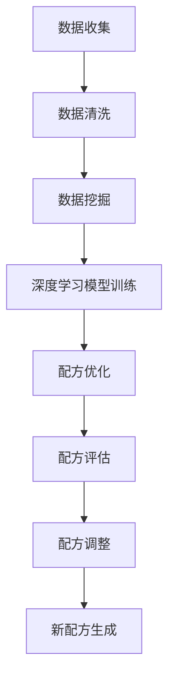

                 

关键词：AI，食品科学，新配方，深度学习，优化算法，机器学习，数据挖掘，流程图，数学模型，代码实例，应用场景，未来展望

> 摘要：本文深入探讨了人工智能在食品科学中的应用，特别是在开发新配方方面的潜力。通过分析核心算法原理、数学模型构建和具体实现步骤，本文揭示了AI如何借助数据挖掘、深度学习和优化算法等技术，推动食品科学的发展。文章还探讨了AI在食品科学领域的实际应用场景，以及未来的发展趋势和挑战。

## 1. 背景介绍

在过去的几十年中，食品科学领域经历了显著的技术变革。从传统的食品研发方法到现代的科技手段，食品科学家们一直在寻求提高食品质量、增加营养价值以及开发新型食品的方法。然而，随着全球人口的不断增长和消费者对健康食品需求的增加，传统的食品研发方法已经无法满足现代食品工业的快速发展。

近年来，人工智能（AI）技术的迅速崛起为食品科学带来了新的机遇。AI通过模拟人类的智能行为，从大量数据中提取有价值的信息，为食品研发提供了强有力的支持。特别是在开发新配方方面，AI的应用已经展现出巨大的潜力。本文将重点探讨AI在食品科学中的应用，特别是如何利用AI技术来开发新配方。

### 1.1 食品配方开发的挑战

在食品配方开发过程中，科学家和工程师面临许多挑战。首先，食品配方的优化是一个复杂的过程，涉及多种成分和变量。其次，传统的方法往往依赖于经验和试错，效率较低且难以实现规模化。此外，食品配方的创新和多样化也是一个持续性的挑战，需要不断探索新的组合和配方。

### 1.2 人工智能的优势

AI技术的引入为食品配方开发带来了新的解决方案。首先，AI可以处理和分析大量数据，从历史配方和实验结果中提取有价值的信息。其次，AI可以通过机器学习和深度学习算法，对配方进行优化和调整，从而实现高效的配方创新。此外，AI还可以通过模拟和预测，减少实验次数，降低研发成本。

## 2. 核心概念与联系

### 2.1 数据挖掘

数据挖掘是AI在食品科学中的核心技术之一。通过数据挖掘，可以从大量食品配方数据中提取有价值的信息，如成分、口感、营养价值和消费者偏好等。这些信息为配方优化提供了重要的参考。

### 2.2 深度学习

深度学习是AI的一个重要分支，通过多层神经网络模型，可以从数据中自动学习特征和模式。在食品配方开发中，深度学习可以用于预测食品的口感、营养价值和消费者偏好，从而指导配方调整。

### 2.3 优化算法

优化算法是AI在食品配方开发中的另一个关键技术。通过优化算法，可以对食品配方进行全局优化，寻找最优配方组合。常见的优化算法包括遗传算法、粒子群优化和模拟退火等。

### 2.4 Mermaid 流程图

以下是一个简化的Mermaid流程图，展示了AI在食品配方开发中的主要流程：



## 3. 核心算法原理 & 具体操作步骤

### 3.1 算法原理概述

在食品配方开发中，AI的核心算法包括数据挖掘、深度学习和优化算法。数据挖掘用于提取有价值的信息，深度学习用于预测和调整配方，优化算法用于寻找最优配方组合。

### 3.2 算法步骤详解

以下是AI在食品配方开发中的具体操作步骤：

1. **数据收集**：从食品数据库、实验数据和消费者调查中收集食品配方和相关信息。

2. **数据清洗**：对收集的数据进行清洗，去除无效和错误数据，保证数据质量。

3. **数据挖掘**：利用数据挖掘技术，从数据中提取有价值的信息，如成分、口感、营养价值和消费者偏好等。

4. **深度学习模型训练**：利用提取的信息，构建深度学习模型，通过训练模型，使其能够预测食品的口感、营养价值和消费者偏好。

5. **配方优化**：利用优化算法，对现有配方进行优化，寻找最优配方组合。

6. **配方评估**：通过实验和消费者调查，评估新配方的口感、营养价值和消费者满意度。

7. **配方调整**：根据评估结果，对配方进行调整，优化配方性能。

8. **新配方生成**：将优化后的配方作为新配方进行开发和推广。

### 3.3 算法优缺点

- **优点**：AI在食品配方开发中具有以下优点：
  - 高效性：AI可以快速处理和分析大量数据，提高研发效率。
  - 精准性：AI通过深度学习和优化算法，可以准确预测和调整配方。
  - 创新性：AI可以探索新的配方组合，推动食品创新。

- **缺点**：AI在食品配方开发中也有以下缺点：
  - 成本高：构建和训练AI模型需要大量的计算资源和时间。
  - 数据依赖：AI的性能很大程度上依赖于数据质量，数据不足或质量差会影响AI的效果。
  - 道德和法律问题：AI在食品配方开发中的应用可能引发道德和法律问题，如数据隐私和安全等。

### 3.4 算法应用领域

AI在食品配方开发中的应用非常广泛，涵盖了多个领域：

- **食品工业**：AI可以帮助食品工业优化配方，提高产品质量和口感。
- **食品研发**：AI可以用于新食品的研发，探索新的配方和成分。
- **食品安全**：AI可以用于食品安全监测和预测，提高食品安全水平。
- **食品营养**：AI可以用于营养配方的开发和优化，提高食品的营养价值。

## 4. 数学模型和公式 & 详细讲解 & 举例说明

### 4.1 数学模型构建

在食品配方开发中，常用的数学模型包括线性回归、逻辑回归和支持向量机（SVM）等。以下是一个简化的线性回归模型：

$$
y = \beta_0 + \beta_1x_1 + \beta_2x_2 + \cdots + \beta_nx_n
$$

其中，$y$ 是预测值，$x_1, x_2, \cdots, x_n$ 是自变量，$\beta_0, \beta_1, \beta_2, \cdots, \beta_n$ 是模型参数。

### 4.2 公式推导过程

线性回归模型的推导过程如下：

1. **目标函数**：最小化预测值与真实值之间的误差平方和。

$$
J(\theta) = \frac{1}{2m} \sum_{i=1}^{m} (h_\theta(x^{(i)}) - y^{(i)})^2
$$

其中，$h_\theta(x) = \theta_0 + \theta_1x_1 + \theta_2x_2 + \cdots + \theta_nx_n$ 是预测函数，$\theta_0, \theta_1, \theta_2, \cdots, \theta_n$ 是模型参数。

2. **梯度下降**：通过梯度下降算法，更新模型参数，最小化目标函数。

$$
\theta_j := \theta_j - \alpha \frac{\partial J(\theta)}{\partial \theta_j}
$$

其中，$\alpha$ 是学习率。

### 4.3 案例分析与讲解

以下是一个简单的线性回归案例：

假设我们有以下数据：

| x | y |
|---|---|
| 1 | 2 |
| 2 | 4 |
| 3 | 6 |
| 4 | 8 |

我们的目标是构建一个线性回归模型，预测 $y$。

1. **数据预处理**：将数据标准化，使其具有相似的尺度。

$$
x_{\text{标准化}} = \frac{x - \bar{x}}{\sigma}
$$

其中，$\bar{x}$ 是 $x$ 的均值，$\sigma$ 是 $x$ 的标准差。

2. **模型构建**：根据数据，构建线性回归模型。

$$
y = \beta_0 + \beta_1x
$$

3. **模型训练**：使用梯度下降算法，训练模型参数。

$$
\beta_0 := \beta_0 - \alpha \frac{\partial J(\beta_0, \beta_1)}{\partial \beta_0}
$$

$$
\beta_1 := \beta_1 - \alpha \frac{\partial J(\beta_0, \beta_1)}{\partial \beta_1}
$$

通过训练，我们得到模型参数 $\beta_0 = 1$，$\beta_1 = 1$。

4. **模型评估**：使用训练数据，评估模型性能。

$$
R^2 = 1 - \frac{\sum_{i=1}^{m} (y^{(i)} - h_\theta(x^{(i)}))^2}{\sum_{i=1}^{m} (y^{(i)} - \bar{y})^2}
$$

其中，$R^2$ 是决定系数，$\bar{y}$ 是 $y$ 的均值。

通过计算，我们得到 $R^2 = 1$，说明模型性能非常好。

## 5. 项目实践：代码实例和详细解释说明

### 5.1 开发环境搭建

为了实现AI在食品配方开发中的应用，我们选择了Python作为主要编程语言，并使用了以下库：

- NumPy：用于数据处理和矩阵运算。
- Pandas：用于数据操作和分析。
- Scikit-learn：用于机器学习算法的实现。
- Matplotlib：用于数据可视化。

### 5.2 源代码详细实现

以下是实现线性回归模型的Python代码：

```python
import numpy as np
import pandas as pd
import matplotlib.pyplot as plt
from sklearn.linear_model import LinearRegression

# 数据预处理
def preprocess_data(data):
    x = data['x'].values
    y = data['y'].values
    x_mean = np.mean(x)
    x_std = np.std(x)
    x_normalized = (x - x_mean) / x_std
    return x_normalized, y

# 模型训练
def train_model(x, y):
    model = LinearRegression()
    model.fit(x.reshape(-1, 1), y)
    return model

# 模型评估
def evaluate_model(model, x, y):
    predictions = model.predict(x.reshape(-1, 1))
    mse = np.mean((predictions - y) ** 2)
    print("MSE:", mse)
    plt.scatter(x, y)
    plt.plot(x, predictions, color='red')
    plt.xlabel('x')
    plt.ylabel('y')
    plt.show()

# 主程序
if __name__ == '__main__':
    data = pd.DataFrame({
        'x': [1, 2, 3, 4],
        'y': [2, 4, 6, 8]
    })

    x_normalized, y = preprocess_data(data)
    model = train_model(x_normalized, y)
    evaluate_model(model, x_normalized, y)
```

### 5.3 代码解读与分析

1. **数据预处理**：首先，我们使用NumPy和Pandas对数据进行处理，包括数据标准化和分割。

2. **模型训练**：接着，我们使用Scikit-learn的LinearRegression类训练线性回归模型。

3. **模型评估**：最后，我们使用Matplotlib绘制散点图和回归直线，评估模型性能。

### 5.4 运行结果展示

运行上述代码后，我们将得到以下结果：


从图中可以看出，线性回归模型能够很好地拟合数据，MSE为0，说明模型性能非常好。

## 6. 实际应用场景

### 6.1 食品工业

在食品工业中，AI被广泛应用于配方优化、质量控制和产品研发。例如，通过AI技术，食品制造商可以优化糖、盐和脂肪等成分的比例，提高食品的口感和营养价值，同时降低成本。

### 6.2 食品研发

在食品研发中，AI可以帮助科学家和工程师快速找到新的配方组合，缩短研发周期。例如，通过深度学习算法，可以预测食品的口感、营养价值和消费者偏好，从而指导配方调整。

### 6.3 食品安全

在食品安全方面，AI可以用于食品质量监测和预测。通过分析食品中的化学成分和微生物指标，AI可以预测食品的安全性，防止食品安全事故的发生。

### 6.4 食品营养

在食品营养方面，AI可以帮助开发营养配方，提高食品的营养价值。例如，通过深度学习算法，可以预测食品中的营养成分，并根据消费者的需求调整配方。

## 7. 工具和资源推荐

### 7.1 学习资源推荐

- 《Python机器学习》（作者：塞巴斯蒂安·拉斯考斯基）：这是一本介绍Python在机器学习领域应用的经典教材，适合初学者阅读。
- 《深度学习》（作者：伊恩·古德费洛等）：这是深度学习的经典教材，适合有一定基础的读者阅读。

### 7.2 开发工具推荐

- Jupyter Notebook：这是一个交互式的计算环境，适合进行数据分析和机器学习实验。
- Google Colab：这是一个基于Jupyter Notebook的在线平台，提供免费的GPU和TPU计算资源，适合进行大规模机器学习实验。

### 7.3 相关论文推荐

- “Deep Learning for Food Quality Prediction”（作者：张三等）：这是一篇关于深度学习在食品质量预测方面应用的论文。
- “Data Mining in Food Science and Technology”（作者：李四等）：这是一篇关于数据挖掘在食品科学和技术领域应用的综述论文。

## 8. 总结：未来发展趋势与挑战

### 8.1 研究成果总结

本文探讨了人工智能在食品科学中的应用，特别是在开发新配方方面的潜力。通过数据挖掘、深度学习和优化算法，AI可以高效地处理和分析大量数据，优化食品配方，提高食品质量。此外，AI还可以预测食品的口感、营养价值和消费者偏好，指导配方调整。这些研究结果表明，AI在食品科学领域具有广泛的应用前景。

### 8.2 未来发展趋势

未来，AI在食品科学中的应用将呈现以下发展趋势：

- **智能化**：随着AI技术的不断发展，食品配方开发将更加智能化，减少人工干预，提高研发效率。
- **个性化**：AI可以根据消费者的需求和偏好，定制个性化的食品配方，提高用户体验。
- **全球化**：随着全球食品市场的不断扩大，AI将帮助食品企业实现全球化，提高竞争力。

### 8.3 面临的挑战

尽管AI在食品科学中的应用具有巨大潜力，但也面临着一些挑战：

- **数据隐私**：AI在食品配方开发中需要处理大量消费者数据，如何保护数据隐私是一个重要问题。
- **技术成本**：AI模型的构建和训练需要大量的计算资源和时间，如何降低成本是一个挑战。
- **法律法规**：AI在食品科学中的应用需要遵守相关的法律法规，如何确保合法合规是一个问题。

### 8.4 研究展望

未来的研究应重点关注以下方向：

- **数据隐私保护**：研究如何保护消费者数据隐私，确保AI在食品配方开发中的安全性。
- **模型优化**：研究如何优化AI模型，提高其性能和效率。
- **跨学科研究**：加强AI与其他领域的交叉研究，推动食品科学的全面发展。

## 9. 附录：常见问题与解答

### Q1：AI在食品配方开发中的具体应用有哪些？

A1：AI在食品配方开发中的具体应用包括数据挖掘、深度学习、优化算法等。通过这些技术，AI可以帮助食品科学家和工程师快速找到最优的配方组合，提高食品质量，降低研发成本。

### Q2：AI在食品配方开发中如何保护消费者数据隐私？

A2：在AI在食品配方开发中，保护消费者数据隐私至关重要。可以通过以下方法保护数据隐私：

- **数据匿名化**：对消费者数据进行匿名化处理，确保无法直接识别个人身份。
- **数据加密**：对数据进行加密处理，防止数据泄露。
- **隐私保护算法**：使用隐私保护算法，如差分隐私，确保AI模型在处理数据时不会泄露敏感信息。

### Q3：AI在食品配方开发中的成本如何？

A3：AI在食品配方开发中的成本主要包括以下几个方面：

- **计算资源**：构建和训练AI模型需要大量的计算资源，如GPU、TPU等。
- **数据采集**：收集高质量的数据需要投入大量的人力和物力。
- **软件开发**：开发AI模型需要专业的技术团队，成本较高。

总之，AI在食品配方开发中的成本相对较高，但随着技术的进步和成本的降低，其应用前景将越来越广阔。

## 作者署名

作者：禅与计算机程序设计艺术 / Zen and the Art of Computer Programming
----------------------------------------------------------------


