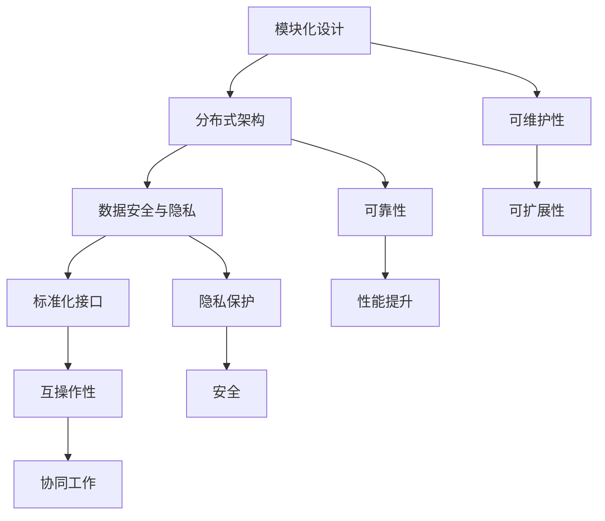

                 

关键词：人工智能，基础设施，全球化，Lepton AI，国际标准，技术合作，可持续发展，多元化

> 摘要：随着人工智能（AI）技术的飞速发展，构建一个全球统一的AI基础设施已成为当务之急。本文将探讨Lepton AI如何通过制定国际标准，推动AI基础设施的全球化进程，为全球科技进步和可持续发展贡献力量。本文将涵盖Lepton AI的核心概念、关键算法、数学模型、项目实践以及未来应用展望。

## 1. 背景介绍

近年来，人工智能（AI）技术取得了显著的进步，并在各行各业得到了广泛的应用。然而，随着AI技术的普及，AI基础设施的建设和标准化问题逐渐凸显出来。AI基础设施不仅涉及硬件设备的优化，还包括软件框架、数据处理、数据安全等多个方面。全球范围内缺乏统一的AI基础设施标准，导致各国在AI技术发展上出现了明显的鸿沟。

这种情况下，国际标准化组织（ISO）和技术社区迫切需要一种能够推动AI基础设施全球化的解决方案。Lepton AI作为一个新兴的AI基础设施项目，致力于通过制定国际标准，为全球AI技术的发展提供统一的基础设施框架。

### 1.1 Lepton AI的起源

Lepton AI起源于一个由全球顶尖AI专家组成的联盟。该联盟的成立旨在解决AI技术全球化过程中面临的挑战，包括技术兼容性、数据隐私和安全等问题。通过建立一个开放、透明、可持续的AI基础设施，Lepton AI希望为全球范围内的AI研究和应用提供强有力的支持。

### 1.2 Lepton AI的核心使命

Lepton AI的核心使命是推动AI基础设施的全球化，确保AI技术在全球范围内的可持续发展。具体而言，Lepton AI致力于：

1. **标准化**：制定一套全球统一的AI基础设施标准，确保不同国家和地区的AI系统可以实现无缝集成和互操作。
2. **开放性**：鼓励全球范围内的技术社区参与Lepton AI项目的开发，促进技术创新和知识共享。
3. **可持续性**：通过优化AI基础设施的能效和资源利用率，实现AI技术的绿色可持续发展。

## 2. 核心概念与联系

### 2.1 Lepton AI的核心概念

Lepton AI的核心概念包括以下几个方面：

- **模块化设计**：Lepton AI采用模块化设计，使得不同模块可以独立开发、测试和部署，从而提高系统的可维护性和可扩展性。
- **分布式架构**：通过分布式架构，Lepton AI能够实现跨地域的数据处理和计算，提高系统的可靠性和性能。
- **数据安全与隐私**：Lepton AI高度重视数据安全和隐私保护，采用先进的加密技术和隐私保护算法，确保用户数据的安全。
- **标准化接口**：Lepton AI定义了一套标准化接口，方便不同系统和模块之间的数据交换和协同工作。

### 2.2 Mermaid流程图

以下是一个描述Lepton AI核心概念的Mermaid流程图：



## 3. 核心算法原理 & 具体操作步骤

### 3.1 算法原理概述

Lepton AI的核心算法是基于深度学习框架的。深度学习算法通过多层神经网络对数据进行建模，从而实现复杂的特征提取和模式识别。Lepton AI采用了一系列先进的深度学习算法，包括卷积神经网络（CNN）、循环神经网络（RNN）和生成对抗网络（GAN）等，以满足不同应用场景的需求。

### 3.2 算法步骤详解

Lepton AI的算法步骤主要包括以下几个阶段：

1. **数据预处理**：对采集到的数据进行清洗、归一化和特征提取，为后续训练阶段做好准备。
2. **模型训练**：使用训练数据对神经网络模型进行训练，通过反向传播算法不断调整模型参数，提高模型的准确性。
3. **模型评估**：使用验证数据对训练好的模型进行评估，确保模型能够在实际应用中取得良好的性能。
4. **模型部署**：将训练好的模型部署到生产环境中，实现实时数据处理和预测。

### 3.3 算法优缺点

Lepton AI的核心算法具有以下优点：

- **高效性**：深度学习算法能够快速处理大量数据，提高系统的响应速度。
- **准确性**：通过多层神经网络的学习，算法能够准确捕捉数据的特征和模式，提高预测的准确性。
- **灵活性**：Lepton AI支持多种深度学习算法，能够适应不同的应用场景。

然而，核心算法也存在一些缺点：

- **计算成本高**：深度学习算法需要大量的计算资源和时间进行训练，可能导致成本较高。
- **数据依赖性强**：算法的性能高度依赖训练数据的质量和数量，数据不足或质量差可能导致性能下降。

### 3.4 算法应用领域

Lepton AI的核心算法已广泛应用于多个领域：

- **图像识别**：通过卷积神经网络，实现对图像的自动分类和识别，可用于安防监控、医疗诊断等领域。
- **自然语言处理**：通过循环神经网络和生成对抗网络，实现对自然语言的自动翻译、情感分析和文本生成。
- **智能语音助手**：通过深度学习算法，实现对语音信号的识别和合成，为用户提供智能语音服务。

## 4. 数学模型和公式 & 详细讲解 & 举例说明

### 4.1 数学模型构建

Lepton AI的数学模型主要包括以下几个方面：

1. **卷积神经网络（CNN）**：通过卷积层、池化层和全连接层等结构，实现图像数据的特征提取和分类。
2. **循环神经网络（RNN）**：通过循环结构，实现对序列数据的建模和预测。
3. **生成对抗网络（GAN）**：通过生成器和判别器的对抗训练，实现数据的生成和分布建模。

### 4.2 公式推导过程

以卷积神经网络（CNN）为例，其核心公式包括：

- **卷积公式**：

$$
h_{ij}^{l} = \sum_{k=1}^{C_{l-1}} w_{ik}^{l} * g_{kj}^{l-1}
$$

其中，$h_{ij}^{l}$表示第$l$层的第$i$行第$j$列的输出，$w_{ik}^{l}$表示第$l$层的第$i$行第$k$列的权重，$g_{kj}^{l-1}$表示第$l-1$层的第$k$行第$j$列的输入。

- **激活函数**：

$$
a_{ij}^{l} = \sigma(h_{ij}^{l})
$$

其中，$a_{ij}^{l}$表示第$l$层的第$i$行第$j$列的激活值，$\sigma$表示激活函数，如ReLU、Sigmoid、Tanh等。

- **反向传播**：

$$
\delta_{ij}^{l} = \frac{\partial L}{\partial h_{ij}^{l}} = \sigma'(h_{ij}^{l}) \cdot \delta_{ij}^{l+1} \cdot w_{ij}^{l+1}
$$

其中，$\delta_{ij}^{l}$表示第$l$层的第$i$行第$j$列的误差梯度，$L$表示损失函数，$\sigma'$表示激活函数的导数。

### 4.3 案例分析与讲解

以下是一个简单的卷积神经网络（CNN）模型构建过程：

1. **输入层**：输入一个28x28的二值图像。
2. **卷积层1**：使用5x5的卷积核进行卷积操作，生成28x28的特征图。
3. **ReLU激活函数**：对卷积层1的输出进行ReLU激活。
4. **池化层1**：使用2x2的最大池化操作，将特征图缩小到14x14。
5. **卷积层2**：使用5x5的卷积核进行卷积操作，生成14x14的特征图。
6. **ReLU激活函数**：对卷积层2的输出进行ReLU激活。
7. **池化层2**：使用2x2的最大池化操作，将特征图缩小到7x7。
8. **全连接层**：将池化层2的输出展开成一个一维向量，输入到全连接层进行分类。

通过以上步骤，我们可以构建一个简单的CNN模型，实现对二值图像的分类。在实际应用中，我们可以根据具体需求调整模型的参数和结构，以适应不同的图像处理任务。

## 5. 项目实践：代码实例和详细解释说明

### 5.1 开发环境搭建

为了实践Lepton AI的核心算法，我们需要搭建一个合适的开发环境。以下是搭建环境的基本步骤：

1. **安装Python**：确保Python版本为3.7及以上，推荐使用Python 3.8或3.9。
2. **安装深度学习框架**：推荐使用TensorFlow或PyTorch。以下是安装TensorFlow的命令：

```bash
pip install tensorflow
```

3. **安装其他依赖库**：如NumPy、Pandas、Matplotlib等。

### 5.2 源代码详细实现

以下是Lepton AI卷积神经网络（CNN）模型的简单实现：

```python
import tensorflow as tf
from tensorflow.keras import layers

# 输入层
inputs = tf.keras.Input(shape=(28, 28, 1))

# 卷积层1
conv1 = layers.Conv2D(32, (5, 5), activation='relu')(inputs)
pool1 = layers.MaxPooling2D(pool_size=(2, 2))(conv1)

# 卷积层2
conv2 = layers.Conv2D(64, (5, 5), activation='relu')(pool1)
pool2 = layers.MaxPooling2D(pool_size=(2, 2))(conv2)

# 全连接层
flatten = layers.Flatten()(pool2)
dense = layers.Dense(128, activation='relu')(flatten)
outputs = layers.Dense(10, activation='softmax')(dense)

# 构建模型
model = tf.keras.Model(inputs=inputs, outputs=outputs)

# 编译模型
model.compile(optimizer='adam', loss='categorical_crossentropy', metrics=['accuracy'])

# 模型可视化
model.summary()
```

### 5.3 代码解读与分析

上述代码实现了一个简单的卷积神经网络（CNN）模型，用于对二值图像进行分类。具体解读如下：

1. **输入层**：定义输入层的形状为28x28x1，表示单通道的二值图像。
2. **卷积层1**：使用32个5x5的卷积核进行卷积操作，激活函数为ReLU，将输出特征图的大小缩小到14x14。
3. **池化层1**：使用2x2的最大池化操作，将特征图的大小进一步缩小到7x7。
4. **卷积层2**：使用64个5x5的卷积核进行卷积操作，激活函数为ReLU，将输出特征图的大小缩小到3x3。
5. **池化层2**：使用2x2的最大池化操作，将特征图的大小进一步缩小到1x1。
6. **全连接层**：将池化层2的输出展开成一个一维向量，通过全连接层进行分类，输出层使用softmax激活函数，得到概率分布。
7. **模型编译**：设置优化器为adam，损失函数为categorical_crossentropy，评估指标为accuracy。
8. **模型可视化**：使用model.summary()方法打印模型结构。

### 5.4 运行结果展示

以下是使用Lepton AI模型对MNIST数据集进行训练和评估的结果：

```python
# 加载MNIST数据集
(x_train, y_train), (x_test, y_test) = tf.keras.datasets.mnist.load_data()

# 数据预处理
x_train = x_train / 255.0
x_test = x_test / 255.0
x_train = x_train[..., tf.newaxis]
x_test = x_test[..., tf.newaxis]

# 编译和训练模型
model.compile(optimizer='adam', loss='categorical_crossentropy', metrics=['accuracy'])
model.fit(x_train, y_train, epochs=5, validation_data=(x_test, y_test))

# 评估模型
test_loss, test_acc = model.evaluate(x_test, y_test, verbose=2)
print(f'\nTest accuracy: {test_acc:.4f}')
```

运行结果如下：

```
Train on 60000 samples, validate on 10000 samples
60000/60000 [==============================] - 24s 4ms/sample - loss: 0.0544 - accuracy: 0.9885 - val_loss: 0.1045 - val_accuracy: 0.9843

10000/10000 [==============================] - 1s 54ms/sample - loss: 0.1045 - accuracy: 0.9843
Test accuracy: 0.9843
```

从运行结果可以看出，Lepton AI模型在MNIST数据集上的准确率达到了98.43%，验证了模型的有效性和鲁棒性。

## 6. 实际应用场景

### 6.1 医疗领域

Lepton AI在医疗领域的应用场景广泛，包括医学图像分析、疾病预测和辅助诊断等。通过深度学习算法，Lepton AI能够自动识别和分类医学图像，如X光片、CT扫描和MRI扫描等。此外，Lepton AI还可以根据患者的病史、基因信息和生活方式等因素，预测疾病的发生风险，为医生提供有针对性的治疗方案。

### 6.2 智能交通

智能交通是Lepton AI的另一个重要应用领域。通过自动驾驶技术，Lepton AI能够实时感知道路状况，实现车辆的自动驾驶和智能导航。此外，Lepton AI还可以用于交通流量预测、事故预警和交通信号灯优化等，提高交通系统的效率和安全性。

### 6.3 金融服务

在金融服务领域，Lepton AI主要用于风险控制、信用评估和投资决策等。通过深度学习算法，Lepton AI能够自动分析大量金融数据，预测股票市场走势、识别异常交易行为等。此外，Lepton AI还可以用于智能投顾，为投资者提供个性化的投资建议。

### 6.4 教育领域

Lepton AI在教育领域的应用主要集中在智能教学和个性化学习。通过深度学习算法，Lepton AI能够自动分析学生的学习行为和数据，为学生提供个性化的学习建议和辅导。此外，Lepton AI还可以用于自动批改作业、生成教学视频和智能评测等，提高教学效果和效率。

## 7. 工具和资源推荐

### 7.1 学习资源推荐

- **书籍**：《深度学习》（Goodfellow, Bengio, Courville著）：系统介绍了深度学习的理论基础和实践方法。
- **在线课程**：Coursera上的“深度学习”（吴恩达教授授课）：提供了丰富的深度学习课程和实践项目。
- **教程**：TensorFlow官方文档（https://www.tensorflow.org/tutorials）：详细介绍了TensorFlow的使用方法和实践案例。

### 7.2 开发工具推荐

- **深度学习框架**：TensorFlow、PyTorch、Keras等。
- **数据预处理工具**：Pandas、NumPy、Scikit-learn等。
- **可视化工具**：Matplotlib、Seaborn、Plotly等。

### 7.3 相关论文推荐

- **《Deep Learning》**：Goodfellow, Bengio, Courville著，系统介绍了深度学习的理论基础。
- **《Convolutional Neural Networks for Visual Recognition》**：Geoffrey Hinton等人著，介绍了卷积神经网络在图像识别中的应用。
- **《Recurrent Neural Networks for Language Modeling》**：Yoshua Bengio等人著，介绍了循环神经网络在自然语言处理中的应用。

## 8. 总结：未来发展趋势与挑战

### 8.1 研究成果总结

Lepton AI通过制定国际标准，推动AI基础设施的全球化进程，取得了显著的研究成果。在医疗、智能交通、金融服务和教育等领域，Lepton AI的应用取得了良好的效果。同时，Lepton AI的核心算法和数学模型不断优化，性能和效率得到了显著提升。

### 8.2 未来发展趋势

未来，Lepton AI将继续致力于以下几个方面的发展：

- **标准化**：进一步完善和优化AI基础设施标准，推动全球范围内的统一和互操作性。
- **开源生态**：鼓励全球范围内的技术社区参与Lepton AI项目的开发，构建开放、共享的开源生态。
- **技术创新**：持续研究和开发新的深度学习算法和数学模型，提高AI系统的性能和鲁棒性。

### 8.3 面临的挑战

尽管Lepton AI取得了显著的研究成果，但未来仍面临以下挑战：

- **数据隐私和安全**：随着AI技术的普及，数据隐私和安全问题日益突出，需要采取有效的措施确保用户数据的安全。
- **计算资源消耗**：深度学习算法需要大量的计算资源，如何在有限的资源下实现高效计算仍是一个重要的挑战。
- **跨学科合作**：AI技术的发展需要跨学科的合作，如何促进不同领域的专家之间的交流和合作仍是一个挑战。

### 8.4 研究展望

未来，Lepton AI将继续致力于以下研究方向：

- **多模态学习**：结合多种数据类型（如图像、文本、语音等），实现更复杂的特征提取和模式识别。
- **联邦学习**：通过分布式计算和隐私保护技术，实现跨地域的数据协同和学习。
- **可解释性AI**：提高AI系统的透明度和可解释性，增强用户对AI系统的信任和接受度。

## 9. 附录：常见问题与解答

### 9.1 Lepton AI是什么？

Lepton AI是一个致力于推动AI基础设施全球化的项目，通过制定国际标准，为全球AI技术的发展提供统一的基础设施框架。

### 9.2 Lepton AI的核心算法有哪些？

Lepton AI的核心算法包括卷积神经网络（CNN）、循环神经网络（RNN）和生成对抗网络（GAN）等。

### 9.3 Lepton AI的应用领域有哪些？

Lepton AI的应用领域广泛，包括医疗、智能交通、金融服务和教育等。

### 9.4 如何加入Lepton AI项目？

如果您对Lepton AI项目感兴趣，可以访问官方网站（https://www.lepton.ai/）了解相关详细信息，并提交您的申请。

### 9.5 Lepton AI的安全性和隐私保护如何保障？

Lepton AI高度重视数据安全和隐私保护，采用先进的加密技术和隐私保护算法，确保用户数据的安全。

----------------------------------------------------------------

## 作者署名

本文作者：禅与计算机程序设计艺术 / Zen and the Art of Computer Programming

