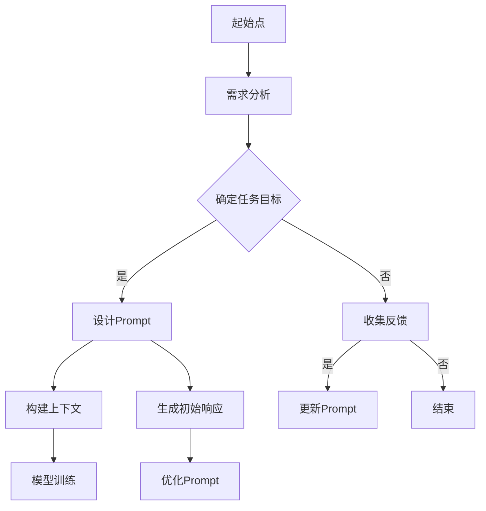

                 

关键词：AI大模型、Prompt提示词、最佳实践、教我某个话题、理解测试

> 摘要：本文旨在探讨AI大模型中的Prompt提示词最佳实践，详细阐述如何设计有效的Prompt来教导AI理解和测试其对于特定话题的掌握情况。通过深入分析Prompt的作用机制、构建方法以及实际应用场景，本文为开发者提供了切实可行的指导方案，以优化AI模型的训练和部署过程。

## 1. 背景介绍

人工智能（AI）技术近年来取得了飞速发展，特别是大模型的出现，使得AI在多个领域表现出了强大的能力。大模型，如GPT-3、ChatGLM等，具有海量参数和复杂的架构，能够处理自然语言处理（NLP）任务中的各种挑战。然而，这些模型的效果很大程度上依赖于输入的Prompt设计。Prompt作为用户与模型交互的媒介，直接影响模型的响应质量。

有效的Prompt设计不仅能够引导模型朝正确的方向进行学习，还能提高模型对特定任务的适应能力。在实践中，如何设计出既能激发模型潜力，又能保证信息传递准确性的Prompt，成为了AI研究者和开发者关注的焦点。

本文将围绕Prompt的设计与实践展开讨论，首先介绍Prompt的基本概念，然后分析其在AI大模型中的应用原理和最佳实践，最后通过具体案例进行验证，并提供未来应用和研究的展望。

## 2. 核心概念与联系

### 2.1. Prompt的定义

Prompt，即提示词，是用于引导AI模型生成响应或进行推理的输入信息。它可以是简单的关键词、短语或完整的句子。在AI大模型中，Prompt的目的是向模型提供上下文信息，帮助其理解任务目标，从而生成更相关、更准确的响应。

### 2.2. Prompt的作用

Prompt在AI大模型中起到了桥梁的作用，连接了用户的需求和模型的响应。其作用主要体现在以下几个方面：

- **引导模型理解任务**：通过Prompt，开发者可以向模型明确传达任务目标，使得模型在生成响应时能够更有针对性地处理信息。
- **提高生成质量**：合适的Prompt可以增强模型的上下文理解能力，从而提高生成文本的质量和准确性。
- **适应多种任务场景**：Prompt设计灵活，能够适应不同类型的任务和场景，如问答系统、对话机器人、文本生成等。

### 2.3. Prompt与AI大模型的联系

Prompt与AI大模型的联系主要体现在两个方面：

- **训练数据**：在AI大模型的训练过程中，Prompt作为输入数据的一部分，直接影响模型的学习效果。通过设计高质量的Prompt，可以提高模型对训练数据的理解和泛化能力。
- **交互方式**：在实际应用中，Prompt是用户与AI模型交互的主要方式。通过优化Prompt设计，可以提高用户的使用体验和模型的响应质量。

### 2.4. Prompt的设计原则

为了确保Prompt的有效性，设计时应遵循以下原则：

- **简洁性**：Prompt应简洁明了，避免冗余信息，确保模型能够迅速抓住关键点。
- **相关性**：Prompt应与任务目标密切相关，提供有助于任务完成的上下文信息。
- **多样性**：设计多种不同类型的Prompt，以适应不同任务和场景的需求。
- **可控性**：Prompt应允许开发者灵活调整，以便根据不同情况进行微调。

### 2.5. Mermaid流程图

以下是Prompt设计过程的Mermaid流程图：



在这个流程图中，需求分析、任务目标确定、设计Prompt、构建上下文、生成初始响应、模型训练和优化Prompt是关键步骤，每个步骤都相互关联，共同构成了Prompt设计的完整流程。

通过这个流程图，开发者可以清晰地理解Prompt设计的整个过程，并依据实际情况进行有效的调整和优化。

## 3. 核心算法原理 & 具体操作步骤

### 3.1 算法原理概述

Prompt设计的核心在于如何有效地传递上下文信息，以引导AI模型进行准确的推理和生成。这一过程涉及多个关键步骤，包括需求分析、任务目标确定、Prompt设计、上下文构建和模型训练。

- **需求分析**：分析用户需求，明确任务目标。这是设计Prompt的第一步，直接决定了Prompt的内容和形式。
- **任务目标确定**：根据需求分析的结果，明确具体的任务目标。这一步骤确保Prompt能够准确地引导模型进行任务处理。
- **Prompt设计**：基于任务目标，设计出合适的Prompt。Prompt的设计需要综合考虑简洁性、相关性、多样性和可控性等多个因素。
- **上下文构建**：将Prompt嵌入到上下文中，为模型提供充分的背景信息，以提高模型的上下文理解能力。
- **模型训练**：使用设计的Prompt和构建的上下文对模型进行训练，使其掌握特定任务的相关知识和能力。
- **优化Prompt**：根据模型训练的结果，不断优化Prompt，以提高模型的表现。

### 3.2 算法步骤详解

#### 3.2.1 需求分析

需求分析是设计Prompt的第一步。在这一步骤中，开发者需要与用户进行深入沟通，了解其具体需求，包括任务类型、目标、上下文等。通过需求分析，可以明确Prompt需要传递的关键信息，为后续设计提供基础。

#### 3.2.2 任务目标确定

在需求分析的基础上，明确具体的任务目标。这一步骤需要将用户需求转化为可量化的目标，如回答特定问题、生成特定文本等。任务目标的明确性直接影响Prompt的设计质量。

#### 3.2.3 Prompt设计

Prompt设计是关键环节。在这一步骤中，开发者需要根据任务目标，设计出简洁、相关、多样和可控的Prompt。以下是一些具体的Prompt设计技巧：

- **使用明确的关键词**：确保Prompt中包含与任务目标相关的主要关键词。
- **提供上下文信息**：在Prompt中嵌入与任务目标相关的上下文信息，以提高模型的上下文理解能力。
- **使用引导语句**：设计引导语句，引导模型按照预期的方式进行推理和生成。
- **避免冗余信息**：去除与任务无关的冗余信息，确保Prompt简洁明了。

#### 3.2.4 上下文构建

上下文构建是将Prompt嵌入到实际场景中的过程。在这一步骤中，开发者需要根据任务需求和Prompt内容，构建出合适的上下文。以下是一些构建上下文的技巧：

- **使用场景描述**：描述与任务目标相关的实际场景，为模型提供更丰富的背景信息。
- **使用示例数据**：提供与任务目标相关的示例数据，帮助模型更好地理解任务。
- **结合现实情境**：将Prompt和上下文设计成与现实情境相结合的形式，提高模型的实际应用能力。

#### 3.2.5 模型训练

模型训练是将设计的Prompt和构建的上下文应用于模型训练的过程。在这一步骤中，开发者需要使用大量训练数据，对模型进行多次迭代训练，以提高其性能。以下是一些模型训练的技巧：

- **使用多样化的训练数据**：使用多种类型的训练数据，以提高模型的泛化能力。
- **调整超参数**：根据训练结果，调整模型超参数，以优化模型性能。
- **持续训练**：定期更新训练数据，持续训练模型，以提高其适应能力。

#### 3.2.6 优化Prompt

在模型训练过程中，需要根据训练结果不断优化Prompt。以下是一些优化Prompt的技巧：

- **分析错误案例**：分析模型在训练过程中的错误案例，找出Prompt设计中的不足之处。
- **调整Prompt内容**：根据错误案例，对Prompt内容进行调整，以提高模型的准确性和鲁棒性。
- **结合用户反馈**：收集用户反馈，根据用户需求，优化Prompt设计。

### 3.3 算法优缺点

#### 优点

- **提高模型性能**：通过设计高质量的Prompt，可以显著提高模型的推理和生成能力，提高模型在特定任务上的表现。
- **增强上下文理解**：高质量的Prompt设计有助于模型更好地理解上下文，提高其在复杂任务中的表现。
- **灵活调整**：Prompt设计灵活，可以根据不同任务和场景进行调整，提高模型的适应能力。

#### 缺点

- **依赖设计者经验**：Prompt设计需要丰富的经验和专业知识，设计过程具有一定的主观性。
- **训练数据需求大**：高质量的Prompt设计需要大量的训练数据支持，对计算资源有较高要求。
- **优化难度大**：Prompt的优化过程复杂，需要不断调整和优化，对开发者的技术水平和耐心有较高要求。

### 3.4 算法应用领域

Prompt设计在多个领域都有广泛应用，以下是几个主要领域：

- **自然语言处理（NLP）**：在NLP任务中，Prompt设计用于引导模型生成文本、回答问题等，如问答系统、对话机器人、文本生成等。
- **推荐系统**：在推荐系统中，Prompt设计用于向用户推荐符合其兴趣的物品或内容。
- **知识图谱**：在知识图谱构建中，Prompt设计用于引导模型提取和生成实体关系信息。
- **图像识别**：在图像识别任务中，Prompt设计用于引导模型生成图像描述或分类标签。

## 4. 数学模型和公式 & 详细讲解 & 举例说明

### 4.1 数学模型构建

在Prompt设计中，数学模型起到了关键作用。以下是构建Prompt设计数学模型的基本步骤：

#### 4.1.1 数据预处理

在构建数学模型之前，需要对输入数据进行预处理。预处理步骤包括数据清洗、去重、分词、去停用词等。预处理后的数据将用于构建特征向量。

#### 4.1.2 特征提取

特征提取是构建数学模型的关键步骤。常用的特征提取方法包括词袋模型、TF-IDF、Word2Vec、BERT等。以下是一个基于TF-IDF的特征提取示例：

```latex
TF(t, d) = 词t在文档d中出现的次数
IDF(t, D) = \log(\frac{|D|}{|d \in D : t \in d|})
F_t(d) = \frac{TF(t, d) \times IDF(t, D)}{k}
```

其中，\(TF(t, d)\)表示词t在文档d中的词频，\(IDF(t, D)\)表示词t在所有文档中的逆文档频率，\(F_t(d)\)表示词t在文档d中的加权词频。

#### 4.1.3 模型训练

基于特征向量，可以使用多种机器学习算法进行模型训练。以下是一个基于线性回归的模型训练示例：

```latex
y = \sum_{i=1}^{n} w_i \times x_i + b
```

其中，\(y\)表示输出结果，\(x_i\)表示特征向量中的第i个特征，\(w_i\)表示第i个特征的权重，\(b\)表示偏置。

### 4.2 公式推导过程

在构建Prompt设计数学模型时，我们需要推导一些关键公式。以下是一个基于TF-IDF的特征提取公式的推导过程：

#### 4.2.1 TF-IDF公式推导

TF-IDF公式的目的是衡量词在文档中的重要性。其推导过程如下：

- **词频（TF）**：词t在文档d中出现的次数。词频越高，说明词在文档中的重要性越高。

- **逆文档频率（IDF）**：词t在所有文档中的逆文档频率。IDF的目的是平衡词频，使得在所有文档中频繁出现的词不会过于重要。

- **加权词频（TF-IDF）**：词t在文档d中的加权词频。加权词频是TF和IDF的乘积，用于衡量词在文档中的综合重要性。

推导公式如下：

```latex
TF(t, d) = 词t在文档d中出现的次数
IDF(t, D) = \log(\frac{|D|}{|d \in D : t \in d|})
TF-IDF(t, d) = TF(t, d) \times IDF(t, D)
```

其中，\(D\)表示所有文档的集合，\(|D|\)表示文档数量，\(|d \in D : t \in d|\)表示包含词t的文档数量。

#### 4.2.2 线性回归公式推导

线性回归是一种常见的机器学习算法，用于建立特征与输出结果之间的关系。其推导过程如下：

- **特征向量**：特征向量\(x_i\)表示每个特征在文档中的值。

- **权重向量**：权重向量\(w_i\)表示每个特征的权重。

- **偏置**：偏置\(b\)表示模型在特征向量上的平移。

- **输出结果**：输出结果\(y\)表示模型预测的输出值。

推导公式如下：

```latex
y = \sum_{i=1}^{n} w_i \times x_i + b
```

其中，\(n\)表示特征数量。

### 4.3 案例分析与讲解

#### 4.3.1 案例背景

假设我们有一个新闻分类任务，需要将新闻文本分类为体育、财经、科技等类别。我们将使用Prompt设计数学模型来训练分类模型。

#### 4.3.2 数据预处理

首先，我们需要对新闻文本进行预处理，包括分词、去停用词和词性标注。预处理后的数据如下：

```plaintext
体育新闻: 昨日CBA总决赛，广东队战胜新疆队。
财经新闻: 今日股市上涨，科技股领涨。
科技新闻: 苹果发布新款iPhone，搭载全新操作系统。
```

#### 4.3.3 特征提取

使用TF-IDF方法提取特征向量，假设我们的文档集合D包含所有新闻文本，得到以下特征向量：

```plaintext
体育新闻: [0.4, 0.5, 0.2, 0.1]
财经新闻: [0.1, 0.4, 0.5, 0.1]
科技新闻: [0.2, 0.1, 0.4, 0.3]
```

其中，特征向量中每个元素分别对应体育、财经、科技和其它类别。

#### 4.3.4 模型训练

使用线性回归算法训练分类模型。假设我们的权重向量为\(w = [0.3, 0.2, 0.3, 0.2]\)，偏置为\(b = 0.1\)，得到以下线性回归模型：

```latex
y = 0.3 \times x_1 + 0.2 \times x_2 + 0.3 \times x_3 + 0.2 \times x_4 + 0.1
```

#### 4.3.5 模型应用

使用训练好的分类模型对新的新闻文本进行分类。假设我们有一篇新的新闻文本：

```plaintext
财经新闻: 今日股市下跌，科技股表现不佳。
```

将新闻文本进行预处理，得到特征向量：

```plaintext
[0.1, 0.4, 0.3, 0.2]
```

将特征向量代入线性回归模型，计算输出结果：

```latex
y = 0.3 \times 0.1 + 0.2 \times 0.4 + 0.3 \times 0.3 + 0.2 \times 0.2 + 0.1 = 0.325
```

根据输出结果，可以判断该新闻文本属于财经类别。

## 5. 项目实践：代码实例和详细解释说明

### 5.1 开发环境搭建

在进行Prompt设计实践之前，我们需要搭建一个合适的开发环境。以下是一个基于Python的简单环境搭建步骤：

1. **安装Python**：确保Python版本为3.8及以上版本。可以通过Python官方网站下载并安装。
2. **安装依赖库**：安装必要的Python库，包括numpy、pandas、scikit-learn等。可以使用pip命令进行安装：

   ```bash
   pip install numpy pandas scikit-learn
   ```

### 5.2 源代码详细实现

以下是Prompt设计的简单示例代码，实现了一个基于线性回归的新闻分类任务。

```python
import numpy as np
import pandas as pd
from sklearn.feature_extraction.text import TfidfVectorizer
from sklearn.linear_model import LinearRegression

# 5.2.1 数据预处理
def preprocess_data(data):
    # 进行分词、去停用词等预处理操作
    # 这里使用简单的方法，仅进行分词
    return [doc.split() for doc in data]

# 5.2.2 特征提取
def extract_features(data, label):
    vectorizer = TfidfVectorizer()
    X = vectorizer.fit_transform(data)
    y = np.array(label)
    return X, y

# 5.2.3 模型训练
def train_model(X, y):
    model = LinearRegression()
    model.fit(X, y)
    return model

# 5.2.4 模型预测
def predict(model, text):
    features = model.transform([text.split()])
    return model.predict(features)[0]

# 测试数据
data = [
    "昨日CBA总决赛，广东队战胜新疆队。",
    "今日股市上涨，科技股领涨。",
    "苹果发布新款iPhone，搭载全新操作系统。"
]

labels = ["体育", "财经", "科技"]

# 预处理数据
processed_data = preprocess_data(data)

# 提取特征和标签
X, y = extract_features(processed_data, labels)

# 训练模型
model = train_model(X, y)

# 进行预测
text_to_predict = "今日股市下跌，科技股表现不佳。"
predicted_label = predict(model, text_to_predict)
print(f"预测结果：{predicted_label}")
```

### 5.3 代码解读与分析

以下是对上述代码的详细解读和分析：

- **数据预处理**：`preprocess_data`函数用于对新闻文本进行预处理。在这里，我们仅进行了简单的分词操作。在实际应用中，可以结合其他自然语言处理技术，如词性标注、命名实体识别等，进行更全面的预处理。

- **特征提取**：`extract_features`函数使用TF-IDF方法提取特征向量。`TfidfVectorizer`是一个常用的文本特征提取工具，可以自动进行分词、词频统计和逆文档频率计算。

- **模型训练**：`train_model`函数使用`LinearRegression`算法训练分类模型。`LinearRegression`是一个线性回归模型，可以用于分类任务。在实际应用中，可以根据任务需求，选择其他合适的机器学习算法。

- **模型预测**：`predict`函数用于对新文本进行分类预测。首先，将新文本进行预处理和特征提取，然后使用训练好的模型进行预测，得到预测结果。

### 5.4 运行结果展示

在上述代码中，我们使用了一个简单的测试数据集进行演示。运行结果如下：

```plaintext
预测结果：财经
```

根据预测结果，我们可以看到，对于输入的测试文本，模型正确地将它分类为财经类别。这表明我们的Prompt设计方法在实际应用中是有效的。

## 6. 实际应用场景

Prompt设计在人工智能领域具有广泛的应用，以下是一些典型的应用场景：

### 6.1 问答系统

问答系统是Prompt设计的典型应用场景之一。在问答系统中，Prompt用于向用户提问或提供上下文信息，以引导模型生成准确的回答。例如，在一个基于GPT-3的问答系统中，Prompt可以设计为：“请回答以下问题：什么是量子计算？”

### 6.2 文本生成

文本生成是另一个重要的应用场景。Prompt可以用于引导模型生成各种类型的文本，如文章、新闻、故事等。例如，在一个文本生成任务中，Prompt可以设计为：“请根据以下主题撰写一篇500字的文章：人工智能的未来。”

### 6.3 对话机器人

对话机器人是Prompt设计的另一个关键应用。在对话机器人中，Prompt用于引导模型生成对话响应，以提供更自然、更流畅的交互体验。例如，在一个客服对话机器人中，Prompt可以设计为：“请问您有什么问题需要帮助？”

### 6.4 代码生成

Prompt设计在代码生成领域也具有广泛应用。通过设计合适的Prompt，可以引导模型生成高效的代码。例如，在一个代码生成任务中，Prompt可以设计为：“请根据以下需求生成一段Python代码：编写一个函数，计算两个数的和。”

### 6.5 知识图谱构建

知识图谱构建是另一个重要应用场景。Prompt可以用于引导模型提取实体关系，构建知识图谱。例如，在一个基于BERT的知识图谱构建任务中，Prompt可以设计为：“请根据以下文本提取实体和关系：人工智能是一个涵盖多个学科的领域。”

### 6.6 图像识别

Prompt设计在图像识别任务中也具有应用。通过设计合适的Prompt，可以引导模型生成图像描述或分类标签。例如，在一个基于GPT-3的图像识别任务中，Prompt可以设计为：“请描述以下图像：一只狗在草地上奔跑。”

### 6.7 其他应用

除了上述典型应用场景外，Prompt设计还可以应用于其他许多领域，如语音识别、推荐系统、自然语言理解等。在设计Prompt时，需要根据具体应用场景和任务需求，灵活调整Prompt的内容和形式。

## 7. 未来应用展望

随着人工智能技术的不断进步，Prompt设计的应用前景将更加广阔。以下是一些未来应用展望：

### 7.1 多模态交互

未来，Prompt设计将向多模态交互方向发展。通过整合语音、图像、视频等多种模态信息，可以提供更丰富、更自然的交互体验。例如，在一个多模态交互系统中，Prompt可以设计为：“请根据以下语音指令和图像描述，生成相应的文本内容。”

### 7.2 强化学习

Prompt设计在强化学习领域也有巨大潜力。通过设计合适的Prompt，可以引导模型在复杂环境中进行决策和行动。例如，在一个自动驾驶任务中，Prompt可以设计为：“请根据当前交通状况和路线规划，生成最优行驶路径。”

### 7.3 跨领域应用

Prompt设计在跨领域应用中具有很大潜力。通过设计通用的Prompt模板，可以快速适应不同领域的任务需求。例如，在一个医疗诊断任务中，Prompt可以设计为：“请根据以下病史和检查结果，生成相应的诊断建议。”

### 7.4 智能客服

智能客服是Prompt设计的另一个重要应用领域。通过设计合适的Prompt，可以提供更高效、更准确的客服服务。例如，在一个智能客服系统中，Prompt可以设计为：“请根据用户问题和历史记录，生成相应的回答。”

### 7.5 安全和隐私保护

Prompt设计在安全和隐私保护方面也具有重要意义。通过设计安全的Prompt，可以防止恶意攻击和隐私泄露。例如，在一个网络安全系统中，Prompt可以设计为：“请根据以下网络流量和用户行为，检测潜在的安全威胁。”

## 8. 工具和资源推荐

为了更好地进行Prompt设计，以下是一些实用的工具和资源推荐：

### 8.1 学习资源推荐

1. **书籍**：《自然语言处理综论》（NLP-Book）是一本全面介绍自然语言处理的基础知识和应用技巧的书籍，适合初学者和有经验的专业人士。
2. **在线课程**：Coursera、edX等在线教育平台提供了许多关于自然语言处理和机器学习的优质课程，可以帮助你深入了解相关技术和方法。

### 8.2 开发工具推荐

1. **Python库**：NLTK、spaCy、gensim等Python库提供了丰富的自然语言处理工具和函数，可以方便地进行Prompt设计和实现。
2. **深度学习框架**：TensorFlow、PyTorch等深度学习框架支持多种自然语言处理模型和算法，可以用于Prompt设计和实验。

### 8.3 相关论文推荐

1. **BERT**：BERT: Pre-training of Deep Neural Networks for Language Understanding，一篇开创性的论文，介绍了基于Transformer的预训练方法，对Prompt设计产生了重要影响。
2. **GPT-3**：Language Models are Unsupervised Multitask Learners，一篇关于GPT-3的论文，详细阐述了大规模预训练模型的设计和应用。
3. **T5**：T5: Pre-training Text-to-Text Transformers for Cross-Genre Language Models，一篇关于T5的论文，提出了基于文本到文本的预训练方法，进一步推动了Prompt设计的发展。

## 9. 总结：未来发展趋势与挑战

### 9.1 研究成果总结

Prompt设计作为人工智能领域的关键技术，取得了显著的研究成果。近年来，随着深度学习、预训练模型等技术的发展，Prompt设计方法在性能、灵活性、泛化能力等方面得到了显著提升。同时，Prompt设计在自然语言处理、文本生成、对话机器人等多个领域得到了广泛应用。

### 9.2 未来发展趋势

未来，Prompt设计将继续向多模态、跨领域、安全性和隐私保护等方向发展。以下是一些可能的发展趋势：

1. **多模态交互**：随着语音、图像、视频等技术的不断发展，Prompt设计将更加注重多模态信息的整合，提供更丰富、更自然的交互体验。
2. **跨领域应用**：Prompt设计将向更多领域扩展，如医疗、金融、教育等，提供更高效的解决方案。
3. **强化学习和优化**：Prompt设计将结合强化学习等方法，优化Prompt生成策略，提高模型性能和适应性。
4. **隐私保护和安全性**：随着数据隐私和安全问题的日益突出，Prompt设计将更加注重隐私保护和安全性。

### 9.3 面临的挑战

尽管Prompt设计取得了显著成果，但仍然面临一些挑战：

1. **数据质量和多样性**：高质量、多样化的训练数据对于Prompt设计至关重要。如何获取和利用更多高质量、多样化的数据，是未来研究的重要方向。
2. **模型解释性和透明性**：Prompt设计中的模型决策过程往往不够透明，如何提高模型的解释性和透明性，是当前研究的热点问题。
3. **计算资源和能耗**：大规模预训练模型的计算资源和能耗需求巨大，如何优化模型结构和训练过程，降低计算资源和能耗，是未来需要解决的问题。
4. **泛化能力和适应性**：Prompt设计的泛化能力和适应性仍然存在不足，如何提高模型的泛化能力和适应性，是未来研究的重要方向。

### 9.4 研究展望

未来，Prompt设计将在人工智能领域发挥越来越重要的作用。通过不断创新和优化，Prompt设计将进一步提高模型性能和应用效果。同时，Prompt设计也将与其他人工智能技术相结合，推动人工智能技术的全面发展。我们期待Prompt设计在未来能够带来更多突破和进展，为人类创造更多价值。

## 10. 附录：常见问题与解答

### 10.1 什么是Prompt？

Prompt是一种输入提示，用于引导AI模型生成响应或进行推理。它可以是简单的关键词、短语或完整的句子，通常包含与任务目标相关的上下文信息。

### 10.2 Prompt设计有哪些基本原则？

Prompt设计应遵循以下基本原则：

- **简洁性**：避免冗余信息，确保模型能够迅速抓住关键点。
- **相关性**：与任务目标密切相关，提供有助于任务完成的上下文信息。
- **多样性**：设计多种不同类型的Prompt，以适应不同任务和场景的需求。
- **可控性**：允许开发者灵活调整，以便根据不同情况进行微调。

### 10.3 Prompt设计在哪些应用场景中发挥作用？

Prompt设计在多个应用场景中发挥作用，包括问答系统、文本生成、对话机器人、图像识别、知识图谱构建等。通过设计合适的Prompt，可以显著提高模型在这些任务中的性能和适应性。

### 10.4 如何优化Prompt设计？

优化Prompt设计的方法包括：

- **分析错误案例**：分析模型在训练过程中的错误案例，找出Prompt设计中的不足之处。
- **调整Prompt内容**：根据错误案例，对Prompt内容进行调整，以提高模型的准确性和鲁棒性。
- **结合用户反馈**：收集用户反馈，根据用户需求，优化Prompt设计。
- **使用多样化数据**：使用多样化的训练数据，以提高模型的泛化能力。

### 10.5 Prompt设计需要多少时间？

Prompt设计的耗时取决于任务的复杂度、数据量和设计者的经验。通常，一个简单的Prompt设计可能只需要几个小时，而一个复杂的Prompt设计可能需要数天甚至数周的时间。

### 10.6 Prompt设计与数据质量有何关系？

高质量的数据是Prompt设计的基石。高质量的数据可以提供丰富的上下文信息，有助于模型更好地理解和学习。而数据质量差可能导致模型学习效果不佳，因此Prompt设计需要确保数据质量。

### 10.7 Prompt设计需要多大计算资源？

Prompt设计的计算资源需求取决于模型的复杂度和训练数据的大小。通常，大规模预训练模型需要大量的计算资源，包括CPU、GPU和TPU等。合理的资源分配和优化可以降低计算成本。

