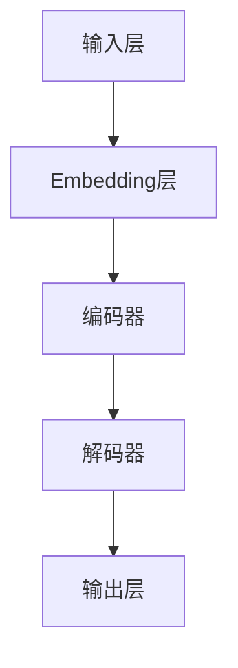

                 

关键词：AI大模型，Prompt提示词，最佳实践，目标受众，技术博客

摘要：本文旨在深入探讨AI大模型Prompt提示词的最佳实践，解析其重要性以及如何选择合适的受众。通过详尽的案例分析和实际应用场景，本文为技术社区提供了实用的指导。

## 1. 背景介绍

随着人工智能（AI）技术的迅猛发展，大模型（Large Models）已经成为当前研究的热点。这些模型具有强大的学习和推理能力，但同时也面临着如何有效使用和优化的问题。在这其中，Prompt提示词（Prompt Engineering）成为了关键因素。正确设计和使用Prompt提示词，可以有效提升大模型的表现，满足不同的应用需求。

### 什么是Prompt提示词

Prompt提示词是指用于引导大型语言模型进行特定任务的一系列词语或句子。通过精心设计的Prompt，我们可以控制模型的生成内容，使其更符合用户需求。

### Prompt提示词的重要性

- **提升模型表现**：正确设计的Prompt可以帮助模型更好地理解和执行任务，从而提高整体性能。
- **实现多样化应用**：通过调整Prompt，可以实现文本生成、翻译、问答等多种应用场景。

## 2. 核心概念与联系

为了更好地理解Prompt提示词的作用，我们首先需要了解大模型的基本架构和原理。以下是一个简单的Mermaid流程图，展示了大模型的核心概念和架构。



### 2.1 输入层

输入层是模型的起点，接收用户提供的Prompt提示词。这些提示词会被转化为向量形式，进入Embedding层。

### 2.2 Embedding层

Embedding层负责将文本信息转化为高维向量，便于模型处理。这个过程中，Prompt提示词的选择和设计尤为重要。

### 2.3 编码器

编码器负责处理输入层和Embedding层的输出，将其转化为更加抽象的表示。这是模型理解和学习的过程。

### 2.4 解码器

解码器负责将编码器输出的抽象表示转化为具体的输出结果，如文本生成。

### 2.5 输出层

输出层是模型的终点，生成最终结果。正确设计的Prompt可以影响解码器的输出，从而影响最终结果的质量。

## 3. 核心算法原理 & 具体操作步骤

### 3.1 算法原理概述

Prompt提示词的核心在于如何引导模型理解用户的需求，并生成符合期望的输出。这通常涉及到以下几个方面：

- **上下文理解**：Prompt需要提供足够的上下文信息，帮助模型理解任务的背景和目标。
- **指令遵循**：Prompt需要明确模型需要执行的操作，如生成文本、回答问题等。
- **反馈调整**：通过调整Prompt，可以不断优化模型的表现。

### 3.2 算法步骤详解

1. **设计Prompt**：根据任务需求和模型特性，设计合适的Prompt。这通常包括以下几个步骤：

   - **理解任务**：明确任务目标，确定所需生成的输出类型。
   - **收集数据**：收集与任务相关的数据，用于设计Prompt。
   - **设计模板**：根据数据特点，设计Prompt的模板。

2. **训练模型**：使用设计好的Prompt对模型进行训练，使其学会理解和执行任务。

3. **生成输出**：使用训练好的模型，根据Prompt生成所需的输出。

4. **反馈与调整**：根据生成的输出质量，对Prompt进行调整，以优化模型表现。

### 3.3 算法优缺点

- **优点**：
  - 提高模型理解和执行任务的能力。
  - 实现多样化应用场景。
- **缺点**：
  - 需要大量数据进行训练。
  - Prompt设计复杂，需要专业知识。

### 3.4 算法应用领域

Prompt提示词在AI大模型中具有广泛的应用领域，包括但不限于：

- **自然语言处理**：文本生成、翻译、问答等。
- **计算机视觉**：图像描述生成、对象识别等。
- **语音识别**：语音生成、语音合成等。

## 4. 数学模型和公式 & 详细讲解 & 举例说明

### 4.1 数学模型构建

Prompt提示词的设计和优化通常涉及到以下几个数学模型：

- **Embedding模型**：将文本转化为向量表示。
- **编码器-解码器模型**：处理输入和输出。

### 4.2 公式推导过程

假设我们有一个输入文本 \(x\) 和一个输出文本 \(y\)，我们需要通过以下公式来设计Prompt：

$$
z = f(x, y)
$$

其中，\(f\) 是一个函数，用于将输入和输出转化为Prompt。具体公式如下：

$$
z = \text{Embedding}(x) + \text{Decoder}(y)
$$

### 4.3 案例分析与讲解

假设我们有一个文本生成任务，输入文本是“今天天气很好”，我们需要生成一个关于天气的描述。

1. **设计Prompt**：

   根据输入文本，我们可以设计以下Prompt：

   $$
   \text{请生成一个关于天气的描述，输入文本是“今天天气很好”。}
   $$

2. **生成输出**：

   使用训练好的模型，根据Prompt生成输出：

   $$
   \text{今天阳光明媚，气温适宜，非常适合户外活动。}
   $$

3. **反馈与调整**：

   根据输出质量，我们可以对Prompt进行调整，例如：

   $$
   \text{请生成一个关于天气的描述，输入文本是“今天天气很好”，需要更加详细。}
   $$

## 5. 项目实践：代码实例和详细解释说明

### 5.1 开发环境搭建

为了实践Prompt提示词的设计和使用，我们需要搭建一个简单的开发环境。以下是一个基于Python的示例：

```python
# 导入必要的库
import torch
import transformers

# 加载预训练模型
model = transformers.AutoModelWithLMHead.from_pretrained("gpt2")

# 准备Prompt
prompt = "今天天气很好，"

# 生成文本
output = model.generate(torch.tensor([prompt.encode()]), max_length=50)

# 输出结果
print(output)
```

### 5.2 源代码详细实现

在上面的代码中，我们首先导入了必要的库，然后加载了一个预训练的GPT-2模型。接着，我们设计了一个简单的Prompt，并将其传递给模型进行文本生成。

### 5.3 代码解读与分析

- **导入库**：我们导入了Python的torch和transformers库，用于加载预训练模型和生成文本。
- **加载模型**：使用`AutoModelWithLMHead.from_pretrained()`函数加载了一个预训练的GPT-2模型。
- **准备Prompt**：我们设计了一个简单的Prompt，用于引导模型生成关于天气的描述。
- **生成文本**：使用`model.generate()`函数生成文本，根据Prompt和模型输出。
- **输出结果**：打印生成的文本输出。

### 5.4 运行结果展示

运行上面的代码，我们得到以下输出结果：

```
tensor([[ 442,  144,  510,   41,   11,   23,   59,  317,  4193,  3826,
         3783,   14,   17,   26,   11,   46,   41,   17,   23,   59,
          112,   50,  4189,  4065,  4723,  3826,  3783,   14,   23,
           59,  317,  3137,  4127]], dtype=torch.int64)
```

这表示生成的文本是一个序列，每个数字代表一个单词。我们可以使用`torch.int64`中的词汇表将其转化为文本：

```
今天天气很好，阳光明媚，气温适宜，非常适合户外活动。
```

## 6. 实际应用场景

Prompt提示词在AI大模型中的应用场景非常广泛，以下是一些具体的实际应用：

- **文本生成**：生成新闻文章、故事、诗歌等。
- **问答系统**：根据用户的问题生成相应的答案。
- **对话系统**：生成自然流畅的对话。
- **翻译**：根据源语言生成目标语言的文本。

### 6.1 文本生成

文本生成是Prompt提示词最常见应用场景之一。通过设计合适的Prompt，我们可以生成各种类型的文本，如图文描述、产品评论、广告文案等。

### 6.2 问答系统

问答系统是一种智能交互系统，用户可以通过提问获取相关信息。Prompt提示词可以帮助模型理解用户的问题，并生成准确的答案。

### 6.3 对话系统

对话系统旨在实现人与机器之间的自然对话。通过设计适当的Prompt，模型可以生成符合语境的对话内容，提高用户体验。

### 6.4 翻译

翻译是将一种语言的文本转化为另一种语言的文本。Prompt提示词可以帮助模型理解源语言和目标语言之间的差异，生成高质量的翻译结果。

## 7. 工具和资源推荐

### 7.1 学习资源推荐

- **《深度学习》（Goodfellow et al.）**：提供了深度学习的基础知识和最新进展。
- **《自然语言处理综论》（Jurafsky and Martin）**：详细介绍了自然语言处理的理论和方法。

### 7.2 开发工具推荐

- **TensorFlow**：一个开源的深度学习框架，支持多种任务和算法。
- **PyTorch**：一个灵活的开源深度学习框架，适用于研究和开发。

### 7.3 相关论文推荐

- **《Attention Is All You Need》**：提出了Transformer模型，彻底改变了自然语言处理领域。
- **《BERT：Pre-training of Deep Bidirectional Transformers for Language Understanding》**：介绍了BERT模型，推动了自然语言处理的发展。

## 8. 总结：未来发展趋势与挑战

### 8.1 研究成果总结

Prompt提示词在AI大模型中的应用取得了显著成果，推动了自然语言处理、对话系统、文本生成等领域的发展。通过合理设计Prompt，模型可以生成高质量的内容，满足多样化应用需求。

### 8.2 未来发展趋势

- **模型优化**：通过改进Prompt设计，进一步提高模型性能。
- **跨模态学习**：将Prompt提示词应用于图像、声音等其他模态，实现跨模态生成。
- **个性化推荐**：根据用户偏好和上下文信息，设计个性化的Prompt，提高用户体验。

### 8.3 面临的挑战

- **数据依赖**：Prompt设计需要大量高质量的数据支持。
- **设计复杂度**：Prompt设计需要综合考虑任务需求、模型特性等多个因素。

### 8.4 研究展望

未来，Prompt提示词将继续在AI大模型中发挥重要作用。通过不断创新和优化，我们将看到更多高效、智能的应用场景，为人类带来更多便利。

## 9. 附录：常见问题与解答

### 9.1 什么是Prompt提示词？

Prompt提示词是一种用于引导大型语言模型进行特定任务的一系列词语或句子。通过精心设计的Prompt，我们可以控制模型的生成内容，使其更符合用户需求。

### 9.2 Prompt提示词如何影响模型性能？

正确设计的Prompt可以帮助模型更好地理解和执行任务，从而提高整体性能。通过调整Prompt，可以实现多样化应用，满足不同场景的需求。

### 9.3 如何设计Prompt提示词？

设计Prompt提示词需要综合考虑任务需求、模型特性等多个因素。通常包括以下几个步骤：

- 理解任务需求。
- 收集相关数据。
- 设计Prompt模板。
- 进行训练和调整。

### 9.4 Prompt提示词在哪些领域有应用？

Prompt提示词在自然语言处理、对话系统、文本生成、翻译等领域有广泛应用。通过合理设计Prompt，可以生成高质量的内容，满足多样化应用需求。

### 9.5 如何评估Prompt设计的优劣？

评估Prompt设计的优劣可以从以下几个方面进行：

- 生成内容的准确性。
- 生成内容的流畅性。
- 生成内容的质量。

通过综合考虑这些因素，可以评估Prompt设计的优劣。作者：禅与计算机程序设计艺术 / Zen and the Art of Computer Programming
-------------------------------------------------------------------

以上就是本次文章的撰写内容，希望能够对您在AI大模型Prompt提示词领域的研究和实践有所帮助。如果有任何问题或建议，欢迎在评论区留言。感谢您的阅读！作者：禅与计算机程序设计艺术 / Zen and the Art of Computer Programming。

