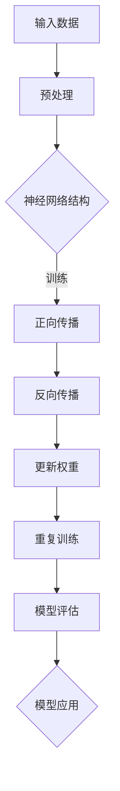

                 

关键词：AI大模型，创业，挑战，机遇，技术发展，商业应用，未来趋势

> 摘要：本文深入探讨了AI大模型在创业领域中的挑战与机遇。随着人工智能技术的快速发展，大模型在多个行业中展现了强大的潜力，吸引了众多创业者投身其中。本文将分析大模型的原理、应用领域，以及创业过程中可能遇到的障碍，并探讨未来的发展趋势和面临的挑战。

## 1. 背景介绍

近年来，人工智能（AI）技术取得了令人瞩目的进展，特别是在深度学习领域的突破。大模型（Large Models）作为AI技术的一个重要组成部分，越来越受到业界的关注。大模型通常指的是那些具有数十亿参数甚至更多的神经网络模型，它们能够通过大量数据的学习来捕捉复杂的模式，实现高度准确的预测和生成。

随着大模型的不断发展，它们在多个行业中展现了巨大的应用潜力，从自然语言处理、计算机视觉到推荐系统等，都取得了显著的成果。这也吸引了大量创业者投身于大模型的研发和应用中，希望通过创新的产品和服务来改变世界。

## 2. 核心概念与联系

### 2.1. 大模型的原理

大模型通常是基于深度学习技术构建的神经网络，其核心思想是通过多层神经网络结构对输入数据进行处理，以提取数据中的高级特征。大模型的参数数量通常在数十亿到千亿级别，这使得它们能够捕捉到数据中的复杂模式。

#### Mermaid 流程图：



### 2.2. 大模型的应用领域

大模型在多个领域中都有广泛的应用，以下是其中几个重要的应用领域：

- **自然语言处理（NLP）**：大模型在NLP领域取得了显著的进展，如BERT、GPT等模型，它们能够处理复杂的语言任务，包括文本分类、机器翻译、问答系统等。

- **计算机视觉（CV）**：大模型在CV领域也被广泛应用，如用于图像分类、目标检测、图像生成等任务。

- **推荐系统**：大模型能够通过学习用户的历史行为和偏好，实现高效的推荐。

- **生成模型**：大模型在生成模型中也展现了强大的能力，如用于图像、音频、视频的生成。

## 3. 核心算法原理 & 具体操作步骤

### 3.1. 算法原理概述

大模型的算法原理主要基于深度学习技术。深度学习是一种基于多层神经网络的学习方法，通过逐层提取数据中的特征，最终实现对数据的分类、回归等操作。

### 3.2. 算法步骤详解

1. **数据预处理**：将原始数据转换为适合神经网络处理的形式，如将文本转换为词向量，图像转换为像素值。

2. **构建神经网络结构**：设计多层神经网络结构，包括输入层、隐藏层和输出层。

3. **训练过程**：通过正向传播和反向传播，不断调整网络的权重，使得网络对输入数据的预测结果更准确。

4. **模型评估**：使用验证集或测试集对训练好的模型进行评估，以确定模型的性能。

5. **模型应用**：将训练好的模型应用到实际问题中，如文本分类、图像识别等。

### 3.3. 算法优缺点

**优点**：

- 能够捕捉到数据中的复杂模式，实现高度准确的预测和生成。
- 在多个领域都有广泛的应用，具有很高的泛化能力。

**缺点**：

- 训练过程需要大量的计算资源和时间。
- 对数据的质量和规模有较高的要求。

### 3.4. 算法应用领域

大模型在以下领域有广泛的应用：

- 自然语言处理：如文本分类、机器翻译、问答系统等。
- 计算机视觉：如图像分类、目标检测、图像生成等。
- 推荐系统：如商品推荐、音乐推荐等。
- 生成模型：如图像、音频、视频的生成。

## 4. 数学模型和公式 & 详细讲解 & 举例说明

### 4.1. 数学模型构建

大模型的数学模型主要基于多层感知机（MLP）和循环神经网络（RNN）等基础模型。以下是MLP和RNN的基本数学模型：

#### MLP模型：

$$
y = \sigma(\mathbf{W}^T \mathbf{h})
$$

其中，$y$ 为输出，$\sigma$ 为激活函数，$\mathbf{W}^T$ 为权重矩阵，$\mathbf{h}$ 为隐藏层输出。

#### RNN模型：

$$
h_t = \sigma(\mathbf{W} \mathbf{h}_{t-1} + \mathbf{U} x_t + b)
$$

其中，$h_t$ 为时间步 $t$ 的隐藏层输出，$\mathbf{W}$ 和 $\mathbf{U}$ 为权重矩阵，$x_t$ 为输入，$b$ 为偏置。

### 4.2. 公式推导过程

#### MLP模型推导：

1. **输入层到隐藏层的正向传播**：

$$
\mathbf{h} = \mathbf{W} \mathbf{x} + b
$$

2. **隐藏层到输出层的正向传播**：

$$
y = \sigma(\mathbf{W}^T \mathbf{h})
$$

#### RNN模型推导：

1. **时间步 $t$ 的正向传播**：

$$
h_t = \sigma(\mathbf{W} h_{t-1} + \mathbf{U} x_t + b)
$$

2. **时间步 $t+1$ 的正向传播**：

$$
h_{t+1} = \sigma(\mathbf{W} h_t + \mathbf{U} x_{t+1} + b)
$$

### 4.3. 案例分析与讲解

以文本分类任务为例，我们使用BERT模型进行文本分类的案例。BERT模型是一种基于Transformer的大模型，其核心思想是通过对输入文本进行编码，提取文本中的语义信息，然后使用这些信息进行分类。

#### 步骤：

1. **文本预处理**：将文本转换为BERT模型可处理的输入格式，如Token ID序列。

2. **编码**：将Token ID序列输入BERT模型，通过编码器提取文本的语义信息。

3. **分类**：将提取的语义信息输入分类器，对文本进行分类。

#### 数学公式：

1. **编码**：

$$
\mathbf{h} = \text{BERT}(\mathbf{Token \_ IDs})
$$

2. **分类**：

$$
y = \text{softmax}(\mathbf{W}^T \mathbf{h})
$$

## 5. 项目实践：代码实例和详细解释说明

### 5.1. 开发环境搭建

为了实践大模型的应用，我们需要搭建一个适合深度学习的开发环境。以下是具体的步骤：

1. **安装Python**：确保系统中安装了Python 3.7及以上版本。

2. **安装深度学习框架**：例如，安装TensorFlow或PyTorch。

3. **安装BERT模型**：可以使用预训练的BERT模型，如Google的BERT模型。

### 5.2. 源代码详细实现

以下是一个简单的文本分类任务的代码示例，使用BERT模型进行文本分类：

```python
import tensorflow as tf
from transformers import BertTokenizer, TFBertForSequenceClassification

# 步骤1：加载BERT模型和Tokenizer
tokenizer = BertTokenizer.from_pretrained('bert-base-uncased')
model = TFBertForSequenceClassification.from_pretrained('bert-base-uncased')

# 步骤2：预处理文本数据
def preprocess_text(text):
    return tokenizer.encode(text, add_special_tokens=True)

# 步骤3：训练模型
def train_model(train_dataset, epochs=3):
    model.compile(optimizer='adam', loss='categorical_crossentropy', metrics=['accuracy'])
    model.fit(train_dataset, epochs=epochs)

# 步骤4：分类新文本
def classify_text(text):
    inputs = preprocess_text(text)
    inputs = tf.expand_dims(inputs, 0)
    outputs = model(inputs)
    return tf.argmax(outputs[0]).numpy()

# 示例
text = "This is an example sentence."
print("Classification result:", classify_text(text))
```

### 5.3. 代码解读与分析

该代码示例实现了使用BERT模型进行文本分类的基本流程。首先，我们加载了BERT模型和Tokenizer。然后，我们定义了三个函数：`preprocess_text` 用于预处理文本数据，`train_model` 用于训练模型，`classify_text` 用于对新文本进行分类。

在训练模型时，我们使用了`fit`方法，这是一个简单的训练过程，我们只需提供训练数据和相应的标签即可。

最后，我们使用`classify_text` 函数对新文本进行分类。这个函数首先将文本转换为BERT模型可处理的输入格式，然后通过模型进行分类，并返回分类结果。

### 5.4. 运行结果展示

假设我们有一个训练好的BERT模型，当我们将一个新句子 "This is an example sentence." 输入模型时，模型会输出一个概率分布，表示句子属于每个类别的概率。根据这个概率分布，我们可以确定句子属于某个类别。

例如，如果输出概率分布为 `[0.9, 0.1]`，这意味着句子有90%的几率属于类别1，10%的几率属于类别2。根据这个概率，我们可以将句子分类为类别1。

## 6. 实际应用场景

大模型在多个行业中都有广泛的应用，以下是一些典型的应用场景：

- **医疗健康**：大模型可以用于疾病预测、药物研发、医疗图像分析等。
- **金融科技**：大模型可以用于风险控制、欺诈检测、投资决策等。
- **零售电商**：大模型可以用于个性化推荐、库存管理、客户服务等。
- **教育科技**：大模型可以用于智能辅导、自适应学习、教育测评等。
- **自动驾驶**：大模型可以用于图像识别、路径规划、行为预测等。

在这些应用场景中，大模型通过学习大量数据，实现了对复杂问题的有效解决，为行业带来了巨大的价值。

### 6.1. 医疗健康

在医疗健康领域，大模型可以用于疾病预测和诊断。例如，通过分析患者的病史、基因数据、生活习惯等信息，大模型可以预测患者患某种疾病的风险，帮助医生做出更准确的诊断。

### 6.2. 金融科技

在金融科技领域，大模型可以用于风险管理。例如，通过分析用户的交易记录、信用记录、社会关系等信息，大模型可以识别出潜在的欺诈行为，帮助金融机构降低风险。

### 6.3. 零售电商

在零售电商领域，大模型可以用于个性化推荐。例如，通过分析用户的购买历史、浏览记录、搜索关键词等信息，大模型可以推荐用户可能感兴趣的商品，提高用户的购物体验和销售额。

### 6.4. 未来应用展望

随着人工智能技术的不断进步，大模型的应用领域将更加广泛。未来，大模型可能会在更多领域发挥重要作用，如智能城市、智慧交通、环境保护等。同时，大模型的发展也将带来一系列挑战，如数据隐私、算法公平性、技术标准化等。

## 7. 工具和资源推荐

### 7.1. 学习资源推荐

1. **《深度学习》（Goodfellow, Bengio, Courville著）**：这是深度学习领域的经典教材，涵盖了深度学习的理论基础和实践技巧。

2. **《动手学深度学习》**：这本书提供了大量的实践案例，适合初学者快速入门深度学习。

3. **[TensorFlow官方文档](https://www.tensorflow.org/tutorials/) 和 [PyTorch官方文档](https://pytorch.org/tutorials/beginner/basics/overview.html)**：这两个深度学习框架的官方文档，是学习和使用深度学习框架的必备资源。

### 7.2. 开发工具推荐

1. **Jupyter Notebook**：这是一个强大的交互式开发环境，适合进行深度学习实验和数据分析。

2. **Google Colab**：这是一个基于Jupyter Notebook的在线开发环境，提供了免费的GPU资源，适合进行大规模的深度学习训练。

### 7.3. 相关论文推荐

1. **"Attention Is All You Need"**：这是Transformer模型的原始论文，提出了基于注意力机制的序列模型。

2. **"BERT: Pre-training of Deep Neural Networks for Language Understanding"**：这是BERT模型的原始论文，详细介绍了BERT模型的设计和训练方法。

## 8. 总结：未来发展趋势与挑战

### 8.1. 研究成果总结

随着人工智能技术的不断发展，大模型在多个领域取得了显著的成果。从自然语言处理、计算机视觉到推荐系统，大模型都展现了强大的应用潜力。同时，大模型的训练方法和优化算法也在不断进步，使得模型的性能和效率得到显著提升。

### 8.2. 未来发展趋势

1. **模型规模将继续扩大**：随着计算资源和数据量的不断增加，大模型的规模将越来越大，以应对更复杂的任务。

2. **多模态学习**：大模型将能够处理多种类型的数据，如文本、图像、音频等，实现跨模态的融合和学习。

3. **迁移学习和少样本学习**：大模型将能够更好地利用迁移学习和少样本学习技术，提高模型的泛化能力。

4. **可解释性和透明性**：大模型的可解释性和透明性将成为研究的重要方向，以解决模型“黑箱”问题。

### 8.3. 面临的挑战

1. **计算资源和数据隐私**：大模型的训练需要大量的计算资源和数据，如何在保证数据隐私的前提下有效利用这些资源，是一个重要的挑战。

2. **算法公平性和伦理**：大模型的算法决策可能对用户和社会产生重大影响，如何确保算法的公平性和伦理性，是一个亟待解决的问题。

3. **技术标准化**：随着大模型在各个行业的广泛应用，技术标准化将变得至关重要，以确保模型的互操作性和可移植性。

### 8.4. 研究展望

未来，大模型将在人工智能领域发挥越来越重要的作用。随着技术的进步，我们将看到更多创新的应用场景和解决方案。同时，我们也需要关注大模型带来的挑战，并积极探索解决之道，以实现人工智能技术的可持续发展。

## 9. 附录：常见问题与解答

### Q1. 大模型为什么需要大量参数？

**A1.** 大模型需要大量参数是因为它们能够捕捉到数据中的复杂模式。参数数量越多，模型对数据的拟合能力越强，从而提高模型的预测准确率。

### Q2. 大模型的训练过程为什么需要大量数据？

**A2.** 大模型的训练过程需要大量数据是为了提高模型的泛化能力。通过学习大量数据，模型能够更好地适应不同的数据分布，从而在未见过的数据上取得更好的性能。

### Q3. 如何解决大模型的过拟合问题？

**A3.** 解决大模型过拟合问题可以通过以下方法：

1. **增加训练数据**：增加训练数据可以增强模型的泛化能力。
2. **使用正则化技术**：如Dropout、L2正则化等，可以减少模型的复杂度，防止过拟合。
3. **使用交叉验证**：通过交叉验证，可以更好地评估模型的泛化能力，从而选择合适的模型。

### Q4. 大模型训练过程如何优化？

**A4.** 大模型训练过程的优化可以从以下几个方面进行：

1. **选择合适的优化算法**：如Adam、AdamW等，可以提高模型的收敛速度和性能。
2. **调整学习率**：通过调整学习率，可以控制模型训练的收敛速度和效果。
3. **使用分布式训练**：通过分布式训练，可以充分利用多台机器的计算资源，提高训练效率。

### Q5. 大模型如何应用于实际场景？

**A5.** 大模型应用于实际场景的步骤通常包括：

1. **数据预处理**：将实际场景中的数据转换为适合模型处理的形式。
2. **模型训练**：使用训练数据训练模型，并调整模型参数。
3. **模型评估**：使用验证集或测试集评估模型的性能，以确定模型是否满足实际需求。
4. **模型部署**：将训练好的模型部署到生产环境中，实现实际应用。

### Q6. 大模型在医疗健康领域有哪些应用？

**A6.** 大模型在医疗健康领域的应用包括：

1. **疾病预测和诊断**：通过分析患者的病史、基因数据、生活习惯等信息，预测患者患某种疾病的风险，帮助医生做出更准确的诊断。
2. **药物研发**：通过分析大量的药物数据，预测新药的疗效和副作用，加速药物研发过程。
3. **医疗图像分析**：通过分析医学图像，如CT、MRI等，辅助医生进行疾病诊断和治疗方案制定。

### Q7. 大模型在金融科技领域有哪些应用？

**A7.** 大模型在金融科技领域的应用包括：

1. **风险控制**：通过分析用户的交易记录、信用记录、社会关系等信息，识别潜在的欺诈行为，降低金融风险。
2. **投资决策**：通过分析市场数据、经济指标等信息，提供投资建议和决策支持。
3. **客户服务**：通过自然语言处理技术，实现智能客服系统，提高客户服务质量。

### Q8. 大模型在零售电商领域有哪些应用？

**A8.** 大模型在零售电商领域的应用包括：

1. **个性化推荐**：通过分析用户的购买历史、浏览记录、搜索关键词等信息，为用户推荐感兴趣的商品。
2. **库存管理**：通过分析销售数据、市场趋势等信息，优化库存管理，降低库存成本。
3. **客户服务**：通过自然语言处理技术，实现智能客服系统，提高客户服务质量。

### Q9. 大模型在自动驾驶领域有哪些应用？

**A9.** 大模型在自动驾驶领域的应用包括：

1. **图像识别**：通过分析道路、交通标志、车辆等信息，辅助自动驾驶系统进行环境感知。
2. **路径规划**：通过分析道路信息、交通状况等信息，为自动驾驶车辆规划最优路径。
3. **行为预测**：通过分析其他车辆、行人的行为，预测他们的意图，辅助自动驾驶车辆做出正确的驾驶决策。

### Q10. 大模型在智慧城市领域有哪些应用？

**A10.** 大模型在智慧城市领域的应用包括：

1. **交通管理**：通过分析交通数据，优化交通信号、规划交通路线，提高城市交通效率。
2. **环境监测**：通过分析环境数据，如空气质量、水质等，实时监测城市环境状况，提供环境预警。
3. **公共安全**：通过分析视频监控数据，辅助城市公共安全管理，提高城市安全水平。

