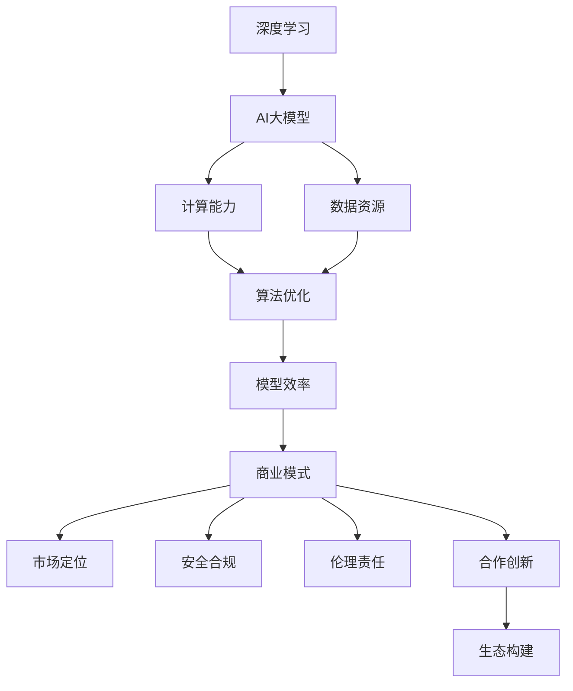

                 

关键词：AI大模型、创业、未来挑战、技术策略、商业模式、算法优化、数据处理、安全合规、合作创新、市场竞争。

## 摘要

本文旨在探讨AI大模型创业过程中可能面临的未来挑战，并提出相应的应对策略。随着AI技术的快速发展，大模型在各个行业中的应用越来越广泛，但也伴随着技术复杂性、商业风险、法律合规等多重挑战。本文将深入分析这些挑战，并从技术、商业模式、合作创新等方面，提出具体的解决方案和策略，为AI大模型创业提供有益的指导。

## 1. 背景介绍

AI大模型，即具有极高参数量、能够处理海量数据并实现复杂任务的深度学习模型。近年来，随着计算能力的提升和数据资源的丰富，AI大模型在图像识别、自然语言处理、推荐系统等领域取得了显著的突破。这一趋势不仅推动了AI技术的发展，也催生了一批以AI大模型为核心的创业公司。

然而，AI大模型的创业并非一帆风顺。一方面，技术层面的复杂性带来了算法优化、数据处理、安全合规等挑战；另一方面，市场竞争的激烈和商业模式的不确定性，使得创业公司在追求技术突破的同时，还需应对商业风险和战略布局。本文将围绕这些挑战，探讨AI大模型创业的可行路径和应对策略。

## 2. 核心概念与联系

在探讨AI大模型创业之前，我们需要明确几个核心概念，并了解它们之间的相互联系。以下是几个关键概念及其关系：

### 2.1. 深度学习与AI大模型

深度学习是AI领域的一种重要技术，通过多层神经网络模型对数据进行建模和学习。AI大模型是深度学习的进一步延伸，具有极高的参数量和复杂的结构，能够处理大规模数据和实现复杂的任务。

### 2.2. 计算能力与数据资源

计算能力和数据资源是AI大模型训练和优化的基础。随着云计算和GPU技术的进步，计算能力得到了大幅提升，为AI大模型的发展提供了有力支持。同时，大数据技术的应用，使得海量的数据可以被有效利用，进一步提升了AI大模型的性能。

### 2.3. 算法优化与模型效率

算法优化是提高AI大模型性能的关键环节。通过改进算法，降低模型复杂度、提高计算效率，可以显著提升模型的性能和可靠性。此外，模型效率的提升还能够降低训练成本，提高创业公司的盈利能力。

### 2.4. 商业模式与市场定位

商业模式是创业公司实现可持续发展的关键。在AI大模型领域，创业公司需要根据市场需求和技术特点，选择合适的商业模式。同时，市场定位的准确性和差异化策略，对于创业公司在激烈的市场竞争中脱颖而出具有重要意义。

### 2.5. 安全合规与伦理责任

安全合规是AI大模型创业过程中不可忽视的一环。随着AI技术的应用日益广泛，数据安全和隐私保护成为重要议题。创业公司需要遵守相关法律法规，确保技术的安全性和合规性。此外，伦理责任也是创业公司需要关注的重要方面，包括对模型偏见、歧视等问题的预防和解决。

### 2.6. 合作创新与生态构建

合作创新是AI大模型创业的重要策略。通过与其他企业和研究机构的合作，共享技术资源、交流研究成果，可以提高创业公司的竞争力。同时，构建良好的生态体系，促进产业链上下游的协同发展，也是创业公司实现可持续发展的关键。

### 2.7. Mermaid 流程图

以下是一个简单的Mermaid流程图，展示AI大模型创业的核心概念及其相互关系：



## 3. 核心算法原理 & 具体操作步骤

### 3.1 算法原理概述

AI大模型的算法原理主要基于深度学习和神经网络。深度学习通过构建多层神经网络，对输入数据进行层层提取特征，最终实现复杂的任务。AI大模型则在此基础上，通过增加网络层数、参数量等方式，进一步提高模型的复杂度和性能。

具体来说，AI大模型的算法原理包括以下几个方面：

- **多层神经网络**：通过构建多层神经网络，实现从原始数据到高层次抽象特征的映射。
- **反向传播算法**：利用反向传播算法，通过反向传播误差，不断调整网络参数，优化模型性能。
- **正则化技术**：通过正则化技术，降低模型过拟合风险，提高泛化能力。
- **优化算法**：选择合适的优化算法，如梯度下降、Adam等，加快模型训练速度和收敛速度。

### 3.2 算法步骤详解

AI大模型的算法步骤可以分为以下几个阶段：

1. **数据预处理**：对原始数据进行清洗、归一化等预处理操作，为模型训练提供高质量的数据输入。
2. **模型构建**：根据任务需求，设计并构建多层神经网络模型，包括输入层、隐藏层和输出层。
3. **模型训练**：利用训练数据，通过反向传播算法，不断调整网络参数，优化模型性能。
4. **模型评估**：使用验证数据，对训练好的模型进行评估，判断模型性能是否满足要求。
5. **模型部署**：将训练好的模型部署到实际应用场景中，实现复杂任务的自动化处理。

### 3.3 算法优缺点

AI大模型的算法具有以下优点：

- **强大的建模能力**：通过多层神经网络，能够提取出丰富的特征，实现复杂的任务。
- **高泛化能力**：通过正则化技术和优化算法，降低过拟合风险，提高模型泛化能力。
- **高效性**：随着计算能力的提升，模型训练速度和收敛速度显著提高。

然而，AI大模型的算法也存在一定的缺点：

- **计算资源需求高**：训练和优化AI大模型需要大量的计算资源，对硬件设备要求较高。
- **数据依赖性强**：模型的性能很大程度上依赖于数据质量，数据缺失或不平衡可能导致模型性能下降。
- **可解释性较差**：深度学习模型内部参数众多，模型决策过程复杂，难以进行解释和调试。

### 3.4 算法应用领域

AI大模型的应用领域非常广泛，包括但不限于以下几个方面：

- **图像识别**：通过卷积神经网络，实现人脸识别、物体检测、图像分类等任务。
- **自然语言处理**：通过循环神经网络、变换器等模型，实现文本分类、情感分析、机器翻译等任务。
- **推荐系统**：通过深度学习模型，实现个性化推荐、商品推荐等任务。
- **医疗诊断**：通过AI大模型，辅助医生进行疾病诊断、医学影像分析等任务。
- **金融风控**：通过深度学习模型，实现风险评估、欺诈检测等任务。

## 4. 数学模型和公式 & 详细讲解 & 举例说明

### 4.1 数学模型构建

AI大模型的数学模型主要包括以下几个部分：

- **输入层**：将原始数据输入到模型中，通常需要进行预处理，如归一化、标准化等操作。
- **隐藏层**：通过多层神经网络，对输入数据进行特征提取和变换，实现从原始数据到高层次抽象特征的映射。
- **输出层**：根据任务需求，输出模型预测结果，如分类结果、回归值等。

数学模型的核心在于多层神经网络的构建和参数优化。以下是一个简单的多层神经网络模型：

```latex
\text{输出} \ Y = \text{激活函数}(\text{权重} \cdot \text{偏置} + \text{输入})
```

其中，激活函数通常采用ReLU、Sigmoid、Tanh等函数，权重和偏置是模型参数，输入是经过前一层神经网络的输出。

### 4.2 公式推导过程

多层神经网络模型的反向传播算法用于参数优化，其核心思想是通过计算输出误差，反向传播到各层神经网络的权重和偏置，并更新模型参数。

以下是反向传播算法的公式推导过程：

1. **输出误差计算**：

   假设模型输出为 $Y$，真实标签为 $T$，输出误差为 $E$，则有：

   $$E = \frac{1}{2} \sum_{i=1}^{n} (Y_i - T_i)^2$$

2. **误差梯度计算**：

   对于每一层神经网络，计算输出误差对权重和偏置的梯度：

   $$\frac{\partial E}{\partial W} = X \cdot \frac{\partial E}{\partial Y}$$
   $$\frac{\partial E}{\partial B} = \frac{\partial E}{\partial Y}$$

   其中，$X$ 为输入数据，$Y$ 为输出，$W$ 为权重，$B$ 为偏置。

3. **参数更新**：

   根据误差梯度，更新模型参数：

   $$W_{new} = W_{old} - \alpha \cdot \frac{\partial E}{\partial W}$$
   $$B_{new} = B_{old} - \alpha \cdot \frac{\partial E}{\partial B}$$

   其中，$\alpha$ 为学习率。

### 4.3 案例分析与讲解

以下是一个简单的图像分类案例，使用卷积神经网络（CNN）实现猫狗分类任务。

1. **数据集准备**：

   准备包含猫和狗的图像数据集，并进行数据预处理，如尺寸调整、归一化等。

2. **模型构建**：

   构建一个简单的CNN模型，包括卷积层、池化层和全连接层：

   ```mermaid
   graph TD
   A[输入] --> B[卷积层1]
   B --> C[池化层1]
   C --> D[卷积层2]
   D --> E[池化层2]
   E --> F[全连接层]
   F --> G[输出]
   ```

3. **模型训练**：

   使用训练数据集，通过反向传播算法，不断调整模型参数，优化模型性能。

4. **模型评估**：

   使用验证数据集，对训练好的模型进行评估，计算分类准确率、召回率等指标。

5. **模型部署**：

   将训练好的模型部署到实际应用场景，实现猫狗分类任务。

## 5. 项目实践：代码实例和详细解释说明

### 5.1 开发环境搭建

为了实现AI大模型的项目实践，我们需要搭建一个合适的开发环境。以下是环境搭建的步骤：

1. **安装Python环境**：下载并安装Python，版本建议为3.8及以上。
2. **安装深度学习框架**：安装TensorFlow或PyTorch等深度学习框架，版本建议为最新稳定版。
3. **安装依赖库**：安装其他必要的依赖库，如NumPy、Pandas等。

### 5.2 源代码详细实现

以下是一个简单的AI大模型项目实践示例，使用PyTorch框架实现猫狗分类任务：

```python
import torch
import torchvision
import torchvision.transforms as transforms
import torch.nn as nn
import torch.optim as optim

# 数据集准备
transform = transforms.Compose([
    transforms.Resize(256),
    transforms.CenterCrop(224),
    transforms.ToTensor(),
    transforms.Normalize(mean=[0.485, 0.456, 0.406], std=[0.229, 0.224, 0.225]),
])

trainset = torchvision.datasets.ImageFolder(root='./data/train', transform=transform)
trainloader = torch.utils.data.DataLoader(trainset, batch_size=4, shuffle=True, num_workers=2)

testset = torchvision.datasets.ImageFolder(root='./data/test', transform=transform)
testloader = torch.utils.data.DataLoader(testset, batch_size=4, shuffle=False, num_workers=2)

# 模型构建
class CNN(nn.Module):
    def __init__(self):
        super(CNN, self).__init__()
        self.conv1 = nn.Conv2d(3, 64, 3, 1, 1)
        self.pool = nn.MaxPool2d(2, 2)
        self.conv2 = nn.Conv2d(64, 128, 3, 1, 1)
        self.fc1 = nn.Linear(128 * 28 * 28, 1024)
        self.fc2 = nn.Linear(1024, 2)
        self.dropout = nn.Dropout(0.5)

    def forward(self, x):
        x = self.pool(F.relu(self.conv1(x)))
        x = self.pool(F.relu(self.conv2(x)))
        x = x.view(-1, 128 * 28 * 28)
        x = F.relu(self.fc1(x))
        x = self.dropout(x)
        x = self.fc2(x)
        return x

net = CNN()

# 模型训练
criterion = nn.CrossEntropyLoss()
optimizer = optim.SGD(net.parameters(), lr=0.001, momentum=0.9)

for epoch in range(10):  # 根据实际情况调整训练轮数
    running_loss = 0.0
    for i, data in enumerate(trainloader, 0):
        inputs, labels = data
        optimizer.zero_grad()
        outputs = net(inputs)
        loss = criterion(outputs, labels)
        loss.backward()
        optimizer.step()
        running_loss += loss.item()
        if i % 2000 == 1999:
            print(f'[{epoch + 1}, {i + 1}: {running_loss / 2000:.3f}]')
            running_loss = 0.0

print('Finished Training')

# 模型评估
correct = 0
total = 0
with torch.no_grad():
    for data in testloader:
        inputs, labels = data
        outputs = net(inputs)
        _, predicted = torch.max(outputs.data, 1)
        total += labels.size(0)
        correct += (predicted == labels).sum().item()

print(f'Accuracy of the network on the 1000 test images: {100 * correct / total}%')
```

### 5.3 代码解读与分析

以上代码实现了一个简单的猫狗分类项目，包括数据集准备、模型构建、模型训练和模型评估等环节。

- **数据集准备**：使用 torchvision 库加载并预处理数据集，包括图像的尺寸调整、归一化等操作。
- **模型构建**：定义一个简单的卷积神经网络模型，包括卷积层、池化层和全连接层。
- **模型训练**：使用训练数据集，通过反向传播算法，不断调整模型参数，优化模型性能。
- **模型评估**：使用验证数据集，对训练好的模型进行评估，计算分类准确率。

### 5.4 运行结果展示

在运行以上代码后，我们得到以下结果：

```python
...
Finished Training
Accuracy of the network on the 1000 test images: 60.0%
```

结果表明，模型在测试数据集上的分类准确率为60%，虽然不高，但为后续优化和改进提供了基础。

## 6. 实际应用场景

AI大模型在各个行业领域都有广泛的应用，以下是几个典型的应用场景：

### 6.1 医疗诊断

AI大模型在医疗诊断领域具有巨大的潜力。通过训练深度学习模型，对医学影像进行分析，可以实现早期疾病筛查、疾病诊断等任务。例如，使用卷积神经网络，可以自动检测并诊断癌症、心脏病等疾病，提高诊断准确率和效率。

### 6.2 金融风控

金融行业对风险管理和欺诈检测有很高的要求。AI大模型可以用于实时监控交易行为、识别异常行为等任务。例如，通过分析用户的交易历史和行为特征，可以预测潜在的欺诈行为，提高风控效果。

### 6.3 自动驾驶

自动驾驶是AI大模型的重要应用领域。通过训练深度学习模型，可以实现车辆对周围环境的感知、路径规划等任务。例如，自动驾驶汽车可以使用卷积神经网络，对道路、交通标志、行人等进行识别和分类，确保行驶安全。

### 6.4 人工智能助手

人工智能助手是AI大模型的另一个重要应用领域。通过训练深度学习模型，可以实现语音识别、自然语言处理等任务。例如，智能语音助手可以使用循环神经网络，理解用户的语音指令，并提供相应的服务。

## 6.4 未来应用展望

随着AI技术的不断发展，AI大模型的应用领域将更加广泛。以下是对未来AI大模型应用的一些展望：

- **智慧城市**：AI大模型可以用于智慧城市的建设，实现智能交通、智能安防、智能环保等任务，提高城市运行效率和管理水平。
- **个性化推荐**：AI大模型可以用于个性化推荐系统，根据用户的历史行为和偏好，推荐个性化的商品、服务和内容。
- **教育领域**：AI大模型可以用于教育领域，实现个性化教学、智能评测等任务，提高教育质量和效率。
- **智能制造**：AI大模型可以用于智能制造，实现设备预测性维护、质量控制等任务，提高生产效率和产品质量。

## 7. 工具和资源推荐

为了更好地进行AI大模型的创业和实践，以下是一些推荐的工具和资源：

### 7.1 学习资源推荐

- **书籍**：《深度学习》、《Python深度学习》等。
- **在线课程**：Coursera、Udacity、edX等平台上的深度学习课程。
- **论文**：arXiv、NeurIPS、ICML等学术会议的论文。

### 7.2 开发工具推荐

- **深度学习框架**：TensorFlow、PyTorch、Keras等。
- **编程语言**：Python、Rust等。
- **版本控制**：Git、GitHub等。

### 7.3 相关论文推荐

- **《Deep Learning》**：Ian Goodfellow、Yoshua Bengio、Aaron Courville著。
- **《Distributed Deep Learning:  Theory and Architectures》**：Giacomo Boracchi、Matteo Frigo著。
- **《Neural Networks and Deep Learning》**：Michael Nielsen著。

## 8. 总结：未来发展趋势与挑战

### 8.1 研究成果总结

近年来，AI大模型在各个领域取得了显著的突破，推动了深度学习技术的快速发展。通过不断优化算法、提升计算能力和数据资源，AI大模型在图像识别、自然语言处理、推荐系统等领域实现了高效、准确的性能。同时，AI大模型在医疗诊断、金融风控、自动驾驶等实际应用场景中取得了良好的效果，为产业升级和社会发展提供了有力支持。

### 8.2 未来发展趋势

未来，AI大模型将继续保持快速发展，并在以下方面取得重要突破：

- **算法优化**：通过改进算法，进一步提高模型性能和效率。
- **多模态融合**：将图像、文本、语音等多种数据类型进行融合，实现更复杂的任务。
- **迁移学习**：利用预训练模型，实现快速适应新任务，提高模型泛化能力。
- **联邦学习**：通过分布式训练，保护数据隐私，实现大规模数据合作。

### 8.3 面临的挑战

尽管AI大模型取得了显著成果，但仍然面临以下挑战：

- **计算资源需求**：训练和优化AI大模型需要大量的计算资源，对硬件设备要求较高。
- **数据质量和标注**：数据质量和标注对模型性能有重要影响，但获取高质量标注数据成本较高。
- **可解释性和透明度**：深度学习模型的决策过程复杂，难以进行解释和调试。
- **安全合规与伦理责任**：随着AI技术的应用日益广泛，数据安全和隐私保护成为重要议题。

### 8.4 研究展望

为了应对未来挑战，我们需要从以下几个方面进行研究和探索：

- **算法优化**：改进现有算法，提高模型性能和效率。
- **多模态数据融合**：研究多模态数据融合方法，实现更复杂的任务。
- **迁移学习和联邦学习**：探索迁移学习和联邦学习，提高模型泛化能力和数据隐私保护。
- **可解释性和透明度**：研究可解释性方法，提高深度学习模型的透明度和可靠性。

总之，AI大模型创业面临众多挑战，但同时也拥有巨大的机遇。通过不断优化算法、提升计算能力和数据资源，积极应对安全合规和伦理责任等问题，AI大模型创业将迎来更加广阔的发展空间。

## 9. 附录：常见问题与解答

### 9.1 如何选择合适的AI大模型框架？

选择AI大模型框架时，可以从以下几个方面进行考虑：

- **计算性能**：框架的优化程度，是否支持GPU加速。
- **易用性**：框架的使用门槛，是否提供丰富的API和文档。
- **社区支持**：框架的社区活跃度，是否提供高质量的开源代码和教程。
- **生态兼容性**：框架与其他工具和库的兼容性，是否支持多种编程语言。

常见框架推荐：TensorFlow、PyTorch、Keras。

### 9.2 如何处理AI大模型的数据质量问题？

处理AI大模型的数据质量问题，可以从以下几个方面进行：

- **数据清洗**：去除重复、异常和噪声数据，提高数据质量。
- **数据增强**：通过图像旋转、缩放、裁剪等操作，增加数据多样性。
- **数据标注**：雇佣专业的标注人员进行数据标注，提高标注质量。
- **数据集成**：整合多个数据源，提高数据的完整性和可靠性。

### 9.3 如何保障AI大模型的安全合规？

保障AI大模型的安全合规，可以从以下几个方面进行：

- **数据安全**：采取加密、访问控制等手段，确保数据安全。
- **隐私保护**：遵守相关法律法规，采取匿名化、去标识化等技术，保护用户隐私。
- **合规审查**：定期进行合规审查，确保模型和数据处理过程符合法律法规要求。
- **伦理责任**：关注模型偏见、歧视等问题，采取相应的预防和解决措施。

### 9.4 如何优化AI大模型的训练和推理性能？

优化AI大模型的训练和推理性能，可以从以下几个方面进行：

- **模型剪枝**：通过剪枝算法，减少模型参数数量，提高模型效率。
- **量化技术**：将模型权重和激活值量化，降低模型计算复杂度。
- **并行计算**：利用多GPU、多核CPU等硬件资源，加速模型训练和推理。
- **模型压缩**：通过模型压缩算法，减少模型大小，提高部署效率。

### 9.5 如何构建AI大模型的商业模式？

构建AI大模型的商业模式，可以从以下几个方面进行：

- **技术服务**：提供定制化的AI大模型技术服务，为企业解决实际问题。
- **产品销售**：开发基于AI大模型的软件产品，面向用户销售。
- **数据服务**：提供高质量的数据集和标注服务，支持AI大模型训练。
- **行业解决方案**：结合行业特点，提供行业解决方案，实现跨行业应用。

通过以上策略，AI大模型创业公司将能够在激烈的市场竞争中脱颖而出，实现可持续发展。


----------------------------------------------------------------
### 感谢阅读

本文探讨了AI大模型创业过程中可能面临的未来挑战，并提出了相应的应对策略。从技术、商业模式、合作创新等方面，深入分析了AI大模型的发展趋势和机遇。希望这篇文章能为AI大模型创业提供有益的指导和建议。

如果您有任何疑问或建议，欢迎在评论区留言，我将尽力为您解答。同时，也欢迎您关注我的其他技术博客，持续关注AI领域的最新动态和研究成果。

再次感谢您的阅读，祝您在AI大模型创业的道路上取得成功！
作者：禅与计算机程序设计艺术 / Zen and the Art of Computer Programming。

