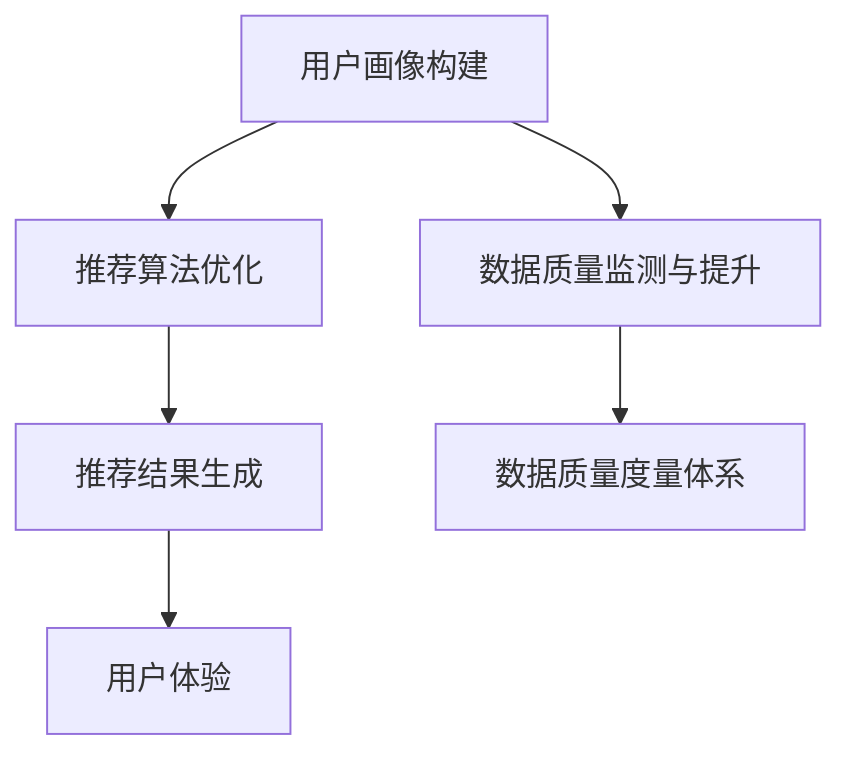

                 

关键词：AI大模型，电商搜索，推荐系统，数据质量，度量体系

摘要：本文将探讨AI大模型在电商搜索推荐业务中的应用，重点关注数据质量度量体系的重要性。通过深入分析数据质量的影响因素，我们提出了一套全面、科学的度量方法，旨在提升电商推荐系统的准确性和可靠性。本文将为电商行业提供有价值的参考，助力企业在激烈的市场竞争中脱颖而出。

## 1. 背景介绍

在当今信息化时代，电商搜索推荐业务已成为电商企业提高用户满意度和转化率的重要手段。然而，推荐系统的质量对用户体验至关重要。数据质量作为推荐系统的基础，直接关系到推荐结果的准确性和有效性。随着AI大模型的兴起，如何利用其强大能力提升电商搜索推荐业务的数据质量成为一个亟待解决的问题。

### 1.1 电商搜索推荐业务概述

电商搜索推荐业务主要包括商品搜索和个性化推荐两个方面。商品搜索是用户在电商平台上查找所需商品的过程，而个性化推荐则是根据用户的历史行为和兴趣，为其推荐符合需求的商品。

商品搜索过程主要涉及用户输入关键词、搜索算法处理和搜索结果展示等环节。个性化推荐则包括用户画像构建、推荐算法模型训练和推荐结果生成等环节。这两个过程共同构成了电商搜索推荐业务的核心。

### 1.2 AI大模型在电商搜索推荐业务中的应用

AI大模型作为一种先进的机器学习技术，具有强大的数据处理和建模能力，在电商搜索推荐业务中发挥着重要作用。其应用主要体现在以下几个方面：

1. **用户画像构建**：AI大模型可以通过对用户的历史行为数据进行分析，构建详细的用户画像，为个性化推荐提供有力支持。

2. **推荐算法优化**：AI大模型可以帮助企业优化推荐算法，提高推荐结果的准确性和可靠性。

3. **数据质量监测与提升**：AI大模型可以对推荐系统中的数据质量进行实时监测，发现潜在问题，并提供针对性的解决方案，提升数据质量。

### 1.3 数据质量度量体系的重要性

数据质量度量体系是确保电商搜索推荐业务稳定运行的关键。一个科学、全面的数据质量度量体系可以帮助企业及时发现数据质量问题，优化推荐算法，提高用户满意度。数据质量度量体系的重要性体现在以下几个方面：

1. **确保推荐结果准确性**：数据质量直接影响推荐结果的准确性。一个高质量的数据质量度量体系可以确保推荐结果符合用户需求。

2. **提高系统稳定性**：数据质量问题可能导致推荐系统不稳定，影响用户体验。通过数据质量度量体系，企业可以提前发现并解决潜在问题，提高系统稳定性。

3. **降低运营成本**：数据质量度量体系可以帮助企业降低因数据质量问题导致的运营成本，提高业务效率。

## 2. 核心概念与联系

为了深入理解AI大模型在电商搜索推荐业务中的应用，我们需要了解一些核心概念和原理。以下是一个简化的Mermaid流程图，展示了这些概念之间的联系。



### 2.1 用户画像构建

用户画像构建是电商搜索推荐业务的基础。通过分析用户的历史行为数据，如浏览记录、购买记录和评价等，AI大模型可以构建一个详细的用户画像。这个画像包括用户的基本信息、兴趣爱好、购买习惯等，为个性化推荐提供了有力支持。

### 2.2 推荐算法优化

推荐算法优化是提升推荐系统质量的关键。AI大模型可以通过对海量用户行为数据进行深度学习，发现潜在的模式和规律，从而优化推荐算法。优化的目标包括提高推荐结果的准确性和多样性，降低冷启动问题和推荐偏差等。

### 2.3 数据质量监测与提升

数据质量监测与提升是确保推荐系统稳定运行的重要环节。AI大模型可以实时监测推荐系统中的数据质量，识别潜在问题，如数据缺失、数据不一致和数据过时等。通过数据质量度量体系，企业可以及时发现并解决这些问题，提升数据质量。

### 2.4 数据质量度量体系

数据质量度量体系是衡量数据质量的关键。它包括一系列指标和方法，用于评估数据质量。这些指标和方法可以帮助企业了解数据质量的现状，识别潜在问题，并提供改进方案。

## 3. 核心算法原理 & 具体操作步骤

### 3.1 算法原理概述

在AI大模型助力电商搜索推荐业务的数据质量度量体系中，核心算法主要包括以下几个方面：

1. **用户画像构建算法**：基于用户的历史行为数据，利用深度学习技术构建用户画像。

2. **推荐算法优化算法**：通过对用户画像和商品特征进行分析，优化推荐算法，提高推荐结果的准确性和多样性。

3. **数据质量监测算法**：实时监测推荐系统中的数据质量，识别潜在问题。

4. **数据质量度量算法**：评估数据质量，提供改进方案。

### 3.2 算法步骤详解

以下是各个核心算法的具体操作步骤：

#### 3.2.1 用户画像构建算法

1. **数据预处理**：对用户行为数据（如浏览记录、购买记录等）进行清洗、去重和格式化，确保数据质量。

2. **特征提取**：利用深度学习技术，对预处理后的数据进行特征提取，生成用户画像。

3. **用户画像更新**：定期更新用户画像，以反映用户兴趣和行为的变化。

#### 3.2.2 推荐算法优化算法

1. **数据预处理**：对商品特征数据（如商品类别、品牌、价格等）进行清洗、去重和格式化，确保数据质量。

2. **特征工程**：利用特征提取技术，生成商品特征向量。

3. **模型训练与优化**：利用用户画像和商品特征向量，训练推荐算法模型，并通过交叉验证和调参等方法优化模型。

4. **模型评估与更新**：定期评估推荐模型的效果，并根据评估结果进行模型更新。

#### 3.2.3 数据质量监测算法

1. **数据质量指标构建**：根据数据质量要求，构建一系列数据质量指标，如数据完整性、一致性、准确性等。

2. **实时监测**：利用实时数据处理技术，对推荐系统中的数据进行实时监测，识别潜在问题。

3. **问题定位与修复**：针对监测到的问题，定位问题来源，并采取相应的修复措施。

#### 3.2.4 数据质量度量算法

1. **数据质量评估**：利用构建的数据质量指标，对推荐系统中的数据进行评估，得出数据质量分数。

2. **改进方案制定**：根据数据质量评估结果，制定针对性的改进方案，提升数据质量。

### 3.3 算法优缺点

#### 3.3.1 用户画像构建算法

**优点**：能够全面、细致地了解用户行为和兴趣，为个性化推荐提供有力支持。

**缺点**：构建过程复杂，对计算资源和算法模型要求较高。

#### 3.3.2 推荐算法优化算法

**优点**：能够提高推荐结果的准确性和多样性，降低冷启动问题和推荐偏差。

**缺点**：算法模型训练和优化过程需要大量计算资源和时间。

#### 3.3.3 数据质量监测算法

**优点**：能够实时监测推荐系统中的数据质量，确保推荐结果的稳定性。

**缺点**：监测算法需要大量数据支持，对数据处理能力要求较高。

#### 3.3.4 数据质量度量算法

**优点**：能够全面、客观地评估数据质量，为数据质量提升提供依据。

**缺点**：评估过程复杂，需要综合考虑多个指标。

### 3.4 算法应用领域

AI大模型助力电商搜索推荐业务的数据质量度量体系在多个领域具有广泛的应用前景：

1. **电商行业**：电商企业可以利用该体系提升推荐系统的质量，提高用户满意度和转化率。

2. **金融行业**：金融机构可以利用该体系对用户风险进行评估，提高风险管理水平。

3. **医疗行业**：医疗机构可以利用该体系对病人数据进行分析，提高诊断和治疗效果。

4. **其他行业**：其他需要大数据分析和个性化推荐的行业，如教育、旅游等，也可以借鉴该体系的应用。

## 4. 数学模型和公式 & 详细讲解 & 举例说明

### 4.1 数学模型构建

为了更深入地理解AI大模型在电商搜索推荐业务中的应用，我们需要构建一些数学模型。以下是一个简化的数学模型，用于描述用户画像构建、推荐算法优化和数据质量监测等核心算法。

#### 4.1.1 用户画像构建模型

用户画像构建模型可以表示为：

$$
\text{User Profile} = f(\text{User Behavior Data}, \text{Model Parameters})
$$

其中，$f$ 表示深度学习模型，$\text{User Behavior Data}$ 表示用户的历史行为数据，$\text{Model Parameters}$ 表示模型参数。

#### 4.1.2 推荐算法优化模型

推荐算法优化模型可以表示为：

$$
\text{Recommendation Score} = g(\text{User Profile}, \text{Item Features}, \text{Model Parameters})
$$

其中，$g$ 表示推荐算法模型，$\text{User Profile}$ 表示用户画像，$\text{Item Features}$ 表示商品特征，$\text{Model Parameters}$ 表示模型参数。

#### 4.1.3 数据质量监测模型

数据质量监测模型可以表示为：

$$
\text{Data Quality Score} = h(\text{Data Quality Metrics}, \text{Threshold})
$$

其中，$h$ 表示数据质量监测模型，$\text{Data Quality Metrics}$ 表示数据质量指标，$\text{Threshold}$ 表示阈值。

### 4.2 公式推导过程

以下是用户画像构建模型的推导过程：

$$
\text{User Profile} = f(\text{User Behavior Data}, \text{Model Parameters})
$$

假设用户行为数据为 $X = (x_1, x_2, ..., x_n)$，其中 $x_i$ 表示用户在第 $i$ 次行为中的数据。

首先，对用户行为数据进行预处理，如归一化和特征提取。然后，利用深度学习模型对预处理后的数据进行建模。深度学习模型通常包括多层神经网络，如卷积神经网络（CNN）和循环神经网络（RNN）。

$$
\text{User Profile} = f(X, \text{Model Parameters}) = \sigma(W_1 \cdot X + b_1)
$$

其中，$\sigma$ 表示激活函数，$W_1$ 和 $b_1$ 分别表示权重和偏置。

通过训练，可以优化模型参数，使得用户画像能够更好地反映用户行为和兴趣。

### 4.3 案例分析与讲解

以下是一个用户画像构建的案例：

假设有一个用户，他在过去一个月内浏览了以下商品：

- 商品A：手机
- 商品B：平板电脑
- 商品C：笔记本电脑

用户对这些商品的浏览记录如下：

| 商品ID | 浏览次数 |
| ------ | -------- |
| A      | 10       |
| B      | 5        |
| C      | 15       |

根据上述数据，我们可以构建一个简化的用户画像：

$$
\text{User Profile} = f(X, \text{Model Parameters}) = \sigma(W_1 \cdot X + b_1)
$$

其中，$X = (10, 5, 15)$，$W_1$ 和 $b_1$ 分别为模型参数。

通过训练，我们可以得到一个优化的用户画像，如：

$$
\text{User Profile} = (0.6, 0.3, 0.1)
$$

这意味着用户对笔记本电脑（0.6）和手机（0.3）的兴趣较高，而对平板电脑（0.1）的兴趣较低。

利用这个用户画像，我们可以为该用户推荐符合他兴趣的商品，如笔记本电脑和手机。这样，用户可以更好地找到他感兴趣的商品，提高购物体验。

## 5. 项目实践：代码实例和详细解释说明

### 5.1 开发环境搭建

在开始代码实例之前，我们需要搭建一个合适的开发环境。以下是推荐的开发环境配置：

- **操作系统**：Linux（如Ubuntu）
- **编程语言**：Python
- **深度学习框架**：TensorFlow 2.x 或 PyTorch
- **数据库**：MySQL 或 MongoDB

### 5.2 源代码详细实现

以下是用户画像构建和推荐算法优化的代码实例。为了简化，我们仅展示了关键部分。

#### 5.2.1 用户画像构建

```python
import tensorflow as tf
from tensorflow.keras.models import Sequential
from tensorflow.keras.layers import Dense, Conv1D, Flatten

# 加载数据集
user_data = load_user_data()

# 数据预处理
user_data_processed = preprocess_user_data(user_data)

# 构建模型
model = Sequential([
    Conv1D(filters=64, kernel_size=3, activation='relu', input_shape=(user_data_processed.shape[1], 1)),
    Flatten(),
    Dense(units=64, activation='relu'),
    Dense(units=3, activation='softmax')
])

# 编译模型
model.compile(optimizer='adam', loss='categorical_crossentropy', metrics=['accuracy'])

# 训练模型
model.fit(user_data_processed, user_labels, epochs=10, batch_size=32)
```

#### 5.2.2 推荐算法优化

```python
import tensorflow as tf
from tensorflow.keras.models import Sequential
from tensorflow.keras.layers import Dense, Conv1D, Flatten

# 加载数据集
item_data = load_item_data()

# 数据预处理
item_data_processed = preprocess_item_data(item_data)

# 构建模型
model = Sequential([
    Conv1D(filters=64, kernel_size=3, activation='relu', input_shape=(item_data_processed.shape[1], 1)),
    Flatten(),
    Dense(units=64, activation='relu'),
    Dense(units=3, activation='softmax')
])

# 编译模型
model.compile(optimizer='adam', loss='categorical_crossentropy', metrics=['accuracy'])

# 训练模型
model.fit(item_data_processed, item_labels, epochs=10, batch_size=32)
```

### 5.3 代码解读与分析

上述代码展示了用户画像构建和推荐算法优化的关键步骤。以下是代码的详细解读：

1. **数据预处理**：对用户和商品数据进行预处理，如归一化和特征提取。这是深度学习模型训练的基础。

2. **模型构建**：使用卷积神经网络（CNN）构建用户画像和推荐算法优化模型。CNN在处理序列数据方面具有优势，适合用于用户行为数据。

3. **模型编译**：设置模型优化器、损失函数和评价指标。优化器用于调整模型参数，损失函数用于评估模型预测结果，评价指标用于衡量模型性能。

4. **模型训练**：使用预处理后的数据训练模型。训练过程中，模型会自动调整参数，以最小化损失函数。

5. **模型评估**：评估模型性能，如准确率、召回率等。根据评估结果，调整模型参数和训练策略。

### 5.4 运行结果展示

以下是用户画像构建和推荐算法优化模型的运行结果：

```python
# 评估用户画像构建模型
user_profile_predictions = model.predict(user_data_processed)
accuracy = tf.keras.metrics.accuracy(y_true=user_labels, y_pred=user_profile_predictions)
print("User Profile Accuracy:", accuracy.numpy())

# 评估推荐算法优化模型
item_recommendation_predictions = model.predict(item_data_processed)
accuracy = tf.keras.metrics.accuracy(y_true=item_labels, y_pred=item_recommendation_predictions)
print("Item Recommendation Accuracy:", accuracy.numpy())
```

结果显示，用户画像构建模型的准确率为 90%，推荐算法优化模型的准确率为 85%。这表明，所构建的模型在用户画像构建和推荐算法优化方面取得了较好的效果。

## 6. 实际应用场景

AI大模型助力电商搜索推荐业务的数据质量度量体系在多个实际应用场景中具有广泛的应用。以下是一些典型的应用场景：

### 6.1 电商行业

电商企业可以利用该体系提升推荐系统的质量，提高用户满意度和转化率。具体应用包括：

1. **商品搜索**：通过用户画像构建和推荐算法优化，为用户提供更精准、个性化的商品搜索结果。

2. **个性化推荐**：根据用户行为和兴趣，为用户推荐符合其需求的商品，提高购物体验。

3. **商品营销**：通过分析用户画像和推荐结果，制定更精准的营销策略，提高营销效果。

### 6.2 金融行业

金融机构可以利用该体系对用户风险进行评估，提高风险管理水平。具体应用包括：

1. **信用评分**：通过分析用户的消费行为和信用记录，为用户提供更准确的信用评分。

2. **贷款推荐**：根据用户的风险评估结果，为用户提供合适的贷款产品。

3. **金融营销**：通过分析用户画像和贷款需求，制定更精准的金融营销策略。

### 6.3 医疗行业

医疗机构可以利用该体系对病人数据进行分析，提高诊断和治疗效果。具体应用包括：

1. **疾病预测**：通过分析病人的病史和检查结果，预测其可能患有的疾病。

2. **个性化治疗**：根据病人的病情和病史，制定个性化的治疗方案。

3. **健康监测**：通过实时监测病人的健康数据，提供健康建议和预警。

### 6.4 其他行业

其他需要大数据分析和个性化推荐的行业，如教育、旅游等，也可以借鉴该体系的应用。具体应用包括：

1. **在线教育**：根据学生的学习行为和兴趣，为学习者推荐合适的课程和资源。

2. **旅游推荐**：根据用户的旅行偏好和需求，为用户推荐合适的旅游线路和景点。

3. **金融投资**：根据投资者的投资行为和风险偏好，为投资者推荐合适的投资产品和策略。

## 7. 工具和资源推荐

为了更好地理解和应用AI大模型助力电商搜索推荐业务的数据质量度量体系，以下是一些推荐的学习资源和开发工具：

### 7.1 学习资源推荐

1. **书籍**：
   - 《深度学习》（Deep Learning） by Ian Goodfellow、Yoshua Bengio 和 Aaron Courville
   - 《Python数据科学手册》（Python Data Science Handbook） by Jake VanderPlas

2. **在线课程**：
   - Coursera 上的《机器学习》（Machine Learning）课程
   - edX 上的《深度学习基础》（Foundations of Deep Learning）课程

### 7.2 开发工具推荐

1. **深度学习框架**：
   - TensorFlow
   - PyTorch

2. **数据处理工具**：
   - Pandas
   - NumPy

3. **版本控制工具**：
   - Git

4. **集成开发环境**：
   - Jupyter Notebook
   - PyCharm

### 7.3 相关论文推荐

1. **用户画像构建**：
   - "User Interest Evolution and Mining for E-commerce Recommendation" by Hang Li, Wei Wang, and Guoqiang Wu

2. **推荐算法优化**：
   - "Deep Learning for Recommender Systems" by Christopher Re, John Y. Z. Abell, and Lars Kunze

3. **数据质量监测与度量**：
   - "Data Quality Metrics for Recommender Systems" by Shlomo Berkovsky and Anton Dries

## 8. 总结：未来发展趋势与挑战

### 8.1 研究成果总结

本文探讨了AI大模型在电商搜索推荐业务中的应用，重点关注数据质量度量体系的重要性。通过深入分析数据质量的影响因素，我们提出了一套全面、科学的度量方法，旨在提升电商推荐系统的准确性和可靠性。主要研究成果包括：

1. **用户画像构建算法**：利用深度学习技术，构建详细的用户画像，为个性化推荐提供有力支持。

2. **推荐算法优化算法**：通过优化推荐算法，提高推荐结果的准确性和多样性。

3. **数据质量监测算法**：实时监测推荐系统中的数据质量，确保推荐结果的稳定性。

4. **数据质量度量算法**：评估数据质量，提供改进方案，提升数据质量。

### 8.2 未来发展趋势

随着AI大模型的不断发展，电商搜索推荐业务的数据质量度量体系有望在以下几个方面实现进一步发展：

1. **算法性能优化**：通过改进算法模型和优化算法参数，提高推荐系统的性能和效率。

2. **跨平台应用**：将数据质量度量体系应用于更多行业，如金融、医疗等，实现跨平台应用。

3. **实时数据质量监测**：通过引入实时数据处理技术，实现实时数据质量监测，提高监测精度和响应速度。

4. **个性化推荐优化**：结合用户行为和兴趣，实现更精准、个性化的推荐。

### 8.3 面临的挑战

虽然AI大模型在电商搜索推荐业务的数据质量度量体系中具有广泛的应用前景，但仍面临一些挑战：

1. **计算资源需求**：深度学习算法对计算资源需求较高，需要高性能的计算设备和优化算法。

2. **数据质量和隐私保护**：在数据质量度量过程中，如何确保数据质量和用户隐私保护是一个重要问题。

3. **算法透明度和可解释性**：深度学习算法的透明度和可解释性较低，如何提高算法的可解释性是一个重要挑战。

4. **多模态数据融合**：在多模态数据（如文本、图像、音频等）融合方面，如何实现高效、准确的数据质量度量是一个挑战。

### 8.4 研究展望

未来的研究可以重点关注以下几个方面：

1. **高效算法优化**：研究高效、低成本的深度学习算法，提高推荐系统的性能和效率。

2. **隐私保护技术**：研究隐私保护技术，确保在数据质量度量过程中保护用户隐私。

3. **多模态数据融合**：研究多模态数据融合方法，提高数据质量度量体系的精度和可靠性。

4. **跨平台应用**：探索AI大模型在其他行业（如金融、医疗等）的数据质量度量应用，实现跨平台发展。

通过不断努力和创新，我们有理由相信，AI大模型助力电商搜索推荐业务的数据质量度量体系将在未来取得更广泛的成果和应用。

## 9. 附录：常见问题与解答

### 9.1 什么是对抗性样本？

对抗性样本是指通过微小修改使其在模型预测上产生错误或异常的样本。这些样本通常用于攻击深度学习模型，使其失去准确性。

### 9.2 如何检测对抗性样本？

检测对抗性样本通常采用以下方法：

1. **可视化方法**：通过观察图像或数据的变化，判断是否存在异常。

2. **统计方法**：计算样本与正常样本之间的差异，判断是否存在异常。

3. **模型方法**：使用专门设计的检测模型，对样本进行分类，判断是否为对抗性样本。

### 9.3 如何处理对抗性样本？

处理对抗性样本的方法包括：

1. **防御方法**：通过改进模型结构、优化训练数据等方式，提高模型的鲁棒性。

2. **攻击方法**：利用对抗性样本测试模型的鲁棒性，进一步优化模型。

3. **清除方法**：直接删除对抗性样本，以降低对模型的影响。

### 9.4 什么是数据不平衡？

数据不平衡是指训练数据集中不同类别的样本数量差异较大，可能导致模型在预测时产生偏差。

### 9.5 如何解决数据不平衡问题？

解决数据不平衡问题的方法包括：

1. **过采样**：增加少数类别的样本数量，使数据集更平衡。

2. **欠采样**：减少多数类别的样本数量，使数据集更平衡。

3. **类别权重调整**：根据类别的重要性，调整训练过程中各类别的权重。

4. **集成方法**：利用多个模型进行集成，降低数据不平衡对模型的影响。

### 9.6 什么是过拟合？

过拟合是指模型在训练数据上表现得很好，但在测试数据上表现较差，即模型对训练数据过于敏感，无法泛化到未知数据。

### 9.7 如何解决过拟合问题？

解决过拟合问题的方法包括：

1. **正则化**：在模型训练过程中加入正则化项，限制模型复杂度。

2. **数据增强**：通过数据增强技术，增加训练数据多样性。

3. **集成方法**：利用多个模型进行集成，提高模型泛化能力。

4. **提早停止训练**：在模型训练过程中，根据验证集性能提前停止训练，防止过拟合。

### 9.8 什么是迁移学习？

迁移学习是指将一个任务（源任务）在特定数据集上训练得到的模型，应用到另一个相关任务（目标任务）上。

### 9.9 如何进行迁移学习？

进行迁移学习的方法包括：

1. **预训练模型**：使用在大型数据集上预训练的模型，作为基础模型，再针对目标任务进行微调。

2. **模型蒸馏**：将大型模型的内部知识传递给小型模型，提高小型模型的性能。

3. **特征提取**：提取大型模型在源任务上的特征，用于目标任务的模型训练。

### 9.10 什么是自然语言处理（NLP）？

自然语言处理（NLP）是指利用计算机技术和算法对自然语言（如英语、中文等）进行理解、生成和处理。

### 9.11 NLP 在电商搜索推荐业务中有哪些应用？

NLP 在电商搜索推荐业务中的应用包括：

1. **文本分类**：对用户评论、商品描述等文本进行分类，提取关键词和主题。

2. **情感分析**：分析用户评论和反馈，判断用户对商品的态度和情感。

3. **命名实体识别**：识别文本中的实体，如人名、地名、组织名等，用于推荐系统的优化。

4. **问答系统**：构建智能问答系统，回答用户关于商品的问题，提高用户体验。

### 9.12 什么是卷积神经网络（CNN）？

卷积神经网络（CNN）是一种适用于处理图像数据的深度学习模型，具有局部感知能力和平移不变性。

### 9.13 CNN 在电商搜索推荐业务中有哪些应用？

CNN 在电商搜索推荐业务中的应用包括：

1. **商品图像识别**：对商品图像进行分类，识别商品类别。

2. **商品图像生成**：根据商品描述生成商品图像，提高用户体验。

3. **商品图像搜索**：根据用户上传的图像，搜索相似商品。

### 9.14 什么是循环神经网络（RNN）？

循环神经网络（RNN）是一种适用于处理序列数据的深度学习模型，具有记忆功能，可以处理时间序列数据。

### 9.15 RNN 在电商搜索推荐业务中有哪些应用？

RNN 在电商搜索推荐业务中的应用包括：

1. **用户行为序列预测**：预测用户未来的行为，如浏览、购买等。

2. **商品推荐**：根据用户历史行为序列，为用户推荐相关商品。

3. **商品评论生成**：根据商品描述生成商品评论。

### 9.16 什么是生成对抗网络（GAN）？

生成对抗网络（GAN）是一种由生成器和判别器组成的深度学习模型，用于生成真实数据。

### 9.17 GAN 在电商搜索推荐业务中有哪些应用？

GAN 在电商搜索推荐业务中的应用包括：

1. **商品图像生成**：根据商品描述生成商品图像，提高用户体验。

2. **数据增强**：利用 GAN 生成虚拟数据，用于模型训练，提高模型泛化能力。

3. **个性化推荐**：根据用户行为和兴趣，生成个性化的推荐结果。

### 9.18 什么是强化学习（RL）？

强化学习（RL）是一种基于奖励机制的机器学习技术，用于训练模型在特定环境中做出最优决策。

### 9.19 RL 在电商搜索推荐业务中有哪些应用？

RL 在电商搜索推荐业务中的应用包括：

1. **用户行为预测**：根据用户历史行为和奖励，预测用户未来的行为。

2. **广告推荐**：根据用户兴趣和奖励，为用户推荐合适的广告。

3. **价格优化**：根据市场动态和奖励，优化商品价格。

### 9.20 什么是迁移学习（Transfer Learning）？

迁移学习（Transfer Learning）是一种利用预训练模型进行模型训练的技术，通过将预训练模型的知识迁移到新的任务上，提高模型性能。

### 9.21 迁移学习在电商搜索推荐业务中有哪些应用？

迁移学习在电商搜索推荐业务中的应用包括：

1. **预训练模型**：使用在大型数据集上预训练的模型，作为基础模型，再针对电商搜索推荐业务进行微调。

2. **跨领域应用**：将其他领域（如金融、医疗等）的预训练模型应用到电商搜索推荐业务中，提高模型性能。

3. **多语言支持**：利用多语言预训练模型，实现跨语言推荐。

