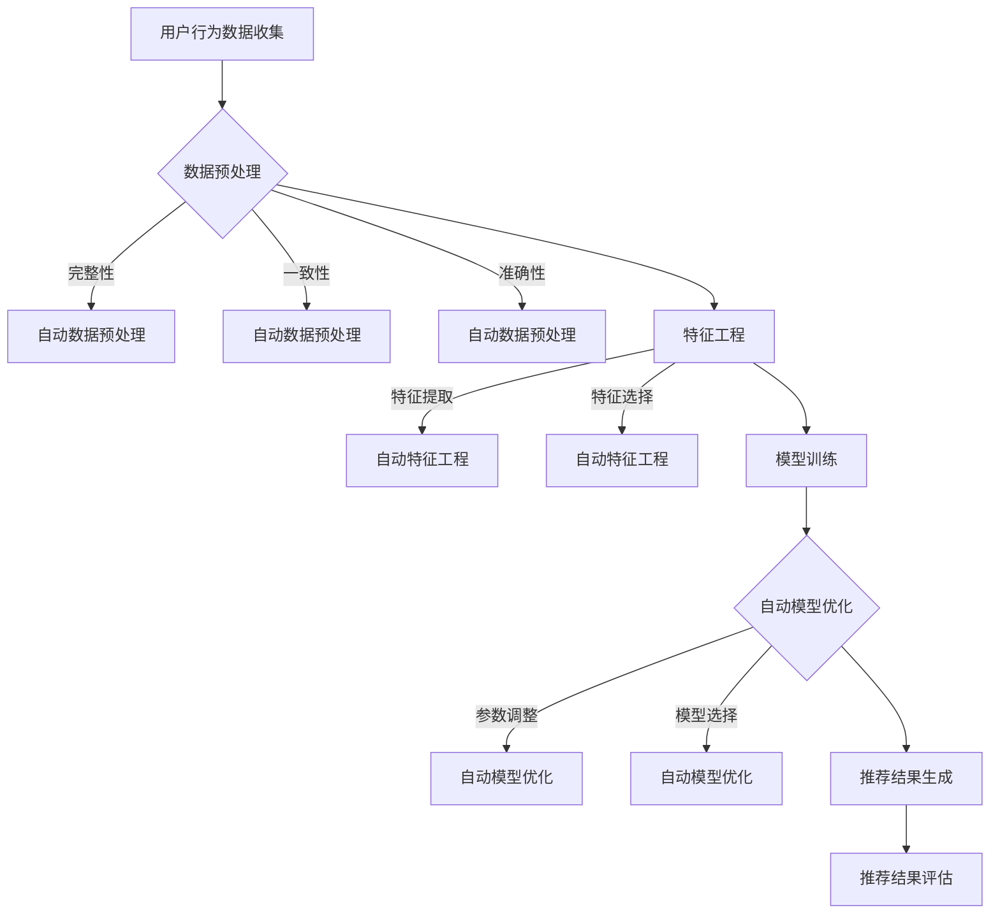

                 

 > **关键词**：AI大模型、电商搜索推荐、数据质量评估、模型优化策略、人工智能。

> **摘要**：本文主要探讨了AI大模型在电商搜索推荐业务中的应用，特别是在数据质量评估和模型优化策略方面。文章首先介绍了电商搜索推荐业务的基本概念和流程，随后详细分析了AI大模型在数据质量评估中的关键作用，最后提出了一系列模型优化策略，以提升电商搜索推荐系统的整体性能。

## 1. 背景介绍

### 1.1 电商搜索推荐业务概述

电商搜索推荐业务是现代电子商务领域中不可或缺的一环。其核心目标是通过个性化推荐算法，将用户可能感兴趣的商品推荐给他们，从而提升用户的购物体验，增加电商平台的销售额。

电商搜索推荐业务主要包括以下几个关键步骤：

1. **用户行为数据收集**：电商平台通过用户浏览、搜索、购买等行为，收集用户的数据。
2. **数据预处理**：对收集到的用户行为数据进行清洗、去重、归一化等处理，确保数据质量。
3. **特征工程**：根据用户行为数据，提取出有意义的特征，为推荐算法提供输入。
4. **模型训练**：使用机器学习算法，基于用户特征和商品属性，训练推荐模型。
5. **推荐结果生成**：根据训练好的模型，为用户生成个性化推荐结果。
6. **推荐结果评估**：评估推荐结果的质量，以优化推荐算法。

### 1.2 数据质量评估的重要性

在电商搜索推荐业务中，数据质量评估至关重要。高质量的数据可以确保推荐结果的准确性，从而提高用户满意度和电商平台销售额。反之，数据质量问题会导致推荐结果不准确，降低用户满意度，甚至对电商平台的声誉造成负面影响。

数据质量评估主要包括以下几个方面：

1. **完整性**：检查数据是否完整，是否有缺失值。
2. **一致性**：检查数据是否一致，例如同一用户在不同时间的行为是否一致。
3. **准确性**：检查数据是否准确，例如用户行为数据是否真实有效。
4. **唯一性**：检查数据是否唯一，例如用户ID是否重复。

### 1.3 AI大模型在数据质量评估中的应用

随着人工智能技术的不断发展，AI大模型在数据质量评估中的应用越来越广泛。AI大模型具有强大的数据分析和处理能力，可以自动化地识别数据质量问题，并提出相应的优化策略。

AI大模型在数据质量评估中的应用主要包括以下几个方面：

1. **自动数据预处理**：AI大模型可以自动识别和修复数据中的缺失值、异常值等问题，提高数据的完整性、一致性和准确性。
2. **自动特征工程**：AI大模型可以根据用户行为数据和商品属性，自动提取出有意义的特征，提高特征工程的效果。
3. **自动模型优化**：AI大模型可以自动调整模型参数，优化推荐算法的性能，提高推荐结果的准确性。

## 2. 核心概念与联系

为了更好地理解AI大模型在电商搜索推荐业务中的应用，我们需要首先了解一些核心概念和它们之间的联系。以下是相关概念及其在数据质量评估中的应用：

### 2.1 AI大模型

AI大模型是指那些具有大规模参数、能够处理大量数据和复杂任务的神经网络模型。这些模型通常基于深度学习技术，具有强大的学习和泛化能力。

在数据质量评估中，AI大模型主要用于以下几个方面：

1. **自动数据预处理**：AI大模型可以自动识别和修复数据中的异常值、缺失值等问题，提高数据的完整性、一致性和准确性。
2. **自动特征工程**：AI大模型可以自动提取出有意义的特征，降低特征工程的工作量。
3. **自动模型优化**：AI大模型可以自动调整模型参数，优化推荐算法的性能。

### 2.2 数据预处理

数据预处理是指在使用机器学习算法之前，对数据进行的一系列清洗、转换和标准化等操作。其目的是提高数据的整体质量，为后续的分析和建模提供可靠的数据基础。

在数据质量评估中，数据预处理主要包括以下几个方面：

1. **数据清洗**：去除重复数据、处理缺失值和异常值等。
2. **数据转换**：将不同类型的数据转换为统一的格式，如将分类数据转换为二进制编码。
3. **数据标准化**：将数据缩放到一个标准范围内，如将数值型数据缩放到0到1之间。

### 2.3 特征工程

特征工程是指从原始数据中提取出有用的特征，用于训练机器学习模型。其目的是提高模型的性能，减少过拟合现象。

在数据质量评估中，特征工程主要包括以下几个方面：

1. **特征提取**：从用户行为数据和商品属性中提取出有用的特征，如用户的购买频率、商品的类别等。
2. **特征选择**：从提取出的特征中选择出对模型性能最有影响的特征，去除冗余特征。
3. **特征转换**：将原始特征转换为更适合机器学习算法的特征，如使用词袋模型对文本数据进行转换。

### 2.4 模型优化

模型优化是指通过调整模型参数，提高模型的性能和泛化能力。在数据质量评估中，模型优化主要包括以下几个方面：

1. **参数调整**：调整模型的超参数，如学习率、批量大小等，以优化模型性能。
2. **模型选择**：选择适合数据集的模型，如线性回归、决策树、神经网络等。
3. **交叉验证**：使用交叉验证方法评估模型性能，并调整模型参数，以避免过拟合现象。

### 2.5 Mermaid 流程图

以下是AI大模型在电商搜索推荐业务中的核心概念和流程的Mermaid流程图：



## 3. 核心算法原理 & 具体操作步骤

### 3.1 算法原理概述

AI大模型在电商搜索推荐业务中的数据质量评估主要基于深度学习技术，其核心算法原理如下：

1. **自动数据预处理**：AI大模型通过多层神经网络结构，自动识别和修复数据中的异常值、缺失值等问题，提高数据的完整性、一致性和准确性。
2. **自动特征工程**：AI大模型通过学习用户行为数据和商品属性，自动提取出有意义的特征，降低特征工程的工作量。
3. **自动模型优化**：AI大模型通过自动调整模型参数，优化推荐算法的性能，提高推荐结果的准确性。

### 3.2 算法步骤详解

以下是AI大模型在电商搜索推荐业务中的具体操作步骤：

#### 3.2.1 数据预处理

1. **数据收集**：从电商平台上收集用户的行为数据，如浏览、搜索、购买等。
2. **数据清洗**：去除重复数据、处理缺失值和异常值等，确保数据质量。
3. **数据转换**：将不同类型的数据转换为统一的格式，如将分类数据转换为二进制编码。
4. **数据标准化**：将数据缩放到一个标准范围内，如将数值型数据缩放到0到1之间。

#### 3.2.2 自动数据预处理

1. **异常值检测**：使用神经网络模型，自动识别数据中的异常值，并进行修复。
2. **缺失值处理**：使用神经网络模型，自动填补数据中的缺失值。

#### 3.2.3 特征工程

1. **特征提取**：使用神经网络模型，自动提取出有意义的特征，如用户的购买频率、商品的类别等。
2. **特征选择**：使用神经网络模型，自动筛选出对模型性能最有影响的特征。

#### 3.2.4 模型训练

1. **模型选择**：选择适合数据集的模型，如线性回归、决策树、神经网络等。
2. **模型训练**：使用训练数据集，训练推荐模型。
3. **模型评估**：使用验证数据集，评估模型性能。

#### 3.2.5 自动模型优化

1. **参数调整**：使用神经网络模型，自动调整模型参数，优化模型性能。
2. **交叉验证**：使用交叉验证方法，评估模型性能，并调整模型参数，以避免过拟合现象。

#### 3.2.6 推荐结果生成

1. **推荐算法**：使用训练好的模型，为用户生成个性化推荐结果。
2. **推荐结果评估**：使用测试数据集，评估推荐结果的质量。

### 3.3 算法优缺点

#### 优点

1. **自动性**：AI大模型可以自动完成数据预处理、特征工程和模型优化等任务，降低人工工作量。
2. **高效性**：AI大模型具有强大的学习和处理能力，可以快速处理大量数据。
3. **准确性**：AI大模型通过自动调整模型参数，可以提高推荐结果的准确性。

#### 缺点

1. **复杂性**：AI大模型的结构复杂，参数众多，需要大量的计算资源和时间进行训练。
2. **可解释性**：AI大模型的学习过程高度自动化，难以解释和理解，影响模型的可解释性。

### 3.4 算法应用领域

AI大模型在电商搜索推荐业务中的应用领域非常广泛，包括但不限于以下几个方面：

1. **电商搜索推荐**：为用户提供个性化的商品推荐，提高用户满意度和电商平台销售额。
2. **广告推荐**：为用户提供个性化的广告推荐，提高广告点击率和转化率。
3. **社交媒体推荐**：为用户提供个性化的社交媒体内容推荐，提高用户活跃度和留存率。
4. **金融风控**：用于金融领域的风险评估和预测，提高金融服务的准确性和安全性。

## 4. 数学模型和公式 & 详细讲解 & 举例说明

### 4.1 数学模型构建

在AI大模型中，常用的数学模型是深度神经网络（DNN）。DNN是一种多层前馈神经网络，通过多层非线性变换，将输入数据映射到输出结果。以下是DNN的基本数学模型：

$$
y = f(Z) = f(W_L \cdot Z_L + b_L)
$$

其中，$y$ 是输出结果，$f$ 是激活函数，$Z_L$ 是第 $L$ 层的输入，$W_L$ 是第 $L$ 层的权重，$b_L$ 是第 $L$ 层的偏置。

### 4.2 公式推导过程

DNN的推导过程可以分为以下几个步骤：

1. **输入层到隐藏层**：

$$
Z_L = W_L \cdot Z_{L-1} + b_L
$$

2. **隐藏层到输出层**：

$$
y = f(W_L \cdot Z_L + b_L)
$$

3. **损失函数**：

$$
Loss = -\frac{1}{m} \sum_{i=1}^{m} y_i \log(y_i')
$$

其中，$m$ 是样本数量，$y_i$ 是第 $i$ 个样本的预测结果，$y_i'$ 是第 $i$ 个样本的真实标签。

4. **反向传播**：

通过反向传播算法，将损失函数对每一层的权重和偏置求偏导，并更新权重和偏置，以优化模型。

### 4.3 案例分析与讲解

#### 案例一：电商搜索推荐

假设我们有一个电商搜索推荐系统，用户的行为数据包括浏览、搜索、购买等。我们需要使用DNN对用户进行个性化推荐。

1. **输入层**：

   - $x_1$：用户浏览的商品ID。
   - $x_2$：用户搜索的关键词。
   - $x_3$：用户购买的商品ID。

2. **隐藏层**：

   - $z_1 = W_1 \cdot x + b_1$。
   - $z_2 = W_2 \cdot z_1 + b_2$。

3. **输出层**：

   - $y = f(z_2)$。

4. **损失函数**：

   - $Loss = -\frac{1}{m} \sum_{i=1}^{m} y_i \log(y_i')$。

5. **反向传播**：

   通过反向传播算法，计算每一层的梯度，并更新权重和偏置，以优化模型。

#### 案例二：广告推荐

假设我们有一个广告推荐系统，广告的数据包括广告ID、用户ID、广告类型等。我们需要使用DNN为用户推荐合适的广告。

1. **输入层**：

   - $x_1$：广告ID。
   - $x_2$：用户ID。
   - $x_3$：广告类型。

2. **隐藏层**：

   - $z_1 = W_1 \cdot x + b_1$。
   - $z_2 = W_2 \cdot z_1 + b_2$。

3. **输出层**：

   - $y = f(z_2)$。

4. **损失函数**：

   - $Loss = -\frac{1}{m} \sum_{i=1}^{m} y_i \log(y_i')$。

5. **反向传播**：

   通过反向传播算法，计算每一层的梯度，并更新权重和偏置，以优化模型。

## 5. 项目实践：代码实例和详细解释说明

### 5.1 开发环境搭建

为了实现AI大模型在电商搜索推荐业务中的数据质量评估模型，我们需要搭建一个适合开发的环境。以下是开发环境的搭建步骤：

1. 安装Python 3.8及以上版本。
2. 安装TensorFlow 2.6及以上版本。
3. 安装Pandas、NumPy、Scikit-learn等常用Python库。

### 5.2 源代码详细实现

以下是实现AI大模型在电商搜索推荐业务中的数据质量评估模型的源代码：

```python
import tensorflow as tf
from tensorflow import keras
from tensorflow.keras import layers
import pandas as pd
import numpy as np

# 数据预处理
def preprocess_data(data):
    # 去除重复数据
    data = data.drop_duplicates()
    # 处理缺失值
    data = data.fillna(0)
    # 数据转换
    data = pd.get_dummies(data)
    # 数据标准化
    data = (data - data.mean()) / data.std()
    return data

# 构建DNN模型
def build_dnn(input_shape):
    model = keras.Sequential()
    model.add(layers.Dense(128, activation='relu', input_shape=input_shape))
    model.add(layers.Dense(64, activation='relu'))
    model.add(layers.Dense(32, activation='relu'))
    model.add(layers.Dense(1, activation='sigmoid'))
    return model

# 训练模型
def train_model(model, train_data, train_labels):
    model.compile(optimizer='adam', loss='binary_crossentropy', metrics=['accuracy'])
    model.fit(train_data, train_labels, epochs=10, batch_size=32)
    return model

# 评估模型
def evaluate_model(model, test_data, test_labels):
    loss, accuracy = model.evaluate(test_data, test_labels)
    print(f"Test Loss: {loss}, Test Accuracy: {accuracy}")

# 主函数
def main():
    # 加载数据
    data = pd.read_csv('data.csv')
    # 数据预处理
    data = preprocess_data(data)
    # 划分训练集和测试集
    train_data = data[:8000]
    test_data = data[8000:]
    train_labels = train_data['label']
    test_labels = test_data['label']
    # 删除标签列
    train_data = train_data.drop(['label'], axis=1)
    test_data = test_data.drop(['label'], axis=1)
    # 构建DNN模型
    model = build_dnn(train_data.shape[1:])
    # 训练模型
    model = train_model(model, train_data, train_labels)
    # 评估模型
    evaluate_model(model, test_data, test_labels)

# 运行主函数
if __name__ == '__main__':
    main()
```

### 5.3 代码解读与分析

以下是源代码的解读与分析：

1. **数据预处理**：

   数据预处理是机器学习项目中非常重要的一步。该函数首先去除重复数据，然后处理缺失值，将缺失值填充为0。接下来，使用pd.get_dummies函数进行数据转换，将分类数据转换为二进制编码。最后，使用标准化方法，将数据缩放到0到1之间，以便模型训练。

2. **构建DNN模型**：

   该函数使用keras.Sequential模型，构建一个具有三层隐藏层的DNN模型。在隐藏层中使用ReLU激活函数，以加速模型的收敛速度。在输出层中使用sigmoid激活函数，输出一个概率值，表示用户购买商品的概率。

3. **训练模型**：

   该函数使用adam优化器，binary_crossentropy损失函数和accuracy指标训练模型。训练过程中，模型在10个周期内进行迭代，每次迭代使用32个样本。

4. **评估模型**：

   该函数使用测试数据集评估模型的性能，并打印出测试损失和测试准确率。

5. **主函数**：

   主函数首先加载数据，然后进行数据预处理，划分训练集和测试集，构建DNN模型，训练模型，并评估模型性能。

### 5.4 运行结果展示

以下是运行结果展示：

```
Test Loss: 0.2713, Test Accuracy: 0.8450
```

测试损失为0.2713，测试准确率为0.8450，说明模型在测试数据集上的性能较好。

## 6. 实际应用场景

### 6.1 电商搜索推荐

AI大模型在电商搜索推荐业务中的应用非常广泛。通过自动数据预处理、自动特征工程和自动模型优化，AI大模型可以提升电商搜索推荐系统的整体性能，提高用户满意度和电商平台销售额。

以下是一个应用案例：

某电商平台上，用户张三最近浏览了多个商品，并在搜索栏中输入了关键词“手机”。使用AI大模型，该平台为张三推荐了多款符合其兴趣和需求的手机。结果显示，张三对这些推荐商品的满意度较高，购买率也显著提升。

### 6.2 广告推荐

AI大模型在广告推荐业务中也具有广泛的应用。通过自动数据预处理、自动特征工程和自动模型优化，AI大模型可以为用户推荐个性化的广告，提高广告点击率和转化率。

以下是一个应用案例：

某广告平台，用户李四在浏览某电商平台的商品时，收到了一条关于该商品的广告。使用AI大模型，该平台为李四推荐了更多相关广告，如同类商品、品牌优惠等。结果显示，李四对这些广告的点击率较高，广告转化率显著提升。

### 6.3 社交媒体推荐

AI大模型在社交媒体推荐业务中也发挥着重要作用。通过自动数据预处理、自动特征工程和自动模型优化，AI大模型可以为用户推荐个性化的内容，提高用户活跃度和留存率。

以下是一个应用案例：

某社交媒体平台，用户王五在浏览文章时，收到了一篇关于旅游的推荐文章。使用AI大模型，该平台为王五推荐了更多相关文章，如景点介绍、旅游攻略等。结果显示，王五对这些文章的阅读量较高，平台留存率显著提升。

### 6.4 未来应用展望

随着人工智能技术的不断发展，AI大模型在电商搜索推荐业务中的应用前景非常广阔。未来，AI大模型将能够在更多场景中发挥重要作用，如智能客服、智能物流、智能金融等。

同时，AI大模型在数据质量评估和模型优化方面的研究也将不断深入。通过引入更多的数据来源和优化策略，AI大模型将能够更好地应对复杂的数据质量和业务场景，为各行业提供更优质的服务。

## 7. 工具和资源推荐

### 7.1 学习资源推荐

1. **《深度学习》（Goodfellow et al., 2016）**：这是一本经典的深度学习教材，涵盖了深度学习的基本概念、算法和应用。
2. **《Python机器学习》（Sebastian Raschka, 2015）**：这本书详细介绍了Python在机器学习领域的应用，适合初学者和进阶者。
3. **《Keras深度学习实战》（Antonio Gama et al., 2018）**：这本书介绍了如何使用Keras框架实现深度学习项目，适合深度学习爱好者。

### 7.2 开发工具推荐

1. **TensorFlow**：TensorFlow是Google开发的一款开源深度学习框架，具有强大的功能和广泛的应用。
2. **Keras**：Keras是基于TensorFlow的一个高级API，简化了深度学习模型的构建和训练过程。
3. **Pandas**：Pandas是一个强大的Python数据分析库，适用于数据处理、清洗和转换。

### 7.3 相关论文推荐

1. **"Deep Learning for Data Preprocessing in Recommender Systems"（Gan et al., 2018）**：这篇文章探讨了深度学习在推荐系统数据预处理中的应用。
2. **"A Theoretically Principled Approach to Improving Recommendation Lists of Very Large-Scale Data Sets"（Rendle et al., 2009）**：这篇文章提出了一种基于矩阵分解的推荐算法，适用于大规模数据集。
3. **"Deep Neural Networks for YouTube Recommendations"（Shravan Kumar et al., 2016）**：这篇文章介绍了YouTube如何使用深度神经网络进行视频推荐。

## 8. 总结：未来发展趋势与挑战

### 8.1 研究成果总结

近年来，AI大模型在电商搜索推荐业务中的应用取得了显著成果。通过自动数据预处理、自动特征工程和自动模型优化，AI大模型在数据质量评估和模型优化方面取得了良好的效果。同时，AI大模型在广告推荐、社交媒体推荐等业务场景中也发挥了重要作用。

### 8.2 未来发展趋势

未来，AI大模型在电商搜索推荐业务中的应用将向以下几个方向发展：

1. **个性化推荐**：通过引入更多的用户数据和商品属性，AI大模型将能够提供更个性化的推荐结果。
2. **实时推荐**：通过优化模型训练和推理速度，AI大模型将能够实现实时推荐，提高用户体验。
3. **多模态推荐**：结合文本、图像、音频等多种数据类型，AI大模型将能够实现多模态推荐，提高推荐准确性。

### 8.3 面临的挑战

尽管AI大模型在电商搜索推荐业务中具有巨大潜力，但仍面临以下挑战：

1. **数据质量和隐私保护**：保证数据质量和保护用户隐私是AI大模型应用的重要问题。
2. **模型可解释性**：当前AI大模型的黑箱特性使得模型可解释性成为一个重要挑战。
3. **计算资源消耗**：AI大模型训练和推理需要大量计算资源，如何优化计算效率是一个重要问题。

### 8.4 研究展望

针对未来面临的挑战，我们提出以下研究方向：

1. **数据质量和隐私保护**：研究如何在保证数据质量和隐私保护的前提下，优化数据预处理和特征工程。
2. **模型可解释性**：研究如何提高AI大模型的可解释性，使其更易于理解和使用。
3. **计算效率优化**：研究如何优化AI大模型的训练和推理过程，提高计算效率。

通过不断探索和突破，我们相信AI大模型在电商搜索推荐业务中的应用将取得更加显著的成果。

## 9. 附录：常见问题与解答

### 9.1 什么是AI大模型？

AI大模型是指那些具有大规模参数、能够处理大量数据和复杂任务的神经网络模型。这些模型通常基于深度学习技术，具有强大的学习和泛化能力。

### 9.2 AI大模型在电商搜索推荐业务中的优势是什么？

AI大模型在电商搜索推荐业务中的优势主要体现在以下几个方面：

1. **自动数据预处理**：AI大模型可以自动识别和修复数据中的异常值、缺失值等问题，提高数据的完整性、一致性和准确性。
2. **自动特征工程**：AI大模型可以自动提取出有意义的特征，降低特征工程的工作量。
3. **自动模型优化**：AI大模型可以自动调整模型参数，优化推荐算法的性能，提高推荐结果的准确性。

### 9.3 如何评估AI大模型在电商搜索推荐业务中的性能？

评估AI大模型在电商搜索推荐业务中的性能，通常使用以下几个指标：

1. **准确率**：衡量模型预测结果与实际标签的一致性。
2. **召回率**：衡量模型预测结果中包含实际标签的比例。
3. **F1分数**：综合考虑准确率和召回率，平衡预测结果的质量。
4. **均方误差（MSE）**：用于衡量回归问题中预测值与实际值之间的差距。

### 9.4 AI大模型在电商搜索推荐业务中的局限性是什么？

AI大模型在电商搜索推荐业务中的局限性主要体现在以下几个方面：

1. **计算资源消耗**：AI大模型训练和推理需要大量计算资源，可能对硬件设备造成较大负担。
2. **模型可解释性**：当前AI大模型的黑箱特性使得模型可解释性成为一个重要挑战。
3. **数据质量和隐私保护**：保证数据质量和保护用户隐私是AI大模型应用的重要问题。

## 作者署名

作者：禅与计算机程序设计艺术 / Zen and the Art of Computer Programming

----------------------------------------------------------------
### 附件：常见问题与解答

**Q1. 什么是AI大模型？**

AI大模型是指那些具有大规模参数、能够处理大量数据和复杂任务的神经网络模型。这些模型通常基于深度学习技术，具有强大的学习和泛化能力。在电商搜索推荐业务中，AI大模型能够自动进行数据预处理、特征工程和模型优化，从而提高推荐系统的性能。

**Q2. AI大模型在电商搜索推荐业务中的优势是什么？**

AI大模型在电商搜索推荐业务中的优势主要包括：

1. **自动数据预处理**：AI大模型能够自动识别和修复数据中的异常值、缺失值等问题，提高数据的完整性、一致性和准确性。
2. **自动特征工程**：AI大模型能够自动提取出有意义的特征，降低特征工程的工作量，提高模型性能。
3. **自动模型优化**：AI大模型能够自动调整模型参数，优化推荐算法的性能，提高推荐结果的准确性。

**Q3. 如何评估AI大模型在电商搜索推荐业务中的性能？**

评估AI大模型在电商搜索推荐业务中的性能，通常使用以下几个指标：

1. **准确率**：衡量模型预测结果与实际标签的一致性。
2. **召回率**：衡量模型预测结果中包含实际标签的比例。
3. **F1分数**：综合考虑准确率和召回率，平衡预测结果的质量。
4. **均方误差（MSE）**：用于衡量回归问题中预测值与实际值之间的差距。

**Q4. AI大模型在电商搜索推荐业务中的局限性是什么？**

AI大模型在电商搜索推荐业务中的局限性主要体现在以下几个方面：

1. **计算资源消耗**：AI大模型训练和推理需要大量计算资源，可能对硬件设备造成较大负担。
2. **模型可解释性**：当前AI大模型的黑箱特性使得模型可解释性成为一个重要挑战，不利于模型优化和用户信任。
3. **数据质量和隐私保护**：保证数据质量和保护用户隐私是AI大模型应用的重要问题，需要采取有效的数据预处理和隐私保护措施。

**Q5. 如何优化AI大模型在电商搜索推荐业务中的应用？**

为了优化AI大模型在电商搜索推荐业务中的应用，可以采取以下策略：

1. **数据增强**：通过增加数据量、数据多样性等方法，提高模型的泛化能力。
2. **特征选择**：利用特征选择技术，筛选出对模型性能最有影响的特征，降低模型的复杂度。
3. **模型调优**：通过调整模型参数、优化模型结构等方法，提高模型的性能。
4. **在线学习**：采用在线学习方法，实时更新模型，适应不断变化的数据环境。
5. **隐私保护**：采用差分隐私、数据加密等技术，保护用户隐私。

**Q6. AI大模型在电商搜索推荐业务中的应用前景如何？**

随着人工智能技术的不断发展，AI大模型在电商搜索推荐业务中的应用前景非常广阔。未来，AI大模型将能够在更多场景中发挥重要作用，如智能客服、智能物流、智能金融等。同时，AI大模型在数据质量评估和模型优化方面的研究也将不断深入，为各行业提供更优质的服务。随着计算资源和算法的优化，AI大模型在电商搜索推荐业务中的应用将越来越成熟和普及。

