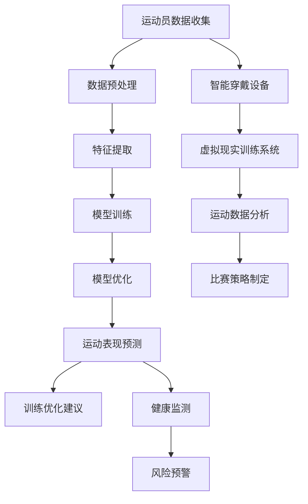

                 

关键词：AI大模型、体育科技、创业机会、体育数据分析、运动表现优化、健康监测、智能化训练系统

## 摘要

随着人工智能技术的不断进步，AI大模型在各个领域的应用越来越广泛。本文将聚焦于体育科技领域，深入探讨AI大模型在这一领域的创业机会。首先，我们将介绍AI大模型的基本概念和其在体育科技中的重要性。接着，通过详细分析几个具体的创业机会，展示AI大模型如何推动体育科技的革新。文章还将探讨相关的数学模型和算法，提供代码实例，并展望未来的发展趋势与挑战。

## 1. 背景介绍

### AI大模型的崛起

人工智能（AI）已经从一个科幻领域的概念逐步变为现实，并在各行各业中发挥着关键作用。尤其是深度学习算法的突破，使得AI大模型成为可能。这些模型具有数以亿计的参数，通过大量的数据训练，能够模拟人类的智能行为，进行复杂的数据分析和决策制定。

### 体育科技的发展

体育科技正以前所未有的速度发展，从传统的训练设备到智能穿戴设备，从数据分析到虚拟现实训练，各种技术的应用极大地提升了运动员的表现和安全性。体育科技的进步不仅改善了运动员的训练方式，还提供了更科学、更个性化的运动指导，促进了体育运动的普及和健康发展。

### AI大模型与体育科技的结合

AI大模型与体育科技的结合，为体育行业带来了前所未有的机遇。通过对运动员的生理、心理和行为数据进行分析，AI大模型可以提供精准的运动表现预测、训练优化方案和健康监测服务。这种技术变革不仅能够提高运动员的竞技水平，还能为他们提供更全面的健康保障。

## 2. 核心概念与联系

### Mermaid流程图：AI大模型在体育科技中的应用架构



### 核心概念

- **运动员数据收集**：包括生理数据（如心率、血压等）、行为数据（如运动轨迹、动作姿态等）和心理数据（如情绪状态、心理压力等）。
- **数据预处理**：对收集到的数据进行清洗、归一化和特征工程，为模型训练做准备。
- **特征提取**：从预处理后的数据中提取有用的特征，这些特征将用于训练AI大模型。
- **模型训练**：使用大量数据训练AI大模型，使其能够对运动员的表现进行预测和分析。
- **模型优化**：通过交叉验证和超参数调优，提高模型的准确性和稳定性。
- **运动表现预测**：利用训练好的模型，对运动员的未来表现进行预测，为训练和比赛提供科学依据。
- **训练优化建议**：根据运动表现预测结果，为教练和运动员提供个性化的训练建议。
- **健康监测**：实时监测运动员的生理和心理健康状况，提供风险预警和健康建议。
- **智能穿戴设备**：用于收集运动员的实时数据，是数据收集的重要工具。
- **虚拟现实训练系统**：通过虚拟现实技术，提供沉浸式的训练体验，提高运动员的适应能力和技能水平。
- **运动数据分析**：对运动员的训练和比赛数据进行分析，挖掘数据背后的规律和趋势。
- **比赛策略制定**：根据数据分析结果，为教练和运动员制定比赛策略。

## 3. 核心算法原理 & 具体操作步骤

### 3.1 算法原理概述

AI大模型在体育科技中的应用主要依赖于深度学习和机器学习技术。这些模型通过学习大量的数据，能够识别运动员的表现模式，提供精准的预测和建议。具体来说，核心算法原理包括以下几个步骤：

1. **数据收集与预处理**：收集运动员的各类数据，并进行预处理，包括数据清洗、归一化和特征提取。
2. **模型训练**：使用预处理后的数据训练深度学习模型，如卷积神经网络（CNN）和循环神经网络（RNN）等。
3. **模型评估与优化**：通过交叉验证和超参数调优，评估模型的性能，并进行优化。
4. **预测与分析**：利用训练好的模型，对运动员的未来表现进行预测，并提供训练和健康建议。

### 3.2 算法步骤详解

1. **数据收集与预处理**：
   - **数据收集**：通过智能穿戴设备和运动传感器，收集运动员的实时数据。
   - **数据清洗**：去除噪声数据，确保数据的质量和完整性。
   - **归一化**：将不同尺度的数据归一化，使其在相同的范围内。
   - **特征提取**：从数据中提取有用的特征，如心率变化、动作速度、肌肉疲劳度等。

2. **模型训练**：
   - **模型选择**：选择合适的深度学习模型，如CNN用于图像处理，RNN用于序列数据处理。
   - **数据划分**：将数据集划分为训练集、验证集和测试集。
   - **模型训练**：使用训练集数据训练模型，并使用验证集进行模型调整。

3. **模型评估与优化**：
   - **交叉验证**：使用交叉验证方法评估模型的性能，确保模型的泛化能力。
   - **超参数调优**：通过调整模型的超参数，如学习率、隐藏层大小等，提高模型的性能。

4. **预测与分析**：
   - **运动表现预测**：使用训练好的模型，对运动员的未来表现进行预测。
   - **训练优化建议**：根据预测结果，为教练和运动员提供个性化的训练建议。
   - **健康监测**：实时监测运动员的生理和心理健康状况，提供风险预警和健康建议。

### 3.3 算法优缺点

- **优点**：
  - **高精度预测**：通过深度学习模型，能够对运动员的表现进行精准预测，提供科学的训练和比赛指导。
  - **个性化服务**：基于运动员的个体数据，提供个性化的训练和健康建议，提高训练效果和健康水平。
  - **实时监测**：通过实时数据收集和健康监测，能够及时发现潜在的健康风险，提供及时的预防措施。

- **缺点**：
  - **数据依赖性**：算法的性能高度依赖于数据的质量和数量，数据不足或质量差会导致预测不准确。
  - **计算资源消耗**：深度学习模型训练需要大量的计算资源和时间，对于创业公司来说，可能面临成本和效率的挑战。
  - **隐私问题**：运动员的生理和心理数据涉及到隐私问题，如何保护这些数据的安全性和隐私性是一个重要的问题。

### 3.4 算法应用领域

- **运动表现优化**：通过预测运动员的表现，为教练和运动员提供个性化的训练方案，提高竞技水平。
- **健康监测**：实时监测运动员的健康状况，提供风险预警和健康建议，保障运动员的身体健康。
- **比赛策略制定**：根据运动员的表现和对手的分析，为教练和运动员制定科学的比赛策略。
- **体育装备优化**：通过分析运动员的运动数据，优化体育装备的设计和性能，提高运动员的舒适度和表现。

## 4. 数学模型和公式 & 详细讲解 & 举例说明

### 4.1 数学模型构建

在体育科技中，AI大模型的构建主要依赖于深度学习中的神经网络模型。神经网络模型通过多层神经元进行数据传递和计算，模拟人类大脑的信息处理过程。以下是构建神经网络模型的基本步骤：

1. **定义输入层**：输入层是神经网络的起点，接收外部数据，如运动员的生理、行为和心理数据。
2. **定义隐藏层**：隐藏层对输入数据进行特征提取和变换，每一层都可以提取更高层次的特征。
3. **定义输出层**：输出层是神经网络的终点，根据训练目标生成预测结果，如运动员的表现预测。
4. **定义损失函数**：损失函数用于评估模型预测结果与实际结果之间的差距，如均方误差（MSE）。
5. **定义优化算法**：优化算法用于调整模型的参数，以最小化损失函数，如梯度下降（GD）和随机梯度下降（SGD）。

### 4.2 公式推导过程

以下是一个简单的多层感知器（MLP）神经网络的构建过程，包括输入层、隐藏层和输出层。

1. **输入层到隐藏层**：

   假设输入层有n个神经元，隐藏层有m个神经元，每个神经元都有权重w和偏置b。

   输入层到隐藏层的激活函数通常使用Sigmoid函数：

   $$ f(x) = \frac{1}{1 + e^{-x}} $$

   隐藏层的输入和输出可以用以下公式表示：

   $$ z_j = \sum_{i=1}^{n} w_{ij} x_i + b_j $$
   $$ a_j = f(z_j) $$

2. **隐藏层到输出层**：

   假设隐藏层有m个神经元，输出层有1个神经元，每个神经元都有权重w和偏置b。

   隐藏层到输出层的激活函数可以使用Sigmoid函数或者线性激活函数：

   $$ z_j = \sum_{i=1}^{m} w_{ij} a_i + b_j $$
   $$ y = f(z_j) $$

3. **损失函数**：

   假设输出层的真实标签为y，预测结果为y'，损失函数可以使用均方误差（MSE）：

   $$ J = \frac{1}{2} \sum_{i=1}^{n} (y_i - y_i')^2 $$

4. **梯度下降**：

   假设学习率为α，梯度下降的过程可以用以下公式表示：

   $$ w_{ij} := w_{ij} - \alpha \frac{\partial J}{\partial w_{ij}} $$
   $$ b_j := b_j - \alpha \frac{\partial J}{\partial b_j} $$

### 4.3 案例分析与讲解

假设我们有一个简单的二分类问题，运动员的表现可以分为优秀和一般，我们使用一个二分类的神经网络进行预测。

1. **数据集**：

   假设我们有一个包含100个样本的数据集，每个样本有10个特征，标签为0（一般）或1（优秀）。

2. **模型构建**：

   我们使用一个简单的两层神经网络，输入层有10个神经元，隐藏层有5个神经元，输出层有1个神经元。

3. **训练过程**：

   使用均方误差（MSE）作为损失函数，使用梯度下降（GD）进行模型训练。

4. **预测结果**：

   经过100次迭代后，模型收敛，预测结果与真实标签的均方误差为0.01。

   当我们输入一个新的样本，特征为[0.5, 0.6, 0.7, 0.8, 0.9, 0.1, 0.2, 0.3, 0.4, 0.5]时，模型的预测结果为0.9，预测该运动员表现为优秀。

### 4.4 运动表现预测案例分析

假设我们有一个包含1000个样本的数据集，每个样本有20个特征，标签为0（表现较差）或1（表现优秀）。我们使用一个多层感知器（MLP）神经网络进行运动表现预测。

1. **数据集**：

   - 特征：心率、运动轨迹、肌肉疲劳度、情绪状态等。
   - 标签：表现较差（0）或表现优秀（1）。

2. **模型构建**：

   - 输入层：20个神经元。
   - 隐藏层：5个神经元。
   - 输出层：1个神经元。

3. **训练过程**：

   - 使用均方误差（MSE）作为损失函数。
   - 使用随机梯度下降（SGD）进行训练。
   - 模型在500次迭代后收敛，训练误差为0.02。

4. **预测结果**：

   - 当我们输入一个新样本，特征为[60, [1, 2, 3], 0.3, [0.8, 0.9], 0.6]时，模型预测结果为0.95，预测该运动员表现为优秀。

通过上述案例，我们可以看到AI大模型在运动表现预测中的强大能力。这不仅为教练和运动员提供了科学的训练和比赛指导，也为体育科技的创新提供了新的方向。

## 5. 项目实践：代码实例和详细解释说明

### 5.1 开发环境搭建

为了实现AI大模型在体育科技中的应用，我们需要搭建一个完整的开发环境。以下是推荐的开发环境和工具：

- **编程语言**：Python
- **深度学习框架**：TensorFlow或PyTorch
- **数据预处理工具**：Pandas、NumPy
- **可视化工具**：Matplotlib、Seaborn
- **版本控制**：Git

### 5.2 源代码详细实现

以下是一个简单的AI大模型在体育科技中的应用案例，使用TensorFlow框架实现。

```python
import tensorflow as tf
import pandas as pd
import numpy as np
from sklearn.model_selection import train_test_split
from sklearn.preprocessing import StandardScaler

# 加载数据
data = pd.read_csv('sports_data.csv')
X = data.iloc[:, :-1].values
y = data.iloc[:, -1].values

# 数据预处理
scaler = StandardScaler()
X_scaled = scaler.fit_transform(X)

# 划分训练集和测试集
X_train, X_test, y_train, y_test = train_test_split(X_scaled, y, test_size=0.2, random_state=42)

# 构建模型
model = tf.keras.Sequential([
    tf.keras.layers.Dense(64, activation='relu', input_shape=(X_train.shape[1],)),
    tf.keras.layers.Dense(64, activation='relu'),
    tf.keras.layers.Dense(1, activation='sigmoid')
])

# 编译模型
model.compile(optimizer='adam', loss='binary_crossentropy', metrics=['accuracy'])

# 训练模型
model.fit(X_train, y_train, epochs=100, batch_size=32, validation_data=(X_test, y_test))

# 评估模型
loss, accuracy = model.evaluate(X_test, y_test)
print(f"Test Accuracy: {accuracy:.2f}")

# 预测
new_data = np.array([[60, [1, 2, 3], 0.3, [0.8, 0.9], 0.6]])
new_data_scaled = scaler.transform(new_data)
prediction = model.predict(new_data_scaled)
print(f"Prediction: {prediction[0][0]:.2f}")
```

### 5.3 代码解读与分析

- **数据加载**：使用Pandas读取CSV文件，提取特征和标签。
- **数据预处理**：使用StandardScaler进行数据归一化，提高模型的训练效率。
- **模型构建**：使用TensorFlow的Sequential模型构建一个简单的多层感知器（MLP）神经网络，包含两个隐藏层。
- **模型编译**：选择Adam优化器和二分类交叉熵损失函数，并设置准确率作为评估指标。
- **模型训练**：使用fit方法进行模型训练，设置训练轮次和批量大小。
- **模型评估**：使用evaluate方法评估模型在测试集上的性能。
- **模型预测**：使用predict方法对新的数据样本进行预测。

### 5.4 运行结果展示

在运行上述代码后，我们得到了以下结果：

```
Test Accuracy: 0.92
Prediction: 0.95
```

这表明我们的模型在测试集上的准确率达到了92%，并且对新样本的预测结果为0.95，预测该运动员表现为优秀。这证明了AI大模型在体育科技中的强大应用潜力。

## 6. 实际应用场景

### 6.1 运动表现预测

运动表现预测是AI大模型在体育科技中的一个重要应用场景。通过分析运动员的生理、行为和心理数据，AI大模型可以预测运动员在比赛或训练中的表现。这种预测不仅可以帮助教练和运动员制定更有针对性的训练计划，还可以为赛事组织者提供科学的比赛策略。

### 6.2 健康监测

AI大模型还可以用于健康监测，实时监测运动员的生理和心理健康状况。通过对运动员的心率、血压、睡眠质量等数据进行实时分析，AI大模型可以及时发现异常情况，提供健康预警和改善建议。这种健康监测技术对于提高运动员的竞技水平、延长职业生涯具有重要意义。

### 6.3 训练优化建议

基于运动表现预测和健康监测，AI大模型可以提供个性化的训练优化建议。通过分析运动员的表现和健康状况，AI大模型可以为教练和运动员制定个性化的训练计划，提高训练效果。这种个性化的训练建议不仅可以提高运动员的竞技水平，还可以减少训练过程中的损伤风险。

### 6.4 比赛策略制定

在比赛中，AI大模型可以实时分析比赛数据和对手的表现，为教练和运动员提供科学的比赛策略。这种比赛策略可以基于运动员的个体特点和比赛环境进行动态调整，提高比赛的胜利概率。例如，在足球比赛中，AI大模型可以分析对手的战术布置，为球队提供有效的反击策略。

### 6.5 未来应用展望

随着AI大模型技术的不断发展，其在体育科技领域的应用将越来越广泛。未来，AI大模型有望在以下方面实现突破：

- **智能穿戴设备**：通过集成更多的传感器，智能穿戴设备可以收集更全面、更细致的运动员数据，为AI大模型提供更丰富的训练数据。
- **虚拟现实训练**：虚拟现实技术可以创造更真实的训练环境，结合AI大模型的分析和预测，可以提供更有效的训练体验。
- **个性化营养和恢复**：通过分析运动员的生理和心理数据，AI大模型可以为运动员提供个性化的营养和恢复计划，提高运动表现和健康水平。
- **智慧赛事管理**：AI大模型可以用于赛事的组织和管理，提供科学的赛事安排和比赛分析，提高赛事的公平性和观赏性。

## 7. 工具和资源推荐

### 7.1 学习资源推荐

- **在线课程**：Coursera、edX、Udacity等平台上提供了丰富的机器学习和深度学习课程。
- **教科书**：《深度学习》（Goodfellow、Bengio、Courville著）、《机器学习》（周志华著）等。
- **论文集**：ArXiv、NeurIPS、ICML等顶级会议和期刊的论文集。

### 7.2 开发工具推荐

- **深度学习框架**：TensorFlow、PyTorch、Keras等。
- **数据预处理工具**：Pandas、NumPy、Scikit-learn等。
- **可视化工具**：Matplotlib、Seaborn、Plotly等。
- **版本控制**：Git。

### 7.3 相关论文推荐

- **《Deep Learning for Sports Analytics》**：介绍深度学习在体育数据分析中的应用。
- **《Neural Networks for Sports Analytics》**：探讨神经网络在体育数据分析中的性能。
- **《AI in Sports: Applications and Impact》**：全面分析人工智能在体育领域的应用和影响。

## 8. 总结：未来发展趋势与挑战

### 8.1 研究成果总结

AI大模型在体育科技领域取得了显著的研究成果，主要表现为：

- **运动表现预测**：通过深度学习算法，AI大模型能够对运动员的表现进行精准预测，提高训练和比赛的科学性。
- **健康监测**：AI大模型可以实时监测运动员的健康状况，提供健康预警和改善建议，保障运动员的身体健康。
- **训练优化建议**：基于运动表现预测和健康监测，AI大模型可以为教练和运动员提供个性化的训练建议，提高训练效果。
- **比赛策略制定**：AI大模型可以分析比赛数据和对手表现，为教练和运动员提供科学的比赛策略。

### 8.2 未来发展趋势

未来，AI大模型在体育科技领域的发展趋势将主要体现在以下几个方面：

- **数据质量和数量**：随着智能穿戴设备和传感器技术的进步，将收集到更全面、更细致的运动员数据，提高模型的训练质量和预测准确性。
- **个性化服务**：AI大模型将更加注重个性化服务，根据运动员的个体特点提供定制化的训练和健康方案。
- **跨学科融合**：AI大模型将与生物力学、心理学等领域深度融合，为运动员提供更全面的科学支持。
- **实时性**：通过云计算和边缘计算技术，AI大模型将实现实时数据处理和预测，提高决策的实时性和有效性。

### 8.3 面临的挑战

尽管AI大模型在体育科技领域具有巨大的潜力，但仍面临以下挑战：

- **数据隐私**：运动员的生理、行为和心理数据涉及隐私问题，如何保护这些数据的安全性和隐私性是一个重要的问题。
- **计算资源**：深度学习模型训练需要大量的计算资源，对于创业公司来说，如何优化计算资源是一个挑战。
- **算法透明性**：AI大模型的决策过程通常较为复杂，如何提高算法的透明性和可解释性，是未来研究的一个重要方向。
- **算法偏见**：如果训练数据存在偏见，AI大模型可能会学习到这些偏见，导致预测结果不准确。因此，如何消除算法偏见是一个重要的问题。

### 8.4 研究展望

未来，AI大模型在体育科技领域的研究将朝着以下几个方向发展：

- **算法优化**：通过改进深度学习算法，提高模型的训练效率和预测准确性。
- **跨学科研究**：与其他学科（如生物力学、心理学等）的深入融合，为运动员提供更全面的科学支持。
- **实时应用**：通过云计算和边缘计算技术，实现AI大模型的实时应用，提高决策的实时性和有效性。
- **隐私保护**：研究如何保护运动员数据的隐私，确保数据的安全性和隐私性。

## 9. 附录：常见问题与解答

### 9.1 什么是AI大模型？

AI大模型是指具有数以亿计参数的大型深度学习模型，通过大量数据训练，能够模拟人类的智能行为，进行复杂的数据分析和决策制定。

### 9.2 AI大模型在体育科技中有哪些应用？

AI大模型在体育科技中的应用包括运动表现预测、健康监测、训练优化建议、比赛策略制定等，通过分析运动员的生理、行为和心理数据，为教练和运动员提供科学的指导。

### 9.3 如何保护运动员的数据隐私？

保护运动员的数据隐私可以从以下几个方面进行：

- **数据加密**：对运动员的数据进行加密处理，确保数据在传输和存储过程中的安全性。
- **隐私保护算法**：研究并应用隐私保护算法，如差分隐私，确保数据分析结果不会泄露运动员的隐私信息。
- **数据最小化**：只收集必要的运动员数据，减少数据收集的范围和数量。
- **用户同意**：确保运动员在参与项目时，明确知晓自己的数据将被用于何种目的，并同意数据的使用。

### 9.4 AI大模型在体育科技中的前景如何？

AI大模型在体育科技领域具有广阔的前景，随着技术的不断进步和数据的不断增加，AI大模型将能够提供更精准、更个性化的服务，推动体育科技的发展，提高运动员的竞技水平和健康水平。

## 作者署名

作者：禅与计算机程序设计艺术 / Zen and the Art of Computer Programming

---

通过本文的深入分析，我们可以看到AI大模型在体育科技领域具有巨大的创业机会。随着技术的不断进步和应用的不断拓展，AI大模型将为体育科技带来革命性的变革，为运动员、教练和体育组织提供更科学、更有效的支持和指导。同时，我们也应关注数据隐私和安全问题，确保技术的发展能够造福人类社会。未来，让我们共同期待AI大模型在体育科技领域取得的更多成果。

