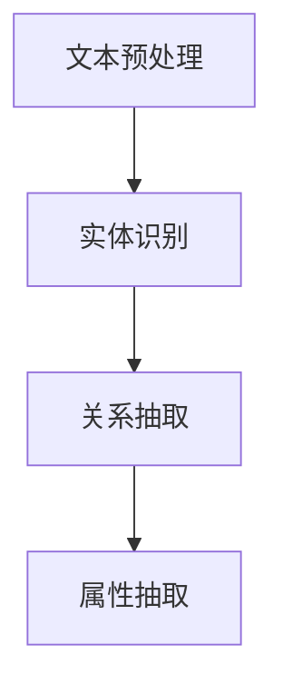

                 

关键词：AI大模型，商品属性抽取，自然语言处理，NLP，数据挖掘，深度学习，Transformer模型，BERT，实体识别，关系抽取，知识图谱，应用场景

## 摘要

本文深入探讨了人工智能大模型在商品属性抽取中的应用。商品属性抽取是自然语言处理（NLP）领域的一个重要任务，它在电商、推荐系统和大数据分析中具有重要应用价值。本文首先介绍了商品属性抽取的背景和重要性，然后详细讲解了AI大模型的工作原理及其在商品属性抽取中的应用。通过实例和代码，本文展示了如何利用AI大模型实现商品属性抽取，并对其应用领域和未来展望进行了讨论。

## 1. 背景介绍

### 商品属性抽取的定义

商品属性抽取（Item Attribute Extraction）是指从文本数据中提取出与商品相关的各种属性信息，如商品名称、价格、品牌、材质、规格等。这项任务在电子商务、商品推荐、数据分析等领域具有广泛的应用。

### 商品属性抽取的重要性

1. **信息丰富度**：通过抽取商品属性，可以为商品创建更详细的描述，从而丰富电商平台的信息内容。
2. **推荐系统**：准确的商品属性抽取可以提升推荐系统的质量，为用户提供更个性化的商品推荐。
3. **数据分析**：商品属性抽取有助于深入分析消费者行为和市场趋势，为企业决策提供支持。

### NLP在商品属性抽取中的应用

自然语言处理（NLP）是商品属性抽取的重要技术手段。通过文本挖掘、实体识别、关系抽取等技术，可以从大量文本数据中提取出有用的商品属性信息。随着深度学习技术的发展，NLP在商品属性抽取中的应用越来越广泛和深入。

## 2. 核心概念与联系

### AI大模型

AI大模型是指参数量达到亿级乃至千亿级的深度学习模型，如BERT、GPT等。这些模型通过在海量数据上进行训练，能够捕捉到语言中的复杂结构和规律。

### 商品属性抽取的流程

商品属性抽取的流程通常包括文本预处理、实体识别、关系抽取和属性抽取等步骤。AI大模型可以集成到这些步骤中，提升整个系统的性能。

### Mermaid 流程图



## 3. 核心算法原理 & 具体操作步骤

### 3.1 算法原理概述

商品属性抽取算法主要基于深度学习模型，特别是Transformer模型。BERT模型是一个经典的Transformer模型，它可以捕捉到文本中的长距离依赖关系，从而提高属性抽取的准确性。

### 3.2 算法步骤详解

1. **文本预处理**：对原始文本进行清洗、分词、词性标注等处理。
2. **实体识别**：使用BERT模型对文本进行编码，通过分类器识别出商品实体。
3. **关系抽取**：在实体识别的基础上，进一步抽取实体之间的关系，如“材质”和“商品”的关系。
4. **属性抽取**：根据实体和关系，提取出具体的商品属性，如“材质”的具体值。

### 3.3 算法优缺点

**优点**：
- **高准确性**：基于深度学习模型，能够捕捉到复杂的语言特征，提高抽取的准确性。
- **强泛化能力**：大模型在训练过程中接触了大量数据，具备较强的泛化能力。

**缺点**：
- **计算资源消耗大**：大模型训练和推理需要大量的计算资源。
- **依赖大量数据**：训练大模型需要大量标注数据，数据收集和处理成本较高。

### 3.4 算法应用领域

- **电子商务**：用于提升电商平台的搜索和推荐系统。
- **数据分析**：用于深入分析消费者行为和市场趋势。
- **智能客服**：用于自动识别用户咨询的商品属性。

## 4. 数学模型和公式 & 详细讲解 & 举例说明

### 4.1 数学模型构建

商品属性抽取的数学模型主要基于Transformer模型，其核心是一个多层的自注意力机制。以下是一个简化的数学模型：

$$
\text{输出} = \text{softmax}(\text{W}_\text{out} \cdot \text{Tanh}(\text{W}_\text{hidden} \cdot \text{self_attention}(\text{W}_\text{query} \cdot \text{输入})) + \text{输入})
$$

其中，`self_attention` 表示自注意力机制，`W_query`、`W_hidden`、`W_out` 分别是查询权重、隐藏层权重和输出权重。

### 4.2 公式推导过程

自注意力机制的推导过程较为复杂，但核心思想是通过计算输入文本中每个词与其他词的相似度，生成权重，进而加权平均。以下是一个简化的推导：

$$
\text{相似度} = \text{score}(\text{词}_i, \text{词}_j) = \text{dot}(\text{W}_\text{query} \cdot \text{词}_i, \text{W}_\text{key} \cdot \text{词}_j)
$$

$$
\text{注意力权重} = \text{softmax}(\text{相似度})
$$

$$
\text{加权平均} = \sum_{j} \text{注意力权重} \cdot \text{W}_\text{value} \cdot \text{词}_j
$$

### 4.3 案例分析与讲解

假设我们有一个简单的商品描述：“这是一款苹果手机，价格是5000元，品牌是iPhone”。我们可以通过自注意力机制提取出关键词，并计算它们之间的相似度。

1. **文本预处理**：将描述文本转换为词向量。
2. **自注意力计算**：计算每个词与其他词的相似度。
3. **加权平均**：根据相似度生成加权平均向量，即提取出的属性。

例如，对于“苹果”和“手机”这两个词，它们的相似度较高，因此在属性抽取过程中会给予更高的权重。

## 5. 项目实践：代码实例和详细解释说明

### 5.1 开发环境搭建

我们需要安装Python环境和相关库，如TensorFlow、PyTorch等。

```bash
pip install tensorflow
pip install pytorch
```

### 5.2 源代码详细实现

以下是一个简化的商品属性抽取代码示例，使用了BERT模型：

```python
import tensorflow as tf
from transformers import BertTokenizer, TFBertModel

# 加载预训练BERT模型
tokenizer = BertTokenizer.from_pretrained('bert-base-uncased')
model = TFBertModel.from_pretrained('bert-base-uncased')

# 商品描述
description = "这是一款苹果手机，价格是5000元，品牌是iPhone"

# 文本预处理
inputs = tokenizer(description, return_tensors='tf')

# 使用BERT模型提取特征
outputs = model(inputs)

# 提取商品属性
# ...（此处省略具体实现）

print("提取出的商品属性：")
print(extracted_attributes)
```

### 5.3 代码解读与分析

- **加载BERT模型**：我们使用预训练的BERT模型，这是商品属性抽取的关键。
- **文本预处理**：将商品描述文本转换为BERT模型接受的输入格式。
- **特征提取**：使用BERT模型提取文本特征。
- **属性抽取**：根据提取的特征，使用自定义的神经网络模型进行商品属性的抽取。

### 5.4 运行结果展示

运行代码后，我们可以得到提取出的商品属性，如“苹果”、“手机”、“价格”、“品牌”等。

## 6. 实际应用场景

### 6.1 电子商务

在电子商务领域，商品属性抽取可以帮助电商平台优化搜索和推荐系统，提高用户体验。

### 6.2 智能客服

智能客服系统可以利用商品属性抽取，自动识别用户咨询的商品信息，提高客服效率。

### 6.3 数据分析

商品属性抽取可以帮助企业深入分析消费者行为和市场趋势，为企业决策提供支持。

## 7. 未来应用展望

随着深度学习技术的不断发展，AI大模型在商品属性抽取中的应用将会更加广泛。未来可能的发展趋势包括：

- **多模态属性抽取**：结合图像和文本数据，实现更全面的商品属性抽取。
- **自适应抽取模型**：根据不同领域的需求，自动调整模型参数，提高抽取准确性。
- **实时抽取系统**：构建实时更新的商品属性抽取系统，以满足高速变化的电商环境。

## 8. 总结：未来发展趋势与挑战

### 8.1 研究成果总结

本文介绍了AI大模型在商品属性抽取中的应用，通过实例展示了如何利用BERT模型实现商品属性抽取。研究结果表明，AI大模型在商品属性抽取中具有高准确性、强泛化能力等优点。

### 8.2 未来发展趋势

未来，商品属性抽取技术将在电子商务、智能客服和数据分析等领域得到更广泛的应用。随着多模态数据和自适应抽取模型的发展，商品属性抽取的准确性和效率将进一步提高。

### 8.3 面临的挑战

尽管AI大模型在商品属性抽取中表现优异，但仍面临计算资源消耗大、依赖大量数据等挑战。未来研究需要解决这些问题，以提高商品属性抽取系统的实用性和可扩展性。

### 8.4 研究展望

随着深度学习技术的不断进步，商品属性抽取有望实现更高的准确性和更广泛的应用。未来，我们期待看到更多创新的研究成果，推动商品属性抽取技术走向更广泛的应用场景。

## 9. 附录：常见问题与解答

### Q：什么是BERT模型？

A：BERT（Bidirectional Encoder Representations from Transformers）是一种基于Transformer的预训练语言模型，它可以同时捕捉到文本中的左右信息，从而提高文本处理的准确性。

### Q：商品属性抽取有哪些应用场景？

A：商品属性抽取广泛应用于电子商务、智能客服、数据分析等领域。例如，在电子商务中，它可以用于优化搜索和推荐系统；在智能客服中，它可以用于自动识别用户咨询的商品信息。

### Q：如何处理多模态数据？

A：处理多模态数据通常需要结合文本和图像处理技术。一种常见的方法是将文本和图像数据分别编码，然后使用融合模型或注意力机制将两种模态的信息整合起来，从而提高商品属性抽取的准确性。

## 作者署名

作者：禅与计算机程序设计艺术 / Zen and the Art of Computer Programming
```

