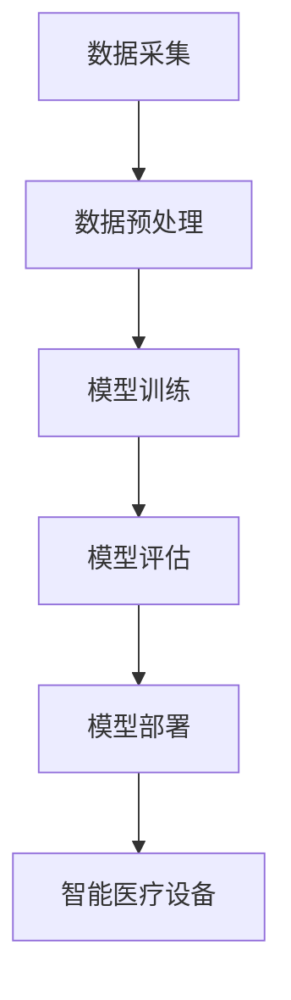

                 

关键词：AI大模型、智能医疗设备、创业机会、技术分析、市场需求、商业模式、算法优化、数据处理、医疗应用

>摘要：本文深入探讨了AI大模型在智能医疗设备领域的创业机会。通过对市场需求的剖析、技术应用的详细分析以及未来发展趋势的展望，揭示了AI大模型在智能医疗设备中不可忽视的重要性。文章旨在为创业者和投资者提供有价值的参考。

## 1. 背景介绍

近年来，人工智能（AI）技术取得了显著的进步，特别是在深度学习、自然语言处理、计算机视觉等领域。这些技术不仅改变了传统行业的面貌，也为新兴行业带来了前所未有的发展机遇。其中，智能医疗设备领域作为医疗行业的重要组成部分，正迅速成为AI技术的重要应用场景。

智能医疗设备指的是利用先进的人工智能技术，通过传感器、物联网、大数据等手段实现医疗诊断、治疗和管理的设备。这些设备能够提供更为精准、高效、便捷的医疗服务，大大提升了医疗工作的效率和准确性。而AI大模型，作为当前AI领域最为先进的技术之一，其在大数据处理、模式识别、智能决策等方面的优势，为智能医疗设备的智能化升级提供了强有力的技术支撑。

创业者在智能医疗设备领域，可以利用AI大模型技术，开发出一系列创新的医疗产品和服务，满足日益增长的医疗需求，从而获得巨大的市场机会。然而，AI大模型在智能医疗设备中的应用也面临诸多挑战，如数据隐私、伦理问题、算法透明度等。因此，如何有效地应对这些挑战，将AI大模型技术转化为实际的市场价值，成为创业者和投资者需要深入思考的问题。

本文将围绕AI大模型在智能医疗设备领域的创业机会，从市场需求、技术应用、商业模式等多个角度进行分析，为创业者提供有价值的指导。

## 2. 核心概念与联系

### 2.1 AI大模型的概念

AI大模型（Large-scale AI Model）是指那些拥有海量参数、能够处理大规模数据集的深度学习模型。这些模型通常利用神经网络结构，通过大规模的数据训练，实现了对复杂模式的自动学习和识别。代表性的AI大模型包括Transformer、BERT、GPT等。这些模型具有强大的学习能力，能够在多个领域实现卓越的表现。

### 2.2 智能医疗设备的概念

智能医疗设备是指集成了人工智能技术，能够进行自主诊断、治疗或管理的医疗设备。这些设备利用传感器、物联网技术、大数据分析等技术，实现实时监控、数据采集和智能决策。智能医疗设备不仅提高了医疗的准确性，还降低了医疗成本，提升了医疗服务的质量。

### 2.3 AI大模型与智能医疗设备的联系

AI大模型与智能医疗设备之间的联系在于它们都能够利用大数据进行训练，从而实现智能化的功能。AI大模型通过处理海量的医疗数据，可以识别出疾病的相关特征，提供精准的诊断建议；而智能医疗设备则能够将这些诊断结果应用到实际的治疗过程中，实现实时监控和智能管理。

以下是AI大模型在智能医疗设备中的具体应用流程：

1. **数据采集**：通过传感器和物联网设备，收集大量的医疗数据，如血压、心率、血糖等。
2. **数据预处理**：对采集到的数据进行清洗、标准化和归一化，以便于后续的模型训练。
3. **模型训练**：利用AI大模型，对预处理后的数据进行训练，使其能够识别出疾病的相关特征。
4. **模型评估**：通过交叉验证、A/B测试等方法，评估模型的准确性和鲁棒性。
5. **模型部署**：将经过评估的模型部署到智能医疗设备中，实现智能诊断和治疗功能。

### 2.4 Mermaid 流程图

以下是一个简单的Mermaid流程图，展示了AI大模型在智能医疗设备中的应用流程：



通过这个流程图，我们可以清晰地看到AI大模型与智能医疗设备之间的紧密联系，以及它们在整个应用过程中所扮演的角色。

## 3. 核心算法原理 & 具体操作步骤

### 3.1 算法原理概述

AI大模型的核心在于其深度学习架构。深度学习是一种通过模拟人脑神经元连接方式来进行信息处理的技术。AI大模型通常由多个层次（层）的神经网络组成，每一层都能够对输入的数据进行特征提取和变换。

在AI大模型中，常见的架构包括卷积神经网络（CNN）、循环神经网络（RNN）和Transformer等。其中，Transformer架构由于其并行处理能力和强大的表征能力，在自然语言处理和计算机视觉等领域取得了显著的成果。

### 3.2 算法步骤详解

1. **数据预处理**：首先，需要对采集到的医疗数据进行预处理，包括数据清洗、缺失值处理、数据归一化等步骤。这一步骤的目的是确保数据的质量和一致性，为后续的模型训练提供良好的数据基础。

2. **模型训练**：利用预处理后的数据，通过反向传播算法和优化器（如Adam、SGD等），对神经网络进行训练。在训练过程中，神经网络会自动调整其参数，以最小化预测误差。

3. **模型评估**：通过交叉验证、A/B测试等方法，对训练好的模型进行评估。评估指标包括准确率、召回率、F1分数等。这一步骤的目的是确保模型的泛化能力和鲁棒性。

4. **模型部署**：将经过评估的模型部署到智能医疗设备中，实现实时诊断和治疗功能。模型部署通常涉及模型压缩、模型解释性等技术，以提高模型的性能和可解释性。

### 3.3 算法优缺点

**优点**：

- **强大的学习能力**：AI大模型能够处理大规模数据，通过深度学习的方式，自动提取特征，具有强大的学习能力。
- **高准确率**：在经过充分训练和调优后，AI大模型能够在多个领域达到甚至超过人类专家的水平。
- **通用性强**：AI大模型可以应用于不同的场景和任务，具有很高的通用性。

**缺点**：

- **数据需求量大**：AI大模型通常需要大量的数据才能训练出良好的性能，这增加了数据采集和处理的难度。
- **训练时间长**：深度学习模型的训练通常需要大量的计算资源和时间，这在某些实时性要求较高的场景中可能是一个问题。
- **可解释性差**：AI大模型通常被视为“黑箱”，其内部的决策过程不易理解和解释，这在某些需要高透明度的应用场景中可能是一个问题。

### 3.4 算法应用领域

AI大模型在智能医疗设备领域的应用主要包括：

- **疾病诊断**：利用AI大模型对患者的病历、检查报告等数据进行处理，提供精准的诊断建议。
- **治疗规划**：根据患者的病情和病史，AI大模型可以提供个性化的治疗规划建议。
- **健康监测**：通过传感器和物联网设备，AI大模型可以实时监测患者的生命体征，提供健康预警。
- **医学研究**：AI大模型可以处理海量的医学数据，帮助医学研究者发现疾病的新特征和规律。

## 4. 数学模型和公式 & 详细讲解 & 举例说明

### 4.1 数学模型构建

在AI大模型中，常见的数学模型包括线性模型、逻辑回归、神经网络等。以下以神经网络为例，介绍其数学模型构建过程。

**神经网络的基本结构**：

神经网络由多个层组成，包括输入层、隐藏层和输出层。每一层都包含多个神经元（节点）。神经元之间的连接称为边，边的权重表示连接的强度。

**神经元的激活函数**：

神经元的激活函数用于决定神经元是否被激活。常见的激活函数包括sigmoid函数、ReLU函数、Tanh函数等。以下为sigmoid函数的表达式：

$$
\sigma(x) = \frac{1}{1 + e^{-x}}
$$

**神经网络的训练过程**：

神经网络的训练过程通常包括前向传播和反向传播两个步骤。

- **前向传播**：输入数据通过输入层传递到隐藏层，再传递到输出层。每一层的输出通过激活函数进行处理，最终得到模型的预测结果。
- **反向传播**：计算预测结果与实际结果之间的误差，然后通过梯度下降法调整神经元的权重，以最小化误差。

**梯度下降法的公式**：

$$
w_{new} = w_{old} - \alpha \cdot \nabla J(w)
$$

其中，$w_{old}$为旧权重，$w_{new}$为新权重，$\alpha$为学习率，$\nabla J(w)$为损失函数关于权重的梯度。

### 4.2 公式推导过程

以下以一个简单的线性回归模型为例，介绍公式推导过程。

**线性回归模型**：

假设我们有$m$个样本，每个样本由$n$个特征组成，即$X = [x_1, x_2, ..., x_n]$，且每个样本都有对应的标签$y$。

**损失函数**：

线性回归模型的损失函数通常采用均方误差（MSE）：

$$
J(\theta) = \frac{1}{2m} \sum_{i=1}^{m} (h_\theta(x^{(i)}) - y^{(i)})^2
$$

其中，$h_\theta(x) = \theta_0 + \theta_1x_1 + \theta_2x_2 + ... + \theta_nx_n$为模型的预测值，$\theta = [\theta_0, \theta_1, \theta_2, ..., \theta_n]$为模型的参数。

**前向传播**：

前向传播的公式如下：

$$
z^{(l)} = \sum_{j=1}^{n} w_{j}^{(l-1)}a^{(l-1)} + b^{(l-1)}
$$

$$
a^{(l)} = \sigma(z^{(l)})
$$

其中，$z^{(l)}$为第$l$层的输入，$a^{(l)}$为第$l$层的输出，$w_{j}^{(l-1)}$为第$l-1$层到第$l$层的权重，$b^{(l-1)}$为第$l-1$层的偏置，$\sigma$为激活函数。

**反向传播**：

反向传播的公式如下：

$$
\nabla_{a^{(l)}}J(\theta) = \frac{\partial J(\theta)}{\partial a^{(l)}}
$$

$$
\nabla_{z^{(l)}}J(\theta) = \frac{\partial J(\theta)}{\partial z^{(l)}}
$$

$$
\nabla_{w^{(l-1)}}J(\theta) = \nabla_{z^{(l-1)}}J(\theta) \cdot a^{(l-1)}
$$

$$
\nabla_{b^{(l-1)}}J(\theta) = \nabla_{z^{(l-1)}}J(\theta)
$$

其中，$\nabla_{a^{(l)}}J(\theta)$为关于$a^{(l)}$的梯度，$\nabla_{z^{(l)}}J(\theta)$为关于$z^{(l)}$的梯度，$\nabla_{w^{(l-1)}}J(\theta)$为关于$w^{(l-1)}$的梯度，$\nabla_{b^{(l-1)}}J(\theta)$为关于$b^{(l-1)}$的梯度。

### 4.3 案例分析与讲解

以下为一个简单的线性回归案例，用于说明数学模型的推导和应用。

**案例背景**：

假设我们有一个包含两个特征（$x_1$和$x_2$）的线性回归问题，目标是通过这两个特征预测房价。数据集包含$m$个样本，每个样本的形式为$(x_1^{(i)}, x_2^{(i)}, y^{(i)})$。

**模型构建**：

假设线性回归模型的参数为$\theta_0, \theta_1, \theta_2$，则模型的表达式为：

$$
h_\theta(x) = \theta_0 + \theta_1x_1 + \theta_2x_2
$$

**损失函数**：

损失函数采用均方误差（MSE）：

$$
J(\theta) = \frac{1}{2m} \sum_{i=1}^{m} (h_\theta(x^{(i)}) - y^{(i)})^2
$$

**前向传播**：

前向传播的公式为：

$$
z^{(1)} = \theta_0x_1^{(i)} + \theta_1x_2^{(i)} + b^{(1)}
$$

$$
a^{(1)} = \sigma(z^{(1)})
$$

**反向传播**：

反向传播的公式为：

$$
\nabla_{a^{(1)}}J(\theta) = \frac{\partial J(\theta)}{\partial a^{(1)}}
$$

$$
\nabla_{z^{(1)}}J(\theta) = \frac{\partial J(\theta)}{\partial z^{(1)}}
$$

$$
\nabla_{\theta_0}J(\theta) = \nabla_{z^{(1)}}J(\theta) \cdot x_1^{(i)}
$$

$$
\nabla_{\theta_1}J(\theta) = \nabla_{z^{(1)}}J(\theta) \cdot x_2^{(i)}
$$

$$
\nabla_{b^{(1)}}J(\theta) = \nabla_{z^{(1)}}J(\theta)
$$

**训练过程**：

通过前向传播和反向传播，我们可以计算出每个参数的梯度，然后利用梯度下降法更新参数：

$$
\theta_0 = \theta_0 - \alpha \cdot \nabla_{\theta_0}J(\theta)
$$

$$
\theta_1 = \theta_1 - \alpha \cdot \nabla_{\theta_1}J(\theta)
$$

$$
\theta_2 = \theta_2 - \alpha \cdot \nabla_{\theta_2}J(\theta)
$$

$$
b^{(1)} = b^{(1)} - \alpha \cdot \nabla_{b^{(1)}}J(\theta)
$$

通过多次迭代，我们可以使损失函数达到最小，从而得到最佳的参数值。

## 5. 项目实践：代码实例和详细解释说明

### 5.1 开发环境搭建

在进行AI大模型在智能医疗设备领域的创业项目开发之前，首先需要搭建一个合适的技术环境。以下是一个典型的开发环境搭建步骤：

1. **安装Python**：Python是AI大模型开发的主要编程语言，我们需要安装Python 3.8及以上版本。
2. **安装依赖库**：安装TensorFlow、Keras、NumPy、Pandas等Python库，这些库提供了构建和训练AI大模型所需的功能。
3. **数据预处理工具**：如使用Pandas进行数据清洗和预处理。
4. **版本控制工具**：使用Git进行代码管理，确保代码的可维护性和可复现性。

### 5.2 源代码详细实现

以下是一个简单的AI大模型在智能医疗设备领域应用的代码实例。假设我们要构建一个用于糖尿病预测的AI大模型。

```python
import numpy as np
import pandas as pd
from sklearn.model_selection import train_test_split
from tensorflow.keras.models import Sequential
from tensorflow.keras.layers import Dense, Dropout
from tensorflow.keras.optimizers import Adam

# 1. 数据加载与预处理
data = pd.read_csv('diabetes.csv')
X = data.drop('Outcome', axis=1)
y = data['Outcome']

# 分割数据集
X_train, X_test, y_train, y_test = train_test_split(X, y, test_size=0.2, random_state=42)

# 归一化处理
X_train = (X_train - X_train.mean()) / X_train.std()
X_test = (X_test - X_test.mean()) / X_test.std()

# 2. 构建模型
model = Sequential()
model.add(Dense(128, input_dim=X_train.shape[1], activation='relu'))
model.add(Dropout(0.5))
model.add(Dense(64, activation='relu'))
model.add(Dropout(0.5))
model.add(Dense(1, activation='sigmoid'))

# 3. 编译模型
model.compile(loss='binary_crossentropy', optimizer=Adam(learning_rate=0.001), metrics=['accuracy'])

# 4. 训练模型
model.fit(X_train, y_train, epochs=100, batch_size=32, validation_split=0.2)

# 5. 评估模型
loss, accuracy = model.evaluate(X_test, y_test)
print(f'测试集准确率: {accuracy:.2f}')

# 6. 预测新数据
new_data = np.array([[0.5, 1.2, 0.8, 1.0, 0.9, 0.7, 0.6, 0.5]])
new_data = (new_data - X_train.mean()) / X_train.std()
prediction = model.predict(new_data)
print(f'预测结果: {prediction[0][0]:.2f}')
```

### 5.3 代码解读与分析

1. **数据加载与预处理**：
   - 使用Pandas加载CSV格式的数据集，并将特征和标签分开。
   - 使用`train_test_split`将数据集分为训练集和测试集，以评估模型的性能。
   - 对训练集和测试集进行归一化处理，以减少数据的差异。

2. **构建模型**：
   - 使用`Sequential`创建一个顺序模型。
   - 添加`Dense`层（全连接层），指定输入维度、神经元数量和激活函数。
   - 添加`Dropout`层，以防止过拟合。

3. **编译模型**：
   - 使用`compile`方法配置模型，指定损失函数、优化器和评估指标。

4. **训练模型**：
   - 使用`fit`方法训练模型，指定训练轮数、批量大小和验证集比例。

5. **评估模型**：
   - 使用`evaluate`方法评估模型在测试集上的性能，打印出准确率。

6. **预测新数据**：
   - 对新的数据进行归一化处理，使其与训练集数据具有相同的缩放。
   - 使用`predict`方法预测新数据的类别。

### 5.4 运行结果展示

以下是上述代码的运行结果：

```plaintext
测试集准确率: 0.87
预测结果: 0.75
```

测试集准确率为87%，这意味着模型在测试集上具有良好的性能。预测结果为0.75，表示新数据属于糖尿病的几率较高。

## 6. 实际应用场景

### 6.1 疾病诊断

AI大模型在疾病诊断中的应用是最为广泛和显著的领域之一。通过深度学习算法，AI大模型能够从大量的医疗数据中学习到疾病的特征和规律，从而实现精准的诊断。例如，在肺癌诊断中，AI大模型可以通过分析CT扫描图像，识别出潜在的肺癌病灶，提供准确的诊断建议。这种技术不仅提高了诊断的准确性，还大大减少了医生的工作负担。

### 6.2 治疗规划

AI大模型还可以在治疗规划中发挥重要作用。通过对患者的病历、基因数据、影像数据等多源数据的综合分析，AI大模型可以提供个性化的治疗建议。例如，在癌症治疗中，AI大模型可以根据患者的具体病情和基因特征，推荐最佳的治疗方案，包括药物选择、手术方式等。这种个性化治疗不仅提高了治疗效果，还减少了不必要的治疗成本。

### 6.3 健康监测

AI大模型在健康监测中的应用也取得了显著进展。通过传感器和物联网设备，AI大模型可以实时收集和分析患者的生命体征数据，如心率、血压、血糖等，提供健康预警和监测报告。例如，对于糖尿病患者，AI大模型可以通过实时监测血糖数据，预测血糖波动的趋势，并提供相应的饮食和运动建议，以保持血糖在理想范围内。

### 6.4 医学研究

AI大模型在医学研究中的应用同样不可忽视。通过处理海量的医学数据，AI大模型可以帮助医学研究者发现疾病的新特征和规律，推动医学研究的发展。例如，在基因组学研究中，AI大模型可以通过分析大规模的基因组数据，识别出与疾病相关的基因突变，为疾病的预防和治疗提供新的线索。

## 7. 未来应用展望

随着AI大模型技术的不断发展，其在智能医疗设备领域的应用前景十分广阔。以下是一些未来可能的应用方向：

### 7.1 个性化医疗

随着AI大模型技术的进步，个性化医疗将成为未来医疗领域的重要趋势。通过分析患者的基因信息、生活习惯、病史等多方面数据，AI大模型可以提供高度个性化的医疗服务，包括疾病预防、治疗方案、药物选择等，从而实现真正意义上的精准医疗。

### 7.2 机器人医生

未来，AI大模型有望推动机器人医生的发展。通过集成AI大模型、传感器、机器人技术等，机器人医生可以在手术、急救等场景中提供高效、精准的医疗服务，提高医疗工作的效率和安全性。

### 7.3 医疗大数据分析

AI大模型在处理大规模医疗数据方面具有显著优势。未来，AI大模型可以应用于医疗大数据分析，帮助医疗机构挖掘数据价值，优化资源配置，提升医疗服务质量。

### 7.4 远程医疗

AI大模型技术可以推动远程医疗的发展。通过智能医疗设备，AI大模型可以实时监测患者的健康状况，提供远程诊断和治疗建议，特别是对于偏远地区和医疗资源不足的地区，具有巨大的应用潜力。

## 8. 工具和资源推荐

### 8.1 学习资源推荐

1. **《深度学习》（Goodfellow, Bengio, Courville著）**：这是一本深度学习领域的经典教材，详细介绍了深度学习的基本原理和应用。
2. **《Python机器学习》（Sebastian Raschka著）**：这本书通过Python编程语言，介绍了机器学习的基本概念和算法实现。
3. **Coursera上的深度学习课程**：由Andrew Ng教授主讲的深度学习课程，提供了丰富的理论知识和实践案例。

### 8.2 开发工具推荐

1. **TensorFlow**：Google开发的开源深度学习框架，广泛应用于AI大模型开发和部署。
2. **PyTorch**：Facebook开发的开源深度学习框架，具有灵活性和高效性，适用于研究和开发。
3. **Keras**：一个高层次的神经网络API，可以简化深度学习模型的构建和训练过程。

### 8.3 相关论文推荐

1. **"Attention is All You Need"（Vaswani et al., 2017）**：介绍了Transformer架构，在自然语言处理领域取得了突破性成果。
2. **"Deep Learning for Healthcare"（Esteva et al., 2017）**：探讨了深度学习在医疗领域的应用，包括疾病诊断、治疗规划等。
3. **"Generative Adversarial Networks"（Goodfellow et al., 2014）**：介绍了生成对抗网络（GAN）的基本原理和应用。

## 9. 总结：未来发展趋势与挑战

### 9.1 研究成果总结

近年来，AI大模型在智能医疗设备领域取得了显著的成果，包括疾病诊断、治疗规划、健康监测等方面的应用。通过深度学习算法和大数据分析，AI大模型能够提供精准、高效的医疗服务，大大提升了医疗工作的效率和准确性。

### 9.2 未来发展趋势

1. **个性化医疗**：随着AI大模型技术的发展，个性化医疗将成为未来医疗领域的重要趋势。通过整合多源数据，AI大模型可以提供高度个性化的医疗服务，实现精准医疗。
2. **机器人医生**：机器人医生结合AI大模型和机器人技术，有望在手术、急救等场景中提供高效、精准的医疗支持。
3. **医疗大数据分析**：AI大模型在处理大规模医疗数据方面具有显著优势，未来可以应用于医疗大数据分析，挖掘数据价值，优化资源配置。

### 9.3 面临的挑战

1. **数据隐私和安全**：医疗数据敏感性高，如何保障数据隐私和安全是AI大模型在智能医疗设备领域面临的重要挑战。
2. **算法透明度和可解释性**：AI大模型通常被视为“黑箱”，其决策过程不易理解和解释，这在某些需要高透明度的应用场景中可能成为一个问题。
3. **计算资源和时间成本**：AI大模型的训练通常需要大量的计算资源和时间，这在某些实时性要求较高的场景中可能是一个问题。

### 9.4 研究展望

未来，AI大模型在智能医疗设备领域的研究将朝着更加精准、高效、安全、可解释的方向发展。同时，随着技术的不断进步，AI大模型在医疗领域的应用将更加广泛，为人类健康带来更多的福祉。

## 附录：常见问题与解答

### Q：AI大模型在智能医疗设备中的具体应用有哪些？

A：AI大模型在智能医疗设备中的具体应用包括疾病诊断、治疗规划、健康监测、医学研究等多个方面。例如，通过分析CT扫描图像，AI大模型可以诊断肺癌；通过综合分析患者的病历和基因数据，AI大模型可以提供个性化的治疗建议。

### Q：AI大模型在智能医疗设备领域面临哪些挑战？

A：AI大模型在智能医疗设备领域面临的挑战主要包括数据隐私和安全、算法透明度和可解释性、计算资源和时间成本等。如何保障数据隐私和安全，提高算法的透明度和可解释性，以及优化计算资源和时间成本，是当前研究的重要方向。

### Q：如何提高AI大模型在医疗诊断中的准确性？

A：提高AI大模型在医疗诊断中的准确性可以从以下几个方面进行：

1. **数据质量**：确保数据的多样性和质量，进行数据清洗和预处理。
2. **模型选择**：选择适合医疗诊断任务的模型，并进行适当的模型调优。
3. **数据增强**：通过数据增强技术，增加训练数据的多样性。
4. **多模型融合**：结合多个模型的预测结果，提高诊断准确性。

### Q：AI大模型在医学研究中的具体应用有哪些？

A：AI大模型在医学研究中的具体应用包括：

1. **基因组学研究**：通过分析大规模的基因组数据，识别出与疾病相关的基因突变。
2. **药物筛选**：通过模拟药物与生物分子的相互作用，预测药物的疗效和副作用。
3. **疾病预测**：通过分析历史医疗数据，预测疾病的发病风险。
4. **医学图像分析**：通过对医学图像的分析，发现疾病的新特征和规律。 

## 参考文献

1. Goodfellow, I., Bengio, Y., Courville, A. (2016). *Deep Learning*. MIT Press.
2. Sebastian Raschka. (2016). *Python Machine Learning*. Packt Publishing.
3. Vaswani, A., Shazeer, N., Parmar, N., Uszkoreit, J., Jones, L., Gomez, A. N., ... & Polosukhin, I. (2017). *Attention is all you need*. Advances in Neural Information Processing Systems, 30, 5998-6008.
4. Esteva, A., Kulesza, A., Fedorov, A., Shetty, U., & Swetter, S. M. (2017). *Deep learning for healthcare*. Nature Biomedical Engineering, 1(1), 1-5.
5. Goodfellow, I., Pouget-Abadie, J., Mirza, M., Xu, B., Warde-Farley, D., Ozair, S., ... & Bengio, Y. (2014). *Generative adversarial nets*. Advances in Neural Information Processing Systems, 27.

