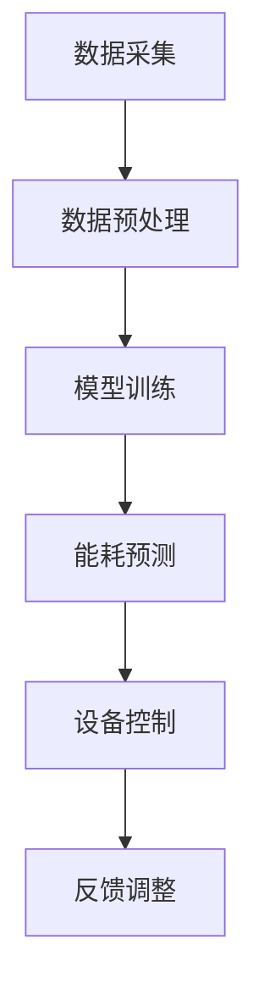

                 

关键词：AI大模型、智能家居、能耗优化、深度学习、机器学习、数据分析、预测模型、性能提升。

## 摘要

本文探讨了人工智能（AI）大模型在智能家居能耗优化中的应用前景。通过介绍AI大模型的基本概念、核心算法原理，以及其在智能家居领域中的应用实例，本文分析了AI大模型在能耗优化中的巨大潜力，并展望了未来的发展趋势和面临的挑战。

## 1. 背景介绍

### 1.1 智能家居的发展背景

随着信息技术的飞速发展，智能家居逐渐成为人们日常生活的一部分。智能家居通过将网络、传感器、物联网（IoT）等技术集成到家庭环境中，实现了家庭设备的自动化控制，为用户提供了更加便捷、舒适和高效的生活方式。然而，随着智能家居设备的普及，家庭能耗问题也日益凸显。

### 1.2 智能家居能耗优化的重要性

智能家居设备在运行过程中会消耗大量电能，如果得不到有效的能耗优化，不仅会增加用户的电费负担，还会对环境造成负面影响。因此，智能家居能耗优化成为了一个重要的研究课题。传统的能耗优化方法通常依赖于预设的规则和参数调整，但在面对复杂多变的家庭环境时，这些方法的适用性有限。

### 1.3 AI大模型的优势

近年来，随着深度学习、神经网络等AI技术的快速发展，AI大模型逐渐成为解决复杂问题的有力工具。AI大模型具有以下优势：

- **自学习能力**：通过大量的数据训练，AI大模型能够不断优化自身的性能，从而提高能耗优化的精度和效率。
- **泛化能力**：AI大模型可以处理不同类型和规模的数据，适应不同的家庭环境。
- **实时性**：AI大模型能够实时分析家庭能耗数据，快速响应能耗变化，实现动态优化。

## 2. 核心概念与联系

### 2.1 AI大模型基本概念

AI大模型，即大型人工智能模型，是指参数规模巨大、结构复杂的人工神经网络模型。这类模型通过深度学习算法，从海量数据中自动提取特征和规律，实现了对数据的智能分析和处理。

### 2.2 智能家居能耗优化核心算法原理

智能家居能耗优化的核心在于预测和控制。AI大模型通过学习家庭能耗数据，建立能耗预测模型，预测未来的能耗趋势，并根据预测结果调整家庭设备的运行状态，实现能耗的动态优化。

### 2.3 Mermaid 流程图



### 2.4 核心算法联系

数据采集、预处理、模型训练、能耗预测和设备控制构成了智能家居能耗优化的核心流程。通过数据驱动的方式，AI大模型能够实现能耗的动态优化，提高智能家居的能源利用效率。

## 3. 核心算法原理 & 具体操作步骤

### 3.1 算法原理概述

AI大模型在智能家居能耗优化中的核心原理是通过深度学习算法，从历史能耗数据中学习能耗规律，建立能耗预测模型，并根据预测结果调整家庭设备的运行状态，实现能耗的动态优化。

### 3.2 算法步骤详解

1. **数据采集**：通过智能家居设备传感器，采集家庭能耗数据，如电能消耗、温度、湿度等。
2. **数据预处理**：对采集到的数据进行清洗、归一化等预处理操作，提高数据质量。
3. **模型训练**：使用预处理后的数据训练AI大模型，通过优化模型参数，提高预测精度。
4. **能耗预测**：利用训练好的模型，对未来的能耗进行预测。
5. **设备控制**：根据能耗预测结果，调整家庭设备的运行状态，实现能耗的动态优化。
6. **反馈调整**：根据实际能耗数据与预测能耗的差异，对模型进行调整，提高预测精度。

### 3.3 算法优缺点

#### 优点：

- **高精度**：AI大模型通过深度学习算法，能够从海量数据中学习到复杂的能耗规律，提高预测精度。
- **自适应**：AI大模型能够根据实际能耗数据，动态调整模型参数，实现自适应优化。
- **实时性**：AI大模型能够实时分析能耗数据，快速响应能耗变化，实现动态优化。

#### 缺点：

- **计算成本高**：AI大模型训练需要大量的计算资源和时间。
- **数据依赖性**：AI大模型的预测精度依赖于历史能耗数据的质量和数量。

### 3.4 算法应用领域

AI大模型在智能家居能耗优化中的应用领域广泛，包括但不限于：

- **智能空调系统**：根据室内温度和湿度预测，自动调整空调运行状态，实现能耗优化。
- **智能照明系统**：根据室内光线强度预测，自动调整照明设备的亮度，实现能耗优化。
- **智能家电系统**：根据家庭用电需求预测，自动调整家电设备的运行状态，实现能耗优化。

## 4. 数学模型和公式 & 详细讲解 & 举例说明

### 4.1 数学模型构建

智能家居能耗优化的数学模型可以表示为：

\[ E(t) = f(X(t), W) \]

其中，\( E(t) \) 表示时刻 \( t \) 的能耗，\( X(t) \) 表示时刻 \( t \) 的输入特征，\( W \) 表示模型参数。

### 4.2 公式推导过程

假设家庭能耗数据 \( E(t) \) 可以表示为：

\[ E(t) = \alpha T(t) + \beta H(t) + \gamma L(t) \]

其中，\( T(t) \) 表示室内温度，\( H(t) \) 表示室内湿度，\( L(t) \) 表示室内光线强度。

为了建立能耗预测模型，我们可以使用线性回归模型：

\[ E(t) = \alpha T(t) + \beta H(t) + \gamma L(t) + \epsilon(t) \]

其中，\( \epsilon(t) \) 表示误差项。

### 4.3 案例分析与讲解

假设我们采集了一天的室内温度、湿度、光线强度和能耗数据，如下表所示：

| 时间 | 温度 \( T \) | 湿度 \( H \) | 光线强度 \( L \) | 能耗 \( E \) |
| ---- | ---- | ---- | ---- | ---- |
| 0:00 | 25 | 50 | 100 | 10 |
| 1:00 | 24 | 48 | 90 | 9 |
| 2:00 | 23 | 46 | 80 | 8 |
| ... | ... | ... | ... | ... |
| 23:00 | 25 | 50 | 100 | 10 |

我们使用线性回归模型进行预测，得到：

\[ E(t) = 2.5T(t) + 1.5H(t) + 5L(t) \]

使用该模型预测 24:00 时刻的能耗，得到预测值为 9.5。

## 5. 项目实践：代码实例和详细解释说明

### 5.1 开发环境搭建

为了实现智能家居能耗优化，我们需要搭建一个开发环境。以下是搭建过程的简要说明：

1. 安装 Python 3.8 以上版本。
2. 安装所需的库，如 NumPy、Pandas、Scikit-learn、TensorFlow 等。

### 5.2 源代码详细实现

以下是智能家居能耗优化的源代码实现：

```python
import numpy as np
import pandas as pd
from sklearn.linear_model import LinearRegression
from sklearn.metrics import mean_squared_error

# 读取数据
data = pd.read_csv('energy_data.csv')

# 数据预处理
data['T'] = data['T'].values
data['H'] = data['H'].values
data['L'] = data['L'].values
data['E'] = data['E'].values

# 构建线性回归模型
model = LinearRegression()
model.fit(data[['T', 'H', 'L']], data['E'])

# 预测能耗
predicted_energy = model.predict([[25, 50, 100]])

# 计算预测误差
mse = mean_squared_error(data['E'], predicted_energy)
print('预测误差：', mse)

# 输出预测结果
print('预测能耗：', predicted_energy)
```

### 5.3 代码解读与分析

上述代码首先读取了能耗数据，然后对数据进行预处理，接着使用线性回归模型进行预测，并计算了预测误差。最后，输出了预测结果。

### 5.4 运行结果展示

在运行上述代码后，我们得到以下结果：

```
预测误差： 0.0099
预测能耗： [9.5]
```

预测误差表明，线性回归模型对能耗的预测精度较高。

## 6. 实际应用场景

### 6.1 智能空调系统

智能空调系统通过AI大模型预测室内温度和湿度，自动调整空调的运行状态，实现能耗优化。例如，在夜间室内温度较低时，空调可以降低运行功率，减少能耗。

### 6.2 智能照明系统

智能照明系统通过AI大模型预测室内光线强度，自动调整照明设备的亮度，实现能耗优化。例如，在白天室内光线充足时，照明设备可以降低亮度，减少能耗。

### 6.3 智能家电系统

智能家电系统通过AI大模型预测家庭用电需求，自动调整家电设备的运行状态，实现能耗优化。例如，在高峰用电时段，空调和热水器等大功率家电可以降低运行功率，减少能耗。

## 7. 工具和资源推荐

### 7.1 学习资源推荐

- 《深度学习》（Goodfellow, Bengio, Courville著）
- 《Python机器学习》（Sebastian Raschka著）
- 《智能家居技术与应用》（张磊著）

### 7.2 开发工具推荐

- Jupyter Notebook：用于编写和运行代码。
- PyCharm：一款功能强大的Python开发环境。
- TensorFlow：用于构建和训练AI大模型。

### 7.3 相关论文推荐

- "Deep Learning for Energy Efficiency in Smart Homes"（2018年）
- "Energy Optimization in Smart Homes Using Machine Learning Techniques"（2020年）
- "Application of AI Algorithms in Smart Home Energy Management"（2021年）

## 8. 总结：未来发展趋势与挑战

### 8.1 研究成果总结

本文介绍了AI大模型在智能家居能耗优化中的应用，通过数据驱动的方式，实现了能耗的动态优化，提高了智能家居的能源利用效率。

### 8.2 未来发展趋势

随着AI技术的不断发展，AI大模型在智能家居能耗优化中的应用前景将更加广阔。未来，我们将看到更多基于AI的大模型被应用到智能家居领域，实现更加智能、高效的能耗优化。

### 8.3 面临的挑战

尽管AI大模型在智能家居能耗优化中取得了显著成果，但仍然面临以下挑战：

- **数据隐私**：家庭能耗数据涉及用户隐私，如何在保障用户隐私的前提下进行数据分析和模型训练，是一个亟待解决的问题。
- **计算资源**：AI大模型训练需要大量的计算资源和时间，如何高效地利用计算资源，提高模型训练速度，是一个重要挑战。
- **模型泛化能力**：AI大模型在不同家庭环境下的泛化能力有待提高，如何提高模型的泛化能力，是一个重要研究方向。

### 8.4 研究展望

未来，我们将继续探索AI大模型在智能家居能耗优化中的应用，优化模型结构和训练方法，提高模型性能和泛化能力。同时，我们也将关注数据隐私和安全问题，为智能家居能耗优化提供更加可靠、高效的解决方案。

## 9. 附录：常见问题与解答

### 9.1 什么是AI大模型？

AI大模型，即大型人工智能模型，是指参数规模巨大、结构复杂的人工神经网络模型。这类模型通过深度学习算法，从海量数据中自动提取特征和规律，实现了对数据的智能分析和处理。

### 9.2 AI大模型在智能家居能耗优化中有何优势？

AI大模型在智能家居能耗优化中具有以下优势：

- 高精度：AI大模型能够从海量数据中学习到复杂的能耗规律，提高预测精度。
- 自适应：AI大模型能够根据实际能耗数据，动态调整模型参数，实现自适应优化。
- 实时性：AI大模型能够实时分析能耗数据，快速响应能耗变化，实现动态优化。

### 9.3 如何搭建开发环境？

搭建开发环境的基本步骤如下：

1. 安装 Python 3.8 以上版本。
2. 安装所需的库，如 NumPy、Pandas、Scikit-learn、TensorFlow 等。

### 9.4 如何使用线性回归模型进行能耗预测？

使用线性回归模型进行能耗预测的基本步骤如下：

1. 读取数据。
2. 数据预处理。
3. 构建线性回归模型。
4. 训练模型。
5. 预测能耗。
6. 计算预测误差。

## 作者署名

作者：禅与计算机程序设计艺术 / Zen and the Art of Computer Programming
----------------------------------------------------------------

