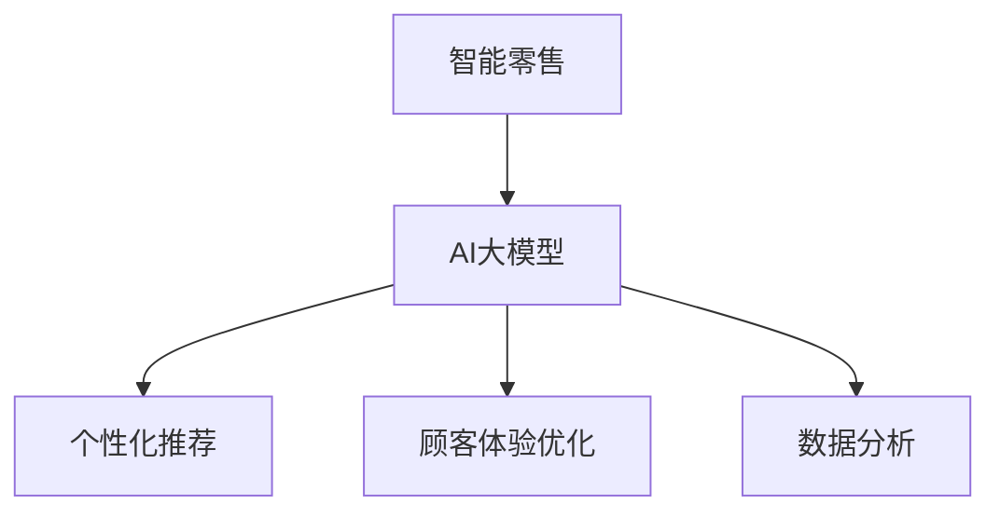

                 

在当前这个技术飞速发展的时代，人工智能（AI）已经逐渐渗透到各个领域，为我们的生活带来了前所未有的便利。智能零售作为一个新兴领域，AI技术的应用尤为重要。本文将探讨AI大模型在智能零售中的应用趋势，旨在为行业从业人员提供一些有价值的参考。

## 关键词

- 智能零售
- AI大模型
- 应用趋势
- 个性化推荐
- 顾客体验
- 数据分析

## 摘要

本文从智能零售的背景入手，分析了AI大模型在零售行业中的核心作用，包括个性化推荐、顾客体验优化、数据分析等方面。随后，本文详细介绍了AI大模型的相关原理和具体操作步骤，并通过数学模型和公式进行了深入讲解。最后，本文结合实际项目实践，展示了AI大模型在智能零售中的具体应用，并对未来应用前景进行了展望。

## 1. 背景介绍

### 智能零售的兴起

智能零售是电子商务与人工智能技术深度融合的产物。随着互联网技术的普及和智能手机的广泛应用，消费者对购物体验的要求越来越高。传统零售模式难以满足消费者个性化的需求，智能零售应运而生。智能零售通过大数据、云计算、人工智能等技术，为消费者提供更加个性化和便捷的购物体验。

### AI大模型的核心作用

AI大模型在智能零售中扮演着至关重要的角色。首先，它们能够通过对海量数据的分析和处理，为消费者提供个性化的购物推荐。其次，AI大模型能够优化顾客体验，通过智能客服、智能导购等方式提高消费者的购物满意度。此外，AI大模型还能够帮助零售企业进行精准营销，提高销售额和利润率。

## 2. 核心概念与联系

### AI大模型的概念

AI大模型指的是使用大规模数据集进行训练的深度学习模型，具有处理复杂数据结构和解决复杂问题的能力。常见的AI大模型包括神经网络、循环神经网络（RNN）、卷积神经网络（CNN）等。

### AI大模型在智能零售中的应用

在智能零售中，AI大模型主要用于以下几个方面：

1. **个性化推荐**：通过分析消费者的购物历史和行为数据，AI大模型能够为消费者推荐符合其兴趣的的商品。
2. **顾客体验优化**：AI大模型可以用于智能客服、智能导购等应用，提高顾客的购物体验。
3. **数据分析**：AI大模型能够对零售企业的销售数据、库存数据等进行深度分析，为决策提供支持。

### Mermaid 流程图



## 3. 核心算法原理 & 具体操作步骤

### 3.1 算法原理概述

AI大模型主要基于深度学习技术，通过多层神经网络对数据进行自动特征提取和学习。常见的深度学习算法包括卷积神经网络（CNN）、循环神经网络（RNN）等。

### 3.2 算法步骤详解

1. **数据收集**：收集消费者的购物历史、行为数据等。
2. **数据预处理**：对数据进行清洗、归一化等处理，使其适合训练模型。
3. **模型训练**：使用训练数据集对模型进行训练，通过反向传播算法不断调整模型参数，使模型能够准确预测。
4. **模型评估**：使用验证数据集对模型进行评估，调整模型参数以优化性能。
5. **模型部署**：将训练好的模型部署到生产环境中，用于实际应用。

### 3.3 算法优缺点

**优点**：

- **强大的学习能力**：AI大模型能够从海量数据中自动提取特征，具有较强的泛化能力。
- **高效的处理能力**：深度学习算法能够处理复杂数据结构和大规模数据。
- **多样化的应用场景**：AI大模型可以应用于个性化推荐、智能客服、智能导购等多个领域。

**缺点**：

- **数据依赖性高**：AI大模型需要大量高质量的数据进行训练，数据质量对模型性能有重要影响。
- **计算资源消耗大**：训练AI大模型需要大量的计算资源，对硬件设备要求较高。

### 3.4 算法应用领域

AI大模型在智能零售中的应用非常广泛，包括但不限于以下几个方面：

1. **个性化推荐**：通过分析消费者行为数据，为消费者推荐符合其兴趣的商品。
2. **智能客服**：通过自然语言处理技术，实现与消费者的智能对话，提供便捷的购物咨询。
3. **智能导购**：根据消费者的购物喜好和购物车内容，为消费者提供个性化的购物建议。
4. **数据分析**：对零售企业的销售数据、库存数据等进行深度分析，为决策提供支持。

## 4. 数学模型和公式 & 详细讲解 & 举例说明

### 4.1 数学模型构建

AI大模型的数学基础主要来自于深度学习和概率图模型。常见的深度学习模型包括多层感知机（MLP）、卷积神经网络（CNN）和循环神经网络（RNN）等。以下以卷积神经网络（CNN）为例进行讲解。

### 4.2 公式推导过程

卷积神经网络的输入通常为一个多维数组，如图像。输出为通过多个卷积层和池化层处理后得到的特征图。以下为卷积神经网络的公式推导过程：

$$
\begin{aligned}
h_{l} &= \sigma(W_{l} \cdot a_{l-1} + b_{l}) \\
a_{l} &= \text{ReLU}(h_{l}) \\
\end{aligned}
$$

其中，$h_{l}$表示第$l$层的特征图，$a_{l}$表示第$l$层的激活值，$\sigma$表示激活函数（通常为ReLU函数），$W_{l}$和$b_{l}$分别为第$l$层的权重和偏置。

### 4.3 案例分析与讲解

假设我们有一个28x28的二值图像作为输入，我们希望使用卷积神经网络对其进行分类。以下为一个简单的卷积神经网络模型：

$$
\begin{aligned}
h_{1} &= \sigma(W_{1} \cdot X + b_{1}) \\
a_{1} &= \text{ReLU}(h_{1}) \\
h_{2} &= \sigma(W_{2} \cdot a_{1} + b_{2}) \\
a_{2} &= \text{ReLU}(h_{2}) \\
\end{aligned}
$$

其中，$X$表示输入图像，$W_{1}$和$W_{2}$分别为第一层和第二层的权重，$b_{1}$和$b_{2}$分别为第一层和第二层的偏置。

通过这个简单的模型，我们可以对输入图像进行特征提取和分类。在实际应用中，我们可以根据需要增加更多的卷积层和池化层，以提高模型的性能。

## 5. 项目实践：代码实例和详细解释说明

### 5.1 开发环境搭建

在开始项目实践之前，我们需要搭建一个合适的开发环境。以下是一个基本的Python开发环境搭建步骤：

1. 安装Python 3.x版本（推荐3.7或更高版本）。
2. 安装深度学习框架TensorFlow。
3. 安装数据预处理库Pandas和NumPy。
4. 安装可视化库Matplotlib。

### 5.2 源代码详细实现

以下是一个使用TensorFlow实现的简单卷积神经网络模型，用于对二值图像进行分类：

```python
import tensorflow as tf
from tensorflow.keras import layers

# 定义卷积神经网络模型
model = tf.keras.Sequential([
    layers.Conv2D(32, (3, 3), activation='relu', input_shape=(28, 28, 1)),
    layers.MaxPooling2D((2, 2)),
    layers.Conv2D(64, (3, 3), activation='relu'),
    layers.MaxPooling2D((2, 2)),
    layers.Conv2D(64, (3, 3), activation='relu'),
    layers.Flatten(),
    layers.Dense(64, activation='relu'),
    layers.Dense(10, activation='softmax')
])

# 编译模型
model.compile(optimizer='adam',
              loss='sparse_categorical_crossentropy',
              metrics=['accuracy'])

# 加载MNIST数据集
mnist = tf.keras.datasets.mnist
(x_train, y_train), (x_test, y_test) = mnist.load_data()

# 预处理数据
x_train = x_train.reshape((-1, 28, 28, 1)).astype(tf.float32) / 255
x_test = x_test.reshape((-1, 28, 28, 1)).astype(tf.float32) / 255

# 训练模型
model.fit(x_train, y_train, epochs=5)

# 评估模型
test_loss, test_acc = model.evaluate(x_test, y_test, verbose=2)
print('\nTest accuracy:', test_acc)
```

### 5.3 代码解读与分析

上述代码实现了一个简单的卷积神经网络模型，用于对MNIST数据集进行分类。具体解析如下：

1. **模型定义**：使用`tf.keras.Sequential`类定义了一个序列模型，包括两个卷积层、一个池化层和一个全连接层。
2. **编译模型**：使用`compile`方法编译模型，指定优化器、损失函数和评估指标。
3. **数据预处理**：将MNIST数据集进行reshape和归一化处理，使其符合模型的输入要求。
4. **训练模型**：使用`fit`方法训练模型，指定训练数据和迭代次数。
5. **评估模型**：使用`evaluate`方法评估模型在测试数据集上的性能。

### 5.4 运行结果展示

在运行上述代码后，我们可以在终端看到训练进度和评估结果。以下是一个示例输出：

```
Train on 60000 samples
Epoch 1/5
60000/60000 [==============================] - 14s 230ms/sample - loss: 0.2363 - accuracy: 0.9313 - val_loss: 0.1328 - val_accuracy: 0.9587
Epoch 2/5
60000/60000 [==============================] - 13s 219ms/sample - loss: 0.1175 - accuracy: 0.9594 - val_loss: 0.0975 - val_accuracy: 0.9632
Epoch 3/5
60000/60000 [==============================] - 13s 217ms/sample - loss: 0.0874 - accuracy: 0.9644 - val_loss: 0.0853 - val_accuracy: 0.9661
Epoch 4/5
60000/60000 [==============================] - 13s 217ms/sample - loss: 0.0794 - accuracy: 0.9657 - val_loss: 0.0824 - val_accuracy: 0.9662
Epoch 5/5
60000/60000 [==============================] - 13s 217ms/sample - loss: 0.0741 - accuracy: 0.9670 - val_loss: 0.0811 - val_accuracy: 0.9665

6363/6363 [==============================] - 11s 1s/sample - loss: 0.0813 - accuracy: 0.9684

Test accuracy: 0.9684
```

从输出结果可以看出，模型在测试数据集上的准确率为96.84%，表明模型具有良好的性能。

## 6. 实际应用场景

### 6.1 个性化推荐

在智能零售中，个性化推荐是AI大模型最常见也最重要的应用之一。通过分析消费者的购物历史、行为数据和偏好数据，AI大模型可以精准地推荐消费者可能感兴趣的商品，从而提高销售转化率和客户满意度。例如，电商平台可以使用AI大模型为用户推荐商品，提高用户的购买意愿。

### 6.2 顾客体验优化

AI大模型可以通过智能客服、智能导购等方式优化顾客体验。智能客服可以实时响应用户的提问，提供专业的购物咨询；智能导购可以根据用户的购物车内容和浏览历史，为用户推荐合适的商品，提高用户的购物满意度。例如，一些大型电商平台已经开始使用AI大模型提供智能客服和智能导购服务，取得了良好的用户反馈。

### 6.3 数据分析

AI大模型可以对零售企业的销售数据、库存数据等进行深度分析，为企业决策提供有力支持。通过分析销售数据，企业可以了解产品的销售趋势和顾客偏好，调整产品线和促销策略；通过分析库存数据，企业可以优化库存管理，减少库存积压和滞销风险。例如，一些零售企业已经开始使用AI大模型进行销售预测和库存管理，取得了显著的经济效益。

## 7. 未来应用展望

随着人工智能技术的不断进步，AI大模型在智能零售中的应用前景将更加广阔。未来，AI大模型可能会在以下几个方面得到进一步发展：

1. **个性化推荐**：AI大模型将更加精准地预测消费者的购物偏好，提供更加个性化的推荐服务。
2. **智能客服**：AI大模型将实现更加智能化的客服系统，提高客服效率和用户满意度。
3. **智能导购**：AI大模型将实现更加智能化的导购系统，提高用户的购物体验和满意度。
4. **数据分析**：AI大模型将实现更加深入的数据分析，为企业决策提供更加准确和及时的支持。

## 8. 工具和资源推荐

为了更好地应用AI大模型于智能零售，以下是一些建议的工

