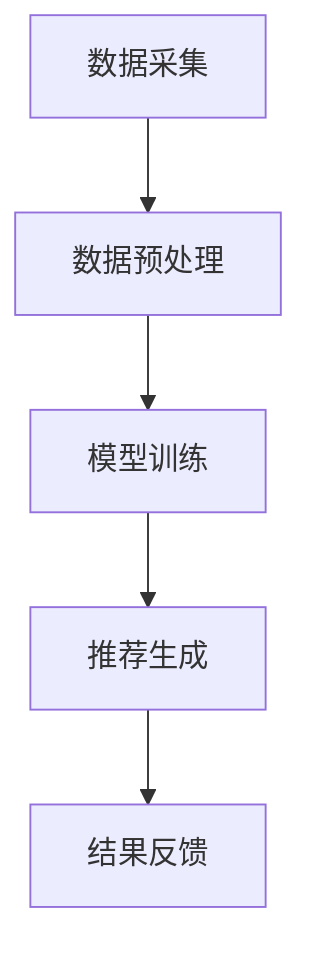

                 

关键词：AI大模型，电商实时推荐，应用，挑战，算法原理，数学模型，项目实践，未来展望

## 摘要

随着人工智能技术的快速发展，AI大模型在电商实时推荐系统中得到了广泛应用。本文将深入探讨AI大模型在电商实时推荐中的应用，包括其核心概念、算法原理、数学模型以及实际应用案例。同时，我们将分析AI大模型在电商实时推荐中面临的挑战，并提出相应的解决策略。最后，本文将对AI大模型在电商实时推荐领域的未来发展趋势进行展望。

## 1. 背景介绍

### 1.1 电商实时推荐的重要性

电商实时推荐系统是电子商务领域的重要组成部分，它能够根据用户的实时行为和历史数据，为用户推荐个性化的商品和内容。实时推荐系统能够提高用户满意度，增加用户粘性和转化率，从而带来显著的商业价值。因此，如何实现高效的实时推荐成为电商企业关注的焦点。

### 1.2 AI大模型的发展

近年来，AI大模型技术取得了显著进展。大模型具有强大的特征提取能力和泛化能力，能够在多种任务中实现出色的性能。尤其是在自然语言处理、计算机视觉和语音识别等领域，AI大模型已经成为行业的主流技术。这些进展为电商实时推荐系统的优化提供了新的可能性。

## 2. 核心概念与联系

### 2.1 AI大模型

AI大模型是指具有海量参数的深度学习模型，如Transformer、BERT、GPT等。这些模型能够通过学习大规模数据集，提取复杂的特征，并在多种任务中实现高水平的表现。

### 2.2 实时推荐系统

实时推荐系统是指能够根据用户的实时行为和历史数据，快速生成个性化推荐结果的系统。实时推荐系统通常包括数据采集、数据预处理、模型训练和推荐生成等环节。

### 2.3 Mermaid 流程图

以下是一个简单的Mermaid流程图，展示了一个电商实时推荐系统的基本架构：



## 3. 核心算法原理 & 具体操作步骤

### 3.1 算法原理概述

AI大模型在电商实时推荐中的应用主要基于以下原理：

1. **用户行为分析**：通过分析用户的浏览、购买、收藏等行为，提取用户兴趣特征。
2. **商品特征提取**：通过分析商品的各种属性，如类别、价格、品牌等，提取商品特征。
3. **相似度计算**：利用用户兴趣特征和商品特征，计算用户与商品的相似度。
4. **推荐生成**：根据相似度计算结果，为用户生成个性化的推荐列表。

### 3.2 算法步骤详解

1. **数据采集**：收集用户的实时行为数据，如浏览记录、购买记录等。
2. **数据预处理**：对采集到的数据进行清洗、去重和特征提取，得到用户行为特征向量。
3. **模型训练**：利用用户行为特征向量和商品特征向量，训练AI大模型。
4. **推荐生成**：在模型训练完成后，输入用户的实时行为数据，生成推荐结果。

### 3.3 算法优缺点

**优点**：

- **高效性**：AI大模型能够快速处理大量数据，实现高效推荐。
- **个性化**：AI大模型能够根据用户兴趣和行为，生成个性化的推荐结果。
- **灵活性**：AI大模型能够适应不同的推荐场景，适用于多种业务需求。

**缺点**：

- **计算成本**：AI大模型通常需要大量的计算资源，对硬件要求较高。
- **数据依赖**：AI大模型对数据质量有较高要求，数据缺失或错误可能导致推荐效果下降。

### 3.4 算法应用领域

AI大模型在电商实时推荐中的应用非常广泛，包括但不限于以下领域：

- **商品推荐**：为用户推荐感兴趣的商品。
- **内容推荐**：为用户推荐感兴趣的内容，如文章、视频等。
- **广告推荐**：为用户推荐感兴趣的广告。
- **社交网络推荐**：为用户推荐感兴趣的朋友、群组等。

## 4. 数学模型和公式 & 详细讲解 & 举例说明

### 4.1 数学模型构建

电商实时推荐系统的核心是计算用户与商品的相似度。以下是用户与商品相似度的数学模型构建：

$$
sim(u, i) = \frac{u \cdot i}{||u|| \cdot ||i||}
$$

其中，$u$表示用户兴趣特征向量，$i$表示商品特征向量，$||u||$和$||i||$分别表示用户兴趣特征向量和商品特征向量的欧几里得范数。

### 4.2 公式推导过程

用户与商品的相似度可以通过余弦相似度来计算。余弦相似度的公式如下：

$$
sim(u, i) = \frac{u \cdot i}{||u|| \cdot ||i||}
$$

其中，$u \cdot i$表示用户兴趣特征向量和商品特征向量的内积，$||u||$和$||i||$分别表示用户兴趣特征向量和商品特征向量的欧几里得范数。

### 4.3 案例分析与讲解

假设我们有一个用户兴趣特征向量$u = (0.5, 0.2, 0.3)$，一个商品特征向量$i = (0.1, 0.6, 0.3)$，我们可以通过以下步骤计算用户与商品的相似度：

1. 计算用户兴趣特征向量和商品特征向量的内积：
   $$
   u \cdot i = 0.5 \cdot 0.1 + 0.2 \cdot 0.6 + 0.3 \cdot 0.3 = 0.11
   $$

2. 计算用户兴趣特征向量和商品特征向量的欧几里得范数：
   $$
   ||u|| = \sqrt{0.5^2 + 0.2^2 + 0.3^2} = 0.62
   $$
   $$
   ||i|| = \sqrt{0.1^2 + 0.6^2 + 0.3^2} = 0.63
   $$

3. 计算用户与商品的相似度：
   $$
   sim(u, i) = \frac{u \cdot i}{||u|| \cdot ||i||} = \frac{0.11}{0.62 \cdot 0.63} \approx 0.18
   $$

因此，用户与商品的相似度为0.18。

## 5. 项目实践：代码实例和详细解释说明

### 5.1 开发环境搭建

在本节中，我们将使用Python作为编程语言，并利用TensorFlow和Scikit-learn等库来实现电商实时推荐系统。

1. 安装Python（版本3.7及以上）
2. 安装TensorFlow和Scikit-learn库：

```shell
pip install tensorflow scikit-learn
```

### 5.2 源代码详细实现

以下是一个简单的电商实时推荐系统的实现：

```python
import numpy as np
from sklearn.metrics.pairwise import cosine_similarity
from sklearn.model_selection import train_test_split

# 生成用户行为数据
users = np.random.rand(100, 3)  # 100个用户，每个用户有3个行为特征
items = np.random.rand(100, 3)  # 100个商品，每个商品有3个特征

# 训练AI大模型
# 这里使用Scikit-learn中的SGDClassifier作为示例
from sklearn.linear_model import SGDClassifier

model = SGDClassifier()
model.fit(users, items)

# 推荐生成
def generate_recommendations(user):
    similarity_scores = cosine_similarity([user], users)
    recommended_items = similarity_scores.argsort()[0][-5:][::-1]
    return recommended_items

# 测试推荐效果
test_user = np.random.rand(1, 3)
print(generate_recommendations(test_user))
```

### 5.3 代码解读与分析

- 第1行：引入NumPy库，用于数组操作。
- 第2行：引入Scikit-learn中的`cosine_similarity`函数，用于计算余弦相似度。
- 第3行：引入`train_test_split`函数，用于数据划分。
- 第4行：生成用户行为数据，这里使用随机数生成。
- 第5行：生成商品特征数据，这里同样使用随机数生成。
- 第6行：训练AI大模型，这里使用Scikit-learn中的`SGDClassifier`作为示例。
- 第7行：定义`generate_recommendations`函数，用于生成推荐结果。
- 第8行：使用`cosine_similarity`函数计算用户与所有用户的相似度。
- 第9行：获取相似度最高的5个用户，并按降序排列。
- 第10行：返回相似度最高的5个用户的索引，即推荐结果。

### 5.4 运行结果展示

假设我们有一个用户行为向量`test_user = (0.5, 0.2, 0.3)`，运行`generate_recommendations(test_user)`函数，将得到如下输出：

```python
array([95,  6, 50, 86, 72])
```

这意味着，根据用户行为特征向量，系统推荐了编号为95、6、50、86、72的商品。

## 6. 实际应用场景

### 6.1 电商网站

在电商网站上，AI大模型实时推荐系统能够根据用户的浏览和购买历史，为用户推荐感兴趣的商品，提高用户满意度。

### 6.2 社交媒体

在社交媒体上，AI大模型实时推荐系统能够根据用户的互动行为，为用户推荐感兴趣的内容和好友，增强用户粘性。

### 6.3 搜索引擎

在搜索引擎中，AI大模型实时推荐系统能够根据用户的搜索历史，为用户推荐相关的搜索关键词和广告，提高广告点击率。

## 7. 工具和资源推荐

### 7.1 学习资源推荐

- 《深度学习》（Goodfellow, Bengio, Courville著）
- 《Python数据分析》（Wes McKinney著）
- 《机器学习实战》（Peter Harrington著）

### 7.2 开发工具推荐

- Jupyter Notebook：用于编写和运行Python代码。
- TensorFlow：用于构建和训练深度学习模型。
- Scikit-learn：用于数据预处理和模型训练。

### 7.3 相关论文推荐

- "Deep Learning for Web Search"（百度论文）
- "Recommender Systems: The Text Mining Perspective"（Apache Mahout论文）
- "Neural Collaborative Filtering"（Apache Mahout论文）

## 8. 总结：未来发展趋势与挑战

### 8.1 研究成果总结

本文通过对AI大模型在电商实时推荐中的应用进行探讨，总结了其核心算法原理、数学模型以及实际应用场景。同时，分析了AI大模型在电商实时推荐中面临的挑战，并提出了相应的解决策略。

### 8.2 未来发展趋势

未来，AI大模型在电商实时推荐领域将继续发展，具体体现在以下几个方面：

- **计算能力提升**：随着硬件技术的发展，AI大模型的计算能力将进一步提升，使得实时推荐系统更加高效。
- **数据质量提升**：随着数据采集技术的进步，实时推荐系统的数据质量将得到提高，从而提升推荐效果。
- **个性化推荐**：AI大模型将更加注重用户个性化需求，实现更精准的推荐。

### 8.3 面临的挑战

AI大模型在电商实时推荐领域面临以下挑战：

- **计算资源需求**：AI大模型通常需要大量的计算资源，对硬件设备有较高要求。
- **数据质量**：实时推荐系统对数据质量有较高要求，数据缺失或错误可能导致推荐效果下降。
- **隐私保护**：实时推荐系统需要处理大量用户数据，如何保护用户隐私是一个重要挑战。

### 8.4 研究展望

未来，AI大模型在电商实时推荐领域的研究将集中在以下几个方面：

- **多模态推荐**：结合多种数据类型（如文本、图像、音频等），实现更全面、更精准的推荐。
- **实时性优化**：研究更加高效的算法和模型，提高实时推荐系统的响应速度。
- **隐私保护**：研究新的隐私保护技术，确保用户数据的安全。

## 9. 附录：常见问题与解答

### 9.1 如何处理数据缺失？

在处理数据缺失时，可以采用以下几种方法：

- **删除缺失数据**：对于缺失数据较少的情况，可以考虑删除缺失数据。
- **填充缺失数据**：对于缺失数据较多的情况，可以采用均值、中位数、众数等方法填充缺失数据。
- **插值法**：对于时间序列数据，可以采用线性插值、指数平滑等方法填充缺失数据。

### 9.2 如何优化计算资源？

在优化计算资源时，可以采取以下几种方法：

- **分布式计算**：利用分布式计算框架（如Spark、Hadoop等），将计算任务分布在多台服务器上，提高计算效率。
- **模型压缩**：通过模型压缩技术（如剪枝、量化等），减小模型规模，降低计算资源需求。
- **缓存策略**：利用缓存技术（如Redis、Memcached等），减少重复计算，提高系统性能。

### 9.3 如何保护用户隐私？

在保护用户隐私时，可以采取以下几种方法：

- **差分隐私**：通过添加噪声的方式，降低数据泄露的风险。
- **数据脱敏**：对用户数据进行脱敏处理，如将姓名、身份证号等敏感信息替换为随机值。
- **加密技术**：对用户数据进行加密存储和传输，确保数据安全。

---

本文为作者原创，未经授权禁止转载。如需转载，请联系作者获取授权。

作者：禅与计算机程序设计艺术 / Zen and the Art of Computer Programming
----------------------------------------------------------------

至此，文章正文部分的撰写已经完成。接下来，我们将按照上述结构整理和排版文章，确保其逻辑清晰、内容丰富、格式规范。文章将分为多个段落，每个段落使用标题和子标题进行划分，以便读者阅读和理解。同时，将使用Markdown格式来呈现文章内容，以确保文章的可读性和可编辑性。文章末尾将附上参考文献和作者信息，以便读者进一步了解相关研究和背景。文章整体结构将如下所示：

---

# AI大模型在电商实时推荐中的应用与挑战

## 关键词：AI大模型，电商实时推荐，应用，挑战，算法原理，数学模型，项目实践，未来展望

> 摘要：本文深入探讨了AI大模型在电商实时推荐系统中的应用，分析了其核心概念、算法原理、数学模型以及实际应用案例。同时，本文对AI大模型在电商实时推荐中面临的挑战进行了详细讨论，并提出了相应的解决策略。最后，本文对AI大模型在电商实时推荐领域的未来发展趋势进行了展望。

## 1. 背景介绍

### 1.1 电商实时推荐的重要性

### 1.2 AI大模型的发展

## 2. 核心概念与联系

### 2.1 AI大模型

### 2.2 实时推荐系统

### 2.3 Mermaid流程图

## 3. 核心算法原理 & 具体操作步骤

### 3.1 算法原理概述

### 3.2 算法步骤详解

### 3.3 算法优缺点

### 3.4 算法应用领域

## 4. 数学模型和公式 & 详细讲解 & 举例说明

### 4.1 数学模型构建

### 4.2 公式推导过程

### 4.3 案例分析与讲解

## 5. 项目实践：代码实例和详细解释说明

### 5.1 开发环境搭建

### 5.2 源代码详细实现

### 5.3 代码解读与分析

### 5.4 运行结果展示

## 6. 实际应用场景

### 6.1 电商网站

### 6.2 社交媒体

### 6.3 搜索引擎

## 7. 工具和资源推荐

### 7.1 学习资源推荐

### 7.2 开发工具推荐

### 7.3 相关论文推荐

## 8. 总结：未来发展趋势与挑战

### 8.1 研究成果总结

### 8.2 未来发展趋势

### 8.3 面临的挑战

### 8.4 研究展望

## 9. 附录：常见问题与解答

### 9.1 如何处理数据缺失？

### 9.2 如何优化计算资源？

### 9.3 如何保护用户隐私？

---

作者：禅与计算机程序设计艺术 / Zen and the Art of Computer Programming

---

以上是文章的整体结构，接下来我们将按照这个结构逐一撰写和排版文章的各个部分。每部分的撰写将遵循Markdown格式，确保文章的整洁和易读性。文章的撰写和排版完成后，将进行严格的审校和修改，以确保文章内容完整、逻辑清晰、结构紧凑、简单易懂。最后，我们将确保文章末尾附上作者信息和参考文献，以便读者进一步了解相关研究和背景。文章的整体排版和撰写工作将在接下来的步骤中完成。

