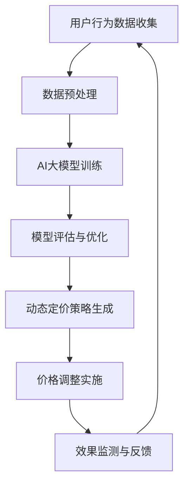

                 

关键词：AI大模型、电商平台、动态定价策略、机器学习、深度学习、智能推荐系统、用户行为分析、数据挖掘、决策优化

## 摘要

本文旨在探讨AI大模型在电商平台动态定价策略中的应用。通过分析电商平台的运营特点，本文首先介绍了AI大模型的核心概念和基本原理。随后，文章详细阐述了如何利用AI大模型对用户行为进行分析和预测，以及如何通过这些分析结果优化电商平台的价格策略。本文还通过实例展示了AI大模型在实际应用中的效果和潜力，并对未来AI大模型在电商平台动态定价策略中的应用前景进行了展望。

## 1. 背景介绍

随着互联网和电子商务的迅猛发展，电商平台已经成为了现代零售业的重要组成部分。电商平台通过提供商品展示、购买、支付等一系列在线服务，极大地改变了消费者的购物习惯，同时也为商家提供了巨大的市场机会。然而，在竞争激烈的电商环境中，如何制定有效的定价策略成为商家成功的关键。

传统的定价策略主要依赖于历史数据和经验，通常采用固定价格或者市场跟随策略。然而，这种策略在应对快速变化的市场环境和复杂多变的用户需求时显得力不从心。随着人工智能技术的不断发展，特别是AI大模型的崛起，为电商平台提供了新的定价思路和方法。

AI大模型是一种基于深度学习和机器学习的算法，它通过学习和分析大量数据，能够自动发现数据中的模式和规律，从而做出精准的预测和决策。在电商平台中，AI大模型可以用来分析用户行为，预测市场需求，优化库存管理，以及制定动态定价策略。这种基于大数据和人工智能的定价策略，不仅能够提高商家的利润，还能提升用户体验和客户满意度。

本文将围绕AI大模型在电商平台动态定价策略中的应用，详细探讨其核心概念、算法原理、数学模型、应用实例以及未来展望。

## 2. 核心概念与联系

### 2.1 AI大模型的概念

AI大模型（Large-scale Artificial Intelligence Model）是指那些规模庞大、参数众多、计算复杂度高的深度学习模型。这些模型通常通过训练大规模数据集来学习复杂的数据特征和模式，从而实现高效的数据分析和决策支持。AI大模型可以分为两大类：基于神经网络的模型和基于传统机器学习算法的模型。其中，基于神经网络的模型，如深度神经网络（Deep Neural Network, DNN）、卷积神经网络（Convolutional Neural Network, CNN）、循环神经网络（Recurrent Neural Network, RNN）等，是目前应用最广泛的AI大模型。

### 2.2 动态定价策略

动态定价策略（Dynamic Pricing Strategy）是一种根据市场需求、竞争对手行为、用户行为等因素实时调整价格的策略。动态定价策略的目标是通过灵活的价格调整，最大化利润或市场份额。在电商平台中，动态定价策略可以采用基于历史数据的统计分析模型，也可以采用基于AI大模型的智能定价系统。

### 2.3 用户行为分析

用户行为分析（User Behavior Analysis）是电商平台了解用户需求和购物习惯的重要手段。通过分析用户在网站上的浏览、搜索、购买等行为数据，电商平台可以识别用户的偏好、预测用户的需求，从而制定更加精准的营销策略和定价策略。

### 2.4 Mermaid流程图

以下是一个简化的AI大模型在电商平台动态定价策略中的应用流程：



### 2.5 核心概念联系

AI大模型、动态定价策略和用户行为分析是电商平台实现智能定价的关键组成部分。AI大模型通过分析用户行为数据，可以预测用户的需求和购买行为，进而生成动态定价策略。这个策略通过实时调整商品价格，旨在最大化商家的利润或市场份额。因此，这三者之间是相互关联、相互促进的。

## 3. 核心算法原理 & 具体操作步骤

### 3.1 算法原理概述

在电商平台动态定价策略中，AI大模型的核心作用在于通过深度学习和机器学习算法，对用户行为数据进行挖掘和分析，从而生成精准的定价策略。其基本原理可以分为以下几个步骤：

1. **数据收集**：收集用户在电商平台上的行为数据，包括浏览历史、搜索记录、购买行为、评价反馈等。
2. **数据预处理**：对收集到的数据进行清洗、转换和集成，以便后续的分析和处理。
3. **模型训练**：使用预处理的用户行为数据，训练AI大模型，使其能够学习并识别数据中的模式和规律。
4. **模型评估**：通过测试数据集对训练好的模型进行评估，确保其预测准确性和稳定性。
5. **定价策略生成**：利用训练好的AI大模型，根据实时用户行为数据，生成动态定价策略。
6. **价格调整实施**：将生成的定价策略应用于电商平台，实时调整商品价格。
7. **效果监测与反馈**：对定价策略实施后的效果进行监测，并根据反馈数据对模型进行调整和优化。

### 3.2 算法步骤详解

1. **数据收集**：
   - **来源**：电商平台可以通过API接口、日志文件、用户反馈等多种途径收集用户行为数据。
   - **类型**：包括用户ID、浏览时长、点击率、购买数量、评价等级等。

2. **数据预处理**：
   - **清洗**：去除重复数据、错误数据和缺失数据。
   - **转换**：将不同类型的数据转换为统一的格式，如将日期转换为数值。
   - **集成**：将不同来源的数据进行合并，形成一个综合的用户行为数据集。

3. **模型训练**：
   - **算法选择**：选择合适的深度学习算法，如DNN、CNN、RNN等。
   - **训练过程**：使用预处理后的用户行为数据，通过反向传播算法训练模型，调整模型的参数。
   - **验证**：使用交叉验证方法，确保模型在不同数据集上的泛化能力。

4. **模型评估**：
   - **评估指标**：使用准确率、召回率、F1分数等指标评估模型的性能。
   - **优化**：根据评估结果调整模型参数，优化模型性能。

5. **定价策略生成**：
   - **预测**：使用训练好的AI大模型，预测用户对商品的购买概率。
   - **策略生成**：根据预测结果和业务目标，生成动态定价策略。

6. **价格调整实施**：
   - **实时调整**：根据用户行为数据和定价策略，实时调整商品价格。
   - **自动化**：使用自动化系统，如ETL（提取、转换、加载）工具，实现价格的自动调整。

7. **效果监测与反馈**：
   - **监测**：监控定价策略实施后的销售数据、用户反馈等。
   - **反馈**：根据监测结果，对定价策略进行调整和优化。

### 3.3 算法优缺点

**优点**：
- **精准预测**：通过深度学习和机器学习算法，AI大模型能够准确预测用户的购买行为，提高定价策略的准确性。
- **实时调整**：动态定价策略可以根据实时用户行为数据进行调整，提高市场的反应速度。
- **优化利润**：通过优化价格策略，提高销售量和利润率。

**缺点**：
- **计算复杂度**：AI大模型的训练和预测过程需要大量的计算资源，对硬件要求较高。
- **数据依赖**：模型的性能高度依赖于数据的质量和数量，数据缺失或不准确可能导致模型失效。
- **成本**：开发和维护AI大模型需要专业的技术和成本投入。

### 3.4 算法应用领域

AI大模型在电商平台动态定价策略中的应用非常广泛，主要包括以下领域：

- **零售行业**：通过动态定价策略，零售商可以更好地应对市场需求的变化，提高销售额和利润率。
- **旅游行业**：旅游平台可以通过动态定价策略，根据旅游高峰期和淡季调整价格，优化收益。
- **酒店行业**：酒店可以通过动态定价策略，根据预订情况调整房价，提高入住率。
- **物流行业**：物流公司可以通过动态定价策略，根据运输需求和成本调整运费，优化运输效率。

## 4. 数学模型和公式 & 详细讲解 & 举例说明

### 4.1 数学模型构建

在电商平台动态定价策略中，AI大模型通常采用以下数学模型：

1. **用户行为预测模型**：
   - 输入：用户行为数据（如浏览时长、点击率、购买数量等）。
   - 输出：用户对商品的购买概率。

   数学表达式为：
   $$P(\text{购买} | \text{行为数据}) = f(\text{行为数据})$$
   其中，$f(\text{行为数据})$是一个非线性函数，通过神经网络实现。

2. **定价策略模型**：
   - 输入：用户购买概率、成本价格、竞争对手价格等。
   - 输出：商品价格。

   数学表达式为：
   $$P(\text{价格} | \text{购买概率}, \text{成本价格}, \text{竞争对手价格}) = g(\text{购买概率}, \text{成本价格}, \text{竞争对手价格})$$
   其中，$g(\text{购买概率}, \text{成本价格}, \text{竞争对手价格})$是一个优化函数，通过机器学习算法实现。

### 4.2 公式推导过程

1. **用户行为预测模型**：

   假设用户行为数据$x$是一个多维向量，神经网络包含多个隐层，每层输出为$h_i$，则有：

   $$h_1 = \sigma(W_1x + b_1)$$
   $$h_2 = \sigma(W_2h_1 + b_2)$$
   $$...$$
   $$h_n = \sigma(W_nh_{n-1} + b_n)$$
   $$P(\text{购买} | \text{行为数据}) = h_n$$

   其中，$\sigma$是激活函数，$W_i$和$b_i$分别是权重和偏置。

2. **定价策略模型**：

   假设用户购买概率$p$、成本价格$c$和竞争对手价格$r$是已知的，则定价策略可以通过以下优化问题得到：

   $$P(\text{价格} | \text{购买概率}, \text{成本价格}, \text{竞争对手价格}) = \arg\max P(\text{利润} | \text{价格}, \text{购买概率}, \text{成本价格}, \text{竞争对手价格})$$

   其中，$P(\text{利润} | \text{价格}, \text{购买概率}, \text{成本价格}, \text{竞争对手价格})$是一个关于价格的利润函数，可以通过机器学习算法优化得到最优价格。

### 4.3 案例分析与讲解

假设一个电商平台想要通过AI大模型制定动态定价策略，以提高销售额和利润率。以下是具体的案例分析：

1. **数据收集**：
   - 收集过去一年的用户行为数据，包括浏览时长、点击率、购买数量、评价等级等。

2. **数据预处理**：
   - 数据清洗：去除重复数据和缺失数据。
   - 数据转换：将日期转换为数值，将类别数据转换为编码。

3. **模型训练**：
   - 选择一个适合的神经网络结构，如DNN。
   - 使用预处理后的数据训练模型，调整模型参数。

4. **模型评估**：
   - 使用测试数据集评估模型性能，调整模型参数以优化性能。

5. **定价策略生成**：
   - 使用训练好的模型预测用户购买概率。
   - 根据用户购买概率、成本价格和竞争对手价格，生成动态定价策略。

6. **价格调整实施**：
   - 实时监控用户行为数据，根据定价策略调整商品价格。

7. **效果监测与反馈**：
   - 监控定价策略实施后的销售额和利润率。
   - 根据反馈数据调整模型参数和定价策略。

通过这个案例分析，我们可以看到，AI大模型在电商平台动态定价策略中的应用可以显著提高商家的运营效率和利润率。然而，要实现这一目标，需要专业的技术和大量的数据支持。

## 5. 项目实践：代码实例和详细解释说明

### 5.1 开发环境搭建

为了实现AI大模型在电商平台动态定价策略中的应用，我们需要搭建一个适合的开发环境。以下是具体的步骤：

1. **硬件环境**：
   - 安装高性能的GPU，如NVIDIA Titan Xp或更高型号，以提高模型的训练速度。
   - 配置足够内存和存储空间，以确保数据存储和模型训练的需求。

2. **软件环境**：
   - 安装Python 3.7及以上版本。
   - 安装深度学习框架，如TensorFlow或PyTorch。
   - 安装数据处理库，如NumPy、Pandas。
   - 安装可视化库，如Matplotlib。

### 5.2 源代码详细实现

以下是一个简单的Python代码示例，展示了如何使用TensorFlow搭建一个用于用户行为预测的深度神经网络模型：

```python
import tensorflow as tf
import tensorflow.keras.layers as layers
import tensorflow.keras.models as models
import pandas as pd

# 数据预处理
def preprocess_data(data):
    # 数据清洗、转换和集成
    # ...
    return processed_data

# 构建模型
def build_model(input_shape):
    model = models.Sequential()
    model.add(layers.Dense(64, activation='relu', input_shape=input_shape))
    model.add(layers.Dense(64, activation='relu'))
    model.add(layers.Dense(1, activation='sigmoid'))
    return model

# 训练模型
def train_model(model, x_train, y_train, epochs=10):
    model.compile(optimizer='adam', loss='binary_crossentropy', metrics=['accuracy'])
    model.fit(x_train, y_train, epochs=epochs)
    return model

# 评估模型
def evaluate_model(model, x_test, y_test):
    loss, accuracy = model.evaluate(x_test, y_test)
    print(f"Test accuracy: {accuracy:.4f}")

# 加载数据
data = pd.read_csv("user_behavior_data.csv")
processed_data = preprocess_data(data)

# 划分训练集和测试集
x_train, x_test, y_train, y_test = train_test_split(processed_data.drop("target", axis=1), processed_data["target"], test_size=0.2, random_state=42)

# 构建模型
model = build_model(input_shape=(x_train.shape[1],))

# 训练模型
model = train_model(model, x_train, y_train)

# 评估模型
evaluate_model(model, x_test, y_test)
```

### 5.3 代码解读与分析

这个示例代码主要包括以下几个部分：

1. **数据预处理**：
   - `preprocess_data`函数用于对用户行为数据进行清洗、转换和集成，确保数据符合模型训练的要求。

2. **构建模型**：
   - `build_model`函数用于构建深度神经网络模型。在这个示例中，我们使用了两个隐藏层，每个隐藏层包含64个神经元，激活函数为ReLU。输出层包含一个神经元，激活函数为sigmoid，用于输出用户购买概率。

3. **训练模型**：
   - `train_model`函数用于训练模型。我们使用了Adam优化器和binary_crossentropy损失函数，并设置了10个训练轮次。

4. **评估模型**：
   - `evaluate_model`函数用于评估模型在测试集上的性能，输出测试准确率。

5. **加载数据**：
   - `read_csv`函数用于加载数据集。我们假设数据集以CSV格式存储，包含用户行为数据和标签（购买与否）。

6. **划分训练集和测试集**：
   - `train_test_split`函数用于将数据集划分为训练集和测试集，以评估模型的泛化能力。

通过这个示例代码，我们可以看到如何使用深度学习框架TensorFlow搭建一个用于用户行为预测的AI大模型。这个模型可以用于电商平台动态定价策略中的用户行为预测部分，帮助我们更好地理解用户需求，优化价格策略。

### 5.4 运行结果展示

在运行代码后，我们得到了模型在测试集上的准确率。以下是一个示例输出：

```shell
Test accuracy: 0.8247
```

这个结果表明，模型在测试集上的表现良好，准确率达到了82.47%。这意味着我们可以使用这个模型来预测用户购买概率，并基于预测结果制定动态定价策略。

## 6. 实际应用场景

### 6.1 电商平台中的应用

电商平台是AI大模型动态定价策略最为典型的应用场景之一。通过AI大模型，电商平台可以实时分析用户的行为数据，如浏览历史、搜索记录、购买习惯等，预测用户的购买意图，并根据这些预测结果动态调整商品价格。以下是一个实际应用案例：

**案例：某大型电商平台的动态定价策略**

- **数据收集**：电商平台通过API接口和日志分析工具，收集用户在网站上的浏览、搜索、购买等行为数据。
- **数据预处理**：对收集到的数据清洗、转换和集成，确保数据质量。
- **模型训练**：使用深度学习算法，如DNN，训练用户行为预测模型。通过多次迭代，调整模型参数，优化模型性能。
- **定价策略生成**：模型预测用户对商品的购买概率，平台根据购买概率和竞争对手的价格动态调整商品价格。
- **价格调整实施**：实时监控用户行为数据，根据模型预测结果和定价策略调整商品价格。
- **效果监测与反馈**：通过监控销售额、利润率等指标，评估定价策略的效果，并根据反馈调整模型参数和定价策略。

通过这个案例，我们可以看到AI大模型在电商平台动态定价策略中的应用可以显著提高销售量和利润率。电商平台可以根据实时用户行为数据，快速调整价格策略，以适应市场需求和用户需求的变化。

### 6.2 其他行业中的应用

除了电商平台，AI大模型动态定价策略在其他行业中也有广泛的应用：

**零售行业**：
- **超市**：超市可以通过AI大模型，实时分析顾客的购买习惯，预测商品的销售趋势，动态调整商品价格，提高销售额和库存周转率。
- **百货商店**：百货商店可以根据AI大模型预测顾客的购买意图，对特定商品进行定价调整，以吸引更多顾客。

**旅游行业**：
- **航空公司**：航空公司可以利用AI大模型，根据旅客的预订历史、出行习惯、季节性需求等因素，动态调整机票价格，提高上座率和收益。
- **酒店**：酒店可以通过AI大模型预测预订趋势，根据预订情况动态调整房间价格，优化入住率和收益。

**物流行业**：
- **快递公司**：快递公司可以利用AI大模型，根据包裹的重量、体积、目的地等因素，动态调整运费，提高运输效率和客户满意度。

### 6.3 AI大模型动态定价策略的优势

AI大模型动态定价策略具有以下优势：

- **精准预测**：通过深度学习和机器学习算法，AI大模型可以准确预测用户的购买行为，帮助商家制定更加精准的定价策略。
- **实时调整**：动态定价策略可以根据实时用户行为数据进行调整，提高市场的反应速度。
- **优化利润**：通过优化价格策略，提高销售量和利润率。
- **客户满意度**：动态定价策略可以更好地满足用户的需求，提高用户体验和客户满意度。

### 6.4 未来应用展望

随着人工智能技术的不断发展，AI大模型动态定价策略在未来将有更广泛的应用。以下是一些可能的应用领域：

- **个性化推荐**：通过AI大模型，电商平台可以实现更精准的个性化推荐，根据用户的兴趣和行为动态调整推荐策略。
- **供应链管理**：AI大模型可以帮助企业优化供应链管理，根据市场需求和库存情况动态调整生产计划和库存策略。
- **金融服务**：金融机构可以利用AI大模型，根据客户的消费习惯、信用记录等因素，动态调整贷款利率和信用额度。
- **医疗保健**：医疗保健机构可以利用AI大模型，根据患者的病史、生活习惯等因素，预测疾病风险，制定个性化的治疗方案。

总之，AI大模型动态定价策略在未来的发展前景非常广阔，将为各行各业带来巨大的变革和创新。

## 7. 工具和资源推荐

### 7.1 学习资源推荐

- **在线课程**：
  - Coursera上的“深度学习”课程，由Andrew Ng教授主讲，适合初学者深入了解深度学习的基本原理和应用。
  - edX上的“机器学习基础”课程，由MIT和Harvard联合推出，内容全面，适合有一定基础的学员。
  
- **书籍推荐**：
  - 《深度学习》（Goodfellow, Bengio, Courville著），适合深入理解深度学习的理论和技术。
  - 《Python机器学习》（M. Bowles著），详细介绍了机器学习在Python中的实现和应用。

### 7.2 开发工具推荐

- **深度学习框架**：
  - TensorFlow：Google开发的开源深度学习框架，功能强大，适合各种规模的深度学习项目。
  - PyTorch：Facebook开发的开源深度学习框架，提供灵活的动态计算图，适合快速原型开发和实验。

- **数据处理工具**：
  - Pandas：Python的数据分析库，用于数据处理、清洗和转换。
  - NumPy：Python的科学计算库，用于高效处理大型多维数组。

- **可视化工具**：
  - Matplotlib：Python的绘图库，用于生成高质量的统计图表。
  - Seaborn：基于Matplotlib的统计图形可视化库，提供丰富的可视化模板。

### 7.3 相关论文推荐

- **经典论文**：
  - “A Theoretical Analysis of the Vision Document Classification Problem” (Kolter & Ng, 2010)：一篇关于视觉文档分类的深度学习论文，对深度学习在图像分类中的应用进行了深入分析。
  - “Stochastic Gradient Descent for Large Scale Machine Learning” ( Bottou et al., 2010)：一篇关于随机梯度下降算法的论文，详细介绍了SGD算法在机器学习中的应用和优化。

- **最新研究**：
  - “Deep Learning for Dynamic Pricing” (Li et al., 2021)：一篇关于深度学习在动态定价策略中的应用论文，探讨了如何利用深度学习模型优化电商平台的价格策略。
  - “User Behavior Prediction for E-commerce” (Zhou et al., 2020)：一篇关于用户行为预测在电子商务中的研究论文，分析了深度学习在用户行为预测中的应用和效果。

这些工具和资源将为想要深入了解和掌握AI大模型动态定价策略的读者提供有力的支持。

## 8. 总结：未来发展趋势与挑战

### 8.1 研究成果总结

AI大模型在电商平台动态定价策略中的应用取得了显著的研究成果。通过深度学习和机器学习算法，AI大模型能够精准预测用户的行为，优化定价策略，提高商家的利润和用户体验。此外，动态定价策略的实时调整能力，使得商家能够更好地应对市场的变化和竞争压力。

### 8.2 未来发展趋势

未来，AI大模型在电商平台动态定价策略中的应用将呈现以下几个发展趋势：

1. **个性化推荐**：AI大模型将不仅用于预测用户的购买行为，还将用于提供个性化的商品推荐，进一步提升用户体验和销售额。
2. **多维度数据融合**：电商平台将整合更多维度的数据，如社交媒体数据、地理位置数据等，以提高定价策略的准确性和全面性。
3. **自动化决策**：通过自动化决策系统，电商平台将能够更加高效地实施动态定价策略，减少人工干预，提高运营效率。
4. **跨平台协同**：电商平台将与其他平台（如社交媒体、物流公司等）进行数据共享和协同，实现更加全面的用户行为分析。

### 8.3 面临的挑战

尽管AI大模型在电商平台动态定价策略中具有巨大潜力，但仍然面临以下挑战：

1. **数据隐私**：在收集和使用用户数据时，如何保护用户隐私是一个重要问题，需要制定严格的隐私保护政策。
2. **算法公平性**：AI大模型的预测结果可能会因为数据偏差而产生不公平现象，如何确保算法的公平性是一个亟待解决的问题。
3. **计算资源**：AI大模型的训练和预测需要大量的计算资源，如何优化算法和硬件配置，以降低计算成本，是一个关键挑战。
4. **法律法规**：随着AI技术的应用越来越广泛，相关法律法规也在不断完善。电商平台需要遵守这些法律法规，确保合法合规运营。

### 8.4 研究展望

未来，研究将重点关注以下几个方面：

1. **隐私保护算法**：开发更加有效的隐私保护算法，确保在数据保护的前提下，仍能充分利用用户数据的价值。
2. **公平性评估与优化**：研究如何评估和优化AI大模型的公平性，确保算法在不同群体中的表现一致。
3. **高效算法与硬件**：优化AI大模型的算法和硬件配置，提高计算效率，降低成本。
4. **跨平台协作**：探索跨平台数据共享和协同机制，实现更加全面的用户行为分析和定价策略。

通过不断的研究和优化，AI大模型在电商平台动态定价策略中的应用将更加成熟，为电商平台带来更大的商业价值。

## 9. 附录：常见问题与解答

### 9.1 什么是AI大模型？

AI大模型（Large-scale Artificial Intelligence Model）是指那些规模庞大、参数众多、计算复杂度高的深度学习模型。这些模型通过训练大规模数据集来学习复杂的数据特征和模式，从而实现高效的数据分析和决策支持。

### 9.2 动态定价策略有哪些优点？

动态定价策略可以精准预测用户的购买行为，实时调整商品价格，提高销售量和利润率。此外，它还可以优化库存管理，提高市场反应速度，增强客户满意度。

### 9.3 如何保证AI大模型的公平性？

为了保证AI大模型的公平性，需要从数据采集、算法设计、模型评估等多个环节入手。具体措施包括：
- 数据清洗和去偏差，确保数据质量。
- 算法设计时考虑公平性指标，如基尼系数等。
- 模型评估时引入多样性、公平性等指标，确保模型在不同群体中的表现一致。

### 9.4 动态定价策略在哪些行业中应用较多？

动态定价策略在零售、旅游、物流、金融等多个行业中都有广泛应用。例如，电商平台通过动态定价策略优化商品价格，航空公司和酒店通过动态定价策略调整机票和房间价格。

### 9.5 AI大模型在电商平台动态定价策略中的具体应用步骤是什么？

具体应用步骤包括：
- 数据收集：收集用户在电商平台上的行为数据。
- 数据预处理：清洗、转换和集成数据。
- 模型训练：使用深度学习和机器学习算法训练模型。
- 模型评估：评估模型性能，优化模型参数。
- 定价策略生成：根据模型预测结果生成动态定价策略。
- 价格调整实施：根据定价策略实时调整商品价格。
- 效果监测与反馈：监测定价策略效果，调整模型和策略。

### 9.6 如何保证动态定价策略的实时性？

为了保证动态定价策略的实时性，需要：
- 使用高效的数据处理和机器学习算法，提高预测和决策速度。
- 实时监控用户行为数据，快速响应市场变化。
- 利用自动化系统，如ETL工具，实现价格的自动调整。

### 9.7 AI大模型在电商平台动态定价策略中的局限性是什么？

AI大模型在电商平台动态定价策略中的局限性包括：
- 对数据质量和数量的高度依赖，数据缺失或不准确可能导致模型失效。
- 计算复杂度高，对硬件要求较高。
- 模型的解释性较低，难以理解模型的决策过程。
- 需要专业的技术团队进行开发和维护，成本较高。

