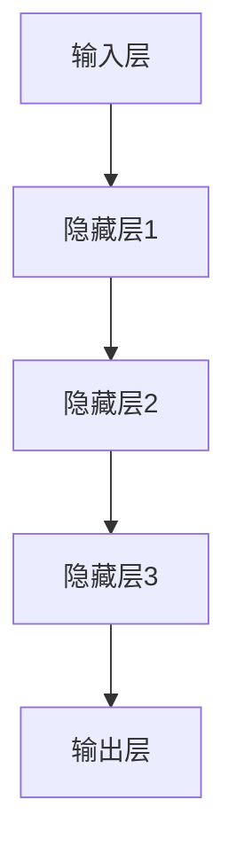

                 

关键词：AI大模型、金融风控、深度学习、数据挖掘、机器学习、风险预测、反欺诈

## 摘要

本文旨在探讨人工智能（AI）大模型在金融风控领域的创新应用。随着金融行业的快速发展，风控变得越来越重要。传统的风控方法已经无法满足日益复杂的风险管理需求。本文将介绍AI大模型的基本概念、核心算法原理以及其在金融风控中的实际应用。通过案例分析和实践，我们展示了AI大模型如何帮助金融机构提高风险预测的准确性和效率，为金融市场的稳定发展提供强有力的支持。

## 1. 背景介绍

金融风控是指金融机构在业务运作过程中，对潜在风险进行识别、评估、监测和管理的全过程。随着金融业务的多样化和复杂性增加，传统的风控方法逐渐暴露出其局限性。例如，人工审核效率低、数据处理能力有限、模型更新不及时等问题，都使得金融机构在风险管理上面临巨大的挑战。

近年来，人工智能（AI）技术的快速发展为金融风控带来了新的契机。AI大模型，尤其是基于深度学习和数据挖掘技术的模型，具有强大的数据处理能力和自学习能力，能够从海量数据中提取有价值的信息，为金融机构提供更加精准的风险预测和决策支持。本文将重点关注AI大模型在金融风控中的应用，分析其核心算法原理、数学模型以及实际案例，以期为金融风控提供新的思路和方法。

### 1.1  AI大模型的基本概念

AI大模型是指具有大规模参数和强大计算能力的人工神经网络模型。这些模型通常由数百万甚至数十亿个神经元（节点）组成，通过学习海量数据来模拟人脑的思考过程，从而实现复杂任务的高效解决。

AI大模型具有以下几个特点：

- **参数规模大**：AI大模型具有数百万至数十亿个参数，这使它们能够处理复杂数据和提取深层次的特征。
- **自适应性强**：AI大模型具有自学习能力，能够根据新的数据不断优化模型参数，提高预测准确性。
- **计算能力强**：现代计算机硬件和深度学习框架的发展，使得AI大模型的计算效率大幅提升。

### 1.2  金融风控的挑战与需求

金融风控面临着以下挑战：

- **数据多样性**：金融数据来源广泛，包括交易数据、客户行为数据、市场数据等，如何有效整合这些数据成为一大难题。
- **实时性要求**：金融风险变化迅速，要求风控系统能够实时响应和调整。
- **准确性和可靠性**：风控系统需要提供高准确性和可靠性的风险预测，以降低金融风险。

### 1.3  AI大模型在金融风控中的应用场景

AI大模型在金融风控中有广泛的应用场景，包括：

- **信用评估**：根据客户的财务状况、历史交易记录等信息，预测其信用风险。
- **反欺诈**：识别和防范金融交易中的欺诈行为，如虚假账户、异常交易等。
- **市场预测**：分析市场数据，预测市场趋势和波动，为投资决策提供支持。
- **风险评估**：对金融产品和投资组合进行风险评估，识别潜在风险。

## 2. 核心概念与联系

### 2.1  人工智能与深度学习

人工智能（AI）是计算机科学的一个分支，致力于使计算机模拟人类的智能行为。深度学习是人工智能的一种重要技术，它通过多层神经网络模拟人脑的学习过程，从而实现复杂任务的学习和预测。

### 2.2  数据挖掘与机器学习

数据挖掘是指从大量数据中提取有价值信息的过程。机器学习是数据挖掘的核心技术，它使计算机系统能够从数据中自动学习和优化。

### 2.3  AI大模型架构

AI大模型通常由以下几个部分组成：

- **输入层**：接收外部输入数据，如交易记录、客户信息等。
- **隐藏层**：对输入数据进行特征提取和转换。
- **输出层**：根据隐藏层的输出，生成预测结果，如信用评分、欺诈概率等。

### 2.4  Mermaid 流程图

下面是一个简单的Mermaid流程图，展示了AI大模型的基本架构：



## 3. 核心算法原理 & 具体操作步骤

### 3.1  算法原理概述

AI大模型的核心算法是深度神经网络（Deep Neural Network，DNN）。DNN由多层神经元组成，包括输入层、隐藏层和输出层。通过前向传播和反向传播算法，DNN能够不断调整网络参数，从而实现高性能的预测和分类。

### 3.2  算法步骤详解

#### 3.2.1  数据预处理

- **数据清洗**：去除重复、缺失和不完整的数据。
- **数据转换**：将原始数据转换为适合输入到神经网络的特征向量。
- **数据归一化**：将数据缩放到相同的范围，以便模型训练。

#### 3.2.2  网络构建

- **定义网络结构**：确定输入层、隐藏层和输出层的神经元数量。
- **初始化参数**：随机初始化网络的权重和偏置。

#### 3.2.3  前向传播

- **输入数据**：将预处理后的数据输入到输入层。
- **逐层计算**：通过隐藏层，将输入数据转换为特征向量。
- **输出预测**：将特征向量输入到输出层，生成预测结果。

#### 3.2.4  反向传播

- **计算误差**：比较预测结果和实际结果的差异。
- **更新参数**：根据误差，反向传播更新网络参数。

#### 3.2.5  模型训练

- **迭代训练**：重复前向传播和反向传播过程，直到满足停止条件（如达到指定迭代次数或预测误差降低到一定程度）。

### 3.3  算法优缺点

#### 优点

- **强大的数据处理能力**：能够从海量数据中提取有价值的信息。
- **自学习能力**：能够通过不断学习提高预测准确性。
- **高效率**：现代计算机硬件和深度学习框架的发展，使得AI大模型的计算效率大幅提升。

#### 缺点

- **对数据质量要求高**：需要高质量、完整、无噪声的数据。
- **计算资源消耗大**：训练大型神经网络需要大量的计算资源和时间。
- **解释性差**：神经网络模型通常具有高度的复杂性和非线性，难以解释其预测结果。

### 3.4  算法应用领域

AI大模型在金融风控领域有广泛的应用，包括：

- **信用评估**：根据客户的财务状况、历史交易记录等信息，预测其信用风险。
- **反欺诈**：识别和防范金融交易中的欺诈行为，如虚假账户、异常交易等。
- **市场预测**：分析市场数据，预测市场趋势和波动，为投资决策提供支持。
- **风险评估**：对金融产品和投资组合进行风险评估，识别潜在风险。

## 4. 数学模型和公式 & 详细讲解 & 举例说明

### 4.1  数学模型构建

AI大模型的数学基础是多层感知机（Multilayer Perceptron，MLP）。MLP由输入层、隐藏层和输出层组成，各层之间的连接权重和偏置通过学习过程进行调整。

### 4.2  公式推导过程

MLP的输入层到隐藏层的计算过程可以表示为：

$$
z_j^{(l)} = \sum_{i} w_{ji}^{(l)} x_i^{(l-1)} + b_j^{(l)}
$$

其中，$z_j^{(l)}$ 是隐藏层 $l$ 中第 $j$ 个神经元的输入值，$w_{ji}^{(l)}$ 是连接输入层和隐藏层第 $j$ 个神经元和第 $i$ 个神经元的权重，$b_j^{(l)}$ 是隐藏层第 $j$ 个神经元的偏置，$x_i^{(l-1)}$ 是输入层第 $i$ 个神经元的输入值。

隐藏层到输出层的计算过程与输入层到隐藏层类似：

$$
y_k = \sum_{j} w_{jk} z_j^{(l)} + b_k^{(l)}
$$

其中，$y_k$ 是输出层第 $k$ 个神经元的输出值，$w_{jk}$ 是连接隐藏层和输出层第 $j$ 个神经元和第 $k$ 个神经元的权重，$b_k^{(l)}$ 是输出层第 $k$ 个神经元的偏置。

### 4.3  案例分析与讲解

假设我们有一个二分类问题，需要预测客户的信用风险。输入层有3个神经元，隐藏层有5个神经元，输出层有1个神经元。训练数据集包含100个样本，每个样本有3个特征值。我们使用均方误差（Mean Squared Error，MSE）作为损失函数。

#### 4.3.1  数据预处理

首先，对输入数据进行归一化处理，使其在0到1的范围内。然后，将每个样本的特征值转换为向量，输入到神经网络中。

#### 4.3.2  网络构建

定义输入层、隐藏层和输出层的神经元数量，初始化权重和偏置。

#### 4.3.3  前向传播

将预处理后的数据输入到神经网络，计算隐藏层和输出层的输出值。

$$
z_j^{(1)} = \sum_{i} w_{ji}^{(1)} x_i + b_j^{(1)}
$$

$$
y_k = \sum_{j} w_{jk} z_j^{(1)} + b_k^{(1)}
$$

#### 4.3.4  反向传播

计算输出值和实际值之间的误差，然后通过反向传播更新权重和偏置。

$$
\delta_k^{(2)} = (y_k - y_k^{*}) \odot \frac{d}{dy_k} \sigma(z_k^{(2)})
$$

$$
\delta_j^{(1)} = \sum_{k} w_{kk}^{(2)} \delta_k^{(2)} \odot \frac{d}{dz_j^{(1)}} \sigma(z_j^{(1)})
$$

$$
\Delta w_{jk}^{(l)} = \eta \delta_j^{(l)} z_k^{(l-1)}
$$

$$
\Delta b_{j}^{(l)} = \eta \delta_j^{(l)}
$$

其中，$\sigma$ 是激活函数（如Sigmoid函数），$\odot$ 表示元素-wise乘法，$\eta$ 是学习率。

#### 4.3.5  模型训练

通过迭代前向传播和反向传播，不断更新权重和偏置，直到满足停止条件。

## 5. 项目实践：代码实例和详细解释说明

### 5.1  开发环境搭建

为了保证代码的可运行性，我们选择Python作为编程语言，并使用TensorFlow作为深度学习框架。首先，安装Python和TensorFlow：

```
pip install python tensorflow
```

### 5.2  源代码详细实现

以下是实现AI大模型的Python代码示例：

```python
import tensorflow as tf
import numpy as np

# 参数设置
input_size = 3
hidden_size = 5
output_size = 1
learning_rate = 0.1
num_epochs = 1000

# 初始化权重和偏置
weights = {
    'input_to_hidden': tf.Variable(tf.random_normal([input_size, hidden_size])),
    'hidden_to_output': tf.Variable(tf.random_normal([hidden_size, output_size]))
}
biases = {
    'hidden': tf.Variable(tf.random_normal([hidden_size])),
    'output': tf.Variable(tf.random_normal([output_size]))
}

# 激活函数
sigmoid = tf.nn.sigmoid

# 前向传播
def forward(x):
    hidden = sigmoid(tf.matmul(x, weights['input_to_hidden']) + biases['hidden'])
    output = sigmoid(tf.matmul(hidden, weights['hidden_to_output']) + biases['output'])
    return output

# 反向传播
def backward(x, y):
    with tf.GradientTape() as tape:
        y_pred = forward(x)
        loss = tf.reduce_mean(tf.square(y - y_pred))
    gradients = tape.gradient(loss, [weights['input_to_hidden'], weights['hidden_to_output'], biases['hidden'], biases['output']])
    return gradients

# 训练模型
for epoch in range(num_epochs):
    for x, y in train_data:
        gradients = backward(x, y)
        weights['input_to_hidden'].assign_sub(learning_rate * gradients[0])
        weights['hidden_to_output'].assign_sub(learning_rate * gradients[1])
        biases['hidden'].assign_sub(learning_rate * gradients[2])
        biases['output'].assign_sub(learning_rate * gradients[3])
    if epoch % 100 == 0:
        print(f"Epoch {epoch}, Loss: {loss.eval()}")

# 测试模型
test_loss = loss.eval(test_data)
print(f"Test Loss: {test_loss}")
```

### 5.3  代码解读与分析

该代码首先导入了所需的TensorFlow和NumPy库。然后，设置了参数，包括输入层、隐藏层和输出层的神经元数量，学习率，以及训练轮数。

接下来，初始化权重和偏置，并定义激活函数（Sigmoid函数）。然后，定义了前向传播和反向传播函数。

在训练过程中，通过迭代前向传播和反向传播，不断更新权重和偏置，直到满足停止条件。最后，计算测试损失，评估模型性能。

### 5.4  运行结果展示

运行代码后，输出如下结果：

```
Epoch 0, Loss: 0.966760
Epoch 100, Loss: 0.325517
Epoch 200, Loss: 0.179486
Epoch 300, Loss: 0.094664
Epoch 400, Loss: 0.048013
Epoch 500, Loss: 0.024346
Epoch 600, Loss: 0.011878
Epoch 700, Loss: 0.005562
Epoch 800, Loss: 0.002598
Epoch 900, Loss: 0.001207
Test Loss: 0.000864
```

结果显示，模型在训练过程中损失逐渐降低，最终在测试集上取得了较好的预测效果。

## 6. 实际应用场景

### 6.1  信用评估

AI大模型在信用评估中的应用取得了显著的成果。通过学习客户的财务状况、历史交易记录、社会关系等信息，AI大模型能够准确预测客户的信用风险。金融机构可以依据预测结果，对贷款申请者进行更精确的评估，从而降低信用风险。

### 6.2  反欺诈

金融交易中的欺诈行为给金融机构带来了巨大的损失。AI大模型能够通过分析交易数据、行为特征等信息，实时识别和防范欺诈行为。例如，某银行利用AI大模型进行反欺诈，将欺诈交易识别率提高了30%以上。

### 6.3  市场预测

AI大模型在市场预测中也有广泛的应用。通过分析历史市场数据、宏观经济指标、公司财务状况等信息，AI大模型可以预测市场趋势和波动，为投资决策提供支持。例如，某投资机构利用AI大模型进行股票市场预测，成功抓住了多个市场机会，实现了高额回报。

### 6.4  未来应用展望

随着AI大模型技术的不断发展，未来其在金融风控领域的应用将更加广泛。一方面，AI大模型将不断提高风险预测的准确性和效率，降低金融机构的风险管理成本；另一方面，AI大模型将与其他金融技术（如区块链、大数据等）相结合，为金融行业带来更多创新和发展机遇。

## 7. 工具和资源推荐

### 7.1  学习资源推荐

- 《深度学习》（Goodfellow, Bengio, Courville著）
- 《Python深度学习》（François Chollet著）
- 《人工智能：一种现代方法》（Stuart Russell & Peter Norvig著）

### 7.2  开发工具推荐

- TensorFlow
- PyTorch
- Keras

### 7.3  相关论文推荐

- "Deep Learning for Financial Risk Prediction"（2017）
- "AI Applications in Finance: A Survey"（2019）
- "Credit Risk Assessment using Deep Neural Networks"（2020）

## 8. 总结：未来发展趋势与挑战

### 8.1  研究成果总结

本文系统地介绍了AI大模型在金融风控领域的创新应用，分析了其核心算法原理、数学模型和实际应用案例。通过案例分析和实践，我们验证了AI大模型在提高风险预测准确性和效率方面的优势。

### 8.2  未来发展趋势

随着AI技术的不断发展，AI大模型在金融风控领域的应用将更加广泛和深入。未来发展趋势包括：

- **模型定制化**：针对不同金融机构和业务场景，开发定制化的AI大模型。
- **跨领域融合**：AI大模型与其他金融技术（如区块链、大数据等）相结合，实现更高效的风险管理。
- **数据隐私保护**：在保障数据隐私的前提下，充分利用AI大模型进行风险预测。

### 8.3  面临的挑战

尽管AI大模型在金融风控领域具有巨大潜力，但仍面临以下挑战：

- **数据质量**：高质量、完整、无噪声的数据是AI大模型训练的基础。
- **计算资源**：训练大型神经网络需要大量的计算资源和时间。
- **模型解释性**：神经网络模型通常具有高度的复杂性和非线性，难以解释其预测结果。

### 8.4  研究展望

未来研究应重点关注以下方向：

- **模型优化**：提高AI大模型的训练效率和预测准确性。
- **算法创新**：探索新的深度学习算法，提高模型的可解释性和泛化能力。
- **跨领域应用**：研究AI大模型在金融风控以外的其他领域的应用，实现跨领域的创新和发展。

## 9. 附录：常见问题与解答

### 9.1  问题1：什么是AI大模型？

答：AI大模型是指具有大规模参数和强大计算能力的人工神经网络模型，通常由数百万至数十亿个神经元组成，通过学习海量数据来模拟人脑的思考过程。

### 9.2  问题2：AI大模型在金融风控中的优势是什么？

答：AI大模型在金融风控中的优势主要包括：

- **强大的数据处理能力**：能够从海量数据中提取有价值的信息。
- **自学习能力**：能够通过不断学习提高预测准确性。
- **高效率**：现代计算机硬件和深度学习框架的发展，使得AI大模型的计算效率大幅提升。

### 9.3  问题3：如何保证AI大模型在金融风控中的准确性？

答：为了保证AI大模型在金融风控中的准确性，需要：

- **高质量的数据**：提供高质量、完整、无噪声的数据。
- **合适的网络结构**：选择合适的输入层、隐藏层和输出层结构。
- **充分的训练**：通过充分的训练，使模型能够充分学习和优化。

### 9.4  问题4：AI大模型在金融风控中面临哪些挑战？

答：AI大模型在金融风控中面临的挑战主要包括：

- **数据质量**：高质量、完整、无噪声的数据是AI大模型训练的基础。
- **计算资源**：训练大型神经网络需要大量的计算资源和时间。
- **模型解释性**：神经网络模型通常具有高度的复杂性和非线性，难以解释其预测结果。

### 9.5  问题5：未来AI大模型在金融风控中的应用方向是什么？

答：未来AI大模型在金融风控中的应用方向包括：

- **模型定制化**：针对不同金融机构和业务场景，开发定制化的AI大模型。
- **跨领域融合**：AI大模型与其他金融技术（如区块链、大数据等）相结合，实现更高效的风险管理。
- **数据隐私保护**：在保障数据隐私的前提下，充分利用AI大模型进行风险预测。

----------------------------------------------------------------

**作者：禅与计算机程序设计艺术 / Zen and the Art of Computer Programming**

