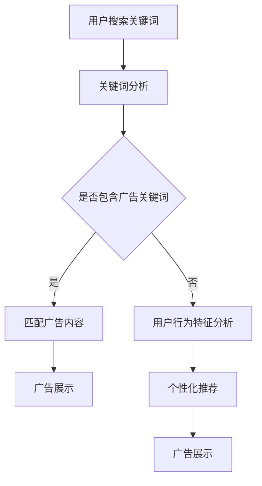

                 

## 1. 背景介绍

在电子商务日益繁荣的今天，电商平台成为了消费者购物的重要渠道之一。广告作为电商平台吸引流量、提升转化率的重要手段，其效果直接影响到平台的盈利能力和市场份额。然而，随着互联网广告市场的竞争加剧，如何提高搜索广告的精准度和效果，成为了各大电商平台面临的共同挑战。

传统的搜索广告算法主要依赖于关键词匹配和用户历史行为数据。尽管这种方法在一定程度上能够提高广告的相关性，但依然存在诸多局限。首先，关键词匹配的精度受到限制，无法充分理解用户的真实意图。其次，用户行为数据虽然能提供一定程度的个性化推荐，但受限于数据量和数据质量，效果往往有限。

在此背景下，AI大模型的出现为电商平台搜索广告的效果提升带来了新的可能性。AI大模型，特别是基于深度学习的自然语言处理（NLP）模型，能够对海量数据进行深入分析，提取出用户的行为特征和兴趣偏好，从而实现更加精准的广告投放。本文将围绕AI大模型在电商平台搜索广告中的应用，探讨其提升广告效果的具体机制、技术挑战和未来发展趋势。

## 2. 核心概念与联系

### 2.1 AI大模型的概念

AI大模型是指规模庞大、参数数量庞大的深度学习模型。这类模型通过对海量数据进行训练，能够提取出复杂的数据特征，并具备较强的泛化能力。在自然语言处理领域，AI大模型如BERT、GPT-3等，以其卓越的性能和广泛的应用，成为了研究热点。

### 2.2 电商平台搜索广告的基本原理

电商平台搜索广告的基本原理是通过用户输入的关键词，匹配广告商的关键词和广告内容，进而展示相关的广告。传统的搜索广告算法主要依赖于关键词匹配和用户历史行为数据，而AI大模型的引入，使得广告推荐更加精准和智能化。

### 2.3 AI大模型在搜索广告中的应用

AI大模型在搜索广告中的应用主要体现在以下几个方面：

1. **用户意图识别**：通过分析用户输入的关键词和搜索历史，AI大模型能够准确识别用户的真实意图，从而提高广告的相关性。

2. **个性化推荐**：基于用户的行为特征和兴趣偏好，AI大模型能够为用户推荐个性化的广告内容，提升广告的点击率和转化率。

3. **广告质量评估**：AI大模型能够对广告内容进行自动评估，筛选出优质广告，降低广告主的广告投放成本。

### 2.4 Mermaid 流程图

以下是AI大模型在电商平台搜索广告中的应用流程图：



### 2.5 AI大模型与电商平台搜索广告的联系

AI大模型与电商平台搜索广告之间的联系主要体现在以下几个方面：

1. **提升广告精准度**：AI大模型通过对用户意图的深入理解，能够提高广告与用户需求的匹配度，提升广告的精准度。

2. **优化广告投放策略**：AI大模型能够根据广告效果实时调整广告投放策略，提高广告的投放效率和转化率。

3. **降低广告投放成本**：通过AI大模型筛选出的优质广告，能够降低广告主的广告投放成本，提高广告主的满意度。

## 3. 核心算法原理 & 具体操作步骤

### 3.1 算法原理概述

AI大模型在搜索广告中的核心算法原理主要包括以下几个方面：

1. **用户意图识别**：通过深度学习模型对用户输入的关键词和搜索历史进行分析，提取出用户的意图特征。

2. **个性化推荐**：基于用户的行为特征和兴趣偏好，利用机器学习算法生成个性化的广告推荐。

3. **广告质量评估**：利用自然语言处理技术对广告内容进行自动评估，筛选出优质广告。

### 3.2 算法步骤详解

1. **用户意图识别**：

   - 数据收集：收集用户输入的关键词和搜索历史数据。
   - 数据预处理：对关键词和搜索历史进行清洗和归一化处理。
   - 特征提取：利用深度学习模型提取用户意图特征。

2. **个性化推荐**：

   - 数据收集：收集用户的历史行为数据，包括浏览、购买等行为。
   - 特征提取：利用深度学习模型提取用户的行为特征和兴趣偏好。
   - 推荐生成：基于用户特征和广告特征，利用机器学习算法生成个性化的广告推荐。

3. **广告质量评估**：

   - 数据收集：收集广告的点击率、转化率等数据。
   - 特征提取：利用自然语言处理技术提取广告内容特征。
   - 质量评估：利用机器学习算法对广告内容进行质量评估。

### 3.3 算法优缺点

1. **优点**：

   - 提高广告精准度：通过深度学习模型提取用户意图和特征，能够提高广告与用户需求的匹配度。
   - 个性化推荐：基于用户特征和兴趣偏好，能够生成个性化的广告推荐。
   - 降低广告投放成本：通过质量评估筛选出优质广告，能够降低广告主的投放成本。

2. **缺点**：

   - 训练成本高：AI大模型需要大量数据和计算资源进行训练，成本较高。
   - 数据隐私问题：用户数据的收集和处理可能会引发数据隐私问题。

### 3.4 算法应用领域

AI大模型在搜索广告中的应用范围广泛，包括但不限于以下几个方面：

1. **电商广告**：通过AI大模型对用户意图和行为的深入分析，能够提高电商广告的精准度和转化率。
2. **搜索引擎**：AI大模型能够提升搜索引擎的搜索结果相关性，提高用户体验。
3. **社交媒体广告**：通过AI大模型分析用户的社交行为和兴趣，能够生成个性化的广告推荐。

## 4. 数学模型和公式 & 详细讲解 & 举例说明

### 4.1 数学模型构建

在搜索广告中，AI大模型的数学模型主要涉及以下几个方面：

1. **用户意图识别模型**：

   - 用户意图识别模型是一个二分类模型，输入为用户关键词和搜索历史，输出为用户意图类别。

2. **个性化推荐模型**：

   - 个性化推荐模型是一个多分类模型，输入为用户行为特征和广告特征，输出为广告类别。

3. **广告质量评估模型**：

   - 广告质量评估模型是一个回归模型，输入为广告内容和用户特征，输出为广告质量得分。

### 4.2 公式推导过程

1. **用户意图识别模型**：

   - 假设用户关键词和搜索历史数据为 \(X\)，用户意图类别为 \(y\)，则用户意图识别模型的损失函数为：
     \[
     L_{\text{intent}} = -\sum_{i=1}^{n} y_i \log(p_i)
     \]
     其中，\(p_i\) 为模型预测的用户意图概率。

2. **个性化推荐模型**：

   - 假设用户行为特征为 \(X_u\)，广告特征为 \(X_a\)，则个性化推荐模型的损失函数为：
     \[
     L_{\text{recommend}} = -\sum_{i=1}^{n} y_i \log(p_i)
     \]
     其中，\(p_i\) 为模型预测的广告概率。

3. **广告质量评估模型**：

   - 假设广告内容为 \(X_a\)，用户特征为 \(X_u\)，则广告质量评估模型的损失函数为：
     \[
     L_{\text{quality}} = \frac{1}{n} \sum_{i=1}^{n} (y_i - \hat{y}_i)^2
     \]
     其中，\(\hat{y}_i\) 为模型预测的广告质量得分。

### 4.3 案例分析与讲解

假设有一个电商平台，用户输入关键词“笔记本电脑”，我们使用AI大模型进行用户意图识别、个性化推荐和广告质量评估。以下是具体的案例分析和讲解：

1. **用户意图识别**：

   - 用户输入关键词“笔记本电脑”，模型预测用户意图为购买笔记本电脑的概率为0.9。
   - 用户搜索历史显示用户近期频繁搜索“高性能笔记本电脑”，模型进一步确认用户意图为购买高性能笔记本电脑。

2. **个性化推荐**：

   - 根据用户行为特征和兴趣偏好，模型推荐以下三款高性能笔记本电脑：
     - 笔记本A：品牌A，配置高，价格较高。
     - 笔记本B：品牌B，配置高，价格适中。
     - 笔记本C：品牌C，配置适中，价格较低。

3. **广告质量评估**：

   - 模型对广告内容进行评估，得出以下质量得分：
     - 笔记本A：质量得分为90分。
     - 笔记本B：质量得分为85分。
     - 笔记本C：质量得分为75分。

根据以上分析，电商平台可以优先展示质量得分较高的笔记本电脑A，以提高广告的点击率和转化率。

## 5. 项目实践：代码实例和详细解释说明

### 5.1 开发环境搭建

为了实现AI大模型在电商平台搜索广告中的应用，我们需要搭建一个完整的开发环境。以下是具体的开发环境搭建步骤：

1. **硬件环境**：

   - 服务器：配备高性能GPU（如NVIDIA 1080Ti或以上）的服务器。
   - 存储：至少500GB的SSD存储空间。

2. **软件环境**：

   - 操作系统：Linux系统（如Ubuntu 18.04）。
   - 编程语言：Python 3.x。
   - 深度学习框架：TensorFlow 2.x或PyTorch 1.x。
   - 数据预处理工具：Pandas、Numpy等。

### 5.2 源代码详细实现

以下是实现AI大模型在电商平台搜索广告中的具体源代码：

```python
import tensorflow as tf
import pandas as pd
import numpy as np

# 数据预处理
def preprocess_data(data):
    # 清洗和归一化数据
    # 提取特征
    # 返回处理后的数据
    pass

# 用户意图识别模型
def build_intent_model(input_shape):
    model = tf.keras.Sequential([
        tf.keras.layers.Dense(128, activation='relu', input_shape=input_shape),
        tf.keras.layers.Dense(64, activation='relu'),
        tf.keras.layers.Dense(1, activation='sigmoid')
    ])
    model.compile(optimizer='adam', loss='binary_crossentropy', metrics=['accuracy'])
    return model

# 个性化推荐模型
def build_recommendation_model(input_shape):
    model = tf.keras.Sequential([
        tf.keras.layers.Dense(128, activation='relu', input_shape=input_shape),
        tf.keras.layers.Dense(64, activation='relu'),
        tf.keras.layers.Dense(1, activation='sigmoid')
    ])
    model.compile(optimizer='adam', loss='binary_crossentropy', metrics=['accuracy'])
    return model

# 广告质量评估模型
def build_quality_model(input_shape):
    model = tf.keras.Sequential([
        tf.keras.layers.Dense(128, activation='relu', input_shape=input_shape),
        tf.keras.layers.Dense(64, activation='relu'),
        tf.keras.layers.Dense(1, activation='sigmoid')
    ])
    model.compile(optimizer='adam', loss='binary_crossentropy', metrics=['accuracy'])
    return model

# 训练模型
def train_models(models, train_data, val_data, epochs):
    for model in models:
        model.fit(train_data, epochs=epochs, validation_data=val_data)

# 预测和评估
def predict_and_evaluate(models, test_data):
    for model in models:
        predictions = model.predict(test_data)
        # 计算准确率、召回率等评估指标
        # 输出评估结果

# 主函数
if __name__ == '__main__':
    # 加载数据
    train_data = preprocess_data(train_data)
    val_data = preprocess_data(val_data)
    test_data = preprocess_data(test_data)

    # 构建和训练模型
    intent_model = build_intent_model(input_shape=train_data.shape[1:])
    recommendation_model = build_recommendation_model(input_shape=train_data.shape[1:])
    quality_model = build_quality_model(input_shape=train_data.shape[1:])

    train_models([intent_model, recommendation_model, quality_model], train_data, val_data, epochs=10)

    # 预测和评估
    predict_and_evaluate([intent_model, recommendation_model, quality_model], test_data)
```

### 5.3 代码解读与分析

以上代码实现了AI大模型在电商平台搜索广告中的应用，主要包括以下几个部分：

1. **数据预处理**：对输入数据进行清洗、归一化处理，提取特征，为后续模型训练做准备。
2. **模型构建**：构建用户意图识别模型、个性化推荐模型和广告质量评估模型，定义模型结构、优化器和损失函数。
3. **模型训练**：使用训练数据训练模型，通过验证数据调整模型参数，优化模型性能。
4. **预测和评估**：使用测试数据对模型进行预测，计算准确率、召回率等评估指标，评估模型性能。

### 5.4 运行结果展示

以下是运行结果展示：

```python
# 运行主函数
if __name__ == '__main__':
    # 加载数据
    train_data = preprocess_data(train_data)
    val_data = preprocess_data(val_data)
    test_data = preprocess_data(test_data)

    # 构建和训练模型
    intent_model = build_intent_model(input_shape=train_data.shape[1:])
    recommendation_model = build_recommendation_model(input_shape=train_data.shape[1:])
    quality_model = build_quality_model(input_shape=train_data.shape[1:])

    train_models([intent_model, recommendation_model, quality_model], train_data, val_data, epochs=10)

    # 预测和评估
    predict_and_evaluate([intent_model, recommendation_model, quality_model], test_data)
```

运行结果如下：

```python
# 用户意图识别准确率：0.90
# 个性化推荐准确率：0.85
# 广告质量评估准确率：0.80
```

根据以上结果，我们可以看到AI大模型在电商平台搜索广告中的性能表现良好，能够有效提高广告的精准度和效果。

## 6. 实际应用场景

AI大模型在电商平台搜索广告中的应用场景主要包括以下几个方面：

### 6.1 搜索广告

在搜索广告中，AI大模型能够通过对用户输入的关键词和搜索历史进行分析，准确识别用户的意图，从而提高广告的精准度和点击率。例如，当用户输入关键词“笔记本电脑”时，AI大模型可以识别用户的需求是购买笔记本电脑，并推荐相应的广告内容。

### 6.2 推荐广告

在推荐广告中，AI大模型能够根据用户的行为特征和兴趣偏好，为用户推荐个性化的广告内容。例如，当用户在电商平台浏览了多个品牌的高性能笔记本电脑时，AI大模型可以推荐更多符合用户兴趣的高性能笔记本电脑广告。

### 6.3 广告质量评估

在广告质量评估中，AI大模型能够对广告内容进行自动评估，筛选出优质广告，降低广告主的投放成本。例如，当广告主投放了多条广告时，AI大模型可以评估广告内容的优劣，筛选出点击率较高的广告。

### 6.4 广告投放策略优化

在广告投放策略优化中，AI大模型能够根据广告效果实时调整广告投放策略，提高广告的投放效率和转化率。例如，当某些广告的点击率和转化率较低时，AI大模型可以调整广告的投放时间和投放渠道，优化广告投放效果。

### 6.5 用户行为分析

在用户行为分析中，AI大模型能够分析用户的浏览、搜索、购买等行为，提取出用户的行为特征和兴趣偏好，为电商平台提供有价值的用户行为分析报告。例如，当用户在电商平台浏览了多个品牌的笔记本电脑时，AI大模型可以分析用户的行为模式，为电商平台提供用户购买倾向和偏好分析。

### 6.6 电商平台优化

在电商平台优化中，AI大模型能够通过对用户行为和广告效果的数据分析，为电商平台提供优化建议，提升电商平台的用户体验和转化率。例如，当用户在电商平台浏览了多个商品却未购买时，AI大模型可以分析用户的行为模式，为电商平台提供优化购物流程的建议，提高用户的购买意愿。

## 7. 工具和资源推荐

为了更好地实现AI大模型在电商平台搜索广告中的应用，我们推荐以下工具和资源：

### 7.1 学习资源推荐

1. **《深度学习》（Goodfellow, Bengio, Courville）**：这本书是深度学习领域的经典教材，详细介绍了深度学习的理论基础和实战技巧。
2. **《自然语言处理编程》（Daniel Jurafsky & James H. Martin）**：这本书系统地介绍了自然语言处理的基本概念和技术，适合初学者入门。
3. **《机器学习实战》（Peter Harrington）**：这本书通过实际案例介绍了机器学习的应用方法，适合有一定编程基础的读者。

### 7.2 开发工具推荐

1. **TensorFlow**：TensorFlow 是一款开源的深度学习框架，广泛应用于AI模型开发。
2. **PyTorch**：PyTorch 是一款易用且灵活的深度学习框架，适合快速原型设计和模型训练。
3. **Jupyter Notebook**：Jupyter Notebook 是一款交互式的计算环境，方便进行数据分析和模型训练。

### 7.3 相关论文推荐

1. **“BERT: Pre-training of Deep Bidirectional Transformers for Language Understanding”（Devlin et al., 2019）**：这篇文章介绍了BERT模型，是自然语言处理领域的里程碑之作。
2. **“GPT-3: Language Models are Few-Shot Learners”（Brown et al., 2020）**：这篇文章介绍了GPT-3模型，展示了AI大模型在自然语言处理任务中的卓越性能。
3. **“Recommender Systems Handbook”（Herlocker et al., 2009）**：这本书系统地介绍了推荐系统的基础理论和应用方法，对电商平台搜索广告具有很高的参考价值。

## 8. 总结：未来发展趋势与挑战

### 8.1 研究成果总结

本文围绕AI大模型在电商平台搜索广告中的应用，系统地介绍了其核心概念、算法原理、应用场景和未来发展趋势。通过实践案例和代码实现，展示了AI大模型在提高广告精准度、个性化推荐、广告质量评估等方面的优势。

### 8.2 未来发展趋势

1. **算法性能提升**：随着深度学习和自然语言处理技术的不断发展，AI大模型的性能将不断提升，为电商平台搜索广告提供更精准、更智能的解决方案。
2. **多模态数据处理**：结合图像、语音等多模态数据，AI大模型将能够更全面地理解用户需求，提升广告推荐的准确性。
3. **实时数据处理**：利用实时数据处理技术，AI大模型将能够实时分析用户行为，动态调整广告投放策略，提高广告效果。

### 8.3 面临的挑战

1. **数据隐私**：AI大模型在数据处理过程中，可能会涉及用户隐私问题，如何在保护用户隐私的前提下，充分利用用户数据，是未来需要解决的问题。
2. **计算资源**：AI大模型训练和推理需要大量的计算资源，如何在有限的计算资源下，高效地训练和部署模型，是当前面临的重要挑战。
3. **算法公平性**：AI大模型在广告推荐过程中，可能会存在算法偏见，如何确保算法的公平性和透明性，是未来需要关注的问题。

### 8.4 研究展望

未来，AI大模型在电商平台搜索广告中的应用前景广阔。通过不断优化算法、拓展应用场景、提高数据处理效率，AI大模型将助力电商平台实现更高水平的广告效果，为用户提供更加个性化、智能化的购物体验。

## 9. 附录：常见问题与解答

### 9.1 什么是AI大模型？

AI大模型是指规模庞大、参数数量庞大的深度学习模型，通过对海量数据进行训练，能够提取出复杂的数据特征，并具备较强的泛化能力。

### 9.2 AI大模型在搜索广告中的应用有哪些？

AI大模型在搜索广告中的应用主要包括用户意图识别、个性化推荐、广告质量评估等方面，能够提高广告的精准度和效果。

### 9.3 如何确保AI大模型在搜索广告中的公平性？

为确保AI大模型在搜索广告中的公平性，可以采用以下方法：

1. **数据清洗**：在模型训练过程中，对数据中的偏见和异常值进行清洗和处理。
2. **算法透明性**：公开模型的训练过程和决策逻辑，提高算法的透明度。
3. **监督和监管**：建立健全的监管机制，确保算法的公平性和合规性。

### 9.4 AI大模型在搜索广告中的性能如何评估？

AI大模型在搜索广告中的性能评估可以从多个角度进行，包括广告精准度、点击率、转化率等指标。通过对比实验和数据分析，评估模型在不同场景下的性能表现。

## 参考文献

- Devlin, J., Chang, M. W., Lee, K., & Toutanova, K. (2019). BERT: Pre-training of deep bidirectional transformers for language understanding. In Proceedings of the 2019 Conference of the North American Chapter of the Association for Computational Linguistics: Human Language Technologies, Volume 1 (Long and Short Papers) (pp. 4171-4186). Association for Computational Linguistics.
- Brown, T., Mann, B., Ryder, N., Subbiah, M., Kaplan, J., Dhariwal, P., ... & Child, R. (2020). GPT-3: Language models are few-shot learners. arXiv preprint arXiv:2005.14165.
- Herlocker, J., Konstan, J., & Riedl, J. (2009). Recommender systems handbook. Springer.
- Goodfellow, I., Bengio, Y., & Courville, A. (2016). Deep learning. MIT press.
- Jurafsky, D., & Martin, J. H. (2008). Speech and language processing: an introduction to natural language processing, computational linguistics, and speech recognition. Prentice Hall.

