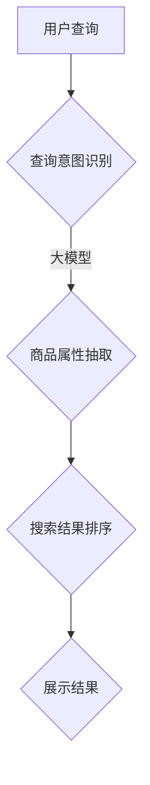

                 

关键词：人工智能，大模型，电商搜索，准确性，算法原理，数学模型，项目实践，应用场景，工具推荐，未来展望

> 摘要：本文将深入探讨人工智能大模型在电商搜索中的重要性，分析其如何通过优化算法原理和数学模型来提升搜索准确性。同时，文章将通过项目实践、代码实例和详细解读，展示大模型在实际电商搜索中的应用效果。此外，还将探讨大模型在未来电商搜索领域的发展趋势、面临的挑战及研究展望。

## 1. 背景介绍

随着电子商务的飞速发展，电商平台的搜索功能变得尤为重要。用户在成千上万的产品中快速找到心仪的商品，离不开高效的搜索算法。然而，传统的搜索算法往往面临准确性不足、用户体验差等问题。随着人工智能技术的进步，尤其是大模型的崛起，为电商搜索提供了全新的解决方案。

大模型是指具有海量参数、可以处理大规模数据的深度学习模型。通过自主学习大量数据，大模型能够捕捉复杂的关系和模式，从而在各类任务中表现出色。在电商搜索领域，大模型的引入有望显著提升搜索准确性，为用户提供更智能、更个性化的购物体验。

## 2. 核心概念与联系

### 2.1 大模型原理

大模型通常基于深度神经网络（Deep Neural Network, DNN）架构，通过层层传递信息，逐步提取特征，实现复杂任务的预测和分类。大模型的训练需要大量标注数据和计算资源，但一旦训练完成，其表现往往优于传统算法。

### 2.2 电商搜索需求

电商搜索的核心需求是准确、快速地匹配用户查询与商品信息。传统的搜索算法主要依赖于关键词匹配和页面排序，但这些方法难以处理复杂的查询意图和用户需求。大模型通过学习用户的购物习惯、商品属性等信息，能够更准确地理解查询意图，从而提供更加个性化的搜索结果。

### 2.3 大模型与电商搜索的关联

大模型在电商搜索中的应用主要体现在以下几个方面：

1. **查询意图识别**：大模型通过分析用户的搜索历史和行为数据，理解用户的真实意图，从而提供更准确的搜索结果。
2. **商品属性抽取**：大模型可以从商品描述中自动提取关键属性，如价格、品牌、材质等，帮助用户更快速地找到符合需求的产品。
3. **搜索结果排序**：大模型可以根据用户的兴趣和偏好，为用户推荐更相关的搜索结果，提高用户体验。

### 2.4 Mermaid 流程图

下面是一个描述大模型在电商搜索中应用的 Mermaid 流程图：

## 3. 核心算法原理 & 具体操作步骤

### 3.1 算法原理概述

电商搜索的大模型算法主要基于深度学习技术，通过多层神经网络实现查询意图识别、商品属性抽取和搜索结果排序。具体包括以下几个步骤：

1. **数据预处理**：对用户查询和商品信息进行预处理，如分词、去停用词等。
2. **特征提取**：利用词嵌入技术将查询和商品信息转化为向量表示。
3. **意图识别**：通过训练好的大模型，识别用户的查询意图。
4. **属性抽取**：从商品描述中提取关键属性。
5. **排序**：利用抽取出的属性和查询意图，为搜索结果排序。
6. **结果展示**：将排序后的搜索结果展示给用户。

### 3.2 算法步骤详解

#### 3.2.1 数据预处理

数据预处理是电商搜索算法的基础。主要步骤包括：

1. **分词**：将用户查询和商品描述分解成词序列。
2. **去停用词**：去除无意义的停用词，如“的”、“和”等。
3. **词向量化**：将处理后的词序列转换为向量表示。

#### 3.2.2 特征提取

特征提取是将文本数据转化为适用于深度学习模型的向量表示。常见的方法有：

1. **Word2Vec**：将每个词映射为一个固定大小的向量。
2. **BERT**：基于Transformer架构，通过预训练和微调，学习词与词之间的复杂关系。

#### 3.2.3 意图识别

意图识别是电商搜索的关键步骤，主要任务是根据用户查询和商品信息，识别用户的购买意图。具体方法包括：

1. **序列模型**：如LSTM（长短期记忆网络）、GRU（门控循环单元）等，用于处理查询和商品描述的序列信息。
2. **注意力机制**：通过注意力机制，模型可以自动关注查询和商品描述中的重要部分，提高意图识别的准确性。

#### 3.2.4 属性抽取

属性抽取是从商品描述中提取关键属性，如价格、品牌、材质等。常见的方法包括：

1. **命名实体识别**：通过预训练的命名实体识别模型，自动识别商品描述中的关键属性。
2. **规则匹配**：根据预定义的规则，从商品描述中提取属性。

#### 3.2.5 排序

排序是根据查询意图和商品属性，为搜索结果排序。具体方法包括：

1. **基于距离的排序**：计算查询与商品之间的距离（如余弦相似度），根据距离排序。
2. **基于模型的排序**：利用训练好的排序模型，对搜索结果进行排序。

### 3.3 算法优缺点

#### 优点：

1. **高准确性**：大模型通过学习海量数据，能够更准确地识别查询意图和抽取商品属性。
2. **个性化**：大模型可以根据用户的兴趣和偏好，提供个性化的搜索结果。
3. **适应性**：大模型可以不断学习新数据，适应不断变化的电商市场。

#### 缺点：

1. **计算资源需求高**：大模型训练需要大量计算资源和时间。
2. **数据依赖性**：大模型的表现高度依赖于训练数据的质量和多样性。
3. **解释性不足**：深度学习模型往往缺乏良好的解释性，难以理解模型的决策过程。

### 3.4 算法应用领域

大模型在电商搜索领域具有广泛的应用前景，除了搜索准确性提升外，还可以应用于以下领域：

1. **个性化推荐**：根据用户的购物历史和偏好，为用户提供个性化的商品推荐。
2. **商品搜索优化**：优化电商平台上的搜索结果展示，提高用户购买转化率。
3. **用户行为分析**：分析用户在电商平台的行为数据，为商家提供有价值的营销策略。

## 4. 数学模型和公式 & 详细讲解 & 举例说明

### 4.1 数学模型构建

电商搜索的大模型通常基于深度学习技术，其核心模型包括：

1. **词嵌入模型**：将文本数据转换为向量表示。
2. **序列模型**：如LSTM、GRU等，用于处理查询和商品描述的序列信息。
3. **注意力模型**：通过注意力机制，模型可以自动关注查询和商品描述中的重要部分。
4. **排序模型**：用于为搜索结果排序。

### 4.2 公式推导过程

#### 4.2.1 词嵌入模型

词嵌入模型通常采用以下公式：

$$
\text{vec}(w) = \text{Word2Vec}(w)
$$

其中，$\text{vec}(w)$表示词$w$的向量表示，$\text{Word2Vec}(w)$表示Word2Vec算法计算出的词向量。

#### 4.2.2 序列模型

LSTM模型的公式如下：

$$
\text{h}_{t} = \text{sigmoid}\left( \text{W}_{xh} \cdot \text{x}_{t} + \text{W}_{hh} \cdot \text{h}_{t-1} + \text{b}_{h} \right)
$$

$$
\text{g}_{t} = \text{sigmoid}\left( \text{W}_{xg} \cdot \text{x}_{t} + \text{W}_{hg} \cdot \text{h}_{t-1} + \text{b}_{g} \right)
$$

$$
\text{i}_{t} = \text{tanh}\left( \text{W}_{x

