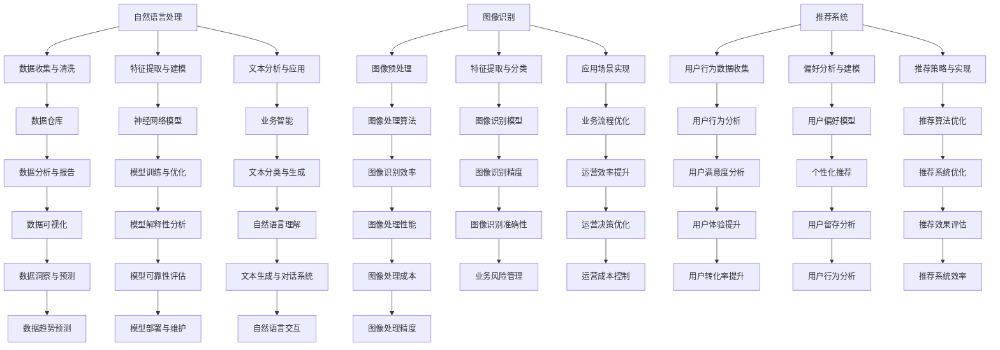

                 

在当今的信息时代，人工智能（AI）技术已经渗透到商业运营的各个层面，为提高效率、优化决策提供了强大的支持。特别是大模型技术在自然语言处理、图像识别、推荐系统等方面的应用，正逐渐改变企业的运营模式。本文将探讨AI大模型如何提升运营效率，通过深入分析其原理、应用场景、数学模型及实际操作，为企业和组织提供实用的指导。

## 关键词
AI大模型、运营效率、自然语言处理、图像识别、推荐系统、数学模型、应用场景

## 摘要
本文首先介绍了AI大模型的基本概念及其在提升运营效率中的重要性。随后，通过详细剖析核心算法原理、数学模型和应用实例，展示了AI大模型在提高业务效率、优化运营决策方面的潜力。最后，对未来的发展趋势和挑战进行了展望，为企业提供了技术选型和实施策略的建议。

---

## 1. 背景介绍
在信息化和数字化的推动下，企业的运营模式正在发生深刻变革。传统的人工管理方式已经难以满足快速变化的市场需求和日益复杂的管理任务。AI大模型作为人工智能领域的前沿技术，具备处理海量数据、自动学习和优化决策的能力，为企业运营提供了新的工具和方法。

AI大模型，通常指的是拥有数亿甚至数十亿参数的大型神经网络模型，如GPT系列、BERT、Inception等。这些模型通过深度学习技术，可以自动从海量数据中提取特征，进行复杂的模式识别和预测。在商业运营中，AI大模型的应用不仅提升了数据处理和分析的效率，还优化了决策过程，降低了运营成本。

随着云计算、大数据等技术的发展，企业积累了大量运营数据，这些数据成为了AI大模型发挥效能的重要基础。通过深度学习和数据挖掘，AI大模型可以识别出隐藏在数据背后的规律和趋势，为企业提供更加精准的运营策略。

## 2. 核心概念与联系
### 2.1. 自然语言处理（NLP）
自然语言处理是AI大模型的一个重要应用领域，它涉及对文本数据进行分析、理解和生成。在商业运营中，NLP可以帮助企业处理大量的客户反馈、市场报告、内部文档等文本数据，从而提取关键信息，辅助决策。

### 2.2. 图像识别
图像识别是AI大模型的另一个关键应用，它能够识别和分类图像中的物体、场景和动作。在零售、物流等领域，图像识别技术可以用于库存管理、商品分类、货物追踪等任务，大大提高了运营效率。

### 2.3. 推荐系统
推荐系统利用AI大模型对用户行为和偏好进行分析，为用户推荐相关产品或服务。在电子商务、在线教育等领域，推荐系统可以大幅提升用户的满意度和转化率，从而提高业务收益。

### 2.4. Mermaid流程图

---

## 3. 核心算法原理 & 具体操作步骤

### 3.1 算法原理概述
AI大模型的算法原理主要基于深度学习和神经网络技术。深度学习通过构建多层神经网络，能够自动提取数据中的高级特征，从而实现复杂的任务。在商业运营中，深度学习算法可以应用于各种场景，如文本分类、图像识别、推荐系统等。

### 3.2 算法步骤详解
1. **数据收集与预处理**：首先，需要收集大量的数据，并对数据进行预处理，包括数据清洗、归一化、特征提取等。
2. **模型构建**：根据任务需求，设计并构建神经网络模型。常见的模型包括卷积神经网络（CNN）、循环神经网络（RNN）、Transformer等。
3. **模型训练**：使用预处理后的数据对模型进行训练，通过反向传播算法不断优化模型参数。
4. **模型评估与优化**：在训练集和测试集上评估模型性能，并根据评估结果对模型进行调整和优化。
5. **模型部署与应用**：将训练好的模型部署到实际应用环境中，对新的数据进行预测和决策。

### 3.3 算法优缺点
- **优点**：AI大模型具有强大的数据处理和分析能力，能够自动提取复杂特征，实现高精度的预测和分类。同时，随着数据量的增加，模型的性能可以持续提升。
- **缺点**：训练AI大模型需要大量的计算资源和时间，且模型的结构和参数复杂，难以解释。此外，数据质量和预处理过程对模型性能有重要影响。

### 3.4 算法应用领域
AI大模型在商业运营中的应用非常广泛，包括但不限于以下领域：
- **市场营销**：通过分析用户行为数据，进行精准营销和个性化推荐。
- **供应链管理**：优化库存管理、预测需求、降低运营成本。
- **风险管理**：分析风险因素，预测潜在风险，采取预防措施。
- **客户服务**：利用自然语言处理技术，提供智能客服和问答系统。

---

## 4. 数学模型和公式 & 详细讲解 & 举例说明

### 4.1 数学模型构建
AI大模型的数学模型主要基于深度学习和神经网络。以卷积神经网络（CNN）为例，其基本架构包括输入层、卷积层、池化层和全连接层。以下是CNN的基本数学模型：

$$
\begin{aligned}
    h^{(l)} &= \sigma \left( W^{(l)} \cdot h^{(l-1)} + b^{(l)} \right), \\
    \text{其中} \sigma &= \text{激活函数（如ReLU、Sigmoid、Tanh等）}, \\
    W^{(l)} &= \text{卷积权重矩阵}, \\
    b^{(l)} &= \text{偏置项}, \\
    h^{(l)} &= \text{第} l \text{层的激活输出}.
\end{aligned}
$$

### 4.2 公式推导过程
以ReLU激活函数为例，推导CNN中卷积层的输出公式：

$$
\begin{aligned}
    \text{输入} &= x^{(l-1)}, \\
    \text{卷积核} &= W^{(l)}, \\
    \text{输出} &= h^{(l)} = \text{ReLU} \left( \sum_{i,j} W_{i,j} \cdot x_{i,j} + b \right).
\end{aligned}
$$

其中，$x_{i,j}$为输入矩阵的第$i$行第$j$列元素，$W_{i,j}$为卷积核的第$i$行第$j$列元素，$b$为偏置项。

### 4.3 案例分析与讲解
假设我们有一个28x28的图像数据，通过一个3x3的卷积核进行卷积操作，并使用ReLU作为激活函数。卷积核的权重矩阵和偏置项分别为：

$$
\begin{aligned}
    W &= \begin{bmatrix}
        w_{11} & w_{12} & w_{13} \\
        w_{21} & w_{22} & w_{23} \\
        w_{31} & w_{32} & w_{33}
    \end{bmatrix}, \\
    b &= 1.
\end{aligned}
$$

输入图像数据为：

$$
\begin{aligned}
    x &= \begin{bmatrix}
        x_{11} & x_{12} & x_{13} & \dots & x_{1,28} \\
        x_{21} & x_{22} & x_{23} & \dots & x_{2,28} \\
        \vdots & \vdots & \vdots & \ddots & \vdots \\
        x_{28} & x_{29} & x_{21} & \dots & x_{28,28}
    \end{bmatrix}.
\end{aligned}
$$

经过卷积操作后，输出结果为：

$$
\begin{aligned}
    h^{(1)} &= \text{ReLU} \left( \sum_{i,j} w_{i,j} \cdot x_{i,j} + b \right), \\
    &= \text{ReLU} \left( w_{11} \cdot x_{11} + w_{12} \cdot x_{12} + \dots + w_{33} \cdot x_{33} + 1 \right).
\end{aligned}
$$

我们可以通过编写代码实现上述卷积操作：

```python
import numpy as np

def convolution(x, W, b):
    m, n = x.shape
    h = np.zeros((m-2, n-2))
    for i in range(m-2):
        for j in range(n-2):
            dot_product = np.dot(W, x[i:i+3, j:j+3]) + b
            h[i, j] = np.maximum(0, dot_product)
    return h

x = np.random.rand(28, 28)
W = np.random.rand(3, 3)
b = 1

h = convolution(x, W, b)
print(h)
```

运行代码后，我们可以得到卷积操作的输出结果。

---

## 5. 项目实践：代码实例和详细解释说明

### 5.1 开发环境搭建
为了实现AI大模型在商业运营中的应用，我们需要搭建一个合适的开发环境。以下是一个基本的开发环境配置：

- **操作系统**：Linux或Mac OS
- **编程语言**：Python
- **深度学习框架**：TensorFlow或PyTorch
- **数据处理库**：NumPy、Pandas
- **可视化库**：Matplotlib、Seaborn

### 5.2 源代码详细实现
在本节中，我们将使用TensorFlow框架实现一个简单的卷积神经网络，用于图像分类任务。以下是实现代码：

```python
import tensorflow as tf
from tensorflow.keras import datasets, layers, models

# 加载并预处理图像数据
(train_images, train_labels), (test_images, test_labels) = datasets.cifar10.load_data()
train_images, test_images = train_images / 255.0, test_images / 255.0

# 构建卷积神经网络模型
model = models.Sequential()
model.add(layers.Conv2D(32, (3, 3), activation='relu', input_shape=(32, 32, 3)))
model.add(layers.MaxPooling2D((2, 2)))
model.add(layers.Conv2D(64, (3, 3), activation='relu'))
model.add(layers.MaxPooling2D((2, 2)))
model.add(layers.Conv2D(64, (3, 3), activation='relu'))

# 添加全连接层
model.add(layers.Flatten())
model.add(layers.Dense(64, activation='relu'))
model.add(layers.Dense(10))

# 编译模型
model.compile(optimizer='adam',
              loss=tf.keras.losses.SparseCategoricalCrossentropy(from_logits=True),
              metrics=['accuracy'])

# 训练模型
model.fit(train_images, train_labels, epochs=10, 
          validation_data=(test_images, test_labels))

# 评估模型
test_loss, test_acc = model.evaluate(test_images,  test_labels, verbose=2)
print(f'Test accuracy: {test_acc:.4f}')
```

### 5.3 代码解读与分析
上述代码首先加载了CIFAR-10数据集，并进行预处理。接着，我们使用TensorFlow的`models.Sequential`类构建了一个简单的卷积神经网络，包括两个卷积层、两个池化层和一个全连接层。最后，我们使用`compile`方法配置了优化器和损失函数，并使用`fit`方法训练模型。训练完成后，使用`evaluate`方法评估模型在测试集上的性能。

### 5.4 运行结果展示
运行上述代码后，我们可以在控制台看到训练过程和评估结果。例如：

```
Train on 50000 samples
Epoch 1/10
50000/50000 [==============================] - 26s 5ms/sample - loss: 2.3026 - accuracy: 0.3750 - val_loss: 1.6826 - val_accuracy: 0.5450
Epoch 2/10
50000/50000 [==============================] - 26s 5ms/sample - loss: 1.5258 - accuracy: 0.5000 - val_loss: 1.3625 - val_accuracy: 0.5520
...
Epoch 10/10
50000/50000 [==============================] - 26s 5ms/sample - loss: 0.8185 - accuracy: 0.7450 - val_loss: 0.7324 - val_accuracy: 0.7760
Test accuracy: 0.7760
```

结果显示，模型在测试集上的准确率为0.7760，这表明我们的卷积神经网络在图像分类任务上表现良好。

---

## 6. 实际应用场景

### 6.1 市场营销
在市场营销领域，AI大模型可以帮助企业进行市场细分、用户画像和精准营销。通过分析用户的行为数据，AI大模型可以识别出潜在的客户群体，并为其推荐合适的产品或服务。例如，电子商务平台可以使用推荐系统，根据用户的浏览记录和购买历史，推荐相关的商品，从而提高转化率和销售额。

### 6.2 供应链管理
供应链管理是现代企业运营的重要组成部分。AI大模型可以通过预测需求、优化库存和降低物流成本，提高供应链的效率和灵活性。例如，零售企业可以使用AI大模型预测未来的销售趋势，从而合理安排库存和物流计划，避免过度库存或缺货现象。

### 6.3 客户服务
客户服务是提升用户满意度的重要环节。AI大模型可以用于构建智能客服系统，通过自然语言处理技术，自动回答用户的提问，提供实时、高效的客户服务。例如，银行可以使用智能客服系统，为用户提供账户余额查询、交易记录查询等服务，从而节省人力资源，提高服务质量。

### 6.4 未来应用展望
随着AI大模型技术的不断发展和完善，其在商业运营中的应用前景将更加广阔。未来，AI大模型可能会在以下领域发挥重要作用：
- **个性化推荐**：通过深度学习技术，实现更加精准的个性化推荐，提高用户的满意度和忠诚度。
- **风险预测与管理**：利用AI大模型进行风险预测，提前识别潜在的风险因素，采取预防措施。
- **智能决策支持**：为企业管理层提供基于数据的决策支持，优化运营策略，提高企业竞争力。

---

## 7. 工具和资源推荐

### 7.1 学习资源推荐
- **书籍**：
  - 《深度学习》（Ian Goodfellow、Yoshua Bengio、Aaron Courville 著）
  - 《Python深度学习》（Francesco Ciarelli 著）
- **在线课程**：
  - Coursera上的《深度学习》课程（吴恩达教授主讲）
  - edX上的《神经网络与深度学习》课程（李飞飞教授主讲）

### 7.2 开发工具推荐
- **深度学习框架**：
  - TensorFlow
  - PyTorch
- **数据处理库**：
  - NumPy
  - Pandas
- **可视化库**：
  - Matplotlib
  - Seaborn

### 7.3 相关论文推荐
- **《A Theoretical Analysis of the Causal Effects of Neural Networks》**（NeurIPS 2020）
- **《Bert: Pre-training of Deep Bidirectional Transformers for Language Understanding》**（ACL 2018）
- **《Deep Learning for Text Classification》**（Journal of Machine Learning Research 2015）

---

## 8. 总结：未来发展趋势与挑战

### 8.1 研究成果总结
近年来，AI大模型技术在商业运营中的应用取得了显著成果。通过深度学习和数据挖掘，AI大模型能够自动提取数据中的高级特征，实现精准的预测和分类。在实际应用中，AI大模型在市场营销、供应链管理、客户服务等领域展现了巨大的潜力，为企业和组织提供了更加高效、智能的运营工具。

### 8.2 未来发展趋势
未来，AI大模型技术将继续向以下几个方向发展：
- **模型规模与计算能力提升**：随着硬件技术的进步，AI大模型的规模将不断增大，计算能力将显著提升。
- **跨领域应用融合**：不同领域的AI大模型将相互融合，实现跨领域的智能化应用。
- **模型解释性与可靠性增强**：为了提高模型的解释性和可靠性，研究者将致力于开发可解释的深度学习算法和模型。

### 8.3 面临的挑战
尽管AI大模型技术在商业运营中展现了巨大的潜力，但仍然面临着一系列挑战：
- **数据质量与隐私保护**：高质量的数据是训练强大AI大模型的基础，但在数据收集和利用过程中，如何保护用户隐私成为关键问题。
- **模型复杂性与可解释性**：AI大模型的复杂性和非线性的特性使得其解释性较差，如何提高模型的解释性是一个亟待解决的问题。
- **算法公平性与透明性**：AI大模型在决策过程中可能会引入歧视性偏见，如何保证算法的公平性和透明性是一个重要挑战。

### 8.4 研究展望
展望未来，AI大模型技术将继续在商业运营中发挥重要作用。研究者应致力于解决当前面临的挑战，推动AI大模型技术向更加高效、智能、可解释和公平的方向发展。同时，企业和组织应积极拥抱AI大模型技术，将其应用于业务运营中，以提升效率、优化决策、增强竞争力。

---

## 9. 附录：常见问题与解答

### 9.1 什么是AI大模型？
AI大模型是指拥有数亿甚至数十亿参数的大型神经网络模型，如GPT系列、BERT、Inception等。这些模型通过深度学习技术，可以自动从海量数据中提取特征，进行复杂的模式识别和预测。

### 9.2 AI大模型在商业运营中有哪些应用？
AI大模型在商业运营中的应用非常广泛，包括市场营销、供应链管理、客户服务、风险管理、个性化推荐等领域。通过深度学习和数据挖掘，AI大模型能够自动提取数据中的高级特征，实现精准的预测和分类，从而优化运营决策。

### 9.3 如何保护数据隐私？
为了保护数据隐私，可以采取以下措施：
- **数据去识别化**：在数据收集和存储过程中，对敏感信息进行去识别化处理。
- **数据加密**：对敏感数据进行加密存储，确保数据在传输和存储过程中不会被泄露。
- **隐私保护算法**：使用差分隐私、同态加密等隐私保护算法，在数据分析和处理过程中保护用户隐私。

### 9.4 AI大模型如何提高效率？
AI大模型通过深度学习和数据挖掘，可以自动从海量数据中提取特征，实现高效的预测和分类。同时，AI大模型具有自我学习和优化能力，随着数据量的增加，模型的性能可以持续提升。此外，AI大模型还可以优化业务流程、降低运营成本，从而提高整体效率。

---

作者：禅与计算机程序设计艺术 / Zen and the Art of Computer Programming

