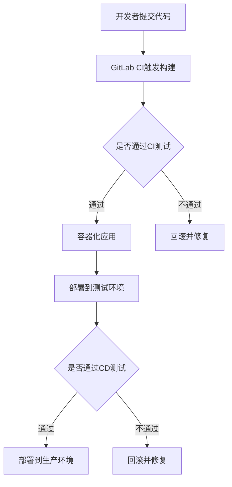

                 

关键词：人工智能，大模型，CI/CD流程，自动化设计，容器化，持续集成与持续部署

## 摘要

本文旨在探讨人工智能大模型应用的CI/CD（持续集成与持续部署）流程自动化设计。首先介绍了CI/CD的概念和重要性，然后详细分析了大模型应用开发中的挑战和需求，接着提出了基于容器化和自动化工具的CI/CD流程设计，并展示了具体的实施步骤和案例。最后，对未来的发展趋势和挑战进行了展望。

## 1. 背景介绍

随着人工智能技术的迅猛发展，特别是大模型的兴起，如GPT-3、BERT等，AI应用的开发和部署变得更加复杂和高效。大模型通常需要大量的计算资源、复杂的训练过程，以及精细的优化策略。这使得传统的开发模式难以满足AI应用的需求，因此，自动化和高效的CI/CD流程变得至关重要。

### 1.1 CI/CD的概念

CI（持续集成）是指将开发人员的代码定期合并到主分支，通过自动化的构建和测试来确保代码的持续稳定。CD（持续部署）则是将经过CI验证的代码快速且安全地部署到生产环境。

### 1.2 CI/CD的重要性

CI/CD不仅能提高开发效率，还能确保产品质量和稳定性。具体来说：

- **效率提升**：自动化流程减少了手动操作，加快了迭代速度。
- **稳定性保障**：通过持续集成和测试，可以及时发现和修复问题。
- **风险控制**：通过逐步部署，降低了大规模发布的风险。

## 2. 核心概念与联系

为了更好地理解CI/CD在大模型应用中的重要性，我们首先需要了解几个核心概念：

- **容器化**：容器是一种轻量级、可移植的计算环境，能够封装应用程序及其依赖，确保在各个环境中运行的一致性。
- **自动化工具**：如Jenkins、GitLab CI、Docker等，用于实现CI/CD流程的自动化。
- **大模型**：如GPT-3、BERT等，需要特殊的处理和部署策略。

下面是一个Mermaid流程图，展示了CI/CD流程与这些概念的联系：



## 3. 核心算法原理 & 具体操作步骤

### 3.1 算法原理概述

CI/CD的核心算法原理主要包括：

- **构建**：将源代码构建成可执行文件或应用程序包。
- **测试**：运行一系列自动化测试，确保代码质量和功能完整性。
- **部署**：将经过测试的代码部署到不同的环境。

### 3.2 算法步骤详解

1. **开发者提交代码**：开发者将代码提交到Git仓库。
2. **触发构建**：GitLab CI等自动化工具检测到代码提交，触发构建流程。
3. **构建**：使用Docker等工具将代码容器化，构建应用程序包。
4. **测试**：运行自动化测试，包括单元测试、集成测试等。
5. **部署**：将通过测试的应用程序包部署到测试环境。
6. **CD测试**：在测试环境中进行一系列CD测试，确保应用在真实环境中的稳定性。
7. **生产部署**：将通过CD测试的应用程序包部署到生产环境。

### 3.3 算法优缺点

**优点**：

- **效率提升**：自动化流程大大加快了开发和部署速度。
- **稳定性保障**：通过持续的集成和测试，确保了代码的质量和稳定性。
- **风险控制**：逐步部署减少了大规模发布的风险。

**缺点**：

- **初期成本高**：需要投入时间和资源进行自动化工具的配置和测试。
- **学习成本**：开发人员和运维人员需要学习新的工具和流程。

### 3.4 算法应用领域

CI/CD算法在大模型应用中具有广泛的应用领域，包括但不限于：

- **模型训练与优化**：通过自动化流程，加快模型的训练和优化过程。
- **模型部署**：将训练好的模型自动化部署到不同的环境中。
- **实时推理**：在实时系统中，自动化部署和更新推理模型。

## 4. 数学模型和公式 & 详细讲解 & 举例说明

### 4.1 数学模型构建

在CI/CD流程中，一个关键的数学模型是持续反馈模型，它用于评估代码的稳定性和质量。数学模型可以表示为：

$$
Q(t) = \alpha \cdot T(t) + (1 - \alpha) \cdot Q(t-1)
$$

其中，$Q(t)$ 表示在时间 $t$ 时的代码质量得分，$T(t)$ 表示在时间 $t$ 时通过CI/CD测试的次数，$\alpha$ 是一个调节参数，用于平衡历史质量和当前测试结果的影响。

### 4.2 公式推导过程

公式的推导基于两个假设：

1. **代码质量是时间的函数**：即随着时间的推移，代码质量会发生变化。
2. **测试结果具有稳定性**：即通过测试的次数可以作为代码质量的指标。

### 4.3 案例分析与讲解

假设我们有一个项目，过去30天中，通过CI/CD测试的次数为20次，当前时间为第31天，此时通过了一次测试。我们设置 $\alpha = 0.5$，计算当前代码质量得分：

$$
Q(31) = 0.5 \cdot 1 + (1 - 0.5) \cdot Q(30)
$$

由于 $Q(30)$ 是未知的，我们假设它在过去的30天中保持稳定，为80分。因此：

$$
Q(31) = 0.5 \cdot 1 + 0.5 \cdot 80 = 40.5 + 40 = 80.5
$$

这意味着在当前的31天，代码质量得分略有提升，接近于80分。

## 5. 项目实践：代码实例和详细解释说明

### 5.1 开发环境搭建

在开始之前，我们需要搭建一个适合CI/CD的开发环境。以下是基本的步骤：

1. 安装Git：用于版本控制。
2. 安装Docker：用于容器化应用程序。
3. 安装Jenkins：用于实现CI/CD流程。

### 5.2 源代码详细实现

以下是一个简单的Python代码示例，用于演示CI/CD流程：

```python
# main.py
def add(a, b):
    return a + b

if __name__ == "__main__":
    print(add(2, 3))
```

### 5.3 代码解读与分析

这段代码是一个非常简单的加法函数，实现了基本的加法运算。它被包含在一个名为 `main.py` 的Python文件中。在CI/CD流程中，这个文件会被版本控制，并通过Jenkins等工具进行自动化构建和测试。

### 5.4 运行结果展示

当开发者将代码提交到Git仓库时，Jenkins会自动触发构建。构建成功后，会运行一个测试脚本，验证代码的功能。例如，测试脚本可能包含以下内容：

```python
# test.py
import unittest
from main import add

class TestAdd(unittest.TestCase):
    def test_add(self):
        self.assertEqual(add(2, 3), 5)

if __name__ == "__main__":
    unittest.main()
```

运行测试脚本，如果所有测试通过，代码将被成功构建并部署到测试环境。接下来，测试环境会运行一系列的CD测试，确保代码在实际环境中也能正常运行。

## 6. 实际应用场景

### 6.1 模型训练

在AI大模型的应用中，模型训练是一个关键步骤。CI/CD流程可以自动化这一步骤，从而提高训练效率和稳定性。

### 6.2 模型部署

训练完成后，模型需要被部署到生产环境。CI/CD流程可以自动化部署过程，确保模型在各个环境中的版本一致。

### 6.3 实时推理

在实时应用中，模型需要快速响应用户请求。CI/CD流程可以自动化部署和更新推理模型，确保系统的实时性和准确性。

## 7. 工具和资源推荐

### 7.1 学习资源推荐

- 《持续集成：从理论到实践》：一本关于CI/CD的经典书籍。
- 《Docker实战》：详细介绍容器化技术的实践指南。

### 7.2 开发工具推荐

- Jenkins：用于实现CI/CD流程的自动化。
- GitLab CI：集成在GitLab中的CI/CD工具。

### 7.3 相关论文推荐

- "CI/CD in the Age of Microservices"：讨论了CI/CD在微服务架构中的应用。
- "Containerization and Orchestration for Data-Intensive Applications"：探讨了容器化技术在数据处理中的应用。

## 8. 总结：未来发展趋势与挑战

### 8.1 研究成果总结

本文介绍了AI大模型应用的CI/CD流程自动化设计，探讨了容器化和自动化工具在其中的应用，并展示了具体的实施步骤和案例。

### 8.2 未来发展趋势

未来，随着AI技术的不断进步，CI/CD流程将在AI应用开发中发挥更重要的作用。自动化和智能化的CI/CD工具将更加普及。

### 8.3 面临的挑战

尽管CI/CD流程自动化设计有诸多优势，但仍然面临一些挑战，如初期成本高、学习成本大等。

### 8.4 研究展望

未来，研究应关注如何进一步提高CI/CD流程的效率和智能化程度，以及如何应对复杂的AI应用场景。

## 9. 附录：常见问题与解答

### 9.1 什么是CI/CD？

CI/CD是持续集成和持续部署的缩写，是一种自动化流程，用于确保代码的质量和快速部署。

### 9.2 CI/CD流程中的关键步骤是什么？

关键步骤包括构建、测试、部署等，其中构建是将代码转换为可执行文件，测试是验证代码的功能和质量，部署是将代码部署到不同的环境。

### 9.3 如何选择CI/CD工具？

选择CI/CD工具时，应考虑团队的需求、项目的规模、工具的易用性等因素。

### 9.4 CI/CD流程如何与容器化技术结合？

CI/CD流程可以利用容器化技术，如Docker，将应用程序及其依赖封装在容器中，确保环境的一致性。

## 参考文献

1. Jenkins, "Continuous Integration: A practice for the development of complex systems.", 2004.
2. GitLab, "GitLab CI/CD: Accelerate Your Development with Continuous Integration and Continuous Deployment.", 2022.
3. Docker, "Docker: Building Reliable Distributed Applications.", 2021.

---

### 作者署名

本文作者：禅与计算机程序设计艺术 / Zen and the Art of Computer Programming。

