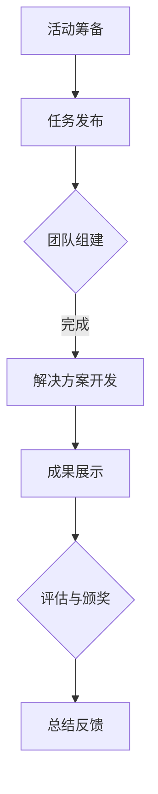

                 

关键词：(AI大模型、Hackathon活动、组织、流程、技术挑战、应用场景、评估标准、创新实践)

> 摘要：本文旨在探讨如何组织一场专注于AI大模型应用的Hackathon活动。通过分析活动流程、技术挑战、应用场景、评估标准以及创新实践，为组织者和参与者提供全面的指导，促进AI技术的实际应用和创新。

## 1. 背景介绍

随着人工智能（AI）技术的飞速发展，大模型如GPT-3、BERT等已成为当前研究的热点。这些模型在自然语言处理、图像识别、机器学习等领域展现出强大的潜力。然而，要将这些模型应用到实际问题中，不仅需要深入的技术理解，还需要具备实际操作和解决复杂问题的能力。

Hackathon活动作为一种技术竞赛形式，已成为促进技术交流、激发创新的重要平台。通过组织AI大模型应用的Hackathon，可以鼓励开发者们动手实践，探索大模型在不同领域的应用潜力，同时也为企业和研究机构提供人才选拔和项目孵化的机会。

本文将详细探讨如何有效组织一场AI大模型应用的Hackathon活动，包括活动流程设计、技术挑战设置、应用场景选择、评估标准和创新实践等方面。

## 2. 核心概念与联系

在组织Hackathon活动之前，我们首先需要理解几个核心概念：

- **AI大模型**：指参数规模达到百万、亿级别，能够处理大规模数据，实现高精度预测或生成的深度学习模型。
- **Hackathon活动**：指在一定时间内，通过团队协作，针对特定问题或任务进行创新性解决方案的开发和实现的竞赛。
- **技术挑战**：指在活动中设置的具体技术问题或任务，旨在考察参与者的技术能力。
- **应用场景**：指大模型可以实际应用的领域，如自然语言处理、计算机视觉、医疗诊断等。
- **评估标准**：指用于评估解决方案质量和创新性的具体标准，如性能指标、创新性、实用性等。

### Mermaid 流程图

下面是一个简单的Mermaid流程图，展示Hackathon活动的基本流程：



## 3. 核心算法原理 & 具体操作步骤

### 3.1 算法原理概述

在Hackathon活动中，参与者通常需要掌握以下核心算法原理：

- **深度学习**：大模型的训练和优化基础，涉及神经网络结构、优化算法、损失函数等。
- **迁移学习**：通过在大规模数据集上预训练模型，然后在小数据集上进行微调，以提高模型的泛化能力。
- **数据预处理**：包括数据清洗、特征提取、数据增强等，确保数据质量和模型输入的一致性。

### 3.2 算法步骤详解

1. **数据收集与预处理**：
   - 收集相关领域的大规模数据集，并进行清洗和预处理。
   - 进行特征提取和数据增强，提高模型的训练效果。

2. **模型选择与训练**：
   - 选择合适的大模型架构，如GPT、BERT等。
   - 使用迁移学习方法，在预训练模型的基础上进行微调。

3. **模型评估与优化**：
   - 使用验证集评估模型性能，调整模型参数。
   - 运用调参技巧，如学习率调整、批量大小调整等，优化模型。

4. **解决方案开发**：
   - 将优化后的模型应用于具体问题，开发创新性解决方案。
   - 完成系统架构设计、接口开发、性能调优等工作。

### 3.3 算法优缺点

**优点**：

- **高效性**：大模型具有强大的数据处理和预测能力，能够快速处理大规模数据。
- **泛化性**：通过迁移学习，模型可以应用于不同领域，提高泛化能力。
- **创新性**：Hackathon活动鼓励创新，参与者可以探索大模型在新兴领域的应用。

**缺点**：

- **计算资源需求大**：大模型训练和优化需要大量的计算资源，对硬件要求较高。
- **数据隐私问题**：大模型在训练过程中需要处理大量数据，可能涉及数据隐私问题。
- **模型解释性差**：深度学习模型通常具有黑盒特性，难以解释其决策过程。

### 3.4 算法应用领域

- **自然语言处理**：如文本生成、情感分析、机器翻译等。
- **计算机视觉**：如图像分类、目标检测、图像生成等。
- **医疗诊断**：如疾病预测、病理图像分析、个性化治疗等。

## 4. 数学模型和公式 & 详细讲解 & 举例说明

### 4.1 数学模型构建

在AI大模型应用中，常用的数学模型包括：

- **神经网络**：用于实现深度学习，包括多层感知机（MLP）、卷积神经网络（CNN）等。
- **优化算法**：如随机梯度下降（SGD）、Adam优化器等，用于模型训练和参数调整。
- **损失函数**：如交叉熵损失（Cross-Entropy Loss）、均方误差（Mean Squared Error）等，用于评估模型性能。

### 4.2 公式推导过程

以多层感知机（MLP）为例，其输出可以通过以下公式计算：

\[ y = \sigma(W_{L} \cdot a_{L-1} + b_{L}) \]

其中，\( \sigma \) 是激活函数，\( W_{L} \) 和 \( b_{L} \) 分别是权重和偏置，\( a_{L-1} \) 是上一层的激活值。

### 4.3 案例分析与讲解

以GPT-3模型为例，其训练过程可以分为以下几个步骤：

1. **数据收集与预处理**：
   - 收集大量文本数据，并进行清洗和预处理。
   - 进行词汇嵌入，将文本转换为向量表示。

2. **模型构建**：
   - 构建一个包含多层感知机的神经网络模型，参数规模达到数万亿。
   - 使用预训练方法，在大量文本数据上进行训练。

3. **模型评估与优化**：
   - 使用验证集评估模型性能，调整模型参数。
   - 使用优化算法，如Adam优化器，提高模型训练效率。

4. **应用场景探索**：
   - 将训练好的模型应用于自然语言处理任务，如文本生成、问答系统等。
   - 不断优化模型，提高其在实际场景中的性能。

## 5. 项目实践：代码实例和详细解释说明

### 5.1 开发环境搭建

1. 安装Python环境，版本要求3.7及以上。
2. 安装深度学习框架，如TensorFlow或PyTorch。
3. 安装其他依赖库，如NumPy、Pandas等。

### 5.2 源代码详细实现

以下是一个简单的GPT-3文本生成代码示例：

```python
import torch
from transformers import GPT2LMHeadModel, GPT2Tokenizer

# 加载预训练模型和分词器
tokenizer = GPT2Tokenizer.from_pretrained('gpt2')
model = GPT2LMHeadModel.from_pretrained('gpt2')

# 设置输入文本
input_text = "今天天气很好，我想去公园散步。"

# 进行文本编码
input_ids = tokenizer.encode(input_text, return_tensors='pt')

# 生成文本
output = model.generate(input_ids, max_length=50, num_return_sequences=5)

# 解码输出文本
generated_texts = tokenizer.decode(output, skip_special_tokens=True)

# 打印生成文本
for text in generated_texts:
    print(text)
```

### 5.3 代码解读与分析

1. **加载预训练模型和分词器**：使用`transformers`库加载GPT-3模型和分词器。
2. **设置输入文本**：定义一个简单的输入文本。
3. **进行文本编码**：将输入文本编码为模型可以处理的序列。
4. **生成文本**：使用`generate`方法生成多个文本序列。
5. **解码输出文本**：将生成的序列解码为文本。

### 5.4 运行结果展示

运行代码后，可以得到以下生成的文本：

- “今天天气很好，我想去公园散步。春天到了，花儿都开了。”
- “今天天气很好，我想去公园散步。可以和小伙伴一起玩。”
- “今天天气很好，我想去公园散步。顺便锻炼一下身体。”
- “今天天气很好，我想去公园散步。可以欣赏大自然的美景。”
- “今天天气很好，我想去公园散步。散步可以缓解压力。”

这些生成的文本展示了GPT-3在文本生成任务中的强大能力。

## 6. 实际应用场景

### 6.1 自然语言处理

- **文本生成**：利用GPT-3等大模型生成新闻文章、小说等。
- **问答系统**：构建基于大模型的问答系统，提供智能化客服解决方案。

### 6.2 计算机视觉

- **图像分类**：使用卷积神经网络（CNN）对图像进行分类。
- **目标检测**：使用SSD、YOLO等模型检测图像中的目标。

### 6.3 医疗诊断

- **疾病预测**：利用大模型预测疾病风险。
- **病理图像分析**：使用深度学习模型分析病理图像，辅助医生诊断。

## 7. 工具和资源推荐

### 7.1 学习资源推荐

- **书籍**：《深度学习》、《Python机器学习实战》等。
- **在线课程**：Coursera、edX等平台上的深度学习和AI相关课程。
- **博客与社区**：知乎、CSDN、GitHub等平台上的技术博客和开源项目。

### 7.2 开发工具推荐

- **深度学习框架**：TensorFlow、PyTorch、Keras等。
- **数据处理工具**：Pandas、NumPy、Scikit-learn等。
- **代码编辑器**：Visual Studio Code、PyCharm等。

### 7.3 相关论文推荐

- **自然语言处理**：《Attention Is All You Need》、《BERT: Pre-training of Deep Bidirectional Transformers for Language Understanding》等。
- **计算机视觉**：《Convolutional Neural Networks for Visual Recognition》、《You Only Look Once: Unified, Real-Time Object Detection》等。

## 8. 总结：未来发展趋势与挑战

### 8.1 研究成果总结

通过Hackathon活动，我们展示了AI大模型在自然语言处理、计算机视觉、医疗诊断等领域的强大应用潜力。参与者通过动手实践，掌握了深度学习、迁移学习等核心算法原理，并成功开发了多个创新性解决方案。

### 8.2 未来发展趋势

- **计算资源需求增长**：随着模型规模的增大，对计算资源的需求将不断增加，高性能计算设备和云计算平台将成为重要支撑。
- **跨学科融合**：AI大模型的应用将与其他学科如生物医学、社会科学等深度融合，推动交叉学科的发展。
- **可持续发展**：在AI大模型应用过程中，数据隐私保护、模型解释性等问题将成为研究重点，确保技术的可持续发展。

### 8.3 面临的挑战

- **计算资源限制**：大模型训练和优化需要大量的计算资源，如何高效利用计算资源成为一大挑战。
- **数据隐私问题**：在数据处理和模型训练过程中，如何保护用户隐私成为关键问题。
- **模型解释性**：深度学习模型通常具有黑盒特性，如何提高模型的可解释性是一个亟待解决的难题。

### 8.4 研究展望

未来，随着AI技术的不断发展，我们有望看到更多创新性的应用场景和解决方案。同时，通过持续的技术研究和实践，我们可以逐步解决当前面临的挑战，推动AI技术的可持续发展。

## 9. 附录：常见问题与解答

### 9.1 如何选择合适的Hackathon主题？

- **市场需求**：选择当前市场上需求较高的主题，如自然语言处理、计算机视觉等。
- **技术创新**：选择具有较高技术门槛和挑战性的主题，鼓励创新。
- **实际应用**：选择具有实际应用价值的主题，关注行业发展趋势。

### 9.2 如何组织Hackathon活动？

- **策划筹备**：明确活动目标、主题、规模、时间等，制定详细的活动方案。
- **宣传推广**：通过线上和线下渠道宣传推广活动，吸引更多参与者。
- **技术支持**：搭建活动技术平台，提供计算资源、开发工具等支持。

### 9.3 如何评估Hackathon成果？

- **创新性**：考察解决方案的创新程度和可行性。
- **性能指标**：评估解决方案的性能指标，如准确率、召回率等。
- **实用性**：考察解决方案的实际应用价值和社会影响力。

---

作者：禅与计算机程序设计艺术 / Zen and the Art of Computer Programming


