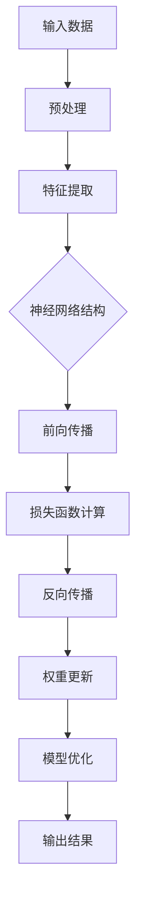
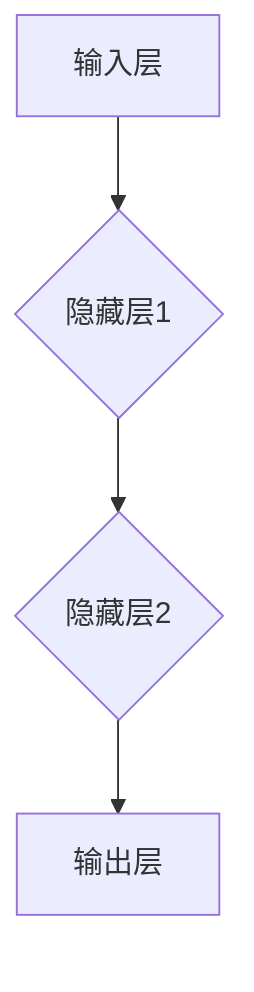

                 

关键词：AI大模型、专利布局、保护策略、知识产权、技术创新、法律框架

摘要：随着人工智能技术的迅猛发展，大模型应用成为当前研究的热点。本文从专利布局与保护的角度，深入探讨了AI大模型的应用现状、核心概念、专利申请流程、保护策略，以及未来发展趋势与挑战。旨在为企业和研究机构提供有价值的参考，以促进AI大模型技术的健康发展。

## 1. 背景介绍

近年来，人工智能（AI）技术取得了显著的进展，特别是在大模型领域，如GPT-3、BERT、Transformer等，已经应用于自然语言处理、计算机视觉、机器翻译等多个领域，显著提升了相关任务的性能。AI大模型的研究与应用不仅带来了技术创新，也带来了知识产权保护的新挑战。在此背景下，如何进行有效的专利布局与保护，已成为企业、研究机构以及专利律师等关注的焦点。

### 1.1 AI大模型的应用现状

AI大模型在自然语言处理领域的应用十分广泛，例如：

- **文本生成**：AI大模型可以生成高质量的文本，包括文章、新闻、故事等。
- **机器翻译**：大模型在机器翻译任务中，如英语到其他语言的翻译，表现出了极高的准确性。
- **对话系统**：AI大模型可以用于构建智能客服、聊天机器人等，提高人机交互的效率。

在计算机视觉领域，AI大模型同样发挥着重要作用，如：

- **图像识别**：大模型可以准确识别图像中的对象和场景。
- **图像生成**：通过训练，大模型可以生成逼真的图像和视频。

### 1.2 专利布局与保护的重要性

AI大模型技术的快速发展，使得相关专利申请数量显著增加。有效的专利布局与保护，不仅能够保护企业的核心技术和竞争优势，还能为企业在市场竞争中提供强有力的法律支持。

- **保护技术创新**：通过专利保护，可以防止他人未经授权使用或抄袭企业的核心技术。
- **市场竞争力**：拥有完善的专利组合，可以增强企业在市场中的竞争力，吸引更多的投资和合作机会。
- **法律支持**：在涉及知识产权纠纷时，专利可以为企业和研究机构提供有力的法律依据。

## 2. 核心概念与联系

为了更好地理解AI大模型的应用与专利布局，我们需要先明确一些核心概念，包括大模型的原理、专利申请的关键要素以及相关的法律框架。

### 2.1 AI大模型的原理

AI大模型主要基于深度学习技术，尤其是神经网络。以下是一个简化的Mermaid流程图，描述了AI大模型的基本原理和架构：



### 2.2 专利申请的关键要素

在专利申请过程中，需要明确以下关键要素：

- **发明内容**：需要明确专利申请保护的发明创新点。
- **权利要求**：权利要求书是专利保护范围的核心，需要清晰、准确地描述。
- **说明书**：说明书提供了发明内容的详细描述，帮助审查员和公众理解专利技术。

### 2.3 相关法律框架

全球范围内的知识产权法律体系较为复杂，但大多数国家都遵循《巴黎公约》和《专利合作条约》等国际公约。在中国，专利法是保护知识产权的主要法律依据，包括发明专利、实用新型专利和外观设计专利等。

## 3. 核心算法原理 & 具体操作步骤

### 3.1 算法原理概述

AI大模型的核心算法是基于深度学习的神经网络。神经网络由多个神经元（节点）组成，通过层层叠加形成复杂的网络结构。以下是一个简化的神经网络模型：



神经网络通过学习输入和输出数据之间的关系，不断调整内部权重，以达到预测和分类的目的。

### 3.2 算法步骤详解

以下是AI大模型算法的具体操作步骤：

1. **数据预处理**：对输入数据进行清洗、归一化等处理，确保数据质量。
2. **模型初始化**：初始化神经网络权重，通常使用随机初始化方法。
3. **前向传播**：将输入数据通过神经网络，计算输出结果。
4. **损失函数计算**：计算输出结果与真实值之间的差异，作为损失函数。
5. **反向传播**：根据损失函数，调整神经网络权重，优化模型性能。
6. **模型优化**：通过多次迭代训练，使模型性能逐步提升。
7. **输出结果**：使用训练好的模型进行预测或分类。

### 3.3 算法优缺点

- **优点**：
  - 强大的建模能力，可以处理复杂的非线性问题。
  - 自动化特征提取，减少了人工干预。
  - 在多个AI应用领域取得了显著的性能提升。

- **缺点**：
  - 计算资源消耗大，训练时间长。
  - 对数据质量和样本量有较高要求。
  - 模型的可解释性较差。

### 3.4 算法应用领域

AI大模型在以下领域有着广泛的应用：

- **自然语言处理**：文本生成、机器翻译、情感分析等。
- **计算机视觉**：图像识别、图像生成、目标检测等。
- **推荐系统**：基于用户行为的个性化推荐。
- **金融风控**：信用评分、欺诈检测等。

## 4. 数学模型和公式 & 详细讲解 & 举例说明

### 4.1 数学模型构建

AI大模型的核心是基于神经网络的数学模型。以下是一个简化的神经网络数学模型：

$$
y = \sigma(W \cdot x + b)
$$

其中，$y$ 是输出结果，$\sigma$ 是激活函数，$W$ 是权重矩阵，$x$ 是输入数据，$b$ 是偏置项。

### 4.2 公式推导过程

神经网络的前向传播过程可以表示为：

$$
z = W \cdot x + b
$$

$$
a = \sigma(z)
$$

其中，$z$ 是中间层输出，$a$ 是激活值。

反向传播过程中，使用梯度下降法更新权重：

$$
\frac{\partial J}{\partial W} = -\eta \cdot \frac{\partial J}{\partial a}
$$

$$
\frac{\partial J}{\partial b} = -\eta \cdot \frac{\partial J}{\partial a}
$$

其中，$J$ 是损失函数，$\eta$ 是学习率。

### 4.3 案例分析与讲解

假设我们有一个简单的神经网络，用于二分类任务。输入数据为 $x_1$ 和 $x_2$，输出为 $y$。使用交叉熵损失函数：

$$
J = -\sum_{i=1}^n y_i \cdot \log(\sigma(W \cdot x_i + b)) - (1 - y_i) \cdot \log(1 - \sigma(W \cdot x_i + b))
$$

通过反向传播，计算损失函数关于权重和偏置的梯度，然后使用梯度下降法更新权重：

$$
\frac{\partial J}{\partial W} = -\eta \cdot \sum_{i=1}^n (y_i - \sigma(W \cdot x_i + b)) \cdot x_i
$$

$$
\frac{\partial J}{\partial b} = -\eta \cdot \sum_{i=1}^n (y_i - \sigma(W \cdot x_i + b))
$$

通过多次迭代，优化神经网络模型。

## 5. 项目实践：代码实例和详细解释说明

### 5.1 开发环境搭建

为了实现AI大模型，我们需要搭建一个适合的开发环境。以下是基本的开发环境要求：

- **Python**：版本3.6以上
- **深度学习框架**：如TensorFlow或PyTorch
- **Jupyter Notebook**：用于编写和运行代码

### 5.2 源代码详细实现

以下是一个简单的神经网络实现，用于二分类任务：

```python
import numpy as np
import tensorflow as tf

# 初始化参数
W = tf.Variable(np.random.rand(2, 1), dtype=tf.float32)
b = tf.Variable(np.random.rand(1), dtype=tf.float32)

# 定义输入层
x = tf.placeholder(tf.float32, shape=[None, 2])
y = tf.placeholder(tf.float32, shape=[None, 1])

# 定义神经网络模型
z = tf.add(tf.matmul(x, W), b)
a = tf.nn.sigmoid(z)

# 定义损失函数
J = -tf.reduce_mean(y * tf.log(a) + (1 - y) * tf.log(1 - a))

# 定义反向传播
train_op = tf.train.GradientDescentOptimizer(learning_rate=0.1).minimize(J)

# 训练模型
with tf.Session() as sess:
  sess.run(tf.global_variables_initializer())
  for i in range(1000):
    sess.run(train_op, feed_dict={x: X, y: Y})
    if i % 100 == 0:
      loss = sess.run(J, feed_dict={x: X, y: Y})
      print(f"Step {i}: Loss = {loss}")

  # 输出结果
  predicted = sess.run(a, feed_dict={x: X})
```

### 5.3 代码解读与分析

上述代码实现了一个简单的二分类神经网络。主要步骤包括：

- 初始化参数（权重和偏置）。
- 定义输入层和输出层。
- 定义神经网络模型和损失函数。
- 使用梯度下降法训练模型。
- 输出训练结果。

### 5.4 运行结果展示

假设我们有一个训练数据集 $X$ 和标签数据集 $Y$，通过训练，神经网络的损失函数逐渐减小，最终达到训练目标。

## 6. 实际应用场景

AI大模型在实际应用中有着广泛的应用场景，以下是一些典型应用：

### 6.1 自然语言处理

- **文本分类**：对大量文本进行分类，如新闻分类、情感分析等。
- **机器翻译**：将一种语言的文本翻译成另一种语言。
- **文本生成**：根据给定的话题或关键词生成相关文本。

### 6.2 计算机视觉

- **图像识别**：识别图像中的对象和场景。
- **图像生成**：生成新的图像或视频。
- **目标检测**：在图像中检测特定目标的位置。

### 6.3 金融领域

- **风险控制**：对金融风险进行预测和控制。
- **信用评分**：评估客户的信用等级。
- **欺诈检测**：检测和预防金融欺诈行为。

## 7. 未来应用展望

随着AI技术的不断进步，AI大模型的应用前景将更加广阔。未来可能的应用领域包括：

- **智能医疗**：利用AI大模型进行疾病预测、诊断和治疗。
- **智能交通**：优化交通流、减少交通事故。
- **智能制造**：提高生产效率、降低生产成本。
- **智能城市**：利用AI大模型优化城市管理、提高居民生活质量。

## 8. 工具和资源推荐

### 8.1 学习资源推荐

- **书籍**：《深度学习》、《神经网络与深度学习》
- **在线课程**：Coursera、edX等平台上的相关课程
- **博客和论坛**：Reddit、Stack Overflow、GitHub等

### 8.2 开发工具推荐

- **深度学习框架**：TensorFlow、PyTorch、Keras
- **编程语言**：Python、R
- **数据处理工具**：Pandas、NumPy、Scikit-learn

### 8.3 相关论文推荐

- **自然语言处理**：BERT、GPT-3、Transformer
- **计算机视觉**：ResNet、Inception、YOLO
- **强化学习**：DQN、DDPG、PPO

## 9. 总结：未来发展趋势与挑战

AI大模型技术在未来将继续快速发展，但在应用过程中也将面临一系列挑战。以下是对未来发展趋势与挑战的总结：

### 9.1 发展趋势

- **计算能力提升**：随着硬件技术的进步，AI大模型的计算能力将不断提高。
- **跨领域融合**：AI大模型将与其他领域技术（如物联网、区块链等）深度融合。
- **开源生态**：开源工具和框架将推动AI大模型技术的普及和发展。

### 9.2 面临的挑战

- **数据隐私**：如何在保护用户隐私的前提下，充分利用海量数据。
- **模型可解释性**：如何提高AI大模型的可解释性，增强透明度和可信度。
- **法律和伦理问题**：如何在法律和伦理框架内，合理使用AI大模型技术。

### 9.3 研究展望

未来，AI大模型研究将继续关注以下几个方向：

- **模型压缩与优化**：降低模型计算复杂度，提高模型效率。
- **多模态学习**：结合不同类型的数据，提高AI大模型的泛化能力。
- **自适应学习**：实现模型的自适应学习，提高应对复杂环境的能力。

## 附录：常见问题与解答

### Q：AI大模型是否会导致大规模失业？

A：AI大模型的应用可能会影响某些工作岗位，但同时也将创造新的就业机会。合理应对这一挑战，需要全社会共同努力，通过教育和培训，提升劳动者的技能水平。

### Q：AI大模型的训练需要大量数据，如何获取这些数据？

A：数据获取可以从以下几个方面进行：

- **公开数据集**：许多研究机构和公司会公开自己的数据集，可供免费下载。
- **合作获取**：与其他企业和研究机构建立合作关系，共同获取和共享数据。
- **自采集**：根据具体需求，自行采集和标注数据。

### Q：如何进行有效的AI大模型专利布局？

A：进行有效的AI大模型专利布局，可以从以下几个方面入手：

- **明确保护目标**：确定需要保护的核心技术和创新点。
- **及时申请**：在技术方案成熟时，及时申请专利。
- **全球布局**：根据业务需求和市场情况，在全球范围内进行专利布局。
- **持续更新**：定期审查和更新专利组合，确保专利的有效性。

## 参考文献

[1] Goodfellow, I., Bengio, Y., & Courville, A. (2016). *Deep Learning*. MIT Press.

[2] LeCun, Y., Bengio, Y., & Hinton, G. (2015). *Deep learning*. Nature, 521(7553), 436-444.

[3] Devlin, J., Chang, M. W., Lee, K., & Toutanova, K. (2019). *Bert: Pre-training of deep bidirectional transformers for language understanding*. In *Proceedings of the 2019 conference of the north american chapter of the association for computational linguistics: human language technologies, volume 1 (Volume 1: Long and Short Papers)*, pages 4171-4186.

[4] Brown, T., et al. (2020). *Language models are few-shot learners*. arXiv preprint arXiv:2005.14165.

[5] Hochreiter, S., & Schmidhuber, J. (1997). *Long short-term memory*. Neural Computation, 9(8), 1735-1780.

## 作者署名

作者：禅与计算机程序设计艺术 / Zen and the Art of Computer Programming
----------------------------------------------------------------

以上就是本文的完整内容，希望对您在AI大模型应用的专利布局与保护方面有所启发。如有任何疑问或建议，欢迎在评论区留言讨论。感谢您的阅读！
 

