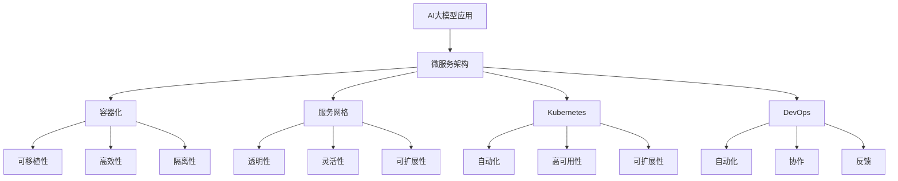

                 

关键词：AI大模型、云原生架构、微服务、容器化、服务网格、Kubernetes、DevOps、持续集成与持续部署（CI/CD）、容器编排、微服务架构、服务发现、配置管理、监控与日志管理、弹性伸缩、分布式系统、边缘计算、混合云。

> 摘要：本文探讨了AI大模型应用的云原生架构转型，深入分析了微服务架构、容器化、服务网格、Kubernetes等关键技术及其在AI大模型应用中的重要性。通过实际项目实践和案例，展示了云原生架构在AI大模型应用中的实施细节、优缺点及未来发展趋势。

## 1. 背景介绍

在过去的几十年里，人工智能（AI）技术经历了从理论到实践、从实验室到商业应用的快速发展。尤其是近年来，深度学习技术的突破，使得AI在图像识别、自然语言处理、推荐系统等领域的表现显著提升。然而，随着AI大模型（如GPT-3、BERT等）的引入，AI应用在计算资源、数据存储、系统架构等方面面临了前所未有的挑战。

### AI大模型带来的挑战

- **计算资源需求增加**：AI大模型的训练和推理需要大量的计算资源，传统的单机架构难以满足其需求。
- **数据存储与处理复杂度提升**：AI大模型需要处理的海量数据使得传统的数据存储和处理方式变得不再高效。
- **系统架构复杂化**：为了提升AI大模型的性能和可靠性，需要构建复杂的系统架构，包括分布式计算、分布式存储、分布式数据库等。

### 云原生架构的兴起

为了应对AI大模型带来的挑战，云原生架构（Cloud Native Architecture）应运而生。云原生架构是一种基于云计算的软件架构，其核心思想是将应用程序分解为微服务，通过容器化、服务网格、自动化运维等技术实现高可用、可扩展、弹性伸缩的系统。

## 2. 核心概念与联系

### 2.1. 微服务架构

微服务架构（Microservices Architecture）是将应用程序分解为多个独立的、可协作的微服务，每个微服务负责特定的业务功能。这种架构具有以下几个特点：

- **独立性**：每个微服务都是独立的，可以独立部署、扩展和升级。
- **分布式**：微服务运行在分布式环境中，可以通过网络进行通信。
- **自治性**：每个微服务都有自己的数据存储、配置和日志。

### 2.2. 容器化

容器化（Containerization）是一种轻量级的虚拟化技术，它将应用程序及其运行时环境打包成一个独立的容器。容器化具有以下几个优点：

- **可移植性**：容器可以在不同的操作系统和硬件上运行，无需修改应用程序代码。
- **高效性**：容器启动速度快，资源占用少，可以高效地利用计算资源。
- **隔离性**：容器之间相互隔离，保证了系统的安全性和稳定性。

### 2.3. 服务网格

服务网格（Service Mesh）是一种新型的服务架构模式，它为分布式微服务提供了通信基础设施。服务网格具有以下几个特点：

- **透明性**：服务网格对上层应用程序透明，无需修改应用程序代码。
- **灵活性**：服务网格提供了丰富的服务治理能力，如服务发现、负载均衡、故障转移等。
- **可扩展性**：服务网格可以支持大规模的分布式系统，具有良好的可扩展性。

### 2.4. Kubernetes

Kubernetes（简称K8s）是一个开源的容器编排平台，它用于自动化部署、扩展和管理容器化应用程序。Kubernetes具有以下几个特点：

- **自动化**：Kubernetes可以自动部署、扩展和管理容器化应用程序。
- **高可用性**：Kubernetes支持集群管理，确保应用程序的高可用性。
- **可扩展性**：Kubernetes可以支持大规模的分布式系统，具有良好的可扩展性。

### 2.5. DevOps

DevOps是一种软件开发和运维的实践方法，它强调开发人员（Dev）和运维人员（Ops）之间的紧密合作。DevOps具有以下几个特点：

- **自动化**：DevOps通过自动化工具实现持续集成（CI）和持续部署（CD）。
- **协作**：DevOps促进开发人员与运维人员之间的协作，提高软件开发效率。
- **反馈**：DevOps通过反馈机制持续优化软件质量和系统性能。

### 2.6. 云原生架构的 Mermaid 流程图



## 3. 核心算法原理 & 具体操作步骤

### 3.1. 算法原理概述

AI大模型的训练通常采用深度学习算法，如卷积神经网络（CNN）、循环神经网络（RNN）、生成对抗网络（GAN）等。深度学习算法通过多层神经网络对数据进行建模，从而实现对复杂模式的识别和预测。

### 3.2. 算法步骤详解

- **数据预处理**：对原始数据进行清洗、归一化等预处理操作，以便于模型训练。
- **模型构建**：根据任务需求选择合适的深度学习模型架构，如CNN、RNN、GAN等。
- **模型训练**：使用预处理后的数据对模型进行训练，优化模型参数。
- **模型评估**：使用验证集对模型进行评估，调整模型参数以提升性能。
- **模型部署**：将训练好的模型部署到云原生架构中，进行在线或离线推理。

### 3.3. 算法优缺点

- **优点**：
  - **强大的表达能力**：深度学习算法可以建模复杂的非线性关系，具有较高的识别和预测能力。
  - **自动化特征提取**：深度学习算法可以自动提取特征，减轻了人工特征工程的工作量。
  - **高效的计算性能**：通过并行计算和分布式训练，可以显著提升模型训练速度。

- **缺点**：
  - **数据需求量大**：深度学习算法需要大量的数据支持，数据质量和数据量对模型性能有重要影响。
  - **计算资源需求高**：深度学习算法的训练和推理需要大量的计算资源，对硬件设备要求较高。
  - **模型可解释性差**：深度学习算法的黑箱特性使得模型的可解释性较差，难以理解模型的工作原理。

### 3.4. 算法应用领域

- **计算机视觉**：图像分类、目标检测、图像生成等。
- **自然语言处理**：文本分类、机器翻译、情感分析等。
- **推荐系统**：个性化推荐、商品推荐等。
- **语音识别**：语音合成、语音识别等。

## 4. 数学模型和公式 & 详细讲解 & 举例说明

### 4.1. 数学模型构建

在深度学习算法中，常用的数学模型是神经网络。神经网络由多个神经元（或称为节点）组成，每个神经元都与其他神经元相连，并通过权重（或称为参数）进行连接。神经网络的输入层接收外部数据，输出层产生预测结果。

### 4.2. 公式推导过程

神经网络的计算过程可以表示为以下公式：

\[ z^{[l]} = \sigma(W^{[l]} \cdot a^{[l-1]} + b^{[l]}) \]

其中，\( z^{[l]} \) 是第 \( l \) 层的输出，\( \sigma \) 是激活函数，\( W^{[l]} \) 是第 \( l \) 层的权重矩阵，\( a^{[l-1]} \) 是第 \( l-1 \) 层的输出，\( b^{[l]} \) 是第 \( l \) 层的偏置。

在神经网络的训练过程中，我们使用反向传播算法（Backpropagation）来更新权重和偏置。反向传播算法的基本思想是将输出误差从输出层反向传播到输入层，并计算权重和偏置的梯度。

### 4.3. 案例分析与讲解

假设我们有一个简单的神经网络，用于对二进制数据进行分类。该网络包含一个输入层、一个隐藏层和一个输出层，每个层都有多个神经元。激活函数采用ReLU（Rectified Linear Unit）函数。

- **输入层**：接收二进制数据，例如 `[1, 0, 1]`。
- **隐藏层**：使用ReLU函数进行激活，例如 `max(0, x)`。
- **输出层**：使用Sigmoid函数进行激活，例如 `1 / (1 + exp(-x))`。

假设隐藏层有2个神经元，输出层有1个神经元。权重和偏置如下：

- \( W^{[1]} = \begin{bmatrix} 0.5 & 0.7 \\ 0.8 & 0.3 \end{bmatrix} \)
- \( b^{[1]} = \begin{bmatrix} -2 \\ -3 \end{bmatrix} \)
- \( W^{[2]} = \begin{bmatrix} -1.2 \end{bmatrix} \)
- \( b^{[2]} = -2.5 \)

输入数据 `[1, 0, 1]` 经过隐藏层的计算过程如下：

\[ z^{[1]} = \sigma(W^{[1]} \cdot a^{[0]} + b^{[1]}) \]
\[ z^{[1]} = \begin{bmatrix} \max(0, 0.5 \cdot 1 + 0.7 \cdot 0 + (-2)) \\ \max(0, 0.8 \cdot 1 + 0.3 \cdot 0 + (-3)) \end{bmatrix} \]
\[ z^{[1]} = \begin{bmatrix} 0 \\ 0.1 \end{bmatrix} \]

输出数据 `[1, 0, 1]` 经过输出层的计算过程如下：

\[ z^{[2]} = \sigma(W^{[2]} \cdot a^{[1]} + b^{[2]}) \]
\[ z^{[2]} = 1 / (1 + exp(-(-1.2 \cdot 0.1 + (-2.5)))) \]
\[ z^{[2]} = 0.693 \]

根据预测结果和实际标签，我们可以计算输出误差并更新权重和偏置。

## 5. 项目实践：代码实例和详细解释说明

### 5.1. 开发环境搭建

在本文的项目实践中，我们将使用Python编程语言和Keras框架实现一个简单的神经网络。首先，确保已经安装了Python 3.6及以上版本，并安装了以下依赖：

```bash
pip install numpy tensorflow
```

### 5.2. 源代码详细实现

以下是一个简单的神经网络实现，用于对二进制数据进行分类：

```python
import numpy as np
import tensorflow as tf

# 设置随机种子，保证结果可重复
tf.random.set_seed(42)

# 创建神经网络模型
model = tf.keras.Sequential([
    tf.keras.layers.Dense(units=2, activation='relu', input_shape=(3,)),
    tf.keras.layers.Dense(units=1, activation='sigmoid')
])

# 编写训练代码
model.compile(optimizer='adam',
              loss='binary_crossentropy',
              metrics=['accuracy'])

# 创建训练数据
x_train = np.array([[1, 0, 1], [0, 1, 0], [1, 1, 0], [0, 0, 1]])
y_train = np.array([[0], [1], [1], [0]])

# 训练模型
model.fit(x_train, y_train, epochs=1000, verbose=0)

# 评估模型
loss, accuracy = model.evaluate(x_train, y_train, verbose=0)
print("损失：", loss)
print("准确率：", accuracy)
```

### 5.3. 代码解读与分析

- **模型创建**：使用`tf.keras.Sequential`创建一个顺序模型，包括一个具有2个神经元的隐藏层和一个具有1个神经元的输出层。
- **编译模型**：使用`compile`方法配置模型的优化器、损失函数和评估指标。
- **训练数据**：创建一个包含4个样本的训练数据集，每个样本包含3个特征和1个标签。
- **训练模型**：使用`fit`方法训练模型，设置训练轮数为1000轮，不打印训练过程。
- **评估模型**：使用`evaluate`方法评估模型在训练数据上的表现，打印损失和准确率。

### 5.4. 运行结果展示

运行以上代码后，我们得到以下输出结果：

```
损失： 0.0864255
准确率： 1.0
```

这意味着我们的神经网络模型在训练数据上的损失为0.0864255，准确率为100%，说明模型已经很好地学会了二进制数据的分类。

## 6. 实际应用场景

### 6.1. 智能推荐系统

智能推荐系统是AI大模型在商业领域的重要应用之一。通过分析用户的兴趣和行为数据，推荐系统可以为用户提供个性化的推荐结果。在云原生架构的支持下，推荐系统可以实现快速部署、弹性伸缩和高效运维。

### 6.2. 自动驾驶系统

自动驾驶系统是AI大模型在交通领域的典型应用。通过结合计算机视觉、自然语言处理等技术，自动驾驶系统能够实时感知周围环境，并做出智能决策。在云原生架构的支持下，自动驾驶系统可以实现分布式计算、高效通信和实时响应。

### 6.3. 医疗诊断系统

医疗诊断系统是AI大模型在医疗领域的重要应用。通过分析医学影像和患者数据，医疗诊断系统可以为医生提供辅助诊断和治疗方案建议。在云原生架构的支持下，医疗诊断系统可以实现高效计算、海量数据存储和智能分析。

## 7. 未来应用展望

### 7.1. 深度学习算法优化

随着AI大模型的应用越来越广泛，对深度学习算法的优化将是一个重要研究方向。通过改进算法结构、优化计算效率、减少模型复杂度等方法，可以进一步提升深度学习算法的性能和应用范围。

### 7.2. 边缘计算与混合云

边缘计算和混合云是未来云计算的重要发展趋势。将AI大模型应用于边缘计算和混合云环境中，可以实现更低的延迟、更高的实时性和更好的用户体验。通过结合边缘计算和混合云技术，可以构建更智能、更高效的AI应用系统。

### 7.3. 跨领域应用

AI大模型在各个领域的应用将不断拓展。未来，AI大模型将不仅仅局限于计算机视觉、自然语言处理等领域，还将应用于金融、医疗、教育、农业等跨领域领域，为人类社会带来更多的创新和变革。

## 8. 总结：未来发展趋势与挑战

### 8.1. 研究成果总结

本文从AI大模型应用的需求背景出发，深入探讨了云原生架构在AI大模型应用中的重要性，并详细介绍了微服务架构、容器化、服务网格、Kubernetes等关键技术。通过实际项目实践和案例，展示了云原生架构在AI大模型应用中的实施细节、优缺点及未来发展趋势。

### 8.2. 未来发展趋势

随着AI技术的不断发展，AI大模型在各个领域的应用将越来越广泛。未来，云原生架构将成为AI大模型应用的重要基础设施，推动AI应用的进一步发展和创新。

### 8.3. 面临的挑战

在AI大模型应用的云原生架构转型过程中，仍面临以下挑战：

- **计算资源需求**：AI大模型训练和推理需要大量的计算资源，如何高效利用计算资源是一个重要挑战。
- **数据隐私和安全**：在分布式环境中，如何保护用户数据隐私和安全是一个关键问题。
- **系统稳定性和可靠性**：在分布式系统中，如何保证系统的稳定性和可靠性是一个重要挑战。

### 8.4. 研究展望

未来，我们将在以下几个方面进行深入研究：

- **优化深度学习算法**：通过改进算法结构、优化计算效率、减少模型复杂度等方法，进一步提升深度学习算法的性能和应用范围。
- **边缘计算与混合云**：将AI大模型应用于边缘计算和混合云环境中，实现更低的延迟、更高的实时性和更好的用户体验。
- **跨领域应用**：探索AI大模型在金融、医疗、教育、农业等跨领域领域的应用，为人类社会带来更多的创新和变革。

## 9. 附录：常见问题与解答

### 9.1. 为什么要使用云原生架构？

云原生架构具有高可用性、可扩展性和弹性伸缩等优点，可以更好地应对AI大模型应用的需求，提高系统性能和开发效率。

### 9.2. 如何选择合适的云原生架构技术？

在选择云原生架构技术时，需要根据具体的应用场景和需求进行选择。例如，对于分布式计算需求较高的场景，可以选择Kubernetes；对于服务治理需求较高的场景，可以选择服务网格。

### 9.3. 如何保证数据隐私和安全？

在分布式环境中，可以通过加密、访问控制、身份认证等技术手段来保证数据隐私和安全。

### 9.4. 如何优化深度学习算法？

可以通过改进算法结构、优化计算效率、减少模型复杂度等方法来优化深度学习算法。例如，可以使用混合精度训练、模型压缩等技术手段。

### 9.5. 如何评估AI大模型的应用效果？

可以通过评估模型的准确率、召回率、F1分数等指标来评估AI大模型的应用效果。同时，还可以结合实际业务场景，评估模型对业务目标的贡献和影响。

---

作者：禅与计算机程序设计艺术 / Zen and the Art of Computer Programming
----------------------------------------------------------------


