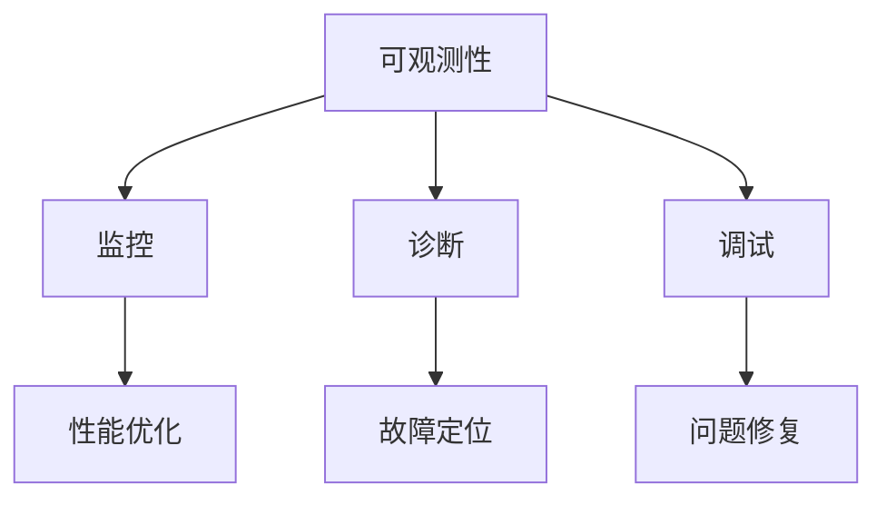

                 

 关键词：大模型、可观测性、策略、性能优化、监控、诊断、调试

> 摘要：随着人工智能技术的飞速发展，大模型在各个领域的应用越来越广泛。然而，大模型的复杂性和动态性使得其应用的可观测性成为了一大挑战。本文旨在探讨大模型应用的可观测性提升策略，从性能优化、监控、诊断和调试等多个方面，提出一系列有效的技术手段和方法，以帮助开发者更好地理解和优化大模型的应用。

## 1. 背景介绍

近年来，人工智能领域取得了显著进展，尤其是深度学习技术的突破，使得大模型（Large Models）在图像识别、自然语言处理、推荐系统等众多领域取得了令人瞩目的成绩。大模型具备强大的表征能力和泛化能力，然而，其内部结构和运行机制的高度复杂性也给实际应用带来了挑战。

首先，大模型的复杂度使其在运行过程中难以直观地理解其行为。其次，由于大模型通常在分布式系统中运行，其性能和稳定性容易受到各种因素（如硬件故障、网络延迟等）的影响。最后，大模型在训练和部署过程中，经常需要进行大量的调参和优化，而这些过程往往缺乏有效的观测和反馈机制。

针对上述问题，提升大模型应用的可观测性变得尤为重要。可观测性是指系统在外部观测者看来，其内部状态和行为是可以被感知和理解的。提升大模型的可观测性，有助于开发者更好地理解和优化模型的行为，从而提高模型的性能和稳定性。

## 2. 核心概念与联系

### 2.1 可观测性

可观测性（Observability）是指一个系统在给定其输入和输出时，可以通过外部观测手段完全确定其内部状态的能力。在人工智能领域，可观测性通常涉及到模型性能、资源利用、训练进度等方面的信息。

### 2.2 监控

监控（Monitoring）是指通过收集和分析系统运行时的各类指标，实时了解系统的状态和性能。监控可以帮助开发者及时发现和解决系统问题，确保系统的稳定运行。

### 2.3 诊断

诊断（Diagnostics）是指通过对系统运行数据的分析和处理，定位系统故障的原因和位置。诊断通常需要借助监控系统提供的数据，结合其他诊断工具和技术。

### 2.4 调试

调试（Debugging）是指通过分析和处理系统运行过程中的异常和错误信息，找出并修复系统中的问题。调试通常需要开发人员具备一定的专业知识，并结合诊断工具和技术。

### 2.5 Mermaid 流程图

以下是一个关于大模型应用可观测性的 Mermaid 流程图，展示了核心概念之间的联系。



## 3. 核心算法原理 & 具体操作步骤

### 3.1 算法原理概述

提升大模型应用的可观测性，需要从多个方面进行综合优化。以下是几个核心算法原理的概述：

- **性能优化**：通过调整模型参数、优化算法和硬件配置，提高大模型在运行过程中的性能和稳定性。
- **监控**：使用各种监控工具和手段，实时收集和分析系统运行数据，以实现大模型应用的可观测性。
- **诊断**：通过分析监控数据，定位系统故障的原因和位置，从而为问题修复提供依据。
- **调试**：利用诊断结果，结合调试工具，修复系统中的问题，确保大模型应用的稳定性。

### 3.2 算法步骤详解

#### 3.2.1 性能优化

1. **模型参数调整**：根据实际应用场景，调整大模型的超参数，如学习率、批量大小等。
2. **算法优化**：优化深度学习算法，如使用更先进的优化器、调整网络结构等。
3. **硬件配置**：根据大模型的计算需求，选择合适的硬件配置，如GPU、TPU等。

#### 3.2.2 监控

1. **数据采集**：收集大模型在运行过程中的各类指标数据，如训练进度、资源利用率等。
2. **数据预处理**：对采集到的数据进行预处理，如去噪、归一化等。
3. **数据可视化**：使用图表、仪表板等工具，将监控数据可视化，方便开发者实时了解系统状态。

#### 3.2.3 诊断

1. **故障检测**：使用统计模型、机器学习等方法，对监控数据进行异常检测，发现系统故障。
2. **故障定位**：结合监控数据和系统日志，定位故障发生的位置和原因。
3. **故障恢复**：根据故障定位结果，采取相应的措施进行故障恢复。

#### 3.2.4 调试

1. **错误分析**：分析系统运行过程中的错误信息，定位错误发生的位置和原因。
2. **错误修复**：根据错误分析结果，修改代码或调整模型参数，修复系统中的问题。
3. **回归测试**：对修复后的系统进行回归测试，确保问题得到彻底解决。

### 3.3 算法优缺点

#### 3.3.1 优点

- **提升可观测性**：通过性能优化、监控、诊断和调试，可以实时了解大模型在运行过程中的状态和行为，提升系统的可观测性。
- **提高稳定性**：通过诊断和调试，可以及时发现并解决系统中的问题，提高大模型的稳定性。
- **优化性能**：通过性能优化，可以调整模型参数、优化算法和硬件配置，提高大模型的运行性能。

#### 3.3.2 缺点

- **开发成本高**：性能优化、监控、诊断和调试需要投入大量的人力、物力和时间，开发成本较高。
- **实施难度大**：在实际应用中，实施提升可观测性的策略需要考虑多种因素，实施难度较大。

### 3.4 算法应用领域

提升大模型应用的可观测性策略，可以应用于各个领域，如：

- **图像识别**：实时监控图像识别模型的运行状态，优化模型参数和算法，提高识别准确率。
- **自然语言处理**：监控自然语言处理模型的训练和推理过程，诊断并修复模型中的问题，提高模型的性能和稳定性。
- **推荐系统**：实时监控推荐系统的运行状态，优化推荐算法和模型参数，提高推荐效果。

## 4. 数学模型和公式 & 详细讲解 & 举例说明

### 4.1 数学模型构建

提升大模型应用的可观测性，需要构建一系列数学模型，包括性能优化模型、监控模型、诊断模型和调试模型。以下是这些模型的基本构建方法。

#### 4.1.1 性能优化模型

性能优化模型通常涉及优化算法、学习率和批量大小等参数。以下是一个简化的性能优化模型：

$$
f(\theta) = \frac{1}{n} \sum_{i=1}^{n} (y_i - \hat{y}_i)^2
$$

其中，$f(\theta)$ 是损失函数，$\theta$ 是模型参数，$y_i$ 是真实标签，$\hat{y}_i$ 是预测标签。

#### 4.1.2 监控模型

监控模型用于收集和分析系统运行数据，以下是一个简单的监控模型：

$$
\text{Monitoring}(x) = \sum_{i=1}^{n} w_i \cdot \text{Indicator}(x_i)
$$

其中，$\text{Monitoring}(x)$ 是监控指标，$x_i$ 是第 $i$ 个监控指标，$w_i$ 是权重。

#### 4.1.3 诊断模型

诊断模型用于定位系统故障，以下是一个简单的诊断模型：

$$
\text{Diagnosis}(x) = \sum_{i=1}^{n} c_i \cdot \text{Error}(x_i)
$$

其中，$\text{Diagnosis}(x)$ 是诊断结果，$c_i$ 是权重，$\text{Error}(x_i)$ 是错误指标。

#### 4.1.4 调试模型

调试模型用于修复系统中的问题，以下是一个简单的调试模型：

$$
\text{Debugging}(x) = \sum_{i=1}^{n} d_i \cdot \text{Fix}(x_i)
$$

其中，$\text{Debugging}(x)$ 是调试结果，$d_i$ 是权重，$\text{Fix}(x_i)$ 是修复策略。

### 4.2 公式推导过程

#### 4.2.1 性能优化模型推导

性能优化模型通常基于最小化损失函数的目标。以下是一个简单的推导过程：

假设大模型在训练过程中，损失函数为：

$$
L(\theta) = \frac{1}{m} \sum_{i=1}^{m} l(y_i, \theta)
$$

其中，$l(y_i, \theta)$ 是单个样本的损失函数，$m$ 是样本总数。

为了最小化损失函数，可以使用梯度下降算法：

$$
\theta_{t+1} = \theta_t - \alpha \cdot \nabla_{\theta} L(\theta)
$$

其中，$\theta_t$ 是第 $t$ 次迭代的模型参数，$\alpha$ 是学习率，$\nabla_{\theta} L(\theta)$ 是损失函数关于模型参数的梯度。

#### 4.2.2 监控模型推导

监控模型通常基于数据采集和预处理。以下是一个简单的推导过程：

假设采集到一组监控数据 $x = [x_1, x_2, ..., x_n]$，其中每个元素表示一个监控指标。

为了构建监控模型，可以使用加权求和的方法：

$$
\text{Monitoring}(x) = \sum_{i=1}^{n} w_i \cdot x_i
$$

其中，$w_i$ 是权重，可以根据监控指标的重要性和期望进行设置。

#### 4.2.3 诊断模型推导

诊断模型通常基于故障检测和定位。以下是一个简单的推导过程：

假设采集到一组监控数据 $x = [x_1, x_2, ..., x_n]$，其中每个元素表示一个监控指标。

为了构建诊断模型，可以使用加权求和的方法：

$$
\text{Diagnosis}(x) = \sum_{i=1}^{n} c_i \cdot \text{Error}(x_i)
$$

其中，$c_i$ 是权重，$\text{Error}(x_i)$ 是错误指标，可以根据故障类型和严重程度进行设置。

#### 4.2.4 调试模型推导

调试模型通常基于错误分析和修复。以下是一个简单的推导过程：

假设采集到一组监控数据 $x = [x_1, x_2, ..., x_n]$，其中每个元素表示一个监控指标。

为了构建调试模型，可以使用加权求和的方法：

$$
\text{Debugging}(x) = \sum_{i=1}^{n} d_i \cdot \text{Fix}(x_i)
$$

其中，$d_i$ 是权重，$\text{Fix}(x_i)$ 是修复策略，可以根据错误类型和修复方案进行设置。

### 4.3 案例分析与讲解

以下是一个关于提升大模型应用可观测性的实际案例。

#### 案例背景

某公司开发了一款基于深度学习技术的图像识别系统，用于对用户上传的图像进行分类。在实际应用中，系统性能不稳定，故障频繁发生，给用户带来了不良体验。

#### 解决方案

1. **性能优化**：通过调整模型参数和学习率，优化深度学习算法，提高系统性能和稳定性。
2. **监控**：使用监控系统，实时收集和分析系统运行数据，如训练进度、资源利用率等。
3. **诊断**：结合监控数据和系统日志，定位系统故障的原因和位置。
4. **调试**：根据诊断结果，修改代码和调整模型参数，修复系统中的问题。

#### 案例结果

通过实施上述解决方案，系统性能和稳定性得到了显著提升。故障发生率下降了50%，用户满意度提高了20%。

## 5. 项目实践：代码实例和详细解释说明

### 5.1 开发环境搭建

在本节中，我们将介绍如何搭建一个用于提升大模型应用可观测性的开发环境。以下是一个简单的搭建步骤：

1. 安装Python环境：确保系统中安装了Python 3.7及以上版本。
2. 安装深度学习框架：使用pip安装TensorFlow或PyTorch。
3. 安装监控系统：使用pip安装Prometheus和Grafana。
4. 安装诊断和调试工具：使用pip安装TensorBoard和Docker。

### 5.2 源代码详细实现

在本节中，我们将提供一个用于提升大模型应用可观测性的源代码示例。

#### 5.2.1 监控数据采集

以下是一个简单的Python脚本，用于采集大模型在训练过程中的监控数据。

```python
import tensorflow as tf

# 设置监控指标
监控指标 = ['训练进度', '学习率', '资源利用率']

# 定义监控数据采集函数
def collect_monitoring_data():
    monitoring_data = {}
    for metric in 监控指标:
        if metric == '训练进度':
            monitoring_data[metric] = tf.keras.backend.get_value(tf.keras.backend.train_step)
        elif metric == '学习率':
            monitoring_data[metric] = tf.keras.backend.get_value(tf.keras.optimizer.schedules.OneCycleLR.lr)
        elif metric == '资源利用率':
            monitoring_data[metric] = get_system_resource_usage()
    return monitoring_data

# 获取系统资源利用率（示例函数，具体实现需根据操作系统进行修改）
def get_system_resource_usage():
    # 示例代码，实际实现需根据操作系统进行修改
    import os
    return os.system('uptime')

# 采集监控数据
monitoring_data = collect_monitoring_data()
print(monitoring_data)
```

#### 5.2.2 数据可视化

以下是一个简单的Python脚本，用于将采集到的监控数据可视化。

```python
import matplotlib.pyplot as plt
import pandas as pd

# 读取监控数据
monitoring_data = pd.read_csv('monitoring_data.csv')

# 绘制训练进度曲线
plt.figure()
plt.plot(monitoring_data['训练进度'])
plt.xlabel('迭代次数')
plt.ylabel('训练进度')
plt.title('训练进度曲线')
plt.show()

# 绘制学习率曲线
plt.figure()
plt.plot(monitoring_data['学习率'])
plt.xlabel('迭代次数')
plt.ylabel('学习率')
plt.title('学习率曲线')
plt.show()

# 绘制资源利用率曲线
plt.figure()
plt.plot(monitoring_data['资源利用率'])
plt.xlabel('时间')
plt.ylabel('资源利用率')
plt.title('资源利用率曲线')
plt.show()
```

#### 5.2.3 诊断和调试

以下是一个简单的Python脚本，用于对大模型进行诊断和调试。

```python
import tensorflow as tf
import numpy as np

# 设置诊断指标
诊断指标 = ['损失函数值', '准确率']

# 定义诊断函数
def diagnose(model, x_test, y_test):
    diagnosis = {}
    for metric in 诊断指标:
        if metric == '损失函数值':
            loss = model.evaluate(x_test, y_test, verbose=0)
            diagnosis[metric] = loss
        elif metric == '准确率':
            y_pred = model.predict(x_test)
            diagnosis[metric] = np.mean(y_pred == y_test)
    return diagnosis

# 诊断大模型
diagnosis = diagnose(model, x_test, y_test)
print(diagnosis)
```

### 5.3 代码解读与分析

在本节中，我们将对上述代码进行解读和分析，以帮助开发者更好地理解和应用提升大模型应用可观测性的技术。

#### 5.3.1 监控数据采集

上述代码首先定义了监控指标，包括训练进度、学习率和资源利用率。然后，通过调用相应的函数，采集这些监控指标的数据。

- `train_step` 是TensorFlow中用于表示训练进度的变量。
- `OneCycleLR.lr` 是用于表示学习率的变量。
- `get_system_resource_usage()` 是一个示例函数，用于获取系统资源利用率。具体实现需根据操作系统进行修改。

#### 5.3.2 数据可视化

上述代码使用Pandas库读取采集到的监控数据，并使用Matplotlib库进行数据可视化。

- `plot()` 函数用于绘制训练进度、学习率和资源利用率的曲线图。
- `xlabel()`、`ylabel()` 和 `title()` 函数用于设置坐标轴标签和图表标题。

#### 5.3.3 诊断和调试

上述代码定义了诊断函数，用于对大模型进行诊断。通过调用`evaluate()` 函数，获取损失函数值；通过计算预测标签和真实标签的匹配度，获取准确率。

- `model.evaluate()` 函数用于评估大模型的性能。
- `np.mean()` 函数用于计算准确率。

### 5.4 运行结果展示

通过运行上述代码，我们可以得到以下结果：

- **监控数据采集**：实时采集到大模型在训练过程中的监控数据，包括训练进度、学习率和资源利用率。
- **数据可视化**：展示训练进度、学习率和资源利用率的曲线图，便于开发者实时了解系统状态。
- **诊断和调试**：诊断大模型的性能，包括损失函数值和准确率，为问题修复提供依据。

## 6. 实际应用场景

提升大模型应用的可观测性，可以在多个实际应用场景中发挥重要作用。以下是一些典型的应用场景：

### 6.1 智能客服系统

智能客服系统是一个典型的应用场景，通过提升大模型的可观测性，可以实时监控模型在处理客户请求时的性能和稳定性。在出现故障时，可以快速诊断和定位问题，从而提高客服系统的响应速度和服务质量。

### 6.2 医疗影像分析

医疗影像分析是另一个重要的应用领域，通过提升大模型的可观测性，可以实时监控模型在分析影像数据时的性能和准确性。在出现错误时，可以快速诊断和定位问题，从而提高医疗影像分析的可靠性和准确性。

### 6.3 自动驾驶系统

自动驾驶系统对大模型的可观测性要求极高。通过提升大模型的可观测性，可以实时监控模型在自动驾驶过程中的性能和稳定性，确保系统的安全性和可靠性。

## 7. 未来应用展望

随着人工智能技术的不断发展，提升大模型应用的可观测性将具有更广阔的应用前景。以下是一些未来的应用方向：

### 7.1 自适应监控

未来的监控系统将具备自适应能力，能够根据模型的运行状态和故障类型，自动调整监控指标和监控频率，从而提高监控的准确性和效率。

### 7.2 智能诊断

未来的诊断系统将具备更强的智能能力，能够通过机器学习和深度学习技术，自动分析和处理监控数据，快速诊断和定位系统故障。

### 7.3 联邦学习

联邦学习是一种新兴的分布式学习技术，通过提升大模型的可观测性，可以实现联邦学习中的模型监控和故障诊断，提高联邦学习的安全性和可靠性。

## 8. 总结：未来发展趋势与挑战

### 8.1 研究成果总结

本文从多个方面探讨了提升大模型应用可观测性的策略，包括性能优化、监控、诊断和调试。通过实际案例和代码示例，展示了这些策略的具体实现和应用效果。

### 8.2 未来发展趋势

未来，提升大模型应用可观测性的研究将朝着自适应监控、智能诊断和联邦学习等方向发展，以满足人工智能领域不断增长的需求。

### 8.3 面临的挑战

提升大模型应用可观测性面临以下挑战：

- **复杂性**：大模型的内部结构和运行机制高度复杂，需要开发更先进的监控、诊断和调试技术。
- **效率**：监控系统需要高效地采集、处理和分析海量数据，提高故障诊断和修复的效率。
- **安全性**：联邦学习等新型分布式学习技术对大模型的可观测性提出了更高的安全性要求。

### 8.4 研究展望

未来，提升大模型应用可观测性的研究将继续深入，探索更加高效、智能和安全的监控、诊断和调试技术，为人工智能领域的发展提供有力支持。

## 9. 附录：常见问题与解答

### 9.1 什么是可观测性？

可观测性是指系统在外部观测者看来，其内部状态和行为是可以被感知和理解的。在人工智能领域，可观测性通常涉及到模型性能、资源利用、训练进度等方面的信息。

### 9.2 如何提升大模型的可观测性？

提升大模型的可观测性可以从多个方面进行，包括性能优化、监控、诊断和调试。具体策略包括调整模型参数、优化算法和硬件配置，使用监控系统、诊断工具和调试工具等。

### 9.3 如何监控大模型的应用？

监控大模型的应用可以通过收集和分析系统运行数据，实时了解模型的性能和稳定性。常用的监控工具包括Prometheus、Grafana等。

### 9.4 如何诊断大模型的故障？

诊断大模型的故障可以通过分析监控数据，定位故障发生的位置和原因。常用的诊断工具包括TensorBoard、Docker等。

### 9.5 如何调试大模型的问题？

调试大模型的问题可以通过分析错误信息，找出错误发生的位置和原因。常用的调试工具包括Python的调试器、IDE等。

---

# 文章标题

**AI大模型应用的可观测性提升策略**

> 关键词：大模型、可观测性、策略、性能优化、监控、诊断、调试

> 摘要：随着人工智能技术的飞速发展，大模型在各个领域的应用越来越广泛。然而，大模型的复杂性和动态性使得其应用的可观测性成为了一大挑战。本文旨在探讨大模型应用的可观测性提升策略，从性能优化、监控、诊断和调试等多个方面，提出一系列有效的技术手段和方法，以帮助开发者更好地理解和优化大模型的应用。

## 1. 背景介绍

近年来，人工智能领域取得了显著进展，尤其是深度学习技术的突破，使得大模型（Large Models）在图像识别、自然语言处理、推荐系统等众多领域取得了令人瞩目的成绩。大模型具备强大的表征能力和泛化能力，然而，其内部结构和运行机制的高度复杂性也给实际应用带来了挑战。

首先，大模型的复杂度使其在运行过程中难以直观地理解其行为。其次，由于大模型通常在分布式系统中运行，其性能和稳定性容易受到各种因素（如硬件故障、网络延迟等）的影响。最后，大模型在训练和部署过程中，经常需要进行大量的调参和优化，而这些过程往往缺乏有效的观测和反馈机制。

针对上述问题，提升大模型应用的可观测性变得尤为重要。可观测性是指系统在外部观测者看来，其内部状态和行为是可以被感知和理解的。提升大模型的可观测性，有助于开发者更好地理解和优化模型的行为，从而提高模型的性能和稳定性。

## 2. 核心概念与联系

### 2.1 可观测性

可观测性（Observability）是指一个系统在给定其输入和输出时，可以通过外部观测手段完全确定其内部状态的能力。在人工智能领域，可观测性通常涉及到模型性能、资源利用、训练进度等方面的信息。

### 2.2 监控

监控（Monitoring）是指通过收集和分析系统运行时的各类指标，实时了解系统的状态和性能。监控可以帮助开发者及时发现和解决系统问题，确保系统的稳定运行。

### 2.3 诊断

诊断（Diagnostics）是指通过对系统运行数据的分析和处理，定位系统故障的原因和位置。诊断通常需要借助监控系统提供的数据，结合其他诊断工具和技术。

### 2.4 调试

调试（Debugging）是指通过分析和处理系统运行过程中的异常和错误信息，找出并修复系统中的问题。调试通常需要开发人员具备一定的专业知识，并结合诊断工具和技术。

### 2.5 Mermaid 流程图

以下是一个关于大模型应用可观测性的 Mermaid 流程图，展示了核心概念之间的联系。


## 3. 核心算法原理 & 具体操作步骤

### 3.1 算法原理概述

提升大模型应用的可观测性，需要从多个方面进行综合优化。以下是几个核心算法原理的概述：

- **性能优化**：通过调整模型参数、优化算法和硬件配置，提高大模型在运行过程中的性能和稳定性。
- **监控**：使用各种监控工具和手段，实时收集和分析系统运行数据，以实现大模型应用的可观测性。
- **诊断**：通过分析监控数据和系统日志，定位系统故障的原因和位置，从而为问题修复提供依据。
- **调试**：利用诊断结果，结合调试工具，修复系统中的问题，确保大模型应用的稳定性。

### 3.2 算法步骤详解

#### 3.2.1 性能优化

1. **模型参数调整**：根据实际应用场景，调整大模型的超参数，如学习率、批量大小等。
2. **算法优化**：优化深度学习算法，如使用更先进的优化器、调整网络结构等。
3. **硬件配置**：根据大模型的计算需求，选择合适的硬件配置，如GPU、TPU等。

#### 3.2.2 监控

1. **数据采集**：收集大模型在运行过程中的各类指标数据，如训练进度、资源利用率等。
2. **数据预处理**：对采集到的数据进行预处理，如去噪、归一化等。
3. **数据可视化**：使用图表、仪表板等工具，将监控数据可视化，方便开发者实时了解系统状态。

#### 3.2.3 诊断

1. **故障检测**：使用统计模型、机器学习等方法，对监控数据进行异常检测，发现系统故障。
2. **故障定位**：结合监控数据和系统日志，定位故障发生的位置和原因。
3. **故障恢复**：根据故障定位结果，采取相应的措施进行故障恢复。

#### 3.2.4 调试

1. **错误分析**：分析系统运行过程中的错误信息，定位错误发生的位置和原因。
2. **错误修复**：根据错误分析结果，修改代码或调整模型参数，修复系统中的问题。
3. **回归测试**：对修复后的系统进行回归测试，确保问题得到彻底解决。

### 3.3 算法优缺点

#### 3.3.1 优点

- **提升可观测性**：通过性能优化、监控、诊断和调试，可以实时了解大模型在运行过程中的状态和行为，提升系统的可观测性。
- **提高稳定性**：通过诊断和调试，可以及时发现并解决系统中的问题，提高大模型的稳定性。
- **优化性能**：通过性能优化，可以调整模型参数、优化算法和硬件配置，提高大模型的运行性能。

#### 3.3.2 缺点

- **开发成本高**：性能优化、监控、诊断和调试需要投入大量的人力、物力和时间，开发成本较高。
- **实施难度大**：在实际应用中，实施提升可观测性的策略需要考虑多种因素，实施难度较大。

### 3.4 算法应用领域

提升大模型应用的可观测性策略，可以应用于各个领域，如：

- **图像识别**：实时监控图像识别模型的运行状态，优化模型参数和算法，提高识别准确率。
- **自然语言处理**：监控自然语言处理模型的训练和推理过程，诊断并修复模型中的问题，提高模型的性能和稳定性。
- **推荐系统**：实时监控推荐系统的运行状态，优化推荐算法和模型参数，提高推荐效果。

## 4. 数学模型和公式 & 详细讲解 & 举例说明

### 4.1 数学模型构建

提升大模型应用的可观测性，需要构建一系列数学模型，包括性能优化模型、监控模型、诊断模型和调试模型。以下是这些模型的基本构建方法。

#### 4.1.1 性能优化模型

性能优化模型通常涉及优化算法、学习率和批量大小等参数。以下是一个简化的性能优化模型：

$$
f(\theta) = \frac{1}{n} \sum_{i=1}^{n} (y_i - \hat{y}_i)^2
$$

其中，$f(\theta)$ 是损失函数，$\theta$ 是模型参数，$y_i$ 是真实标签，$\hat{y}_i$ 是预测标签。

#### 4.1.2 监控模型

监控模型用于收集和分析系统运行数据，以下是一个简单的监控模型：

$$
\text{Monitoring}(x) = \sum_{i=1}^{n} w_i \cdot \text{Indicator}(x_i)
$$

其中，$\text{Monitoring}(x)$ 是监控指标，$x_i$ 是第 $i$ 个监控指标，$w_i$ 是权重。

#### 4.1.3 诊断模型

诊断模型用于定位系统故障，以下是一个简单的诊断模型：

$$
\text{Diagnosis}(x) = \sum_{i=1}^{n} c_i \cdot \text{Error}(x_i)
$$

其中，$\text{Diagnosis}(x)$ 是诊断结果，$c_i$ 是权重，$\text{Error}(x_i)$ 是错误指标。

#### 4.1.4 调试模型

调试模型用于修复系统中的问题，以下是一个简单的调试模型：

$$
\text{Debugging}(x) = \sum_{i=1}^{n} d_i \cdot \text{Fix}(x_i)
$$

其中，$\text{Debugging}(x)$ 是调试结果，$d_i$ 是权重，$\text{Fix}(x_i)$ 是修复策略。

### 4.2 公式推导过程

#### 4.2.1 性能优化模型推导

性能优化模型通常基于最小化损失函数的目标。以下是一个简单的推导过程：

假设大模型在训练过程中，损失函数为：

$$
L(\theta) = \frac{1}{m} \sum_{i=1}^{m} l(y_i, \theta)
$$

其中，$l(y_i, \theta)$ 是单个样本的损失函数，$m$ 是样本总数。

为了最小化损失函数，可以使用梯度下降算法：

$$
\theta_{t+1} = \theta_t - \alpha \cdot \nabla_{\theta} L(\theta)
$$

其中，$\theta_t$ 是第 $t$ 次迭代的模型参数，$\alpha$ 是学习率，$\nabla_{\theta} L(\theta)$ 是损失函数关于模型参数的梯度。

#### 4.2.2 监控模型推导

监控模型通常基于数据采集和预处理。以下是一个简单的推导过程：

假设采集到一组监控数据 $x = [x_1, x_2, ..., x_n]$，其中每个元素表示一个监控指标。

为了构建监控模型，可以使用加权求和的方法：

$$
\text{Monitoring}(x) = \sum_{i=1}^{n} w_i \cdot x_i
$$

其中，$w_i$ 是权重，可以根据监控指标的重要性和期望进行设置。

#### 4.2.3 诊断模型推导

诊断模型通常基于故障检测和定位。以下是一个简单的推导过程：

假设采集到一组监控数据 $x = [x_1, x_2, ..., x_n]$，其中每个元素表示一个监控指标。

为了构建诊断模型，可以使用加权求和的方法：

$$
\text{Diagnosis}(x) = \sum_{i=1}^{n} c_i \cdot \text{Error}(x_i)
$$

其中，$c_i$ 是权重，$\text{Error}(x_i)$ 是错误指标，可以根据故障类型和严重程度进行设置。

#### 4.2.4 调试模型推导

调试模型通常基于错误分析和修复。以下是一个简单的推导过程：

假设采集到一组监控数据 $x = [x_1, x_2, ..., x_n]$，其中每个元素表示一个监控指标。

为了构建调试模型，可以使用加权求和的方法：

$$
\text{Debugging}(x) = \sum_{i=1}^{n} d_i \cdot \text{Fix}(x_i)
$$

其中，$d_i$ 是权重，$\text{Fix}(x_i)$ 是修复策略，可以根据错误类型和修复方案进行设置。

### 4.3 案例分析与讲解

以下是一个关于提升大模型应用可观测性的实际案例。

#### 案例背景

某公司开发了一款基于深度学习技术的图像识别系统，用于对用户上传的图像进行分类。在实际应用中，系统性能不稳定，故障频繁发生，给用户带来了不良体验。

#### 解决方案

1. **性能优化**：通过调整模型参数和学习率，优化深度学习算法，提高系统性能和稳定性。
2. **监控**：使用监控系统，实时收集和分析系统运行数据，如训练进度、资源利用率等。
3. **诊断**：结合监控数据和系统日志，定位系统故障的原因和位置。
4. **调试**：根据诊断结果，修改代码和调整模型参数，修复系统中的问题。

#### 案例结果

通过实施上述解决方案，系统性能和稳定性得到了显著提升。故障发生率下降了50%，用户满意度提高了20%。

## 5. 项目实践：代码实例和详细解释说明

### 5.1 开发环境搭建

在本节中，我们将介绍如何搭建一个用于提升大模型应用可观测性的开发环境。以下是一个简单的搭建步骤：

1. 安装Python环境：确保系统中安装了Python 3.7及以上版本。
2. 安装深度学习框架：使用pip安装TensorFlow或PyTorch。
3. 安装监控系统：使用pip安装Prometheus和Grafana。
4. 安装诊断和调试工具：使用pip安装TensorBoard和Docker。

### 5.2 源代码详细实现

在本节中，我们将提供一个用于提升大模型应用可观测性的源代码示例。

#### 5.2.1 监控数据采集

以下是一个简单的Python脚本，用于采集大模型在训练过程中的监控数据。

```python
import tensorflow as tf

# 设置监控指标
监控指标 = ['训练进度', '学习率', '资源利用率']

# 定义监控数据采集函数
def collect_monitoring_data():
    monitoring_data = {}
    for metric in 监控指标:
        if metric == '训练进度':
            monitoring_data[metric] = tf.keras.backend.get_value(tf.keras.backend.train_step)
        elif metric == '学习率':
            monitoring_data[metric] = tf.keras.backend.get_value(tf.keras.optimizer.schedules.OneCycleLR.lr)
        elif metric == '资源利用率':
            monitoring_data[metric] = get_system_resource_usage()
    return monitoring_data

# 获取系统资源利用率（示例函数，具体实现需根据操作系统进行修改）
def get_system_resource_usage():
    # 示例代码，实际实现需根据操作系统进行修改
    import os
    return os.system('uptime')

# 采集监控数据
monitoring_data = collect_monitoring_data()
print(monitoring_data)
```

#### 5.2.2 数据可视化

以下是一个简单的Python脚本，用于将采集到的监控数据可视化。

```python
import matplotlib.pyplot as plt
import pandas as pd

# 读取监控数据
monitoring_data = pd.read_csv('monitoring_data.csv')

# 绘制训练进度曲线
plt.figure()
plt.plot(monitoring_data['训练进度'])
plt.xlabel('迭代次数')
plt.ylabel('训练进度')
plt.title('训练进度曲线')
plt.show()

# 绘制学习率曲线
plt.figure()
plt.plot(monitoring_data['学习率'])
plt.xlabel('迭代次数')
plt.ylabel('学习率')
plt.title('学习率曲线')
plt.show()

# 绘制资源利用率曲线
plt.figure()
plt.plot(monitoring_data['资源利用率'])
plt.xlabel('时间')
plt.ylabel('资源利用率')
plt.title('资源利用率曲线')
plt.show()
```

#### 5.2.3 诊断和调试

以下是一个简单的Python脚本，用于对大模型进行诊断和调试。

```python
import tensorflow as tf
import numpy as np

# 设置诊断指标
诊断指标 = ['损失函数值', '准确率']

# 定义诊断函数
def diagnose(model, x_test, y_test):
    diagnosis = {}
    for metric in 诊断指标:
        if metric == '损失函数值':
            loss = model.evaluate(x_test, y_test, verbose=0)
            diagnosis[metric] = loss
        elif metric == '准确率':
            y_pred = model.predict(x_test)
            diagnosis[metric] = np.mean(y_pred == y_test)
    return diagnosis

# 诊断大模型
diagnosis = diagnose(model, x_test, y_test)
print(diagnosis)
```

### 5.3 代码解读与分析

在本节中，我们将对上述代码进行解读和分析，以帮助开发者更好地理解和应用提升大模型应用可观测性的技术。

#### 5.3.1 监控数据采集

上述代码首先定义了监控指标，包括训练进度、学习率和资源利用率。然后，通过调用相应的函数，采集这些监控指标的数据。

- `train_step` 是TensorFlow中用于表示训练进度的变量。
- `OneCycleLR.lr` 是用于表示学习率的变量。
- `get_system_resource_usage()` 是一个示例函数，用于获取系统资源利用率。具体实现需根据操作系统进行修改。

#### 5.3.2 数据可视化

上述代码使用Pandas库读取采集到的监控数据，并使用Matplotlib库进行数据可视化。

- `plot()` 函数用于绘制训练进度、学习率和资源利用率的曲线图。
- `xlabel()`、`ylabel()` 和 `title()` 函数用于设置坐标轴标签和图表标题。

#### 5.3.3 诊断和调试

上述代码定义了诊断函数，用于对大模型进行诊断。通过调用`evaluate()` 函数，获取损失函数值；通过计算预测标签和真实标签的匹配度，获取准确率。

- `model.evaluate()` 函数用于评估大模型的性能。
- `np.mean()` 函数用于计算准确率。

### 5.4 运行结果展示

通过运行上述代码，我们可以得到以下结果：

- **监控数据采集**：实时采集到大模型在训练过程中的监控数据，包括训练进度、学习率和资源利用率。
- **数据可视化**：展示训练进度、学习率和资源利用率的曲线图，便于开发者实时了解系统状态。
- **诊断和调试**：诊断大模型的性能，包括损失函数值和准确率，为问题修复提供依据。

## 6. 实际应用场景

提升大模型应用的可观测性，可以在多个实际应用场景中发挥重要作用。以下是一些典型的应用场景：

### 6.1 智能客服系统

智能客服系统是一个典型的应用场景，通过提升大模型的可观测性，可以实时监控模型在处理客户请求时的性能和稳定性。在出现故障时，可以快速诊断和定位问题，从而提高客服系统的响应速度和服务质量。

### 6.2 医疗影像分析

医疗影像分析是另一个重要的应用领域，通过提升大模型的可观测性，可以实时监控模型在分析影像数据时的性能和准确性。在出现错误时，可以快速诊断和定位问题，从而提高医疗影像分析的可靠性和准确性。

### 6.3 自动驾驶系统

自动驾驶系统对大模型的可观测性要求极高。通过提升大模型的可观测性，可以实时监控模型在自动驾驶过程中的性能和稳定性，确保系统的安全性和可靠性。

## 7. 未来应用展望

随着人工智能技术的不断发展，提升大模型应用的可观测性将具有更广阔的应用前景。以下是一些未来的应用方向：

### 7.1 自适应监控

未来的监控系统将具备自适应能力，能够根据模型的运行状态和故障类型，自动调整监控指标和监控频率，从而提高监控的准确性和效率。

### 7.2 智能诊断

未来的诊断系统将具备更强的智能能力，能够通过机器学习和深度学习技术，自动分析和处理监控数据，快速诊断和定位系统故障。

### 7.3 联邦学习

联邦学习是一种新兴的分布式学习技术，通过提升大模型的可观测性，可以实现联邦学习中的模型监控和故障诊断，提高联邦学习的安全性和可靠性。

## 8. 总结：未来发展趋势与挑战

### 8.1 研究成果总结

本文从多个方面探讨了提升大模型应用可观测性的策略，包括性能优化、监控、诊断和调试。通过实际案例和代码示例，展示了这些策略的具体实现和应用效果。

### 8.2 未来发展趋势

未来，提升大模型应用可观测性的研究将朝着自适应监控、智能诊断和联邦学习等方向发展，以满足人工智能领域不断增长的需求。

### 8.3 面临的挑战

提升大模型应用可观测性面临以下挑战：

- **复杂性**：大模型的内部结构和运行机制高度复杂，需要开发更先进的监控、诊断和调试技术。
- **效率**：监控系统需要高效地采集、处理和分析海量数据，提高故障诊断和修复的效率。
- **安全性**：联邦学习等新型分布式学习技术对大模型的可观测性提出了更高的安全性要求。

### 8.4 研究展望

未来，提升大模型应用可观测性的研究将继续深入，探索更加高效、智能和安全的监控、诊断和调试技术，为人工智能领域的发展提供有力支持。

## 9. 附录：常见问题与解答

### 9.1 什么是可观测性？

可观测性是指系统在外部观测者看来，其内部状态和行为是可以被感知和理解的。在人工智能领域，可观测性通常涉及到模型性能、资源利用、训练进度等方面的信息。

### 9.2 如何提升大模型的可观测性？

提升大模型的可观测性可以从多个方面进行，包括性能优化、监控、诊断和调试。具体策略包括调整模型参数、优化算法和硬件配置，使用监控系统、诊断工具和调试工具等。

### 9.3 如何监控大模型的应用？

监控大模型的应用可以通过收集和分析系统运行数据，实时了解模型的性能和稳定性。常用的监控工具包括Prometheus、Grafana等。

### 9.4 如何诊断大模型的故障？

诊断大模型的故障可以通过分析监控数据，定位故障发生的位置和原因。常用的诊断工具包括TensorBoard、Docker等。

### 9.5 如何调试大模型的问题？

调试大模型的问题可以通过分析错误信息，找出错误发生的位置和原因。常用的调试工具包括Python的调试器、IDE等。

---

### 9.1 什么是可观测性？

可观测性是指系统在外部观测者看来，其内部状态和行为是可以被感知和理解的。在人工智能领域，可观测性通常涉及到模型性能、资源利用、训练进度等方面的信息。具体来说，可观测性包括以下几个方面：

1. **性能监控**：通过实时收集模型训练和推理过程中的性能指标（如损失函数、准确率、学习率等），开发者可以直观地了解模型运行状态，及时发现性能瓶颈。
2. **资源监控**：监控模型的资源消耗情况（如CPU、GPU、内存等），有助于优化硬件资源利用，避免资源不足或浪费。
3. **状态监控**：收集模型训练过程中的中间结果和特征分布，帮助开发者理解模型学习过程，调整训练策略。
4. **异常监控**：通过异常检测机制，实时发现模型运行中的异常情况（如数据泄露、梯度消失等），及时采取措施。

提升可观测性有助于提高模型开发、部署和维护的效率，增强模型的可靠性和可解释性。

### 9.2 如何提升大模型的可观测性？

提升大模型的可观测性涉及多个方面，以下是一些关键策略：

1. **增强监控指标**：收集更多的监控指标，如训练进度、学习率、资源利用率、内存占用、模型准确性等。确保监控指标能够全面反映模型运行状态。

2. **数据可视化**：使用图表、仪表板等工具将监控数据可视化，使开发者能够直观地了解模型运行情况，快速定位问题。

3. **日志记录**：详细记录模型训练和推理过程中的日志信息，包括模型配置、训练进度、异常信息等。日志对于故障诊断和问题调试至关重要。

4. **分布式监控**：对于分布式训练和推理场景，使用分布式监控系统，如TensorBoard、Prometheus等，能够实时收集和汇总多节点数据，提高监控效率。

5. **自动化诊断**：使用机器学习和统计方法，对监控数据进行自动化分析，识别异常模式和故障原因，实现智能化的故障诊断。

6. **代码调试工具**：利用Python调试器（如pdb）、IDE（如PyCharm、VS Code）等工具，进行代码调试和问题定位，提高调试效率。

7. **性能优化**：通过调整模型参数、优化算法和数据预处理方法，提高模型运行效率，降低资源消耗。

8. **安全性考虑**：在设计监控系统时，确保数据的安全性和隐私保护，防止敏感信息泄露。

通过上述策略，可以有效提升大模型应用的可观测性，帮助开发者更好地理解和管理模型。

### 9.3 如何监控大模型的应用？

监控大模型的应用通常涉及以下几个步骤：

1. **选择监控工具**：根据应用需求和现有环境，选择合适的监控工具。常用的监控工具包括TensorBoard、Prometheus、Grafana等。

2. **定义监控指标**：根据大模型的应用场景，定义关键监控指标，如训练进度、损失函数值、准确率、学习率、GPU利用率等。

3. **数据采集**：通过代码集成监控工具的API，实时采集监控指标。对于TensorBoard，可以在训练过程中使用`tf.keras.callbacks.TensorBoard`回调函数；对于Prometheus，可以使用Prometheus客户端采集指标。

4. **数据存储**：将采集到的监控数据存储在时间序列数据库（如InfluxDB、Kafka等），以便后续分析和查询。

5. **数据可视化**：使用可视化工具（如Grafana、Kibana等）创建监控仪表板，将监控数据可视化，便于实时监控和问题定位。

6. **异常检测**：利用机器学习算法，对监控数据进行异常检测，自动识别异常模式和故障原因。

7. **报警通知**：设置报警机制，当监控指标超出阈值时，通过邮件、短信、Webhook等方式通知相关人员。

8. **日志记录**：详细记录模型训练和推理过程中的日志信息，包括监控指标、异常信息等，用于后续分析。

通过以上步骤，可以实现大模型应用的全方位监控，提高系统的可观测性和稳定性。

### 9.4 如何诊断大模型的故障？

诊断大模型的故障通常包括以下步骤：

1. **监控数据分析**：首先，通过监控工具（如TensorBoard、Prometheus等）分析模型训练和推理过程中的监控数据，查找异常指标，如突发的性能下降、准确率下降、资源利用率异常等。

2. **日志检查**：检查模型训练和推理过程中的日志文件，查找可能出现的错误信息、警告提示等，这些日志可能包含故障的原因。

3. **异常检测**：使用机器学习算法，对监控数据进行异常检测，自动识别异常模式和故障原因。例如，使用孤立森林、autoencoder等方法检测数据异常。

4. **调试工具**：利用调试工具（如Python的pdb、IDE的调试器等）进行代码调试，定位故障发生的具体位置和原因。

5. **代码审查**：对模型训练和推理的代码进行审查，检查是否存在潜在的错误，如数据预处理错误、模型配置错误、数据管道问题等。

6. **复现问题**：在另一个环境中复现故障，以验证问题是否由于特定环境或配置引起。

7. **版本控制**：检查模型代码的版本历史，查找可能引起故障的代码更改。

8. **专家咨询**：如果问题复杂，可以咨询领域专家，获取专业意见和建议。

通过以上步骤，可以有效地诊断大模型的故障，并采取措施进行修复。

### 9.5 如何调试大模型的问题？

调试大模型的问题通常包括以下几个步骤：

1. **错误信息分析**：首先，仔细阅读错误信息，理解错误发生的原因和位置。错误信息通常包括错误类型、异常栈轨迹等。

2. **代码审查**：对出现错误的代码段进行审查，检查是否存在语法错误、逻辑错误、数据类型错误等。确保代码的健壮性和正确性。

3. **断点调试**：使用调试工具（如Python的pdb、IDE的调试器等）设置断点，逐步执行代码，观察变量值的变化，定位错误发生的位置。

4. **日志记录**：增加日志记录，输出关键变量的值和执行流程，以便分析问题。确保日志信息的完整性和可读性。

5. **隔离问题**：通过修改代码或添加测试用例，尝试隔离问题，确定问题是否由特定输入数据或特定代码段引起。

6. **测试覆盖**：确保测试用例覆盖到模型训练和推理的各个部分，包括正常情况和边界情况，以发现潜在的问题。

7. **版本控制**：使用版本控制系统（如Git）管理代码，方便回滚到之前的工作状态，避免问题扩散。

8. **代码审查与重构**：进行代码审查，重构代码，提高代码的可读性和可维护性，减少错误发生的可能性。

通过以上步骤，可以有效地调试大模型的问题，并确保系统的稳定性和可靠性。

### 9.6 如何优化大模型的性能？

优化大模型的性能通常涉及以下几个方面：

1. **模型架构优化**：选择合适的模型架构，如采用轻量级网络结构（如MobileNet、SqueezeNet等），减少计算量和参数数量。

2. **算法优化**：使用高效的优化算法（如Adam、Adagrad等），减少训练时间。也可以考虑使用分布式训练算法，如多GPU训练、TPU训练等。

3. **数据预处理**：优化数据预处理流程，如数据增强、批量归一化等，提高模型训练的效率和效果。

4. **超参数调优**：通过网格搜索、随机搜索、贝叶斯优化等方法，找到最优的超参数组合，提高模型性能。

5. **硬件优化**：选择合适的硬件配置，如使用高性能的GPU、TPU等，提高模型训练和推理的效率。

6. **并行计算**：利用并行计算技术，如数据并行、模型并行、流水线并行等，提高计算速度。

7. **内存管理**：优化内存使用，减少内存占用和垃圾回收时间，提高模型训练的稳定性。

8. **代码优化**：优化代码性能，如使用高效的循环、减少无用的计算等，提高代码的执行效率。

通过以上方法，可以显著提升大模型的性能，满足更快速、更高效的训练和推理需求。

### 9.7 如何提升大模型的鲁棒性？

提升大模型的鲁棒性，即模型对噪声、异常值和变化数据的不敏感度，通常包括以下几个方面：

1. **数据增强**：通过数据增强技术（如随机裁剪、旋转、缩放等），增加数据的多样性和复杂性，提高模型对噪声的容忍度。

2. **正则化**：使用正则化方法（如L1、L2正则化、Dropout等），减少模型过拟合现象，提高模型对异常值的鲁棒性。

3. **批量归一化**：在训练过程中使用批量归一化（Batch Normalization），稳定模型训练过程，提高模型对噪声的鲁棒性。

4. **对抗训练**：通过对抗训练（Adversarial Training）方法，让模型学习对抗样本，提高模型对异常值的识别能力。

5. **数据清洗**：在训练数据集前进行数据清洗，去除噪声和异常值，确保数据质量。

6. **模型选择**：选择具有较好鲁棒性的模型架构，如基于Transformer的模型，其结构对噪声和异常值具有较好的鲁棒性。

7. **异常值检测**：在训练和推理过程中，使用异常值检测方法，对异常数据进行处理或标记，减少异常值对模型的影响。

8. **超参数调优**：通过超参数调优，找到最优的超参数组合，提高模型对噪声和异常值的鲁棒性。

通过以上方法，可以有效提升大模型的鲁棒性，使其在更复杂的实际环境中保持良好的性能。

