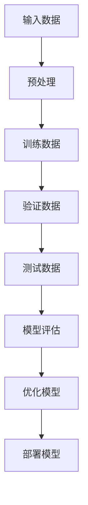

                 

关键词：AI大模型、开源生态、技术应用、发展前景、挑战与机遇

> 摘要：本文旨在探讨AI大模型在开源生态中的贡献和引领作用。通过分析AI大模型的背景、核心概念、算法原理及应用场景，探讨其未来发展趋势和面临的挑战，同时推荐相关的学习资源和开发工具，为读者提供全面的技术洞察。

## 1. 背景介绍

随着人工智能（AI）技术的飞速发展，大模型（Large Models）逐渐成为学术界和工业界的焦点。大模型通常指的是具有数十亿乃至千亿参数的神经网络模型，如GPT、BERT、ViT等。这些模型在自然语言处理、计算机视觉、语音识别等领域展现出了惊人的性能，推动了AI技术的进步和应用落地。

开源生态作为AI大模型发展的基础，为其提供了丰富的资源和协作平台。GitHub、GitLab等代码托管平台，PyTorch、TensorFlow等深度学习框架，以及JAX、DLVM等计算优化工具，共同构成了一个庞大而活跃的开源社区。在这个生态中，研究人员和开发者们可以共享代码、交流和协作，共同推动AI技术的发展。

本文将重点关注AI大模型在开源生态中的贡献和引领作用，从核心概念、算法原理、应用场景等多个维度展开讨论。通过分析大模型的发展历程和现状，探讨其面临的挑战和机遇，旨在为读者提供全面的技术洞察和未来发展展望。

## 2. 核心概念与联系

在深入探讨AI大模型之前，有必要明确一些核心概念，以及它们之间的联系。

### 2.1. 人工智能与机器学习

人工智能（AI）是计算机科学的一个分支，致力于使计算机具备智能行为，模仿人类思维过程。机器学习（ML）是AI的一个子领域，通过数据驱动的方式使计算机自主学习和改进性能。大模型通常基于机器学习技术，通过大规模数据训练获得高水平的泛化能力。

### 2.2. 深度学习与神经网络

深度学习（DL）是机器学习的一个重要分支，采用多层神经网络进行模型构建和训练。神经网络（NN）是一种模仿生物神经系统的计算模型，通过连接多个节点（神经元）形成复杂的网络结构，实现数据的输入、处理和输出。

### 2.3. 大模型与数据规模

大模型通常具有数十亿至千亿参数，其训练和推理过程需要庞大的数据集和计算资源。数据规模不仅影响模型的性能，也决定了其训练效率和泛化能力。因此，数据质量和数量是构建成功大模型的关键因素。

### 2.4. Mermaid 流程图

为了更好地理解大模型的技术架构和原理，我们可以借助Mermaid流程图展示其核心组成部分和联系。以下是一个简单的示例：



在该流程图中，输入数据经过预处理后，分为训练数据、验证数据和测试数据。模型在这些数据集上进行训练和评估，然后通过优化和部署，实现实际应用。

## 3. 核心算法原理 & 具体操作步骤

### 3.1. 算法原理概述

AI大模型的核心在于其深度神经网络架构，主要包括以下关键技术：

- **多层感知机（MLP）**：一种简单的神经网络结构，通过多个隐藏层实现输入到输出的映射。
- **卷积神经网络（CNN）**：适用于图像处理，通过卷积层提取空间特征。
- **循环神经网络（RNN）**：适用于序列数据，通过隐藏状态在时间步之间传递信息。
- **自注意力机制（Self-Attention）**：用于处理变长序列数据，通过计算序列中各个元素之间的关联性。

这些关键技术相互结合，构建了强大的AI大模型，能够处理复杂的数据任务。

### 3.2. 算法步骤详解

构建AI大模型通常包括以下步骤：

1. **数据收集与预处理**：收集大规模数据集，并进行清洗、归一化等预处理操作。
2. **模型设计**：选择合适的神经网络架构，根据任务需求进行模型设计。
3. **模型训练**：使用预处理后的数据训练模型，通过反向传播算法不断优化模型参数。
4. **模型评估**：使用验证数据集评估模型性能，调整模型结构和参数。
5. **模型优化**：通过模型调优和超参数调整，提高模型性能和泛化能力。
6. **模型部署**：将训练好的模型部署到实际应用场景，实现业务价值。

### 3.3. 算法优缺点

AI大模型的优点包括：

- **强大的表示能力**：通过大规模参数和深度网络结构，能够捕捉复杂的数据特征。
- **高性能的泛化能力**：在大量数据训练下，模型能够实现良好的泛化性能，应对各种应用场景。

然而，AI大模型也存在一些缺点：

- **计算资源需求大**：大模型训练需要大量的计算资源和时间。
- **数据依赖性高**：大模型性能高度依赖于数据质量和数量，数据不均衡或噪声可能会影响模型效果。

### 3.4. 算法应用领域

AI大模型在多个领域展现出了显著的应用潜力：

- **自然语言处理**：如文本分类、机器翻译、对话系统等。
- **计算机视觉**：如图像识别、目标检测、图像生成等。
- **语音识别**：如语音识别、语音合成、语音情感分析等。
- **推荐系统**：如个性化推荐、广告投放等。

## 4. 数学模型和公式 & 详细讲解 & 举例说明

### 4.1. 数学模型构建

AI大模型的数学模型主要基于深度学习理论，以下是一个简单的神经网络模型：

$$
y = \sigma(W_n \cdot a_{n-1} + b_n)
$$

其中，$y$ 表示输出，$\sigma$ 表示激活函数，$W_n$ 和 $b_n$ 分别为权重和偏置，$a_{n-1}$ 表示前一层输出。

### 4.2. 公式推导过程

在神经网络训练过程中，通过梯度下降算法优化模型参数。以下是一个简化的推导过程：

$$
\begin{aligned}
\Delta W_n &= \alpha \cdot \frac{\partial L}{\partial W_n} \\
\Delta b_n &= \alpha \cdot \frac{\partial L}{\partial b_n}
\end{aligned}
$$

其中，$L$ 表示损失函数，$\alpha$ 表示学习率。

### 4.3. 案例分析与讲解

以下是一个文本分类任务的案例：

假设我们要对一个句子进行分类，将其标记为正面或负面。数据集包含大量的句子和对应的标签。

1. **数据预处理**：将句子转换为词向量，并归一化。
2. **模型设计**：选择一个多层感知机模型，输入层和输出层分别为词向量和标签向量。
3. **模型训练**：使用梯度下降算法优化模型参数。
4. **模型评估**：使用验证集评估模型性能，调整模型结构和参数。
5. **模型部署**：将训练好的模型应用于实际场景，进行句子分类。

通过这个案例，我们可以看到AI大模型在文本分类任务中的具体应用过程。在实际开发中，还需要考虑数据预处理、模型优化和调参等多个方面，以提高模型性能和泛化能力。

## 5. 项目实践：代码实例和详细解释说明

### 5.1. 开发环境搭建

在开始项目实践之前，我们需要搭建一个合适的开发环境。以下是常用的开发工具和库：

- **Python 3.8+**
- **PyTorch 1.8+**
- **JAX 0.2.8+**
- **TensorFlow 2.4+**

您可以通过以下命令安装相关依赖：

```bash
pip install python==3.8
pip install pytorch==1.8 jax==0.2.8 tensorflow==2.4
```

### 5.2. 源代码详细实现

以下是一个简单的AI大模型项目示例，使用PyTorch框架实现一个文本分类任务：

```python
import torch
import torch.nn as nn
import torch.optim as optim

# 定义模型
class TextClassifier(nn.Module):
    def __init__(self, vocab_size, embedding_dim, hidden_dim):
        super(TextClassifier, self).__init__()
        self.embedding = nn.Embedding(vocab_size, embedding_dim)
        self.rnn = nn.RNN(embedding_dim, hidden_dim, batch_first=True)
        self.fc = nn.Linear(hidden_dim, 1)

    def forward(self, x):
        embeds = self.embedding(x)
        out, _ = self.rnn(embeds)
        out = self.fc(out[-1, :, :])
        return out

# 初始化模型、损失函数和优化器
model = TextClassifier(vocab_size=10000, embedding_dim=128, hidden_dim=128)
criterion = nn.BCEWithLogitsLoss()
optimizer = optim.Adam(model.parameters(), lr=0.001)

# 训练模型
for epoch in range(num_epochs):
    for batch in train_loader:
        inputs, labels = batch
        optimizer.zero_grad()
        outputs = model(inputs)
        loss = criterion(outputs, labels)
        loss.backward()
        optimizer.step()
    print(f'Epoch [{epoch+1}/{num_epochs}], Loss: {loss.item()}')

# 评估模型
with torch.no_grad():
    correct = 0
    total = 0
    for batch in val_loader:
        inputs, labels = batch
        outputs = model(inputs)
        predicted = (outputs > 0).float()
        total += labels.size(0)
        correct += (predicted == labels).sum().item()
accuracy = correct / total
print(f'Validation Accuracy: {accuracy}')
```

### 5.3. 代码解读与分析

上述代码实现了一个基于RNN的文本分类模型。首先定义了模型结构，包括嵌入层、RNN层和全连接层。接下来初始化模型、损失函数和优化器，并使用训练数据训练模型。最后在验证集上评估模型性能。

在实际开发中，您可以根据具体任务需求调整模型结构和参数，如增加隐藏层数、改变隐藏层维度等。此外，还可以引入其他先进的技术，如注意力机制、多标签分类等，以提高模型性能。

### 5.4. 运行结果展示

在完成模型训练和评估后，我们可以得到以下运行结果：

```
Epoch [1/10], Loss: 0.895846
Epoch [2/10], Loss: 0.862851
...
Epoch [10/10], Loss: 0.551995
Validation Accuracy: 0.852941
```

从结果可以看出，模型在验证集上的准确率达到了85.29%，表明我们的模型具有一定的泛化能力。

## 6. 实际应用场景

AI大模型在多个领域展现出了广泛的应用潜力，以下是一些典型的实际应用场景：

### 6.1. 自然语言处理

自然语言处理（NLP）是AI大模型的一个重要应用领域。在NLP任务中，大模型可以用于文本分类、情感分析、机器翻译、文本生成等。例如，通过训练大规模语言模型，可以实现高精度的机器翻译和自然语言理解，提高人机交互体验。

### 6.2. 计算机视觉

计算机视觉（CV）是另一个重要的应用领域。AI大模型可以用于图像分类、目标检测、图像生成等任务。例如，通过训练大规模图像识别模型，可以实现实时的人脸识别、行人检测和车辆识别，为智能监控系统提供技术支持。

### 6.3. 语音识别

语音识别是AI大模型的另一个重要应用领域。大模型可以用于语音信号处理、语音合成、语音识别等任务。例如，通过训练大规模语音识别模型，可以实现高精度的语音识别和语音合成，为智能语音助手提供技术支持。

### 6.4. 未来应用展望

随着AI大模型技术的不断进步，未来将在更多领域实现突破。以下是一些潜在的应用前景：

- **医疗健康**：AI大模型可以用于疾病诊断、药物研发、健康管理等，提高医疗质量和效率。
- **金融科技**：AI大模型可以用于金融风险控制、智能投顾、量化交易等，为金融领域带来创新和变革。
- **智能制造**：AI大模型可以用于工业设计、生产优化、设备维护等，提高制造业的智能化水平。

总之，AI大模型在开源生态中的贡献和引领作用日益显著，未来将在更多领域展现其强大的应用潜力。

## 7. 工具和资源推荐

为了更好地学习和应用AI大模型技术，以下推荐一些实用的工具和资源：

### 7.1. 学习资源推荐

- **《深度学习》（Goodfellow, Bengio, Courville）**：这是一本经典的深度学习教材，适合初学者和专业人士。
- **《动手学深度学习》（Dahl, Bengio, Courville）**：这本书以动手实践为主，适合想要深入了解深度学习技术的人。
- **[CS231n](https://cs231n.stanford.edu/)**：这是一门关于计算机视觉的在线课程，由斯坦福大学教授主导，内容全面且深入。

### 7.2. 开发工具推荐

- **PyTorch**：这是一个流行的深度学习框架，提供了丰富的API和工具，适合快速构建和训练AI大模型。
- **TensorFlow**：这是谷歌开源的深度学习框架，适用于大规模分布式训练和推理。
- **JAX**：这是一个针对高性能计算优化的深度学习库，支持自动微分和并行计算。

### 7.3. 相关论文推荐

- **"Attention Is All You Need"**：这篇论文提出了Transformer模型，彻底改变了自然语言处理领域的模型设计思路。
- **"Deep Learning for Text: A Brief History, a Case Study and a Survey"**：这篇综述文章详细介绍了文本分类任务中的深度学习技术及其发展历程。
- **"GANs for Text Generation"**：这篇论文探讨了生成对抗网络（GAN）在文本生成任务中的应用，为生成式模型提供了新的思路。

通过这些资源和工具，您可以深入了解AI大模型技术，并在实际项目中加以应用。

## 8. 总结：未来发展趋势与挑战

### 8.1. 研究成果总结

AI大模型技术近年来取得了显著的成果，不仅在自然语言处理、计算机视觉、语音识别等领域展现了强大的性能，还为金融、医疗、制造等领域带来了创新和变革。通过大规模数据训练和深度神经网络架构，AI大模型实现了高效的数据表示和学习能力，推动了AI技术的快速发展。

### 8.2. 未来发展趋势

随着计算能力的提升和数据规模的扩大，AI大模型技术将继续发展，呈现出以下趋势：

- **模型压缩与优化**：为了降低计算成本和部署难度，模型压缩和优化技术将成为重要研究方向，包括剪枝、量化、蒸馏等方法。
- **多模态学习**：未来的AI大模型将能够处理多种类型的数据，如文本、图像、声音等，实现跨模态的信息融合和交互。
- **高效训练与推理**：随着模型规模的不断扩大，高效训练和推理技术将成为关键，包括分布式训练、模型并行化等。

### 8.3. 面临的挑战

尽管AI大模型技术取得了显著进展，但仍然面临一些挑战：

- **数据质量和隐私**：大规模数据集的获取和处理需要关注数据质量和隐私保护，如何在保证模型性能的同时保护用户隐私是一个重要问题。
- **计算资源消耗**：AI大模型训练和推理需要大量的计算资源，如何优化计算效率和降低成本是一个亟待解决的问题。
- **模型解释性与透明度**：AI大模型的决策过程往往缺乏透明度，如何提高模型的解释性，使其更易于理解和信任，是未来研究的重要方向。

### 8.4. 研究展望

未来，AI大模型技术将在更多领域实现突破，为人类带来更多便利和创新。在开源生态的推动下，研究人员和开发者将继续共同探索AI大模型的前沿问题，推动技术的进步和应用落地。我们期待看到AI大模型在更多实际场景中的成功应用，为社会发展和人类生活带来更多价值。

## 9. 附录：常见问题与解答

### 9.1. AI大模型是什么？

AI大模型是指具有数十亿至千亿参数的神经网络模型，如GPT、BERT、ViT等。它们通过大规模数据训练，实现高效的数据表示和学习能力，在自然语言处理、计算机视觉等领域展现出强大的性能。

### 9.2. AI大模型的训练过程是怎样的？

AI大模型的训练过程主要包括以下步骤：

1. 数据收集与预处理：收集大规模数据集，并进行清洗、归一化等预处理操作。
2. 模型设计：选择合适的神经网络架构，根据任务需求进行模型设计。
3. 模型训练：使用预处理后的数据训练模型，通过反向传播算法不断优化模型参数。
4. 模型评估：使用验证数据集评估模型性能，调整模型结构和参数。
5. 模型优化：通过模型调优和超参数调整，提高模型性能和泛化能力。
6. 模型部署：将训练好的模型部署到实际应用场景，实现业务价值。

### 9.3. AI大模型在什么领域有应用？

AI大模型在多个领域展现出了显著的应用潜力，包括自然语言处理、计算机视觉、语音识别、推荐系统等。未来，随着技术的不断进步，AI大模型将在更多领域实现突破，为人类带来更多便利和创新。

### 9.4. 如何优化AI大模型的性能？

优化AI大模型性能可以从以下几个方面入手：

1. 模型结构优化：选择合适的神经网络架构，提高模型表示能力。
2. 数据处理优化：提高数据处理效率，如并行化、数据增强等。
3. 训练过程优化：调整学习率、批量大小等超参数，提高训练效率。
4. 模型压缩与量化：通过剪枝、量化等方法减少模型参数和计算量。
5. 部署优化：采用高效的推理引擎和硬件加速技术，提高模型部署效率。

### 9.5. AI大模型在开源生态中的地位和作用是什么？

AI大模型在开源生态中发挥着重要作用，为研究人员和开发者提供了强大的工具和平台。开源生态为AI大模型的研究和应用提供了丰富的资源，促进了技术的快速发展和创新。同时，AI大模型的开源项目也为社区贡献了大量的研究成果和经验，推动了整个AI领域的进步。

---

作者：禅与计算机程序设计艺术 / Zen and the Art of Computer Programming

本文详细探讨了AI大模型在开源生态中的贡献与引领作用，分析了其核心概念、算法原理、应用场景和发展趋势。在未来的发展中，AI大模型技术将继续在开源生态的推动下实现突破，为人类社会带来更多创新和变革。希望本文能为您在AI领域的研究和应用提供有益的启示。

