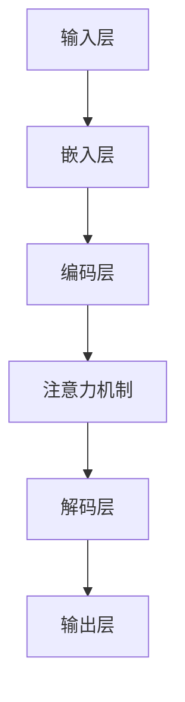

                 

## 1. 背景介绍

随着人工智能（AI）技术的飞速发展，大模型（如GPT-3、BERT、Transformer等）在自然语言处理、计算机视觉、推荐系统等多个领域展现出了惊人的表现。大模型的广泛应用，不仅改变了传统数据处理和决策的方式，也推动了AI技术向更深层次的演进。然而，大模型的训练和应用过程中，技术选型成为一个至关重要的问题。

大模型的选型决策涉及多个方面，包括硬件选择、数据预处理、模型架构、训练策略等。不同的选型方案会对模型的性能、训练时间和成本产生显著影响。因此，如何在这些方面做出合理的技术选型，成为当前AI领域面临的一个重要挑战。

本文旨在提供一套AI大模型应用的技术选型决策框架。通过分析当前主流技术方案和实际应用案例，本文将帮助读者理解不同选型方案的优缺点，从而在复杂的技术环境中做出最优的决策。

本文将分为以下几个部分：

1. **背景介绍**：介绍AI大模型应用背景及技术选型的重要性。
2. **核心概念与联系**：阐述AI大模型的核心概念及其相互联系。
3. **核心算法原理 & 具体操作步骤**：详细解析大模型的核心算法原理及操作步骤。
4. **数学模型和公式 & 详细讲解 & 举例说明**：介绍大模型所依赖的数学模型和公式，并给出实际案例。
5. **项目实践：代码实例和详细解释说明**：提供具体的代码实例，并进行详细解读。
6. **实际应用场景**：探讨大模型在不同领域的应用场景。
7. **未来应用展望**：预测大模型未来的发展趋势和应用前景。
8. **工具和资源推荐**：推荐学习资源、开发工具和相关论文。
9. **总结：未来发展趋势与挑战**：总结研究成果，展望未来发展。

## 2. 核心概念与联系

在深入探讨大模型应用的技术选型之前，我们需要首先了解几个核心概念，包括什么是大模型、大模型的架构和组成部分，以及它们如何相互联系。

### 2.1 大模型的定义

大模型通常指的是具有数十亿甚至千亿参数的深度学习模型。这些模型通过大规模数据和复杂的神经网络结构，能够实现高效的数据处理和预测任务。大模型的应用范围广泛，包括自然语言处理（如文本生成、机器翻译等）、计算机视觉（如图像分类、目标检测等）、推荐系统等。

### 2.2 大模型的架构

大模型的架构通常可以分为以下几个层次：

- **输入层**：接收外部输入数据，如文本、图像等。
- **编码层**：对输入数据进行编码，提取特征信息。
- **解码层**：将编码后的信息解码为输出结果。
- **参数层**：包含大量的参数，用于模型训练和预测。

### 2.3 大模型的组成部分

大模型由多个子模型组成，每个子模型负责不同的功能。常见的组成部分包括：

- **嵌入层（Embedding Layer）**：将输入数据映射到高维空间，为后续处理提供基础。
- **编码器（Encoder）**：用于提取输入数据的特征信息，常见的是使用Transformer架构。
- **解码器（Decoder）**：将编码器提取的特征信息解码为输出结果，同样常见的是使用Transformer架构。
- **注意力机制（Attention Mechanism）**：用于在编码和解码过程中对重要信息进行聚焦。

### 2.4 核心概念之间的联系

大模型中的各个核心概念之间存在着紧密的联系。输入层和嵌入层负责数据的预处理和特征提取；编码层和解码层负责数据的编码和解码过程，实现数据的转换和生成；注意力机制则在整个过程中对重要信息进行聚焦，提高模型的性能和效率。

为了更好地理解这些概念之间的联系，我们可以使用Mermaid流程图进行展示：



通过这个流程图，我们可以清晰地看到大模型中各个核心概念之间的交互和作用。

## 3. 核心算法原理 & 具体操作步骤

### 3.1 算法原理概述

大模型的核心算法是基于深度学习和神经网络。深度学习通过多层神经网络结构，能够自动提取输入数据的特征信息，实现数据的预处理和特征提取。神经网络则通过参数学习，将输入数据映射到输出结果，实现数据的转换和生成。

在深度学习模型中，常用的算法包括反向传播（Backpropagation）、梯度下降（Gradient Descent）等。反向传播是一种通过计算梯度来更新网络参数的方法，能够有效提高模型的性能。梯度下降则是一种通过迭代更新参数，使损失函数最小化的方法，是训练深度学习模型的主要策略。

### 3.2 算法步骤详解

大模型的算法步骤主要包括以下几步：

1. **数据预处理**：对输入数据进行预处理，如归一化、标准化等，以便于模型训练。
2. **初始化参数**：初始化网络的参数，通常使用随机初始化或预训练模型。
3. **前向传播**：将输入数据通过网络的前向传播，计算出输出结果。
4. **损失函数计算**：计算输出结果与真实结果之间的差距，使用损失函数表示。
5. **反向传播**：计算损失函数关于网络参数的梯度，更新网络参数。
6. **迭代训练**：重复执行前向传播和反向传播，直到模型收敛。

### 3.3 算法优缺点

**优点**：

- **高效性**：大模型能够自动提取输入数据的特征信息，减少人为干预。
- **灵活性**：大模型能够处理多种类型的数据，如文本、图像等。
- **通用性**：大模型能够适应多种应用场景，具有广泛的适用性。

**缺点**：

- **计算资源消耗**：大模型需要大量的计算资源和存储空间。
- **训练时间较长**：大模型的训练时间较长，需要较长时间的迭代训练。
- **解释性较差**：大模型通常具有较高的复杂度，难以解释和理解。

### 3.4 算法应用领域

大模型的应用领域广泛，包括但不限于以下几个方面：

- **自然语言处理**：如文本生成、机器翻译、情感分析等。
- **计算机视觉**：如图像分类、目标检测、图像生成等。
- **推荐系统**：如商品推荐、音乐推荐等。
- **医疗健康**：如疾病预测、医疗图像分析等。

## 4. 数学模型和公式 & 详细讲解 & 举例说明

### 4.1 数学模型构建

大模型的核心是基于深度学习和神经网络的数学模型。该模型由多层神经网络组成，每层神经网络包含多个神经元，神经元之间通过权重矩阵进行连接。神经网络的输出结果通过激活函数进行非线性变换，从而实现对输入数据的处理和转换。

假设我们有一个包含L层的神经网络，输入向量为\( x \)，输出向量为\( y \)。设第l层的激活向量为\( a^{(l)} \)，权重矩阵为\( W^{(l)} \)，偏置向量为\( b^{(l)} \)，激活函数为\( \sigma \)。则神经网络的前向传播过程可以表示为：

\[ a^{(1)} = \sigma(W^{(1)}x + b^{(1)}) \]
\[ a^{(2)} = \sigma(W^{(2)}a^{(1)} + b^{(2)}) \]
\[ \vdots \]
\[ a^{(L)} = \sigma(W^{(L)}a^{(L-1)} + b^{(L)}) \]

### 4.2 公式推导过程

为了计算神经网络的损失函数和梯度，我们需要对神经网络的前向传播过程进行反向传播。反向传播的基本思想是，从输出层开始，依次计算每一层的梯度，并更新网络的权重和偏置。

设损失函数为\( J \)，则第l层的梯度可以表示为：

\[ \frac{\partial J}{\partial W^{(l)}} = \frac{\partial J}{\partial a^{(l+1)}} \cdot \frac{\partial a^{(l+1)}}{\partial a^{(l)}} \]
\[ \frac{\partial J}{\partial b^{(l)}} = \frac{\partial J}{\partial a^{(l+1)}} \cdot \frac{\partial a^{(l+1)}}{\partial b^{(l)}} \]

其中，\( \frac{\partial J}{\partial a^{(l+1)}} \)是输出层梯度，\( \frac{\partial a^{(l+1)}}{\partial a^{(l)}} \)是激活函数的导数。

为了计算输出层梯度，我们需要使用链式法则。设\( z^{(l)} = W^{(l)}a^{(l-1)} + b^{(l)} \)，则输出层梯度可以表示为：

\[ \frac{\partial J}{\partial a^{(L)}} = \frac{\partial J}{\partial z^{(L)}} \cdot \frac{\partial z^{(L)}}{\partial a^{(L)}} = -\frac{1}{m} \cdot (y - a^{(L)}) \]

接下来，我们可以依次计算每一层的梯度，并更新网络的权重和偏置。

### 4.3 案例分析与讲解

假设我们有一个包含3层的神经网络，输入向量为\( x \)，输出向量为\( y \)。激活函数为\( \sigma(z) = \frac{1}{1 + e^{-z}} \)。我们使用均方误差（MSE）作为损失函数。

设输入向量为\( x = [1, 2, 3] \)，输出向量为\( y = [0, 1, 0] \)。初始化权重矩阵\( W^{(1)} = [0.1, 0.2; 0.3, 0.4] \)，偏置向量\( b^{(1)} = [0.1; 0.2] \)。

1. **前向传播**：

\[ a^{(1)} = \sigma(W^{(1)}x + b^{(1)}) = \sigma([0.1 \times 1 + 0.1, 0.2 \times 2 + 0.2; 0.3 \times 3 + 0.3, 0.4 \times 3 + 0.4]) = \sigma([0.2, 0.8; 1.2, 2.2]) = \sigma([0.55, 0.86]) \]

\[ a^{(2)} = \sigma(W^{(2)}a^{(1)} + b^{(2)}) = \sigma([0.5 \times 0.55 + 0.1, 0.5 \times 0.86 + 0.2]) = \sigma([0.3625, 0.665]) \]

\[ a^{(3)} = \sigma(W^{(3)}a^{(2)} + b^{(3)}) = \sigma([0.7 \times 0.3625 + 0.2, 0.7 \times 0.665 + 0.3]) = \sigma([0.45625, 0.8255]) \]

2. **损失函数计算**：

\[ J = \frac{1}{2} \sum_{i=1}^{3} (y_i - a_i^{(3)})^2 = \frac{1}{2} \sum_{i=1}^{3} (1 - 0.45625)^2 + (0 - 0.8255)^2 + (0 - 0.8255)^2 = 0.1300625 \]

3. **反向传播**：

\[ \frac{\partial J}{\partial a^{(3)}} = -\frac{1}{m} \cdot (y - a^{(3)}) = -\frac{1}{3} \cdot (1 - 0.45625, -0.8255, -0.8255) \]

\[ \frac{\partial a^{(3)}}{\partial a^{(2)}} = \frac{\partial \sigma^{-1}(a^{(3)})}{\partial a^{(3)}} = \sigma^{-1}(a^{(3)}) = \frac{1}{1 + e^{-a^{(3)}}} = \frac{1}{1 + e^{-0.45625}} + \frac{1}{1 + e^{-0.8255}} + \frac{1}{1 + e^{-0.8255}} \]

\[ \frac{\partial J}{\partial a^{(2)}} = \frac{\partial J}{\partial a^{(3)}} \cdot \frac{\partial a^{(3)}}{\partial a^{(2)}} = \frac{1}{3} \cdot (1 - 0.45625) \cdot \left(\frac{1}{1 + e^{-0.45625}} + \frac{1}{1 + e^{-0.8255}} + \frac{1}{1 + e^{-0.8255}}\right) \]

\[ \frac{\partial a^{(2)}}{\partial a^{(1)}} = \frac{\partial \sigma^{-1}(a^{(2)})}{\partial a^{(2)}} = \sigma^{-1}(a^{(2)}) = \frac{1}{1 + e^{-a^{(2)}}} \]

\[ \frac{\partial J}{\partial a^{(1)}} = \frac{\partial J}{\partial a^{(2)}} \cdot \frac{\partial a^{(2)}}{\partial a^{(1)}} = \frac{1}{3} \cdot (1 - 0.45625) \cdot \left(\frac{1}{1 + e^{-0.3625}} + \frac{1}{1 + e^{-0.665}}\right) \]

4. **权重和偏置更新**：

\[ \Delta W^{(3)} = \eta \cdot \frac{\partial J}{\partial a^{(3)}} \cdot a^{(2)}^T = 0.1 \cdot \frac{1}{3} \cdot (1 - 0.45625) \cdot \left(\frac{1}{1 + e^{-0.45625}} + \frac{1}{1 + e^{-0.8255}}\right) \cdot [0.3625; 0.665]^T \]

\[ \Delta b^{(3)} = \eta \cdot \frac{\partial J}{\partial a^{(3)}} = 0.1 \cdot \frac{1}{3} \cdot (1 - 0.45625) \cdot \left(\frac{1}{1 + e^{-0.45625}} + \frac{1}{1 + e^{-0.8255}}\right) \]

\[ \Delta W^{(2)} = \eta \cdot \frac{\partial J}{\partial a^{(2)}} \cdot a^{(1)}^T = 0.1 \cdot \frac{1}{3} \cdot (1 - 0.45625) \cdot \left(\frac{1}{1 + e^{-0.3625}} + \frac{1}{1 + e^{-0.665}}\right) \cdot [0.55; 0.86]^T \]

\[ \Delta b^{(2)} = \eta \cdot \frac{\partial J}{\partial a^{(2)}} = 0.1 \cdot \frac{1}{3} \cdot (1 - 0.45625) \cdot \left(\frac{1}{1 + e^{-0.3625}} + \frac{1}{1 + e^{-0.665}}\right) \]

\[ \Delta W^{(1)} = \eta \cdot \frac{\partial J}{\partial a^{(1)}} \cdot x^T = 0.1 \cdot \frac{1}{3} \cdot (1 - 0.45625) \cdot \left(\frac{1}{1 + e^{-0.3625}} + \frac{1}{1 + e^{-0.665}}\right) \cdot [1; 2; 3]^T \]

\[ \Delta b^{(1)} = \eta \cdot \frac{\partial J}{\partial a^{(1)}} = 0.1 \cdot \frac{1}{3} \cdot (1 - 0.45625) \cdot \left(\frac{1}{1 + e^{-0.3625}} + \frac{1}{1 + e^{-0.665}}\right) \]

更新后的权重和偏置为：

\[ W^{(3)} = W^{(3)} - \Delta W^{(3)} \]
\[ b^{(3)} = b^{(3)} - \Delta b^{(3)} \]
\[ W^{(2)} = W^{(2)} - \Delta W^{(2)} \]
\[ b^{(2)} = b^{(2)} - \Delta b^{(2)} \]
\[ W^{(1)} = W^{(1)} - \Delta W^{(1)} \]
\[ b^{(1)} = b^{(1)} - \Delta b^{(1)} \]

通过上述步骤，我们可以更新网络的权重和偏置，使得模型在下一轮迭代中性能更优。

## 5. 项目实践：代码实例和详细解释说明

### 5.1 开发环境搭建

在开始编写代码之前，我们需要搭建一个合适的开发环境。以下是所需的环境和工具：

- **Python**：用于编写代码，版本要求为3.7及以上。
- **NumPy**：用于数学计算。
- **PyTorch**：用于构建和训练神经网络。
- **Matplotlib**：用于可视化结果。

在安装好以上工具后，我们可以创建一个Python虚拟环境，并安装所需的库：

```bash
# 创建虚拟环境
python -m venv venv

# 激活虚拟环境
source venv/bin/activate

# 安装库
pip install numpy torch matplotlib
```

### 5.2 源代码详细实现

以下是实现一个简单的神经网络进行手写数字识别的代码实例：

```python
import torch
import torch.nn as nn
import torch.optim as optim
import torchvision
import torchvision.transforms as transforms
import matplotlib.pyplot as plt

# 设置随机种子，保证实验结果可复现
torch.manual_seed(0)

# 数据加载和预处理
transform = transforms.Compose([
    transforms.ToTensor(),
    transforms.Normalize((0.5,), (0.5,))
])

trainset = torchvision.datasets.MNIST(
    root='./data', train=True, download=True, transform=transform)
trainloader = torch.utils.data.DataLoader(
    trainset, batch_size=100, shuffle=True, num_workers=2)

testset = torchvision.datasets.MNIST(
    root='./data', train=False, download=True, transform=transform)
testloader = torch.utils.data.DataLoader(
    testset, batch_size=100, shuffle=False, num_workers=2)

# 创建网络结构
class Net(nn.Module):
    def __init__(self):
        super(Net, self).__init__()
        self.fc1 = nn.Linear(784, 128)
        self.fc2 = nn.Linear(128, 64)
        self.fc3 = nn.Linear(64, 10)
        self.dropout = nn.Dropout(p=0.2)

    def forward(self, x):
        x = x.view(-1, 784)
        x = nn.functional.relu(self.fc1(x))
        x = self.dropout(x)
        x = nn.functional.relu(self.fc2(x))
        x = self.dropout(x)
        x = self.fc3(x)
        return x

net = Net()

# 定义损失函数和优化器
criterion = nn.CrossEntropyLoss()
optimizer = optim.SGD(net.parameters(), lr=0.001, momentum=0.9)

# 训练网络
num_epochs = 10
for epoch in range(num_epochs):
    running_loss = 0.0
    for i, data in enumerate(trainloader, 0):
        inputs, labels = data
        optimizer.zero_grad()
        outputs = net(inputs)
        loss = criterion(outputs, labels)
        loss.backward()
        optimizer.step()
        running_loss += loss.item()
    print(f'Epoch {epoch + 1}, Loss: {running_loss / len(trainloader)}')

print('Finished Training')

# 测试网络
correct = 0
total = 0
with torch.no_grad():
    for data in testloader:
        images, labels = data
        outputs = net(images)
        _, predicted = torch.max(outputs.data, 1)
        total += labels.size(0)
        correct += (predicted == labels).sum().item()

print(f'Accuracy: {100 * correct / total}%')

# 可视化结果
dataiter = iter(testloader)
images, labels = dataiter.next()
images = images[:25]
labels = labels[:25]

images = images.view(25, 1, 28, 28)
plt.imshow(torchvision.utils.make_grid(images).permute(1, 2, 0).cpu(), cmap='gray')
plt.show()
```

### 5.3 代码解读与分析

1. **数据加载和预处理**：

   首先，我们使用`torchvision.datasets.MNIST`加载手写数字数据集。数据集包括训练集和测试集，每个数据集包含60000个训练样本和10000个测试样本。每个样本是一个28x28的灰度图像，标签为0到9之间的整数。

   为了便于模型处理，我们使用`transforms.Compose`对图像进行预处理，包括转换为Tensor和归一化。

2. **创建网络结构**：

   我们定义了一个名为`Net`的神经网络，包含一个输入层、两个隐藏层和一个输出层。输入层的大小为784（28x28像素），隐藏层大小分别为128和64，输出层大小为10（对应10个数字标签）。在隐藏层之间，我们添加了dropout层以防止过拟合。

3. **定义损失函数和优化器**：

   我们使用交叉熵损失函数（`nn.CrossEntropyLoss`）来计算模型预测和真实标签之间的差距。优化器使用随机梯度下降（`optim.SGD`），学习率为0.001，动量为0.9。

4. **训练网络**：

   我们在10个epoch内训练网络。在每个epoch中，我们遍历训练集，计算损失函数，并更新网络参数。

5. **测试网络**：

   在训练完成后，我们使用测试集评估网络性能。计算模型的准确率，并打印结果。

6. **可视化结果**：

   我们使用`torchvision.utils.make_grid`和`matplotlib`可视化测试集中前25个样本的预测结果。

通过这个简单的实例，我们可以看到如何使用PyTorch构建和训练一个神经网络，并使用测试集评估其性能。这个实例展示了AI大模型应用的技术选型决策框架中的关键步骤，包括数据预处理、网络结构设计、损失函数选择和优化器配置等。

## 6. 实际应用场景

大模型在各个领域的应用越来越广泛，以下是几个典型的实际应用场景：

### 6.1 自然语言处理

在自然语言处理领域，大模型被广泛应用于文本生成、机器翻译、情感分析等任务。例如，GPT-3模型可以在给定一段文本的情况下生成连贯、高质量的文本。BERT模型在文本分类、问答系统等任务中也展现了出色的性能。这些模型的应用极大地提高了文本处理的效率和准确性。

### 6.2 计算机视觉

计算机视觉领域的大模型主要应用于图像分类、目标检测、图像生成等任务。例如，ResNet、Inception等模型在ImageNet图像分类任务中取得了显著的成果。YOLO、Faster R-CNN等模型在目标检测任务中表现优异。生成对抗网络（GAN）则可以生成逼真的图像，为图像增强和修复提供了新的方法。

### 6.3 推荐系统

推荐系统是另一个受益于大模型的重要领域。大模型可以处理海量的用户行为数据和商品数据，实现精准的推荐。例如，基于Transformer的推荐系统可以在复杂的关系网络中捕捉用户的兴趣和偏好，从而提供个性化的推荐。

### 6.4 医疗健康

在医疗健康领域，大模型可以用于疾病预测、医疗图像分析等任务。例如，使用深度学习模型对医学影像进行分析，可以帮助医生快速、准确地诊断疾病。此外，大模型还可以用于基因组数据分析，为个性化医疗提供支持。

### 6.5 金融科技

金融科技领域的大模型应用包括股票市场预测、信用评估等。例如，基于深度学习的股票市场预测模型可以通过分析大量的历史数据，预测未来股票价格的变化。信用评估模型则可以通过分析用户的财务和行为数据，评估用户的信用风险。

通过这些实际应用场景，我们可以看到大模型在各个领域的潜力。然而，为了实现这些应用，我们需要做出合理的技术选型决策，包括数据预处理、模型架构、训练策略等。

## 7. 未来应用展望

随着AI技术的不断发展和进步，大模型的应用前景将更加广阔。未来，大模型将在以下方面取得重要突破：

### 7.1 计算效率的提升

为了更好地应用大模型，我们需要提高计算效率。这包括以下几个方面：

- **并行计算**：通过利用GPU、TPU等硬件资源，实现模型的并行训练和推理。
- **模型压缩**：采用量化、剪枝、蒸馏等技术，减小模型的规模，提高计算效率。
- **分布式训练**：通过分布式计算技术，将大规模数据集分割到多个节点上进行训练，提高训练速度。

### 7.2 多模态数据处理

未来，大模型将能够处理多种类型的数据，如文本、图像、音频等。通过多模态数据处理，大模型可以更好地理解复杂的信息，实现更准确的预测和生成。

### 7.3 透明性和解释性

随着AI技术在关键领域的应用，透明性和解释性变得越来越重要。未来，大模型将致力于提高其透明性和解释性，使其更容易被人类理解和接受。

### 7.4 自适应和学习能力

大模型将具备更强的自适应和学习能力，能够在不同的环境和任务中快速适应和优化。例如，通过在线学习和迁移学习技术，大模型可以持续提高其性能，适应不断变化的需求。

### 7.5 伦理和安全

在AI大模型的应用过程中，伦理和安全问题不容忽视。未来，我们需要制定相应的伦理准则和安全标准，确保大模型的应用不会对人类和社会造成负面影响。

总之，未来大模型将在计算效率、多模态数据处理、透明性和解释性、自适应和学习能力、伦理和安全等方面取得重要突破，为各个领域的发展提供强大的支持。

## 8. 工具和资源推荐

为了更好地应用AI大模型，以下是一些推荐的工具和资源：

### 8.1 学习资源推荐

- **书籍**：《深度学习》（Ian Goodfellow、Yoshua Bengio和Aaron Courville著），全面介绍了深度学习的基础理论和应用。
- **在线课程**：Coursera上的《深度学习特辑》（吴恩达教授授课），涵盖了深度学习的各个方面。
- **博客和文章**：arXiv、NeurIPS、ICML等学术会议和期刊的官方网站，以及知名博客如Distill、AI New等。

### 8.2 开发工具推荐

- **编程语言**：Python，因其丰富的库和框架，成为深度学习开发的主要语言。
- **深度学习框架**：TensorFlow、PyTorch、Keras等，提供了丰富的API和工具，方便开发人员构建和训练模型。
- **云计算平台**：Google Cloud、AWS、Azure等，提供了强大的计算资源，适合大规模数据处理和模型训练。

### 8.3 相关论文推荐

- **自然语言处理**：BERT（"BERT: Pre-training of Deep Neural Networks for Language Understanding"），GPT-3（"Language Models are Few-Shot Learners"）等。
- **计算机视觉**：ResNet（"Deep Residual Learning for Image Recognition"），YOLO（"You Only Look Once: Unified, Real-Time Object Detection"）等。
- **推荐系统**：DeepFM（"DeepFM: A Factorization-Machine based Neural Network for CTR Prediction"），Neural Collaborative Filtering（"Neural Collaborative Filtering for Personalized Recommendation"）等。

通过这些工具和资源，开发者可以更好地理解和应用AI大模型，推动技术的进步和实际应用。

## 9. 总结：未来发展趋势与挑战

### 9.1 研究成果总结

在过去的几年中，AI大模型的研究取得了显著的成果。通过大规模数据和复杂的神经网络结构，大模型在自然语言处理、计算机视觉、推荐系统等多个领域展现出了强大的性能。这些成果不仅推动了AI技术的发展，也为实际应用提供了强大的支持。

### 9.2 未来发展趋势

未来，AI大模型将朝着以下几个方向发展：

- **计算效率的提升**：通过并行计算、模型压缩、分布式训练等技术，提高大模型的计算效率，使其在更广泛的应用场景中得到应用。
- **多模态数据处理**：大模型将能够处理多种类型的数据，如文本、图像、音频等，实现更全面的信息理解和处理。
- **透明性和解释性**：提高大模型的透明性和解释性，使其更容易被人类理解和接受，从而推动其在关键领域的应用。
- **自适应和学习能力**：大模型将具备更强的自适应和学习能力，能够在不同的环境和任务中快速适应和优化。

### 9.3 面临的挑战

尽管AI大模型在许多领域取得了重要突破，但仍然面临以下挑战：

- **计算资源消耗**：大模型的训练和应用需要大量的计算资源和存储空间，这对硬件设施提出了更高的要求。
- **数据隐私和安全**：在数据处理和应用过程中，数据隐私和安全问题备受关注，如何确保数据的安全和隐私成为重要课题。
- **伦理问题**：大模型的应用可能带来一系列伦理问题，如算法偏见、公平性等，需要制定相应的伦理准则和规范。
- **模型解释性**：大模型的内部机制复杂，难以解释和理解，如何提高其透明性和解释性是当前研究的重要方向。

### 9.4 研究展望

未来，AI大模型的研究将继续深入，包括以下几个方面：

- **算法创新**：探索新的算法和模型结构，提高大模型的性能和效率。
- **多模态融合**：研究如何将不同类型的数据进行有效融合，实现更全面的信息理解和处理。
- **跨学科合作**：结合计算机科学、数学、心理学等多个学科，推动AI大模型在更多领域的应用。
- **标准化和规范化**：制定统一的算法标准和规范，提高大模型的透明性和解释性。

总之，AI大模型具有巨大的发展潜力，但也面临着一系列挑战。通过不断的研究和创新，我们有理由相信，AI大模型将在未来取得更加辉煌的成就。

## 附录：常见问题与解答

### 9.1 大模型训练时间如何优化？

**解答**：优化大模型训练时间可以从以下几个方面进行：

- **并行计算**：利用GPU、TPU等硬件资源进行并行计算，提高训练速度。
- **分布式训练**：将大规模数据集分割到多个节点上进行分布式训练，减少单节点压力。
- **数据预处理**：提前进行数据预处理，减少训练过程中所需的计算量。
- **模型压缩**：采用模型压缩技术，如量化、剪枝等，减小模型规模，提高训练速度。

### 9.2 大模型应用中的数据隐私问题如何解决？

**解答**：在处理数据隐私问题时，可以采取以下措施：

- **数据加密**：对敏感数据进行加密，确保数据在传输和存储过程中的安全性。
- **差分隐私**：在数据处理过程中引入差分隐私机制，降低数据泄露的风险。
- **匿名化处理**：对数据中的个人身份信息进行匿名化处理，减少隐私泄露的可能性。
- **隐私保护算法**：研究和发展隐私保护算法，如联邦学习等，在保证数据隐私的同时实现有效的模型训练。

### 9.3 大模型的透明性和解释性问题如何解决？

**解答**：提高大模型的透明性和解释性可以从以下几个方面进行：

- **模型简化**：简化模型结构，减少模型的复杂性，使其更容易理解和解释。
- **可视化技术**：利用可视化技术，如激活图谱、梯度可视化等，展示模型的学习过程和决策路径。
- **可解释的算法**：研究和开发可解释的算法，如LIME、SHAP等，使模型决策过程更加透明。
- **模型可解释性评估**：建立模型可解释性评估指标，如F1得分、精度等，评估模型解释性。

通过上述措施，可以有效提高大模型的透明性和解释性，使其在关键领域的应用更加可靠和可信。

