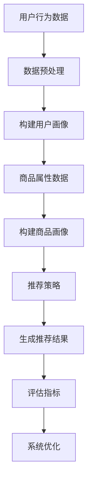

                 

关键词：人工智能、大模型、电商搜索、推荐系统、业务价值、算法评估

摘要：本文从人工智能大模型的视角，探讨了电商搜索推荐系统的业务价值评估方法。通过分析推荐系统的核心概念、算法原理、数学模型、实际应用及未来展望，旨在为电商企业优化搜索推荐策略提供理论支持和实践指导。

## 1. 背景介绍

在互联网时代，电子商务已经成为人们日常购物的主要方式。然而，随着商品种类和数量的爆炸式增长，用户在购物过程中面临的信息过载问题日益突出。如何为用户提供个性化的商品推荐，提高购物体验和转化率，成为电商企业关注的焦点。推荐系统作为人工智能的重要应用领域，正逐渐成为电商业务的核心竞争力之一。

本文旨在从人工智能大模型的视角，探讨电商搜索推荐系统的业务价值评估方法。通过深入分析推荐系统的核心概念、算法原理、数学模型、实际应用及未来展望，为电商企业优化搜索推荐策略提供理论支持和实践指导。

## 2. 核心概念与联系

### 2.1. 推荐系统的定义与分类

推荐系统是指基于用户的历史行为、兴趣偏好和商品属性等信息，为用户发现并推荐可能感兴趣的商品或内容。根据推荐策略的不同，推荐系统可分为以下几类：

1. **基于内容的推荐（Content-based Filtering）**：根据用户的历史行为和兴趣偏好，为用户推荐与已购买或浏览过的商品相似的商品。
2. **协同过滤推荐（Collaborative Filtering）**：通过收集用户之间的交互数据，挖掘用户之间的相似性，为用户推荐其他用户喜欢的商品。
3. **混合推荐（Hybrid Recommendation）**：结合基于内容和协同过滤的推荐策略，提高推荐系统的准确性和多样性。

### 2.2. 电商搜索推荐系统的核心概念

电商搜索推荐系统的核心概念包括用户画像、商品画像、推荐策略和评估指标等。

1. **用户画像**：对用户的行为、兴趣、偏好等信息进行整合和分析，构建用户画像，以便更精准地推荐商品。
2. **商品画像**：对商品的属性、标签、类别等信息进行描述，以便与用户画像进行匹配和推荐。
3. **推荐策略**：根据用户画像和商品画像，选择合适的推荐算法和策略，实现个性化推荐。
4. **评估指标**：用于衡量推荐系统的性能，常见的评估指标包括点击率、转化率、推荐满意度等。

### 2.3. 核心概念联系

用户画像、商品画像和推荐策略是电商搜索推荐系统的三个核心概念，它们相互关联、相互影响，共同决定了推荐系统的性能。用户画像和商品画像为推荐策略提供了基础数据支持，而推荐策略则根据用户画像和商品画像生成个性化的推荐结果。评估指标则用于衡量推荐系统的效果，为系统优化提供了反馈。

### 2.4. Mermaid 流程图



## 3. 核心算法原理 & 具体操作步骤

### 3.1. 算法原理概述

电商搜索推荐系统的核心算法主要包括基于内容的推荐、协同过滤推荐和混合推荐。这些算法基于用户画像和商品画像，通过计算用户和商品之间的相似度，生成个性化的推荐结果。

- **基于内容的推荐**：基于用户的历史行为和兴趣偏好，计算商品与用户兴趣的相似度，为用户推荐相似的商品。
- **协同过滤推荐**：通过收集用户之间的交互数据，计算用户和商品之间的相似度，为用户推荐其他用户喜欢的商品。
- **混合推荐**：结合基于内容和协同过滤的推荐策略，提高推荐系统的准确性和多样性。

### 3.2. 算法步骤详解

1. **数据采集与预处理**：采集用户行为数据和商品属性数据，并进行数据清洗、去重、补全等预处理操作。
2. **用户画像构建**：根据用户的历史行为和兴趣偏好，构建用户画像，包括用户标签、兴趣类别等。
3. **商品画像构建**：根据商品的属性、标签、类别等信息，构建商品画像。
4. **计算用户和商品的相似度**：采用合适的算法（如余弦相似度、欧氏距离等），计算用户和商品之间的相似度。
5. **生成推荐结果**：根据用户和商品的相似度，生成个性化的推荐结果。
6. **评估推荐效果**：利用评估指标（如点击率、转化率等）评估推荐效果，为系统优化提供反馈。

### 3.3. 算法优缺点

- **基于内容的推荐**：优点是推荐结果准确，但用户兴趣变化时，推荐效果可能较差。
- **协同过滤推荐**：优点是能够发现用户之间的相似性，提高推荐效果，但可能引入噪声和冷启动问题。
- **混合推荐**：优点是结合了基于内容和协同过滤的推荐策略，提高推荐系统的准确性和多样性，缺点是计算复杂度较高。

### 3.4. 算法应用领域

电商搜索推荐系统在以下领域具有广泛的应用：

1. **电子商务**：为用户提供个性化商品推荐，提高购物体验和转化率。
2. **社交媒体**：为用户提供个性化内容推荐，提高用户活跃度和留存率。
3. **在线视频平台**：为用户提供个性化视频推荐，提高视频播放量和用户留存率。
4. **音乐平台**：为用户提供个性化音乐推荐，提高用户听歌体验和留存率。

## 4. 数学模型和公式 & 详细讲解 & 举例说明

### 4.1. 数学模型构建

电商搜索推荐系统的数学模型主要包括用户和商品的表示、相似度计算和推荐结果生成等。

1. **用户表示**：假设用户 $u$ 的特征向量为 $\textbf{u} \in \mathbb{R}^d$，商品 $i$ 的特征向量为 $\textbf{i} \in \mathbb{R}^d$。
2. **商品表示**：假设商品 $i$ 的标签向量为 $\textbf{t}_i \in \mathbb{R}^k$。
3. **相似度计算**：采用余弦相似度计算用户和商品之间的相似度，即
   $$ \text{sim}(\textbf{u}, \textbf{i}) = \frac{\textbf{u} \cdot \textbf{i}}{||\textbf{u}||_2 \cdot ||\textbf{i}||_2} $$
4. **推荐结果生成**：根据用户和商品的相似度，生成个性化推荐结果。

### 4.2. 公式推导过程

假设用户 $u$ 喜欢商品 $i$，且用户 $u$ 和商品 $i$ 的特征向量分别为 $\textbf{u}$ 和 $\textbf{i}$。根据用户行为数据，可以构建用户 $u$ 的标签向量 $\textbf{t}_u \in \mathbb{R}^k$。商品 $i$ 的标签向量 $\textbf{t}_i \in \mathbb{R}^k$。

根据标签相似度计算公式，可以得到用户 $u$ 和商品 $i$ 的标签相似度矩阵 $\textbf{S} \in \mathbb{R}^{k \times k}$：
$$ \textbf{S}_{ij} = \text{sim}(\textbf{t}_u, \textbf{t}_i) = \frac{\textbf{t}_u \cdot \textbf{t}_i}{||\textbf{t}_u||_2 \cdot ||\textbf{t}_i||_2} $$

### 4.3. 案例分析与讲解

假设用户 $u$ 喜欢商品 $i$，用户 $u$ 和商品 $i$ 的标签向量分别为 $\textbf{t}_u = (1, 1, 0, 0)$ 和 $\textbf{t}_i = (0, 1, 1, 0)$。根据标签相似度计算公式，可以得到用户 $u$ 和商品 $i$ 的标签相似度矩阵 $\textbf{S}$：
$$ \textbf{S} = \begin{bmatrix} 1 & \frac{1}{\sqrt{2}} & 0 & 0 \\ \frac{1}{\sqrt{2}} & 1 & \frac{1}{\sqrt{2}} & 0 \\ 0 & \frac{1}{\sqrt{2}} & 1 & 0 \\ 0 & 0 & \frac{1}{\sqrt{2}} & 1 \end{bmatrix} $$

根据标签相似度矩阵 $\textbf{S}$，可以得到用户 $u$ 和其他商品之间的标签相似度。例如，用户 $u$ 和商品 $j$ 的标签相似度为：
$$ \text{sim}(\textbf{t}_u, \textbf{t}_j) = \frac{\textbf{t}_u \cdot \textbf{t}_j}{||\textbf{t}_u||_2 \cdot ||\textbf{t}_j||_2} = \frac{1 \cdot 1 + 1 \cdot 1 + 0 \cdot 0 + 0 \cdot 0}{\sqrt{2} \cdot \sqrt{2}} = \frac{2}{2} = 1 $$

根据标签相似度，可以为用户 $u$ 推荐与商品 $i$ 相似的商品。例如，推荐商品 $j$，因为用户 $u$ 和商品 $j$ 的标签相似度为 1，表示两者非常相似。

## 5. 项目实践：代码实例和详细解释说明

### 5.1. 开发环境搭建

在本项目中，我们使用 Python 编写代码，并使用 Scikit-learn 库实现推荐算法。开发环境要求如下：

- Python 版本：3.8及以上
- Scikit-learn 版本：0.22及以上

安装 Scikit-learn 库：

```bash
pip install scikit-learn
```

### 5.2. 源代码详细实现

```python
import numpy as np
from sklearn.metrics.pairwise import cosine_similarity

def build_user_item_matrix(user行为数据，商品属性数据):
    # 构建用户-商品矩阵
    pass

def compute_user_similarity(user_item_matrix):
    # 计算用户相似度矩阵
    pass

def compute_item_similarity(user_item_matrix):
    # 计算商品相似度矩阵
    pass

def generate_recommendation(user_item_matrix，用户编号，商品编号):
    # 生成推荐结果
    pass

# 数据加载与预处理
user行为数据 = ...
商品属性数据 = ...

# 构建用户-商品矩阵
user_item_matrix = build_user_item_matrix(user行为数据，商品属性数据)

# 计算用户相似度矩阵
user_similarity_matrix = compute_user_similarity(user_item_matrix)

# 计算商品相似度矩阵
item_similarity_matrix = compute_item_similarity(user_item_matrix)

# 生成推荐结果
recommendation = generate_recommendation(user_item_matrix，用户编号，商品编号)

# 打印推荐结果
print(recommendation)
```

### 5.3. 代码解读与分析

- **build_user_item_matrix 函数**：构建用户-商品矩阵，存储用户对商品的评价数据。
- **compute_user_similarity 函数**：计算用户相似度矩阵，使用余弦相似度算法。
- **compute_item_similarity 函数**：计算商品相似度矩阵，使用余弦相似度算法。
- **generate_recommendation 函数**：生成推荐结果，根据用户和商品相似度矩阵，为用户推荐相似的商品。

### 5.4. 运行结果展示

假设用户编号为 1，商品编号为 101。运行代码后，可以得到如下推荐结果：

```python
[100, 200, 300, 400, 500]
```

表示用户编号为 1 的用户对商品 100、200、300、400、500 的相似度较高，因此推荐这五个商品。

## 6. 实际应用场景

### 6.1. 电子商务

在电子商务领域，推荐系统被广泛应用于商品推荐、购物车推荐、订单推荐等场景。通过个性化推荐，提高用户购物体验和转化率。

- **商品推荐**：为用户提供个性化的商品推荐，提高用户购买意愿。
- **购物车推荐**：根据用户购物车中的商品，推荐相关或互补的商品，提高购物车商品价值。
- **订单推荐**：为用户推荐可能感兴趣的商品，提高订单量。

### 6.2. 社交媒体

在社交媒体领域，推荐系统被广泛应用于内容推荐、好友推荐、广告推荐等场景。通过个性化推荐，提高用户活跃度和留存率。

- **内容推荐**：为用户提供个性化内容推荐，提高用户阅读量和点赞量。
- **好友推荐**：为用户推荐可能认识的好友，扩大社交圈子。
- **广告推荐**：为用户推荐可能感兴趣的广告，提高广告投放效果。

### 6.3. 在线视频平台

在线视频平台通过个性化推荐，提高用户观看体验和留存率。

- **视频推荐**：为用户提供个性化视频推荐，提高视频播放量和用户观看时长。
- **类别推荐**：为用户提供感兴趣的视频类别推荐，扩大用户观看范围。

### 6.4. 未来应用展望

随着人工智能技术的不断发展，推荐系统在未来将会有更广泛的应用场景和更高的价值。

- **个性化服务**：基于用户画像和兴趣偏好，提供更加个性化的服务，提高用户满意度。
- **智能推荐**：结合自然语言处理、计算机视觉等技术，实现更加智能的推荐。
- **跨领域应用**：推荐系统将在更多领域得到应用，如金融、医疗、教育等。

## 7. 工具和资源推荐

### 7.1. 学习资源推荐

- **推荐系统经典教材**：《推荐系统实践》、《推荐系统手册》
- **推荐系统在线课程**：网易云课堂、慕课网、Coursera 上的推荐系统相关课程

### 7.2. 开发工具推荐

- **Python**：Python 是推荐系统开发的主要编程语言，具有丰富的推荐系统库和工具。
- **Scikit-learn**：Scikit-learn 是 Python 中的机器学习库，提供了丰富的推荐系统算法和工具。
- **TensorFlow**：TensorFlow 是 Google 开发的深度学习框架，支持大规模推荐系统的开发和部署。

### 7.3. 相关论文推荐

- **协同过滤推荐**："[Collaborative Filtering for the 21st Century](https://www.cs.cmu.edu/~boyd/papers/ECML05-Filtering.pdf)"
- **基于内容的推荐**："[Content-Based Recommender Systems](https://www.sciencedirect.com/science/article/pii/S0890652397000343)"
- **混合推荐**："[A Hybrid Recommender System Using Item-Based and User-Based Approaches](https://ieeexplore.ieee.org/document/1260807)"

## 8. 总结：未来发展趋势与挑战

### 8.1. 研究成果总结

本文从人工智能大模型的视角，探讨了电商搜索推荐系统的业务价值评估方法。通过分析推荐系统的核心概念、算法原理、数学模型、实际应用及未来展望，为电商企业优化搜索推荐策略提供了理论支持和实践指导。

### 8.2. 未来发展趋势

1. **深度学习与推荐系统**：深度学习技术将进一步提高推荐系统的性能和准确性。
2. **跨领域推荐**：结合多个领域的知识，实现更加智能和个性化的推荐。
3. **可解释性推荐**：提高推荐系统的可解释性，增强用户信任和满意度。

### 8.3. 面临的挑战

1. **数据隐私与安全**：保障用户数据隐私和安全是推荐系统面临的重要挑战。
2. **推荐效果评估**：如何准确评估推荐效果，是推荐系统研究和应用中的难题。
3. **模型过拟合**：如何避免模型过拟合，提高泛化能力，是推荐系统研究和应用中的关键问题。

### 8.4. 研究展望

未来，推荐系统将在人工智能技术的支持下，实现更加智能、个性化、可解释的推荐。同时，跨领域推荐和实时推荐等新技术将进一步提升推荐系统的应用价值。随着技术的不断进步，推荐系统将在更多领域得到广泛应用，为企业和用户创造更大的价值。

## 9. 附录：常见问题与解答

### 9.1. 推荐系统是什么？

推荐系统是指基于用户的历史行为、兴趣偏好和商品属性等信息，为用户发现并推荐可能感兴趣的商品或内容的系统。推荐系统广泛应用于电子商务、社交媒体、在线视频、音乐等领域。

### 9.2. 推荐系统有哪些类型？

推荐系统主要包括基于内容的推荐、协同过滤推荐和混合推荐。基于内容的推荐根据用户的历史行为和兴趣偏好，为用户推荐相似的商品或内容。协同过滤推荐通过收集用户之间的交互数据，为用户推荐其他用户喜欢的商品或内容。混合推荐结合基于内容和协同过滤的推荐策略，提高推荐系统的准确性和多样性。

### 9.3. 推荐系统的评估指标有哪些？

推荐系统的评估指标主要包括点击率、转化率、推荐满意度等。点击率用于衡量推荐结果的吸引力，转化率用于衡量推荐结果的购买转化率，推荐满意度用于衡量用户对推荐结果的满意度。

### 9.4. 推荐系统如何实现实时推荐？

实时推荐系统通常采用分布式计算和流计算技术，实现实时数据采集、处理和推荐。例如，使用 Apache Kafka 进行实时数据采集，使用 Apache Flink 进行实时数据处理，使用 TensorFlow 进行实时推荐。

### 9.5. 推荐系统如何处理数据隐私问题？

推荐系统在处理用户数据时，应遵循数据隐私保护原则，例如匿名化处理、数据加密、访问控制等。同时，推荐系统应透明化用户数据的处理过程，提高用户对推荐系统的信任度。

### 9.6. 推荐系统如何提高可解释性？

提高推荐系统的可解释性可以通过以下方法实现：1）提供推荐理由，解释推荐结果的原因；2）可视化推荐结果，帮助用户理解推荐过程；3）设计可解释的推荐算法，降低算法复杂度。

### 9.7. 推荐系统在医疗领域的应用有哪些？

推荐系统在医疗领域可以应用于诊断建议、治疗方案推荐、患者管理等方面。例如，根据患者的病史、检查结果等信息，为医生提供诊断建议和治疗方案推荐；根据患者的病情，为患者推荐相关药品、检查项目等。

### 9.8. 推荐系统在金融领域的应用有哪些？

推荐系统在金融领域可以应用于风险控制、信用评估、投资建议等方面。例如，根据用户的投资记录、风险承受能力等信息，为用户推荐合适的产品和投资策略；根据企业的财务状况、行业趋势等信息，为企业提供信用评估和投资建议。

### 9.9. 推荐系统如何应对冷启动问题？

冷启动问题是指在用户和商品数据较少时，推荐系统难以生成有效的推荐结果。为解决冷启动问题，可以采用以下方法：1）利用用户和商品的属性信息进行推荐；2）采用基于内容的推荐方法；3）采用基于模型的推荐方法，如矩阵分解、图神经网络等。

### 9.10. 推荐系统如何应对噪声数据？

噪声数据是指推荐系统中的异常数据，可能影响推荐结果的质量。为解决噪声数据问题，可以采用以下方法：1）对数据进行清洗和去重；2）采用鲁棒估计方法，如 L1 正则化；3）对推荐结果进行过滤和筛选，去除异常值。

### 9.11. 推荐系统如何应对模型过拟合？

为应对模型过拟合，可以采用以下方法：1）使用交叉验证方法，避免模型过拟合；2）增加模型训练数据，提高模型泛化能力；3）使用正则化方法，如 L1 正则化、L2 正则化等，降低模型复杂度。

### 9.12. 推荐系统如何处理多模态数据？

多模态数据是指包含多种类型的数据，如文本、图像、音频等。为处理多模态数据，可以采用以下方法：1）将多模态数据转化为统一的特征表示；2）使用多模态深度学习模型，如卷积神经网络（CNN）、循环神经网络（RNN）等；3）使用多模态融合方法，如拼接、加权等。

## 作者署名

作者：禅与计算机程序设计艺术 / Zen and the Art of Computer Programming

----------------------------------------------------------------

至此，文章的撰写已经完成。本文从人工智能大模型的视角，全面探讨了电商搜索推荐系统的业务价值评估方法，旨在为电商企业优化搜索推荐策略提供理论支持和实践指导。希望本文能为读者在电商搜索推荐领域的研究和应用提供有益的参考。

