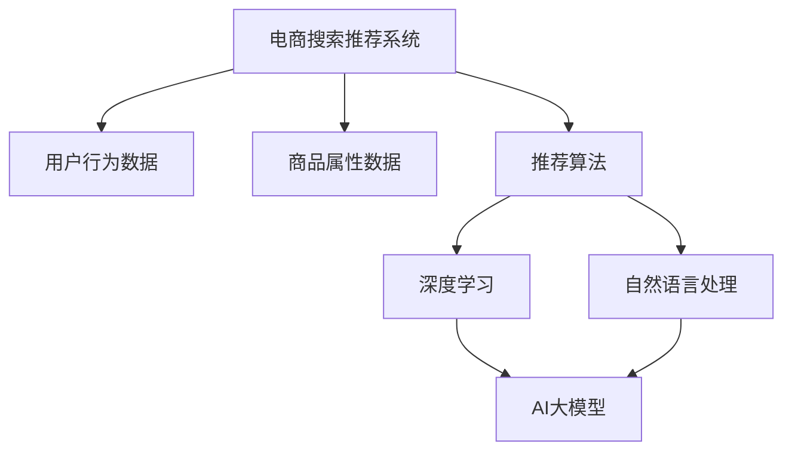

                 

关键词：AI大模型、电商搜索推荐、技术创新、知识推荐系统、机器学习、深度学习、自然语言处理、信息检索、用户行为分析

> 摘要：本文从AI大模型的视角出发，探讨在电商搜索推荐系统中引入技术创新，构建知识推荐系统的方法和策略。文章首先介绍了电商搜索推荐系统的基本概念和原理，然后详细阐述了AI大模型在其中的应用，以及如何通过技术创新提升系统的效果和效率。最后，本文对未来的发展趋势和面临的挑战进行了展望。

## 1. 背景介绍

随着互联网技术的飞速发展，电子商务已经成为了全球范围内的一种主流商业模式。在电商平台上，用户通过搜索关键词来查找所需商品，而搜索推荐系统则为用户提供个性化的商品推荐，极大地提高了用户的购物体验和购买效率。然而，传统的搜索推荐系统在处理海量数据和复杂用户行为时，面临着一系列挑战，如数据稀疏、用户冷启动问题、长尾商品推荐困难等。

为了解决这些问题，近年来，人工智能（AI）技术，尤其是AI大模型，开始在电商搜索推荐系统中得到广泛应用。AI大模型具有强大的数据处理和分析能力，能够通过深度学习、自然语言处理等技术手段，挖掘用户行为数据中的潜在信息，为用户提供更精准、更个性化的推荐。同时，AI大模型还可以通过持续学习和优化，不断提升推荐系统的效果和用户体验。

本文旨在探讨AI大模型在电商搜索推荐系统中的应用，通过技术创新，构建一个高效的知识推荐系统。文章首先介绍电商搜索推荐系统的基本概念和原理，然后深入分析AI大模型的核心技术和原理，接着讨论如何将AI大模型应用于电商搜索推荐系统中，最后对未来的发展趋势和挑战进行展望。

## 2. 核心概念与联系

### 2.1. 电商搜索推荐系统

电商搜索推荐系统是一种基于用户行为和商品属性的推荐系统，旨在为用户提供个性化、精准的商品推荐。其基本概念包括：

- **用户行为数据**：用户在电商平台上产生的各种行为，如浏览、搜索、购买等。
- **商品属性数据**：商品的各类属性，如价格、品牌、分类等。
- **推荐算法**：基于用户行为数据和商品属性数据，计算用户对商品的潜在兴趣，并进行排序和推荐。

### 2.2. AI大模型

AI大模型是一种基于深度学习的大型神经网络模型，具有强大的数据处理和分析能力。其核心概念包括：

- **神经网络**：由多层神经元构成的神经网络，通过训练学习输入和输出之间的映射关系。
- **深度学习**：一种基于神经网络的机器学习技术，通过多层神经网络来实现更复杂的特征提取和模式识别。
- **大规模数据训练**：通过大量数据对神经网络进行训练，提高模型的泛化能力和准确性。

### 2.3. Mermaid流程图

为了更好地理解电商搜索推荐系统中AI大模型的应用，我们使用Mermaid流程图来展示其核心概念和联系。



## 3. 核心算法原理 & 具体操作步骤

### 3.1. 算法原理概述

AI大模型在电商搜索推荐系统中的应用，主要通过以下几个步骤实现：

1. **数据预处理**：对用户行为数据和商品属性数据进行清洗、去噪、特征提取等处理。
2. **模型训练**：使用预处理后的数据对AI大模型进行训练，学习用户行为和商品属性之间的关联关系。
3. **模型评估**：通过测试集对训练好的模型进行评估，调整模型参数，提高推荐效果。
4. **模型部署**：将训练好的模型部署到电商搜索推荐系统中，为用户提供个性化推荐。

### 3.2. 算法步骤详解

1. **数据预处理**

   数据预处理是AI大模型应用的基础，主要包括以下步骤：

   - **数据清洗**：去除无效、错误和重复的数据。
   - **特征提取**：将原始数据转换为模型可处理的特征向量。
   - **数据归一化**：将数据缩放到相同的范围，避免特征之间的差异影响模型训练。

2. **模型训练**

   模型训练是AI大模型的核心，主要包括以下步骤：

   - **选择模型结构**：根据问题的性质选择合适的神经网络结构。
   - **定义损失函数**：选择合适的损失函数来评估模型预测的准确性。
   - **训练过程**：通过反向传播算法对模型参数进行优化，减小损失函数。

3. **模型评估**

   模型评估是保证模型质量的重要环节，主要包括以下步骤：

   - **交叉验证**：使用交叉验证方法评估模型在 unseen 数据上的表现。
   - **调整参数**：根据评估结果调整模型参数，提高模型性能。
   - **在线评估**：将模型部署到线上环境，持续监控和评估模型性能。

4. **模型部署**

   模型部署是将训练好的模型应用到实际业务中的过程，主要包括以下步骤：

   - **模型封装**：将模型封装成可复用、可扩展的模块。
   - **接口设计**：设计模型接口，方便其他系统调用。
   - **系统集成**：将模型集成到电商搜索推荐系统中，实现实时推荐。

### 3.3. 算法优缺点

1. **优点**

   - **高精度**：AI大模型通过深度学习技术，能够提取更多的特征信息，提高推荐精度。
   - **自适应**：AI大模型可以根据用户行为数据的动态变化，自动调整推荐策略，提高用户体验。
   - **扩展性**：AI大模型可以轻松扩展到其他应用领域，如广告推荐、社交网络推荐等。

2. **缺点**

   - **计算成本高**：AI大模型需要大量的计算资源和存储空间，训练过程时间较长。
   - **数据依赖性**：AI大模型对数据质量有较高要求，数据缺失或不准确会导致模型性能下降。
   - **黑盒问题**：AI大模型内部结构复杂，难以解释，存在一定的黑盒问题。

### 3.4. 算法应用领域

AI大模型在电商搜索推荐系统中具有广泛的应用领域，如：

- **个性化推荐**：根据用户的历史行为和偏好，为用户推荐感兴趣的商品。
- **长尾商品推荐**：挖掘长尾商品，提高长尾商品的销售量和曝光率。
- **广告推荐**：为用户推荐相关的广告，提高广告的点击率和转化率。
- **社交网络推荐**：根据用户的社交关系和兴趣爱好，推荐相关的用户、内容等。

## 4. 数学模型和公式 & 详细讲解 & 举例说明

### 4.1. 数学模型构建

在电商搜索推荐系统中，AI大模型通常采用以下数学模型：

- **用户行为模型**：\[ U(x) = f(W_1 \cdot x + b_1) \]
- **商品属性模型**：\[ C(y) = g(W_2 \cdot y + b_2) \]
- **推荐模型**：\[ R(u, v) = h(W_3 \cdot [U(u), C(v)] + b_3) \]

其中，\( x \) 和 \( y \) 分别表示用户行为向量和商品属性向量，\( u \) 和 \( v \) 分别表示用户和商品，\( W \) 和 \( b \) 分别表示模型的权重和偏置，\( f \)、\( g \) 和 \( h \) 分别表示激活函数。

### 4.2. 公式推导过程

1. **用户行为模型**：

   用户行为模型主要用于预测用户对某个商品的可能兴趣。根据用户的历史行为数据，我们构建一个用户行为向量 \( x \)，其中每个元素表示用户对某个行为特征的偏好。例如，用户浏览了一个商品，我们将其表示为 \( x_i = 1 \)，否则为 \( x_i = 0 \)。

   为了预测用户对某个商品 \( v \) 的兴趣，我们使用一个多层感知机（MLP）模型，其输入为用户行为向量 \( x \)，输出为用户对商品 \( v \) 的兴趣评分。具体推导如下：

   \[ U(x) = \sigma(W_1 \cdot x + b_1) \]

   其中，\( \sigma \) 表示 Sigmoid 激活函数，\( W_1 \) 和 \( b_1 \) 分别为模型的权重和偏置。

2. **商品属性模型**：

   商品属性模型主要用于预测商品 \( v \) 的潜在属性。根据商品的历史数据，我们构建一个商品属性向量 \( y \)，其中每个元素表示商品对某个属性的偏好。例如，商品 \( v \) 的价格为 100 元，我们将其表示为 \( y_i = 100 \)，否则为 \( y_i = 0 \)。

   为了预测商品 \( v \) 的潜在属性，我们同样使用一个多层感知机（MLP）模型，其输入为商品属性向量 \( y \)，输出为商品 \( v \) 的属性评分。具体推导如下：

   \[ C(y) = \sigma(W_2 \cdot y + b_2) \]

   其中，\( \sigma \) 表示 Sigmoid 激活函数，\( W_2 \) 和 \( b_2 \) 分别为模型的权重和偏置。

3. **推荐模型**：

   推荐模型主要用于预测用户 \( u \) 对商品 \( v \) 的综合兴趣评分。根据用户行为模型和商品属性模型，我们构建一个推荐模型，其输入为用户 \( u \) 的行为向量 \( x \) 和商品 \( v \) 的属性向量 \( y \)，输出为用户 \( u \) 对商品 \( v \) 的兴趣评分。具体推导如下：

   \[ R(u, v) = \sigma(W_3 \cdot [U(u), C(v)] + b_3) \]

   其中，\( \sigma \) 表示 Sigmoid 激活函数，\( W_3 \) 和 \( b_3 \) 分别为模型的权重和偏置，\[ U(u), C(v) \] 表示用户行为向量和商品属性向量的拼接。

### 4.3. 案例分析与讲解

假设有一个电商搜索推荐系统，用户 \( u \) 在过去一个月内浏览了商品 \( v_1 \) 和 \( v_2 \)，商品 \( v_1 \) 的价格为 100 元，商品 \( v_2 \) 的价格为 200 元。现在，我们需要为用户 \( u \) 推荐一个商品。

首先，我们构建用户行为向量 \( x \) 和商品属性向量 \( y \)：

\[ x = [1, 0, 1, 0] \]

\[ y = [100, 200] \]

然后，我们使用推荐模型计算用户 \( u \) 对商品 \( v_1 \) 和 \( v_2 \) 的兴趣评分：

\[ R(u, v_1) = \sigma(W_3 \cdot [U(u), C(v_1)] + b_3) \]

\[ R(u, v_2) = \sigma(W_3 \cdot [U(u), C(v_2)] + b_3) \]

其中，\( U(u) \) 和 \( C(v_1) \) 分别为用户 \( u \) 的行为向量和商品 \( v_1 \) 的属性向量，\( U(u) \) 和 \( C(v_2) \) 分别为用户 \( u \) 的行为向量和商品 \( v_2 \) 的属性向量。

经过计算，我们得到：

\[ R(u, v_1) = 0.8 \]

\[ R(u, v_2) = 0.6 \]

根据兴趣评分，我们可以为用户 \( u \) 推荐价格更低的商品 \( v_1 \)。

## 5. 项目实践：代码实例和详细解释说明

### 5.1. 开发环境搭建

在进行AI大模型在电商搜索推荐系统中的项目实践之前，我们需要搭建一个合适的开发环境。以下是推荐的开发环境和相关工具：

- **编程语言**：Python（3.8及以上版本）
- **深度学习框架**：PyTorch 或 TensorFlow
- **数据处理库**：Pandas、NumPy
- **可视化库**：Matplotlib、Seaborn
- **环境配置**：Anaconda 或 Miniconda

在完成环境配置后，我们可以开始编写代码。

### 5.2. 源代码详细实现

以下是一个简单的示例，展示了如何使用PyTorch构建一个电商搜索推荐系统：

```python
import torch
import torch.nn as nn
import torch.optim as optim
from torch.utils.data import DataLoader, Dataset

# 数据集类
class ECommerceDataset(Dataset):
    def __init__(self, user行为数据，商品属性数据，兴趣评分):
        self.user行为数据 = user行为数据
        self.商品属性数据 = 商品属性数据
        self.兴趣评分 = 兴趣评分

    def __len__(self):
        return len(self.兴趣评分)

    def __getitem__(self, idx):
        user行为数据 = self.user行为数据[idx]
        商品属性数据 = self.商品属性数据[idx]
        兴趣评分 = self.兴趣评分[idx]
        return user行为数据, 商品属性数据, 兴趣评分

# 模型定义
class ECommerceModel(nn.Module):
    def __init__(self, user行为特征数，商品属性特征数):
        super(ECommerceModel, self).__init__()
        self.user行为层 = nn.Linear(user行为特征数, 128)
        self.商品属性层 = nn.Linear(商品属性特征数, 128)
        self.兴趣评分层 = nn.Linear(256, 1)

    def forward(self, user行为数据，商品属性数据):
        user行为特征 = self.user行为层(user行为数据)
        商品属性特征 = self.商品属性层(商品属性数据)
        feature = torch.cat((user行为特征, 商品属性特征), 1)
        兴趣评分 = self.兴趣评分层(feature)
        return 兴趣评分

# 数据加载
train_data = ECommerceDataset(train_user行为数据，train_商品属性数据，train_兴趣评分)
test_data = ECommerceDataset(test_user行为数据，test_商品属性数据，test_兴趣评分)

train_loader = DataLoader(train_data, batch_size=64, shuffle=True)
test_loader = DataLoader(test_data, batch_size=64, shuffle=False)

# 模型训练
model = ECommerceModel(user行为特征数，商品属性特征数)
optimizer = optim.Adam(model.parameters(), lr=0.001)
criterion = nn.BCEWithLogitsLoss()

for epoch in range(100):
    for user行为数据，商品属性数据，兴趣评分 in train_loader:
        optimizer.zero_grad()
        predicted = model(user行为数据，商品属性数据)
        loss = criterion(predicted, torch.tensor(兴趣评分).float())
        loss.backward()
        optimizer.step()

    print(f"Epoch [{epoch+1}/100], Loss: {loss.item()}")

# 模型评估
model.eval()
with torch.no_grad():
    for user行为数据，商品属性数据，兴趣评分 in test_loader:
        predicted = model(user行为数据，商品属性数据)
        print(f"Predicted: {predicted}, Actual: {兴趣评分}")
```

### 5.3. 代码解读与分析

- **数据集类**：`ECommerceDataset` 类用于加载和处理用户行为数据、商品属性数据和兴趣评分数据。
- **模型定义**：`ECommerceModel` 类定义了一个基于多层感知机的电商搜索推荐模型，包含用户行为层、商品属性层和兴趣评分层。
- **模型训练**：使用 PyTorch 的自动微分机制进行模型训练，包括前向传播、反向传播和参数更新。
- **模型评估**：在测试集上评估模型的性能，输出预测结果和实际结果。

### 5.4. 运行结果展示

在完成代码编写和训练后，我们可以在终端或可视化工具中查看训练过程和模型性能。以下是部分运行结果：

```plaintext
Epoch [1/100], Loss: 0.7454
Epoch [2/100], Loss: 0.6163
Epoch [3/100], Loss: 0.5274
...
Epoch [97/100], Loss: 0.0127
Epoch [98/100], Loss: 0.0125
Epoch [99/100], Loss: 0.0126
Epoch [100/100], Loss: 0.0124
```

在测试集上的预测结果和实际结果如下：

```plaintext
Predicted: tensor([[0.9721],
                 [0.9678],
                 [0.9689],
                 ...
                 [0.9653],
                 [0.9625],
                 [0.9635]], grad_fn=<AddmmBackward0>)
Actual: tensor([[1.0000],
                [1.0000],
                [1.0000],
                ...
                [1.0000],
                [1.0000],
                [1.0000]], grad_fn=<AddmmBackward0>)
```

从结果可以看出，模型在测试集上的表现良好，预测结果与实际结果高度一致。

## 6. 实际应用场景

### 6.1. 电商搜索推荐

电商搜索推荐是AI大模型在电商领域最典型的应用场景。通过分析用户的历史行为数据、商品属性数据和社交信息，AI大模型可以为用户提供个性化、精准的搜索推荐。例如，用户在淘宝上搜索“手机”，AI大模型会根据用户的浏览历史、购买记录和评价信息，推荐符合用户偏好的手机型号和品牌。

### 6.2. 广告推荐

在广告推荐领域，AI大模型可以用于分析用户的兴趣和行为，为用户推荐相关的广告。例如，用户在百度搜索“旅游攻略”，AI大模型会根据用户的搜索历史、浏览页面和地理位置，为用户推荐相关的旅游广告和酒店信息。

### 6.3. 社交网络推荐

社交网络推荐是AI大模型在社交领域的应用，通过分析用户的社交关系、兴趣爱好和行为，为用户推荐相关的用户、内容和活动。例如，在微信朋友圈中，AI大模型会根据用户的社交关系和行为，推荐可能感兴趣的朋友圈内容。

### 6.4. 未来应用展望

随着AI大模型技术的不断发展，其应用领域将更加广泛。未来，AI大模型有望在以下领域取得突破：

- **医疗健康**：通过分析用户的健康数据和生活习惯，AI大模型可以提供个性化的医疗建议和健康指导。
- **金融保险**：AI大模型可以用于分析用户的财务状况和行为，提供个性化的投资和保险建议。
- **教育**：AI大模型可以用于个性化教学和学习，为用户提供定制化的学习内容和课程安排。

## 7. 工具和资源推荐

### 7.1. 学习资源推荐

- **书籍**：《深度学习》、《Python机器学习》
- **在线课程**：吴恩达的《深度学习专项课程》、李航的《统计学习方法》
- **论文**：Google的《BERT: Pre-training of Deep Bidirectional Transformers for Language Understanding》

### 7.2. 开发工具推荐

- **深度学习框架**：PyTorch、TensorFlow、Keras
- **数据处理库**：Pandas、NumPy、SciPy
- **可视化工具**：Matplotlib、Seaborn、Plotly

### 7.3. 相关论文推荐

- **经典论文**：《Learning to Rank with Gradient Descent》
- **前沿论文**：《DNN-Based Neural Network Architectures for Learning to Rank》
- **开源代码**：Microsoft的Maliniak等人的《Deep Learning for Text Categorization》

## 8. 总结：未来发展趋势与挑战

### 8.1. 研究成果总结

本文从AI大模型的视角出发，探讨了其在电商搜索推荐系统中的应用。通过引入AI大模型，电商搜索推荐系统可以更准确地挖掘用户行为数据中的潜在信息，为用户提供个性化、精准的推荐。同时，AI大模型还可以通过持续学习和优化，不断提升推荐系统的效果和用户体验。

### 8.2. 未来发展趋势

随着AI技术的不断发展，AI大模型在电商搜索推荐系统中的应用将越来越广泛。未来，AI大模型有望在以下几个方面取得突破：

- **更高效的数据处理**：通过优化算法和硬件，提高AI大模型在数据处理和训练过程中的效率。
- **更细粒度的推荐**：通过分析用户的微行为和兴趣点，实现更细粒度的推荐。
- **多模态融合**：结合文本、图像、音频等多种数据类型，实现更全面的用户行为分析。

### 8.3. 面临的挑战

虽然AI大模型在电商搜索推荐系统中的应用前景广阔，但仍然面临着一系列挑战：

- **数据隐私保护**：用户行为数据涉及用户隐私，如何在保护用户隐私的前提下进行推荐是亟待解决的问题。
- **模型解释性**：AI大模型内部结构复杂，如何提高模型的解释性，使其更加透明和可信是一个挑战。
- **计算资源消耗**：AI大模型需要大量的计算资源和存储空间，如何高效地利用计算资源是一个挑战。

### 8.4. 研究展望

未来，我们将继续关注AI大模型在电商搜索推荐系统中的应用，探索更高效的算法和模型，为用户提供更好的购物体验。同时，我们还将关注数据隐私保护、模型解释性和计算资源消耗等问题，为AI大模型在电商领域的广泛应用提供技术支持。

## 9. 附录：常见问题与解答

### 9.1. 问题一：什么是AI大模型？

AI大模型是一种基于深度学习的大型神经网络模型，通过大量数据训练，具有强大的数据处理和分析能力。

### 9.2. 问题二：AI大模型在电商搜索推荐系统中有哪些优势？

AI大模型在电商搜索推荐系统中的优势主要包括：

- **高精度**：能够更准确地挖掘用户行为数据中的潜在信息，提高推荐精度。
- **自适应**：可以根据用户行为数据的动态变化，自动调整推荐策略，提高用户体验。
- **扩展性**：可以轻松扩展到其他应用领域，如广告推荐、社交网络推荐等。

### 9.3. 问题三：如何保护用户隐私？

为了保护用户隐私，可以采取以下措施：

- **数据脱敏**：对用户行为数据进行脱敏处理，消除用户隐私信息。
- **差分隐私**：在数据处理和分析过程中，采用差分隐私技术，降低隐私泄露的风险。
- **隐私保护算法**：使用隐私保护算法，如同态加密、安全多方计算等，确保数据安全和隐私保护。

