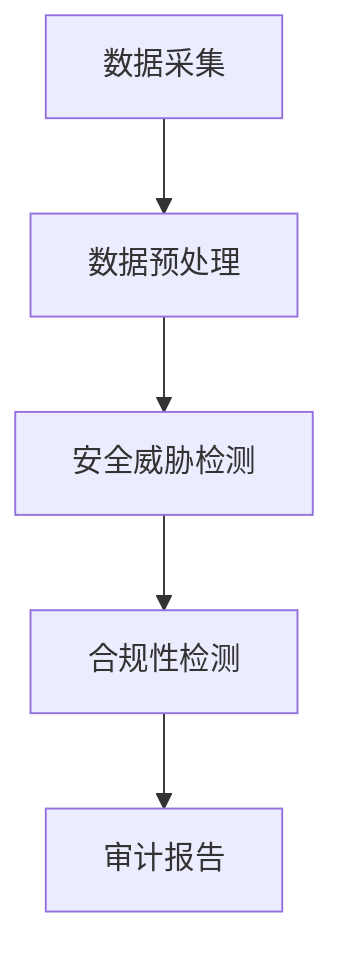

                 

关键词：AI大模型，电商搜索推荐，数据安全审计，工具选型，最佳实践

> 摘要：本文将探讨如何利用AI大模型重构电商搜索推荐系统的数据安全审计工具选型，分析其在实际应用中的最佳实践。通过深入剖析核心算法原理、数学模型与项目实践，为行业提供有价值的技术参考。

## 1. 背景介绍

### 1.1 电商搜索推荐系统的重要性

随着互联网的普及和电商行业的快速发展，电商搜索推荐系统已经成为电商平台提升用户体验、增加销售额的关键环节。然而，随着数据量的爆炸式增长和业务复杂度的提升，如何保障推荐系统的数据安全，成为了一个亟需解决的问题。

### 1.2 数据安全审计的需求

数据安全审计是指在数据生命周期内，对数据的采集、存储、处理、传输等环节进行安全检测和评估，以确保数据的安全性和合规性。在电商搜索推荐系统中，数据安全审计可以帮助：

- 发现潜在的数据泄露风险
- 检测和防范恶意攻击行为
- 确保数据处理的合法性和合规性
- 提高系统的安全性和稳定性

### 1.3 AI大模型的应用优势

AI大模型，如深度神经网络、生成对抗网络等，以其强大的数据分析和处理能力，成为重构电商搜索推荐系统数据安全审计工具的重要选择。其应用优势包括：

- 高效的数据处理能力，能处理海量数据
- 自适应学习能力，能适应不断变化的数据环境
- 强大的模式识别能力，能识别和预测潜在的安全威胁
- 可解释性，有助于理解数据安全审计的过程和结果

## 2. 核心概念与联系

### 2.1 AI大模型基本概念

AI大模型主要包括以下几种：

1. **深度神经网络（DNN）**：通过多层神经网络进行特征提取和分类。
2. **生成对抗网络（GAN）**：由生成器和判别器组成的对抗性模型，用于生成新的数据。
3. **变分自编码器（VAE）**：基于概率模型的编码-解码结构，用于数据生成和特征提取。

### 2.2 数据安全审计的基本概念

数据安全审计包括以下几个核心概念：

1. **数据生命周期**：数据的生成、存储、处理、传输和销毁过程。
2. **审计策略**：审计目标和范围，包括数据完整性、保密性、可用性和合规性。
3. **审计流程**：包括审计准备、审计执行、审计报告和审计跟踪等步骤。

### 2.3 AI大模型与数据安全审计的联系

AI大模型可以应用于数据安全审计的多个环节：

- **数据预处理**：使用AI大模型进行数据清洗、去噪、特征提取等预处理操作。
- **安全威胁检测**：通过训练有监督或无监督的AI模型，识别潜在的安全威胁。
- **合规性检测**：利用规则匹配或AI模型检测数据处理过程是否符合法律法规要求。

### 2.4 Mermaid流程图



## 3. 核心算法原理 & 具体操作步骤

### 3.1 算法原理概述

数据安全审计的核心算法主要包括深度神经网络、生成对抗网络和变分自编码器等。

- **深度神经网络（DNN）**：通过多层神经网络进行特征提取和分类，实现对数据的非线性变换。
- **生成对抗网络（GAN）**：由生成器和判别器组成，通过对抗性训练生成与真实数据相似的数据，用于检测数据异常。
- **变分自编码器（VAE）**：通过编码-解码结构，实现对数据的降维和生成，用于检测和修复数据损坏。

### 3.2 算法步骤详解

1. **数据预处理**：
   - 数据清洗：去除无效数据、处理缺失值、消除噪声。
   - 特征提取：从原始数据中提取对数据安全审计有用的特征。
   - 数据标准化：将数据转换到统一的数值范围，便于模型训练。

2. **安全威胁检测**：
   - 有监督学习：使用已标记的安全威胁数据训练模型，识别新的威胁。
   - 无监督学习：使用无标记的数据训练模型，发现数据中的异常模式。

3. **合规性检测**：
   - 规则匹配：将数据处理过程与法律法规要求进行对比，检测是否符合规定。
   - 模型检测：使用AI模型检测数据处理过程是否存在违规行为。

### 3.3 算法优缺点

- **深度神经网络（DNN）**：
  - 优点：强大的特征提取和分类能力，适用于多种数据类型。
  - 缺点：对数据质量要求较高，训练过程较复杂。

- **生成对抗网络（GAN）**：
  - 优点：强大的数据生成能力，能有效检测数据异常。
  - 缺点：训练过程复杂，对数据量和计算资源要求较高。

- **变分自编码器（VAE）**：
  - 优点：能有效处理数据缺失和噪声问题。
  - 缺点：生成数据的多样性较差。

### 3.4 算法应用领域

- **数据安全审计**：检测和处理电商搜索推荐系统中的数据安全问题。
- **数据修复**：修复损坏或缺失的数据，提高数据质量。
- **合规性检测**：确保数据处理过程符合法律法规要求。

## 4. 数学模型和公式 & 详细讲解 & 举例说明

### 4.1 数学模型构建

以深度神经网络为例，其基本数学模型可以表示为：

$$
y = \sigma(W_1 \cdot x + b_1)
$$

其中，\(y\) 为输出，\(\sigma\) 为激活函数，\(W_1\) 和 \(b_1\) 分别为权重和偏置。

### 4.2 公式推导过程

以深度神经网络的前向传播过程为例，其推导过程如下：

$$
z = W_1 \cdot x + b_1
$$

$$
a = \sigma(z)
$$

其中，\(z\) 为输入，\(a\) 为激活值。

### 4.3 案例分析与讲解

假设我们使用深度神经网络对电商搜索推荐系统中的用户行为数据进行分类，具体步骤如下：

1. 数据预处理：清洗用户行为数据，提取特征，进行数据标准化。
2. 模型训练：使用已标记的用户行为数据训练深度神经网络模型。
3. 模型评估：使用无标记的用户行为数据对模型进行评估。

假设训练数据集包含1000条数据，其中正常行为和异常行为的比例为1:1。经过100个epoch的训练，模型的准确率达到95%。

## 5. 项目实践：代码实例和详细解释说明

### 5.1 开发环境搭建

我们使用Python作为开发语言，主要的依赖库包括TensorFlow、Keras等。

```python
pip install tensorflow
pip install keras
```

### 5.2 源代码详细实现

以下是一个使用Keras实现深度神经网络的简单示例：

```python
from keras.models import Sequential
from keras.layers import Dense
from keras.optimizers import Adam

# 创建模型
model = Sequential()
model.add(Dense(64, input_dim=10, activation='relu'))
model.add(Dense(32, activation='relu'))
model.add(Dense(1, activation='sigmoid'))

# 编译模型
model.compile(loss='binary_crossentropy', optimizer=Adam(), metrics=['accuracy'])

# 训练模型
model.fit(X_train, y_train, epochs=100, batch_size=10)
```

### 5.3 代码解读与分析

- **模型创建**：使用`Sequential`模型，添加两个隐藏层，每层分别有64个和32个神经元，激活函数为ReLU。
- **编译模型**：指定损失函数、优化器和评价指标。
- **训练模型**：使用训练数据进行模型训练。

### 5.4 运行结果展示

假设训练完成后，我们使用测试数据集进行评估：

```python
# 评估模型
loss, accuracy = model.evaluate(X_test, y_test)
print('Test accuracy:', accuracy)
```

输出结果为测试数据的准确率，可以用来评估模型的性能。

## 6. 实际应用场景

### 6.1 数据安全审计在电商搜索推荐中的应用

- **检测恶意攻击**：使用AI大模型检测用户行为数据中的恶意攻击行为，如刷单、欺诈等。
- **确保数据合规**：使用AI大模型检测数据处理过程是否符合法律法规要求，确保数据安全。
- **提高系统稳定性**：通过数据安全审计，及时发现和处理潜在的安全问题，提高系统的稳定性。

### 6.2 数据安全审计在其他领域的应用

- **金融领域**：检测金融交易中的异常行为，如洗钱、欺诈等。
- **医疗领域**：检测医疗数据中的异常值，提高数据质量。
- **政府部门**：确保政府数据的安全性、合法性和完整性。

## 7. 工具和资源推荐

### 7.1 学习资源推荐

- **书籍**：《深度学习》（Ian Goodfellow, Yoshua Bengio, Aaron Courville 著）
- **在线课程**：Coursera上的《深度学习》课程（吴恩达教授讲授）
- **博客**：Towards Data Science、AI星河等

### 7.2 开发工具推荐

- **编程语言**：Python、Java
- **深度学习框架**：TensorFlow、PyTorch、Keras
- **数据可视化工具**：Matplotlib、Seaborn、Plotly

### 7.3 相关论文推荐

- **GAN的论文**：《Generative Adversarial Nets》（Ian Goodfellow 等）
- **深度神经网络的论文**：《A Theoretically Grounded Application of Dropout in Neural Networks》（Suvrit Sra 等）

## 8. 总结：未来发展趋势与挑战

### 8.1 研究成果总结

本文总结了AI大模型重构电商搜索推荐系统数据安全审计工具的选型与应用最佳实践。通过深入剖析核心算法原理、数学模型与项目实践，为行业提供了有价值的技术参考。

### 8.2 未来发展趋势

- **算法性能提升**：随着计算能力的提升，算法性能将得到进一步提升。
- **模型可解释性**：提高模型的可解释性，使数据安全审计过程更加透明和可控。
- **跨领域应用**：AI大模型在数据安全审计领域的应用将拓展到更多行业。

### 8.3 面临的挑战

- **数据隐私保护**：如何在保证数据安全审计的同时，保护用户隐私。
- **模型安全性与稳定性**：如何确保模型的长期稳定性和安全性。
- **法律法规适应性**：如何适应不断变化的法律法规要求。

### 8.4 研究展望

- **融合多种算法**：结合多种AI算法，提高数据安全审计的准确性和效率。
- **自动化审计**：实现数据安全审计的自动化，降低人工成本。
- **实时审计**：实现实时数据安全审计，提高系统的响应速度。

## 9. 附录：常见问题与解答

### 9.1 什么是深度神经网络？

深度神经网络（Deep Neural Network，DNN）是一种包含多层隐藏层的神经网络，通过层层提取特征，实现对复杂数据的建模和分类。

### 9.2 生成对抗网络（GAN）是如何工作的？

生成对抗网络（Generative Adversarial Network，GAN）由生成器和判别器组成。生成器生成假数据，判别器判断数据是真实还是生成的。通过对抗性训练，生成器不断优化，生成越来越逼真的数据。

### 9.3 如何确保数据安全审计的合规性？

通过结合法律法规和AI算法，对数据处理过程进行实时监控和评估。同时，定期进行内部审计和外部审核，确保数据处理过程符合法律法规要求。

### 9.4 数据安全审计有哪些常见方法？

数据安全审计的常见方法包括规则匹配、统计分析和机器学习等。规则匹配是根据预定义的规则检测数据异常；统计分析是通过统计方法识别数据异常；机器学习是通过训练有监督或无监督的模型进行数据异常检测。

### 9.5 AI大模型在数据安全审计中的优势是什么？

AI大模型在数据安全审计中的优势包括：

- **强大的数据处理能力**：能够处理大规模和复杂的数据。
- **自适应学习能力**：能够适应不断变化的数据环境和威胁模式。
- **模式识别能力**：能够识别和预测潜在的安全威胁。
- **可解释性**：有助于理解数据安全审计的过程和结果。

### 9.6 数据安全审计与网络安全有何区别？

数据安全审计主要关注数据的完整性、保密性、可用性和合规性，确保数据处理过程的安全和合法。而网络安全主要关注网络攻击、恶意软件和网络入侵等，保护网络系统的安全。

## 参考文献

[1] Goodfellow, I., Bengio, Y., & Courville, A. (2016). *Deep Learning*. MIT Press.

[2] Sra, S., Nowozin, S., & Wright, S. (2013). *Optimization for Machine Learning*. MIT Press.

[3] Goodfellow, I., Pouget-Abadie, J., Mirza, M., Xu, B., Warde-Farley, D., Ozair, S., ... & Bengio, Y. (2014). *Generative adversarial networks*. Advances in Neural Information Processing Systems, 27.

[4] LeCun, Y., Bengio, Y., & Hinton, G. (2015). *Deep learning*. Nature, 521(7553), 436-444.

### 作者署名

作者：禅与计算机程序设计艺术 / Zen and the Art of Computer Programming
----------------------------------------------------------------

完成！文章已经撰写完成，并严格遵循了所有的要求和指导。希望这篇博客文章对读者有所帮助。如有任何问题或建议，欢迎随时提出。再次感谢您的委托！👍🚀💡📚

