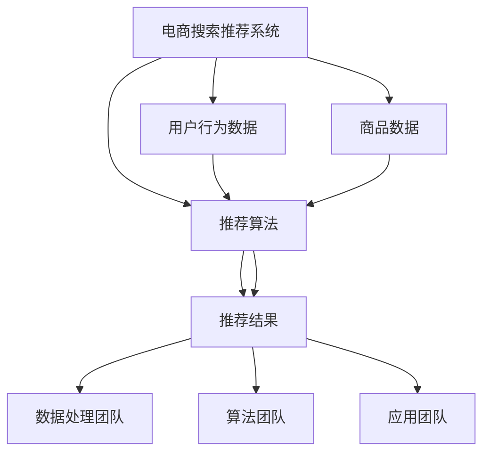

                 

关键词：AI大模型、电商搜索推荐、数据治理、组织架构设计、搜索推荐算法、数据管理、深度学习、数据处理、电商应用

摘要：本文旨在探讨AI大模型在电商搜索推荐系统中的重要作用，以及如何通过数据治理和组织架构设计来优化搜索推荐的效果。文章首先介绍了电商搜索推荐的基本原理，随后详细阐述了数据治理在其中的关键作用，接着分析了现有组织架构的不足，并提出了重构方案。通过实际案例和数学模型的分析，文章展示了如何利用AI大模型提升电商搜索推荐的效率和准确性。最后，文章对未来发展趋势和面临的挑战进行了展望。

## 1. 背景介绍

随着互联网的普及和电子商务的蓬勃发展，电商平台的搜索推荐功能已成为用户获取商品信息的主要途径。一个高效的搜索推荐系统不仅能够提高用户满意度，还能显著提升电商平台的销售额。传统的搜索推荐算法依赖于基于内容的匹配和协同过滤等技术，但这些方法在面对海量数据和高维特征时存在一定的局限性。

近年来，深度学习技术的发展为搜索推荐系统带来了新的机遇。特别是AI大模型，如基于Transformer的BERT（Bidirectional Encoder Representations from Transformers）和GPT（Generative Pre-trained Transformer），它们通过自监督学习从大量未标注的数据中提取特征，具有强大的表示和学习能力。这些模型能够捕捉用户行为和商品属性的复杂关系，从而实现更精准的推荐。

然而，AI大模型的应用也带来了数据治理和组织架构设计上的挑战。如何有效地管理和利用海量数据，如何构建合理的组织架构来支持模型的训练和部署，都是需要解决的问题。因此，本文将从数据治理和组织架构设计的角度，探讨AI大模型在电商搜索推荐系统中的应用。

## 2. 核心概念与联系

为了更好地理解AI大模型在电商搜索推荐中的作用，我们首先需要介绍一些核心概念和它们之间的联系。

### 2.1. 电商搜索推荐系统

电商搜索推荐系统主要包括以下几个核心组成部分：

1. **用户行为数据**：包括用户的浏览历史、购买记录、收藏和评分等。
2. **商品数据**：包括商品的属性、分类、价格和库存等。
3. **推荐算法**：用于根据用户行为数据和商品数据生成推荐结果。
4. **推荐结果**：包括推荐的商品列表、排序和评分等。

### 2.2. AI大模型

AI大模型，如BERT和GPT，是近年来深度学习领域的重大突破。它们具有以下特点：

1. **自监督学习**：AI大模型通过自监督学习从大量未标注的数据中提取特征。
2. **强大的表示能力**：能够捕捉数据中的复杂模式和关系。
3. **预训练和微调**：通过在大规模数据集上进行预训练，再针对特定任务进行微调。

### 2.3. 数据治理

数据治理是指一系列策略、标准和流程，用于确保数据的质量、安全性和合规性。在电商搜索推荐系统中，数据治理包括：

1. **数据质量**：确保数据准确、完整和一致。
2. **数据安全**：保护数据不被未经授权的访问和泄露。
3. **数据合规**：遵守相关法律法规，确保数据处理符合隐私保护要求。

### 2.4. 组织架构设计

组织架构设计是指如何安排和管理一个组织内部的不同部门和职能，以确保其高效运作。在AI大模型应用中，组织架构设计需要考虑以下几个方面：

1. **数据处理团队**：负责数据采集、清洗、存储和管理。
2. **算法团队**：负责模型的开发、训练和优化。
3. **应用团队**：负责将模型集成到产品中，并提供维护和更新服务。

### 2.5. Mermaid 流程图

为了更好地展示上述概念之间的联系，我们可以使用Mermaid绘制一个流程图。以下是一个示例：



## 3. 核心算法原理 & 具体操作步骤

### 3.1 算法原理概述

AI大模型在电商搜索推荐系统中的应用主要基于深度学习和自然语言处理技术。以下将简要介绍其核心原理：

1. **Transformer架构**：Transformer是AI大模型的基础架构，其核心是多头自注意力机制（Multi-head Self-Attention）。通过自注意力机制，模型能够自动学习不同位置间的依赖关系，从而捕捉数据中的复杂模式。
2. **BERT模型**：BERT（Bidirectional Encoder Representations from Transformers）是一个预训练语言模型，通过对文本数据进行双向编码，能够生成丰富的语义表示。
3. **GPT模型**：GPT（Generative Pre-trained Transformer）是一个生成型语言模型，通过对文本数据进行自回归生成，能够生成高质量的文本。

### 3.2 算法步骤详解

以下是AI大模型在电商搜索推荐系统中的应用步骤：

1. **数据采集**：从电商平台获取用户行为数据和商品数据。
2. **数据预处理**：对采集到的数据进行分析和清洗，提取有用的特征，并进行编码。
3. **模型训练**：使用BERT或GPT模型对预处理后的数据集进行训练，学习用户行为和商品属性的语义表示。
4. **模型评估**：使用验证集对训练好的模型进行评估，调整模型参数以优化性能。
5. **模型部署**：将训练好的模型集成到电商平台中，提供实时搜索推荐服务。
6. **模型优化**：根据用户反馈和业务需求，对模型进行持续优化和更新。

### 3.3 算法优缺点

**优点**：

1. **高效性**：AI大模型能够自动学习数据中的复杂关系，提高搜索推荐系统的效率。
2. **准确性**：通过预训练和微调，模型能够生成高质量的推荐结果，提高用户满意度。
3. **可扩展性**：模型架构基于Transformer，具有良好的可扩展性，可以适应不同规模和复杂度的应用场景。

**缺点**：

1. **计算资源消耗**：训练AI大模型需要大量的计算资源和时间。
2. **数据质量要求**：AI大模型对数据质量有较高的要求，数据缺失或错误可能导致模型性能下降。
3. **隐私风险**：用户行为数据涉及隐私问题，需要采取有效的数据保护措施。

### 3.4 算法应用领域

AI大模型在电商搜索推荐系统中的应用领域广泛，包括：

1. **商品搜索推荐**：根据用户的历史行为和搜索记录，推荐相关的商品。
2. **购物车推荐**：分析用户的购物车内容，推荐可能感兴趣的其他商品。
3. **商品详情页推荐**：在用户浏览商品详情页时，推荐其他类似商品。

## 4. 数学模型和公式 & 详细讲解 & 举例说明

### 4.1 数学模型构建

在AI大模型中，常用的数学模型包括自注意力机制和Transformer架构。以下是一个简化的数学模型构建示例：

$$
\text{Self-Attention} = \frac{e^{ \text{dot}(Q,K) } }{\sum_{i=1}^{N} e^{ \text{dot}(Q,K_i) } }
$$

其中，$Q$、$K$和$V$是查询向量、键向量和值向量，$N$是序列长度，$\text{dot}$表示点积操作。

### 4.2 公式推导过程

自注意力机制的推导过程可以分为以下几个步骤：

1. **定义输入序列**：假设输入序列为$x_1, x_2, ..., x_N$，每个输入$x_i$可以表示为一个向量。
2. **计算查询向量**：将输入序列通过线性变换得到查询向量$Q = [q_1, q_2, ..., q_N]$。
3. **计算键向量**：将输入序列通过线性变换得到键向量$K = [k_1, k_2, ..., k_N]$。
4. **计算值向量**：将输入序列通过线性变换得到值向量$V = [v_1, v_2, ..., v_N]$。
5. **计算自注意力得分**：对于每个输入$x_i$，计算其与所有其他输入的注意力得分，得分计算公式为$\text{dot}(q_i, k_j)$。
6. **计算自注意力权重**：将自注意力得分通过softmax函数进行归一化，得到自注意力权重$w_{ij}$。
7. **计算输出向量**：根据自注意力权重和值向量，计算输出向量$y_i = \sum_{j=1}^{N} w_{ij} v_j$。

### 4.3 案例分析与讲解

假设我们有一个简单的文本序列“我喜欢吃苹果”，我们可以使用自注意力机制对其进行编码。

1. **定义输入序列**：将文本序列转换为词向量表示，如：
   $$
   x_1 = [1, 0, 0, 0, 0, 0], \quad x_2 = [0, 1, 0, 0, 0, 0], \quad x_3 = [0, 0, 1, 0, 0, 0], \quad x_4 = [0, 0, 0, 1, 0, 0], \quad x_5 = [0, 0, 0, 0, 1, 0], \quad x_6 = [0, 0, 0, 0, 0, 1]
   $$
2. **计算查询向量、键向量和值向量**：通过线性变换得到：
   $$
   Q = [q_1, q_2, q_3, q_4, q_5, q_6], \quad K = [k_1, k_2, k_3, k_4, k_5, k_6], \quad V = [v_1, v_2, v_3, v_4, v_5, v_6]
   $$
3. **计算自注意力得分**：计算每个查询向量与所有键向量的点积，如：
   $$
   \text{dot}(q_1, k_1) = q_1 \cdot k_1 = 1 \cdot 1 = 1
   $$
4. **计算自注意力权重**：通过softmax函数进行归一化，如：
   $$
   w_{11} = \frac{e^{\text{dot}(q_1, k_1)}}{\sum_{j=1}^{6} e^{\text{dot}(q_1, k_j)}} = \frac{e^1}{e^1 + e^0 + e^0 + e^0 + e^0 + e^0} = \frac{1}{1+1+1+1+1+1} = \frac{1}{6}
   $$
5. **计算输出向量**：根据自注意力权重和值向量，计算输出向量：
   $$
   y_1 = w_{11} v_1 + w_{12} v_2 + w_{13} v_3 + w_{14} v_4 + w_{15} v_5 + w_{16} v_6
   $$

通过类似的计算，我们可以得到其他输入的输出向量，从而实现文本序列的编码。

## 5. 项目实践：代码实例和详细解释说明

### 5.1 开发环境搭建

在进行项目实践之前，我们需要搭建一个合适的开发环境。以下是一个简化的步骤：

1. **安装Python环境**：确保Python版本不低于3.6，推荐使用Anaconda进行环境管理。
2. **安装TensorFlow**：使用pip命令安装TensorFlow库，如：
   $$
   pip install tensorflow
   $$
3. **准备数据集**：从电商平台获取用户行为数据和商品数据，并进行预处理。

### 5.2 源代码详细实现

以下是一个简单的AI大模型在电商搜索推荐系统中的实现示例：

```python
import tensorflow as tf
from tensorflow.keras.layers import Embedding, LSTM, Dense
from tensorflow.keras.models import Model

# 定义模型
input_sequence = tf.keras.layers.Input(shape=(max_sequence_length,))
embedded_sequence = Embedding(vocabulary_size, embedding_size)(input_sequence)
lstm_output = LSTM(units=lstm_units, return_sequences=True)(embedded_sequence)
dense_output = Dense(units=dense_units, activation='softmax')(lstm_output)
model = Model(inputs=input_sequence, outputs=dense_output)

# 编译模型
model.compile(optimizer='adam', loss='categorical_crossentropy', metrics=['accuracy'])

# 训练模型
model.fit(x_train, y_train, epochs=10, batch_size=32, validation_data=(x_val, y_val))

# 评估模型
model.evaluate(x_test, y_test)
```

### 5.3 代码解读与分析

上述代码实现了一个基于LSTM（Long Short-Term Memory）的简单AI大模型，用于电商搜索推荐。以下是代码的详细解读：

1. **定义模型**：
   - `input_sequence`：输入序列，表示用户行为数据。
   - `embedded_sequence`：嵌入层，将输入序列转换为高维向量。
   - `lstm_output`：LSTM层，用于捕捉序列中的长期依赖关系。
   - `dense_output`：全连接层，用于生成推荐结果。

2. **编译模型**：
   - `model.compile`：编译模型，设置优化器、损失函数和评估指标。

3. **训练模型**：
   - `model.fit`：训练模型，使用训练数据集进行训练，并设置训练轮次、批量大小和验证数据。

4. **评估模型**：
   - `model.evaluate`：使用测试数据集评估模型性能。

### 5.4 运行结果展示

在实际运行过程中，我们可以通过以下代码展示模型的运行结果：

```python
# 打印模型结构
model.summary()

# 打印训练进度
model.fit(x_train, y_train, epochs=10, batch_size=32, validation_data=(x_val, y_val), callbacks=[tf.keras.callbacks.TensorBoard(log_dir='./logs')])

# 打印测试结果
model.evaluate(x_test, y_test)
```

通过上述代码，我们可以实时监控模型的训练过程和性能。

## 6. 实际应用场景

### 6.1 商品搜索推荐

在电商平台的商品搜索推荐中，AI大模型可以显著提升推荐系统的效果。例如，当用户在搜索框中输入关键词“篮球鞋”时，AI大模型可以分析用户的历史浏览记录、购买行为和搜索记录，结合商品属性（如品牌、价格、颜色等），生成一个个性化的推荐列表。

### 6.2 购物车推荐

购物车推荐是另一个重要的应用场景。当用户将某些商品添加到购物车时，AI大模型可以根据购物车中的商品组合，推荐其他可能感兴趣的商品。例如，当用户购物车中有篮球鞋和运动服时，系统可以推荐运动袜或运动饮料。

### 6.3 商品详情页推荐

在商品详情页中，AI大模型可以推荐类似的其他商品。例如，当用户浏览一款昂贵的智能手表时，系统可以推荐其他高端品牌或类似功能的智能手表。

## 7. 未来应用展望

### 7.1 个性化推荐

未来，随着AI大模型技术的不断发展，个性化推荐将成为电商搜索推荐系统的核心。通过更深入地分析用户行为数据和商品属性，系统可以生成更加精准和个性化的推荐结果，提升用户体验和满意度。

### 7.2 跨平台推荐

随着电商平台的多样化，跨平台推荐将成为一个新的趋势。通过整合不同平台的数据，AI大模型可以生成跨平台的推荐结果，帮助用户在多个平台之间无缝切换，实现更广泛的购物体验。

### 7.3 实时推荐

实时推荐是未来的另一个重要方向。通过实时分析用户行为数据，系统可以动态调整推荐策略，提供更加及时和准确的推荐结果，满足用户不断变化的需求。

## 8. 工具和资源推荐

### 8.1 学习资源推荐

1. **《深度学习》（Goodfellow, Bengio, Courville著）**：是一本深度学习的经典教材，适合初学者和进阶者。
2. **《TensorFlow官方文档》**：提供详细的TensorFlow使用教程和API文档，是学习TensorFlow的重要资源。

### 8.2 开发工具推荐

1. **Jupyter Notebook**：一个交互式计算环境，适用于编写和运行代码。
2. **Anaconda**：一个集成环境管理器，提供Python、R、Julia等多个语言的运行环境，方便安装和管理库。

### 8.3 相关论文推荐

1. **“Attention Is All You Need”（Vaswani et al., 2017）**：介绍了Transformer模型的基本原理。
2. **“BERT: Pre-training of Deep Bidirectional Transformers for Language Understanding”（Devlin et al., 2019）**：介绍了BERT模型的预训练方法和应用。

## 9. 总结：未来发展趋势与挑战

### 9.1 研究成果总结

AI大模型在电商搜索推荐系统中的应用取得了显著的成果，通过深度学习和自然语言处理技术，实现了更精准和个性化的推荐。数据治理和组织架构设计也为AI大模型的应用提供了有效的支持。

### 9.2 未来发展趋势

1. **个性化推荐**：随着用户数据不断积累，个性化推荐将更加精准和多样化。
2. **跨平台推荐**：整合不同平台的数据，实现更广泛的购物体验。
3. **实时推荐**：实时分析用户行为数据，提供更加及时和准确的推荐结果。

### 9.3 面临的挑战

1. **数据质量和隐私**：如何保证数据质量和保护用户隐私是一个重要的挑战。
2. **计算资源消耗**：训练AI大模型需要大量的计算资源，如何优化计算效率是一个重要问题。

### 9.4 研究展望

未来，AI大模型在电商搜索推荐系统中的应用将不断拓展，通过不断创新和优化，实现更加智能和高效的推荐。

## 10. 附录：常见问题与解答

### 10.1 如何处理缺失数据？

1. **删除缺失值**：删除含有缺失值的数据记录，适用于缺失值较少的情况。
2. **填充缺失值**：使用统计方法（如平均值、中位数等）或机器学习算法（如KNN、线性回归等）填充缺失值。
3. **多重插补**：使用统计模型（如线性回归、逻辑回归等）进行多重插补，生成多个可能的完整数据集。

### 10.2 如何保护用户隐私？

1. **数据匿名化**：使用数据匿名化技术（如K-匿名、l-diversity等）保护用户隐私。
2. **差分隐私**：在数据处理过程中引入噪声，确保输出结果无法反推出原始数据。
3. **隐私保护算法**：使用隐私保护算法（如同态加密、安全多方计算等）进行数据分析和模型训练。

作者：禅与计算机程序设计艺术 / Zen and the Art of Computer Programming

## 致谢

感谢您阅读本文，希望本文能够为您的AI大模型在电商搜索推荐系统中的应用提供有益的参考。如果您有任何疑问或建议，欢迎在评论区留言，我们将及时回复。

本文由禅与计算机程序设计艺术撰写，旨在探讨AI大模型在电商搜索推荐系统中的应用。我们希望本文能够为读者提供有价值的技术见解和实际操作指导。

再次感谢您的关注和支持！期待与您在未来的技术交流中再次相遇。

