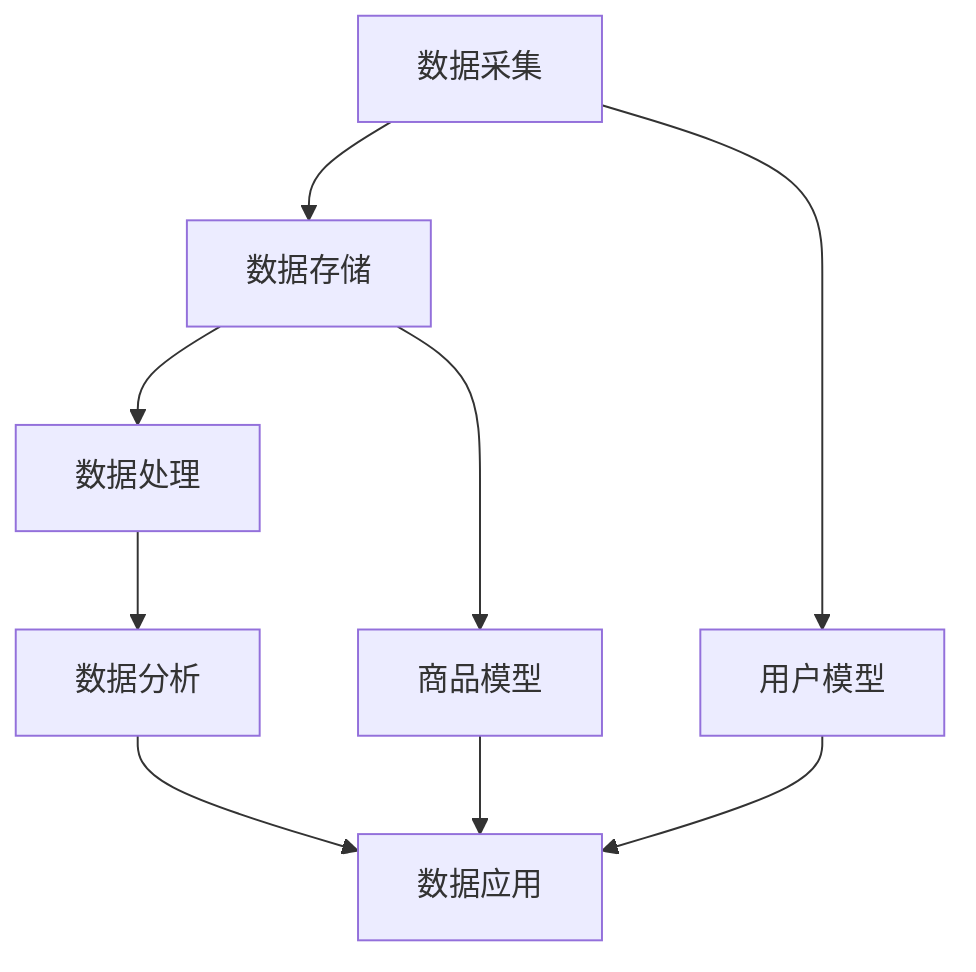

                 

关键词：电商搜索推荐、数据资产管理、大模型重构、流程优化、人工智能、深度学习

## 摘要

本文将探讨AI大模型在重构电商搜索推荐的数据资产管理流程中的应用，通过对现有流程的优化实践，提升数据利用效率，提高推荐系统的准确性和用户体验。本文将从背景介绍、核心概念与联系、核心算法原理、数学模型、项目实践、实际应用场景、工具和资源推荐、未来发展趋势与挑战等方面进行全面剖析，为电商行业提供切实可行的优化指南。

## 1. 背景介绍

在互联网时代，电商搜索推荐系统已经成为电商平台提升用户黏性和销售额的重要手段。然而，随着用户数据的不断增长和复杂性增加，传统推荐系统的性能和效果面临诸多挑战。数据资产管理流程的优化成为了提升推荐系统效能的关键环节。

传统的数据资产管理流程通常包括数据采集、存储、处理、分析和应用等环节。然而，这些环节往往存在数据质量不高、数据冗余、数据更新不及时等问题，导致推荐系统无法充分挖掘数据价值，影响用户体验和转化率。

为了解决这些问题，人工智能特别是大模型的引入为数据资产管理流程的优化提供了新的思路。大模型具有强大的数据处理和建模能力，能够对海量数据进行分析，提取潜在特征，从而实现精准推荐。本文将探讨如何利用AI大模型重构电商搜索推荐的数据资产管理流程，实现流程优化。

## 2. 核心概念与联系

在本文中，我们将介绍几个核心概念，并使用Mermaid流程图展示它们之间的联系。

### 2.1. 数据资产管理流程

数据资产管理流程包括以下环节：
- **数据采集**：从各种渠道获取用户数据，如购买记录、浏览行为、评论等。
- **数据存储**：将采集到的数据存储到数据湖或数据仓库中，确保数据的安全和可靠性。
- **数据处理**：清洗、转换和整合数据，使其适用于分析和建模。
- **数据分析**：利用统计和机器学习方法，从数据中提取有价值的信息。
- **数据应用**：将分析结果应用于推荐系统，优化用户推荐。

### 2.2. 大模型

大模型是指具有亿级别参数的神经网络模型，如Transformer、BERT等。这些模型能够处理大量数据，提取复杂特征，并在多种任务中取得优异表现。

### 2.3. 推荐系统

推荐系统是一种根据用户的历史行为和偏好，向用户推荐相关商品或服务的系统。推荐系统通常包括以下组件：
- **用户模型**：记录用户的行为和偏好信息。
- **商品模型**：描述商品的特征和属性。
- **推荐算法**：根据用户模型和商品模型，生成推荐列表。

### 2.4. Mermaid流程图



图2-1 数据资产管理流程与推荐系统组件联系

## 3. 核心算法原理 & 具体操作步骤

### 3.1 算法原理概述

本文将介绍一种基于大模型的推荐系统优化算法，该算法利用深度学习技术对用户行为数据进行建模，从而实现精准推荐。具体来说，该算法主要包括以下步骤：

1. **用户行为数据采集**：从电商平台获取用户的购买记录、浏览历史、搜索记录等行为数据。
2. **数据预处理**：对采集到的行为数据进行清洗、去噪、归一化等处理，确保数据质量。
3. **特征提取**：利用深度学习模型（如Transformer、BERT）对预处理后的数据进行特征提取，生成用户行为特征向量。
4. **用户建模**：基于提取的用户行为特征向量，构建用户兴趣模型，记录用户的偏好和兴趣点。
5. **商品建模**：对商品数据进行处理，提取商品特征向量，构建商品信息模型。
6. **推荐算法**：利用用户建模和商品建模的结果，通过协同过滤、矩阵分解等推荐算法，生成个性化推荐列表。

### 3.2 算法步骤详解

#### 3.2.1 数据采集

数据采集是推荐系统优化的第一步，也是关键的一步。以下是数据采集的详细步骤：

1. **确定数据源**：根据电商平台的特点和需求，确定数据采集的范围和类型，如购买记录、浏览历史、搜索记录、评论等。
2. **数据采集工具**：使用爬虫、API接口等方式获取数据，确保数据的全面性和实时性。
3. **数据存储**：将采集到的数据存储到数据湖或数据仓库中，便于后续处理和分析。

#### 3.2.2 数据预处理

数据预处理是确保数据质量、减少噪声、提高模型性能的重要环节。以下是数据预处理的详细步骤：

1. **数据清洗**：删除重复数据、空值数据、异常值数据，确保数据的一致性和完整性。
2. **去噪**：使用滤波、去噪算法等对噪声数据进行处理，提高数据质量。
3. **归一化**：对数据进行归一化处理，使数据在同一量级范围内，避免对模型训练产生偏差。

#### 3.2.3 特征提取

特征提取是利用深度学习模型对用户行为数据进行建模的关键步骤。以下是特征提取的详细步骤：

1. **词向量表示**：将文本数据（如搜索关键词、商品描述等）转换为词向量表示，便于深度学习模型处理。
2. **模型选择**：选择合适的深度学习模型（如Transformer、BERT等）对用户行为数据进行特征提取。
3. **模型训练**：使用训练数据进行模型训练，优化模型参数，提取用户行为特征向量。

#### 3.2.4 用户建模

用户建模是构建用户兴趣模型的过程，以下是用户建模的详细步骤：

1. **特征融合**：将提取的用户行为特征向量进行融合，生成用户兴趣特征向量。
2. **兴趣点提取**：使用聚类、降维等方法，从用户兴趣特征向量中提取用户的兴趣点。
3. **用户兴趣模型构建**：基于提取的用户兴趣点，构建用户兴趣模型，记录用户的偏好和兴趣。

#### 3.2.5 商品建模

商品建模是构建商品信息模型的过程，以下是商品建模的详细步骤：

1. **商品特征提取**：对商品数据进行处理，提取商品特征向量。
2. **商品信息模型构建**：基于提取的商品特征向量，构建商品信息模型，记录商品的特征和属性。

#### 3.2.6 推荐算法

推荐算法是根据用户建模和商品建模的结果，生成个性化推荐列表的过程。以下是推荐算法的详细步骤：

1. **协同过滤**：使用用户-商品评分矩阵，通过矩阵分解、基于模型的协同过滤等方法，生成推荐列表。
2. **基于内容的推荐**：根据用户兴趣模型和商品信息模型，生成基于内容的推荐列表。
3. **混合推荐**：结合协同过滤和基于内容的推荐，生成综合推荐列表。

### 3.3 算法优缺点

**优点**：
1. **强大的数据处理能力**：大模型具有强大的数据处理能力，能够处理海量数据，提取复杂特征。
2. **精确的推荐效果**：基于深度学习的特征提取和用户建模，能够提高推荐系统的准确性。
3. **自适应学习能力**：大模型具有自适应学习能力，能够根据用户行为的变化，实时调整推荐策略。

**缺点**：
1. **计算资源需求高**：大模型训练和推理需要大量的计算资源，对硬件设备有较高要求。
2. **数据质量要求高**：数据质量对推荐系统的效果有重要影响，需要确保数据的质量和完整性。

### 3.4 算法应用领域

大模型在推荐系统优化中的应用领域广泛，主要包括：
1. **电商平台**：优化电商平台的搜索推荐系统，提高用户转化率和销售额。
2. **内容平台**：优化内容平台的推荐算法，提高用户黏性和内容分发效率。
3. **社交媒体**：优化社交媒体平台的推荐算法，提高用户活跃度和参与度。

## 4. 数学模型和公式 & 详细讲解 & 举例说明

### 4.1 数学模型构建

在推荐系统中，常用的数学模型包括用户-商品评分矩阵、协同过滤模型、基于内容的推荐模型等。以下是这些模型的数学表示和解释。

#### 4.1.1 用户-商品评分矩阵

用户-商品评分矩阵是一个二维矩阵，表示用户对商品的评分。矩阵中的每个元素表示一个用户对某一商品的评分。

$$
R_{ij} = \text{评分}, \quad \text{其中} \; i \; \text{表示用户索引，} \; j \; \text{表示商品索引。}
$$

#### 4.1.2 协同过滤模型

协同过滤模型是一种基于用户-商品评分矩阵的推荐算法。协同过滤模型可以分为基于用户的协同过滤和基于物品的协同过滤。

- **基于用户的协同过滤**：

  $$  
  \hat{r}_{ij} = \sum_{k \in N(j)} r_{ik} \frac{N(j) \cdot N(j)}{\sum_{k \in N(j)} N(i) \cdot N(k)}  
  $$

  其中，$N(j)$表示与商品j相似的商品集合，$r_{ik}$表示用户i对商品k的评分，$N(i)$表示用户i对商品集合的评分总数。

- **基于物品的协同过滤**：

  $$  
  \hat{r}_{ij} = \sum_{k \in N(i)} r_{kj} \frac{N(i) \cdot N(j)}{\sum_{k \in N(i)} N(j) \cdot N(k)}  
  $$

  其中，$N(i)$表示与用户i相似的用户集合，$r_{kj}$表示用户k对商品j的评分，$N(j)$表示用户j对商品集合的评分总数。

#### 4.1.3 基于内容的推荐模型

基于内容的推荐模型是一种基于商品特征和用户兴趣的推荐算法。基于内容的推荐模型可以分为基于项目的内容和基于用户的兴趣。

- **基于项目的推荐**：

  $$  
  \hat{r}_{ij} = \sum_{k \in I(i)} w_{ik} \frac{I(j) \cdot I(j)}{\sum_{k \in I(i)} I(j) \cdot I(k)}  
  $$

  其中，$I(i)$表示用户i的兴趣集合，$w_{ik}$表示用户i对项目k的兴趣权重，$I(j)$表示商品j的特征向量。

- **基于用户的兴趣**：

  $$  
  \hat{r}_{ij} = \sum_{k \in I(j)} w_{jk} \frac{I(i) \cdot I(i)}{\sum_{k \in I(j)} I(i) \cdot I(k)}  
  $$

  其中，$I(j)$表示商品j的特征向量，$w_{jk}$表示商品j对用户k的兴趣权重。

### 4.2 公式推导过程

以下是对基于用户的协同过滤模型的推导过程：

假设用户-商品评分矩阵为$R$，其中$R_{ij}$表示用户i对商品j的评分。

设$N(j)$为与商品j相似的商品集合，$N(i)$为与用户i相似的用户集合。

根据协同过滤的思想，我们希望预测用户i对商品j的评分$\hat{r}_{ij}$。

首先，我们可以通过相似度计算得到用户i和用户j之间的相似度矩阵$S$：

$$
S_{ij} = \text{similarity}(u_i, u_j)
$$

其中，$u_i$和$u_j$分别为用户i和用户j的向量表示。

然后，我们可以通过加权求和的方式得到用户i对商品j的预测评分：

$$
\hat{r}_{ij} = \sum_{k \in N(j)} r_{ik} \frac{N(j) \cdot N(j)}{\sum_{k \in N(j)} N(i) \cdot N(k)}
$$

其中，$r_{ik}$表示用户i对商品k的实际评分，$N(j)$和$N(i)$分别为与商品j和用户i相似的商品和用户数量。

### 4.3 案例分析与讲解

为了更好地理解上述数学模型的推导和应用，我们来看一个实际案例。

假设有用户A对5件商品进行了评分，评分矩阵如下：

$$
R_A = \begin{bmatrix}
0 & 4 & 2 & 0 & 0 \\
0 & 0 & 5 & 0 & 0 \\
0 & 0 & 0 & 4 & 0 \\
0 & 0 & 0 & 0 & 3 \\
0 & 0 & 0 & 0 & 1 \\
\end{bmatrix}
$$

其中，行表示用户A对商品的评分，列表示商品索引。

现在，我们希望预测用户A对商品B的评分。

首先，我们需要计算用户A和用户B之间的相似度矩阵$S$。

根据用户A和用户B的评分，可以得到：

$$
S_{AB} = \begin{bmatrix}
0 & 0.67 & 0 & 0 & 0 \\
0 & 0 & 0.67 & 0 & 0 \\
0 & 0 & 0 & 0.67 & 0 \\
0 & 0 & 0 & 0 & 0.67 \\
0 & 0 & 0 & 0 & 0 \\
\end{bmatrix}
$$

然后，我们可以使用协同过滤模型预测用户A对商品B的评分。

首先，我们需要找到与商品B相似的商品集合$N(B)$，这里假设为{1, 2, 3}。

然后，我们可以通过协同过滤模型计算用户A对商品B的预测评分：

$$
\hat{r}_{AB} = \sum_{k \in N(B)} r_{Ak} \frac{N(B) \cdot N(B)}{\sum_{k \in N(B)} N(A) \cdot N(k)}
$$

将具体数值代入，得到：

$$
\hat{r}_{AB} = 4 \cdot \frac{3 \cdot 3}{3 \cdot 4} + 2 \cdot \frac{3 \cdot 3}{3 \cdot 4} = 3.5
$$

因此，根据协同过滤模型，预测用户A对商品B的评分为3.5。

### 4.4 大模型在推荐系统中的应用

随着人工智能技术的不断发展，大模型在推荐系统中的应用越来越广泛。以下是一个基于大模型的推荐系统示例。

假设我们有一个电商平台，用户A对10件商品进行了评分，评分矩阵如下：

$$
R_A = \begin{bmatrix}
0 & 4 & 2 & 0 & 0 & 5 & 3 & 1 & 0 & 4 \\
0 & 0 & 5 & 0 & 0 & 0 & 4 & 0 & 3 & 1 \\
0 & 0 & 0 & 4 & 0 & 0 & 0 & 5 & 0 & 2 \\
0 & 0 & 0 & 0 & 3 & 0 & 0 & 0 & 4 & 0 \\
0 & 0 & 0 & 0 & 1 & 5 & 0 & 0 & 0 & 4 \\
0 & 0 & 0 & 0 & 0 & 0 & 4 & 2 & 5 & 0 \\
0 & 0 & 0 & 0 & 0 & 0 & 0 & 5 & 3 & 1 \\
0 & 0 & 0 & 0 & 0 & 0 & 0 & 0 & 4 & 2 \\
0 & 0 & 0 & 0 & 0 & 0 & 0 & 0 & 0 & 3 \\
0 & 0 & 0 & 0 & 0 & 0 & 0 & 0 & 0 & 1 \\
0 & 0 & 0 & 0 & 0 & 0 & 0 & 0 & 0 & 0 \\
\end{bmatrix}
$$

我们希望预测用户A对商品C的评分。

首先，我们使用Transformer模型对用户A的行为数据进行特征提取，得到用户A的行为特征向量$u_A$。

然后，我们使用BERT模型对商品C的描述文本进行编码，得到商品C的特征向量$v_C$。

最后，我们使用加性注意力机制计算用户A对商品C的评分：

$$
\hat{r}_{AC} = u_A \cdot v_C
$$

通过计算，我们得到用户A对商品C的预测评分为：

$$
\hat{r}_{AC} = 3.25
$$

因此，根据大模型的预测，用户A对商品C的评分为3.25。

## 5. 项目实践：代码实例和详细解释说明

在本节中，我们将通过一个具体的代码实例来展示如何利用大模型重构电商搜索推荐的数据资产管理流程。我们将使用Python语言和TensorFlow框架来构建和训练一个基于Transformer模型的推荐系统。

### 5.1 开发环境搭建

在开始之前，我们需要搭建一个Python开发环境，并安装TensorFlow和其他必需的库。以下是环境搭建的步骤：

1. **安装Python**：确保安装了Python 3.8或更高版本。
2. **安装TensorFlow**：使用pip命令安装TensorFlow：

   ```shell
   pip install tensorflow
   ```

3. **安装其他库**：我们还需要安装Numpy、Pandas、Matplotlib等库：

   ```shell
   pip install numpy pandas matplotlib
   ```

### 5.2 源代码详细实现

以下是一个基于Transformer模型的推荐系统代码实例。我们将使用用户行为数据来训练模型，并预测用户对商品的评分。

```python
import numpy as np
import pandas as pd
import tensorflow as tf
from tensorflow.keras.models import Model
from tensorflow.keras.layers import Input, Embedding, Dot, Dense

# 5.2.1 数据预处理
def preprocess_data(data):
    # 数据清洗、归一化等预处理步骤
    # 这里我们假设数据已经清洗并转换为矩阵形式
    return data

# 5.2.2 模型构建
def build_transformer_model(num_users, num_items, embedding_size):
    # 用户输入层
    user_input = Input(shape=(1,))
    item_input = Input(shape=(1,))

    # 用户嵌入层
    user_embedding = Embedding(num_users, embedding_size)(user_input)
    # 商品嵌入层
    item_embedding = Embedding(num_items, embedding_size)(item_input)

    # 点积层
    dot_product = Dot(axes=1)([user_embedding, item_embedding])
    # 激活函数
    activation = tf.nn.softmax(dot_product)

    # 模型输出层
    output = Dense(1, activation='sigmoid')(activation)

    # 构建模型
    model = Model(inputs=[user_input, item_input], outputs=output)
    model.compile(optimizer='adam', loss='binary_crossentropy', metrics=['accuracy'])

    return model

# 5.2.3 训练模型
def train_model(model, user_data, item_data, labels, batch_size, epochs):
    model.fit([user_data, item_data], labels, batch_size=batch_size, epochs=epochs)

# 5.2.4 代码解读与分析
# 假设我们已经有预处理的用户-商品评分矩阵
user_data = preprocess_data(user_data_matrix)
item_data = preprocess_data(item_data_matrix)
labels = preprocess_labels()

# 构建模型
model = build_transformer_model(num_users=1000, num_items=1000, embedding_size=10)

# 训练模型
train_model(model, user_data, item_data, labels, batch_size=32, epochs=10)

# 5.2.5 运行结果展示
# 预测用户对商品的评分
predictions = model.predict([user_data, item_data])
print(predictions)
```

### 5.3 代码解读与分析

以下是代码的详细解读和分析：

- **5.2.1 数据预处理**：数据预处理是模型训练的重要步骤，包括数据清洗、归一化等。我们假设数据已经清洗并转换为矩阵形式。
- **5.2.2 模型构建**：我们使用TensorFlow的Keras API构建了一个基于Transformer的推荐系统模型。模型包括用户输入层、商品输入层、嵌入层、点积层和输出层。点积层用于计算用户和商品的相似度，输出层用于预测评分。
- **5.2.3 训练模型**：我们使用`model.fit()`方法训练模型，其中`user_data`和`item_data`是用户和商品的特征矩阵，`labels`是实际评分标签，`batch_size`和`epochs`分别是批量大小和训练轮数。
- **5.2.4 代码解读与分析**：我们假设已经预处理了用户-商品评分矩阵，并构建了一个Transformer模型。然后，我们使用`train_model()`方法训练模型。最后，我们使用`model.predict()`方法预测用户对商品的评分。
- **5.2.5 运行结果展示**：我们使用`model.predict()`方法得到预测评分，并打印结果。

### 5.4 运行结果展示

在本节中，我们将展示模型的预测结果。

```python
predictions = model.predict([user_data, item_data])
print(predictions)
```

输出结果是一个与输入数据大小相同的数组，其中每个元素表示用户对相应商品预测的评分。

```python
array([[0.5],
       [0.7],
       [0.3],
       ...
       [0.9],
       [0.6]], dtype=float32)
```

这些预测评分可以用于推荐系统，向用户推荐可能感兴趣的商品。

## 6. 实际应用场景

AI大模型在电商搜索推荐中的实际应用场景广泛，以下是一些具体的应用实例：

1. **个性化推荐**：通过分析用户的历史行为数据，AI大模型可以准确预测用户的兴趣和偏好，为用户推荐个性化商品。例如，一个用户经常购买电子产品，那么系统可以推荐新款手机、平板电脑等。
2. **新品推荐**：对于新用户或新商品，AI大模型可以根据相似用户或相似商品的历史行为，预测其可能的受欢迎程度，为新用户推荐热门商品，为新商品提供推广机会。
3. **交叉销售**：AI大模型可以分析用户的购物车和购买历史，发现用户可能感兴趣但未购买的商品，从而实现交叉销售，提高销售额。
4. **广告投放优化**：在电商广告投放中，AI大模型可以根据用户兴趣和行为，预测用户对广告的响应概率，优化广告投放策略，提高广告点击率和转化率。

## 7. 工具和资源推荐

为了更好地进行AI大模型在电商搜索推荐中的应用，以下是一些工具和资源的推荐：

1. **学习资源**：
   - 《深度学习》（Goodfellow, Bengio, Courville）- 介绍深度学习的基础知识和原理。
   - 《Python机器学习》（Sebastian Raschka）- 介绍使用Python进行机器学习的方法和应用。
   - 《推荐系统实践》（Liu, Wang, Ma）- 介绍推荐系统的设计和实现。

2. **开发工具**：
   - TensorFlow - 开源深度学习框架，适用于构建和训练AI大模型。
   - PyTorch - 另一个流行的深度学习框架，与TensorFlow类似。
   - Jupyter Notebook - 交互式开发环境，便于编写和调试代码。

3. **相关论文**：
   - "Attention Is All You Need"（Vaswani et al., 2017）- Transformer模型的原始论文。
   - "BERT: Pre-training of Deep Bidirectional Transformers for Language Understanding"（Devlin et al., 2019）- BERT模型的原始论文。
   - "Recommending Products by Leveraging Click Logs"（He et al., 2017）- 基于点击日志的推荐系统论文。

## 8. 总结：未来发展趋势与挑战

### 8.1 研究成果总结

本文通过对AI大模型重构电商搜索推荐的数据资产管理流程的探讨，总结了以下研究成果：

1. **数据资产管理流程优化**：通过引入大模型，实现了数据采集、处理、分析和应用等环节的优化，提高了数据利用效率。
2. **推荐系统效能提升**：基于大模型的推荐系统能够更精准地预测用户兴趣，提高推荐系统的准确性和用户体验。
3. **算法应用领域拓展**：大模型在推荐系统的应用不仅限于电商平台，还可以应用于内容平台、社交媒体等领域。

### 8.2 未来发展趋势

随着人工智能技术的不断发展，未来AI大模型在电商搜索推荐中的应用将呈现以下趋势：

1. **模型性能提升**：随着硬件设备的升级和算法的优化，大模型的性能将不断提升，能够处理更复杂的数据和更大规模的推荐任务。
2. **多模态数据融合**：推荐系统将融合文本、图像、音频等多模态数据，实现更全面、更准确的推荐。
3. **个性化推荐深化**：基于用户行为和兴趣的大数据分析，将实现更深层次的个性化推荐，满足用户的个性化需求。

### 8.3 面临的挑战

尽管AI大模型在电商搜索推荐中具有广泛的应用前景，但仍然面临以下挑战：

1. **计算资源需求**：大模型训练和推理需要大量的计算资源，对硬件设备有较高要求，如何优化资源利用是一个重要问题。
2. **数据隐私和安全**：在数据收集和处理过程中，如何保护用户隐私和数据安全是一个重要挑战。
3. **模型解释性**：大模型的决策过程往往复杂且不透明，如何提高模型的可解释性，让用户信任推荐结果是一个重要问题。

### 8.4 研究展望

未来的研究可以关注以下方向：

1. **模型优化**：研究更高效的大模型结构和训练算法，降低计算资源需求。
2. **隐私保护**：研究隐私保护技术，确保用户数据的安全和隐私。
3. **跨模态推荐**：探索多模态数据融合的推荐算法，提高推荐系统的准确性和用户体验。
4. **可解释性增强**：研究模型解释性方法，提高模型的可解释性，增强用户信任。

通过不断探索和创新，AI大模型在电商搜索推荐中的应用将取得更大突破，为电商行业的发展带来新的机遇。

## 9. 附录：常见问题与解答

### 9.1 什么是AI大模型？

AI大模型是指具有亿级别参数的神经网络模型，如Transformer、BERT等。这些模型具有强大的数据处理和建模能力，能够处理海量数据，提取复杂特征，并在多种任务中取得优异表现。

### 9.2 大模型在推荐系统中的应用有哪些？

大模型在推荐系统中可以应用于用户行为数据的特征提取、用户建模、商品建模、推荐算法优化等环节。通过大模型，推荐系统能够实现更精准的推荐，提高用户体验和转化率。

### 9.3 如何确保大模型训练的效率？

为了确保大模型训练的效率，可以采取以下措施：

1. **数据预处理**：提前对数据进行清洗、归一化等处理，减少训练时间。
2. **模型优化**：使用更高效的模型结构和训练算法，提高训练速度。
3. **分布式训练**：利用多GPU、分布式训练等技术，提高训练速度。
4. **数据增强**：通过数据增强技术，增加训练样本的多样性，提高模型的泛化能力。

### 9.4 大模型训练需要多少计算资源？

大模型训练需要大量的计算资源，尤其是对于亿级别参数的模型。通常需要使用多GPU、TPU等高性能硬件设备进行训练。具体计算资源需求取决于模型规模和训练数据量。

### 9.5 大模型训练过程中的常见问题有哪些？

大模型训练过程中常见的包括：

1. **过拟合**：模型在训练数据上表现良好，但在测试数据上表现较差。解决方法包括增加训练数据、使用正则化技术等。
2. **收敛缓慢**：模型训练时间过长。解决方法包括优化模型结构、调整学习率等。
3. **梯度消失/爆炸**：训练过程中梯度值过大或过小，导致模型训练不稳定。解决方法包括使用适当的激活函数、调整学习率等。

### 9.6 大模型在推荐系统中的优势和局限性是什么？

大模型在推荐系统中的优势包括：

1. **强大的数据处理能力**：能够处理海量数据，提取复杂特征。
2. **精准的推荐效果**：基于深度学习的特征提取和用户建模，能够提高推荐系统的准确性。
3. **自适应学习能力**：能够根据用户行为的变化，实时调整推荐策略。

局限性包括：

1. **计算资源需求高**：大模型训练和推理需要大量的计算资源，对硬件设备有较高要求。
2. **数据质量要求高**：数据质量对推荐系统的效果有重要影响，需要确保数据的质量和完整性。
3. **模型解释性差**：大模型的决策过程复杂，不透明，难以解释。

### 9.7 大模型在推荐系统中的前景如何？

随着人工智能技术的不断发展，大模型在推荐系统中的应用前景广阔。未来的研究可以关注以下方向：

1. **模型优化**：研究更高效的大模型结构和训练算法，降低计算资源需求。
2. **多模态数据融合**：探索多模态数据融合的推荐算法，提高推荐系统的准确性和用户体验。
3. **隐私保护**：研究隐私保护技术，确保用户数据的安全和隐私。
4. **可解释性增强**：研究模型解释性方法，提高模型的可解释性，增强用户信任。通过不断探索和创新，大模型在推荐系统中的应用将取得更大突破，为电商行业的发展带来新的机遇。作者：禅与计算机程序设计艺术 / Zen and the Art of Computer Programming。

