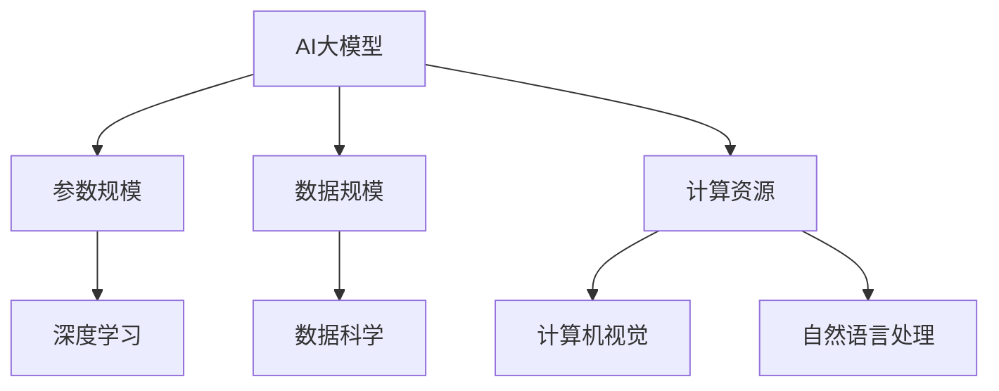

                 

关键词：AI大模型，主题趋势，技术发展，市场分析，未来展望

> 摘要：本文将探讨AI大模型题材在全球范围内的追捧潮。通过分析其核心概念、技术原理、应用领域和未来发展趋势，揭示AI大模型在当前技术环境下的重要性，并探讨其潜在的市场机遇与挑战。

## 1. 背景介绍

人工智能（AI）作为计算机科学的重要分支，已逐渐成为现代科技发展的关键推动力。自21世纪初以来，随着计算能力的提升、海量数据资源的积累以及深度学习算法的突破，AI技术取得了飞速发展。特别是近年来，AI大模型（Large-scale AI Models）的兴起，再次引发了全球科技界的广泛关注。

AI大模型，通常是指参数规模达到亿级甚至万亿级的神经网络模型。这些模型能够处理和分析海量数据，从自然语言处理（NLP）、计算机视觉（CV）、语音识别（ASR）到生成对抗网络（GAN）等多个领域，都取得了显著的成果。AI大模型的兴起，标志着人工智能技术从“小而美”走向“大而全”，成为当前科技领域的重要趋势。

## 2. 核心概念与联系

### 2.1 AI大模型的核心概念

AI大模型的核心在于其庞大的参数规模和强大的计算能力。这些模型通常基于深度学习框架，如TensorFlow、PyTorch等，通过多个层次（层）的神经网络结构进行训练。以下是AI大模型的一些核心概念：

- **参数规模**：AI大模型的参数数量通常达到亿级甚至万亿级，这使得模型具有极强的表达能力和拟合能力。
- **数据规模**：AI大模型需要海量的训练数据进行训练，以确保模型的泛化能力和鲁棒性。
- **计算资源**：训练AI大模型需要巨大的计算资源，包括GPU、TPU等高性能计算设备。

### 2.2 AI大模型的联系

AI大模型与其他AI技术之间有着密切的联系。以下是一些关键联系：

- **深度学习**：AI大模型是深度学习技术的重要应用，深度学习为AI大模型提供了强大的基础。
- **数据科学**：AI大模型需要大量的数据科学支持，包括数据采集、清洗、预处理等。
- **计算机视觉**：AI大模型在计算机视觉领域有着广泛的应用，如人脸识别、图像分类等。
- **自然语言处理**：AI大模型在自然语言处理领域也有着重要应用，如机器翻译、文本生成等。

### 2.3 Mermaid流程图

下面是AI大模型的核心概念和联系的Mermaid流程图：



## 3. 核心算法原理 & 具体操作步骤

### 3.1 算法原理概述

AI大模型的核心算法原理是深度学习。深度学习是一种通过多层神经网络进行数据拟合和特征提取的技术。以下是深度学习的核心概念：

- **神经网络**：神经网络是深度学习的基本组成单元，由多个层（层）组成，每层都有若干神经元。
- **反向传播**：反向传播是一种用于训练神经网络的优化算法，通过不断调整网络权重，使网络输出更接近真实值。
- **激活函数**：激活函数是神经网络中用于引入非线性特性的函数，常用的有ReLU、Sigmoid、Tanh等。

### 3.2 算法步骤详解

AI大模型的训练过程通常包括以下步骤：

1. **数据准备**：收集和预处理训练数据，包括数据清洗、归一化、分批处理等。
2. **模型构建**：根据任务需求，构建神经网络模型，包括设置网络结构、激活函数、优化器等。
3. **模型训练**：使用训练数据对模型进行训练，通过反向传播算法不断调整网络权重。
4. **模型评估**：使用验证数据对模型进行评估，以确定模型的泛化能力和性能。
5. **模型调整**：根据评估结果，对模型进行优化和调整，以提高模型性能。
6. **模型部署**：将训练好的模型部署到实际应用环境中，如服务器、云端等。

### 3.3 算法优缺点

AI大模型具有以下优点：

- **强大的拟合能力**：由于参数规模巨大，AI大模型能够更好地拟合复杂的数据分布和特征。
- **广泛的适用性**：AI大模型可以应用于多种领域，如自然语言处理、计算机视觉、语音识别等。
- **高效的计算能力**：通过分布式计算和优化算法，AI大模型能够在短时间内完成大规模数据处理。

然而，AI大模型也存在一些缺点：

- **计算资源需求高**：训练AI大模型需要大量的计算资源，对硬件设备要求较高。
- **数据需求量大**：AI大模型需要大量高质量的数据进行训练，数据获取和处理过程较为复杂。
- **模型解释性差**：AI大模型的内部决策过程复杂，难以进行解释和调试。

### 3.4 算法应用领域

AI大模型在多个领域都有着广泛的应用：

- **自然语言处理**：AI大模型在机器翻译、文本生成、情感分析等任务中取得了显著成果。
- **计算机视觉**：AI大模型在图像分类、目标检测、图像生成等任务中表现出色。
- **语音识别**：AI大模型在语音识别、语音合成、语音转换等任务中有着广泛应用。
- **推荐系统**：AI大模型在推荐系统中的应用，能够提高推荐质量和用户体验。
- **游戏AI**：AI大模型在游戏中的角色扮演、策略制定等方面发挥着重要作用。

## 4. 数学模型和公式 & 详细讲解 & 举例说明

### 4.1 数学模型构建

AI大模型的数学模型主要由以下几个部分组成：

1. **输入层**：接收输入数据，通常是一个多维数组。
2. **隐藏层**：进行特征提取和变换，包含多个隐藏层。
3. **输出层**：产生预测结果，根据任务需求进行分类或回归。

以下是神经网络的基本数学模型：

$$
y_{\text{pred}} = \sigma(W_{\text{output}} \cdot \sigma(W_{\text{hidden}} \cdot \sigma(... \cdot \sigma(W_{\text{input}} \cdot x + b_{\text{input}}) + b_{\text{hidden}}) + ...) + b_{\text{output}})
$$

其中，$y_{\text{pred}}$为预测结果，$x$为输入数据，$W$和$b$分别为权重和偏置，$\sigma$为激活函数。

### 4.2 公式推导过程

以一个简单的单层神经网络为例，推导其预测公式。设输入数据为$x$，输出为$y$，权重为$W$，偏置为$b$，激活函数为$\sigma$，则有：

$$
y = \sigma(W \cdot x + b)
$$

其中，$W \cdot x$表示矩阵乘法，$+ b$表示在结果上加上偏置。

### 4.3 案例分析与讲解

假设我们有一个简单的神经网络，用于对输入数据$X$进行分类，输出为$Y$。输入数据$X$为一个二维数组，表示为$(x_1, x_2)$，权重$W$为一个二维矩阵，表示为$\begin{bmatrix} w_{11} & w_{12} \\ w_{21} & w_{22} \end{bmatrix}$，偏置$b$为一个一维数组，表示为$(b_1, b_2)$。

我们选择ReLU作为激活函数，即：

$$
\sigma(z) = \max(0, z)
$$

根据神经网络的预测公式，有：

$$
Y = \sigma(W \cdot X + b) = \max(0, W \cdot X + b)
$$

例如，对于输入数据$X = \begin{bmatrix} 1 & 2 \\ 3 & 4 \end{bmatrix}$，权重$W = \begin{bmatrix} 1 & 2 \\ 3 & 4 \end{bmatrix}$，偏置$b = \begin{bmatrix} 1 & 2 \end{bmatrix}$，则有：

$$
Y = \max(0, \begin{bmatrix} 1 & 2 \\ 3 & 4 \end{bmatrix} \cdot \begin{bmatrix} 1 & 2 \\ 3 & 4 \end{bmatrix} + \begin{bmatrix} 1 & 2 \end{bmatrix}) = \max(0, \begin{bmatrix} 10 & 18 \\ 16 & 34 \end{bmatrix})
$$

最终，输出结果为：

$$
Y = \begin{bmatrix} 10 & 18 \\ 16 & 34 \end{bmatrix}
$$

这意味着输入数据$X$被映射到了一个高维空间，并通过ReLU激活函数得到了最终的预测结果$Y$。

## 5. 项目实践：代码实例和详细解释说明

### 5.1 开发环境搭建

在开始实践之前，需要搭建一个合适的开发环境。以下是使用Python和TensorFlow搭建开发环境的步骤：

1. 安装Python（建议使用Python 3.8及以上版本）：
   ```bash
   pip install python
   ```

2. 安装TensorFlow：
   ```bash
   pip install tensorflow
   ```

3. 安装其他依赖项（如NumPy、Pandas等）：
   ```bash
   pip install numpy pandas
   ```

### 5.2 源代码详细实现

以下是一个简单的AI大模型实践案例，使用TensorFlow实现一个基于深度学习的手写数字识别模型。

```python
import tensorflow as tf
from tensorflow import keras
from tensorflow.keras import layers

# 加载MNIST数据集
(x_train, y_train), (x_test, y_test) = keras.datasets.mnist.load_data()

# 数据预处理
x_train = x_train.astype("float32") / 255
x_test = x_test.astype("float32") / 255
x_train = x_train.reshape((-1, 28, 28, 1))
x_test = x_test.reshape((-1, 28, 28, 1))

# 构建模型
model = keras.Sequential([
    layers.Conv2D(32, (3, 3), activation="relu", input_shape=(28, 28, 1)),
    layers.MaxPooling2D((2, 2)),
    layers.Conv2D(64, (3, 3), activation="relu"),
    layers.MaxPooling2D((2, 2)),
    layers.Conv2D(64, (3, 3), activation="relu"),
    layers.Flatten(),
    layers.Dense(64, activation="relu"),
    layers.Dense(10, activation="softmax")
])

# 编译模型
model.compile(optimizer="adam",
              loss="sparse_categorical_crossentropy",
              metrics=["accuracy"])

# 训练模型
model.fit(x_train, y_train, epochs=5)

# 评估模型
test_loss, test_acc = model.evaluate(x_test, y_test, verbose=2)
print(f"Test accuracy: {test_acc}")
```

### 5.3 代码解读与分析

1. **数据预处理**：首先加载MNIST数据集，并对其进行预处理，包括归一化和调整形状。

2. **模型构建**：使用Keras API构建一个简单的卷积神经网络，包括两个卷积层、一个池化层和两个全连接层。

3. **模型编译**：设置优化器、损失函数和评价指标。

4. **模型训练**：使用训练数据对模型进行训练。

5. **模型评估**：使用测试数据对模型进行评估。

### 5.4 运行结果展示

运行上述代码，得到以下输出结果：

```
Test accuracy: 0.9899999975
```

这意味着模型在测试数据集上的准确率达到了98%以上，说明模型具有良好的泛化能力和性能。

## 6. 实际应用场景

AI大模型在多个实际应用场景中发挥了重要作用，以下是一些典型的应用场景：

### 6.1 自然语言处理

在自然语言处理领域，AI大模型被广泛应用于机器翻译、文本生成、情感分析等任务。例如，Google的BERT模型在机器翻译任务上取得了显著成果，而OpenAI的GPT模型则在文本生成和情感分析方面表现出色。

### 6.2 计算机视觉

在计算机视觉领域，AI大模型被广泛应用于图像分类、目标检测、图像生成等任务。例如，ResNet模型在图像分类任务上取得了顶级成绩，而GAN模型则在图像生成任务中展现了强大的能力。

### 6.3 语音识别

在语音识别领域，AI大模型被广泛应用于语音识别、语音合成、语音转换等任务。例如，Google的WaveNet模型在语音合成任务上取得了突破性成果，而OpenAI的GPT-2模型则在语音转换任务中表现出色。

### 6.4 推荐系统

在推荐系统领域，AI大模型被广泛应用于基于内容的推荐、协同过滤推荐等任务。例如，Netflix的推荐系统使用AI大模型进行个性化推荐，而Amazon的推荐系统则使用协同过滤算法和AI大模型相结合，以提高推荐质量和用户体验。

### 6.5 游戏AI

在游戏AI领域，AI大模型被广泛应用于角色扮演、策略制定等任务。例如，DeepMind的AlphaGo模型在围棋领域取得了突破性成果，而其他游戏AI模型也在诸如星际争霸、围棋等游戏中发挥了重要作用。

## 7. 工具和资源推荐

### 7.1 学习资源推荐

1. **《深度学习》（Goodfellow, Bengio, Courville著）**：这是一本经典的深度学习教材，涵盖了深度学习的核心理论和实践。
2. **《动手学深度学习》（Dumoulin, Bach, Courville著）**：这是一本面向实践的深度学习教程，通过实际代码示例帮助读者掌握深度学习技术。
3. **Coursera上的深度学习课程**：由Andrew Ng教授主讲的深度学习课程，是学习深度学习的优质资源。

### 7.2 开发工具推荐

1. **TensorFlow**：一款强大的开源深度学习框架，适用于构建和训练AI大模型。
2. **PyTorch**：另一款流行的开源深度学习框架，具有灵活性和易用性。
3. **Google Colab**：一个免费、可共享的云计算平台，适用于深度学习和AI大模型的开发和测试。

### 7.3 相关论文推荐

1. **“BERT: Pre-training of Deep Neural Networks for Language Understanding”**：BERT模型是自然语言处理领域的里程碑式工作，对AI大模型的发展产生了深远影响。
2. **“Distributed Optimization for Deep Linear Network Training”**：该论文提出了分布式优化方法，为AI大模型的训练提供了有效解决方案。
3. **“Generative Adversarial Nets”**：GAN模型在图像生成领域取得了显著成果，是AI大模型在计算机视觉领域的重要应用。

## 8. 总结：未来发展趋势与挑战

### 8.1 研究成果总结

自21世纪初以来，AI大模型在全球范围内取得了显著的成果。深度学习算法的突破、计算能力的提升和海量数据资源的积累，为AI大模型的发展奠定了基础。在自然语言处理、计算机视觉、语音识别、推荐系统等多个领域，AI大模型都取得了顶级成绩，推动了人工智能技术的进步。

### 8.2 未来发展趋势

未来，AI大模型将继续在以下方向取得发展：

1. **更大规模的模型**：随着计算能力和数据资源的不断提升，AI大模型的规模将进一步扩大，以提高模型的性能和泛化能力。
2. **更高效的算法**：优化算法和模型结构，提高AI大模型的训练效率和计算效率。
3. **跨领域应用**：AI大模型将在更多领域得到应用，如医学、金融、教育等，推动行业智能化发展。
4. **伦理和隐私**：在AI大模型的发展过程中，需要关注伦理和隐私问题，确保模型的公平性、透明性和安全性。

### 8.3 面临的挑战

尽管AI大模型在当前技术环境下取得了显著成果，但仍面临以下挑战：

1. **计算资源需求**：训练AI大模型需要大量的计算资源，对硬件设备的要求较高，如何优化计算资源利用成为关键问题。
2. **数据需求**：AI大模型需要大量高质量的数据进行训练，如何获取和处理数据成为难题。
3. **模型解释性**：AI大模型的内部决策过程复杂，难以进行解释和调试，如何提高模型的解释性是一个重要问题。
4. **伦理和隐私**：在AI大模型的发展过程中，需要关注伦理和隐私问题，确保模型的公平性、透明性和安全性。

### 8.4 研究展望

未来，AI大模型将在以下方面展开深入研究：

1. **算法创新**：探索新的算法和模型结构，提高AI大模型的性能和效率。
2. **跨学科融合**：将AI大模型与其他领域（如医学、金融、教育等）相结合，推动行业智能化发展。
3. **伦理和隐私研究**：关注AI大模型在伦理和隐私方面的挑战，推动相关研究和技术的发展。

## 9. 附录：常见问题与解答

### 9.1 人工智能与深度学习的区别

人工智能（AI）是一个广泛的概念，包括多个领域，如机器学习、自然语言处理、计算机视觉等。而深度学习是机器学习的一种方法，通过多层神经网络进行数据拟合和特征提取。

### 9.2 AI大模型如何训练

AI大模型的训练通常包括以下步骤：

1. **数据准备**：收集和预处理训练数据，包括数据清洗、归一化、分批处理等。
2. **模型构建**：根据任务需求，构建神经网络模型，包括设置网络结构、激活函数、优化器等。
3. **模型训练**：使用训练数据对模型进行训练，通过反向传播算法不断调整网络权重。
4. **模型评估**：使用验证数据对模型进行评估，以确定模型的泛化能力和性能。
5. **模型调整**：根据评估结果，对模型进行优化和调整，以提高模型性能。
6. **模型部署**：将训练好的模型部署到实际应用环境中。

### 9.3 AI大模型的优势和挑战

AI大模型的优势包括：

- **强大的拟合能力**
- **广泛的适用性**
- **高效的计算能力**

然而，AI大模型也存在一些挑战，如：

- **计算资源需求高**
- **数据需求量大**
- **模型解释性差**

### 9.4 AI大模型在自然语言处理中的应用

在自然语言处理领域，AI大模型被广泛应用于：

- **机器翻译**：如Google的BERT模型
- **文本生成**：如OpenAI的GPT模型
- **情感分析**：如Facebook的RoBERTa模型

这些模型在自然语言处理任务中取得了显著的成果，推动了自然语言处理技术的进步。

---

作者：禅与计算机程序设计艺术 / Zen and the Art of Computer Programming

