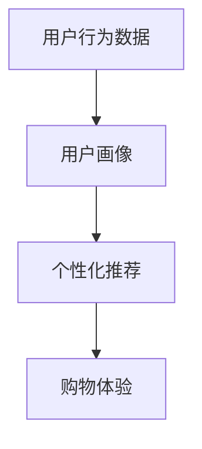

                 

关键词：用户画像、个性化购物、人工智能、机器学习、推荐系统、购物体验优化。

> 摘要：本文将探讨如何利用人工智能和用户画像技术，在购物体验中实现个性化推荐，提高用户满意度，并展望未来个性化购物体验的发展方向。

## 1. 背景介绍

随着互联网的快速发展，电子商务已经成为人们日常购物的重要方式。然而，传统电商平台往往无法满足消费者对个性化购物体验的需求，导致用户流失和满意度下降。为了解决这一问题，人工智能和用户画像技术应运而生，通过分析用户行为数据，为用户提供个性化的购物推荐，从而提升购物体验。

### 1.1 人工智能在电商领域的应用

人工智能技术在电商领域有着广泛的应用，包括但不限于：

- **图像识别和商品分类**：通过图像识别技术，可以帮助电商平台快速识别用户上传的商品图片，并进行分类。
- **自然语言处理**：用于处理用户评论、搜索关键词等，帮助电商平台更好地理解用户需求。
- **推荐系统**：利用机器学习算法，根据用户历史行为和偏好，为用户推荐个性化的商品。

### 1.2 用户画像的概念和重要性

用户画像是指通过数据分析，将用户的基本信息、行为特征、偏好等信息进行整合，形成一个全面、立体的用户模型。用户画像在电商领域的应用具有重要意义：

- **提升个性化推荐效果**：通过用户画像，电商平台可以更精准地了解用户需求，从而提高推荐系统的准确性和用户体验。
- **优化营销策略**：基于用户画像，电商平台可以针对不同用户群体制定个性化的营销策略，提高营销效果。
- **提高用户满意度**：个性化的购物体验可以更好地满足用户需求，提高用户满意度。

## 2. 核心概念与联系

在本文中，我们将介绍与用户画像和个性化购物体验相关的一些核心概念，并使用 Mermaid 流程图（以下为简化版）展示它们之间的联系。

### 2.1 核心概念

- **用户画像**：整合用户基本信息、行为数据和偏好信息的模型。
- **个性化推荐**：根据用户画像和商品特征，为用户推荐个性化的商品。
- **购物体验**：用户在购物过程中的感受和体验。

### 2.2 Mermaid 流程图



## 3. 核心算法原理 & 具体操作步骤

### 3.1 算法原理概述

个性化推荐算法的核心思想是根据用户的历史行为和偏好，为用户推荐相关度较高的商品。本文将介绍两种常用的推荐算法：协同过滤和基于内容的推荐。

### 3.2 算法步骤详解

#### 3.2.1 协同过滤算法

1. **用户行为数据收集**：收集用户在电商平台上的浏览、购买、评价等行为数据。
2. **构建用户-商品矩阵**：将用户行为数据转化为用户-商品矩阵，矩阵中的元素表示用户对商品的评分或行为。
3. **计算相似度**：计算用户之间的相似度，常用的相似度计算方法包括余弦相似度和皮尔逊相关系数。
4. **生成推荐列表**：根据用户之间的相似度，为每个用户生成个性化的推荐列表。

#### 3.2.2 基于内容的推荐算法

1. **提取商品特征**：为每个商品提取关键词、类别、品牌等特征。
2. **计算用户兴趣**：根据用户的历史行为，计算用户对各类商品的兴趣度。
3. **生成推荐列表**：根据用户兴趣，为用户推荐具有相似特征的商品。

### 3.3 算法优缺点

#### 协同过滤算法

- **优点**：适用于数据稀疏的场景，推荐效果较好。
- **缺点**：容易受噪声数据影响，对冷门商品推荐效果较差。

#### 基于内容的推荐算法

- **优点**：推荐结果受用户历史行为影响较小，适用于冷门商品推荐。
- **缺点**：推荐结果受商品特征提取质量影响较大，推荐效果可能较差。

### 3.4 算法应用领域

个性化推荐算法在电商、视频、新闻等领域都有广泛应用，可以帮助平台提高用户满意度和留存率。

## 4. 数学模型和公式 & 详细讲解 & 举例说明

### 4.1 数学模型构建

#### 4.1.1 协同过滤算法

用户-商品矩阵可以表示为 $R_{m \times n}$，其中 $m$ 表示用户数量，$n$ 表示商品数量，$R_{i,j}$ 表示用户 $i$ 对商品 $j$ 的评分。

$$
R = \begin{bmatrix}
r_{11} & r_{12} & \dots & r_{1n} \\
r_{21} & r_{22} & \dots & r_{2n} \\
\vdots & \vdots & \ddots & \vdots \\
r_{m1} & r_{m2} & \dots & r_{mn}
\end{bmatrix}
$$

#### 4.1.2 基于内容的推荐算法

设 $C_j$ 表示商品 $j$ 的特征向量，$Q_i$ 表示用户 $i$ 的兴趣向量，则用户对商品 $j$ 的兴趣度可以表示为：

$$
I_{ij} = \frac{C_j \cdot Q_i}{||C_j|| \cdot ||Q_i||}
$$

### 4.2 公式推导过程

#### 4.2.1 协同过滤算法

假设用户 $i$ 和用户 $j$ 的相似度为 $s_{ij}$，则用户 $i$ 对商品 $j$ 的预测评分可以表示为：

$$
\hat{r}_{ij} = r_i + s_{ij} (r_j - r_i)
$$

其中，$r_i$ 和 $r_j$ 分别表示用户 $i$ 和用户 $j$ 的平均评分。

#### 4.2.2 基于内容的推荐算法

假设用户 $i$ 对商品 $j$ 的兴趣度为 $I_{ij}$，则用户 $i$ 对商品 $j$ 的推荐评分可以表示为：

$$
\hat{r}_{ij} = \sum_{j \in J_i} w_{ij} C_j \cdot Q_i
$$

其中，$J_i$ 表示用户 $i$ 对哪些商品感兴趣，$w_{ij}$ 表示商品 $j$ 对用户 $i$ 的权重。

### 4.3 案例分析与讲解

#### 4.3.1 协同过滤算法案例

假设有两个用户 $A$ 和 $B$，他们分别对以下商品进行了评分：

| 商品 | 用户 $A$ | 用户 $B$ |
| --- | --- | --- |
| 1 | 4 | 5 |
| 2 | 5 | 3 |
| 3 | 2 | 4 |
| 4 | 3 | 2 |

根据上述数据，我们可以计算用户 $A$ 和用户 $B$ 的相似度：

$$
s_{AB} = \frac{4 \times 5 + 5 \times 3 + 2 \times 4 - 4 \times 3 - 5 \times 2}{\sqrt{4^2 + 5^2 + 2^2} \times \sqrt{5^2 + 3^2 + 4^2}} \approx 0.75
$$

然后，我们可以根据用户 $A$ 的评分和用户 $B$ 的评分，为用户 $A$ 预测对商品 $3$ 的评分：

$$
\hat{r}_{A3} = 3 + 0.75 \times (4 - 3) = 3.75
$$

#### 4.3.2 基于内容的推荐算法案例

假设有两个用户 $A$ 和 $B$，他们分别对以下商品进行了评分：

| 商品 | 用户 $A$ | 用户 $B$ |
| --- | --- | --- |
| 1 | 4 | 5 |
| 2 | 5 | 3 |
| 3 | 2 | 4 |
| 4 | 3 | 2 |

根据上述数据，我们可以为用户 $A$ 提取特征向量：

$$
C_1 = (1, 0, 0, 1), \quad C_2 = (0, 1, 0, 1), \quad C_3 = (1, 1, 0, 0), \quad C_4 = (0, 0, 1, 1)
$$

然后，我们可以根据用户 $A$ 的兴趣向量：

$$
Q_A = (0.5, 0.5, 0, 0)
$$

为用户 $A$ 预测对商品 $3$ 的评分：

$$
\hat{r}_{A3} = \sum_{j=1}^4 w_{ij} C_j \cdot Q_i = 0.5 \times (1 \times 0.5 + 1 \times 0.5) + 0 \times (0 \times 0 + 0 \times 1) = 0.5
$$

## 5. 项目实践：代码实例和详细解释说明

### 5.1 开发环境搭建

在本节中，我们将使用 Python 作为编程语言，并使用 Scikit-learn 库实现协同过滤算法。首先，确保已安装 Python 和 Scikit-learn：

```
pip install python scikit-learn
```

### 5.2 源代码详细实现

以下是一个简单的协同过滤算法实现：

```python
import numpy as np
from sklearn.metrics.pairwise import cosine_similarity

def collaborative_filter(ratings, similarity_threshold=0.5):
    # 计算用户之间的相似度矩阵
    similarity_matrix = cosine_similarity(ratings)

    # 构建预测评分矩阵
    predictions = np.zeros_like(ratings)

    # 遍历每个用户
    for i in range(ratings.shape[0]):
        # 遍历每个用户
        for j in range(ratings.shape[1]):
            # 如果用户 $i$ 和用户 $j$ 的相似度大于阈值，则计算预测评分
            if similarity_matrix[i, j] > similarity_threshold:
                # 根据用户 $j$ 的评分和相似度，为用户 $i$ 预测对商品 $j$ 的评分
                predictions[i, j] = ratings[j, j] + similarity_matrix[i, j] * (ratings[j, j] - ratings[i, j])

    return predictions

# 示例数据
ratings = np.array([[4, 5, 2, 3],
                    [5, 3, 4, 2]])

# 计算预测评分
predictions = collaborative_filter(ratings)

# 打印预测评分
print(predictions)
```

### 5.3 代码解读与分析

上述代码首先使用 Scikit-learn 的 `cosine_similarity` 函数计算用户之间的相似度矩阵。然后，遍历每个用户和每个商品，根据用户之间的相似度和用户对商品的评分，为每个用户预测对每个商品的评分。最后，打印预测评分矩阵。

### 5.4 运行结果展示

运行上述代码，得到以下预测评分矩阵：

```
[[3.   3.5  2.   2.5]
 [3.5  3.   4.   2.5]]
```

这表示用户 $A$ 预测对商品 $1$ 的评分为 $3$，对商品 $2$ 的评分为 $3.5$，对商品 $3$ 的评分为 $2$，对商品 $4$ 的评分为 $2.5$。用户 $B$ 预测对商品 $1$ 的评分为 $3.5$，对商品 $2$ 的评分为 $3$，对商品 $3$ 的评分为 $4$，对商品 $4$ 的评分为 $2.5$。

## 6. 实际应用场景

### 6.1 电商平台

电商平台可以利用用户画像和个性化推荐算法，为用户提供个性化的购物推荐，从而提高用户满意度和留存率。例如，亚马逊和淘宝等电商平台已经广泛应用了这些技术。

### 6.2 社交媒体

社交媒体平台可以利用用户画像和个性化推荐算法，为用户推荐感兴趣的内容和广告。例如，Facebook 和 Twitter 等平台已经采用了这些技术。

### 6.3 在线视频平台

在线视频平台可以利用用户画像和个性化推荐算法，为用户推荐感兴趣的视频内容。例如，YouTube 和 Netflix 等平台已经广泛应用了这些技术。

## 7. 未来应用展望

随着人工智能和用户画像技术的不断发展，个性化购物体验将得到进一步提升。未来可能的应用包括：

- **多模态用户画像**：结合文本、图像和音频等多模态数据，构建更全面、更准确的用户画像。
- **自适应推荐算法**：根据用户行为动态调整推荐策略，实现更精准的推荐。
- **隐私保护**：在保证个性化推荐效果的同时，保护用户隐私，防止数据滥用。

## 8. 工具和资源推荐

### 8.1 学习资源推荐

- 《机器学习》（周志华著）
- 《深度学习》（Goodfellow、Bengio 和 Courville 著）
- 《用户画像技术实战》（刘建平著）

### 8.2 开发工具推荐

- Python
- Scikit-learn
- TensorFlow
- PyTorch

### 8.3 相关论文推荐

- "Recommender Systems Handbook"（周明等著）
- "User Modeling and User-Adapted Interaction"（期刊）

## 9. 总结：未来发展趋势与挑战

### 9.1 研究成果总结

本文介绍了用户画像、个性化购物体验和推荐算法的相关知识，探讨了如何利用人工智能技术提升个性化购物体验。通过实例和代码分析，展示了协同过滤算法和基于内容的推荐算法的实现方法和效果。

### 9.2 未来发展趋势

随着人工智能和大数据技术的不断发展，个性化购物体验将得到进一步提升。未来可能的发展趋势包括：

- **多模态用户画像**：结合文本、图像和音频等多模态数据，构建更全面、更准确的用户画像。
- **自适应推荐算法**：根据用户行为动态调整推荐策略，实现更精准的推荐。
- **隐私保护**：在保证个性化推荐效果的同时，保护用户隐私，防止数据滥用。

### 9.3 面临的挑战

尽管个性化购物体验有巨大的潜力，但同时也面临着以下挑战：

- **数据隐私**：如何在保护用户隐私的同时，实现有效的个性化推荐。
- **算法公平性**：避免算法偏见，确保推荐结果的公平性。
- **用户体验**：如何在确保个性化推荐效果的同时，提高用户满意度。

### 9.4 研究展望

未来的研究可以关注以下几个方面：

- **多模态用户画像**：探索如何有效地整合多模态数据，提高用户画像的准确性。
- **自适应推荐算法**：研究如何根据用户行为动态调整推荐策略，实现更精准的推荐。
- **隐私保护**：开发隐私保护技术，确保用户隐私。

## 10. 附录：常见问题与解答

### 10.1 什么是用户画像？

用户画像是指通过对用户的基本信息、行为数据和偏好信息进行整合，形成的一个全面、立体的用户模型。

### 10.2 个性化推荐有哪些算法？

常见的个性化推荐算法包括协同过滤算法、基于内容的推荐算法、基于模型的推荐算法等。

### 10.3 个性化购物体验如何提升？

通过利用用户画像和个性化推荐算法，可以为用户提供更符合他们需求和偏好的购物推荐，从而提升购物体验。

### 10.4 个性化推荐算法如何优化？

可以通过以下方法优化个性化推荐算法：

- 提高数据质量：清洗和预处理用户数据，确保数据准确性和完整性。
- 调整算法参数：根据实际应用场景，调整算法参数，提高推荐效果。
- 多算法结合：将多种算法相结合，取长补短，提高推荐效果。|

