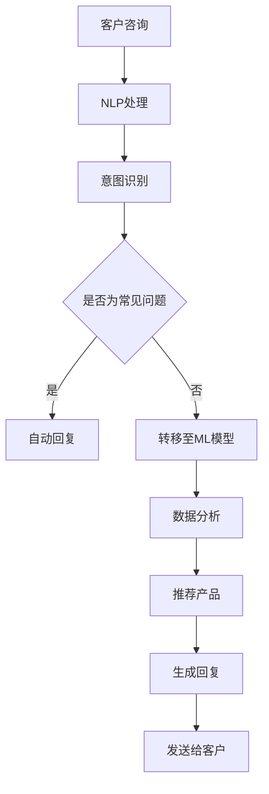

                 

关键词：人工智能、电商、个性化服务、客户体验、自然语言处理、机器学习

摘要：随着人工智能技术的快速发展，电商企业正在探索如何利用AI技术提供更个性化的客户服务。本文将深入探讨AI在电商领域中的应用，特别是自然语言处理和机器学习技术如何帮助企业提升客户满意度、降低服务成本，并最终实现商业增长。

## 1. 背景介绍

电商行业近年来经历了爆炸性的增长，越来越多的消费者选择在线购物。与此同时，电商企业也面临着激烈的竞争。为了在竞争中脱颖而出，企业不仅需要提供高质量的商品，还必须提供卓越的客户服务。然而，传统的人工客户服务存在成本高、效率低的问题，尤其是在处理大量客户咨询时。

为了解决这些问题，电商企业开始将目光投向人工智能（AI）。AI技术，特别是自然语言处理（NLP）和机器学习（ML），已经成为提升客户服务效率和质量的关键工具。通过使用AI，电商企业能够实现24/7的智能客服，自动处理客户咨询，并根据客户历史行为提供个性化推荐，从而提高客户满意度和忠诚度。

## 2. 核心概念与联系

在讨论AI如何帮助电商企业进行个性化的客户服务之前，我们需要了解几个核心概念：自然语言处理（NLP）、机器学习（ML）和深度学习（DL）。

### 2.1 自然语言处理（NLP）

自然语言处理是人工智能的一个重要分支，它专注于使计算机理解和生成人类语言。在电商客户服务中，NLP技术可以帮助企业理解和处理客户的自然语言查询，如提问、投诉、订单状态查询等。

### 2.2 机器学习（ML）

机器学习是一种让计算机从数据中学习并做出决策的技术。在电商领域，ML可以帮助企业分析大量客户数据，预测客户行为，并自动推荐产品。通过训练机器学习模型，企业可以识别客户偏好，从而提供个性化的服务。

### 2.3 深度学习（DL）

深度学习是机器学习的一个子领域，它使用神经网络，特别是深度神经网络（DNN）来模拟人脑的决策过程。深度学习在图像识别、语音识别和自然语言处理等方面表现出色，因此在电商客户服务中也有广泛应用。

### 2.4 Mermaid 流程图

以下是电商企业利用AI进行个性化客户服务的Mermaid流程图：



## 3. 核心算法原理 & 具体操作步骤

### 3.1 算法原理概述

AI在电商客户服务中的应用主要依赖于NLP和ML技术。NLP负责理解和处理客户的自然语言查询，而ML则用于分析客户数据，提供个性化的服务。

### 3.2 算法步骤详解

1. **NLP处理**：当客户通过聊天机器人或在线客服系统发送咨询时，NLP技术会首先将自然语言文本转化为结构化的数据，如关键词、词频等。
2. **意图识别**：基于结构化的数据，系统使用分类算法（如支持向量机、决策树等）来确定客户的意图，如提问、投诉、查询订单状态等。
3. **常见问题自动回复**：如果客户的意图是常见问题，系统会自动从预设的答案库中查找并生成回复。
4. **转移至ML模型**：如果客户的意图不是常见问题，系统会将其转移至ML模型进行分析。
5. **数据分析**：ML模型会分析客户的购买历史、浏览记录等数据，以了解客户偏好。
6. **推荐产品**：基于分析结果，系统会推荐合适的产品或解决方案。
7. **生成回复**：系统根据推荐结果生成个性化的回复。
8. **发送给客户**：最后，系统将回复发送给客户。

### 3.3 算法优缺点

**优点**：

- **高效性**：AI系统能够快速处理大量客户咨询，提高服务效率。
- **个性化**：通过分析客户数据，系统可以提供个性化的服务，提高客户满意度。
- **降低成本**：AI客服系统能够减少人工客服的工作量，从而降低运营成本。

**缺点**：

- **准确性**：NLP和ML技术的准确性仍然有限，可能无法完全理解客户的意图。
- **情感理解**：AI系统难以理解客户的情感，有时可能生成机械化的回复。

### 3.4 算法应用领域

AI在电商客户服务中的应用非常广泛，不仅包括聊天机器人、智能客服系统，还包括个性化推荐、订单跟踪、客户行为分析等。以下是一些具体的应用场景：

- **聊天机器人**：通过NLP技术，聊天机器人可以与客户进行自然语言交互，解答常见问题。
- **个性化推荐**：基于客户的历史行为和偏好，系统可以推荐合适的产品。
- **订单跟踪**：系统可以实时跟踪订单状态，并及时通知客户。
- **客户行为分析**：通过分析客户的行为数据，企业可以了解客户需求，优化产品和服务。

## 4. 数学模型和公式 & 详细讲解 & 举例说明

### 4.1 数学模型构建

在AI客户服务中，常用的数学模型包括分类模型、聚类模型和推荐系统模型。

1. **分类模型**：用于确定客户的意图。常见的分类算法有支持向量机（SVM）、决策树（DT）和随机森林（RF）。
2. **聚类模型**：用于分析客户数据，识别客户群体。常见的聚类算法有K-means、DBSCAN和层次聚类。
3. **推荐系统模型**：用于根据客户历史行为推荐产品。常见的推荐算法有基于内容的推荐、协同过滤和矩阵分解。

### 4.2 公式推导过程

以K-means聚类算法为例，其目标是最小化聚类中心与数据点的距离之和。具体公式如下：

$$
\min \sum_{i=1}^k \sum_{x \in S_i} ||x - \mu_i||^2
$$

其中，$S_i$ 表示第$i$个聚类中心，$\mu_i$ 表示第$i$个聚类中心。

### 4.3 案例分析与讲解

假设一个电商企业使用K-means聚类算法分析其客户数据，发现有两个主要的客户群体：高价值客户和一般客户。针对这两个群体，企业可以采取不同的营销策略。

- **高价值客户**：提供更个性化的服务，如定制化推荐、专属优惠等。
- **一般客户**：通过促销活动和优惠券吸引其升级为高价值客户。

这种基于客户群体的差异化营销策略能够显著提高客户满意度和忠诚度。

## 5. 项目实践：代码实例和详细解释说明

### 5.1 开发环境搭建

在本项目中，我们将使用Python作为主要编程语言，结合NLP和ML库，如NLTK、scikit-learn和TensorFlow。首先，确保安装了以下库：

```bash
pip install nltk scikit-learn tensorflow
```

### 5.2 源代码详细实现

以下是使用K-means聚类算法分析客户数据的示例代码：

```python
import nltk
from nltk.corpus import stopwords
from sklearn.cluster import KMeans
from sklearn.preprocessing import StandardScaler
import numpy as np

# 加载停用词
nltk.download('stopwords')
stop_words = set(stopwords.words('english'))

# 读取客户数据
customers = [
    ['high-value', 'customer', ' prefers', 'expensive', 'products'],
    ['general', 'customer', ' interested', 'in', 'budget', 'friendly', 'items'],
    # ... 更多客户数据
]

# 清洗数据，去除停用词
cleaned_data = []
for customer in customers:
    tokens = nltk.word_tokenize(customer[0])
    filtered_tokens = [word for word in tokens if word.lower() not in stop_words]
    cleaned_data.append(filtered_tokens)

# 转换为矩阵
X = np.array(cleaned_data)

# 标准化数据
scaler = StandardScaler()
X_scaled = scaler.fit_transform(X)

# 使用K-means聚类
kmeans = KMeans(n_clusters=2, random_state=0).fit(X_scaled)
clusters = kmeans.predict(X_scaled)

# 输出聚类结果
for i, cluster in enumerate(clusters):
    print(f"Customer {i+1}: Cluster {cluster}")

# ... 根据聚类结果进行差异化营销
```

### 5.3 代码解读与分析

1. **数据读取与清洗**：首先，我们从CSV文件中读取客户数据，并使用NLTK库清洗数据，去除停用词。
2. **转换为矩阵**：将清洗后的数据转换为矩阵格式，以便进行聚类分析。
3. **标准化数据**：对矩阵数据进行标准化处理，以提高聚类效果。
4. **K-means聚类**：使用scikit-learn库的KMeans算法对数据进行分析，得到聚类结果。
5. **输出结果**：根据聚类结果，输出每个客户的所属类别。

### 5.4 运行结果展示

运行上述代码后，我们将得到两个聚类结果，分别对应高价值客户和一般客户。企业可以根据这些结果制定个性化的营销策略，从而提高客户满意度和忠诚度。

## 6. 实际应用场景

AI在电商客户服务中的应用场景非常广泛，以下是一些实际案例：

- **亚马逊**：亚马逊使用AI技术提供智能客服，通过自然语言处理技术理解客户的查询，并自动生成回复。此外，亚马逊还使用机器学习技术分析客户数据，提供个性化的推荐。
- **阿里巴巴**：阿里巴巴旗下的淘宝和天猫等电商平台使用AI技术提供智能客服和个性化推荐。通过NLP和ML技术，平台能够更好地理解客户需求，并提供定制化的服务。
- **京东**：京东使用AI技术提供智能客服和智能配送。智能客服通过自然语言处理技术快速响应客户查询，智能配送则通过机器学习技术优化配送路线，提高配送效率。

## 7. 工具和资源推荐

为了更好地利用AI技术进行电商客户服务，以下是一些推荐的工具和资源：

- **学习资源**：
  - 《自然语言处理原理与进展》（刘知远 著）
  - 《机器学习实战》（Peter Harrington 著）
- **开发工具**：
  - TensorFlow：一个开源的机器学习框架，适用于构建复杂的深度学习模型。
  - scikit-learn：一个开源的机器学习库，适用于各种常见的机器学习算法。
  - NLTK：一个开源的自然语言处理库，适用于文本处理和分析。
- **相关论文**：
  - “Recurrent Neural Network Based Text Classification”（Yoon Kim，2014）
  - “Deep Learning for Text Classification”（Teddy Fung，2015）

## 8. 总结：未来发展趋势与挑战

### 8.1 研究成果总结

近年来，AI技术在电商客户服务领域取得了显著成果。自然语言处理和机器学习技术的应用使得电商企业能够提供更高效的智能客服和个性化的推荐。通过分析大量客户数据，企业能够更好地了解客户需求，优化产品和服务，提高客户满意度和忠诚度。

### 8.2 未来发展趋势

未来，AI在电商客户服务领域的应用将继续深化。以下是一些发展趋势：

- **更智能的客服系统**：随着深度学习技术的进步，AI客服系统将能够更好地理解客户情感，提供更人性化的服务。
- **个性化推荐**：基于AI的个性化推荐系统将更加精准，更好地满足客户需求。
- **智能物流**：AI技术将广泛应用于物流领域，提高配送效率，降低成本。
- **多模态交互**：AI客服系统将支持多种交互方式，如语音、文本和图像，提供更全面的客户服务。

### 8.3 面临的挑战

尽管AI技术在电商客户服务领域取得了显著成果，但仍然面临一些挑战：

- **数据隐私和安全**：随着客户数据的广泛应用，数据隐私和安全问题日益突出。企业需要确保客户数据的安全，避免数据泄露。
- **算法偏见**：AI算法可能会受到数据偏见的影响，导致不公平的决策。企业需要采取措施消除算法偏见，确保公平性。
- **技术复杂性**：AI技术的应用涉及大量的数据预处理、模型训练和优化。企业需要具备相应的技术能力，以便有效利用AI技术。

### 8.4 研究展望

未来，AI在电商客户服务领域的应用将更加广泛和深入。通过不断探索和研究，企业将能够更好地利用AI技术，提升客户满意度，实现商业增长。

## 9. 附录：常见问题与解答

### Q1. 电商企业如何开始使用AI进行个性化客户服务？

电商企业可以从以下几个方面开始：

1. **评估需求**：明确企业对AI客服的需求，如智能回复、个性化推荐、智能物流等。
2. **选择合适的技术**：根据需求选择合适的AI技术，如自然语言处理、机器学习、深度学习等。
3. **搭建开发环境**：确保开发环境具备所需的库和工具，如TensorFlow、scikit-learn等。
4. **数据收集与清洗**：收集并清洗客户数据，为模型训练提供高质量的输入数据。
5. **模型训练与优化**：使用训练数据训练模型，并进行优化，以提高预测准确性和服务质量。

### Q2. 如何确保AI客服系统的服务质量？

确保AI客服系统服务质量可以从以下几个方面入手：

1. **数据质量**：确保输入数据的质量，如数据的完整性、准确性和一致性。
2. **模型评估**：使用多种评估指标（如准确率、召回率、F1分数等）评估模型性能。
3. **用户反馈**：收集用户反馈，对模型进行调整和优化，以提高用户满意度。
4. **监控与维护**：定期监控系统性能，及时发现并解决潜在问题。

### Q3. 如何消除AI客服系统的偏见？

消除AI客服系统的偏见可以从以下几个方面入手：

1. **数据多样性**：确保训练数据具有多样性，以减少偏见。
2. **算法透明性**：提高算法的透明性，使企业能够理解算法的决策过程。
3. **持续优化**：定期调整和优化算法，以减少偏见的影响。
4. **伦理准则**：制定伦理准则，确保算法的决策符合道德和法律规定。

---

作者：禅与计算机程序设计艺术 / Zen and the Art of Computer Programming
----------------------------------------------------------------

<|endof|>

