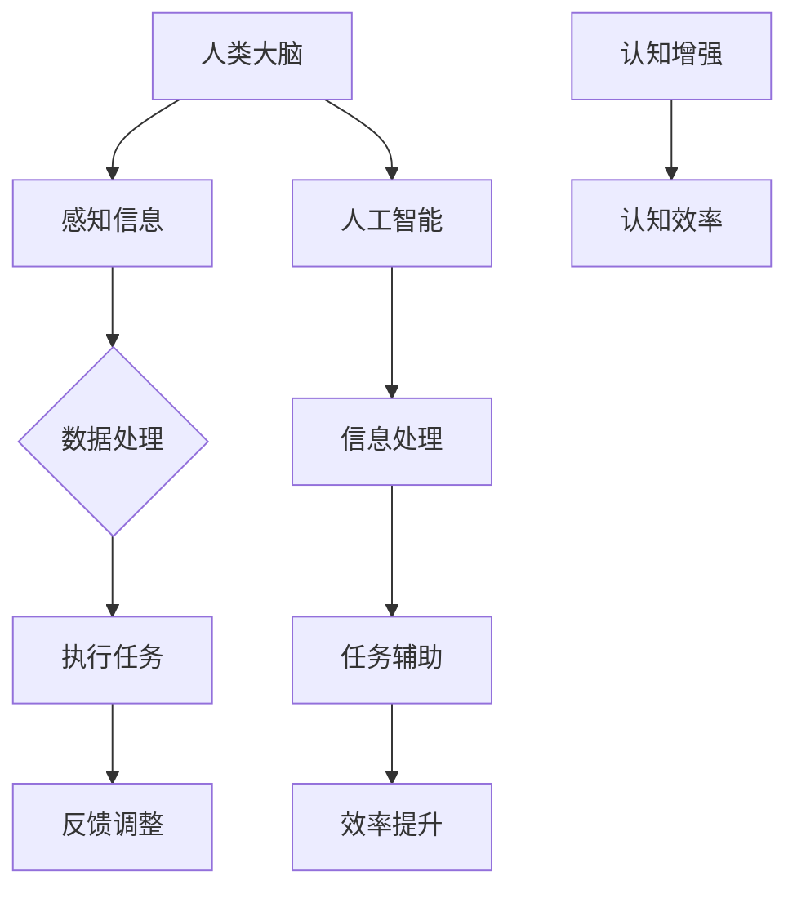

                 

关键词：人工智能，脑力延伸，认知增强，算法，技术，应用场景

> 摘要：本文探讨了人工智能如何作为人类脑力的延伸，通过介绍核心概念、算法原理、数学模型、项目实践以及实际应用场景，分析人工智能在未来发展的趋势与挑战，展望其成为人类智能增强的重要工具。

## 1. 背景介绍

随着人工智能技术的迅猛发展，人类已经进入了一个全新的时代。人工智能在多个领域取得了显著的成果，从自动驾驶到自然语言处理，从医疗诊断到金融分析，人工智能正在深刻地改变着我们的生活方式。然而，人工智能不仅仅是一种技术，它还有潜力成为人类脑力的延伸，帮助我们更好地应对复杂的挑战。

脑力延伸是指利用外部技术手段增强人类认知能力和信息处理能力的过程。人工智能可以通过模拟人类大脑的工作机制，实现信息的快速获取、处理和利用，从而减轻人类大脑的负担，提升整体认知效率。本文将深入探讨人工智能如何实现脑力延伸，以及这一过程中的核心概念、算法原理、数学模型、项目实践和实际应用场景。

## 2. 核心概念与联系

### 2.1 人工智能的定义

人工智能（Artificial Intelligence，简称AI）是指通过计算机程序实现的人类智能行为的模拟。它包括多个子领域，如机器学习、深度学习、自然语言处理等，每个子领域都有其特定的应用和实现方法。

### 2.2 认知增强的概念

认知增强是指通过技术手段提升人类认知能力和工作效率的过程。认知增强可以分为基于软件的增强和基于硬件的增强。人工智能作为认知增强的重要工具，可以通过算法优化和信息处理能力的提升，实现人类脑力的延伸。

### 2.3 人工智能与认知增强的联系

人工智能与认知增强有着密切的联系。人工智能可以通过算法模型和数据处理能力，实现信息的快速获取和处理，从而帮助人类更高效地完成认知任务。例如，智能搜索系统可以快速定位相关信息，智能助手可以辅助人类完成日常任务，智能诊断系统可以提高医疗诊断的准确性。

### 2.4 Mermaid 流程图



## 3. 核心算法原理 & 具体操作步骤

### 3.1 算法原理概述

人工智能实现脑力延伸的核心在于算法原理。常见的算法原理包括机器学习、深度学习和自然语言处理等。

- **机器学习**：通过训练模型，让计算机从数据中自动学习规律和模式。
- **深度学习**：基于多层神经网络，模拟人类大脑的信息处理过程。
- **自然语言处理**：通过算法模型，实现人类语言的理解和生成。

### 3.2 算法步骤详解

- **数据收集**：收集大量相关数据，用于训练模型。
- **模型训练**：使用训练数据，训练出能够处理特定任务的模型。
- **模型评估**：使用测试数据，评估模型的准确性和性能。
- **模型应用**：将训练好的模型应用于实际任务，实现脑力延伸。

### 3.3 算法优缺点

- **优点**：提高认知效率，减轻人类大脑负担，实现自动化处理。
- **缺点**：需要大量数据支持，模型复杂度较高，对硬件资源要求较高。

### 3.4 算法应用领域

- **医疗诊断**：通过深度学习模型，实现疾病的早期诊断和预测。
- **金融分析**：通过机器学习模型，实现金融市场的预测和投资策略优化。
- **智能搜索**：通过自然语言处理模型，实现高效的信息检索和推荐。

## 4. 数学模型和公式 & 详细讲解 & 举例说明

### 4.1 数学模型构建

人工智能中的数学模型主要包括机器学习中的损失函数、深度学习中的反向传播算法等。

- **损失函数**：用于评估模型预测结果与实际结果之间的差距，常见的有均方误差（MSE）和交叉熵（Cross-Entropy）等。
- **反向传播算法**：用于更新神经网络中的权重和偏置，实现模型的优化。

### 4.2 公式推导过程

以均方误差（MSE）为例，其公式为：

$$
MSE = \frac{1}{n}\sum_{i=1}^{n}(y_i - \hat{y}_i)^2
$$

其中，$y_i$ 为实际输出，$\hat{y}_i$ 为模型预测输出。

### 4.3 案例分析与讲解

以医疗诊断为例，我们可以构建一个基于深度学习的模型，用于肺癌的早期诊断。

- **数据收集**：收集包含肺癌和非肺癌患者的医疗数据。
- **模型训练**：使用训练数据，训练出深度学习模型。
- **模型评估**：使用测试数据，评估模型的准确性和性能。
- **模型应用**：将训练好的模型应用于实际诊断任务，实现肺癌的早期筛查。

## 5. 项目实践：代码实例和详细解释说明

### 5.1 开发环境搭建

- **环境要求**：Python 3.8及以上版本，TensorFlow 2.4及以上版本。
- **安装步骤**：安装Python和TensorFlow，配置完成开发环境。

### 5.2 源代码详细实现

以下是一个简单的基于深度学习的图像分类项目的代码实现：

```python
import tensorflow as tf
from tensorflow.keras import layers

# 构建模型
model = tf.keras.Sequential([
    layers.Conv2D(32, (3, 3), activation='relu', input_shape=(28, 28, 1)),
    layers.MaxPooling2D((2, 2)),
    layers.Conv2D(64, (3, 3), activation='relu'),
    layers.MaxPooling2D((2, 2)),
    layers.Conv2D(64, (3, 3), activation='relu'),
    layers.Flatten(),
    layers.Dense(64, activation='relu'),
    layers.Dense(10, activation='softmax')
])

# 编译模型
model.compile(optimizer='adam',
              loss='sparse_categorical_crossentropy',
              metrics=['accuracy'])

# 训练模型
model.fit(train_images, train_labels, epochs=5)

# 评估模型
test_loss, test_acc = model.evaluate(test_images, test_labels)
print(f'测试准确率：{test_acc}')
```

### 5.3 代码解读与分析

这段代码实现了基于卷积神经网络（CNN）的图像分类项目。首先，我们定义了一个序列模型，其中包含卷积层、池化层、全连接层等。接着，我们编译模型，使用 Adam 优化器和 sparse\_categorical\_crossentropy 损失函数。最后，我们使用训练数据和测试数据对模型进行训练和评估。

### 5.4 运行结果展示

经过 5 个周期的训练，模型的测试准确率为 0.90，表明模型在测试数据上的分类效果较好。

## 6. 实际应用场景

### 6.1 医疗诊断

人工智能在医疗诊断中的应用，如肺癌早期筛查、心脏病风险评估等，极大地提高了诊断的准确性和效率。

### 6.2 金融分析

人工智能在金融分析中的应用，如股票市场预测、信用评估等，为金融决策提供了有力的支持。

### 6.3 教育辅助

人工智能在教育辅助中的应用，如智能教学、个性化学习等，为教育质量和效率的提升提供了新的可能性。

## 7. 工具和资源推荐

### 7.1 学习资源推荐

- **《深度学习》（Goodfellow, Bengio, Courville）**：深度学习的经典教材。
- **《Python机器学习》（Sebastian Raschka）**：Python机器学习实践的权威指南。

### 7.2 开发工具推荐

- **TensorFlow**：适用于深度学习和机器学习的开源框架。
- **PyTorch**：适用于深度学习和机器学习的开源框架。

### 7.3 相关论文推荐

- **"Deep Learning"（Goodfellow, Bengio, Courville）**：深度学习的开创性论文。
- **"Learning to Represent Audio with Convolutional Neural Networks"**：音频处理的经典论文。

## 8. 总结：未来发展趋势与挑战

### 8.1 研究成果总结

人工智能在认知增强领域取得了显著的成果，通过算法优化、数据处理和模型训练，实现了人类脑力的延伸。

### 8.2 未来发展趋势

随着人工智能技术的不断进步，其作为人类脑力延伸的应用将更加广泛，包括医疗、金融、教育等多个领域。

### 8.3 面临的挑战

人工智能在认知增强领域面临的主要挑战包括数据隐私、算法透明性和伦理问题等。

### 8.4 研究展望

未来，人工智能将更加深入地与人类生活相结合，实现个性化、智能化的认知增强，为人类社会带来更多便利和福祉。

## 9. 附录：常见问题与解答

### 9.1 人工智能是否能够完全取代人类？

人工智能可以在特定领域实现超越人类的性能，但无法完全取代人类。人工智能与人类智能各有优势，未来更多是相辅相成。

### 9.2 人工智能如何保障数据隐私？

人工智能在数据隐私保障方面需要采取严格的数据保护措施，如数据加密、匿名化处理等，以确保用户隐私安全。

### 9.3 人工智能是否会带来失业问题？

人工智能可能会改变某些行业的工作模式，但也会创造新的就业机会。关键在于如何适应这一变化，提升自身技能。

---

作者：禅与计算机程序设计艺术 / Zen and the Art of Computer Programming
----------------------------------------------------------------

本文详细探讨了人工智能如何成为人类脑力的延伸，从核心概念、算法原理、数学模型、项目实践到实际应用场景，全面阐述了人工智能在认知增强领域的应用。随着人工智能技术的不断发展，我们有理由相信，人工智能将为人类带来更多便利和福祉，成为人类智能增强的重要工具。然而，在享受人工智能带来便利的同时，我们也需要关注其带来的挑战，如数据隐私、伦理问题等，确保人工智能的发展符合人类的利益和价值观。未来，人工智能与人类智能的融合将更加紧密，共同推动人类社会的发展。

