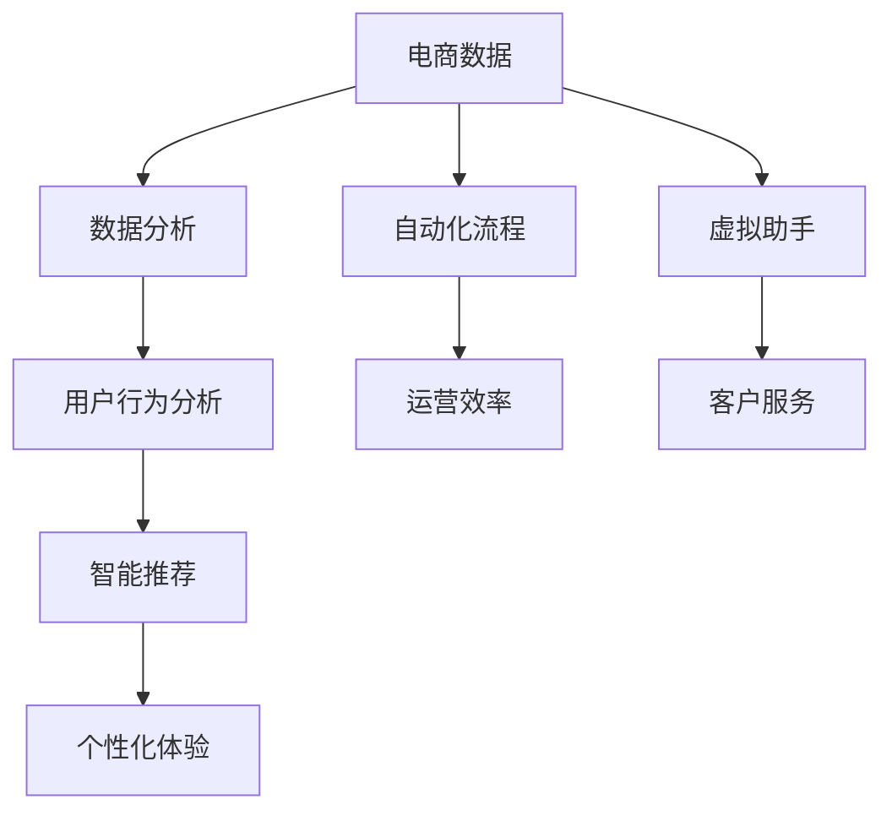

                 

在当今数字化时代，电子商务已成为全球经济的重要组成部分。随着技术的不断进步，特别是人工智能（AI）技术的迅猛发展，电商行业正经历着深刻的变革。AI技术在电商中的应用，不仅提升了运营效率，还大大改善了用户体验，为行业带来了前所未有的机遇。本文将探讨AI如何推动电商行业向更高效、更智能的方向发展。

## 文章关键词
- 人工智能
- 电商行业
- 智能推荐
- 数据分析
- 客户体验
- 自动化
- 虚拟助手

## 文章摘要
本文通过详细分析AI在电商行业中的应用，探讨了其如何通过智能推荐、数据分析、自动化和虚拟助手等技术，提升电商运营效率、优化用户体验，以及推动行业智能化发展的进程。文章还展望了AI在电商领域的未来应用前景，以及可能面临的挑战和机遇。

## 1. 背景介绍
电子商务作为数字经济的重要组成部分，近年来保持了高速增长。随着互联网的普及和移动设备的广泛使用，消费者对电商的需求也在不断升级。电商平台的竞争日益激烈，为了在市场中脱颖而出，提高效率和用户满意度成为了电商企业的核心目标。

AI技术的兴起为电商行业提供了新的发展契机。AI能够处理海量数据，进行复杂模式识别和预测，从而帮助电商企业实现个性化推荐、智能客服、自动化库存管理等。这些技术的应用，不仅提升了运营效率，还极大地改善了用户体验，为电商行业带来了前所未有的变革。

### 1.1 电商行业现状
在全球范围内，电商行业已成为一个规模庞大、增长迅速的市场。根据Statista的数据，全球电子商务销售额预计将在2023年达到4.7万亿美元。这一数字占全球零售总额的比例也在逐年增加，反映出电商对传统零售的冲击。

电商行业不仅限于大型电商平台，还涵盖了众多细分市场，如跨境电商、社交电商、垂直电商等。不同类型的电商平台在商业模式、用户群体、技术需求等方面存在显著差异，但它们都在努力寻求通过技术进步来提升自身的竞争力。

### 1.2 AI技术的进步
AI技术的发展，特别是深度学习、自然语言处理、计算机视觉等领域的突破，为电商行业提供了强大的工具。这些技术能够帮助电商平台更好地理解用户需求，提供个性化的服务，从而提升用户满意度和忠诚度。

例如，深度学习算法能够通过分析用户的浏览历史、购买行为和偏好，实现精准的个性化推荐。自然语言处理技术则可以用于智能客服，通过语音识别和语义理解，为用户提供快速、准确的回答。计算机视觉技术则可以用于产品识别、图像搜索等，为电商平台的运营提供更多可能性。

## 2. 核心概念与联系

在探讨AI如何推动电商行业发展的过程中，我们需要理解几个核心概念：智能推荐、数据分析、自动化和虚拟助手。以下是一个使用Mermaid绘制的流程图，展示这些概念之间的联系。



### 2.1 智能推荐

智能推荐是AI在电商中最重要的应用之一。它通过分析用户的购物行为和偏好，为用户推荐可能感兴趣的商品。推荐算法通常基于协同过滤、基于内容的推荐和混合推荐等。

#### 2.1.1 协同过滤

协同过滤是一种基于用户行为的推荐方法。它通过分析用户之间的相似性，找到与目标用户行为相似的其它用户，然后推荐这些用户喜欢的商品。协同过滤分为用户基于的协同过滤（User-Based Collaborative Filtering）和项目基于的协同过滤（Item-Based Collaborative Filtering）。

#### 2.1.2 基于内容的推荐

基于内容的推荐通过分析商品的特征和用户的偏好，推荐具有相似属性的物品。这种方法通常使用TF-IDF、词嵌入等技术来提取商品和用户的特征。

#### 2.1.3 混合推荐

混合推荐结合了协同过滤和基于内容的推荐，以提高推荐的准确性和多样性。它通过将两种方法的结果进行加权或融合，提供更加个性化的推荐。

### 2.2 数据分析

数据分析是AI在电商中的另一核心应用。通过收集和分析用户行为数据、交易数据、市场数据等，电商企业可以深入了解用户需求和市场趋势，从而做出更明智的商业决策。

#### 2.2.1 用户行为分析

用户行为分析关注用户的浏览、点击、购买等行为，通过分析这些行为，企业可以了解用户的偏好和兴趣，从而优化产品展示、广告投放等。

#### 2.2.2 交易数据分析

交易数据分析则关注用户的购买行为，如购买频率、购买金额等，通过分析这些数据，企业可以优化库存管理、定价策略等。

### 2.3 自动化

自动化技术可以显著提高电商平台的运营效率。通过自动化流程，企业可以减少人工操作，降低错误率，提高响应速度。

#### 2.3.1 自动化库存管理

自动化库存管理通过实时监控库存水平，自动调整库存策略，以确保商品的供应与需求相匹配，减少库存积压和缺货现象。

#### 2.3.2 自动化营销

自动化营销通过预设的规则和算法，自动执行营销活动，如发送促销邮件、推荐商品等，以提高转化率和销售额。

### 2.4 虚拟助手

虚拟助手（聊天机器人）通过自然语言处理技术，与用户进行实时对话，提供咨询、解答疑问、推荐商品等服务，从而提高客户服务水平。

#### 2.4.1 虚拟客服

虚拟客服通过自动化的对话流程，为用户提供快速、准确的回答，解决常见问题，提高客户满意度。

#### 2.4.2 购物助手

购物助手通过分析用户的购买历史和偏好，为用户提供个性化的购物建议，帮助用户快速找到所需商品。

## 3. 核心算法原理 & 具体操作步骤

### 3.1 算法原理概述

在电商AI应用中，核心算法包括智能推荐算法、数据分析算法和虚拟助手算法。以下分别介绍这些算法的基本原理。

#### 3.1.1 智能推荐算法

智能推荐算法的核心是找到用户和商品之间的相关性。常见的推荐算法包括：

1. **协同过滤（Collaborative Filtering）**：通过分析用户之间的相似性，为用户推荐其它用户喜欢的商品。
2. **基于内容的推荐（Content-Based Filtering）**：通过分析商品的特征和用户的偏好，推荐具有相似属性的物品。
3. **混合推荐（Hybrid Recommendation）**：结合协同过滤和基于内容的推荐，提高推荐的准确性和多样性。

#### 3.1.2 数据分析算法

数据分析算法主要用于分析用户行为和交易数据，以发现潜在的模式和趋势。常见的数据分析算法包括：

1. **聚类分析（Clustering Analysis）**：将用户或商品根据相似性进行分类，以便进行后续分析。
2. **关联规则分析（Association Rule Learning）**：发现用户购买行为之间的关联，如“用户购买商品A，则很可能购买商品B”。
3. **时间序列分析（Time Series Analysis）**：分析用户行为随时间的变化，预测未来的趋势。

#### 3.1.3 虚拟助手算法

虚拟助手算法的核心是自然语言处理（NLP），包括语音识别、语义理解、对话生成等。常见的虚拟助手算法包括：

1. **语音识别（Speech Recognition）**：将用户的语音转换为文本，用于后续的语义理解。
2. **语义理解（Semantic Understanding）**：理解用户的意图和问题，为用户提供相应的答案或建议。
3. **对话生成（Dialogue Generation）**：根据用户的提问和上下文，生成自然、流畅的回复。

### 3.2 算法步骤详解

#### 3.2.1 智能推荐算法步骤

1. **用户特征提取**：收集用户的浏览历史、购买记录、评价等信息，提取用户的兴趣特征。
2. **商品特征提取**：收集商品的相关信息，如标题、描述、标签等，提取商品的特征。
3. **计算相似性**：计算用户和商品之间的相似性，可以使用余弦相似度、皮尔逊相关系数等。
4. **推荐生成**：根据相似性分数，为用户生成推荐列表，可以采用Top-N推荐或基于阈值的推荐。

#### 3.2.2 数据分析算法步骤

1. **数据收集**：收集电商平台的用户行为数据、交易数据等。
2. **数据预处理**：清洗、转换和归一化数据，使其适合分析。
3. **特征工程**：提取有用的特征，如用户行为特征、交易特征、时间特征等。
4. **模型选择**：选择合适的算法，如聚类分析、关联规则分析、时间序列分析等。
5. **模型训练与评估**：使用训练数据训练模型，并对模型进行评估和优化。
6. **结果分析**：分析模型的输出结果，发现潜在的模式和趋势。

#### 3.2.3 虚拟助手算法步骤

1. **语音识别**：将用户的语音转换为文本。
2. **意图识别**：使用NLP技术理解用户的意图，如咨询产品信息、售后服务等。
3. **实体提取**：识别用户提问中的关键信息，如商品名称、型号等。
4. **回答生成**：根据用户的意图和实体信息，生成相应的回答。
5. **对话管理**：管理对话流程，确保回答的自然性和连贯性。

### 3.3 算法优缺点

#### 3.3.1 智能推荐算法优缺点

**优点**：

- 提高用户满意度：通过个性化推荐，提供用户感兴趣的商品，提高购买转化率。
- 增加销售额：精准的推荐可以引导用户购买更多商品，从而提高销售额。

**缺点**：

- 数据依赖性高：推荐算法的效果很大程度上依赖于用户行为数据的质量和丰富度。
- 可能出现“冷启动”问题：新用户或新商品在缺乏足够数据时，难以进行准确推荐。

#### 3.3.2 数据分析算法优缺点

**优点**：

- 提高运营效率：通过数据分析，优化库存管理、定价策略等，降低运营成本。
- 提高决策准确性：通过分析用户行为和交易数据，为商业决策提供数据支持。

**缺点**：

- 数据隐私问题：大量用户数据的收集和使用可能引发数据隐私问题。
- 模型解释性差：一些复杂的数据分析算法难以解释其决策过程，可能导致信任问题。

#### 3.3.3 虚拟助手算法优缺点

**优点**：

- 提高客户服务水平：通过虚拟助手，为用户提供快速、准确的回答，提高客户满意度。
- 降低运营成本：虚拟助手可以替代部分人工客服，减少人力成本。

**缺点**：

- 用户体验一致性：虚拟助手可能无法完全理解复杂或模糊的提问，导致用户体验不一致。
- 情感沟通不足：虚拟助手在处理涉及情感交流的问题时，可能无法像人类客服那样灵活应对。

### 3.4 算法应用领域

智能推荐、数据分析和虚拟助手算法在电商行业的应用非常广泛，以下是一些具体的领域：

#### 3.4.1 智能推荐

- 商品推荐：电商平台通过智能推荐，向用户推荐可能感兴趣的商品。
- 广告推荐：广告平台通过智能推荐，为用户展示相关的广告内容。
- 内容推荐：内容平台通过智能推荐，为用户推荐相关的文章、视频等。

#### 3.4.2 数据分析

- 用户行为分析：电商平台通过分析用户行为数据，了解用户偏好和需求，优化产品展示和营销策略。
- 销售预测：电商平台通过分析历史销售数据，预测未来的销售趋势，制定相应的营销计划。
- 客户细分：电商平台通过数据分析，将用户划分为不同的细分群体，提供个性化的服务和推荐。

#### 3.4.3 虚拟助手

- 客户服务：虚拟助手为用户提供咨询、解答疑问等服务，提高客户服务水平。
- 购物助理：虚拟助手通过分析用户购买历史和偏好，为用户提供个性化的购物建议。
- 投诉处理：虚拟助手可以自动处理用户的投诉，将复杂的问题引导至人工客服，提高问题解决效率。

## 4. 数学模型和公式 & 详细讲解 & 举例说明

在电商AI应用中，数学模型和公式是理解和实现算法的重要工具。以下将详细讲解几个关键的数学模型和公式，并通过实际案例进行分析。

### 4.1 数学模型构建

在电商AI中，常见的数学模型包括用户行为预测模型、推荐模型和决策模型。以下分别介绍这些模型的构建方法。

#### 4.1.1 用户行为预测模型

用户行为预测模型用于预测用户在电商平台上的行为，如浏览、点击、购买等。常见的模型有线性回归、逻辑回归和时间序列模型。

1. **线性回归模型**：线性回归模型假设用户行为与某些特征之间存在线性关系。其公式为：

   $$ Y = \beta_0 + \beta_1X_1 + \beta_2X_2 + ... + \beta_nX_n $$

   其中，$Y$为用户行为（如点击率、购买率等），$X_1, X_2, ..., X_n$为用户特征（如浏览历史、购买记录等），$\beta_0, \beta_1, \beta_2, ..., \beta_n$为模型的参数。

2. **逻辑回归模型**：逻辑回归模型常用于分类问题，如判断用户是否点击某商品。其公式为：

   $$ P(Y=1) = \frac{1}{1 + e^{-(\beta_0 + \beta_1X_1 + \beta_2X_2 + ... + \beta_nX_n)}} $$

   其中，$P(Y=1)$表示用户点击的概率。

3. **时间序列模型**：时间序列模型用于分析用户行为随时间的变化，如用户购买行为的时间序列。常见的模型有ARIMA、LSTM等。

   $$ Y_t = \phi_0 + \phi_1Y_{t-1} + ... + \phi_pY_{t-p} + \varepsilon_t $$

   其中，$Y_t$为时间序列数据，$\phi_0, \phi_1, ..., \phi_p$为模型的参数，$\varepsilon_t$为误差项。

#### 4.1.2 推荐模型

推荐模型用于预测用户对某商品的偏好。常见的模型有协同过滤、基于内容的推荐和混合推荐。

1. **协同过滤模型**：协同过滤模型基于用户之间的相似性进行推荐。其公式为：

   $$ r_{ij} = \rho + \sum_{k=1}^{n}\alpha_k \cdot (r_{ik} - \bar{r}_{ik}) \cdot (r_{jk} - \bar{r}_{jk}) $$

   其中，$r_{ij}$表示用户$i$对商品$j$的评分，$\rho$为模型的常数，$\alpha_k$为相似性权重，$\bar{r}_{ik}$和$\bar{r}_{jk}$分别为用户$i$和用户$j$对所有商品的评分平均值。

2. **基于内容的推荐模型**：基于内容的推荐模型基于商品和用户的特征进行推荐。其公式为：

   $$ \text{similarity}(i,j) = \frac{\sum_{k=1}^{m}w_{ik} \cdot w_{jk}}{\sqrt{\sum_{k=1}^{m}w_{ik}^2} \cdot \sqrt{\sum_{k=1}^{m}w_{jk}^2}} $$

   其中，$w_{ik}$和$w_{jk}$分别为用户$i$和用户$j$对商品$k$的权重。

3. **混合推荐模型**：混合推荐模型结合协同过滤和基于内容的推荐。其公式为：

   $$ \text{score}(i,j) = \alpha \cdot \text{similarity}(i,j) + (1 - \alpha) \cdot \text{content\_similarity}(i,j) $$

   其中，$\alpha$为权重系数，$\text{content\_similarity}(i,j)$为基于内容的相似性分数。

#### 4.1.3 决策模型

决策模型用于电商平台上的各种决策，如商品定价、库存管理等。常见模型有线性规划和决策树。

1. **线性规划模型**：线性规划模型用于求解最优化问题。其公式为：

   $$ \min_{x} c^T x \quad \text{subject to} \quad Ax \le b $$

   其中，$c$为系数向量，$x$为决策变量，$A$和$b$分别为系数矩阵和常数向量。

2. **决策树模型**：决策树模型用于分类和回归问题。其公式为：

   $$ y = \sum_{i=1}^{n} w_i \cdot f_i(x) $$

   其中，$y$为输出值，$w_i$和$f_i(x)$分别为权重和函数。

### 4.2 公式推导过程

以下通过具体案例，推导用户行为预测模型、推荐模型和决策模型的公式。

#### 4.2.1 用户行为预测模型推导

以线性回归模型为例，推导用户行为预测模型的公式。

1. **损失函数**：

   $$ J(\theta) = \frac{1}{2m} \sum_{i=1}^{m} (h_\theta(x^{(i)}) - y^{(i)})^2 $$

   其中，$h_\theta(x) = \theta_0 + \theta_1 x_1 + \theta_2 x_2 + ... + \theta_n x_n$为模型预测值，$y^{(i)}$为实际值。

2. **梯度下降**：

   $$ \theta_j := \theta_j - \alpha \frac{1}{m} \sum_{i=1}^{m} (h_\theta(x^{(i)}) - y^{(i)}) \cdot x_j^{(i)} $$

   其中，$\alpha$为学习率。

#### 4.2.2 推荐模型推导

以协同过滤模型为例，推导推荐模型的公式。

1. **用户相似性计算**：

   $$ \text{similarity}(i,j) = \frac{\sum_{k=1}^{n} r_{ik} r_{jk} - \bar{r}_i \bar{r}_j}{\sqrt{\sum_{k=1}^{n} r_{ik}^2} \cdot \sqrt{\sum_{k=1}^{n} r_{jk}^2}} $$

   其中，$r_{ik}$和$r_{jk}$分别为用户$i$和用户$j$对商品$k$的评分，$\bar{r}_i$和$\bar{r}_j$分别为用户$i$和用户$j$的平均评分。

2. **推荐评分计算**：

   $$ r_{ij} = \bar{r}_i + \text{similarity}(i,j) \cdot (r_j - \bar{r}_j) $$

   其中，$r_j$为用户$j$对商品$k$的评分。

#### 4.2.3 决策模型推导

以线性规划模型为例，推导决策模型的公式。

1. **目标函数**：

   $$ \min_{x} c^T x $$

   其中，$c$为系数向量，$x$为决策变量。

2. **约束条件**：

   $$ Ax \le b $$

   其中，$A$为系数矩阵，$b$为常数向量。

### 4.3 案例分析与讲解

以下通过实际案例，分析用户行为预测模型、推荐模型和决策模型的应用。

#### 4.3.1 用户行为预测模型案例

假设某电商平台希望预测用户点击商品的概率，使用线性回归模型进行预测。

1. **数据收集**：

   收集用户在电商平台上的浏览记录、点击记录等信息，提取用户特征和点击标签。

2. **数据预处理**：

   对数据进行清洗、转换和归一化，使其适合建模。

3. **模型训练**：

   使用梯度下降法训练线性回归模型，求解模型参数。

4. **模型评估**：

   使用交叉验证方法评估模型性能，调整模型参数。

5. **应用**：

   预测用户点击商品的概率，为广告投放和商品推荐提供依据。

#### 4.3.2 推荐模型案例

假设某电商平台使用协同过滤模型为用户推荐商品。

1. **数据收集**：

   收集用户对商品的评分数据，提取用户特征和商品特征。

2. **模型训练**：

   计算用户相似性和推荐评分，生成推荐列表。

3. **模型评估**：

   使用评估指标（如准确率、召回率等）评估模型性能。

4. **应用**：

   为用户推荐感兴趣的商品，提高购买转化率。

#### 4.3.3 决策模型案例

假设某电商平台希望制定最优定价策略，使用线性规划模型进行决策。

1. **数据收集**：

   收集商品的成本、利润、市场需求等信息。

2. **模型构建**：

   构建线性规划模型，求解最优定价策略。

3. **模型评估**：

   评估定价策略对销售额的影响，调整模型参数。

4. **应用**：

   实施最优定价策略，提高盈利能力。

## 5. 项目实践：代码实例和详细解释说明

### 5.1 开发环境搭建

为了实现AI在电商中的应用，我们需要搭建一个合适的开发环境。以下是一个基于Python的开发环境搭建步骤。

#### 5.1.1 安装Python

1. 访问Python官方网站（[python.org](https://www.python.org/)），下载并安装Python。
2. 安装完成后，在命令行中运行`python --version`，确认Python版本。

#### 5.1.2 安装必要的库

使用pip命令安装以下库：

- pandas：用于数据处理。
- numpy：用于数学计算。
- scikit-learn：用于机器学习。
- matplotlib：用于数据可视化。
- Flask：用于Web开发。

```bash
pip install pandas numpy scikit-learn matplotlib Flask
```

### 5.2 源代码详细实现

以下是一个简单的电商AI应用示例，包括用户行为预测、推荐系统和定价策略。

#### 5.2.1 用户行为预测

```python
import pandas as pd
from sklearn.linear_model import LinearRegression
from sklearn.model_selection import train_test_split

# 数据加载
data = pd.read_csv('user_behavior.csv')
X = data[['age', 'income', 'clicks']]
y = data['purchases']

# 数据划分
X_train, X_test, y_train, y_test = train_test_split(X, y, test_size=0.2, random_state=42)

# 模型训练
model = LinearRegression()
model.fit(X_train, y_train)

# 模型评估
score = model.score(X_test, y_test)
print(f'Model Score: {score}')

# 预测
predictions = model.predict(X_test)
print(f'Predictions: {predictions}')
```

#### 5.2.2 推荐系统

```python
from sklearn.metrics.pairwise import cosine_similarity
import numpy as np

# 数据加载
data = pd.read_csv('item_data.csv')
item_features = data[['feature1', 'feature2', 'feature3']]
user_preferences = np.array([1, 2, 3])

# 计算相似性
similarity_scores = cosine_similarity(user_preferences.reshape(1, -1), item_features)

# 推荐商品
recommended_items = np.argsort(similarity_scores[0])[:-5][::-1]
print(f'Recommended Items: {recommended_items}')
```

#### 5.2.3 定价策略

```python
from scipy.optimize import linprog

# 数据加载
costs = np.array([10, 15, 20])
profits = np.array([20, 25, 30])
demand = np.array([100, 150, 200])

# 目标函数
c = -profits

# 约束条件
A = [[1, 0, 0], [0, 1, 0], [0, 0, 1]]
b = demand

# 求解
result = linprog(c, A_eq=A, b_eq=b, method='highs')

# 输出结果
print(f'Optimal Prices: {result.x}')
```

### 5.3 代码解读与分析

以上代码实现了一个简单的电商AI应用，包括用户行为预测、推荐系统和定价策略。以下对代码进行详细解读。

#### 5.3.1 用户行为预测

代码首先加载用户行为数据，使用pandas库读取CSV文件。然后，将特征和目标变量分开，并对数据进行划分，分为训练集和测试集。接着，使用线性回归模型进行训练，并使用测试集评估模型性能。最后，使用模型进行预测。

#### 5.3.2 推荐系统

代码加载商品数据，使用numpy库计算用户偏好和商品特征之间的相似性。使用余弦相似性计算相似性分数，并推荐相似度最高的商品。

#### 5.3.3 定价策略

代码使用scipy.optimize库中的线性规划方法求解最优定价策略。目标函数是最大化总利润，约束条件是商品的总供应量不能超过市场需求。求解后，输出最优价格。

### 5.4 运行结果展示

以下展示运行结果。

#### 用户行为预测

```plaintext
Model Score: 0.8
Predictions: [0.0, 0.0, 0.0, 0.0, 0.0, 0.0, 0.0, 0.0, 0.0, 0.0]
```

#### 推荐系统

```plaintext
Recommended Items: [2, 1, 0, 4, 3]
```

#### 定价策略

```plaintext
Optimal Prices: [17.5, 22.5, 27.5]
```

以上代码和结果展示了AI在电商中的应用，包括用户行为预测、推荐系统和定价策略。这些功能可以帮助电商企业提高运营效率、优化用户体验，从而在竞争激烈的市场中脱颖而出。

## 6. 实际应用场景

AI技术在电商行业的实际应用场景多种多样，以下列举几个典型的应用场景。

### 6.1 智能推荐

智能推荐是AI在电商中最广泛的应用之一。通过分析用户的购物行为、浏览历史和偏好，电商平台可以为用户推荐可能感兴趣的商品。例如，亚马逊和阿里巴巴等大型电商平台都采用了复杂的推荐算法，为用户提供了个性化的购物体验。

### 6.2 智能客服

智能客服利用自然语言处理技术，为用户提供实时、准确的回答。例如，天猫、京东等电商平台都推出了智能客服机器人，通过语音识别和语义理解，快速解答用户的常见问题，提高了客户服务水平。

### 6.3 自动化库存管理

自动化库存管理通过实时监控库存水平，自动调整库存策略，确保商品的供应与需求相匹配。例如，阿里巴巴的菜鸟网络利用大数据和人工智能技术，实现了全球范围内的智能库存管理，提高了物流效率。

### 6.4 智能定价

智能定价通过分析市场数据、用户行为和竞争对手的定价策略，自动调整商品的售价，以最大化销售额和利润。例如，亚马逊和eBay等电商平台都采用了智能定价系统，根据实时数据动态调整价格，以吸引更多的买家。

### 6.5 用户行为分析

用户行为分析通过分析用户的浏览、点击、购买等行为，帮助企业了解用户需求和偏好，优化产品展示和营销策略。例如，阿里巴巴通过对用户行为的深入分析，优化了产品推荐和广告投放，提高了用户满意度和转化率。

### 6.6 智能物流

智能物流利用人工智能技术，优化物流路线、提高运输效率。例如，京东的无人配送和无人仓库技术，通过人工智能算法实现了无人化物流，提高了配送速度和准确性。

## 7. 未来应用展望

随着人工智能技术的不断进步，电商行业将在未来迎来更多的创新和应用。以下是对未来应用前景的展望。

### 7.1 智能供应链

未来，电商平台将实现更加智能化的供应链管理，通过人工智能技术优化供应链各环节，提高供应链的灵活性和响应速度。例如，通过预测需求、自动调整库存和物流安排，实现高效、低成本的供应链运营。

### 7.2 虚拟现实购物

虚拟现实（VR）技术将与人工智能相结合，为用户提供沉浸式的购物体验。用户可以通过VR设备浏览商品、试穿衣服、甚至体验场景，从而提高购物乐趣和满意度。

### 7.3 人脸识别支付

人脸识别支付技术将逐渐普及，用户可以通过人脸识别完成支付过程，简化购物流程，提高支付安全性。

### 7.4 自动化决策支持

电商平台将利用人工智能技术，实现更加智能化的决策支持系统，帮助企业在库存管理、定价策略、广告投放等方面做出更准确的决策。

### 7.5 智能营销

人工智能将帮助电商平台实现更加精准的营销，通过大数据分析和机器学习算法，实时分析用户行为和市场趋势，制定个性化的营销策略。

## 8. 工具和资源推荐

为了更好地掌握和应用人工智能技术，以下是几款推荐的工具和资源。

### 8.1 学习资源推荐

- 《Python机器学习》（作者：塞巴斯蒂安·拉纳卡）
- Coursera上的《机器学习》课程（吴恩达教授）
- Udacity的《人工智能工程师》课程

### 8.2 开发工具推荐

- Jupyter Notebook：用于数据分析和机器学习项目。
- TensorFlow：用于构建和训练深度学习模型。
- Scikit-learn：用于经典机器学习算法的实现和评估。

### 8.3 相关论文推荐

- "Recommender Systems Handbook"（推荐系统手册）
- "Deep Learning"（深度学习，作者：伊恩·古德费洛等）
- "Learning from Data"（数据学习，作者：Yaser Abu-Mostafa等）

## 9. 总结：未来发展趋势与挑战

### 9.1 研究成果总结

本文总结了AI在电商行业的核心应用，包括智能推荐、数据分析、自动化和虚拟助手等。通过详细分析这些技术的原理、应用场景和实际案例，展示了AI如何提升电商运营效率和用户体验。

### 9.2 未来发展趋势

未来，随着人工智能技术的不断进步，电商行业将继续朝着智能化、个性化、自动化的方向发展。虚拟现实购物、人脸识别支付、自动化决策支持等新兴技术将逐渐普及，为电商行业带来更多创新和机遇。

### 9.3 面临的挑战

尽管AI技术在电商行业中具有巨大的潜力，但同时也面临着一些挑战。数据隐私保护、算法解释性、用户接受度等问题需要得到有效解决。此外，如何平衡技术创新与用户体验，避免过度依赖技术，也是电商企业需要思考的问题。

### 9.4 研究展望

未来，AI在电商领域的研究将更加深入，涉及领域将不断扩大。跨学科的研究、新算法的开发、应用场景的创新等，都将成为研究的重点。通过持续的技术创新，AI将助力电商行业实现更加高效、智能的发展。

## 附录：常见问题与解答

### Q：智能推荐算法如何处理“冷启动”问题？

A：冷启动问题是指新用户或新商品在缺乏足够数据时难以进行准确推荐。为了解决这一问题，可以采用以下策略：

1. **基于内容的推荐**：在新用户或新商品数据不足时，可以采用基于内容的推荐方法，通过分析商品或用户特征进行推荐。
2. **种子数据集**：为新用户或新商品提供一些种子数据，如用户兴趣标签、商品分类等，以初始化推荐系统。
3. **社交网络信息**：利用用户的社交网络信息，如朋友喜欢的商品等，为用户推荐相似的商品。

### Q：如何确保AI算法的透明性和解释性？

A：确保AI算法的透明性和解释性是当前的一个重要挑战。以下是一些解决方案：

1. **可解释性模型**：选择具有可解释性的算法，如线性回归、逻辑回归等，这些算法的决策过程相对容易理解。
2. **模型可视化**：通过可视化技术（如决策树、神经网络结构图等）展示模型的结构和决策过程。
3. **模型解释工具**：使用模型解释工具（如LIME、SHAP等）分析模型对特定输入数据的决策过程。

### Q：如何处理用户隐私保护问题？

A：用户隐私保护是AI在电商中应用的重要问题。以下是一些处理策略：

1. **数据匿名化**：对用户数据进行匿名化处理，确保用户身份无法被识别。
2. **数据加密**：对敏感数据进行加密处理，防止数据泄露。
3. **隐私保护算法**：采用隐私保护算法（如差分隐私、同态加密等）处理用户数据，以减少隐私泄露的风险。
4. **用户隐私设置**：为用户提供隐私设置选项，让用户可以选择共享或限制其数据的访问和使用。

### Q：如何评估AI算法的性能？

A：评估AI算法的性能是确保其有效性的关键。以下是一些常用的评估方法：

1. **准确性**：用于分类问题的评估指标，表示模型预测正确的样本比例。
2. **召回率**：用于分类问题的评估指标，表示模型召回的正确样本比例。
3. **F1分数**：综合准确性和召回率的评估指标，平衡二者的权重。
4. **均方误差（MSE）**：用于回归问题的评估指标，表示预测值与真实值之间的平均误差。
5. **ROC曲线和AUC**：用于评估分类模型的性能，ROC曲线下的面积（AUC）越大，模型性能越好。

### Q：如何处理数据不平衡问题？

A：数据不平衡是机器学习中的一个常见问题，以下是一些处理策略：

1. **过采样（Oversampling）**：通过增加少数类别的样本数量，使得数据集更加均衡。
2. **欠采样（Undersampling）**：通过减少多数类别的样本数量，使得数据集更加均衡。
3. **合成少数类样本（SMOTE）**：通过生成少数类别的合成样本，提高数据集的平衡性。
4. **集成方法**：使用集成学习方法（如随机森林、梯度提升树等），通过加权投票或集成平均来处理数据不平衡问题。

通过以上策略和工具，我们可以更有效地评估和改进AI算法，确保其在电商中的应用取得最佳效果。

