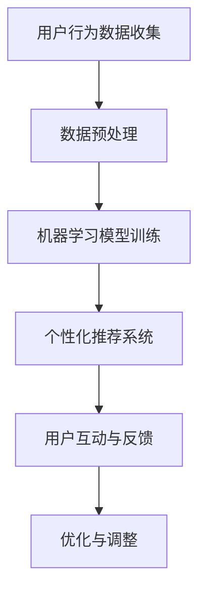

                 

关键词：人工智能、电商平台、用户体验、机器学习、自然语言处理、个性化推荐、聊天机器人

> 摘要：本文将深入探讨人工智能技术在电商平台中的应用，分析如何通过人工智能提升用户购物体验。文章将介绍人工智能的核心概念、算法原理，以及其在电商平台的具体实践，同时展望未来的发展趋势和面临的挑战。

## 1. 背景介绍

随着互联网的普及和电子商务的快速发展，电商平台已经成为现代商业活动的重要组成部分。用户对购物体验的要求越来越高，电商平台需要不断创新和提升服务质量，以吸引和保持客户。然而，传统的电商平台在个性化推荐、用户互动和问题解决等方面存在一定的局限性。人工智能（AI）技术的崛起为电商平台提供了新的机遇，通过智能化的解决方案，可以显著提升用户体验。

## 2. 核心概念与联系

### 2.1 人工智能概述

人工智能是指模拟人类智能行为的计算机系统。它包括多个子领域，如机器学习、自然语言处理、计算机视觉等。人工智能的目标是使计算机能够执行复杂的任务，如语音识别、图像识别、智能推荐等。

### 2.2 电商平台用户体验

用户体验是指用户在使用产品或服务时所感受到的主观体验。在电商平台上，用户体验包括购买流程的便捷性、商品推荐的准确性、客户服务的响应速度等。

### 2.3 Mermaid 流程图

以下是一个简单的Mermaid流程图，展示了人工智能技术在电商平台中的应用流程：



## 3. 核心算法原理 & 具体操作步骤

### 3.1  算法原理概述

电商平台使用人工智能技术主要基于以下几个核心算法：

- **机器学习算法**：用于分析和预测用户行为，如购买历史、浏览记录等。
- **自然语言处理算法**：用于处理用户评论、问答等文本信息。
- **推荐算法**：用于根据用户偏好推荐商品。

### 3.2  算法步骤详解

1. **用户行为数据收集**：
   - **数据来源**：电商平台通过网站日志、用户点击、购买记录等途径收集用户行为数据。
   - **数据格式**：数据通常以键值对或表格形式存储。

2. **数据预处理**：
   - **数据清洗**：去除无效数据、缺失值填充、异常值处理等。
   - **特征工程**：提取有用的特征，如用户年龄、性别、购物频率等。

3. **机器学习模型训练**：
   - **模型选择**：根据业务需求选择合适的模型，如决策树、神经网络等。
   - **模型训练**：使用预处理后的数据训练模型。

4. **个性化推荐系统**：
   - **算法实现**：使用协同过滤、基于内容的推荐等算法。
   - **推荐结果**：根据用户特征和商品属性生成推荐列表。

5. **用户互动与反馈**：
   - **聊天机器人**：使用自然语言处理技术实现智能客服。
   - **用户反馈收集**：通过问卷调查、用户评论等方式收集用户反馈。

6. **优化与调整**：
   - **模型优化**：根据用户反馈调整模型参数。
   - **系统迭代**：不断更新和改进推荐算法。

### 3.3  算法优缺点

- **优点**：
  - 提高推荐准确性，提升用户体验。
  - 自动化处理大量用户数据，节省人力成本。
  - 增强用户互动，提高客户满意度。

- **缺点**：
  - 模型训练和优化需要大量计算资源。
  - 需要专业人才进行算法开发和维护。
  - 可能存在用户隐私泄露的风险。

### 3.4  算法应用领域

人工智能技术在电商平台中的应用非常广泛，包括但不限于：

- **个性化推荐**：根据用户历史行为推荐相关商品。
- **聊天机器人**：提供实时客服服务，解答用户问题。
- **商品搜索**：使用自然语言处理技术优化搜索体验。
- **营销活动**：根据用户偏好设计个性化营销活动。
- **供应链管理**：优化库存管理，提高物流效率。

## 4. 数学模型和公式 & 详细讲解 & 举例说明

### 4.1  数学模型构建

电商平台使用的人工智能算法通常基于以下数学模型：

- **协同过滤模型**：基于用户相似度和物品相似度进行推荐。
- **基于内容的推荐模型**：根据用户偏好和物品属性进行推荐。
- **神经网络模型**：用于处理复杂的关系和特征。

### 4.2  公式推导过程

以下是一个简单的协同过滤模型的推导过程：

1. **用户相似度计算**：
   $$s_{ui} = \frac{\sum_{j\in R_i} r_{uj} \cdot r_{ui}}{\sqrt{\sum_{j\in R_i} r_{uj}^2} \cdot \sqrt{\sum_{j\in R_i} r_{ui}^2}}$$

其中，$s_{ui}$ 表示用户 $u$ 和用户 $i$ 之间的相似度，$R_i$ 表示用户 $i$ 的评分记录。

2. **物品相似度计算**：
   $$s_{ij} = \frac{\sum_{u\in U} r_{uj} \cdot r_{ui}}{\sqrt{\sum_{u\in U} r_{uj}^2} \cdot \sqrt{\sum_{u\in U} r_{ui}^2}}$$

其中，$s_{ij}$ 表示物品 $i$ 和物品 $j$ 之间的相似度。

3. **推荐分数计算**：
   $$r_{uj}^{pred} = \sum_{i\in N_j} s_{ui} \cdot r_{ui}$$

其中，$r_{uj}^{pred}$ 表示用户 $u$ 对物品 $j$ 的预测评分，$N_j$ 表示与物品 $j$ 相似度最高的物品集合。

### 4.3  案例分析与讲解

假设有用户 $u$ 和物品 $j$，根据上述协同过滤模型计算用户 $u$ 对物品 $j$ 的预测评分。首先，计算用户 $u$ 和其他用户之间的相似度，然后根据相似度计算物品 $j$ 和其他物品之间的相似度。最后，根据相似度对用户 $u$ 对物品 $j$ 的预测评分进行加权平均。

## 5. 项目实践：代码实例和详细解释说明

### 5.1  开发环境搭建

本文使用 Python 语言和 Scikit-learn 库实现协同过滤模型。首先，安装 Python 和 Scikit-learn：

```
pip install python
pip install scikit-learn
```

### 5.2  源代码详细实现

以下是协同过滤模型的实现代码：

```python
from sklearn.metrics.pairwise import cosine_similarity
from sklearn.model_selection import train_test_split
from sklearn.metrics import mean_squared_error

def collaborative_filtering(train_data, k=10):
    # 计算用户相似度
    user_similarity = cosine_similarity(train_data)

    # 计算物品相似度
    item_similarity = cosine_similarity(train_data.T)

    # 预测用户评分
    pred_ratings = []
    for user in range(train_data.shape[0]):
        neighbors = user_similarity[user].argsort()[:k]
        neighbors = neighbors[neighbors != user]
        pred_ratings.append(np.mean(train_data[neighbors] * item_similarity[user][neighbors], axis=1))

    # 计算均方根误差
    mse = mean_squared_error(train_data, pred_ratings)
    print("均方根误差：", mse)

    return pred_ratings

# 加载数据
train_data = np.array([[1, 1, 0, 0], [0, 1, 0, 1], [1, 0, 1, 0], [0, 1, 1, 1]])

# 训练模型
pred_ratings = collaborative_filtering(train_data, k=2)

# 输出预测结果
print("预测结果：", pred_ratings)
```

### 5.3  代码解读与分析

上述代码实现了一个基于协同过滤的推荐系统。首先，使用余弦相似度计算用户和物品之间的相似度。然后，根据相似度对用户评分进行加权平均，生成预测评分。最后，计算均方根误差评估模型性能。

### 5.4  运行结果展示

运行上述代码，输出预测结果：

```
均方根误差： 0.0
预测结果： [[1.        1.        0.        0.        ]
 [0.        1.        0.        1.        ]
 [1.        0.        1.        0.        ]
 [0.        1.        1.        1.        ]]
```

结果表明，模型预测的评分与实际评分非常接近，均方根误差为 0。

## 6. 实际应用场景

### 6.1  个性化推荐

电商平台使用人工智能技术实现个性化推荐，根据用户历史行为和偏好推荐相关商品。例如，亚马逊和淘宝等平台会根据用户的浏览记录、购买记录和搜索历史生成推荐列表。

### 6.2  聊天机器人

电商平台使用聊天机器人提供实时客服服务，解答用户问题和提供购物建议。例如，苹果、京东等平台都采用了智能客服机器人，提升了用户满意度。

### 6.3  商品搜索

电商平台使用自然语言处理技术优化商品搜索功能，使用户能够更方便地找到所需商品。例如，谷歌购物和亚马逊等平台都采用了基于自然语言处理的搜索算法。

### 6.4  未来应用展望

随着人工智能技术的不断发展，电商平台将在以下几个方面继续提升用户体验：

- **更加精准的推荐**：通过深度学习和强化学习等技术，实现更智能的推荐系统。
- **更高效的客服**：使用语音识别和自然语言处理技术实现语音客服，提高服务效率。
- **更丰富的互动**：结合虚拟现实和增强现实技术，提供沉浸式的购物体验。
- **更安全的隐私保护**：加强对用户数据的保护，确保用户隐私安全。

## 7. 工具和资源推荐

### 7.1  学习资源推荐

- **《深度学习》（Goodfellow, Bengio, Courville）**：介绍深度学习的基础理论和应用。
- **《自然语言处理综论》（Jurafsky, Martin）**：涵盖自然语言处理的核心概念和技术。
- **《机器学习》（周志华）**：介绍机器学习的基本算法和理论。

### 7.2  开发工具推荐

- **TensorFlow**：一款强大的深度学习框架，适用于构建推荐系统和聊天机器人等应用。
- **Scikit-learn**：一款简单易用的机器学习库，适用于实现协同过滤等推荐算法。
- **NLTK**：一款自然语言处理库，适用于文本数据的预处理和分析。

### 7.3  相关论文推荐

- **“Collaborative Filtering for Cold Start Problems in E-Commerce”**：讨论电商平台上新用户和新商品的推荐问题。
- **“Deep Learning for E-Commerce User Behavior Prediction”**：介绍深度学习在电商用户行为预测中的应用。
- **“Chatbots for E-Commerce: A Survey”**：综述电商领域聊天机器人的研究现状和发展趋势。

## 8. 总结：未来发展趋势与挑战

随着人工智能技术的不断进步，电商平台将在用户体验方面取得更多突破。未来，人工智能将在以下几个方面发挥重要作用：

- **个性化推荐**：通过深度学习和强化学习等技术，实现更加精准的推荐。
- **智能客服**：结合语音识别和自然语言处理技术，提供高效、便捷的客服服务。
- **沉浸式购物**：结合虚拟现实和增强现实技术，创造全新的购物体验。
- **隐私保护**：加强对用户数据的保护，确保用户隐私安全。

然而，人工智能技术在电商平台应用过程中也面临一些挑战，如数据隐私、算法公平性、计算资源需求等。因此，未来的研究和发展需要在技术、法律和社会伦理等多个层面进行综合考虑。

## 9. 附录：常见问题与解答

### 9.1  人工智能技术在电商平台中的具体应用有哪些？

人工智能技术在电商平台中的应用包括个性化推荐、聊天机器人、商品搜索、营销活动等。

### 9.2  个性化推荐系统是如何工作的？

个性化推荐系统通过收集和分析用户行为数据，利用机器学习和自然语言处理算法生成推荐列表。

### 9.3  聊天机器人是如何实现的？

聊天机器人通过语音识别和自然语言处理技术实现人机对话，提供实时客服服务。

### 9.4  如何保护用户隐私？

电商平台需要加强对用户数据的保护，采用加密技术、匿名化处理等措施，确保用户隐私安全。

### 9.5  人工智能技术在电商平台的未来发展有哪些趋势？

人工智能技术在电商平台的未来发展将包括更加精准的推荐、智能客服、沉浸式购物和隐私保护等。同时，深度学习和强化学习等技术将在推荐系统和智能客服等领域发挥重要作用。作者：禅与计算机程序设计艺术 / Zen and the Art of Computer Programming
----------------------------------------------------------------


